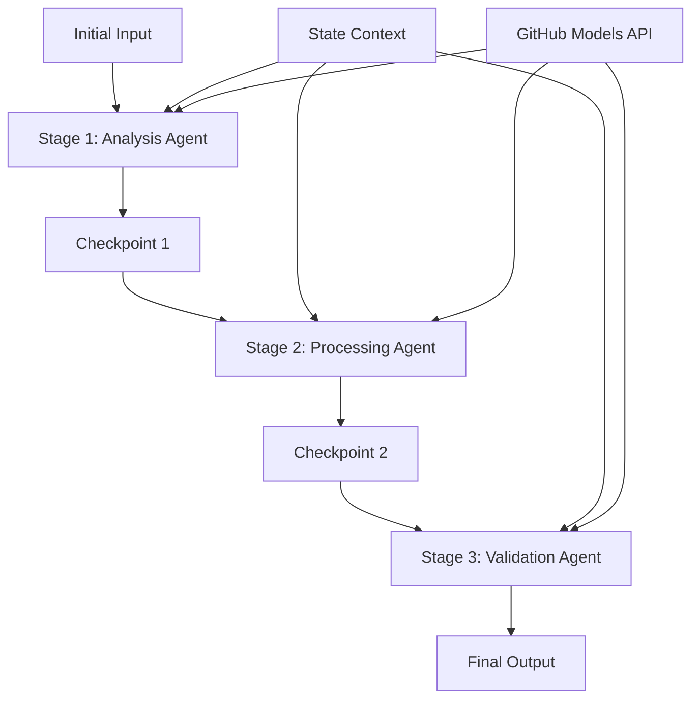

<!--
CO_OP_TRANSLATOR_METADATA:
{
  "original_hash": "1be9c8dcbd79a02d33d2c138684c1394",
  "translation_date": "2025-11-11T13:52:41+00:00",
  "source_file": "08-multi-agent/code_samples/workflows-agent-framework/dotNET/02.dotnet-agent-framework-workflow-ghmodel-sequential.md",
  "language_code": "el"
}
-->
# ⏩ Διαδοχικές Ροές Εργασίας Πρακτόρων με Μοντέλα GitHub (.NET)

## 📋 Προχωρημένο Εκπαιδευτικό Υλικό για Διαδοχική Επεξεργασία

Αυτό το σημειωματάριο παρουσιάζει **μοτίβα διαδοχικής ροής εργασίας** χρησιμοποιώντας το Microsoft Agent Framework για .NET και τα Μοντέλα GitHub. Θα μάθετε πώς να δημιουργείτε εξελιγμένες, βήμα προς βήμα, επεξεργαστικές διαδικασίες όπου οι πράκτορες εκτελούνται με συγκεκριμένη σειρά, με κάθε στάδιο να βασίζεται στα αποτελέσματα του προηγούμενου.

## 🎯 Στόχοι Μάθησης

### 🔄 **Αρχιτεκτονική Διαδοχικής Επεξεργασίας**
- **Σχεδιασμός Γραμμικής Ροής Εργασίας**: Δημιουργία βήμα προς βήμα επεξεργαστικών διαδικασιών με σαφείς εξαρτήσεις
- **Διαχείριση Κατάστασης**: Διατήρηση του πλαισίου και της ροής δεδομένων σε όλα τα στάδια της διαδοχικής ροής εργασίας
- **Ενσωμάτωση Μοντέλων GitHub**: Αξιοποίηση των AI μοντέλων του GitHub σε πολυσταδιακές ροές εργασίας .NET
- **Μοτίβα Επιχειρησιακών Διαδικασιών**: Δημιουργία συστημάτων διαδοχικής επεξεργασίας έτοιμων για παραγωγή

### 🏗️ **Προχωρημένα Διαδοχικά Μοτίβα**
- **Επεξεργασία με Στάδια και Πύλες**: Εφαρμογή σημείων ελέγχου επικύρωσης μεταξύ των σταδίων της ροής εργασίας
- **Διατήρηση Πλαισίου**: Διατήρηση της κατάστασης και της συσσωρευμένης γνώσης σε όλα τα στάδια
- **Διάδοση Σφαλμάτων**: Χειρισμός αποτυχιών με χάρη σε αλυσίδες διαδοχικής επεξεργασίας
- **Βελτιστοποίηση Απόδοσης**: Αποτελεσματική διαδοχική εκτέλεση με ελάχιστο κόστος

### 🏢 **Επιχειρησιακές Διαδοχικές Εφαρμογές**
- **Ροή Επεξεργασίας Εγγράφων**: Πολυσταδιακή ανάλυση, μετασχηματισμός και επικύρωση εγγράφων
- **Ροές Εργασίας Ποιοτικού Ελέγχου**: Διαδοχική ανασκόπηση, επικύρωση και διαδικασίες έγκρισης
- **Ροή Παραγωγής Περιεχομένου**: Έρευνα → Συγγραφή → Επεξεργασία → Ανασκόπηση → Δημοσίευση
- **Αυτοματοποίηση Επιχειρησιακών Διαδικασιών**: Πολυσταδιακές επιχειρησιακές ροές εργασίας με σαφείς εξαρτήσεις σταδίων

## ⚙️ Προαπαιτούμενα & Ρύθμιση

### 📦 **Απαραίτητα Πακέτα NuGet**

Απαραίτητα πακέτα για διαδοχικές ροές εργασίας .NET:

```xml
<!-- Core AI Framework -->
<PackageReference Include="Microsoft.Extensions.AI" Version="9.9.0" />

<!-- Client Model Abstractions -->
<PackageReference Include="System.ClientModel" Version="1.6.1.0" />

<!-- Azure Identity and Async LINQ Support -->
<PackageReference Include="Azure.Identity" Version="1.15.0" />
<PackageReference Include="System.Linq.Async" Version="6.0.3" />

<!-- Local Agent Framework References -->
<!-- Microsoft.Agents.AI.dll - Core agent abstractions -->
<!-- Microsoft.Agents.AI.OpenAI.dll - GitHub Models integration -->
```

### 🔑 **Ρύθμιση Μοντέλων GitHub**

**Ρύθμιση Περιβάλλοντος (.env file):**
```env
GITHUB_TOKEN=your_github_personal_access_token
GITHUB_ENDPOINT=https://models.inference.ai.azure.com
GITHUB_MODEL_ID=gpt-4o-mini
```

**Διαχείριση Ρυθμίσεων:**
```csharp
// Load environment variables securely
Env.Load("../../../.env");
var githubToken = Environment.GetEnvironmentVariable("GITHUB_TOKEN");
var githubEndpoint = Environment.GetEnvironmentVariable("GITHUB_ENDPOINT");
var modelId = Environment.GetEnvironmentVariable("GITHUB_MODEL_ID");
```

### 🏗️ **Αρχιτεκτονική Διαδοχικής Ροής Εργασίας**



**Βασικά Στοιχεία:**
- **Διαδοχικοί Πράκτορες**: Εξειδικευμένοι πράκτορες για κάθε στάδιο επεξεργασίας
- **Πλαίσιο Κατάστασης**: Διατηρεί συσσωρευμένα δεδομένα και αποφάσεις σε όλα τα στάδια
- **Σημεία Ελέγχου**: Σημεία επικύρωσης μεταξύ των σταδίων για εξασφάλιση ποιότητας και συνέπειας
- **Πελάτης Μοντέλων GitHub**: Συνεπής πρόσβαση στα AI μοντέλα σε όλα τα στάδια της ροής εργασίας

## 🎨 **Μοτίβα Σχεδιασμού Διαδοχικής Ροής Εργασίας**

### 📝 **Ροή Επεξεργασίας Εγγράφων**
```
Raw Document → Content Extraction → Analysis → Validation → Structured Output
```

### 🎯 **Ροή Δημιουργίας Περιεχομένου**
```
Brief/Requirements → Research → Content Creation → Review → Final Polish
```

### 🔍 **Ροή Ποιοτικού Ελέγχου**
```
Initial Review → Technical Validation → Compliance Check → Final Approval
```

### 💼 **Ροή Επιχειρηματικής Ευφυΐας**
```
Data Collection → Processing → Analysis → Report Generation → Distribution
```

## 🏢 **Οφέλη Επιχειρησιακής Διαδοχικής Επεξεργασίας**

### 🎯 **Αξιοπιστία & Ποιότητα**
- **Ντετερμινιστική Επεξεργασία**: Συνεπή, επαναλαμβανόμενα αποτελέσματα μέσω δομημένων σταδίων
- **Πύλες Ποιότητας**: Σημεία επικύρωσης εξασφαλίζουν ποιότητα σε κάθε στάδιο
- **Απομόνωση Σφαλμάτων**: Προβλήματα σε ένα στάδιο δεν επηρεάζουν τα επόμενα
- **Ιχνηλασιμότητα**: Πλήρης παρακολούθηση αποφάσεων και μετασχηματισμών σε κάθε στάδιο

### 📈 **Κλιμάκωση & Απόδοση**
- **Μοναδιαίος Σχεδιασμός**: Κάθε στάδιο μπορεί να βελτιστοποιηθεί ανεξάρτητα
- **Διαχείριση Πόρων**: Αποτελεσματική κατανομή πόρων AI μοντέλων σε όλα τα στάδια
- **Βελτιστοποίηση Κατάστασης**: Ελάχιστη μεταφορά κατάστασης μεταξύ των σταδίων για βέλτιστη απόδοση
- **Παράλληλες Ομάδες Σταδίων**: Πολλαπλές διαδοχικές ροές εργασίας μπορούν να εκτελούνται παράλληλα

### 🔒 **Ασφάλεια & Συμμόρφωση**
- **Ασφάλεια Σταδίου**: Διαφορετικές πολιτικές ασφάλειας για διαφορετικά στάδια επεξεργασίας
- **Επικύρωση Δεδομένων**: Εξασφάλιση ακεραιότητας και συμμόρφωσης δεδομένων σε κάθε σημείο ελέγχου
- **Έλεγχος Πρόσβασης**: Λεπτομερή δικαιώματα για διαφορετικά στάδια ροής εργασίας
- **Κανονιστική Συμμόρφωση**: Συμμόρφωση με κανονισμούς μέσω δομημένης επεξεργασίας

### 📊 **Παρακολούθηση & Αναλυτικά Στοιχεία**
- **Μετρήσεις Σταδίου**: Παρακολούθηση απόδοσης για κάθε στάδιο ροής εργασίας
- **Εντοπισμός Στενωμάτων**: Εντοπισμός και βελτιστοποίηση αργών σταδίων
- **Μετρήσεις Ποιότητας**: Παρακολούθηση ποιότητας και ποσοστών επιτυχίας σε κάθε στάδιο
- **Βελτιστοποίηση Διαδικασίας**: Συνεχής βελτίωση βάσει αναλυτικών στοιχείων σταδίου

Ας δημιουργήσουμε ισχυρές διαδοχικές ροές επεξεργασίας AI! 🚀

## 💻 Εκτέλεση Κώδικα

Η πλήρης υλοποίηση είναι διαθέσιμη στο `02.dotnet-agent-framework-workflow-ghmodel-sequential.cs`. Αυτό το αρχείο παρουσιάζει μια **τρισταδιακή ροή ανάλυσης επίπλων**:

1. **Στάδιο 1 - Πράκτορας Πωλήσεων**: Αναλύει εικόνες επίπλων και παρέχει προτάσεις αγοράς
2. **Στάδιο 2 - Πράκτορας Τιμών**: Παρέχει λεπτομερή ανάλυση τιμών και επιλογές προϋπολογισμού
3. **Στάδιο 3 - Πράκτορας Προσφορών**: Δημιουργεί επαγγελματικό έγγραφο προσφοράς σε μορφή Markdown

### 🏗️ **Αρχιτεκτονική Ροής Εργασίας**

```
Image Input → Sales Analysis → Price Estimation → Quote Generation → Final Output
```

Κάθε πράκτορας:
- Λαμβάνει την έξοδο από το προηγούμενο στάδιο ως πλαίσιο
- Βασίζεται στην προηγούμενη ανάλυση με εξειδικευμένη τεχνογνωσία
- Διατηρεί τη συνέχεια της ροής εργασίας μέσω διαχείρισης κατάστασης

### 🚀 Εκτέλεση Παραδείγματος

**Προαπαιτούμενα:**
- Τοποθετήστε μια εικόνα επίπλων στο `../imgs/home.png` (ή ενημερώστε τη μεταβλητή `imgPath`)
- Ρυθμίστε το αρχείο `.env` με τα διαπιστευτήρια των Μοντέλων GitHub

```bash
# Make the script executable (Unix/Linux/macOS)
chmod +x 02.dotnet-agent-framework-workflow-ghmodel-sequential.cs

# Run the sequential workflow
./02.dotnet-agent-framework-workflow-ghmodel-sequential.cs
```

Ή στα Windows:
```powershell
dotnet run 02.dotnet-agent-framework-workflow-ghmodel-sequential.cs
```

### 📝 Αναμενόμενο Αποτέλεσμα

Η ροή εργασίας θα:
1. **Πράκτορας Πωλήσεων**: Εντοπίσει αντικείμενα επίπλων από την εικόνα και παρέχει προτάσεις
2. **Πράκτορας Τιμών**: Προσθέσει λεπτομερή ανάλυση τιμών με επίπεδα προϋπολογισμού και προτάσεις αγορών
3. **Πράκτορας Προσφορών**: Δημιουργήσει ένα μορφοποιημένο έγγραφο προσφοράς με όλες τις πληροφορίες συντεθειμένες

Το τελικό αποτέλεσμα θα είναι μια ολοκληρωμένη, επαγγελματική προσφορά επίπλων βασισμένη στην ανάλυση εικόνας.

### 🔧 Επιλογές Προσαρμογής

**Τροποποίηση Συμπεριφοράς Πρακτόρων:**
```csharp
// Adjust agent instructions to change their focus
const string SalesAgentInstructions = "Your custom instructions...";
```

**Αλλαγή Διαδοχικής Ροής:**
```csharp
// Add or reorder workflow stages
var workflow = new WorkflowBuilder(salesagent)
    .AddEdge(salesagent, priceagent)
    .AddEdge(priceagent, quoteagent)
    .AddEdge(quoteagent, newAgent)  // Add another stage
    .Build();
```

**Χρήση Διαφορετικής Εισόδου:**
```csharp
// Process text instead of images
ChatMessage userMessage = new ChatMessage(ChatRole.User, [
    new TextContent("Analyze pricing for a modern living room set")
]);
```

### 🎯 Εφαρμογές στον Πραγματικό Κόσμο

Αυτό το διαδοχικό μοτίβο είναι ιδανικό για:
- **Ηλεκτρονικό Εμπόριο**: Ανάλυση προϊόντων → Τιμολόγηση → Δημιουργία προσφοράς
- **Ακίνητα**: Ανάλυση ακινήτων → Εκτίμηση → Δημιουργία καταχώρησης
- **Ασφάλιση**: Ανάλυση αξιώσεων → Αξιολόγηση → Δημιουργία προσφοράς
- **Δημιουργία Περιεχομένου**: Έρευνα → Συγγραφή → Επεξεργασία → Δημοσίευση

### 🔍 Κατανόηση Ροής Κατάστασης

Κάθε πράκτορας στη σειρά λαμβάνει:
- **Αρχική Είσοδο**: Το αρχικό μήνυμα χρήστη (εικόνα + κείμενο)
- **Αποτελέσματα Προηγούμενων Πρακτόρων**: Όλες τις προηγούμενες απαντήσεις πρακτόρων στο ιστορικό συνομιλίας
- **Συσσωρευμένο Πλαίσιο**: Πλήρης κατάσταση που διατηρείται καθ' όλη τη διάρκεια της ροής εργασίας

Αυτό επιτρέπει εξελιγμένη πολυσταδιακή επεξεργασία όπου κάθε πράκτορας βασίζεται σε ολοκληρωμένο πλαίσιο από όλα τα προηγούμενα στάδια.

---

<!-- CO-OP TRANSLATOR DISCLAIMER START -->
**Αποποίηση ευθύνης**:  
Αυτό το έγγραφο έχει μεταφραστεί χρησιμοποιώντας την υπηρεσία αυτόματης μετάφρασης [Co-op Translator](https://github.com/Azure/co-op-translator). Παρόλο που καταβάλλουμε προσπάθειες για ακρίβεια, παρακαλούμε να έχετε υπόψη ότι οι αυτόματες μεταφράσεις ενδέχεται να περιέχουν λάθη ή ανακρίβειες. Το πρωτότυπο έγγραφο στη μητρική του γλώσσα θα πρέπει να θεωρείται η αυθεντική πηγή. Για κρίσιμες πληροφορίες, συνιστάται επαγγελματική ανθρώπινη μετάφραση. Δεν φέρουμε ευθύνη για τυχόν παρεξηγήσεις ή εσφαλμένες ερμηνείες που προκύπτουν από τη χρήση αυτής της μετάφρασης.
<!-- CO-OP TRANSLATOR DISCLAIMER END -->