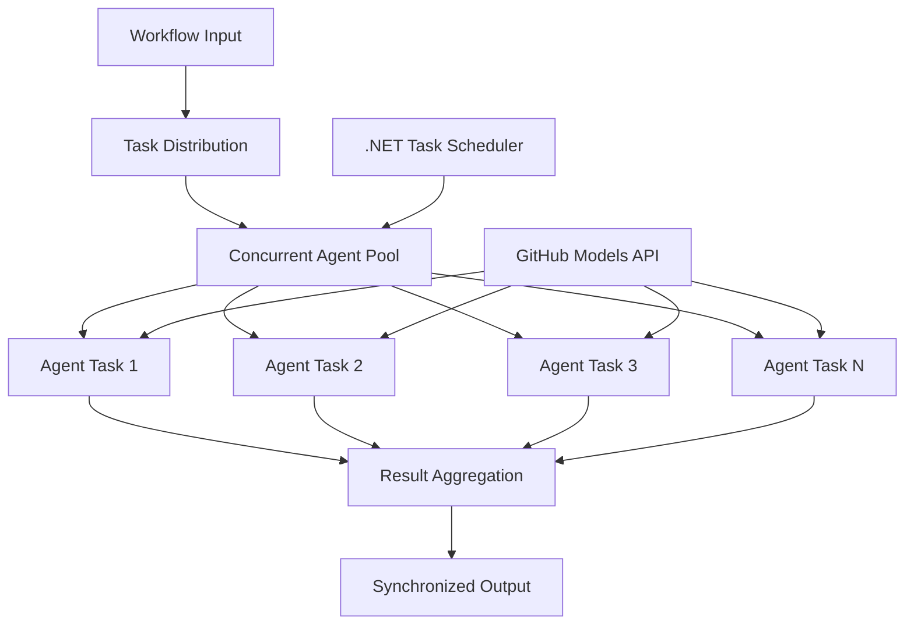

<!--
CO_OP_TRANSLATOR_METADATA:
{
  "original_hash": "b9c6e32c9b5f2fed20b6916984440d88",
  "translation_date": "2025-11-11T13:19:32+00:00",
  "source_file": "08-multi-agent/code_samples/workflows-agent-framework/dotNET/03.dotnet-agent-framework-workflow-ghmodel-concurrent.md",
  "language_code": "el"
}
-->
# ⚡ Παράλληλες Ροές Εργασίας Πρακτόρων με Μοντέλα GitHub (.NET)

## 📋 Εκπαιδευτικό Υλικό Υψηλής Απόδοσης για Παράλληλη Επεξεργασία

Αυτό το σημειωματάριο παρουσιάζει **μοτίβα παράλληλων ροών εργασίας** χρησιμοποιώντας το Microsoft Agent Framework για .NET και τα Μοντέλα GitHub. Θα μάθετε πώς να δημιουργείτε ροές εργασίας υψηλής απόδοσης και παράλληλης επεξεργασίας που μεγιστοποιούν τη διακίνηση δεδομένων εκτελώντας πολλούς πράκτορες AI ταυτόχρονα, διατηρώντας παράλληλα τον συντονισμό και τη συνέπεια των δεδομένων.

## 🎯 Στόχοι Μάθησης

### 🚀 **Βασικές Αρχές Παράλληλης Επεξεργασίας**
- **Παράλληλη Εκτέλεση Πρακτόρων**: Εκτελέστε πολλούς πράκτορες AI ταυτόχρονα για μέγιστη απόδοση
- **Μοτίβα Async/Await**: Χρησιμοποιήστε το ασύγχρονο μοντέλο προγραμματισμού του .NET για αποτελεσματική παράλληλη επεξεργασία
- **Ενσωμάτωση Μοντέλων GitHub**: Συντονίστε πολλαπλές ταυτόχρονες κλήσεις στην υπηρεσία συμπερασμάτων AI του GitHub
- **Διαχείριση Πόρων**: Διαχειριστείτε αποτελεσματικά τους πόρους των μοντέλων AI σε παράλληλες λειτουργίες

### 🏗️ **Προηγμένη Αρχιτεκτονική Παράλληλης Επεξεργασίας**
- **Παράλληλη Επεξεργασία με Βάση Εργασίες**: Χρησιμοποιήστε τη Βιβλιοθήκη Παράλληλων Εργασιών του .NET για βέλτιστη παράλληλη εκτέλεση
- **Μοτίβα Συγχρονισμού**: Συντονίστε παράλληλους πράκτορες αποφεύγοντας τις συνθήκες ανταγωνισμού
- **Εξισορρόπηση Φορτίου**: Κατανεμήστε αποτελεσματικά την εργασία στην διαθέσιμη χωρητικότητα παράλληλης επεξεργασίας
- **Ανοχή Σφαλμάτων**: Αντιμετωπίστε αποτυχίες μεμονωμένων πρακτόρων χωρίς να σταματήσετε ολόκληρη τη ροή εργασίας

### 🏢 **Επιχειρηματικές Εφαρμογές Παράλληλης Επεξεργασίας**
- **Επεξεργασία Εγγράφων Υψηλού Όγκου**: Επεξεργαστείτε πολλαπλά έγγραφα ταυτόχρονα
- **Ανάλυση Περιεχομένου σε Πραγματικό Χρόνο**: Παράλληλη ανάλυση εισερχόμενων ροών δεδομένων
- **Βελτιστοποίηση Μαζικής Επεξεργασίας**: Μεγιστοποιήστε τη διακίνηση δεδομένων για λειτουργίες επεξεργασίας μεγάλης κλίμακας
- **Πολυτροπική Ανάλυση**: Παράλληλη επεξεργασία διαφορετικών τύπων και μορφών περιεχομένου

## ⚙️ Προαπαιτούμενα & Ρύθμιση

### 📦 **Απαραίτητα Πακέτα NuGet**

Απαραίτητα πακέτα για ροές εργασίας υψηλής απόδοσης:

```xml
<!-- Core AI Framework with Async Support -->
<PackageReference Include="Microsoft.Extensions.AI" Version="9.9.0" />

<!-- Client Model Abstractions for API Communication -->
<PackageReference Include="System.ClientModel" Version="1.6.1.0" />

<!-- Azure Identity and Async LINQ for Advanced Operations -->
<PackageReference Include="Azure.Identity" Version="1.15.0" />
<PackageReference Include="System.Linq.Async" Version="6.0.3" />

<!-- Local Agent Framework References -->
<!-- Microsoft.Agents.AI.dll - Core agent abstractions with async support -->
<!-- Microsoft.Agents.AI.OpenAI.dll - GitHub Models integration with concurrency -->
```

### 🔑 **Ρύθμιση Μοντέλων GitHub**

**Ρύθμιση Περιβάλλοντος (.env file):**
```env
GITHUB_TOKEN=your_github_personal_access_token
GITHUB_ENDPOINT=https://models.inference.ai.azure.com
GITHUB_MODEL_ID=gpt-4o-mini
```

**Σκέψεις για Παράλληλη Επεξεργασία:**
```csharp
// Configure for concurrent operations
var clientOptions = new OpenAIClientOptions()
{
    Endpoint = new Uri(githubEndpoint),
    // Configure connection pooling for concurrent requests
    NetworkTimeout = TimeSpan.FromMinutes(5)
};
```

### 🏗️ **Αρχιτεκτονική Παράλληλης Ροής Εργασίας**



**Βασικά Στοιχεία:**
- **Βιβλιοθήκη Παράλληλων Εργασιών**: Ενσωματωμένη υποστήριξη του .NET για παράλληλες λειτουργίες
- **Πισίνα Πρακτόρων**: Πολλαπλές περιπτώσεις πρακτόρων για παράλληλη επεξεργασία
- **Συγκέντρωση Αποτελεσμάτων**: Συντονισμός και συγχώνευση των αποτελεσμάτων των παράλληλων πρακτόρων
- **Σημεία Συγχρονισμού**: Εξασφάλιση συνέπειας δεδομένων σε παράλληλες λειτουργίες

## 🎨 **Μοτίβα Σχεδιασμού Παράλληλης Ροής Εργασίας**

### 🔍 **Παράλληλη Έρευνα & Ανάλυση**
```
Research Topic → Concurrent Research Agents → Result Synthesis → Final Report
```

### 📊 **Επεξεργασία Δεδομένων από Πολλαπλές Πηγές**
```
Data Sources → Parallel Processing Agents → Data Integration → Unified Output
```

### 🎭 **Αγωγός Δημιουργίας Περιεχομένου**
```
Content Requirements → Concurrent Content Generators → Quality Review → Final Content
```

### 🔄 **Επεξεργασία Fan-Out/Fan-In**
```
Single Input → Multiple Concurrent Processors → Result Aggregation → Single Output
```

## 🏢 **Οφέλη Απόδοσης για Επιχειρήσεις**

### ⚡ **Διακίνηση & Επεκτασιμότητα**
- **Γραμμική Κλιμάκωση Απόδοσης**: Προσθέστε περισσότερους παράλληλους πράκτορες για αύξηση της διακίνησης
- **Αξιοποίηση Πόρων**: Μέγιστη αποτελεσματικότητα της διαθέσιμης χωρητικότητας μοντέλων AI
- **Μείωση Χρόνου Επεξεργασίας**: Σημαντική μείωση χρόνου μέσω παράλληλης εκτέλεσης
- **Ελαστική Κλιμάκωση**: Δυναμική προσαρμογή του αριθμού των παράλληλων πρακτόρων ανάλογα με το φόρτο εργασίας

### 🛡️ **Αξιοπιστία & Ανθεκτικότητα**
- **Απομόνωση Σφαλμάτων**: Οι αποτυχίες μεμονωμένων πρακτόρων δεν επηρεάζουν άλλες παράλληλες λειτουργίες
- **Ομαλή Υποβάθμιση**: Το σύστημα συνεχίζει να λειτουργεί με μειωμένη χωρητικότητα πρακτόρων
- **Ανάκτηση Σφαλμάτων**: Αυτόματοι μηχανισμοί επαναπροσπάθειας για αποτυχημένες παράλληλες λειτουργίες
- **Κατανομή Φορτίου**: Ομοιόμορφη κατανομή της εργασίας στους διαθέσιμους πράκτορες

### 📊 **Παρακολούθηση Απόδοσης**
- **Μετρήσεις Παράλληλης Εκτέλεσης**: Παρακολουθήστε την απόδοση όλων των παράλληλων λειτουργιών
- **Ανάλυση Χρήσης Πόρων**: Παρακολουθήστε τη χρήση CPU, μνήμης και δικτύου
- **Ανάλυση Διακίνησης**: Μετρήστε τα κέρδη απόδοσης από την παράλληλη επεξεργασία
- **Ανίχνευση Στενωμάτων**: Εντοπίστε και επιλύστε περιορισμούς απόδοσης

### 🔧 **Ανάπτυξη & Λειτουργίες**
- **Ασύγχρονο Μοντέλο Προγραμματισμού**: Χρησιμοποιήστε τα ώριμα μοτίβα async/await του .NET
- **Συντονισμός Εργασιών**: Ενσωματωμένες δυνατότητες διαχείρισης και συντονισμού εργασιών
- **Διαχείριση Εξαιρέσεων**: Ολοκληρωμένη διαχείριση σφαλμάτων για παράλληλες λειτουργίες
- **Υποστήριξη Εντοπισμού Σφαλμάτων**: Εργαλεία εντοπισμού σφαλμάτων του Visual Studio για παράλληλες ροές εργασίας

Ας δημιουργήσουμε ροές εργασίας AI υψηλής απόδοσης με .NET! 🚀

## 💻 Εκτέλεση του Κώδικα

Η πλήρης υλοποίηση είναι διαθέσιμη στο `03.dotnet-agent-framework-workflow-ghmodel-concurrent.cs`. Αυτό το αρχείο παρουσιάζει μια **Fan-Out/Fan-In παράλληλη ροή εργασίας** για τον προγραμματισμό ταξιδιών:

### 🏗️ **Αρχιτεκτονική Ροής Εργασίας**

```
User Request → ConcurrentStartExecutor → [Researcher Agent || Planner Agent] → ConcurrentAggregationExecutor → Final Output
```

**Βασικά Στοιχεία:**

1. **ConcurrentStartExecutor**: Μεταδίδει το αίτημα του χρήστη σε όλους τους πράκτορες ταυτόχρονα
2. **Researcher Agent**: Αναλύει προορισμούς και αξιοθέατα παράλληλα
3. **Planner Agent**: Δημιουργεί λεπτομερή σχέδια ταξιδιού παράλληλα
4. **ConcurrentAggregationExecutor**: Συλλέγει και συγχωνεύει αποτελέσματα από τους δύο πράκτορες

### 🎯 **Μοτίβο Fan-Out/Fan-In**

Αυτή η ροή εργασίας παρουσιάζει το κλασικό μοτίβο **Fan-Out/Fan-In**:
- **Fan-Out**: Ένα μήνυμα εισόδου μεταδίδεται σε πολλούς πράκτορες ταυτόχρονα
- **Παράλληλη Επεξεργασία**: Πολλοί πράκτορες εργάζονται παράλληλα στην ίδια εργασία
- **Fan-In**: Τα αποτελέσματα από όλους τους πράκτορες συλλέγονται και συγχωνεύονται σε μία έξοδο

### 🚀 Εκτέλεση του Παραδείγματος

```bash
# Make the script executable (Unix/Linux/macOS)
chmod +x 03.dotnet-agent-framework-workflow-ghmodel-concurrent.cs

# Run the concurrent workflow
./03.dotnet-agent-framework-workflow-ghmodel-concurrent.cs
```

Ή στα Windows:
```powershell
dotnet run 03.dotnet-agent-framework-workflow-ghmodel-concurrent.cs
```

### 📝 Αναμενόμενη Έξοδος

Η ροή εργασίας θα:
1. **Μεταδώσει Αίτημα**: Στείλει "Σχεδίασε ένα ταξίδι στο Σιάτλ τον Δεκέμβριο" και στους δύο πράκτορες
2. **Παράλληλη Επεξεργασία**: Και οι δύο πράκτορες εργάζονται ταυτόχρονα:
   - Ο Researcher εντοπίζει αξιοθέατα και λεπτομέρειες
   - Ο Planner δημιουργεί δρομολόγιο και λογιστικά σχέδια
3. **Συγκέντρωση**: Συνδυάζει και τις δύο απαντήσεις σε μια ολοκληρωμένη έξοδο
4. **Εμφάνιση Αποτελεσμάτων**: Παρουσιάζει το συγχωνευμένο σχέδιο ταξιδιού με όλες τις πληροφορίες

### 🔧 Επιλογές Προσαρμογής

**Προσθήκη Περισσότερων Παράλληλων Πρακτόρων:**
```csharp
// Create additional specialized agents
AIAgent budgetAgent = openAIClient.GetChatClient(github_model_id).CreateAIAgent(
    name: "Budget-Agent", instructions: "Calculate travel costs...");

// Add to fan-out
var workflow = new WorkflowBuilder(startExecutor)
    .AddFanOutEdge(startExecutor, targets: [researcherAgent, plannerAgent, budgetAgent])
    .AddFanInEdge(aggregationExecutor, sources: [researcherAgent, plannerAgent, budgetAgent])
    .WithOutputFrom(aggregationExecutor)
    .Build();

// Update aggregation count
if (this._messages.Count == 3) { ... }
```

**Τροποποίηση Οδηγιών Πρακτόρων:**
```csharp
const string ResearcherAgentInstructions = "Your custom instructions for research...";
const string PlanAgentInstructions = "Your custom instructions for planning...";
```

**Αλλαγή Εργασίας:**
```csharp
StreamingRun run = await InProcessExecution.StreamAsync(
    workflow, 
    "Plan a European vacation for 2 weeks in summer"
);
```

### 🎯 Εφαρμογές στον Πραγματικό Κόσμο

Αυτό το μοτίβο παράλληλης επεξεργασίας είναι ιδανικό για:
- **Δημιουργία Περιεχομένου**: Πολλοί συγγραφείς δημιουργούν διαφορετικά τμήματα ταυτόχρονα
- **Ανασκόπηση Κώδικα**: Πολλοί αναθεωρητές αναλύουν τον κώδικα από διαφορετικές οπτικές γωνίες
- **Έρευνα Αγοράς**: Παράλληλη ανάλυση διαφορετικών τμημάτων της αγοράς
- **Επεξεργασία Εγγράφων**: Παράλληλη εξαγωγή, ανάλυση και επικύρωση
- **Ανάλυση Πολλαπλών Οπτικών**: Λήψη διαφορετικών απόψεων για την ίδια είσοδο

### 🔍 Κατανόηση Προσαρμοσμένων Εκτελεστών

**ConcurrentStartExecutor:**
- Υλοποιεί το `IMessageHandler<string>` για να δέχεται είσοδο τύπου string
- Μεταδίδει μηνύματα σε όλους τους συνδεδεμένους πράκτορες
- Στέλνει `TurnToken` για να ενεργοποιήσει την παράλληλη επεξεργασία

**ConcurrentAggregationExecutor:**
- Υλοποιεί το `IMessageHandler<ChatMessage>` για να λαμβάνει απαντήσεις πρακτόρων
- Συλλέγει μηνύματα με ασφαλή τρόπο για πολλαπλά νήματα
- Συγκεντρώνει όταν φτάσουν όλες οι αναμενόμενες απαντήσεις
- Παρέχει την τελική έξοδο χρησιμοποιώντας το `context.YieldOutputAsync()`

### ⚡ Οφέλη Απόδοσης

**Παράλληλη vs Σειριακή Επεξεργασία:**
- Σειριακή: Πράκτορας1 (30s) → Πράκτορας2 (30s) = **60 δευτερόλεπτα συνολικά**
- Παράλληλη: Πράκτορας1 (30s) || Πράκτορας2 (30s) = **30 δευτερόλεπτα συνολικά**

**Βελτίωση διακίνησης**: Έως και N× ταχύτερα για N παράλληλους πράκτορες (ανάλογα με το φόρτο εργασίας και τους πόρους)

### 🛡️ Διαχείριση Σφαλμάτων

Η ροή εργασίας διαχειρίζεται τις αποτυχίες μεμονωμένων πρακτόρων με ευελιξία:
- Εάν ένας πράκτορας αποτύχει, οι υπόλοιποι συνεχίζουν την επεξεργασία
- Ο συγκεντρωτής μπορεί να υλοποιήσει λογική χρονικού ορίου
- Μπορούν να επιστραφούν μερικά αποτελέσματα αν χρειαστεί

### 📊 Προηγμένες Δυνατότητες

**Δυναμικός Αριθμός Πρακτόρων:**
Τροποποιήστε τη λογική συγκέντρωσης για να υποστηρίξετε μεταβλητό αριθμό πρακτόρων:

```csharp
private int _expectedAgentCount;
private readonly List<ChatMessage> _messages = [];

public async ValueTask HandleAsync(ChatMessage message, IWorkflowContext context)
{
    this._messages.Add(message);
    if (this._messages.Count == _expectedAgentCount)
    {
        // Process aggregation
    }
}
```

Αυτό το μοτίβο παράλληλης ροής εργασίας είναι απαραίτητο για τη δημιουργία συστημάτων πρακτόρων AI υψηλής απόδοσης και επεκτασιμότητας!

---

<!-- CO-OP TRANSLATOR DISCLAIMER START -->
**Αποποίηση ευθύνης**:  
Αυτό το έγγραφο έχει μεταφραστεί χρησιμοποιώντας την υπηρεσία μετάφρασης AI [Co-op Translator](https://github.com/Azure/co-op-translator). Παρόλο που καταβάλλουμε προσπάθειες για ακρίβεια, παρακαλούμε να έχετε υπόψη ότι οι αυτοματοποιημένες μεταφράσεις ενδέχεται να περιέχουν λάθη ή ανακρίβειες. Το πρωτότυπο έγγραφο στη μητρική του γλώσσα θα πρέπει να θεωρείται η αυθεντική πηγή. Για κρίσιμες πληροφορίες, συνιστάται επαγγελματική ανθρώπινη μετάφραση. Δεν φέρουμε ευθύνη για τυχόν παρεξηγήσεις ή εσφαλμένες ερμηνείες που προκύπτουν από τη χρήση αυτής της μετάφρασης.
<!-- CO-OP TRANSLATOR DISCLAIMER END -->