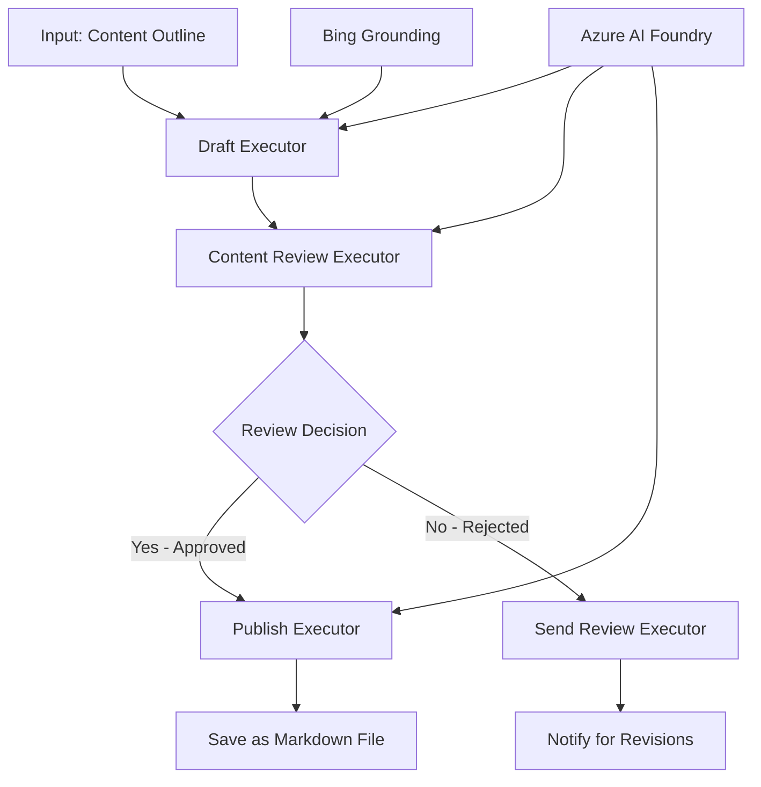

<!--
CO_OP_TRANSLATOR_METADATA:
{
  "original_hash": "8abd335151cee553293b637ee3d80d10",
  "translation_date": "2025-11-11T12:16:39+00:00",
  "source_file": "08-multi-agent/code_samples/workflows-agent-framework/dotNET/04.dotnet-agent-framework-workflow-aifoundry-condition.md",
  "language_code": "el"
}
-->
# 🔀 Συνθήκες Ροής Εργασίας με το Azure AI Foundry (.NET)

## 📋 Εκπαιδευτικό Υλικό για Ροές Εργασίας Βασισμένες σε Αποφάσεις

Αυτό το σημειωματάριο παρουσιάζει **πρότυπα συνθηκών ροής εργασίας** χρησιμοποιώντας το Azure AI Foundry και το Microsoft Agent Framework για .NET. Θα μάθετε πώς να δημιουργείτε εξελιγμένες, βασισμένες σε αποφάσεις ροές εργασίας που κατευθύνουν έξυπνα την επεξεργασία βάσει ανάλυσης AI, επιχειρηματικών κανόνων και δυναμικών συνθηκών για αυτοματοποίηση επιπέδου επιχείρησης.

## 🎯 Στόχοι Μάθησης

### 🧠 **Αρχιτεκτονική Έξυπνων Αποφάσεων**
- **Υλοποίηση Συνθηκών Λογικής**: Δημιουργία σύνθετων δέντρων αποφάσεων με πολλαπλά σημεία διακλάδωσης
- **Δρομολόγηση με Υποστήριξη AI**: Χρήση μοντέλων του Azure AI Foundry για έξυπνες αποφάσεις δρομολόγησης
- **Δυναμική Προσαρμογή Ροής Εργασίας**: Τροποποίηση της συμπεριφοράς της ροής εργασίας βάσει ανάλυσης και συνθηκών κατά την εκτέλεση
- **Ενσωμάτωση Επιχειρηματικών Κανόνων**: Ενσωμάτωση επιχειρηματικής λογικής και απαιτήσεων συμμόρφωσης στις ροές εργασίας

### 🔀 **Προηγμένα Πρότυπα Συνθηκών**
- **Αποφάσεις Πολλαπλών Κριτηρίων**: Αξιολόγηση πολλαπλών παραγόντων για αποφάσεις δρομολόγησης
- **Επεξεργασία με Επίγνωση Συμφραζομένων**: Λήψη αποφάσεων βάσει συσσωρευμένων συμφραζομένων και ιστορικού ροής εργασίας
- **Προσαρμογή Ροής Εργασίας**: Δυναμική προσαρμογή μονοπατιών επεξεργασίας βάσει συνθηκών σε πραγματικό χρόνο
- **Ενσωμάτωση Μηχανών Κανόνων**: Υλοποίηση εξελιγμένων μηχανών επιχειρηματικών κανόνων στις ροές εργασίας

### 🏢 **Εφαρμογές Συνθηκών Επιχειρηματικού Επιπέδου**
- **Ταξινόμηση & Δρομολόγηση Εγγράφων**: Αυτόματη ταξινόμηση και δρομολόγηση εγγράφων στις κατάλληλες ροές εργασίας
- **Διαχείριση Εξυπηρέτησης Πελατών**: Έξυπνη δρομολόγηση αιτημάτων πελατών σε εξειδικευμένες ομάδες
- **Επεξεργασία Συμμόρφωσης & Κινδύνου**: Εφαρμογή διαφορετικών διαδικασιών επαλήθευσης και αναθεώρησης βάσει αξιολόγησης κινδύνου
- **Ροές Εργασίας Ποιοτικού Ελέγχου**: Δρομολόγηση περιεχομένου μέσω κατάλληλων διαδικασιών αναθεώρησης βάσει ποιοτικών μετρήσεων

## ⚙️ Προαπαιτούμενα & Ρύθμιση

### 📦 **Απαραίτητα Πακέτα NuGet**

Προηγμένα πακέτα για επεξεργασία συνθηκών ροής εργασίας:

```xml
<!-- Core AI Framework -->
<PackageReference Include="Microsoft.Extensions.AI" Version="9.9.0" />

<!-- Azure AI Agents with Persistent State -->
<PackageReference Include="Azure.AI.Agents.Persistent" Version="1.2.0-beta.5" />

<!-- Azure Identity and Utilities -->
<PackageReference Include="Azure.Identity" Version="1.15.0" />
<PackageReference Include="System.Linq.Async" Version="6.0.3" />
<PackageReference Include="DotNetEnv" Version="3.1.1" />

<!-- Local Workflow Framework References -->
<!-- Microsoft.Agents.Workflows.dll - Advanced workflow orchestration -->
<!-- Microsoft.Agents.AI.AzureAI.dll - Azure AI Foundry integration -->
<!-- Microsoft.Agents.AI.dll - Core agent abstractions -->
```

### 🔑 **Ρύθμιση του Azure AI Foundry**

**Απαραίτητοι Πόροι Azure:**
- Χώρος εργασίας του Azure AI Foundry με μοντέλα επεξεργασίας συνθηκών
- Συνδρομή Azure με κατάλληλα όρια υπολογισμού και δικαιώματα
- Εγκατεστημένα μοντέλα AI για λήψη αποφάσεων και ανάλυση περιεχομένου
- (Προαιρετικά) Σύνδεση Bing Search API για δυνατότητες αναζήτησης

**Ρύθμιση Περιβάλλοντος (.env file):**
```env
# Azure AI Foundry Configuration
AZURE_AI_PROJECT_ENDPOINT=https://your-project.cognitiveservices.azure.com/
BING_CONNECTION_ID=your-bing-connection-id
```

**Ρύθμιση Αυθεντικοποίησης:**
```csharp
// Azure CLI or Managed Identity authentication
using Azure.Identity;
var credential = new AzureCliCredential();

// Load environment configuration
DotNetEnv.Env.Load("../../../.env");
```

### 🏗️ **Αρχιτεκτονική Ροής Εργασίας με Συνθήκες**



**Κύρια Στοιχεία:**
- **Draft Executor**: Πράκτορας AI που δημιουργεί αρχικά προσχέδια περιεχομένου από περιγράμματα
- **Content Review Executor**: Πράκτορας AI που αξιολογεί την ποιότητα και τη συμμόρφωση των προσχεδίων
- **Conditional Routing**: Λογική αποφάσεων που δρομολογεί βάσει αποτελεσμάτων αναθεώρησης
- **Publish/Review Paths**: Ξεχωριστά μονοπάτια επεξεργασίας για εγκεκριμένο και απορριφθέν περιεχόμενο
- **Διαχείριση Κατάστασης**: Διατήρηση συμφραζομένων και ιστορικού αναθεώρησης καθ' όλη τη διάρκεια της ροής εργασίας

## 🎨 **Πρότυπα Σχεδιασμού Ροής Εργασίας με Συνθήκες**

### 📋 **Παραγωγή Περιεχομένου με Ποιοτικά Όρια**
```
Outline → Draft Creation → Quality Review → {Approve: Publish | Reject: Revise}
```

### 🎯 **Επεξεργασία Εγγράφων Βάσει Κινδύνου**
```
Document → Risk Assessment → {Low: Standard | High: Enhanced Review}
```

### 🔍 **Έξυπνη Δρομολόγηση Εξυπηρέτησης Πελατών**
```
Customer Query → Analysis → {Simple: FAQ Bot | Complex: Human Agent}
```

### 💼 **Ροές Εργασίας Βασισμένες στη Συμμόρφωση**
```
Content → Compliance Check → {Pass: Publish | Fail: Legal Review}
```

## 🏢 **Οφέλη Συνθηκών Επιχειρηματικού Επιπέδου**

### 🎯 **Έξυπνη Αυτοματοποίηση**
- **Έξυπνη Λήψη Αποφάσεων**: Αποφάσεις δρομολόγησης με υποστήριξη AI βάσει ανάλυσης περιεχομένου και συμφραζομένων
- **Προσαρμοσμένη Επεξεργασία**: Ροές εργασίας που προσαρμόζονται αυτόματα βάσει μεταβαλλόμενων συνθηκών
- **Επιβολή Επιχειρηματικών Κανόνων**: Αυτόματη εφαρμογή σύνθετης επιχειρηματικής λογικής και πολιτικών
- **Δρομολόγηση με Επίγνωση Συμφραζομένων**: Αποφάσεις βάσει πλήρους ιστορικού ροής εργασίας και συσσωρευμένων συμφραζομένων

### 📈 **Λειτουργική Αριστεία**
- **Βελτιστοποιημένη Κατανομή Πόρων**: Δρομολόγηση εργασίας στους πιο κατάλληλους ειδικούς και διαδικασίες
- **Μειωμένη Χειροκίνητη Παρέμβαση**: Η αυτοματοποιημένη λήψη αποφάσεων ελαχιστοποιεί την ανάγκη για ανθρώπινη δρομολόγηση
- **Ταχύτεροι Χρόνοι Επίλυσης**: Άμεση δρομολόγηση στην κατάλληλη εξειδίκευση και δυνατότητες επεξεργασίας
- **Συνεπής Εφαρμογή**: Ομοιόμορφη εφαρμογή επιχειρηματικών κανόνων και κριτηρίων αποφάσεων

### 🛡️ **Διαχείριση Κινδύνου & Συμμόρφωσης**
- **Αυτοματοποιημένη Αξιολόγηση Κινδύνου**: Αξιολόγηση κινδύνου περιεχομένου και καταστάσεων με υποστήριξη AI
- **Επιβολή Συμμόρφωσης**: Αυτόματη δρομολόγηση μέσω απαιτούμενων διαδικασιών κανονιστικής συμμόρφωσης
- **Εφαρμογή Πρωτοκόλλων Ασφαλείας**: Ενισχυμένα μέτρα ασφαλείας βάσει αξιολόγησης κινδύνου
- **Διατήρηση Ιστορικού Ελέγχου**: Πλήρης τεκμηρίωση αποφάσεων δρομολόγησης και αιτιολογίας

### 📊 **Αναλύσεις & Συνεχής Βελτίωση**
- **Αναλύσεις Αποφάσεων**: Παρακολούθηση αποτελεσματικότητας και ακρίβειας αποφάσεων δρομολόγησης
- **Αναγνώριση Προτύπων**: Εντοπισμός τάσεων και προτύπων στις αποφάσεις δρομολόγησης με την πάροδο του χρόνου
- **Βελτιστοποίηση Απόδοσης**: Συνεχής βελτίωση κριτηρίων αποφάσεων και αποτελεσματικότητας δρομολόγησης
- **Επιχειρηματική Ευφυΐα**: Εσωτερικές πληροφορίες για χαρακτηριστικά περιεχομένου και απαιτήσεις επεξεργασίας

### 🔧 **Τεχνική Αριστεία**
- **Διαχείριση Κατάστασης**: Διατήρηση σύνθετης κατάστασης κατά την εκτέλεση της ροής εργασίας
- **Κλιμακούμενη Αρχιτεκτονική**: Διαχείριση απαιτήσεων επεξεργασίας συνθηκών υψηλού όγκου
- **Δυνατότητες Ενσωμάτωσης**: Απρόσκοπτη ενσωμάτωση με υπάρχοντα επιχειρηματικά συστήματα και διαδικασίες
- **Παρακολούθηση & Παρατηρησιμότητα**: Ολοκληρωμένη παρακολούθηση απόδοσης ροής εργασίας και αποφάσεων

Ας δημιουργήσουμε έξυπνες, βασισμένες σε αποφάσεις ροές εργασίας για επιχειρήσεις με .NET! 🚀

## 💻 Εκτέλεση του Κώδικα

Η πλήρης υλοποίηση είναι διαθέσιμη στο `04.dotnet-agent-framework-workflow-aifoundry-condition.cs`. Αυτό παρουσιάζει μια **ροή εργασίας παραγωγής περιεχομένου με ποιοτικά όρια**:

### 🏗️ **Αρχιτεκτονική Ροής Εργασίας**

```
Content Outline → Draft Creation → Quality Review → Conditional Routing:
                                                      ├─ Approved (>200 words) → Publish
                                                      └─ Rejected (<200 words) → Review Notification
```

**Πράκτορες στη Ροή Εργασίας:**
1. **Evangelist Agent**: Δημιουργεί προσχέδια εκπαιδευτικών υλικών από περιγράμματα με υποστήριξη Bing
2. **Content Reviewer Agent**: Αξιολογεί την ποιότητα του προσχεδίου (αριθμός λέξεων, πληρότητα)
3. **Publisher Agent**: Αποθηκεύει εγκεκριμένο περιεχόμενο ως αρχεία Markdown με χρονοσήμανση

**Εξατομικευμένοι Εκτελεστές:**
1. **DraftExecutor**: Οργανώνει τη δημιουργία προσχεδίων
2. **ContentReviewExecutor**: Διενεργεί αξιολόγηση ποιότητας
3. **PublishExecutor**: Διαχειρίζεται τη δημοσίευση εγκεκριμένου περιεχομένου
4. **SendReviewExecutor**: Διαχειρίζεται ειδοποιήσεις για απορριφθέν περιεχόμενο

### 🚀 Εκτέλεση του Παραδείγματος

**Προαπαιτούμενα:**
- Ρυθμισμένος χώρος εργασίας του Azure AI Foundry
- Αυθεντικοποίηση μέσω Azure CLI (`az login`)
- (Προαιρετικά) Σύνδεση Bing Search για υποστήριξη αναζήτησης

```bash
# Make the script executable (Unix/Linux/macOS)
chmod +x 04.dotnet-agent-framework-workflow-aifoundry-condition.cs

# Run the conditional workflow
./04.dotnet-agent-framework-workflow-aifoundry-condition.cs
```

Ή στα Windows:
```powershell
dotnet run 04.dotnet-agent-framework-workflow-aifoundry-condition.cs
```

### 📝 Αναμενόμενο Αποτέλεσμα

Η ροή εργασίας θα:
1. **Δημιουργήσει Πράκτορες**: Αρχικοποιήσει τρεις εξειδικευμένους πράκτορες του Azure AI Foundry
2. **Δημιουργήσει Προσχέδιο**: Ο πράκτορας Evangelist δημιουργεί προσχέδιο εκπαιδευτικού υλικού από περίγραμμα
3. **Αναθεωρήσει Περιεχόμενο**: Ο Content Reviewer αξιολογεί την ποιότητα του προσχεδίου
4. **Δρομολόγηση με Συνθήκες**:
   - **Αν εγκριθεί (>200 λέξεις)**: Ο PublishExecutor αποθηκεύει ως αρχείο Markdown
   - **Αν απορριφθεί (<200 λέξεις)**: Ο SendReviewExecutor στέλνει ειδοποίηση αναθεώρησης
5. **Εμφανίσει Αποτελέσματα**: Εμφανίσει το τελικό αποτέλεσμα της ροής εργασίας

### 🔧 Επιλογές Εξατομίκευσης

**Τροποποίηση Κριτηρίων Αναθεώρησης:**
```csharp
const string ContentReviewerInstructions = @"
You are a content reviewer...
1. Check if content is more than 500 words (instead of 200)
2. Verify technical accuracy
3. Ensure proper formatting
...";
```

**Προσθήκη Περισσότερων Συνθηκών Δρομολόγησης:**
```csharp
var workflow = new WorkflowBuilder(draftExecutor)
    .AddEdge(draftExecutor, contentReviewerExecutor)
    .AddEdge(contentReviewerExecutor, publishExecutor, condition: GetCondition("Excellent"))
    .AddEdge(contentReviewerExecutor, editExecutor, condition: GetCondition("Good"))
    .AddEdge(contentReviewerExecutor, sendReviewerExecutor, condition: GetCondition("Poor"))
    .Build();
```

**Αλλαγή Απαιτήσεων Περιεχομένου:**
```csharp
string OUTLINE_Content = @"
# Your Custom Topic
## Section 1
https://your-reference-url
## Section 2
...
";
```

### 🎯 Εφαρμογές στον Πραγματικό Κόσμο

Αυτό το πρότυπο ροής εργασίας με συνθήκες είναι ιδανικό για:
- **Συστήματα Διαχείρισης Περιεχομένου**: Αυτοματοποιημένες εκδοτικές ροές εργασίας με ποιοτικά όρια
- **Επεξεργασία Εγγράφων**: Δρομολόγηση εγγράφων βάσει ταξινόμησης και συμμόρφωσης
- **Υποστήριξη Πελατών**: Έξυπνη δρομολόγηση αιτημάτων βάσει πολυπλοκότητας και επείγοντος
- **Νομική Αναθεώρηση**: Δρομολόγηση συμβολαίων βάσει αξιολόγησης κινδύνου και αξίας
- **Διαδικασίες Ανθρώπινου Δυναμικού**: Δρομολόγηση αιτήσεων μέσω κατάλληλων διαδικασιών αξιολόγησης

### 🔍 Κατανόηση Λογικής Συνθηκών

**Συνάρτηση Συνθηκών:**
```csharp
public Func<object?, bool> GetCondition(string expectedResult) =>
    reviewResult => reviewResult is ReviewResult review && review.Result == expectedResult;
```

Αυτή η συνάρτηση δημιουργεί ένα κριτήριο που:
1. Ελέγχει αν το αποτέλεσμα είναι τύπου `ReviewResult`
2. Συγκρίνει την ιδιότητα `Result` με την αναμενόμενη τιμή
3. Επιστρέφει true/false για να καθορίσει τη δρομολόγηση

**Άκρα Ροής Εργασίας με Συνθήκες:**
```csharp
.AddEdge(contentReviewerExecutor, publishExecutor, condition: GetCondition("Yes"))
.AddEdge(contentReviewerExecutor, sendReviewerExecutor, condition: GetCondition("No"))
```

### 📊 Προηγμένα Χαρακτηριστικά

**Επικύρωση Σχήματος JSON:**
Η ροή εργασίας χρησιμοποιεί σχήματα JSON για να διασφαλίσει δομημένες απαντήσεις:

```csharp
// Define response structure
public class ReviewResult
{
    [JsonPropertyName("review_result")]
    public string Result { get; set; } = string.Empty;
    
    [JsonPropertyName("reason")]
    public string Reason { get; set; } = string.Empty;
    
    [JsonPropertyName("draft_content")]
    public string DraftContent { get; set; } = string.Empty;
}

// Apply to agent
ResponseFormat = ChatResponseFormat.ForJsonSchema(
    AIJsonUtilities.CreateJsonSchema(typeof(ReviewResult)), 
    "ReviewResult", 
    "Review Result From DraftContent"
)
```

**Ενσωμάτωση Bing Grounding:**
Ο πράκτορας Evangelist χρησιμοποιεί Bing grounding για πρόσβαση σε πληροφορίες σε πραγματικό χρόνο:

```csharp
var bingGroundingConfig = new BingGroundingSearchConfiguration(bing_conn_id);
BingGroundingToolDefinition bingGroundingTool = new(
    new BingGroundingSearchToolParameters([bingGroundingConfig])
);
```

Αυτό επιτρέπει στον πράκτορα να ακολουθεί URLs στο περίγραμμα και να εξάγει τρέχουσες πληροφορίες.

### 🛡️ Διαχείριση Σφαλμάτων

Η ροή εργασίας περιλαμβάνει ισχυρή διαχείριση σφαλμάτων για απορριφθέν περιεχόμενο:
- Οι αποτυχίες αναθεώρησης ενεργοποιούν το εναλλακτικό μονοπάτι
- Οι ειδοποιήσεις παρέχουν σαφείς λόγους απόρριψης
- Το περιεχόμενο διατηρείται για αναθεώρηση

### 🔄 Επέκταση της Ροής Εργασίας

**Προσθήκη Βρόχου Αναθεώρησης:**
Δημιουργία βρόχου ανατροφοδότησης που επαναδημιουργεί αυτόματα το περιεχόμενο:

```csharp
.AddEdge(contentReviewerExecutor, publishExecutor, condition: GetCondition("Yes"))
.AddEdge(contentReviewerExecutor, draftExecutor, condition: GetCondition("No")) // Loop back
```

**Υλοποίηση Αναθεώρησης Πολλαπλών Επιπέδων:**
Προσθήκη πολλαπλών σταδίων αναθεώρησης με διαφορετικά κριτήρια:

```csharp
.AddEdge(draftExecutor, technicalReviewer)
.AddEdge(technicalReviewer, editorialReviewer, condition: GetCondition("TechPass"))
.AddEdge(editorialReviewer, publishExecutor, condition: GetCondition("EditPass"))
```

Αυτό το πρότυπο ροής εργασίας με συνθήκες παρέχει τη βάση για τη δημιουργία εξελιγμένων, έξυπνων συστημάτων αυτοματοποίησης επιχειρήσεων! 🚀

---

<!-- CO-OP TRANSLATOR DISCLAIMER START -->
**Αποποίηση ευθύνης**:  
Αυτό το έγγραφο έχει μεταφραστεί χρησιμοποιώντας την υπηρεσία αυτόματης μετάφρασης [Co-op Translator](https://github.com/Azure/co-op-translator). Παρόλο που καταβάλλουμε προσπάθειες για ακρίβεια, παρακαλούμε να έχετε υπόψη ότι οι αυτόματες μεταφράσεις ενδέχεται να περιέχουν λάθη ή ανακρίβειες. Το πρωτότυπο έγγραφο στη μητρική του γλώσσα θα πρέπει να θεωρείται η αυθεντική πηγή. Για κρίσιμες πληροφορίες, συνιστάται επαγγελματική ανθρώπινη μετάφραση. Δεν φέρουμε ευθύνη για τυχόν παρεξηγήσεις ή εσφαλμένες ερμηνείες που προκύπτουν από τη χρήση αυτής της μετάφρασης.
<!-- CO-OP TRANSLATOR DISCLAIMER END -->