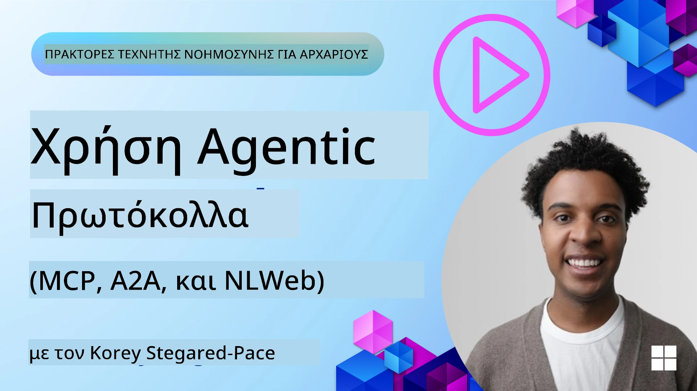
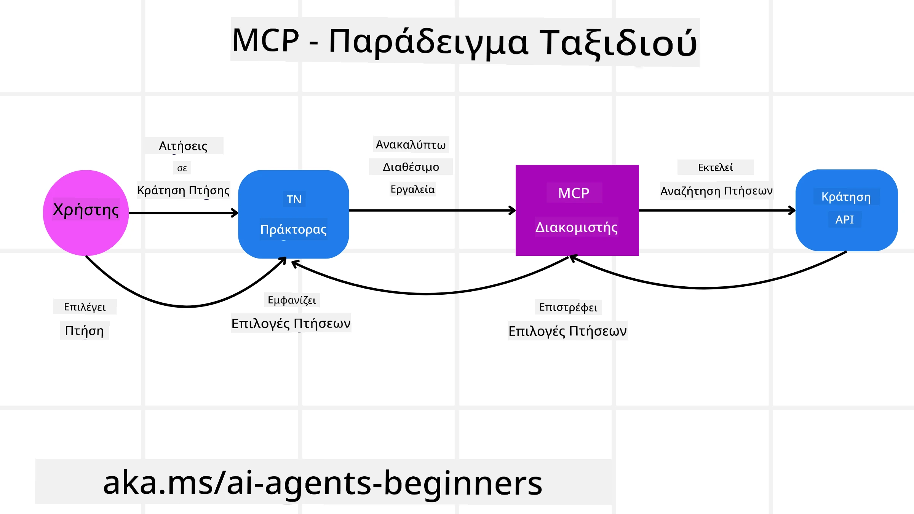
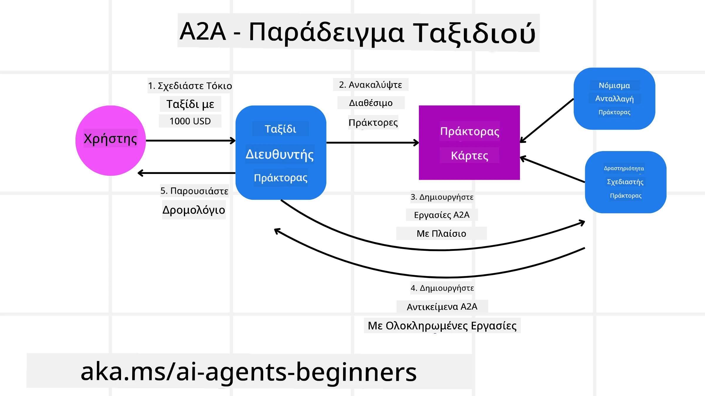

<!--
CO_OP_TRANSLATOR_METADATA:
{
  "original_hash": "aff92c6f019b4627ca9399c6e3882e17",
  "translation_date": "2025-09-18T14:56:14+00:00",
  "source_file": "11-agentic-protocols/README.md",
  "language_code": "el"
}
-->
# Χρήση Πρωτοκόλλων Πρακτόρων (MCP, A2A και NLWeb)

> _(Κάντε κλικ στην εικόνα παραπάνω για να παρακολουθήσετε το βίντεο αυτού του μαθήματος)_

Καθώς η χρήση πρακτόρων AI αυξάνεται, αυξάνεται και η ανάγκη για πρωτόκολλα που διασφαλίζουν την τυποποίηση, την ασφάλεια και την υποστήριξη της ανοιχτής καινοτομίας. Σε αυτό το μάθημα, θα καλύψουμε 3 πρωτόκολλα που στοχεύουν να καλύψουν αυτή την ανάγκη - το Model Context Protocol (MCP), το Agent to Agent (A2A) και το Natural Language Web (NLWeb).

## Εισαγωγή

Σε αυτό το μάθημα, θα καλύψουμε:

• Πώς το **MCP** επιτρέπει στους πράκτορες AI να έχουν πρόσβαση σε εξωτερικά εργαλεία και δεδομένα για να ολοκληρώσουν εργασίες χρηστών.

• Πώς το **A2A** διευκολύνει την επικοινωνία και τη συνεργασία μεταξύ διαφορετικών πρακτόρων AI.

• Πώς το **NLWeb** φέρνει διεπαφές φυσικής γλώσσας σε οποιονδήποτε ιστότοπο, επιτρέποντας στους πράκτορες AI να ανακαλύπτουν και να αλληλεπιδρούν με το περιεχόμενο.

## Στόχοι Μάθησης

• **Αναγνωρίστε** τον βασικό σκοπό και τα οφέλη των MCP, A2A και NLWeb στο πλαίσιο των πρακτόρων AI.

• **Εξηγήστε** πώς κάθε πρωτόκολλο διευκολύνει την επικοινωνία και την αλληλεπίδραση μεταξύ LLMs, εργαλείων και άλλων πρακτόρων.

• **Αναγνωρίστε** τους ξεχωριστούς ρόλους που παίζει κάθε πρωτόκολλο στην κατασκευή σύνθετων συστημάτων πρακτόρων.

## Model Context Protocol

Το **Model Context Protocol (MCP)** είναι ένα ανοιχτό πρότυπο που παρέχει έναν τυποποιημένο τρόπο για εφαρμογές να παρέχουν πλαίσιο και εργαλεία στα LLMs. Αυτό επιτρέπει έναν "καθολικό προσαρμογέα" σε διαφορετικές πηγές δεδομένων και εργαλεία που οι πράκτορες AI μπορούν να συνδεθούν με συνεπή τρόπο.

Ας δούμε τα συστατικά του MCP, τα οφέλη σε σύγκριση με την άμεση χρήση API και ένα παράδειγμα για το πώς οι πράκτορες AI μπορεί να χρησιμοποιήσουν έναν MCP server.

### Βασικά Συστατικά MCP

Το MCP λειτουργεί σε μια **αρχιτεκτονική πελάτη-διακομιστή** και τα βασικά συστατικά είναι:

• **Hosts** είναι εφαρμογές LLM (για παράδειγμα ένας επεξεργαστής κώδικα όπως το VSCode) που ξεκινούν τις συνδέσεις με έναν MCP Server.

• **Clients** είναι συστατικά μέσα στην εφαρμογή host που διατηρούν συνδέσεις ένας προς έναν με διακομιστές.

• **Servers** είναι ελαφριά προγράμματα που εκθέτουν συγκεκριμένες δυνατότητες.

Στο πρωτόκολλο περιλαμβάνονται τρεις βασικές αρχές που είναι οι δυνατότητες ενός MCP Server:

• **Εργαλεία**: Αυτές είναι διακριτές ενέργειες ή λειτουργίες που ένας πράκτορας AI μπορεί να καλέσει για να εκτελέσει μια ενέργεια. Για παράδειγμα, μια υπηρεσία καιρού μπορεί να εκθέσει ένα εργαλείο "λήψη καιρού", ή ένας διακομιστής ηλεκτρονικού εμπορίου μπορεί να εκθέσει ένα εργαλείο "αγορά προϊόντος". Οι MCP servers διαφημίζουν το όνομα, την περιγραφή και το σχήμα εισόδου/εξόδου κάθε εργαλείου στη λίστα δυνατοτήτων τους.

• **Πόροι**: Αυτά είναι δεδομένα ή έγγραφα μόνο για ανάγνωση που ένας MCP server μπορεί να παρέχει, και οι πελάτες μπορούν να τα ανακτήσουν κατά παραγγελία. Παραδείγματα περιλαμβάνουν περιεχόμενα αρχείων, εγγραφές βάσεων δεδομένων ή αρχεία καταγραφής. Οι πόροι μπορεί να είναι κείμενο (όπως κώδικας ή JSON) ή δυαδικά δεδομένα (όπως εικόνες ή PDF).

• **Προτροπές**: Αυτά είναι προκαθορισμένα πρότυπα που παρέχουν προτεινόμενες προτροπές, επιτρέποντας πιο σύνθετες ροές εργασίας.

### Οφέλη του MCP

Το MCP προσφέρει σημαντικά πλεονεκτήματα για τους πράκτορες AI:

• **Δυναμική Ανακάλυψη Εργαλείων**: Οι πράκτορες μπορούν να λαμβάνουν δυναμικά μια λίστα διαθέσιμων εργαλείων από έναν διακομιστή μαζί με περιγραφές για το τι κάνουν. Αυτό έρχεται σε αντίθεση με τα παραδοσιακά APIs, που συχνά απαιτούν στατική κωδικοποίηση για ενσωματώσεις, πράγμα που σημαίνει ότι οποιαδήποτε αλλαγή API απαιτεί ενημερώσεις κώδικα. Το MCP προσφέρει μια προσέγγιση "ενσωμάτωσης μία φορά", οδηγώντας σε μεγαλύτερη προσαρμοστικότητα.

• **Διαλειτουργικότητα Μεταξύ LLMs**: Το MCP λειτουργεί σε διαφορετικά LLMs, παρέχοντας ευελιξία για αλλαγή βασικών μοντέλων για αξιολόγηση καλύτερης απόδοσης.

• **Τυποποιημένη Ασφάλεια**: Το MCP περιλαμβάνει μια τυποποιημένη μέθοδο αυθεντικοποίησης, βελτιώνοντας την κλιμακωσιμότητα όταν προστίθεται πρόσβαση σε επιπλέον MCP servers. Αυτό είναι απλούστερο από τη διαχείριση διαφορετικών κλειδιών και τύπων αυθεντικοποίησης για διάφορα παραδοσιακά APIs.

### Παράδειγμα MCP

Φανταστείτε ότι ένας χρήστης θέλει να κλείσει μια πτήση χρησιμοποιώντας έναν βοηθό AI που υποστηρίζεται από MCP.

1. **Σύνδεση**: Ο βοηθός AI (ο MCP client) συνδέεται με έναν MCP server που παρέχεται από μια αεροπορική εταιρεία.

2. **Ανακάλυψη Εργαλείων**: Ο client ρωτά τον MCP server της αεροπορικής εταιρείας, "Ποια εργαλεία έχετε διαθέσιμα;" Ο server απαντά με εργαλεία όπως "αναζήτηση πτήσεων" και "κλείσιμο πτήσεων".

3. **Κλήση Εργαλείου**: Στη συνέχεια, ζητάτε από τον βοηθό AI, "Παρακαλώ αναζήτησε μια πτήση από το Πόρτλαντ στη Χονολουλού." Ο βοηθός AI, χρησιμοποιώντας το LLM του, αναγνωρίζει ότι πρέπει να καλέσει το εργαλείο "αναζήτηση πτήσεων" και περνά τις σχετικές παραμέτρους (αφετηρία, προορισμός) στον MCP server.

4. **Εκτέλεση και Απόκριση**: Ο MCP server, λειτουργώντας ως περιτύλιγμα, κάνει την πραγματική κλήση στο εσωτερικό API κρατήσεων της αεροπορικής εταιρείας. Στη συνέχεια λαμβάνει τις πληροφορίες πτήσης (π.χ. δεδομένα JSON) και τις στέλνει πίσω στον βοηθό AI.

5. **Περαιτέρω Αλληλεπίδραση**: Ο βοηθός AI παρουσιάζει τις επιλογές πτήσεων. Μόλις επιλέξετε μια πτήση, ο βοηθός μπορεί να καλέσει το εργαλείο "κλείσιμο πτήσης" στον ίδιο MCP server, ολοκληρώνοντας την κράτηση.

## Πρωτόκολλο Πράκτορα-Πράκτορα (A2A)

Ενώ το MCP επικεντρώνεται στη σύνδεση LLMs με εργαλεία, το **Πρωτόκολλο Πράκτορα-Πράκτορα (A2A)** προχωρά ένα βήμα παραπέρα, επιτρέποντας την επικοινωνία και τη συνεργασία μεταξύ διαφορετικών πρακτόρων AI. Το A2A συνδέει πράκτορες AI από διαφορετικούς οργανισμούς, περιβάλλοντα και τεχνολογικές στοίβες για να ολοκληρώσουν μια κοινή εργασία.

Θα εξετάσουμε τα συστατικά και τα οφέλη του A2A, μαζί με ένα παράδειγμα για το πώς θα μπορούσε να εφαρμοστεί στην εφαρμογή ταξιδιών μας.

### Βασικά Συστατικά A2A

Το A2A επικεντρώνεται στη διευκόλυνση της επικοινωνίας μεταξύ πρακτόρων και στην συνεργασία τους για την ολοκλήρωση μιας υποεργασίας του χρήστη. Κάθε συστατικό του πρωτοκόλλου συμβάλλει σε αυτό:

#### Κάρτα Πράκτορα

Παρόμοια με το πώς ένας MCP server μοιράζεται μια λίστα εργαλείων, μια Κάρτα Πράκτορα περιλαμβάνει:
- Το Όνομα του Πράκτορα.
- Μια **περιγραφή των γενικών εργασιών** που ολοκληρώνει.
- Μια **λίστα συγκεκριμένων δεξιοτήτων** με περιγραφές για να βοηθήσει άλλους πράκτορες (ή ακόμα και ανθρώπινους χρήστες) να κατανοήσουν πότε και γιατί θα ήθελαν να καλέσουν αυτόν τον πράκτορα.
- Το **τρέχον URL τελικού σημείου** του πράκτορα.
- Την **έκδοση** και τις **δυνατότητες** του πράκτορα, όπως απαντήσεις ροής και ειδοποιήσεις push.

#### Εκτελεστής Πράκτορα

Ο Εκτελεστής Πράκτορα είναι υπεύθυνος για **τη μεταβίβαση του πλαισίου της συνομιλίας του χρήστη στον απομακρυσμένο πράκτορα**, ο απομακρυσμένος πράκτορας χρειάζεται αυτό για να κατανοήσει την εργασία που πρέπει να ολοκληρωθεί. Σε έναν A2A server, ένας πράκτορας χρησιμοποιεί το δικό του Large Language Model (LLM) για να αναλύσει εισερχόμενα αιτήματα και να εκτελέσει εργασίες χρησιμοποιώντας τα δικά του εσωτερικά εργαλεία.

#### Τεχνούργημα

Μόλις ένας απομακρυσμένος πράκτορας ολοκληρώσει την αιτούμενη εργασία, το προϊόν της εργασίας του δημιουργείται ως τεχνούργημα. Ένα τεχνούργημα **περιέχει το αποτέλεσμα της εργασίας του πράκτορα**, μια **περιγραφή του τι ολοκληρώθηκε**, και το **κείμενο πλαισίου** που αποστέλλεται μέσω του πρωτοκόλλου. Αφού αποσταλεί το τεχνούργημα, η σύνδεση με τον απομακρυσμένο πράκτορα κλείνει μέχρι να χρειαστεί ξανά.

#### Ουρά Συμβάντων

Αυτό το συστατικό χρησιμοποιείται για **τη διαχείριση ενημερώσεων και τη μεταβίβαση μηνυμάτων**. Είναι ιδιαίτερα σημαντικό στην παραγωγή για συστήματα πρακτόρων για να αποτρέψει το κλείσιμο της σύνδεσης μεταξύ πρακτόρων πριν ολοκληρωθεί μια εργασία, ειδικά όταν οι χρόνοι ολοκλήρωσης εργασιών μπορεί να είναι μεγαλύτεροι.

### Οφέλη του A2A

• **Ενισχυμένη Συνεργασία**: Επιτρέπει στους πράκτορες από διαφορετικούς προμηθευτές και πλατφόρμες να αλληλεπιδρούν, να μοιράζονται πλαίσιο και να συνεργάζονται, διευκολύνοντας την απρόσκοπτη αυτοματοποίηση σε παραδοσιακά αποσυνδεδεμένα συστήματα.

• **Ευελιξία Επιλογής Μοντέλου**: Κάθε πράκτορας A2A μπορεί να αποφασίσει ποιο LLM θα χρησιμοποιήσει για να εξυπηρετήσει τα αιτήματά του, επιτρέποντας βελτιστοποιημένα ή προσαρμοσμένα μοντέλα ανά πράκτορα, σε αντίθεση με μια σύνδεση ενός LLM σε ορισμένα σενάρια MCP.

• **Ενσωματωμένη Αυθεντικοποίηση**: Η αυθεντικοποίηση είναι ενσωματωμένη απευθείας στο πρωτόκολλο A2A, παρέχοντας ένα ισχυρό πλαίσιο ασφάλειας για τις αλληλεπιδράσεις πρακτόρων.

### Παράδειγμα A2A

Ας επεκτείνουμε το σενάριο κράτησης ταξιδιού μας, αλλά αυτή τη φορά χρησιμοποιώντας A2A.

1. **Αίτημα Χρήστη σε Πολλαπλούς Πράκτορες**: Ένας χρήστης αλληλεπιδρά με έναν "Ταξιδιωτικό Πράκτορα" A2A client/agent, ίσως λέγοντας, "Παρακαλώ κλείστε ένα ολόκληρο ταξίδι στη Χονολουλού για την επόμενη εβδομάδα, συμπεριλαμβανομένων πτήσεων, ξενοδοχείου και ενοικίασης αυτοκινήτου".

2. **Ορχήστρωση από Ταξιδιωτικό Πράκτορα**: Ο Ταξιδιωτικός Πράκτορας λαμβάνει αυτό το σύνθετο αίτημα. Χρησιμοποιεί το LLM του για να σκεφτεί την εργασία και να καθορίσει ότι πρέπει να αλληλεπιδράσει με άλλους εξειδικευμένους πράκτορες.

3. **Επικοινωνία Μεταξύ Πρακτόρων**: Ο Ταξιδιωτικός Πράκτορας στη συνέχεια χρησιμοποιεί το πρωτόκολλο A2A για να συνδεθεί με downstream πράκτορες, όπως έναν "Πράκτορα Αεροπορικής Εταιρείας," έναν "Πράκτορα Ξενοδοχείου," και έναν "Πράκτορα Ενοικίασης Αυτοκινήτου" που έχουν δημιουργηθεί από διαφορετικές εταιρείες.

4. **Εκτέλεση Εργασιών Ανά Πράκτορα**: Ο Ταξιδιωτικός Πράκτορας στέλνει συγκεκριμένες εργασίες σε αυτούς τους εξειδικευμένους πράκτορες (π.χ., "Βρείτε πτήσεις για τη Χονολουλού," "Κλείστε ένα ξενοδοχείο," "Ενοικιάστε ένα αυτοκίνητο"). Κάθε ένας από αυτούς τους εξειδικευμένους πράκτορες, τρέχοντας τα δικά του LLMs και χρησιμοποιώντας τα δικά του εργαλεία (που θα μπορούσαν να είναι MCP servers οι ίδιοι), εκτελεί το συγκεκριμένο μέρος της κράτησης.

5. **Συνολική Απόκριση**: Μόλις όλοι οι downstream πράκτορες ολοκληρώσουν τις εργασίες τους, ο Ταξιδιωτικός Πράκτορας συνθέτει τα αποτελέσματα (λεπτομέρειες πτήσης, επιβεβαίωση ξενοδοχείου, κράτηση ενοικίασης αυτοκινήτου) και στέλνει μια ολοκληρωμένη, συνομιλιακή απάντηση πίσω στον χρήστη.

## Natural Language Web (NLWeb)

Οι ιστότοποι έχουν εδώ και καιρό αποτελέσει τον κύριο τρόπο για τους χρήστες να έχουν πρόσβαση σε πληροφορίες και δεδομένα στο διαδίκτυο.

Ας δούμε τα διαφορετικά συστατικά του NLWeb, τα οφέλη του NLWeb και ένα παράδειγμα για το πώς λειτουργεί το NLWeb εξετάζοντας την εφαρμογή ταξιδιών μας.

### Συστατικά του NLWeb

- **Εφαρμογή NLWeb (Κώδικας Κεντρικής Υπηρεσίας)**: Το σύστημα που επεξεργάζεται ερωτήσεις φυσικής γλώσσας. Συνδέει τα διαφορετικά μέρη της πλατφόρμας για να δημιουργήσει απαντήσεις. Μπορείτε να το σκεφτείτε ως τον **κινητήρα που τροφοδοτεί τις δυνατότητες φυσικής γλώσσας** ενός ιστότοπου.

- **Πρωτόκολλο NLWeb**: Αυτό είναι ένα **βασικό σύνολο κανόνων για αλληλεπίδραση φυσικής γλώσσας** με έναν ιστότοπο. Επιστρέφει απαντήσεις σε μορφή JSON (συχνά χρησιμοποιώντας Schema.org). Σκοπός του είναι να δημιουργήσει ένα απλό θεμέλιο για τον "AI Web," με τον ίδιο τρόπο που το HTML έκανε δυνατή την κοινή χρήση εγγράφων στο διαδίκτυο.

- **MCP Server (Σημείο Τερματισμού Model Context Protocol)**: Κάθε εγκατάσταση NLWeb λειτουργεί επίσης ως **MCP server**. Αυτό σημαίνει ότι μπορεί να **μοιράζεται εργαλεία (όπως μια μέθοδο "ask") και δεδομένα** με άλλα συστήματα AI. Στην πράξη,

---

**Αποποίηση ευθύνης**:  
Αυτό το έγγραφο έχει μεταφραστεί χρησιμοποιώντας την υπηρεσία αυτόματης μετάφρασης AI [Co-op Translator](https://github.com/Azure/co-op-translator). Παρόλο που καταβάλλουμε προσπάθειες για ακρίβεια, παρακαλούμε να έχετε υπόψη ότι οι αυτόματες μεταφράσεις ενδέχεται να περιέχουν λάθη ή ανακρίβειες. Το πρωτότυπο έγγραφο στη μητρική του γλώσσα θα πρέπει να θεωρείται η αυθεντική πηγή. Για κρίσιμες πληροφορίες, συνιστάται επαγγελματική ανθρώπινη μετάφραση. Δεν φέρουμε ευθύνη για τυχόν παρεξηγήσεις ή εσφαλμένες ερμηνείες που προκύπτουν από τη χρήση αυτής της μετάφρασης.