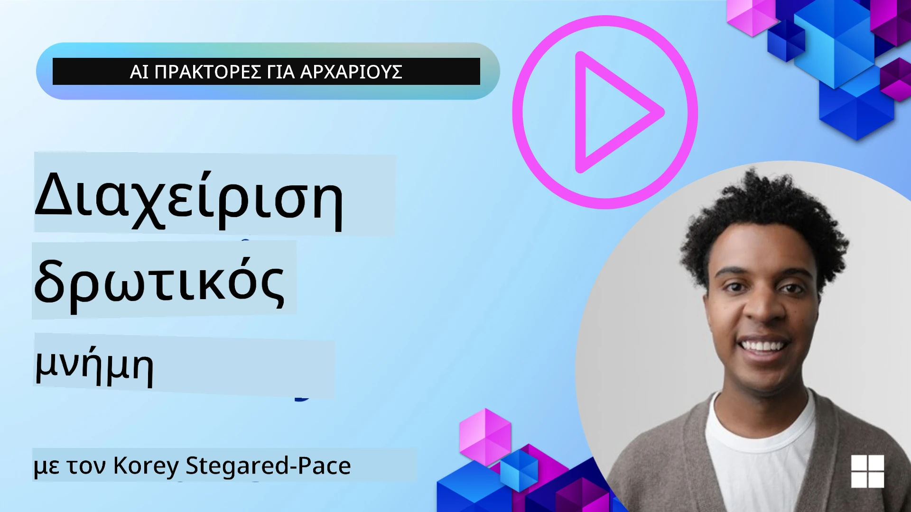

<!--
CO_OP_TRANSLATOR_METADATA:
{
  "original_hash": "a1d90991499ad697c4ad24decaf36968",
  "translation_date": "2025-12-09T12:21:19+00:00",
  "source_file": "13-agent-memory/README.md",
  "language_code": "el"
}
-->
# Μνήμη για Πράκτορες Τεχνητής Νοημοσύνης 

Όταν συζητάμε για τα μοναδικά οφέλη της δημιουργίας Πρακτόρων Τεχνητής Νοημοσύνης, δύο πράγματα συζητούνται κυρίως: η ικανότητα να καλούν εργαλεία για την ολοκλήρωση εργασιών και η ικανότητα να βελτιώνονται με την πάροδο του χρόνου. Η μνήμη αποτελεί τη βάση για τη δημιουργία αυτοβελτιούμενων πρακτόρων που μπορούν να προσφέρουν καλύτερες εμπειρίες στους χρήστες μας.

Σε αυτό το μάθημα, θα εξετάσουμε τι είναι η μνήμη για τους Πράκτορες Τεχνητής Νοημοσύνης και πώς μπορούμε να τη διαχειριστούμε και να τη χρησιμοποιήσουμε προς όφελος των εφαρμογών μας.

## Εισαγωγή

Αυτό το μάθημα θα καλύψει:

• **Κατανόηση της Μνήμης Πρακτόρων Τεχνητής Νοημοσύνης**: Τι είναι η μνήμη και γιατί είναι απαραίτητη για τους πράκτορες.

• **Υλοποίηση και Αποθήκευση Μνήμης**: Πρακτικές μέθοδοι για την προσθήκη δυνατοτήτων μνήμης στους πράκτορες Τεχνητής Νοημοσύνης, με έμφαση στη βραχυπρόθεσμη και μακροπρόθεσμη μνήμη.

• **Δημιουργία Αυτοβελτιούμενων Πρακτόρων Τεχνητής Νοημοσύνης**: Πώς η μνήμη επιτρέπει στους πράκτορες να μαθαίνουν από προηγούμενες αλληλεπιδράσεις και να βελτιώνονται με την πάροδο του χρόνου.

## Διαθέσιμες Υλοποιήσεις

Αυτό το μάθημα περιλαμβάνει δύο ολοκληρωμένα tutorials σε notebook:

• **[13-agent-memory.ipynb](./13-agent-memory.ipynb)**: Υλοποιεί μνήμη χρησιμοποιώντας Mem0 και Azure AI Search με το πλαίσιο Semantic Kernel.

• **[13-agent-memory-cognee.ipynb](./13-agent-memory-cognee.ipynb)**: Υλοποιεί δομημένη μνήμη χρησιμοποιώντας το Cognee, δημιουργώντας αυτόματα γράφημα γνώσης με embeddings, οπτικοποιώντας το γράφημα και πραγματοποιώντας έξυπνη ανάκτηση.

## Στόχοι Μάθησης

Μετά την ολοκλήρωση αυτού του μαθήματος, θα γνωρίζετε πώς να:

• **Διακρίνετε τους διάφορους τύπους μνήμης πρακτόρων Τεχνητής Νοημοσύνης**, συμπεριλαμβανομένων της λειτουργικής, βραχυπρόθεσμης και μακροπρόθεσμης μνήμης, καθώς και εξειδικευμένων μορφών όπως η μνήμη προσωπικότητας και επεισοδίων.

• **Υλοποιείτε και διαχειρίζεστε βραχυπρόθεσμη και μακροπρόθεσμη μνήμη για πράκτορες Τεχνητής Νοημοσύνης** χρησιμοποιώντας το πλαίσιο Semantic Kernel, αξιοποιώντας εργαλεία όπως Mem0, Cognee, Whiteboard memory και ενσωματώνοντας το Azure AI Search.

• **Κατανοείτε τις αρχές πίσω από τους αυτοβελτιούμενους πράκτορες Τεχνητής Νοημοσύνης** και πώς τα ισχυρά συστήματα διαχείρισης μνήμης συμβάλλουν στη συνεχή μάθηση και προσαρμογή.

## Κατανόηση της Μνήμης Πρακτόρων Τεχνητής Νοημοσύνης

Στον πυρήνα της, **η μνήμη για τους πράκτορες Τεχνητής Νοημοσύνης αναφέρεται στους μηχανισμούς που τους επιτρέπουν να διατηρούν και να ανακαλούν πληροφορίες**. Αυτές οι πληροφορίες μπορεί να είναι συγκεκριμένες λεπτομέρειες μιας συνομιλίας, προτιμήσεις χρηστών, προηγούμενες ενέργειες ή ακόμα και μοτίβα που έχουν μάθει.

Χωρίς μνήμη, οι εφαρμογές Τεχνητής Νοημοσύνης είναι συχνά χωρίς κατάσταση, που σημαίνει ότι κάθε αλληλεπίδραση ξεκινά από την αρχή. Αυτό οδηγεί σε μια επαναλαμβανόμενη και απογοητευτική εμπειρία χρήστη, όπου ο πράκτορας "ξεχνά" το προηγούμενο πλαίσιο ή τις προτιμήσεις.

### Γιατί είναι Σημαντική η Μνήμη;

Η νοημοσύνη ενός πράκτορα συνδέεται βαθιά με την ικανότητά του να ανακαλεί και να χρησιμοποιεί προηγούμενες πληροφορίες. Η μνήμη επιτρέπει στους πράκτορες να είναι:

• **Αναστοχαστικοί**: Μαθαίνοντας από προηγούμενες ενέργειες και αποτελέσματα.

• **Διαδραστικοί**: Διατηρώντας το πλαίσιο κατά τη διάρκεια μιας συνεχιζόμενης συνομιλίας.

• **Προδραστικοί και Αντιδραστικοί**: Προβλέποντας ανάγκες ή ανταποκρινόμενοι κατάλληλα με βάση ιστορικά δεδομένα.

• **Αυτόνομοι**: Λειτουργώντας πιο ανεξάρτητα αντλώντας από αποθηκευμένη γνώση.

Ο στόχος της υλοποίησης μνήμης είναι να κάνει τους πράκτορες πιο **αξιόπιστους και ικανούς**.

### Τύποι Μνήμης

#### Λειτουργική Μνήμη

Σκεφτείτε τη σαν ένα κομμάτι χαρτί που χρησιμοποιεί ένας πράκτορας κατά τη διάρκεια μιας μόνο, συνεχιζόμενης εργασίας ή διαδικασίας σκέψης. Κρατά άμεσες πληροφορίες που χρειάζονται για τον υπολογισμό του επόμενου βήματος.

Για τους πράκτορες Τεχνητής Νοημοσύνης, η λειτουργική μνήμη συχνά καταγράφει τις πιο σχετικές πληροφορίες από μια συνομιλία, ακόμα κι αν το πλήρες ιστορικό συνομιλίας είναι μεγάλο ή περικόπτεται. Εστιάζει στην εξαγωγή βασικών στοιχείων όπως απαιτήσεις, προτάσεις, αποφάσεις και ενέργειες.

**Παράδειγμα Λειτουργικής Μνήμης**

Σε έναν πράκτορα κρατήσεων ταξιδιών, η λειτουργική μνήμη μπορεί να καταγράψει το τρέχον αίτημα του χρήστη, όπως "Θέλω να κλείσω ένα ταξίδι στο Παρίσι". Αυτή η συγκεκριμένη απαίτηση διατηρείται στο άμεσο πλαίσιο του πράκτορα για να καθοδηγήσει την τρέχουσα αλληλεπίδραση.

#### Βραχυπρόθεσμη Μνήμη

Αυτός ο τύπος μνήμης διατηρεί πληροφορίες για τη διάρκεια μιας μόνο συνομιλίας ή συνεδρίας. Είναι το πλαίσιο της τρέχουσας συνομιλίας, επιτρέποντας στον πράκτορα να αναφέρεται σε προηγούμενες στροφές του διαλόγου.

**Παράδειγμα Βραχυπρόθεσμης Μνήμης**

Αν ένας χρήστης ρωτήσει, "Πόσο κοστίζει μια πτήση για το Παρίσι;" και στη συνέχεια συνεχίσει με "Τι γίνεται με τη διαμονή εκεί;", η βραχυπρόθεσμη μνήμη διασφαλίζει ότι ο πράκτορας γνωρίζει ότι το "εκεί" αναφέρεται στο "Παρίσι" μέσα στην ίδια συνομιλία.

#### Μακροπρόθεσμη Μνήμη

Αυτή είναι η πληροφορία που παραμένει σε πολλές συνομιλίες ή συνεδρίες. Επιτρέπει στους πράκτορες να θυμούνται προτιμήσεις χρηστών, ιστορικές αλληλεπιδράσεις ή γενικές γνώσεις για μεγάλα χρονικά διαστήματα. Αυτό είναι σημαντικό για την εξατομίκευση.

**Παράδειγμα Μακροπρόθεσμης Μνήμης**

Μια μακροπρόθεσμη μνήμη μπορεί να αποθηκεύσει ότι "Ο Μπεν απολαμβάνει το σκι και τις υπαίθριες δραστηριότητες, του αρέσει ο καφές με θέα στο βουνό και θέλει να αποφεύγει τις προχωρημένες πίστες σκι λόγω ενός παλιού τραυματισμού". Αυτή η πληροφορία, που μαθαίνεται από προηγούμενες αλληλεπιδράσεις, επηρεάζει τις προτάσεις σε μελλοντικές συνεδρίες σχεδιασμού ταξιδιών, καθιστώντας τις εξαιρετικά εξατομικευμένες.

#### Μνήμη Προσωπικότητας

Αυτός ο εξειδικευμένος τύπος μνήμης βοηθά έναν πράκτορα να αναπτύξει μια συνεπή "προσωπικότητα" ή "ρόλο". Επιτρέπει στον πράκτορα να θυμάται λεπτομέρειες για τον εαυτό του ή τον προοριζόμενο ρόλο του, καθιστώντας τις αλληλεπιδράσεις πιο ομαλές και εστιασμένες.

**Παράδειγμα Μνήμης Προσωπικότητας**

Αν ο πράκτορας ταξιδιών έχει σχεδιαστεί να είναι "ειδικός στον προγραμματισμό σκι", η μνήμη προσωπικότητας μπορεί να ενισχύσει αυτόν τον ρόλο, επηρεάζοντας τις απαντήσεις του ώστε να ευθυγραμμίζονται με τον τόνο και τις γνώσεις ενός ειδικού.

#### Μνήμη Εργασιών/Επεισοδίων

Αυτή η μνήμη αποθηκεύει τη σειρά των βημάτων που ακολουθεί ένας πράκτορας κατά τη διάρκεια μιας σύνθετης εργασίας, συμπεριλαμβανομένων επιτυχιών και αποτυχιών. Είναι σαν να θυμάται συγκεκριμένα "επεισόδια" ή προηγούμενες εμπειρίες για να μαθαίνει από αυτά.

**Παράδειγμα Μνήμης Επεισοδίων**

Αν ο πράκτορας προσπάθησε να κλείσει μια συγκεκριμένη πτήση αλλά απέτυχε λόγω μη διαθεσιμότητας, η μνήμη επεισοδίων θα μπορούσε να καταγράψει αυτήν την αποτυχία, επιτρέποντας στον πράκτορα να δοκιμάσει εναλλακτικές πτήσεις ή να ενημερώσει τον χρήστη για το πρόβλημα με πιο ενημερωμένο τρόπο κατά την επόμενη προσπάθεια.

#### Μνήμη Οντοτήτων

Αυτή περιλαμβάνει την εξαγωγή και αποθήκευση συγκεκριμένων οντοτήτων (όπως άτομα, μέρη ή πράγματα) και γεγονότων από συνομιλίες. Επιτρέπει στον πράκτορα να δημιουργήσει μια δομημένη κατανόηση των βασικών στοιχείων που συζητήθηκαν.

**Παράδειγμα Μνήμης Οντοτήτων**

Από μια συνομιλία για ένα προηγούμενο ταξίδι, ο πράκτορας μπορεί να εξάγει "Παρίσι", "Πύργος του Άιφελ" και "δείπνο στο εστιατόριο Le Chat Noir" ως οντότητες. Σε μια μελλοντική αλληλεπίδραση, ο πράκτορας θα μπορούσε να θυμηθεί το "Le Chat Noir" και να προσφέρει να κάνει μια νέα κράτηση εκεί.

#### Δομημένο RAG (Ανάκτηση Ενισχυμένης Δημιουργίας)

Ενώ το RAG είναι μια ευρύτερη τεχνική, το "Δομημένο RAG" αναδεικνύεται ως μια ισχυρή τεχνολογία μνήμης. Εξάγει πυκνές, δομημένες πληροφορίες από διάφορες πηγές (συνομιλίες, emails, εικόνες) και τις χρησιμοποιεί για να ενισχύσει την ακρίβεια, την ανάκληση και την ταχύτητα στις απαντήσεις. Σε αντίθεση με το κλασικό RAG που βασίζεται αποκλειστικά στη σημασιολογική ομοιότητα, το Δομημένο RAG λειτουργεί με την εγγενή δομή των πληροφοριών.

**Παράδειγμα Δομημένου RAG**

Αντί να ταιριάζει απλώς λέξεις-κλειδιά, το Δομημένο RAG θα μπορούσε να αναλύσει λεπτομέρειες πτήσης (προορισμός, ημερομηνία, ώρα, αεροπορική εταιρεία) από ένα email και να τις αποθηκεύσει με δομημένο τρόπο. Αυτό επιτρέπει ακριβή ερωτήματα όπως "Ποια πτήση έκλεισα για το Παρίσι την Τρίτη;"

## Υλοποίηση και Αποθήκευση Μνήμης

Η υλοποίηση μνήμης για πράκτορες Τεχνητής Νοημοσύνης περιλαμβάνει μια συστηματική διαδικασία **διαχείρισης μνήμης**, η οποία περιλαμβάνει τη δημιουργία, αποθήκευση, ανάκτηση, ενσωμάτωση, ενημέρωση και ακόμη και "λησμονιά" (ή διαγραφή) πληροφοριών. Η ανάκτηση είναι ιδιαίτερα κρίσιμη.

### Εξειδικευμένα Εργαλεία Μνήμης

#### Mem0

Ένας τρόπος αποθήκευσης και διαχείρισης μνήμης πρακτόρων είναι η χρήση εξειδικευμένων εργαλείων όπως το Mem0. Το Mem0 λειτουργεί ως ένα επίμονο επίπεδο μνήμης, επιτρέποντας στους πράκτορες να ανακαλούν σχετικές αλληλεπιδράσεις, να αποθηκεύουν προτιμήσεις χρηστών και πραγματικά πλαίσια και να μαθαίνουν από επιτυχίες και αποτυχίες με την πάροδο του χρόνου. Η ιδέα εδώ είναι ότι οι πράκτορες χωρίς κατάσταση μετατρέπονται σε πράκτορες με κατάσταση.

Λειτουργεί μέσω ενός **διφασικού αγωγού μνήμης: εξαγωγή και ενημέρωση**. Αρχικά, τα μηνύματα που προστίθενται στο νήμα ενός πράκτορα αποστέλλονται στην υπηρεσία Mem0, η οποία χρησιμοποιεί ένα Μεγάλο Μοντέλο Γλώσσας (LLM) για να συνοψίσει το ιστορικό συνομιλίας και να εξάγει νέες μνήμες. Στη συνέχεια, μια φάση ενημέρωσης που καθοδηγείται από LLM καθορίζει αν θα προστεθούν, τροποποιηθούν ή διαγραφούν αυτές οι μνήμες, αποθηκεύοντάς τες σε ένα υβριδικό κατάστημα δεδομένων που μπορεί να περιλαμβάνει βάσεις δεδομένων vector, γράφου και key-value. Αυτό το σύστημα υποστηρίζει επίσης διάφορους τύπους μνήμης και μπορεί να ενσωματώσει μνήμη γράφου για τη διαχείριση σχέσεων μεταξύ οντοτήτων.

#### Cognee

Μια άλλη ισχυρή προσέγγιση είναι η χρήση του **Cognee**, μιας ανοιχτού κώδικα σημασιολογικής μνήμης για πράκτορες Τεχνητής Νοημοσύνης που μετατρέπει δομημένα και μη δομημένα δεδομένα σε γράφημα γνώσης που μπορεί να αναζητηθεί, υποστηριζόμενο από embeddings. Το Cognee παρέχει μια **αρχιτεκτονική διπλού καταστήματος** που συνδυάζει αναζήτηση ομοιότητας vector με σχέσεις γράφου, επιτρέποντας στους πράκτορες να κατανοούν όχι μόνο ποιες πληροφορίες είναι παρόμοιες, αλλά και πώς σχετίζονται οι έννοιες μεταξύ τους.

Διαπρέπει στην **υβριδική ανάκτηση** που συνδυάζει ομοιότητα vector, δομή γράφου και συλλογιστική LLM - από την αναζήτηση ακατέργαστων τμημάτων έως την ερώτηση με επίγνωση του γράφου. Το σύστημα διατηρεί **ζωντανή μνήμη** που εξελίσσεται και μεγαλώνει ενώ παραμένει αναζητήσιμη ως ένα συνδεδεμένο γράφημα, υποστηρίζοντας τόσο το βραχυπρόθεσμο πλαίσιο συνεδρίας όσο και τη μακροπρόθεσμη επίμονη μνήμη.

Το tutorial notebook του Cognee ([13-agent-memory-cognee.ipynb](./13-agent-memory-cognee.ipynb)) δείχνει πώς να δημιουργήσετε αυτό το ενιαίο επίπεδο μνήμης, με πρακτικά παραδείγματα εισαγωγής ποικίλων πηγών δεδομένων, οπτικοποίησης του γραφήματος γνώσης και ερωτήσεων με διαφορετικές στρατηγικές αναζήτησης προσαρμοσμένες στις ανάγκες συγκεκριμένων πρακτόρων.

### Αποθήκευση Μνήμης με RAG

Πέρα από εξειδικευμένα εργαλεία μνήμης όπως το Mem0, μπορείτε να αξιοποιήσετε ισχυρές υπηρεσίες αναζήτησης όπως το **Azure AI Search ως backend για την αποθήκευση και ανάκτηση μνημών**, ειδικά για δομημένο RAG.

Αυτό σας επιτρέπει να βασίζετε τις απαντήσεις του πράκτορα στα δικά σας δεδομένα, διασφαλίζοντας πιο σχε

---

<!-- CO-OP TRANSLATOR DISCLAIMER START -->
**Αποποίηση ευθύνης**:  
Αυτό το έγγραφο έχει μεταφραστεί χρησιμοποιώντας την υπηρεσία αυτόματης μετάφρασης [Co-op Translator](https://github.com/Azure/co-op-translator). Παρόλο που καταβάλλουμε προσπάθειες για ακρίβεια, παρακαλούμε να έχετε υπόψη ότι οι αυτόματες μεταφράσεις ενδέχεται να περιέχουν λάθη ή ανακρίβειες. Το πρωτότυπο έγγραφο στη μητρική του γλώσσα θα πρέπει να θεωρείται η αυθεντική πηγή. Για κρίσιμες πληροφορίες, συνιστάται επαγγελματική ανθρώπινη μετάφραση. Δεν φέρουμε ευθύνη για τυχόν παρεξηγήσεις ή εσφαλμένες ερμηνείες που προκύπτουν από τη χρήση αυτής της μετάφρασης.
<!-- CO-OP TRANSLATOR DISCLAIMER END -->