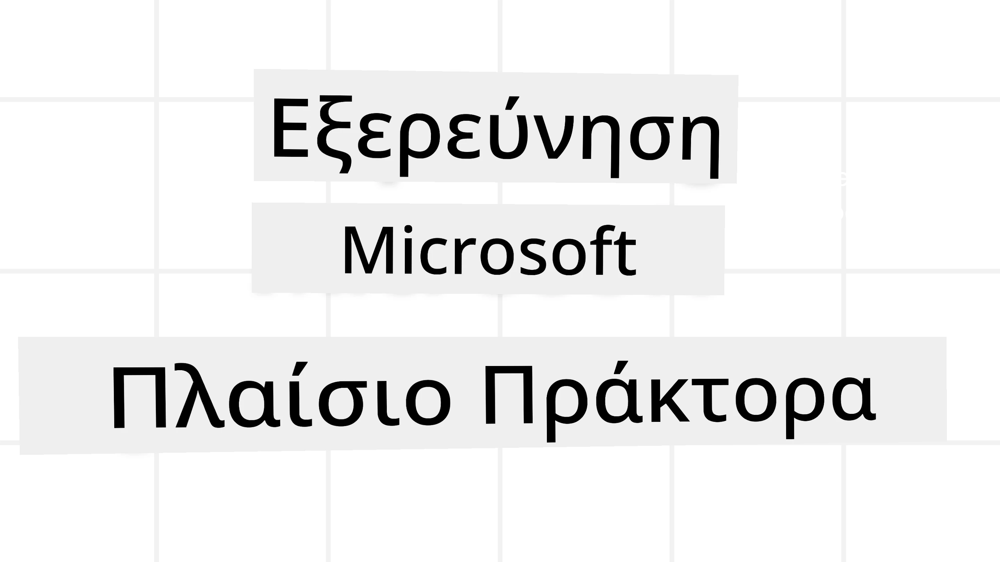
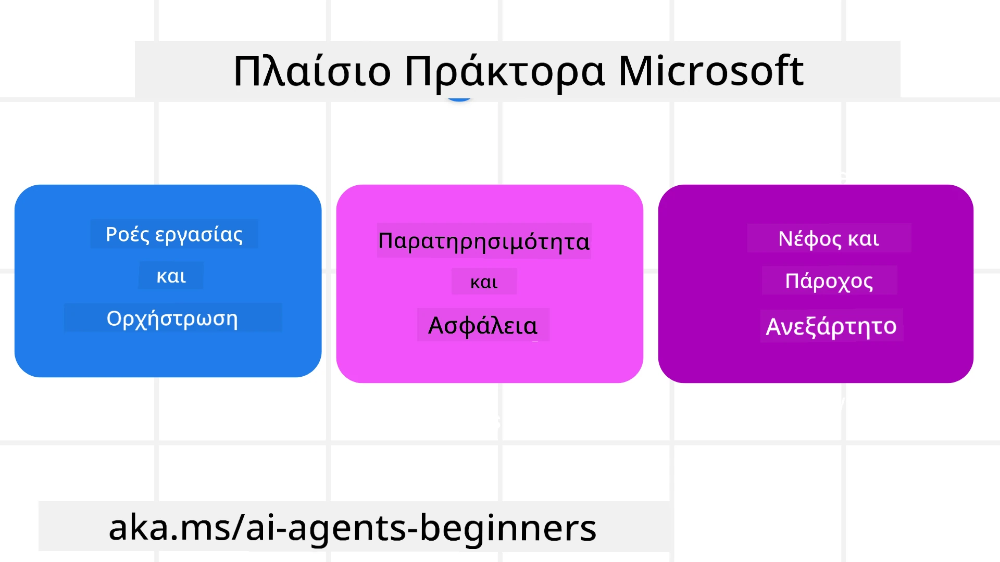
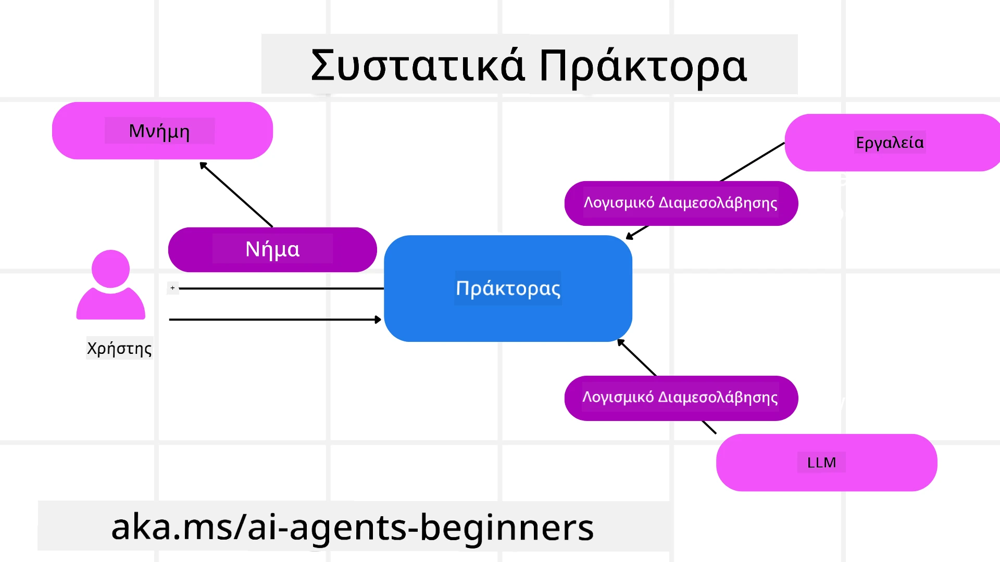

<!--
CO_OP_TRANSLATOR_METADATA:
{
  "original_hash": "19c4dab375acbc733855cc7f2f04edbc",
  "translation_date": "2025-10-02T15:42:09+00:00",
  "source_file": "14-microsoft-agent-framework/README.md",
  "language_code": "el"
}
-->
# Εξερεύνηση του Microsoft Agent Framework



### Εισαγωγή

Αυτό το μάθημα θα καλύψει:

- Κατανόηση του Microsoft Agent Framework: Βασικά χαρακτηριστικά και αξία  
- Εξερεύνηση των βασικών εννοιών του Microsoft Agent Framework
- Σύγκριση του MAF με το Semantic Kernel και το AutoGen: Οδηγός Μετάβασης

## Στόχοι Μάθησης

Μετά την ολοκλήρωση αυτού του μαθήματος, θα γνωρίζετε πώς να:

- Δημιουργείτε AI Agents έτοιμους για παραγωγή χρησιμοποιώντας το Microsoft Agent Framework
- Εφαρμόζετε τα βασικά χαρακτηριστικά του Microsoft Agent Framework στις περιπτώσεις χρήσης σας
- Μεταφέρετε και ενσωματώνετε υπάρχοντα πλαίσια και εργαλεία για Agents  

## Δείγματα Κώδικα 

Δείγματα κώδικα για το [Microsoft Agent Framework (MAF)](https://aka.ms/ai-agents-beginners/agent-framewrok) μπορείτε να βρείτε σε αυτό το αποθετήριο στα αρχεία `xx-python-agent-framework` και `xx-dotnet-agent-framework`.

## Κατανόηση του Microsoft Agent Framework



Το [Microsoft Agent Framework (MAF)](https://aka.ms/ai-agents-beginners/agent-framewrok) βασίζεται στην εμπειρία και τις γνώσεις από το Semantic Kernel και το AutoGen. Προσφέρει ευελιξία για την αντιμετώπιση μιας ευρείας ποικιλίας περιπτώσεων χρήσης Agents τόσο σε παραγωγικά όσο και σε ερευνητικά περιβάλλοντα, όπως:

- **Διαδοχική ορχήστρωση Agents** σε σενάρια όπου απαιτούνται βήμα-βήμα ροές εργασίας.
- **Παράλληλη ορχήστρωση** σε σενάρια όπου οι Agents πρέπει να ολοκληρώσουν εργασίες ταυτόχρονα.
- **Ορχήστρωση ομαδικής συνομιλίας** σε σενάρια όπου οι Agents συνεργάζονται για μία εργασία.
- **Ορχήστρωση μεταβίβασης** σε σενάρια όπου οι Agents μεταβιβάζουν την εργασία ο ένας στον άλλο καθώς ολοκληρώνονται οι υποεργασίες.
- **Μαγνητική ορχήστρωση** σε σενάρια όπου ένας διαχειριστής Agent δημιουργεί και τροποποιεί μια λίστα εργασιών και διαχειρίζεται τον συντονισμό των υπο-Agents για την ολοκλήρωση της εργασίας.

Για την παράδοση AI Agents σε παραγωγή, το MAF περιλαμβάνει επίσης χαρακτηριστικά για:

- **Παρατηρησιμότητα** μέσω της χρήσης του OpenTelemetry, όπου κάθε ενέργεια του AI Agent, όπως η κλήση εργαλείων, τα βήματα ορχήστρωσης, οι ροές λογικής και η παρακολούθηση απόδοσης, καταγράφονται μέσω των πινάκων ελέγχου του Azure AI Foundry.
- **Ασφάλεια** με φιλοξενία των Agents εγγενώς στο Azure AI Foundry, το οποίο περιλαμβάνει ελέγχους ασφαλείας όπως πρόσβαση βάσει ρόλων, χειρισμό ιδιωτικών δεδομένων και ενσωματωμένη ασφάλεια περιεχομένου.
- **Ανθεκτικότητα** καθώς οι νήματα και οι ροές εργασίας των Agents μπορούν να παύσουν, να συνεχίσουν και να ανακάμψουν από σφάλματα, επιτρέποντας διαδικασίες μεγαλύτερης διάρκειας.
- **Έλεγχο** καθώς υποστηρίζονται ροές εργασίας με ανθρώπινη παρέμβαση, όπου οι εργασίες επισημαίνονται ως απαιτούμενες για έγκριση από άνθρωπο.

Το Microsoft Agent Framework επικεντρώνεται επίσης στη διαλειτουργικότητα μέσω:

- **Ανεξαρτησίας από το Cloud** - Οι Agents μπορούν να εκτελούνται σε containers, on-prem και σε πολλαπλά διαφορετικά clouds.
- **Ανεξαρτησίας από τον πάροχο** - Οι Agents μπορούν να δημιουργηθούν μέσω του προτιμώμενου SDK σας, συμπεριλαμβανομένων των Azure OpenAI και OpenAI.
- **Ενσωμάτωσης ανοιχτών προτύπων** - Οι Agents μπορούν να χρησιμοποιούν πρωτόκολλα όπως το Agent-to-Agent (A2A) και το Model Context Protocol (MCP) για να ανακαλύπτουν και να χρησιμοποιούν άλλους Agents και εργαλεία.
- **Πρόσθετων και Συνδέσμων** - Μπορούν να γίνουν συνδέσεις με υπηρεσίες δεδομένων και μνήμης όπως το Microsoft Fabric, το SharePoint, το Pinecone και το Qdrant.

Ας δούμε πώς αυτά τα χαρακτηριστικά εφαρμόζονται σε ορισμένες από τις βασικές έννοιες του Microsoft Agent Framework.

## Βασικές Έννοιες του Microsoft Agent Framework

### Agents



**Δημιουργία Agents**

Η δημιουργία Agents γίνεται με τον ορισμό της υπηρεσίας πρόβλεψης (LLM Provider), ενός συνόλου οδηγιών για τον AI Agent και ενός καθορισμένου `name`:

```python
agent = AzureOpenAIChatClient(credential=AzureCliCredential()).create_agent( instructions="You are good at recommending trips to customers based on their preferences.", name="TripRecommender" )
```

Το παραπάνω χρησιμοποιεί το `Azure OpenAI`, αλλά οι Agents μπορούν να δημιουργηθούν χρησιμοποιώντας μια ποικιλία υπηρεσιών, συμπεριλαμβανομένης της `Azure AI Foundry Agent Service`:

```python
AzureAIAgentClient(async_credential=credential).create_agent( name="HelperAgent", instructions="You are a helpful assistant." ) as agent
```

OpenAI `Responses`, `ChatCompletion` APIs

```python
agent = OpenAIResponsesClient().create_agent( name="WeatherBot", instructions="You are a helpful weather assistant.", )
```

```python
agent = OpenAIChatClient().create_agent( name="HelpfulAssistant", instructions="You are a helpful assistant.", )
```

ή απομακρυσμένους Agents χρησιμοποιώντας το πρωτόκολλο A2A:

```python
agent = A2AAgent( name=agent_card.name, description=agent_card.description, agent_card=agent_card, url="https://your-a2a-agent-host" )
```

**Εκτέλεση Agents**

Οι Agents εκτελούνται χρησιμοποιώντας τις μεθόδους `.run` ή `.run_stream` για μη ροές ή ροές απαντήσεων αντίστοιχα.

```python
result = await agent.run("What are good places to visit in Amsterdam?")
print(result.text)
```

```python
async for update in agent.run_stream("What are the good places to visit in Amsterdam?"):
    if update.text:
        print(update.text, end="", flush=True)

```

Κάθε εκτέλεση Agent μπορεί επίσης να έχει επιλογές για την προσαρμογή παραμέτρων όπως `max_tokens` που χρησιμοποιούνται από τον Agent, `tools` που μπορεί να καλέσει ο Agent, και ακόμη και το ίδιο το `model` που χρησιμοποιείται από τον Agent.

Αυτό είναι χρήσιμο σε περιπτώσεις όπου απαιτούνται συγκεκριμένα μοντέλα ή εργαλεία για την ολοκλήρωση μιας εργασίας του χρήστη.

**Εργαλεία**

Τα εργαλεία μπορούν να οριστούν τόσο κατά τον ορισμό του Agent:

```python
def get_attractions( location: Annotated[str, Field(description="The location to get the top tourist attractions for")], ) -> str: """Get the top tourist attractions for a given location.""" return f"The top attractions for {location} are." 


# When creating a ChatAgent directly 

agent = ChatAgent( chat_client=OpenAIChatClient(), instructions="You are a helpful assistant", tools=[get_attractions]

```

όσο και κατά την εκτέλεση του Agent:

```python

result1 = await agent.run( "What's the best place to visit in Seattle?", tools=[get_attractions] # Tool provided for this run only )
```

**Νήματα Agents**

Τα νήματα Agents χρησιμοποιούνται για τη διαχείριση συνομιλιών πολλαπλών γύρων. Τα νήματα μπορούν να δημιουργηθούν είτε:

- Χρησιμοποιώντας το `get_new_thread()` που επιτρέπει την αποθήκευση του νήματος με την πάροδο του χρόνου
- Δημιουργώντας ένα νήμα αυτόματα κατά την εκτέλεση ενός Agent, με το νήμα να διαρκεί μόνο κατά την τρέχουσα εκτέλεση.

Για να δημιουργήσετε ένα νήμα, ο κώδικας μοιάζει με αυτόν:

```python
# Create a new thread. 
thread = agent.get_new_thread() # Run the agent with the thread. 
response = await agent.run("Hello, I am here to help you book travel. Where would you like to go?", thread=thread)

```

Μπορείτε στη συνέχεια να κάνετε serialize το νήμα για να αποθηκευτεί για μελλοντική χρήση:

```python
# Create a new thread. 
thread = agent.get_new_thread() 

# Run the agent with the thread. 

response = await agent.run("Hello, how are you?", thread=thread) 

# Serialize the thread for storage. 

serialized_thread = await thread.serialize() 

# Deserialize the thread state after loading from storage. 

resumed_thread = await agent.deserialize_thread(serialized_thread)
```

**Middleware Agents**

Οι Agents αλληλεπιδρούν με εργαλεία και LLMs για να ολοκληρώσουν τις εργασίες του χρήστη. Σε ορισμένα σενάρια, θέλουμε να εκτελέσουμε ή να παρακολουθήσουμε ενέργειες μεταξύ αυτών των αλληλεπιδράσεων. Το middleware των Agents μας επιτρέπει να το κάνουμε αυτό μέσω:

*Function Middleware*

Αυτό το middleware μας επιτρέπει να εκτελέσουμε μια ενέργεια μεταξύ του Agent και μιας λειτουργίας/εργαλείου που θα καλεί. Ένα παράδειγμα χρήσης είναι όταν θέλουμε να καταγράψουμε την κλήση της λειτουργίας.

Στον παρακάτω κώδικα, το `next` καθορίζει αν θα κληθεί το επόμενο middleware ή η πραγματική λειτουργία.

```python
async def logging_function_middleware(
    context: FunctionInvocationContext,
    next: Callable[[FunctionInvocationContext], Awaitable[None]],
) -> None:
    """Function middleware that logs function execution."""
    # Pre-processing: Log before function execution
    print(f"[Function] Calling {context.function.name}")

    # Continue to next middleware or function execution
    await next(context)

    # Post-processing: Log after function execution
    print(f"[Function] {context.function.name} completed")
```

*Chat Middleware*

Αυτό το middleware μας επιτρέπει να εκτελέσουμε ή να καταγράψουμε μια ενέργεια μεταξύ του Agent και των αιτημάτων προς το LLM.

Αυτό περιέχει σημαντικές πληροφορίες όπως τα `messages` που αποστέλλονται στην υπηρεσία AI.

```python
async def logging_chat_middleware(
    context: ChatContext,
    next: Callable[[ChatContext], Awaitable[None]],
) -> None:
    """Chat middleware that logs AI interactions."""
    # Pre-processing: Log before AI call
    print(f"[Chat] Sending {len(context.messages)} messages to AI")

    # Continue to next middleware or AI service
    await next(context)

    # Post-processing: Log after AI response
    print("[Chat] AI response received")

```

**Μνήμη Agents**

Όπως καλύφθηκε στο μάθημα `Agentic Memory`, η μνήμη είναι ένα σημαντικό στοιχείο για την ενεργοποίηση του Agent να λειτουργεί σε διαφορετικά πλαίσια. Το MAF προσφέρει διάφορους τύπους μνήμης:

*Αποθήκευση στη μνήμη*

Αυτή είναι η μνήμη που αποθηκεύεται στα νήματα κατά τη διάρκεια της εκτέλεσης της εφαρμογής.

```python
# Create a new thread. 
thread = agent.get_new_thread() # Run the agent with the thread. 
response = await agent.run("Hello, I am here to help you book travel. Where would you like to go?", thread=thread)
```

*Επίμονα μηνύματα*

Αυτή η μνήμη χρησιμοποιείται όταν αποθηκεύεται το ιστορικό συνομιλιών σε διαφορετικές συνεδρίες. Ορίζεται χρησιμοποιώντας το `chat_message_store_factory`:

```python
from agent_framework import ChatMessageStore

# Create a custom message store
def create_message_store():
    return ChatMessageStore()

agent = ChatAgent(
    chat_client=OpenAIChatClient(),
    instructions="You are a Travel assistant.",
    chat_message_store_factory=create_message_store
)

```

*Δυναμική μνήμη*

Αυτή η μνήμη προστίθεται στο πλαίσιο πριν εκτελεστούν οι Agents. Αυτές οι μνήμες μπορούν να αποθηκευτούν σε εξωτερικές υπηρεσίες όπως το mem0:

```python
from agent_framework.mem0 import Mem0Provider

# Using Mem0 for advanced memory capabilities
memory_provider = Mem0Provider(
    api_key="your-mem0-api-key",
    user_id="user_123",
    application_id="my_app"
)

agent = ChatAgent(
    chat_client=OpenAIChatClient(),
    instructions="You are a helpful assistant with memory.",
    context_providers=memory_provider
)

```

**Παρατηρησιμότητα Agents**

Η παρατηρησιμότητα είναι σημαντική για την κατασκευή αξιόπιστων και συντηρήσιμων συστημάτων Agents. Το MAF ενσωματώνεται με το OpenTelemetry για την παροχή ιχνηλάτησης και μετρητών για καλύτερη παρατηρησιμότητα.

```python
from agent_framework.observability import get_tracer, get_meter

tracer = get_tracer()
meter = get_meter()
with tracer.start_as_current_span("my_custom_span"):
    # do something
    pass
counter = meter.create_counter("my_custom_counter")
counter.add(1, {"key": "value"})
```

### Ροές Εργασίας

Το MAF προσφέρει ροές εργασίας που είναι προκαθορισμένα βήματα για την ολοκλήρωση μιας εργασίας και περιλαμβάνουν AI Agents ως συστατικά σε αυτά τα βήματα.

Οι ροές εργασίας αποτελούνται από διαφορετικά συστατικά που επιτρέπουν καλύτερο έλεγχο της ροής. Οι ροές εργασίας επιτρέπουν επίσης **ορχήστρωση πολλαπλών Agents** και **σημεία ελέγχου** για την αποθήκευση των καταστάσεων της ροής εργασίας.

Τα βασικά συστατικά μιας ροής εργασίας είναι:

**Εκτελεστές**

Οι εκτελεστές λαμβάνουν μηνύματα εισόδου, εκτελούν τις ανατεθειμένες εργασίες τους και στη συνέχεια παράγουν ένα μήνυμα εξόδου. Αυτό προωθεί τη ροή εργασίας προς την ολοκλήρωση της μεγαλύτερης εργασίας. Οι εκτελεστές μπορούν να είναι είτε AI Agents είτε προσαρμοσμένη λογική.

**Άκρα**

Τα άκρα χρησιμοποιούνται για τον ορισμό της ροής των μηνυμάτων σε μια ροή εργασίας. Αυτά μπορεί να είναι:

*Άμεσα άκρα* - Απλές συνδέσεις ένας προς έναν μεταξύ εκτελεστών:

```python
from agent_framework import WorkflowBuilder

builder = WorkflowBuilder()
builder.add_edge(source_executor, target_executor)
builder.set_start_executor(source_executor)
workflow = builder.build()
```

*Άκρα υπό όρους* - Ενεργοποιούνται αφού πληρωθεί μια συγκεκριμένη συνθήκη. Για παράδειγμα, όταν δεν υπάρχουν διαθέσιμα δωμάτια ξενοδοχείου, ένας εκτελεστής μπορεί να προτείνει άλλες επιλογές.

*Άκρα switch-case* - Κατευθύνουν μηνύματα σε διαφορετικούς εκτελεστές βάσει καθορισμένων συνθηκών. Για παράδειγμα, αν ένας πελάτης ταξιδιού έχει προτεραιότητα, οι εργασίες του θα διεκπεραιωθούν μέσω μιας άλλης ροής εργασίας.

*Άκρα fan-out* - Στέλνουν ένα μήνυμα σε πολλαπλούς στόχους.

*Άκρα fan-in* - Συλλέγουν πολλαπλά μηνύματα από διαφορετικούς εκτελεστές και τα στέλνουν σε έναν στόχο.

**Γεγονότα**

Για καλύτερη παρατηρησιμότητα στις ροές εργασίας, το MAF προσφέρει ενσωματωμένα γεγονότα για την εκτέλεση, όπως:

- `WorkflowStartedEvent`  - Η εκτέλεση της ροής εργασίας ξεκινά
- `WorkflowOutputEvent` - Η ροή εργασίας παράγει ένα αποτέλεσμα
- `WorkflowErrorEvent` - Η ροή εργασίας αντιμετωπίζει ένα σφάλμα
- `ExecutorInvokeEvent`  - Ο εκτελεστής ξεκινά την επεξεργασία
- `ExecutorCompleteEvent`  - Ο εκτελεστής ολοκληρώνει την επεξεργασία
- `RequestInfoEvent` - Εκδίδεται ένα αίτημα

## Μετάβαση από Άλλα Πλαίσια (Semantic Kernel και AutoGen)

### Διαφορές μεταξύ MAF και Semantic Kernel

**Απλοποιημένη Δημιουργία Agents**

Το Semantic Kernel βασίζεται στη δημιουργία μιας παρουσίας Kernel για κάθε Agent. Το MAF χρησιμοποιεί μια απλοποιημένη προσέγγιση μέσω επεκτάσεων για τους κύριους παρόχους.

```python
agent = AzureOpenAIChatClient(credential=AzureCliCredential()).create_agent( instructions="You are good at reccomending trips to customers based on their preferences.", name="TripRecommender" )
```

**Δημιουργία Νημάτων Agents**

Το Semantic Kernel απαιτεί τη χειροκίνητη δημιουργία νημάτων. Στο MAF, ο Agent ανατίθεται απευθείας σε ένα νήμα.

```python
thread = agent.get_new_thread() # Run the agent with the thread. 
```

**Εγγραφή Εργαλείων**

Στο Semantic Kernel, τα εργαλεία εγγράφονται στο Kernel και το Kernel στη συνέχεια περνά στον Agent. Στο MAF, τα εργαλεία εγγράφονται απευθείας κατά τη διαδικασία δημιουργίας του Agent.

```python
agent = ChatAgent( chat_client=OpenAIChatClient(), instructions="You are a helpful assistant", tools=[get_attractions]
```

### Διαφορές μεταξύ MAF και AutoGen

**Ομάδες vs Ροές Εργασίας**

Οι `Teams` είναι η δομή γεγονότων για δραστηριότητες που βασίζονται σε γεγονότα με Agents στο AutoGen. Το MAF χρησιμοποιεί `Workflows` που δρομολογούν δεδομένα σε εκτελεστές μέσω μιας αρχιτεκτονικής γραφήματος.

**Δημιουργία Εργαλείων**

Το AutoGen χρησιμοποιεί το `FunctionTool` για να τυλίξει λειτουργίες που καλούν οι Agents. Το MAF χρησιμοποιεί το @ai_function, το οποίο λειτουργεί παρόμοια αλλά επίσης εξάγει αυτόματα τα σχήματα για κάθε λειτουργία.

**Συμπεριφορά Agents**

Οι Agents είναι μονής στροφής από προεπιλογή στο AutoGen, εκτός αν το `max_tool_iterations` οριστεί σε κάτι μεγαλύτερο. Στο MAF, το `ChatAgent` είναι πολλαπλών στροφών από προεπιλογή, πράγμα που σημαίνει ότι θα συνεχίσει να καλεί εργαλεία μέχρι να ολοκληρωθεί η εργασία του χρήστη.

## Δείγματα Κώδικα 

Δείγματα κώδικα για το Microsoft Agent Framework μπορείτε να βρείτε σε αυτό το αποθετήριο στα αρχεία `xx-python-agent-framework` και `xx-dotnet-agent-framework`.

## Έχετε Περισσότερες Ερωτήσεις για το Microsoft Agent Framework;

Γίνετε μέλος στο [Azure AI Foundry Discord](https://aka.ms/ai-agents/discord) για να συναντήσετε άλλους μαθητές, να παρακολουθήσετε ώρες γραφείου και να λάβετε απαντήσεις στις ερωτήσεις σας για AI Agents.

---

**Αποποίηση Ευθύνης**:  
Αυτό το έγγραφο έχει μεταφραστεί χρησιμοποιώντας την υπηρεσία αυτόματης μετάφρασης [Co-op Translator](https://github.com/Azure/co-op-translator). Παρόλο που καταβάλλουμε προσπάθειες για ακρίβεια, παρακαλούμε να έχετε υπόψη ότι οι αυτόματες μεταφράσεις ενδέχεται να περιέχουν λάθη ή ανακρίβειες. Το πρωτότυπο έγγραφο στη μητρική του γλώσσα θα πρέπει να θεωρείται η αυθεντική πηγή. Για κρίσιμες πληροφορίες, συνιστάται επαγγελματική ανθρώπινη μετάφραση. Δεν φέρουμε ευθύνη για τυχόν παρεξηγήσεις ή εσφαλμένες ερμηνείες που προκύπτουν από τη χρήση αυτής της μετάφρασης.