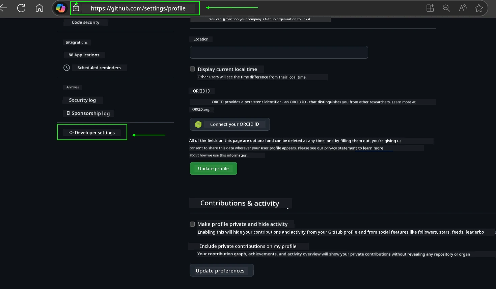
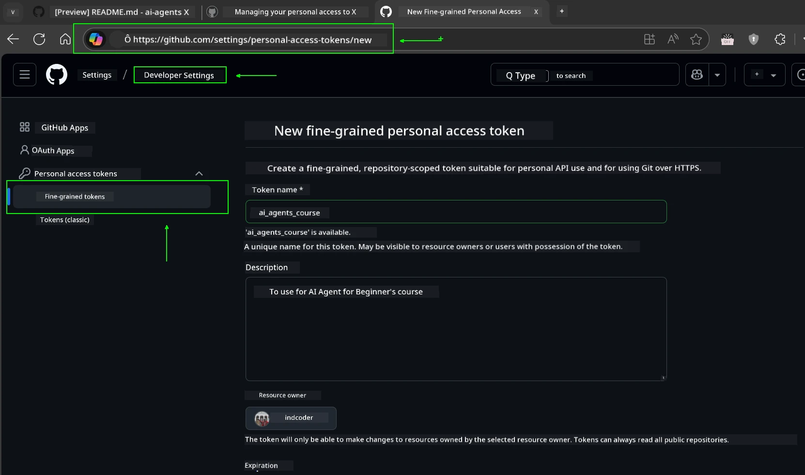
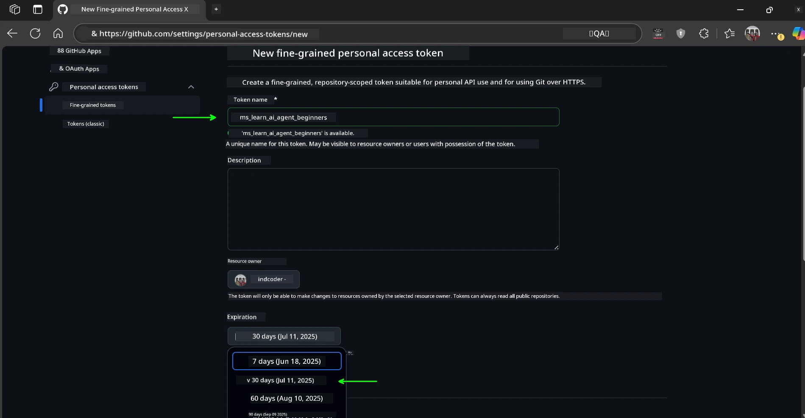
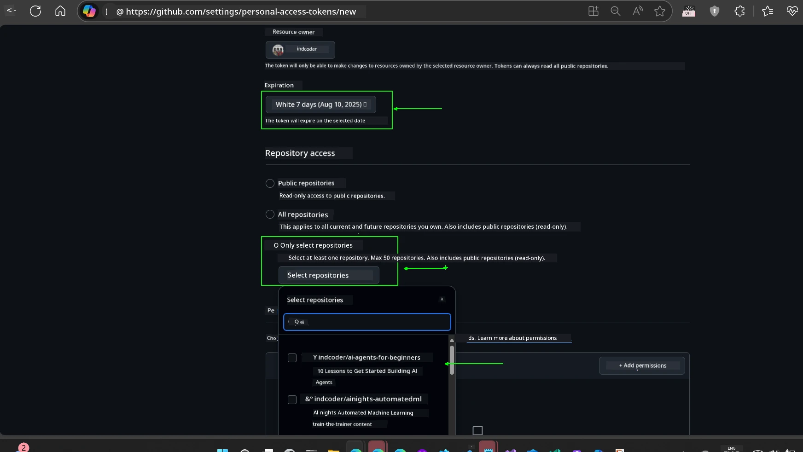
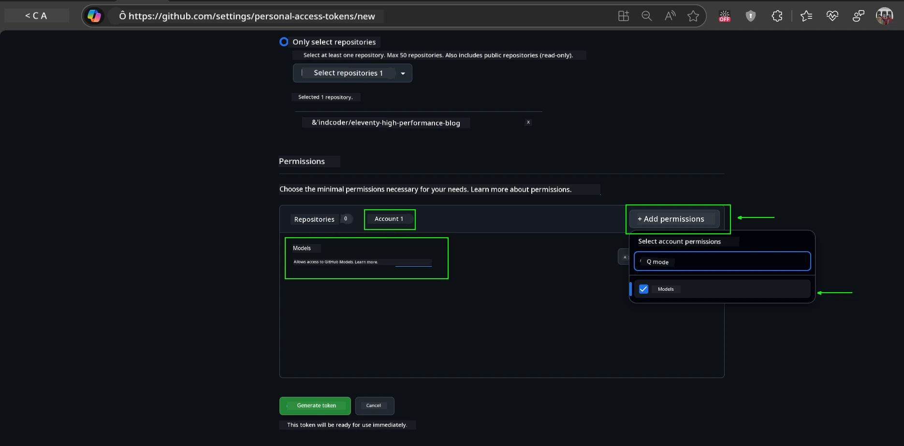
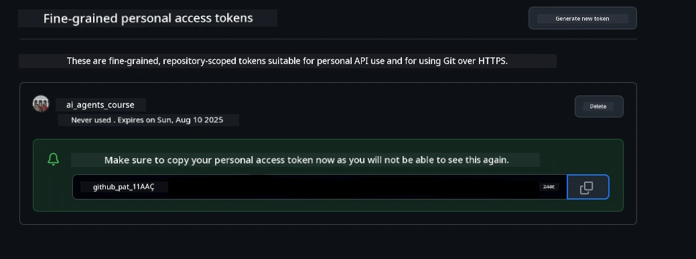
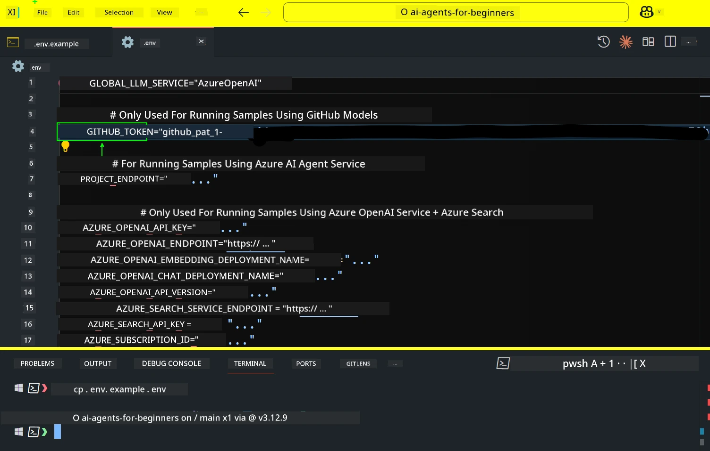
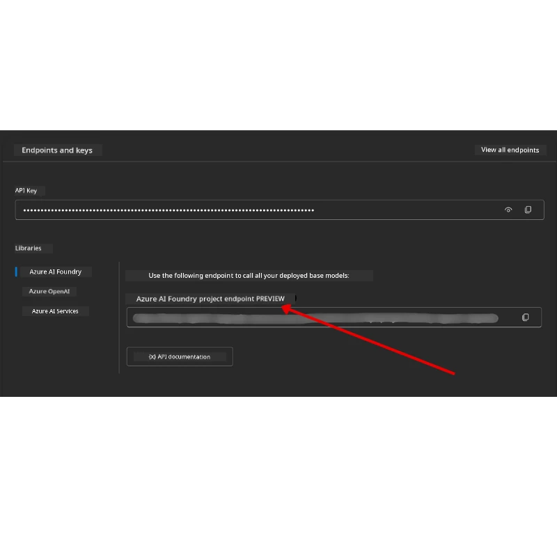

<!--
CO_OP_TRANSLATOR_METADATA:
{
  "original_hash": "63b1a8f6e840df15934935b728e569f0",
  "translation_date": "2025-12-03T13:39:35+00:00",
  "source_file": "00-course-setup/README.md",
  "language_code": "en"
}
-->
# Course Setup

## Introduction

This lesson will explain how to run the code samples provided in this course.

## Connect with Other Learners and Get Support

Before cloning the repository, join the [AI Agents For Beginners Discord channel](https://aka.ms/ai-agents/discord) to get assistance with setup, ask questions about the course, or connect with fellow learners.

## Clone or Fork this Repository

Start by cloning or forking the GitHub repository. This will create your own version of the course materials, allowing you to run, test, and modify the code!

You can do this by clicking the link to <a href="https://github.com/microsoft/ai-agents-for-beginners/fork" target="_blank">fork the repository</a>.

You should now have your own forked version of the course available at the following link:


### Shallow Clone (recommended for workshop / Codespaces)

  >The full repository can be quite large (~3 GB) if you download the complete history and all files. If you're attending a workshop or only need specific lesson folders, a shallow clone (or sparse clone) minimizes the download by truncating history and/or skipping unnecessary files.

#### Quick shallow clone — minimal history, all files

Replace `<your-username>` in the commands below with your fork URL (or the upstream URL if preferred).

To clone only the latest commit history (small download):

```bash|powershell
git clone --depth 1 https://github.com/<your-username>/ai-agents-for-beginners.git
```

To clone a specific branch:

```bash|powershell
git clone --depth 1 --branch <branch-name> https://github.com/<your-username>/ai-agents-for-beginners.git
```

#### Partial (sparse) clone — minimal blobs + only selected folders

This method uses partial clone and sparse-checkout (requires Git 2.25+ and is recommended for modern Git versions with partial clone support):

```bash|powershell
git clone --depth 1 --filter=blob:none --sparse https://github.com/<your-username>/ai-agents-for-beginners.git
```

Navigate into the repository folder:

```bash|powershell
cd ai-agents-for-beginners
```

Then specify the folders you need (example below shows two folders):

```bash|powershell
git sparse-checkout set 00-course-setup 01-intro-to-ai-agents
```

After cloning and verifying the files, if you only need the files and want to free up space (no Git history), delete the repository metadata (💀irreversible — you will lose all Git functionality: no commits, pulls, pushes, or history access).

```bash
# zsh/bash
rm -rf .git
```

```powershell
# PowerShell
Remove-Item -Recurse -Force .git
```

#### Using GitHub Codespaces (recommended to avoid large local downloads)

- Create a new Codespace for this repository via the [GitHub UI](https://github.com/codespaces).  

- In the terminal of the newly created Codespace, run one of the shallow/sparse clone commands above to bring only the lesson folders you need into the Codespace workspace.
- Optional: after cloning inside Codespaces, remove .git to reclaim extra space (see removal commands above).
- Note: If you prefer to open the repository directly in Codespaces (without an extra clone), be aware that Codespaces will construct the devcontainer environment and may still provision more than you need. Cloning a shallow copy inside a fresh Codespace gives you more control over disk usage.

#### Tips

- Always replace the clone URL with your fork if you plan to edit/commit.
- If you later need more history or files, you can fetch them or adjust sparse-checkout to include additional folders.

## Running the Code

This course provides a series of Jupyter Notebooks for hands-on experience in building AI Agents.

The code samples use one of the following:

**Requires GitHub Account - Free**:

1) Semantic Kernel Agent Framework + GitHub Models Marketplace. Labeled as (semantic-kernel.ipynb)
2) AutoGen Framework + GitHub Models Marketplace. Labeled as (autogen.ipynb)

**Requires Azure Subscription**:

3) Azure AI Foundry + Azure AI Agent Service. Labeled as (azureaiagent.ipynb)

We encourage you to try all three types of examples to determine which works best for you.

Your choice will dictate the setup steps you need to follow below:

## Requirements

- Python 3.12+
  - **NOTE**: If Python 3.12 is not installed, ensure you install it. Then create your virtual environment using Python 3.12 to ensure the correct versions are installed from the requirements.txt file.
  
    >Example

    Create a Python virtual environment directory:

    ```bash|powershell
    python -m venv venv
    ```

    Then activate the virtual environment for:

    ```bash
    # zsh/bash
    source venv/bin/activate
    ```
  
    ```dos
    # Command Prompt for Windows
    venv\Scripts\activate
    ```

- .NET 10+: For sample codes using .NET, ensure you install [.NET 10 SDK](https://dotnet.microsoft.com/download/dotnet/10.0) or later. Then, check your installed .NET SDK version:

    ```bash|powershell
    dotnet --list-sdks
    ```

- A GitHub Account - For access to the GitHub Models Marketplace
- Azure Subscription - For access to Azure AI Foundry
- Azure AI Foundry Account - For access to the Azure AI Agent Service

A `requirements.txt` file is included in the root of this repository, listing all the required Python packages to run the code samples.

Install them by running the following command in your terminal at the root of the repository:

```bash|powershell
pip install -r requirements.txt
```

We recommend creating a Python virtual environment to avoid conflicts and issues.

## Setup VSCode

Ensure you are using the correct version of Python in VSCode.


## Set Up for Samples using GitHub Models 

### Step 1: Retrieve Your GitHub Personal Access Token (PAT)

This course uses the GitHub Models Marketplace, which provides free access to Large Language Models (LLMs) for building AI Agents.

To use the GitHub Models, you need to create a [GitHub Personal Access Token](https://docs.github.com/en/authentication/keeping-your-account-and-data-secure/managing-your-personal-access-tokens).

Do this by visiting your <a href="https://github.com/settings/personal-access-tokens" target="_blank">Personal Access Tokens settings</a> in your GitHub Account.

Follow the [Principle of Least Privilege](https://docs.github.com/en/get-started/learning-to-code/storing-your-secrets-safely) when creating your token. Only grant the permissions necessary to run the code samples in this course.

1. Select the `Fine-grained tokens` option on the left side of your screen under **Developer settings**.

   

   Then select `Generate new token`.

   

2. Enter a descriptive name for your token to make its purpose clear for future reference.

    🔐 Token Duration Recommendation

    Recommended duration: 30 days
    For enhanced security, you can choose a shorter period—such as 7 days 🛡️
    This is a great way to set a personal goal and complete the course while maintaining your learning momentum 🚀.

    

3. Limit the token's scope to your fork of this repository.

    

4. Restrict the token's permissions: Under **Permissions**, click the **Account** tab, then click the "+ Add permissions" button. A dropdown will appear. Search for **Models** and check the box for it.

    

5. Verify the required permissions before generating the token. 

6. Before generating the token, ensure you are ready to store it securely, such as in a password manager vault, as it will not be displayed again after creation. 

Copy your newly created token. You will now add this to your `.env` file included in this course.

### Step 2: Create Your `.env` File

To create your `.env` file, run the following command in your terminal.

```bash
# zsh/bash
cp .env.example .env
```

```powershell
# PowerShell
Copy-Item .env.example .env
```

This will copy the example file and create a `.env` in your directory, where you can fill in the values for the environment variables.

Paste your copied token into the `GITHUB_TOKEN` field in the `.env` file using your preferred text editor.



You should now be able to run the code samples provided in this course.

## Set Up for Samples using Azure AI Foundry and Azure AI Agent Service

### Step 1: Retrieve Your Azure Project Endpoint

Follow the steps for creating a hub and project in Azure AI Foundry outlined here: [Hub resources overview](https://learn.microsoft.com/azure/ai-foundry/concepts/ai-resources)

Once your project is created, retrieve the connection string for your project.

Do this by visiting the **Overview** page of your project in the Azure AI Foundry portal.



### Step 2: Create Your `.env` File

To create your `.env` file, run the following command in your terminal.

```bash
# zsh/bash
cp .env.example .env
```

```powershell
# PowerShell
Copy-Item .env.example .env
```

This will copy the example file and create a `.env` in your directory, where you can fill in the values for the environment variables.

Paste your copied token into the `PROJECT_ENDPOINT` field in the `.env` file using your preferred text editor.

### Step 3: Sign in to Azure

As a security best practice, we'll use [keyless authentication](https://learn.microsoft.com/azure/developer/ai/keyless-connections?tabs=csharp%2Cazure-cli?WT.mc_id=academic-105485-koreyst) to authenticate to Azure OpenAI with Microsoft Entra ID. 

Next, open a terminal and run `az login --use-device-code` to sign in to your Azure account.

Once logged in, select your subscription in the terminal.

## Additional Environment Variables - Azure Search and Azure OpenAI 

For the Agentic RAG Lesson - Lesson 5 - there are samples that use Azure Search and Azure OpenAI.

If you want to run these samples, you will need to add the following environment variables to your `.env` file:

### Overview Page (Project)

- `AZURE_SUBSCRIPTION_ID` - Check **Project details** on the **Overview** page of your project.

- `AZURE_AI_PROJECT_NAME` - Look at the top of the **Overview** page for your project.

- `AZURE_OPENAI_SERVICE` - Find this in the **Included capabilities** tab for **Azure OpenAI Service** on the **Overview** page.

### Management Center

- `AZURE_OPENAI_RESOURCE_GROUP` - Go to **Project properties** on the **Overview** page of the **Management Center**.

- `GLOBAL_LLM_SERVICE` - Under **Connected resources**, find the **Azure AI Services** connection name. If not listed, check the **Azure portal** under your resource group for the AI Services resource name.

### Models + Endpoints Page

- `AZURE_OPENAI_EMBEDDING_DEPLOYMENT_NAME` - Select your embedding model (e.g., `text-embedding-ada-002`) and note the **Deployment name** from the model details.

- `AZURE_OPENAI_CHAT_DEPLOYMENT_NAME` - Select your chat model (e.g., `gpt-4o-mini`) and note the **Deployment name** from the model details.

### Azure Portal

- `AZURE_OPENAI_ENDPOINT` - Look for **Azure AI services**, click on it, then go to **Resource Management**, **Keys and Endpoint**, scroll down to the "Azure OpenAI endpoints", and copy the one that says "Language APIs".

- `AZURE_OPENAI_API_KEY` - From the same screen, copy KEY 1 or KEY 2.

- `AZURE_SEARCH_SERVICE_ENDPOINT` - Find your **Azure AI Search** resource, click it, and see **Overview**.

- `AZURE_SEARCH_API_KEY` - Then go to **Settings** and then **Keys** to copy the primary or secondary admin key.

### External Webpage

- `AZURE_OPENAI_API_VERSION` - Visit the [API version lifecycle](https://learn.microsoft.com/azure/ai-services/openai/api-version-deprecation#latest-ga-api-release) page under **Latest GA API release**.

### Setup keyless authentication

Rather than hardcoding your credentials, we'll use a keyless connection with Azure OpenAI. To do so, we'll import `DefaultAzureCredential` and later call the `DefaultAzureCredential` function to get the credential.

```python
# Python
from azure.identity import DefaultAzureCredential, InteractiveBrowserCredential
```

## Stuck Somewhere?
If you encounter any problems running this setup, feel free to join our <a href="https://discord.gg/kzRShWzttr" target="_blank">Azure AI Community Discord</a> or <a href="https://github.com/microsoft/ai-agents-for-beginners/issues?WT.mc_id=academic-105485-koreyst" target="_blank">open an issue</a>.

## Next Lesson

You are now ready to execute the code for this course. Enjoy diving deeper into the world of AI Agents!

[Introduction to AI Agents and Agent Use Cases](../01-intro-to-ai-agents/README.md)

---

<!-- CO-OP TRANSLATOR DISCLAIMER START -->
**Disclaimer**:  
This document has been translated using the AI translation service [Co-op Translator](https://github.com/Azure/co-op-translator). While we strive for accuracy, please note that automated translations may contain errors or inaccuracies. The original document in its native language should be considered the authoritative source. For critical information, professional human translation is recommended. We are not liable for any misunderstandings or misinterpretations arising from the use of this translation.
<!-- CO-OP TRANSLATOR DISCLAIMER END -->