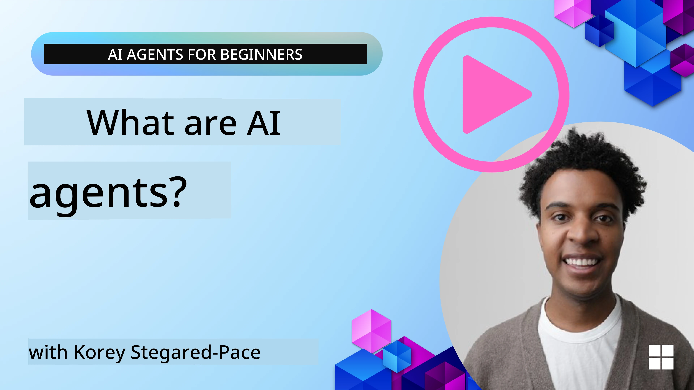
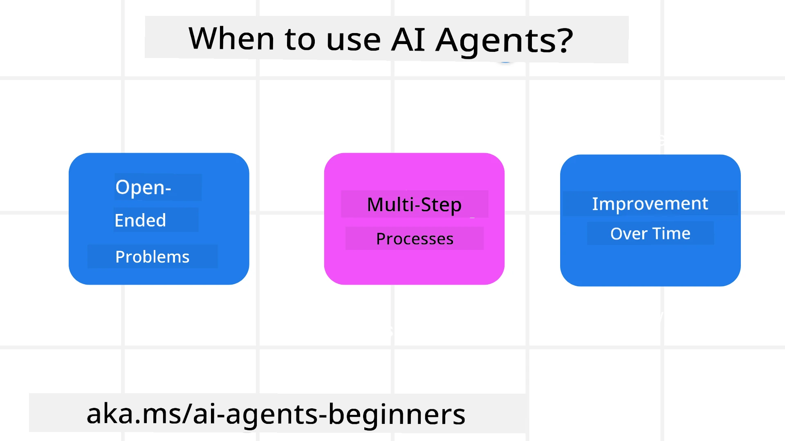

<!--
CO_OP_TRANSLATOR_METADATA:
{
  "original_hash": "cdd28bc00816d2773bb2b5968d782abc",
  "translation_date": "2025-11-11T10:45:42+00:00",
  "source_file": "01-intro-to-ai-agents/README.md",
  "language_code": "en"
}
-->

> _(Click the image above to view the video of this lesson)_

# Introduction to AI Agents and Agent Use Cases

Welcome to the "AI Agents for Beginners" course! This course provides fundamental knowledge and practical examples for building AI Agents.

Join the <a href="https://discord.gg/kzRShWzttr" target="_blank">Azure AI Discord Community</a> to connect with other learners and AI Agent Builders and ask any questions you have about this course.

To begin this course, we will first gain a better understanding of what AI Agents are and how they can be used in the applications and workflows we create.

## Introduction

This lesson covers:

- What are AI Agents and what are the different types of agents?
- What use cases are best suited for AI Agents and how can they assist us?
- What are some of the basic building blocks for designing Agentic Solutions?

## Learning Goals
After completing this lesson, you should be able to:

- Understand the concepts of AI Agents and how they differ from other AI solutions.
- Use AI Agents effectively.
- Design Agentic solutions efficiently for both users and customers.

## Defining AI Agents and Types of AI Agents

### What are AI Agents?

AI Agents are **systems** that enable **Large Language Models (LLMs)** to **perform actions** by extending their capabilities, providing LLMs with **access to tools** and **knowledge**.

Let’s break this definition into smaller parts:

- **System** - It’s important to think of agents not as a single component but as a system of multiple components. At the basic level, the components of an AI Agent are:
  - **Environment** - The defined space where the AI Agent operates. For example, if we had a travel booking AI Agent, the environment could be the travel booking system the AI Agent uses to complete tasks.
  - **Sensors** - Environments contain information and provide feedback. AI Agents use sensors to gather and interpret this information about the current state of the environment. In the travel booking agent example, the travel booking system might provide information like hotel availability or flight prices.
  - **Actuators** - Once the AI Agent receives the current state of the environment, it determines the action to perform to change the environment for the current task. For the travel booking agent, this might involve booking an available room for the user.

**Large Language Models** - The concept of agents existed before LLMs were created. The advantage of building AI Agents with LLMs is their ability to interpret human language and data. This capability allows LLMs to understand environmental information and define a plan to change the environment.

**Perform Actions** - Outside of AI Agent systems, LLMs are limited to generating content or information based on a user’s prompt. Within AI Agent systems, LLMs can accomplish tasks by interpreting the user’s request and using tools available in their environment.

**Access To Tools** - The tools available to the LLM are defined by 1) the environment it operates in and 2) the developer of the AI Agent. For our travel agent example, the agent’s tools are limited by the operations available in the booking system, and/or the developer can restrict the agent’s tool access to flights.

**Memory+Knowledge** - Memory can be short-term, within the context of the conversation between the user and the agent. Long-term, beyond the information provided by the environment, AI Agents can also retrieve knowledge from other systems, services, tools, and even other agents. In the travel agent example, this knowledge might include information about the user’s travel preferences stored in a customer database.

### The different types of agents

Now that we have a general definition of AI Agents, let’s explore some specific agent types and how they might be applied to a travel booking AI agent.

| **Agent Type**                | **Description**                                                                                                                       | **Example**                                                                                                                                                                                                                   |
| ----------------------------- | ------------------------------------------------------------------------------------------------------------------------------------- | ----------------------------------------------------------------------------------------------------------------------------------------------------------------------------------------------------------------------------- |
| **Simple Reflex Agents**      | Perform immediate actions based on predefined rules.                                                                                  | Travel agent interprets the context of an email and forwards travel complaints to customer service.                                                                                                                          |
| **Model-Based Reflex Agents** | Perform actions based on a model of the world and changes to that model.                                                              | Travel agent prioritizes routes with significant price changes based on access to historical pricing data.                                                                                                             |
| **Goal-Based Agents**         | Create plans to achieve specific goals by interpreting the goal and determining actions to reach it.                                  | Travel agent books a journey by determining necessary travel arrangements (car, public transit, flights) from the current location to the destination.                                                                                |
| **Utility-Based Agents**      | Consider preferences and weigh tradeoffs numerically to determine how to achieve goals.                                               | Travel agent maximizes utility by weighing convenience vs. cost when booking travel.                                                                                                                                          |
| **Learning Agents**           | Improve over time by responding to feedback and adjusting actions accordingly.                                                        | Travel agent improves by using customer feedback from post-trip surveys to make adjustments to future bookings.                                                                                                               |
| **Hierarchical Agents**       | Feature multiple agents in a tiered system, with higher-level agents breaking tasks into subtasks for lower-level agents to complete. | Travel agent cancels a trip by dividing the task into subtasks (for example, canceling specific bookings) and having lower-level agents complete them, reporting back to the higher-level agent.                                     |
| **Multi-Agent Systems (MAS)** | Agents complete tasks independently, either cooperatively or competitively.                                                           | Cooperative: Multiple agents book specific travel services such as hotels, flights, and entertainment. Competitive: Multiple agents manage and compete over a shared hotel booking calendar to book customers into the hotel. |

## When to Use AI Agents

In the earlier section, we used the Travel Agent use case to explain how different types of agents can be applied to various travel booking scenarios. We will continue to use this application throughout the course.

Let’s examine the types of use cases where AI Agents are most effective:

- **Open-Ended Problems** - Allowing the LLM to determine the necessary steps to complete a task because it can’t always be hardcoded into a workflow.
- **Multi-Step Processes** - Tasks that require a level of complexity where the AI Agent needs to use tools or information over multiple turns instead of single-shot retrieval.  
- **Improvement Over Time** - Tasks where the agent can improve over time by receiving feedback from either its environment or users to provide better utility.

We will cover more considerations for using AI Agents in the Building Trustworthy AI Agents lesson.

## Basics of Agentic Solutions

### Agent Development

The first step in designing an AI Agent system is to define the tools, actions, and behaviors. In this course, we focus on using the **Azure AI Agent Service** to define our Agents. It offers features like:

- Selection of Open Models such as OpenAI, Mistral, and Llama
- Use of Licensed Data through providers such as Tripadvisor
- Use of standardized OpenAPI 3.0 tools

### Agentic Patterns

Communication with LLMs is done through prompts. Given the semi-autonomous nature of AI Agents, it isn’t always possible or necessary to manually reprompt the LLM after a change in the environment. We use **Agentic Patterns** that allow us to prompt the LLM over multiple steps in a more scalable way.

This course is divided into some of the currently popular Agentic patterns.

### Agentic Frameworks

Agentic Frameworks allow developers to implement agentic patterns through code. These frameworks offer templates, plugins, and tools for better AI Agent collaboration. These benefits provide capabilities for improved observability and troubleshooting of AI Agent systems.

In this course, we will explore the research-driven AutoGen framework and the production-ready Agent framework from Semantic Kernel.

## Sample Codes

- Python: [Agent Framework](./code_samples/01-python-agent-framework.ipynb)
- .NET: [Agent Framework](./code_samples/01-dotnet-agent-framework.md)

## Got More Questions about AI Agents?

Join the [Azure AI Foundry Discord](https://aka.ms/ai-agents/discord) to connect with other learners, attend office hours, and get your AI Agents questions answered.

## Previous Lesson

[Course Setup](../00-course-setup/README.md)

## Next Lesson

[Exploring Agentic Frameworks](../02-explore-agentic-frameworks/README.md)

---

<!-- CO-OP TRANSLATOR DISCLAIMER START -->
**Disclaimer**:  
This document has been translated using the AI translation service [Co-op Translator](https://github.com/Azure/co-op-translator). While we aim for accuracy, please note that automated translations may include errors or inaccuracies. The original document in its native language should be regarded as the authoritative source. For critical information, professional human translation is advised. We are not responsible for any misunderstandings or misinterpretations resulting from the use of this translation.
<!-- CO-OP TRANSLATOR DISCLAIMER END -->