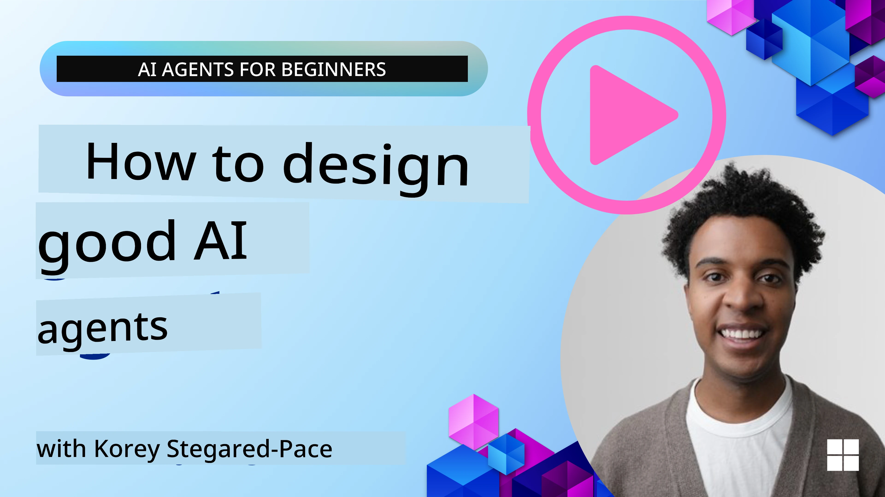
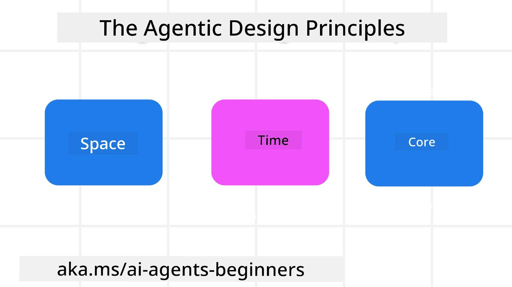

<!--
CO_OP_TRANSLATOR_METADATA:
{
  "original_hash": "d71524fe83a23829ae7a23b4031aaac8",
  "translation_date": "2025-11-13T10:48:17+00:00",
  "source_file": "03-agentic-design-patterns/README.md",
  "language_code": "en"
}
-->

> _(Click the image above to view the video of this lesson)_
# AI Agentic Design Principles

## Introduction

There are many ways to approach building AI Agentic Systems. Since ambiguity is a feature rather than a flaw in Generative AI design, engineers often find it challenging to determine where to begin. We have developed a set of human-centered UX Design Principles to help developers create customer-focused agentic systems that address their business needs. These principles are not a rigid architecture but rather a starting point for teams designing and building agent experiences.

In general, agents should:

- Expand and scale human capabilities (brainstorming, problem-solving, automation, etc.)
- Bridge knowledge gaps (helping users get up to speed in specific domains, translation, etc.)
- Facilitate and support collaboration in ways that align with individual preferences for working with others
- Help us become better versions of ourselves (e.g., life coach/task manager, teaching emotional regulation and mindfulness skills, building resilience, etc.)

## This Lesson Will Cover

- What the Agentic Design Principles are
- Guidelines for implementing these design principles
- Examples of applying the design principles

## Learning Goals

After completing this lesson, you will be able to:

1. Explain what the Agentic Design Principles are
2. Describe the guidelines for applying the Agentic Design Principles
3. Understand how to design an agent using the Agentic Design Principles

## The Agentic Design Principles

### Agent (Space)

This refers to the environment in which the agent operates. These principles guide how we design agents to engage in both physical and digital worlds.

- **Connecting, not collapsing** – Facilitate connections between people, events, and actionable knowledge to promote collaboration and interaction.
  - Agents help link events, knowledge, and individuals.
  - Agents bring people closer together rather than replacing or diminishing them.
- **Easily accessible yet occasionally invisible** – The agent primarily operates in the background, stepping in only when relevant and appropriate.
  - The agent is easily discoverable and accessible to authorized users on any device or platform.
  - The agent supports multimodal inputs and outputs (sound, voice, text, etc.).
  - The agent can seamlessly shift between foreground and background, as well as between proactive and reactive modes, based on user needs.
  - The agent may operate invisibly, but its background processes and collaboration with other agents remain transparent and controllable by the user.

### Agent (Time)

This refers to how the agent functions over time. These principles guide the design of agents that interact across past, present, and future contexts.

- **Past**: Reflecting on history, including both state and context.
  - The agent provides more relevant results by analyzing richer historical data beyond just events, people, or states.
  - The agent creates connections from past events and actively reflects on memory to engage with current situations.
- **Now**: Nudging rather than merely notifying.
  - The agent takes a comprehensive approach to interacting with users. When an event occurs, it goes beyond static notifications or formalities, simplifying workflows or dynamically generating cues to direct the user’s attention at the right moment.
  - The agent delivers information tailored to the contextual environment, social and cultural changes, and user intent.
  - The agent’s interactions can evolve gradually, growing in complexity to empower users over time.
- **Future**: Adapting and evolving.
  - The agent adapts to various devices, platforms, and modalities.
  - The agent adjusts to user behavior, accessibility needs, and is freely customizable.
  - The agent evolves through continuous user interaction.

### Agent (Core)

These are the fundamental elements at the heart of an agent’s design.

- **Embrace uncertainty but establish trust**.
  - A certain level of uncertainty is inherent in agent design and should be expected.
  - Trust and transparency are essential foundations of agent design.
  - Users remain in control of when the agent is active or inactive, and the agent’s status is always clearly visible.

## The Guidelines to Implement These Principles

When applying the design principles mentioned above, follow these guidelines:

1. **Transparency**: Inform users that AI is involved, explain how it works (including past actions), and provide ways to give feedback and modify the system.
2. **Control**: Allow users to customize, specify preferences, and personalize the system. Ensure they have control over its attributes (including the ability to delete data).
3. **Consistency**: Strive for consistent, multimodal experiences across devices and platforms. Use familiar UI/UX elements (e.g., a microphone icon for voice interaction) and minimize cognitive load (e.g., concise responses, visual aids, and ‘Learn More’ content).

## How To Design a Travel Agent using These Principles and Guidelines

Imagine you are designing a Travel Agent. Here’s how you could apply the Design Principles and Guidelines:

1. **Transparency** – Inform users that the Travel Agent is AI-enabled. Provide basic instructions to get started (e.g., a “Hello” message, sample prompts). Clearly document this on the product page. Display a history of prompts the user has asked. Make it clear how to provide feedback (e.g., thumbs up/down, a “Send Feedback” button). Clearly state any usage or topic restrictions for the agent.
2. **Control** – Ensure users can modify the agent after it’s created, such as adjusting the System Prompt. Allow users to choose the agent’s verbosity, writing style, and any topics it should avoid. Enable users to view and delete associated files, data, prompts, and past conversations.
3. **Consistency** – Use standard, recognizable icons for actions like sharing prompts, adding files or photos, and tagging someone or something. For example, use a paperclip icon for file uploads/sharing and an image icon for uploading graphics.

## Sample Codes

- Python: [Agent Framework](./code_samples/03-python-agent-framework.ipynb)
- .NET: [Agent Framework](./code_samples/03-dotnet-agent-framework.md)

## Got More Questions about AI Agentic Design Patterns?

Join the [Azure AI Foundry Discord](https://aka.ms/ai-agents/discord) to connect with other learners, attend office hours, and get your AI Agents questions answered.

## Additional Resources

- <a href="https://openai.com" target="_blank">Practices for Governing Agentic AI Systems | OpenAI</a>
- <a href="https://microsoft.com" target="_blank">The HAX Toolkit Project - Microsoft Research</a>
- <a href="https://responsibleaitoolbox.ai" target="_blank">Responsible AI Toolbox</a>

## Previous Lesson

[Exploring Agentic Frameworks](../02-explore-agentic-frameworks/README.md)

## Next Lesson

[Tool Use Design Pattern](../04-tool-use/README.md)

---

<!-- CO-OP TRANSLATOR DISCLAIMER START -->
**Disclaimer**:  
This document has been translated using the AI translation service [Co-op Translator](https://github.com/Azure/co-op-translator). While we strive for accuracy, please note that automated translations may contain errors or inaccuracies. The original document in its native language should be regarded as the authoritative source. For critical information, professional human translation is recommended. We are not responsible for any misunderstandings or misinterpretations resulting from the use of this translation.
<!-- CO-OP TRANSLATOR DISCLAIMER END -->