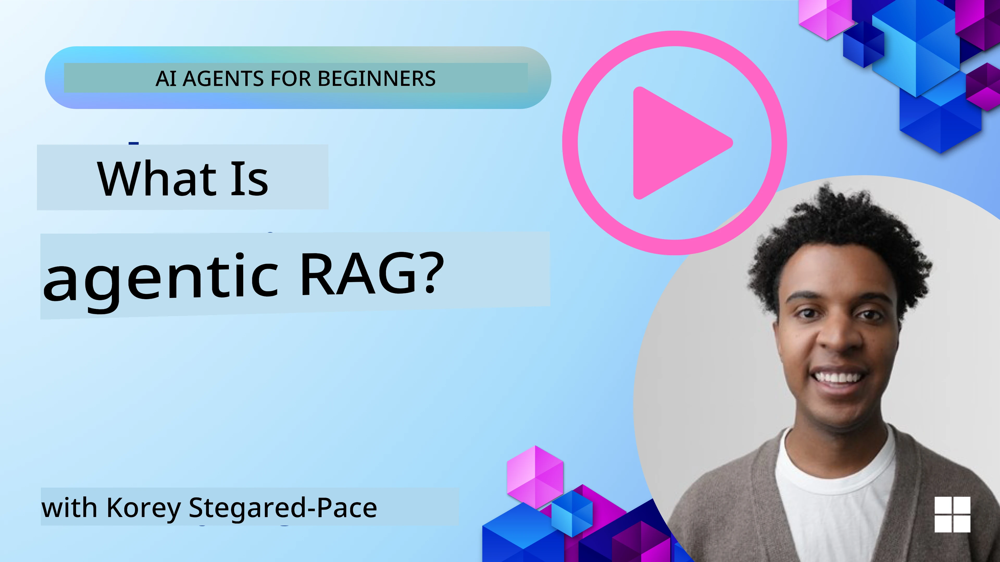
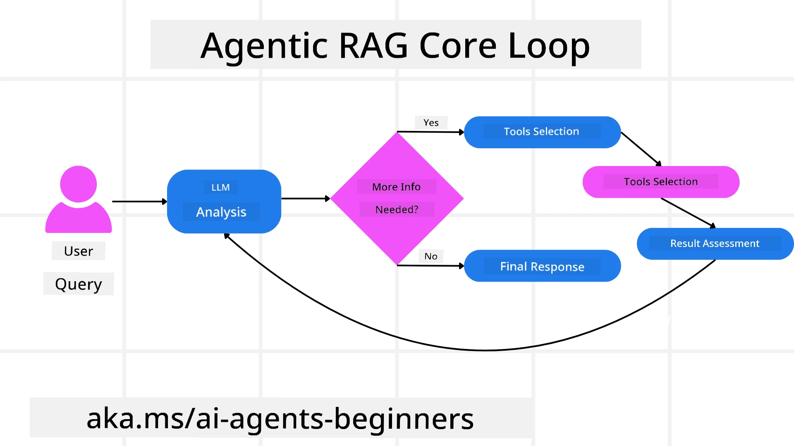
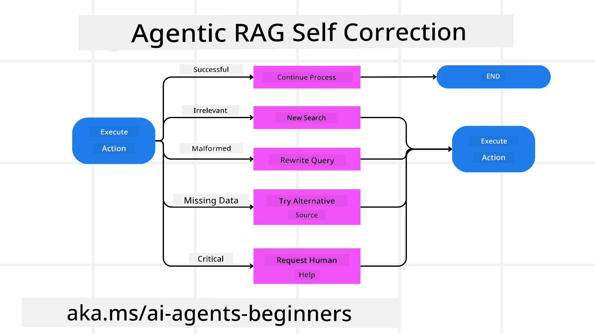
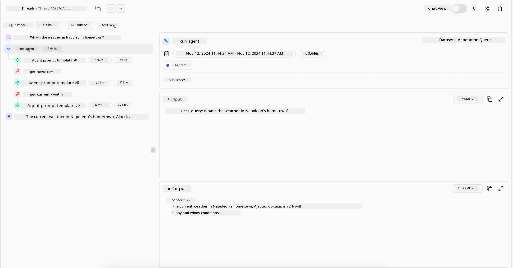

<!--
CO_OP_TRANSLATOR_METADATA:
{
  "original_hash": "0ebf6b2290db55dbf2d10cc49655523b",
  "translation_date": "2025-09-30T06:08:45+00:00",
  "source_file": "05-agentic-rag/README.md",
  "language_code": "en"
}
-->

> _(Click the image above to view the video of this lesson)_

# Agentic RAG

This lesson provides a detailed overview of Agentic Retrieval-Augmented Generation (Agentic RAG), a cutting-edge AI paradigm where large language models (LLMs) autonomously plan their next steps while retrieving information from external sources. Unlike static retrieval-then-read approaches, Agentic RAG involves iterative interactions with the LLM, interspersed with tool or function calls and structured outputs. The system evaluates results, refines queries, invokes additional tools as needed, and repeats this process until a satisfactory solution is reached.

## Introduction

This lesson will cover:

- **Understanding Agentic RAG:** Learn about the emerging AI paradigm where large language models (LLMs) autonomously plan their next steps while retrieving information from external data sources.
- **Iterative Maker-Checker Style:** Understand the iterative loop of LLM calls, interspersed with tool or function calls and structured outputs, designed to improve accuracy and handle malformed queries.
- **Exploring Practical Applications:** Discover scenarios where Agentic RAG excels, such as correctness-focused environments, complex database interactions, and extended workflows.

## Learning Goals

After completing this lesson, you will be able to:

- **Understand Agentic RAG:** Gain insights into the emerging AI paradigm where large language models (LLMs) autonomously plan their next steps while retrieving information from external data sources.
- **Iterative Maker-Checker Style:** Grasp the concept of iterative LLM calls, interspersed with tool or function calls and structured outputs, aimed at improving accuracy and handling malformed queries.
- **Own the Reasoning Process:** Understand the system's ability to take ownership of its reasoning process, making decisions on how to approach problems without relying on pre-defined paths.
- **Workflow:** Learn how an agentic model independently retrieves market trend reports, identifies competitor data, correlates internal sales metrics, synthesizes findings, and evaluates strategies.
- **Iterative Loops, Tool Integration, and Memory:** Explore the system's reliance on looped interactions, maintaining state and memory across steps to avoid repetitive loops and make informed decisions.
- **Handling Failure Modes and Self-Correction:** Understand the system's robust self-correction mechanisms, including iterating and re-querying, using diagnostic tools, and relying on human oversight when necessary.
- **Boundaries of Agency:** Recognize the limitations of Agentic RAG, focusing on domain-specific autonomy, infrastructure dependence, and adherence to guardrails.
- **Practical Use Cases and Value:** Identify scenarios where Agentic RAG excels, such as correctness-focused environments, complex database interactions, and extended workflows.
- **Governance, Transparency, and Trust:** Learn about the importance of governance and transparency, including explainable reasoning, bias control, and human oversight.

## What is Agentic RAG?

Agentic Retrieval-Augmented Generation (Agentic RAG) is a cutting-edge AI paradigm where large language models (LLMs) autonomously plan their next steps while retrieving information from external sources. Unlike static retrieval-then-read approaches, Agentic RAG involves iterative interactions with the LLM, interspersed with tool or function calls and structured outputs. The system evaluates results, refines queries, invokes additional tools as needed, and repeats this process until a satisfactory solution is reached. This iterative “maker-checker” style improves accuracy, handles malformed queries, and ensures high-quality results.

The system actively takes ownership of its reasoning process, rewriting failed queries, choosing different retrieval methods, and integrating multiple tools—such as vector search in Azure AI Search, SQL databases, or custom APIs—before finalizing its answer. The defining characteristic of an agentic system is its ability to take ownership of its reasoning process. Traditional RAG implementations rely on pre-defined paths, but an agentic system autonomously determines the sequence of steps based on the quality of the information it retrieves.

## Defining Agentic Retrieval-Augmented Generation (Agentic RAG)

Agentic Retrieval-Augmented Generation (Agentic RAG) is an emerging AI paradigm where LLMs not only retrieve information from external data sources but also autonomously plan their next steps. Unlike static retrieval-then-read approaches or carefully scripted prompt sequences, Agentic RAG involves a loop of iterative LLM calls, interspersed with tool or function calls and structured outputs. At each step, the system evaluates the results it has obtained, decides whether to refine its queries, invokes additional tools if needed, and continues this cycle until it achieves a satisfactory solution.

This iterative “maker-checker” style is designed to improve accuracy, handle malformed queries to structured databases (e.g., NL2SQL), and ensure balanced, high-quality results. Instead of relying solely on carefully engineered prompt chains, the system actively takes ownership of its reasoning process. It can rewrite failed queries, choose different retrieval methods, and integrate multiple tools—such as vector search in Azure AI Search, SQL databases, or custom APIs—before finalizing its answer. This eliminates the need for overly complex orchestration frameworks. Instead, a relatively simple loop of “LLM call → tool use → LLM call → …” can produce sophisticated and well-grounded outputs.

## Owning the Reasoning Process

The defining characteristic of an “agentic” system is its ability to take ownership of its reasoning process. Traditional RAG implementations often rely on humans to pre-define a path for the model: a chain-of-thought that outlines what to retrieve and when.  
But a truly agentic system internally decides how to approach the problem. It’s not just executing a script; it’s autonomously determining the sequence of steps based on the quality of the information it retrieves.  
For example, if tasked with creating a product launch strategy, it doesn’t rely solely on a prompt that outlines the entire research and decision-making workflow. Instead, the agentic model independently decides to:

1. Retrieve current market trend reports using Bing Web Grounding.
2. Identify relevant competitor data using Azure AI Search.
3. Correlate historical internal sales metrics using Azure SQL Database.
4. Synthesize the findings into a cohesive strategy orchestrated via Azure OpenAI Service.
5. Evaluate the strategy for gaps or inconsistencies, prompting another round of retrieval if necessary.

All of these steps—refining queries, choosing sources, iterating until “satisfied” with the answer—are decided by the model, not pre-scripted by a human.

## Iterative Loops, Tool Integration, and Memory

An agentic system relies on a looped interaction pattern:

- **Initial Call:** The user’s goal (i.e., user prompt) is presented to the LLM.
- **Tool Invocation:** If the model identifies missing information or ambiguous instructions, it selects a tool or retrieval method—like a vector database query (e.g., Azure AI Search Hybrid search over private data) or a structured SQL call—to gather more context.
- **Assessment & Refinement:** After reviewing the returned data, the model decides whether the information suffices. If not, it refines the query, tries a different tool, or adjusts its approach.
- **Repeat Until Satisfied:** This cycle continues until the model determines that it has enough clarity and evidence to deliver a final, well-reasoned response.
- **Memory & State:** Because the system maintains state and memory across steps, it can recall previous attempts and their outcomes, avoiding repetitive loops and making more informed decisions as it proceeds.

Over time, this creates a sense of evolving understanding, enabling the model to navigate complex, multi-step tasks without requiring a human to constantly intervene or reshape the prompt.

## Handling Failure Modes and Self-Correction

Agentic RAG’s autonomy also includes robust self-correction mechanisms. When the system encounters dead ends—such as retrieving irrelevant documents or encountering malformed queries—it can:

- **Iterate and Re-Query:** Instead of returning low-value responses, the model attempts new search strategies, rewrites database queries, or explores alternative data sets.
- **Use Diagnostic Tools:** The system may invoke additional functions designed to debug its reasoning steps or confirm the correctness of retrieved data. Tools like Azure AI Tracing will be crucial for robust observability and monitoring.
- **Fallback on Human Oversight:** For high-stakes or repeatedly failing scenarios, the model might flag uncertainty and request human guidance. Once the human provides corrective feedback, the model can incorporate that lesson moving forward.

This iterative and dynamic approach allows the model to continuously improve, ensuring it’s not just a one-shot system but one that learns from its missteps during a given session.

## Boundaries of Agency

Despite its autonomy within a task, Agentic RAG is not equivalent to Artificial General Intelligence. Its “agentic” capabilities are limited to the tools, data sources, and policies provided by human developers. It cannot invent its own tools or operate outside the domain boundaries set for it. Instead, it excels at dynamically orchestrating the resources at hand.  
Key differences from more advanced AI forms include:

1. **Domain-Specific Autonomy:** Agentic RAG systems focus on achieving user-defined goals within a known domain, employing strategies like query rewriting or tool selection to improve outcomes.
2. **Infrastructure-Dependent:** The system’s capabilities depend on the tools and data integrated by developers. It cannot exceed these boundaries without human intervention.
3. **Respect for Guardrails:** Ethical guidelines, compliance rules, and business policies remain critical. The agent’s freedom is always constrained by safety measures and oversight mechanisms (hopefully?).

## Practical Use Cases and Value

Agentic RAG excels in scenarios requiring iterative refinement and precision:

1. **Correctness-First Environments:** In compliance checks, regulatory analysis, or legal research, the agentic model can repeatedly verify facts, consult multiple sources, and rewrite queries until it produces a thoroughly vetted answer.
2. **Complex Database Interactions:** When working with structured data where queries often fail or need adjustment, the system can autonomously refine its queries using Azure SQL or Microsoft Fabric OneLake, ensuring the final retrieval aligns with the user’s intent.
3. **Extended Workflows:** Longer-running sessions may evolve as new information surfaces. Agentic RAG can continuously incorporate new data, adapting its strategies as it learns more about the problem space.

## Governance, Transparency, and Trust

As these systems become more autonomous in their reasoning, governance and transparency are essential:

- **Explainable Reasoning:** The model can provide an audit trail of the queries it made, the sources it consulted, and the reasoning steps it took to reach its conclusion. Tools like Azure AI Content Safety and Azure AI Tracing / GenAIOps can help maintain transparency and mitigate risks.
- **Bias Control and Balanced Retrieval:** Developers can tune retrieval strategies to ensure balanced, representative data sources are considered, and regularly audit outputs to detect bias or skewed patterns using custom models for advanced data science organizations using Azure Machine Learning.
- **Human Oversight and Compliance:** For sensitive tasks, human review remains essential. Agentic RAG doesn’t replace human judgment in high-stakes decisions—it augments it by delivering more thoroughly vetted options.

Having tools that provide a clear record of actions is crucial. Without them, debugging a multi-step process can be very challenging. See the following example from Literal AI (the company behind Chainlit) for an Agent run:

## Conclusion

Agentic RAG represents a natural evolution in how AI systems handle complex, data-intensive tasks. By adopting a looped interaction pattern, autonomously selecting tools, and refining queries until achieving a high-quality result, the system moves beyond static prompt-following into a more adaptive, context-aware decision-maker. While still bounded by human-defined infrastructures and ethical guidelines, these agentic capabilities enable richer, more dynamic, and ultimately more useful AI interactions for both enterprises and end-users.

### Got More Questions about Agentic RAG?

Join the [Azure AI Foundry Discord](https://aka.ms/ai-agents/discord) to connect with other learners, attend office hours, and get your AI Agents questions answered.

## Additional Resources

- <a href="https://learn.microsoft.com/training/modules/use-own-data-azure-openai" target="_blank">Implement Retrieval Augmented Generation (RAG) with Azure OpenAI Service: Learn how to use your own data with the Azure OpenAI Service. This Microsoft Learn module provides a comprehensive guide on implementing RAG</a>
- <a href="https://learn.microsoft.com/azure/ai-studio/concepts/evaluation-approach-gen-ai" target="_blank">Evaluation of generative AI applications with Azure AI Foundry: This article covers the evaluation and comparison of models on publicly available datasets, including Agentic AI applications and RAG architectures</a>
- <a href="https://weaviate.io/blog/what-is-agentic-rag" target="_blank">What is Agentic RAG | Weaviate</a>
- <a href="https://ragaboutit.com/agentic-rag-a-complete-guide-to-agent-based-retrieval-augmented-generation/" target="_blank">Agentic RAG: A Complete Guide to Agent-Based Retrieval Augmented Generation – News from generation RAG</a>
- <a href="https://huggingface.co/learn/cookbook/agent_rag" target="_blank">Agentic RAG: turbocharge your RAG with query reformulation and self-query! Hugging Face Open-Source AI Cookbook</a>
- <a href="https://youtu.be/aQ4yQXeB1Ss?si=2HUqBzHoeB5tR04U" target="_blank">Adding Agentic Layers to RAG</a>
- <a href="https://www.youtube.com/watch?v=zeAyuLc_f3Q&t=244s" target="_blank">The Future of Knowledge Assistants: Jerry Liu</a>
- <a href="https://www.youtube.com/watch?v=AOSjiXP1jmQ" target="_blank">How to Build Agentic RAG Systems</a>
- <a href="https://ignite.microsoft.com/sessions/BRK102?source=sessions" target="_blank">Using Azure AI Foundry Agent Service to scale your AI agents</a>

### Academic Papers

- <a href="https://arxiv.org/abs/2303.17651" target="_blank">2303.17651 Self-Refine: Iterative Refinement with Self-Feedback</a>
- <a href="https://arxiv.org/abs/2303.11366" target="_blank">2303.11366 Reflexion: Language Agents with Verbal Reinforcement Learning</a>
- <a href="https://arxiv.org/abs/2305.11738" target="_blank">2305.11738 CRITIC: Large Language Models Can Self-Correct with Tool-Interactive Critiquing</a>
- <a href="https://arxiv.org/abs/2501.09136" target="_blank">2501.09136 Agentic Retrieval-Augmented Generation: A Survey on Agentic RAG</a>

## Previous Lesson

[Tool Use Design Pattern](../04-tool-use/README.md)

## Next Lesson

[Building Trustworthy AI Agents](../06-building-trustworthy-agents/README.md)

---

**Disclaimer**:  
This document has been translated using the AI translation service [Co-op Translator](https://github.com/Azure/co-op-translator). While we aim for accuracy, please note that automated translations may include errors or inaccuracies. The original document in its native language should be regarded as the authoritative source. For critical information, professional human translation is advised. We are not responsible for any misunderstandings or misinterpretations resulting from the use of this translation.