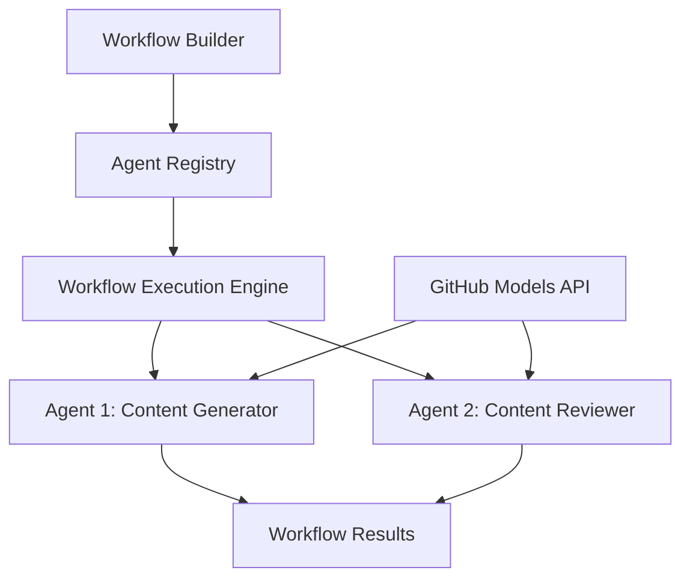

<!--
CO_OP_TRANSLATOR_METADATA:
{
  "original_hash": "034158688d0a45aae06dcbb21b0da5ae",
  "translation_date": "2025-11-11T12:38:19+00:00",
  "source_file": "08-multi-agent/code_samples/workflows-agent-framework/dotNET/01.dotnet-agent-framework-workflow-ghmodel-basic.md",
  "language_code": "en"
}
-->
# 🔄 Basic Agent Workflows with GitHub Models (.NET)

## 📋 Workflow Orchestration Tutorial

This notebook explains how to create advanced **agent workflows** using the Microsoft Agent Framework for .NET and GitHub Models. You'll learn to develop multi-step business processes where AI agents collaborate to complete complex tasks through structured orchestration patterns.

## 🎯 Learning Objectives

### 🏗️ **Workflow Architecture Fundamentals**
- **Workflow Builder**: Design and manage complex multi-step AI processes
- **Agent Coordination**: Organize multiple specialized agents within workflows
- **GitHub Models Integration**: Utilize GitHub's AI model inference service in workflows
- **Visual Workflow Design**: Build and visualize workflow structures for better comprehension

### 🔄 **Process Orchestration Patterns**
- **Sequential Processing**: Link multiple agent tasks in a logical sequence
- **State Management**: Preserve context and data flow across workflow stages
- **Error Handling**: Implement robust error recovery and workflow resilience
- **Performance Optimization**: Create efficient workflows for large-scale operations

### 🏢 **Enterprise Workflow Applications**
- **Business Process Automation**: Streamline complex organizational workflows
- **Content Production Pipeline**: Editorial workflows with review and approval stages
- **Customer Service Automation**: Multi-step resolution of customer inquiries
- **Data Processing Workflows**: ETL workflows with AI-driven transformation

## ⚙️ Prerequisites & Setup

### 📦 **Required NuGet Packages**

This workflow demonstration utilizes several essential .NET packages:

```xml
<!-- Core AI Framework -->
<PackageReference Include="Microsoft.Extensions.AI" Version="9.9.0" />

<!-- Agent Framework (Local Development) -->
<!-- Microsoft.Agents.AI.dll - Core agent abstractions -->
<!-- Microsoft.Agents.AI.OpenAI.dll - OpenAI/GitHub Models integration -->

<!-- Configuration and Environment -->
<PackageReference Include="DotNetEnv" Version="3.1.1" />
```

### 🔑 **GitHub Models Configuration**

**Environment Setup (.env file):**
```env
GITHUB_TOKEN=your_github_personal_access_token
GITHUB_ENDPOINT=https://models.inference.ai.azure.com
GITHUB_MODEL_ID=gpt-4o-mini
```

**GitHub Models Access:**
1. Sign up for GitHub Models (currently in preview)
2. Generate a personal access token with model access permissions
3. Configure environment variables as shown above

### 🏗️ **Workflow Architecture Overview**



**Key Components:**
- **WorkflowBuilder**: The main orchestration engine for designing workflows
- **AIAgent**: Individual specialized agents with specific functionalities
- **GitHub Models Client**: Integration with the AI model inference service
- **Execution Context**: Manages state and data flow between workflow stages

## 🎨 **Enterprise Workflow Design Patterns**

### 📝 **Content Production Workflow**
```
User Request → Content Generation → Quality Review → Final Output
```

### 🔍 **Document Processing Pipeline**
```
Document Input → Analysis → Extraction → Validation → Structured Output
```

### 💼 **Business Intelligence Workflow**
```
Data Collection → Processing → Analysis → Report Generation → Distribution
```

### 🤝 **Customer Service Automation**
```
Customer Inquiry → Classification → Processing → Response Generation → Follow-up
```

## 🏢 **Enterprise Benefits**

### 🎯 **Reliability & Scalability**
- **Deterministic Execution**: Predictable, repeatable workflow results
- **Error Recovery**: Smooth handling of failures at any workflow stage
- **Performance Monitoring**: Monitor execution metrics and identify optimization opportunities
- **Resource Management**: Efficient use of AI model resources

### 🔒 **Security & Compliance**
- **Secure Authentication**: GitHub token-based authentication for API access
- **Audit Trails**: Comprehensive logging of workflow execution and decision points
- **Access Control**: Detailed permissions for workflow execution and monitoring
- **Data Privacy**: Secure handling of sensitive information throughout workflows

### 📊 **Observability & Management**
- **Visual Workflow Design**: Clear representation of process flows and dependencies
- **Execution Monitoring**: Real-time tracking of workflow progress and performance
- **Error Reporting**: Detailed error analysis and debugging tools
- **Performance Analytics**: Metrics for optimization and capacity planning

Let's create your first enterprise-ready AI workflow! 🚀

## 💻 Running the Code

The complete implementation is available in `01.dotnet-agent-framework-workflow-ghmodel-basic.cs`. This file demonstrates:

1. **Environment Configuration** - Loading GitHub Models credentials from `.env` file
2. **OpenAI Client Setup** - Configuring the client to use GitHub Models endpoint
3. **Agent Creation** - Defining specialized agents (Front Desk and Concierge)
4. **Workflow Builder** - Creating a multi-agent workflow with sequential processing
5. **Workflow Execution** - Running the workflow with streaming results

### 🚀 Running the Example

```bash
# Make the script executable (Unix/Linux/macOS)
chmod +x 01.dotnet-agent-framework-workflow-ghmodel-basic.cs

# Run the workflow
./01.dotnet-agent-framework-workflow-ghmodel-basic.cs
```

Or on Windows:
```powershell
dotnet run 01.dotnet-agent-framework-workflow-ghmodel-basic.cs
```

### 📝 Expected Output

The workflow will:
1. Accept your travel destination request ("I would like to go to Paris")
2. The Front Desk agent provides an initial recommendation
3. The Concierge agent reviews and refines the recommendation
4. Final output displays the complete conversation stream

### 🔧 Customization

You can personalize the workflow by:
- Modifying agent instructions to alter their behavior
- Adding more agents to create complex multi-step workflows
- Changing the user message to test different scenarios
- Adjusting the workflow edges to create different execution patterns

---

<!-- CO-OP TRANSLATOR DISCLAIMER START -->
**Disclaimer**:  
This document has been translated using the AI translation service [Co-op Translator](https://github.com/Azure/co-op-translator). While we aim for accuracy, please note that automated translations may include errors or inaccuracies. The original document in its native language should be regarded as the authoritative source. For critical information, professional human translation is advised. We are not responsible for any misunderstandings or misinterpretations resulting from the use of this translation.
<!-- CO-OP TRANSLATOR DISCLAIMER END -->