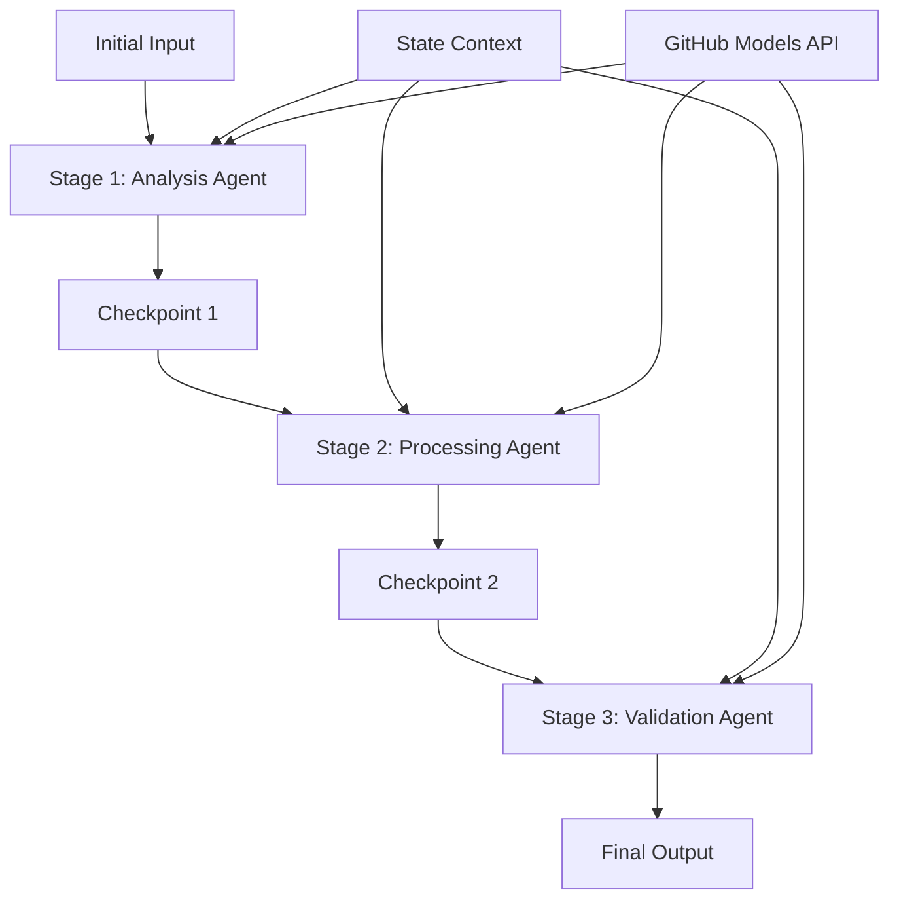

<!--
CO_OP_TRANSLATOR_METADATA:
{
  "original_hash": "1be9c8dcbd79a02d33d2c138684c1394",
  "translation_date": "2025-11-11T13:38:46+00:00",
  "source_file": "08-multi-agent/code_samples/workflows-agent-framework/dotNET/02.dotnet-agent-framework-workflow-ghmodel-sequential.md",
  "language_code": "en"
}
-->
# ⏩ Sequential Agent Workflows with GitHub Models (.NET)

## 📋 Advanced Sequential Processing Tutorial

This notebook demonstrates **sequential workflow patterns** using the Microsoft Agent Framework for .NET and GitHub Models. You'll learn how to build sophisticated, step-by-step processing pipelines where agents execute in a specific order, with each stage building upon the results of the previous stage.

## 🎯 Learning Objectives

### 🔄 **Sequential Processing Architecture**
- **Linear Workflow Design**: Create step-by-step processing pipelines with clear dependencies
- **State Management**: Maintain context and data flow across sequential workflow stages
- **GitHub Models Integration**: Leverage GitHub's AI models in multi-stage .NET workflows
- **Enterprise Pipeline Patterns**: Build production-ready sequential processing systems

### 🏗️ **Advanced Sequential Patterns**
- **Stage-Gate Processing**: Implement validation checkpoints between workflow stages
- **Context Preservation**: Maintain state and accumulated knowledge across all stages
- **Error Propagation**: Handle failures gracefully in sequential processing chains
- **Performance Optimization**: Efficient sequential execution with minimal overhead

### 🏢 **Enterprise Sequential Applications**
- **Document Processing Pipeline**: Multi-stage document analysis, transformation, and validation
- **Quality Assurance Workflows**: Sequential review, validation, and approval processes
- **Content Production Pipeline**: Research → Writing → Editing → Review → Publishing
- **Business Process Automation**: Multi-step business workflows with clear stage dependencies

## ⚙️ Prerequisites & Setup

### 📦 **Required NuGet Packages**

Essential packages for .NET sequential workflows:

```xml
<!-- Core AI Framework -->
<PackageReference Include="Microsoft.Extensions.AI" Version="9.9.0" />

<!-- Client Model Abstractions -->
<PackageReference Include="System.ClientModel" Version="1.6.1.0" />

<!-- Azure Identity and Async LINQ Support -->
<PackageReference Include="Azure.Identity" Version="1.15.0" />
<PackageReference Include="System.Linq.Async" Version="6.0.3" />

<!-- Local Agent Framework References -->
<!-- Microsoft.Agents.AI.dll - Core agent abstractions -->
<!-- Microsoft.Agents.AI.OpenAI.dll - GitHub Models integration -->
```

### 🔑 **GitHub Models Configuration**

**Environment Setup (.env file):**
```env
GITHUB_TOKEN=your_github_personal_access_token
GITHUB_ENDPOINT=https://models.inference.ai.azure.com
GITHUB_MODEL_ID=gpt-4o-mini
```

**Configuration Management:**
```csharp
// Load environment variables securely
Env.Load("../../../.env");
var githubToken = Environment.GetEnvironmentVariable("GITHUB_TOKEN");
var githubEndpoint = Environment.GetEnvironmentVariable("GITHUB_ENDPOINT");
var modelId = Environment.GetEnvironmentVariable("GITHUB_MODEL_ID");
```

### 🏗️ **Sequential Workflow Architecture**



**Key Components:**
- **Sequential Agents**: Specialized agents for each processing stage
- **State Context**: Maintains accumulated data and decisions across stages
- **Checkpoints**: Validation points between stages to ensure quality and consistency
- **GitHub Models Client**: Consistent AI model access across all workflow stages

## 🎨 **Sequential Workflow Design Patterns**

### 📝 **Document Processing Pipeline**
```
Raw Document → Content Extraction → Analysis → Validation → Structured Output
```

### 🎯 **Content Creation Workflow**
```
Brief/Requirements → Research → Content Creation → Review → Final Polish
```

### 🔍 **Quality Assurance Pipeline**
```
Initial Review → Technical Validation → Compliance Check → Final Approval
```

### 💼 **Business Intelligence Workflow**
```
Data Collection → Processing → Analysis → Report Generation → Distribution
```

## 🏢 **Enterprise Sequential Benefits**

### 🎯 **Reliability & Quality**
- **Deterministic Processing**: Consistent, repeatable outcomes through structured stages
- **Quality Gates**: Validation checkpoints ensure quality at each stage
- **Error Isolation**: Problems in one stage don't propagate to subsequent stages
- **Audit Trails**: Complete tracking of decisions and transformations at each stage

### 📈 **Scalability & Performance**
- **Modular Design**: Each stage can be optimized independently
- **Resource Management**: Efficient allocation of AI model resources across stages
- **State Optimization**: Minimal state transfer between stages for optimal performance
- **Parallel Stage Groups**: Multiple sequential workflows can run in parallel

### 🔒 **Security & Compliance**
- **Stage-Level Security**: Different security policies for different processing stages
- **Data Validation**: Ensure data integrity and compliance at each checkpoint
- **Access Control**: Granular permissions for different workflow stages
- **Regulatory Compliance**: Meet regulatory requirements through structured processing

### 📊 **Monitoring & Analytics**
- **Stage-Level Metrics**: Performance monitoring for each workflow stage
- **Bottleneck Identification**: Identify and optimize slow stages
- **Quality Metrics**: Track quality and success rates at each stage
- **Process Optimization**: Continuous improvement based on stage-level analytics

Let's build robust sequential AI processing pipelines! 🚀

## 💻 Running the Code

The complete implementation is available in `02.dotnet-agent-framework-workflow-ghmodel-sequential.cs`. This file demonstrates a **three-stage furniture analysis workflow**:

1. **Stage 1 - Sales Agent**: Analyzes furniture images and provides purchase suggestions
2. **Stage 2 - Price Agent**: Provides detailed pricing breakdowns and budget options
3. **Stage 3 - Quote Agent**: Generates a professional quote document in Markdown format

### 🏗️ **Workflow Architecture**

```
Image Input → Sales Analysis → Price Estimation → Quote Generation → Final Output
```

Each agent:
- Receives the output from the previous stage as context
- Builds upon previous analysis with specialized expertise
- Maintains workflow continuity through state management

### 🚀 Running the Example

**Prerequisites:**
- Place a furniture image at `../imgs/home.png` (or update the `imgPath` variable)
- Configure your `.env` file with GitHub Models credentials

```bash
# Make the script executable (Unix/Linux/macOS)
chmod +x 02.dotnet-agent-framework-workflow-ghmodel-sequential.cs

# Run the sequential workflow
./02.dotnet-agent-framework-workflow-ghmodel-sequential.cs
```

Or on Windows:
```powershell
dotnet run 02.dotnet-agent-framework-workflow-ghmodel-sequential.cs
```

### 📝 Expected Output

The workflow will:
1. **Sales Agent**: Identify furniture items from the image and provide recommendations
2. **Price Agent**: Add detailed pricing analysis with budget tiers and shopping recommendations
3. **Quote Agent**: Generate a formatted quote document with all information synthesized

The final output will be a comprehensive, professional furniture quote based on image analysis.

### 🔧 Customization Options

**Modify Agent Behavior:**
```csharp
// Adjust agent instructions to change their focus
const string SalesAgentInstructions = "Your custom instructions...";
```

**Change Sequential Flow:**
```csharp
// Add or reorder workflow stages
var workflow = new WorkflowBuilder(salesagent)
    .AddEdge(salesagent, priceagent)
    .AddEdge(priceagent, quoteagent)
    .AddEdge(quoteagent, newAgent)  // Add another stage
    .Build();
```

**Use Different Input:**
```csharp
// Process text instead of images
ChatMessage userMessage = new ChatMessage(ChatRole.User, [
    new TextContent("Analyze pricing for a modern living room set")
]);
```

### 🎯 Real-World Applications

This sequential pattern is ideal for:
- **E-commerce**: Product analysis → Pricing → Quote generation
- **Real Estate**: Property analysis → Valuation → Listing creation
- **Insurance**: Claim analysis → Assessment → Quote generation
- **Content Creation**: Research → Writing → Editing → Publishing

### 🔍 Understanding State Flow

Each agent in the sequence receives:
- **Original Input**: The initial user message (image + text)
- **Previous Agent Outputs**: All previous agent responses in the conversation history
- **Accumulated Context**: Complete state maintained throughout the workflow

This enables sophisticated multi-stage processing where each agent builds upon comprehensive context from all previous stages.

---

<!-- CO-OP TRANSLATOR DISCLAIMER START -->
**Disclaimer**:  
This document has been translated using the AI translation service [Co-op Translator](https://github.com/Azure/co-op-translator). While we aim for accuracy, please note that automated translations may include errors or inaccuracies. The original document in its native language should be regarded as the authoritative source. For critical information, professional human translation is advised. We are not responsible for any misunderstandings or misinterpretations resulting from the use of this translation.
<!-- CO-OP TRANSLATOR DISCLAIMER END -->