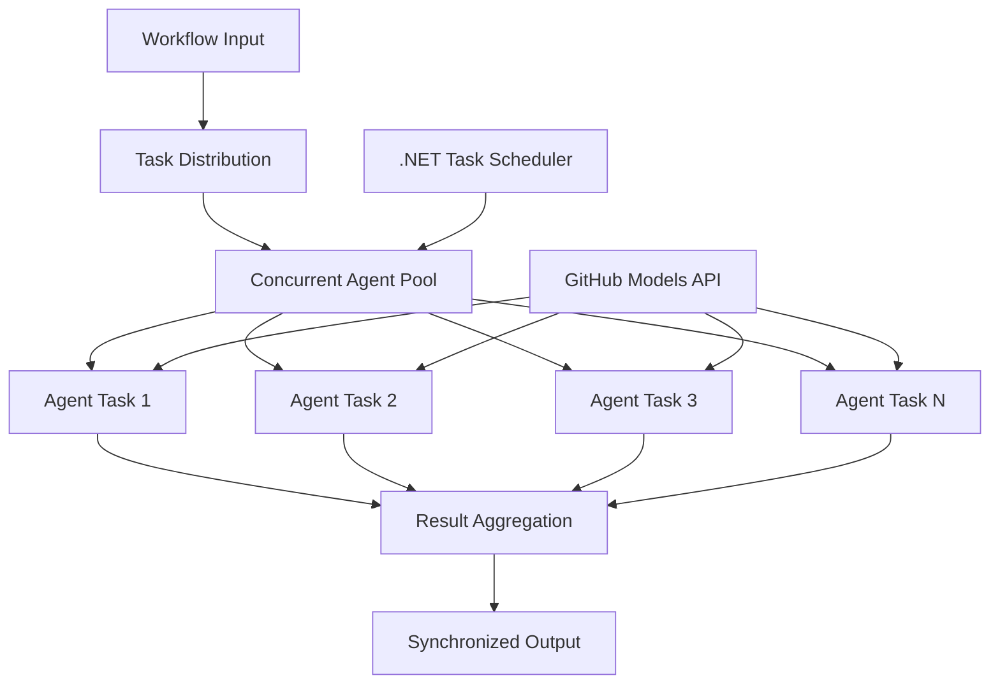

<!--
CO_OP_TRANSLATOR_METADATA:
{
  "original_hash": "b9c6e32c9b5f2fed20b6916984440d88",
  "translation_date": "2025-11-11T13:04:08+00:00",
  "source_file": "08-multi-agent/code_samples/workflows-agent-framework/dotNET/03.dotnet-agent-framework-workflow-ghmodel-concurrent.md",
  "language_code": "en"
}
-->
# ⚡ Concurrent Agent Workflows with GitHub Models (.NET)

## 📋 High-Performance Parallel Processing Tutorial

This notebook demonstrates **concurrent workflow patterns** using the Microsoft Agent Framework for .NET and GitHub Models. You'll learn how to build high-performance, parallel processing workflows that maximize throughput by executing multiple AI agents simultaneously while maintaining coordination and data consistency.

## 🎯 Learning Objectives

### 🚀 **Concurrent Processing Fundamentals**
- **Parallel Agent Execution**: Run multiple AI agents simultaneously for maximum performance
- **Async/Await Patterns**: Leverage .NET's async programming model for efficient concurrency
- **GitHub Models Integration**: Coordinate multiple concurrent calls to GitHub's AI model inference service
- **Resource Management**: Efficiently manage AI model resources across concurrent operations

### 🏗️ **Advanced Concurrency Architecture**
- **Task-Based Parallelism**: Use .NET Task Parallel Library for optimal concurrent execution
- **Synchronization Patterns**: Coordinate concurrent agents while avoiding race conditions
- **Load Balancing**: Distribute work efficiently across available concurrent processing capacity
- **Fault Tolerance**: Handle individual agent failures without stopping the entire workflow

### 🏢 **Enterprise Concurrent Applications**
- **High-Volume Document Processing**: Process multiple documents simultaneously
- **Real-Time Content Analysis**: Concurrent analysis of incoming data streams
- **Batch Processing Optimization**: Maximize throughput for large-scale data processing operations
- **Multi-Modal Analysis**: Parallel processing of different content types and formats

## ⚙️ Prerequisites & Setup

### 📦 **Required NuGet Packages**

Essential packages for high-performance concurrent workflows:

```xml
<!-- Core AI Framework with Async Support -->
<PackageReference Include="Microsoft.Extensions.AI" Version="9.9.0" />

<!-- Client Model Abstractions for API Communication -->
<PackageReference Include="System.ClientModel" Version="1.6.1.0" />

<!-- Azure Identity and Async LINQ for Advanced Operations -->
<PackageReference Include="Azure.Identity" Version="1.15.0" />
<PackageReference Include="System.Linq.Async" Version="6.0.3" />

<!-- Local Agent Framework References -->
<!-- Microsoft.Agents.AI.dll - Core agent abstractions with async support -->
<!-- Microsoft.Agents.AI.OpenAI.dll - GitHub Models integration with concurrency -->
```

### 🔑 **GitHub Models Configuration**

**Environment Setup (.env file):**
```env
GITHUB_TOKEN=your_github_personal_access_token
GITHUB_ENDPOINT=https://models.inference.ai.azure.com
GITHUB_MODEL_ID=gpt-4o-mini
```

**Concurrent Processing Considerations:**
```csharp
// Configure for concurrent operations
var clientOptions = new OpenAIClientOptions()
{
    Endpoint = new Uri(githubEndpoint),
    // Configure connection pooling for concurrent requests
    NetworkTimeout = TimeSpan.FromMinutes(5)
};
```

### 🏗️ **Concurrent Workflow Architecture**



**Key Components:**
- **Task Parallel Library**: .NET's built-in support for concurrent operations
- **Agent Pool**: Multiple agent instances for parallel processing
- **Result Aggregation**: Coordination and merging of concurrent agent results
- **Synchronization Points**: Ensure data consistency across concurrent operations

## 🎨 **Concurrent Workflow Design Patterns**

### 🔍 **Parallel Research & Analysis**
```
Research Topic → Concurrent Research Agents → Result Synthesis → Final Report
```

### 📊 **Multi-Source Data Processing**
```
Data Sources → Parallel Processing Agents → Data Integration → Unified Output
```

### 🎭 **Content Generation Pipeline**
```
Content Requirements → Concurrent Content Generators → Quality Review → Final Content
```

### 🔄 **Fan-Out/Fan-In Processing**
```
Single Input → Multiple Concurrent Processors → Result Aggregation → Single Output
```

## 🏢 **Enterprise Performance Benefits**

### ⚡ **Throughput & Scalability**
- **Linear Performance Scaling**: Add more concurrent agents to increase throughput
- **Resource Utilization**: Maximum efficiency of available AI model capacity
- **Reduced Processing Time**: Significant time reduction through parallel execution
- **Elastic Scaling**: Dynamically adjust concurrent agent count based on workload

### 🛡️ **Reliability & Resilience**
- **Fault Isolation**: Individual agent failures don't affect other concurrent operations
- **Graceful Degradation**: System continues operating with reduced agent capacity
- **Error Recovery**: Automatic retry mechanisms for failed concurrent operations
- **Load Distribution**: Even distribution of work across available agents

### 📊 **Performance Monitoring**
- **Concurrent Execution Metrics**: Track performance of all parallel operations
- **Resource Usage Analytics**: Monitor CPU, memory, and network utilization
- **Throughput Analysis**: Measure efficiency gains from concurrent processing
- **Bottleneck Detection**: Identify and resolve performance constraints

### 🔧 **Development & Operations**
- **Async Programming Model**: Leverage .NET's mature async/await patterns
- **Task Coordination**: Built-in task management and coordination capabilities
- **Exception Handling**: Comprehensive error handling for concurrent operations
- **Debugging Support**: Visual Studio debugging tools for concurrent workflows

Let's build high-performance concurrent AI workflows with .NET! 🚀

## 💻 Running the Code

The complete implementation is available in `03.dotnet-agent-framework-workflow-ghmodel-concurrent.cs`. This file demonstrates a **Fan-Out/Fan-In concurrent workflow** for travel planning:

### 🏗️ **Workflow Architecture**

```
User Request → ConcurrentStartExecutor → [Researcher Agent || Planner Agent] → ConcurrentAggregationExecutor → Final Output
```

**Key Components:**

1. **ConcurrentStartExecutor**: Broadcasts the user request to all agents simultaneously
2. **Researcher Agent**: Analyzes destinations and attractions concurrently
3. **Planner Agent**: Creates detailed travel plans concurrently
4. **ConcurrentAggregationExecutor**: Collects and merges results from both agents

### 🎯 **Fan-Out/Fan-In Pattern**

This workflow demonstrates the classic **Fan-Out/Fan-In** pattern:
- **Fan-Out**: One input message is broadcast to multiple agents simultaneously
- **Concurrent Processing**: Multiple agents work in parallel on the same task
- **Fan-In**: Results from all agents are collected and aggregated into a single output

### 🚀 Running the Example

```bash
# Make the script executable (Unix/Linux/macOS)
chmod +x 03.dotnet-agent-framework-workflow-ghmodel-concurrent.cs

# Run the concurrent workflow
./03.dotnet-agent-framework-workflow-ghmodel-concurrent.cs
```

Or on Windows:
```powershell
dotnet run 03.dotnet-agent-framework-workflow-ghmodel-concurrent.cs
```

### 📝 Expected Output

The workflow will:
1. **Broadcast Request**: Send "Plan a trip to Seattle in December" to both agents
2. **Concurrent Processing**: Both agents work simultaneously:
   - Researcher identifies attractions and details
   - Planner creates itinerary and logistics
3. **Aggregation**: Combine both responses into comprehensive output
4. **Display Results**: Show the merged travel plan with all information

### 🔧 Customization Options

**Add More Concurrent Agents:**
```csharp
// Create additional specialized agents
AIAgent budgetAgent = openAIClient.GetChatClient(github_model_id).CreateAIAgent(
    name: "Budget-Agent", instructions: "Calculate travel costs...");

// Add to fan-out
var workflow = new WorkflowBuilder(startExecutor)
    .AddFanOutEdge(startExecutor, targets: [researcherAgent, plannerAgent, budgetAgent])
    .AddFanInEdge(aggregationExecutor, sources: [researcherAgent, plannerAgent, budgetAgent])
    .WithOutputFrom(aggregationExecutor)
    .Build();

// Update aggregation count
if (this._messages.Count == 3) { ... }
```

**Modify Agent Instructions:**
```csharp
const string ResearcherAgentInstructions = "Your custom instructions for research...";
const string PlanAgentInstructions = "Your custom instructions for planning...";
```

**Change the Task:**
```csharp
StreamingRun run = await InProcessExecution.StreamAsync(
    workflow, 
    "Plan a European vacation for 2 weeks in summer"
);
```

### 🎯 Real-World Applications

This concurrent pattern is ideal for:
- **Content Creation**: Multiple writers creating different sections simultaneously
- **Code Review**: Multiple reviewers analyzing code from different perspectives
- **Market Research**: Parallel analysis of different market segments
- **Document Processing**: Concurrent extraction, analysis, and validation
- **Multi-Perspective Analysis**: Getting diverse viewpoints on the same input

### 🔍 Understanding Custom Executors

**ConcurrentStartExecutor:**
- Implements `IMessageHandler<string>` to accept string input
- Broadcasts messages to all connected agents
- Sends `TurnToken` to trigger concurrent processing

**ConcurrentAggregationExecutor:**
- Implements `IMessageHandler<ChatMessage>` to receive agent responses
- Collects messages in a thread-safe manner
- Aggregates when all expected responses arrive
- Yields final output using `context.YieldOutputAsync()`

### ⚡ Performance Benefits

**Concurrent vs Sequential:**
- Sequential: Agent1 (30s) → Agent2 (30s) = **60 seconds total**
- Concurrent: Agent1 (30s) || Agent2 (30s) = **30 seconds total**

**Throughput improvement**: Up to N× faster for N concurrent agents (depending on workload and resources)

### 🛡️ Error Handling

The workflow handles individual agent failures gracefully:
- If one agent fails, others continue processing
- Aggregator can implement timeout logic
- Partial results can be returned if needed

### 📊 Advanced Features

**Dynamic Agent Count:**
Modify the aggregation logic to support variable agent counts:

```csharp
private int _expectedAgentCount;
private readonly List<ChatMessage> _messages = [];

public async ValueTask HandleAsync(ChatMessage message, IWorkflowContext context)
{
    this._messages.Add(message);
    if (this._messages.Count == _expectedAgentCount)
    {
        // Process aggregation
    }
}
```

This concurrent workflow pattern is essential for building high-performance, scalable AI agent systems!

---

<!-- CO-OP TRANSLATOR DISCLAIMER START -->
**Disclaimer**:  
This document has been translated using the AI translation service [Co-op Translator](https://github.com/Azure/co-op-translator). While we aim for accuracy, please note that automated translations may include errors or inaccuracies. The original document in its native language should be regarded as the authoritative source. For critical information, professional human translation is advised. We are not responsible for any misunderstandings or misinterpretations resulting from the use of this translation.
<!-- CO-OP TRANSLATOR DISCLAIMER END -->