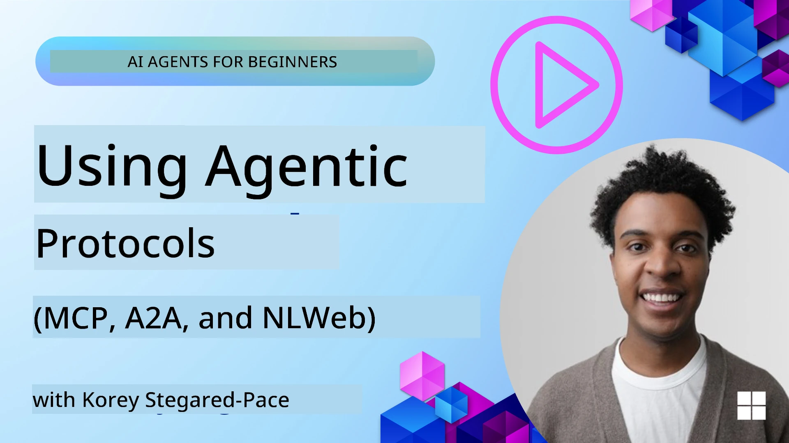
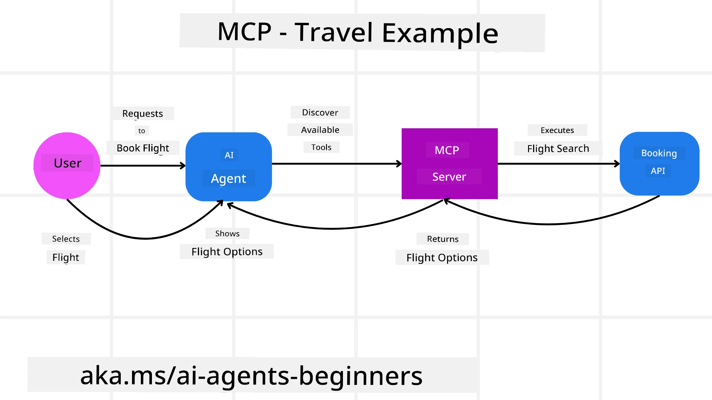
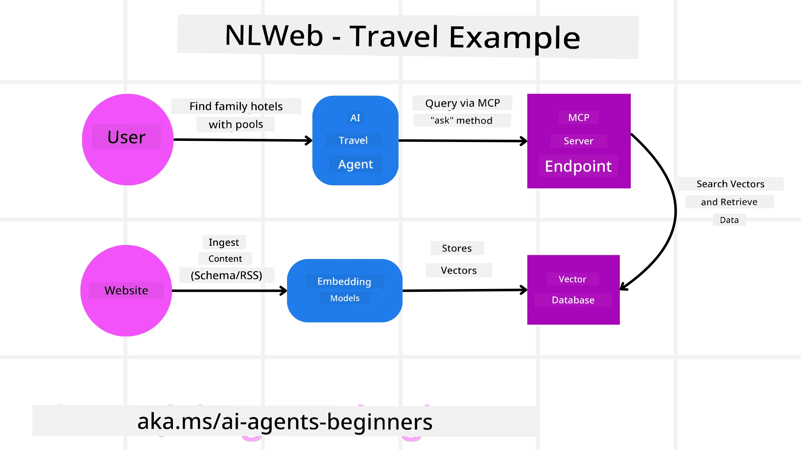

<!--
CO_OP_TRANSLATOR_METADATA:
{
  "original_hash": "aff92c6f019b4627ca9399c6e3882e17",
  "translation_date": "2025-09-18T13:59:47+00:00",
  "source_file": "11-agentic-protocols/README.md",
  "language_code": "en"
}
-->
# Using Agentic Protocols (MCP, A2A, and NLWeb)

> _(Click the image above to view the video of this lesson)_

As AI agents become more prevalent, the need for protocols that ensure standardization, security, and foster open innovation grows. In this lesson, we’ll explore three protocols designed to address these needs: Model Context Protocol (MCP), Agent-to-Agent (A2A), and Natural Language Web (NLWeb).

## Introduction

In this lesson, we’ll cover:

• How **MCP** enables AI agents to access external tools and data to complete user tasks.

• How **A2A** facilitates communication and collaboration between different AI agents.

• How **NLWeb** introduces natural language interfaces to websites, allowing AI agents to discover and interact with content.

## Learning Goals

• **Understand** the primary purpose and advantages of MCP, A2A, and NLWeb in the context of AI agents.

• **Describe** how each protocol supports communication and interaction between LLMs, tools, and other agents.

• **Distinguish** the unique roles each protocol plays in building complex agentic systems.

## Model Context Protocol

The **Model Context Protocol (MCP)** is an open standard that provides a consistent way for applications to offer context and tools to LLMs. It acts as a "universal adaptor" for connecting AI agents to various data sources and tools in a standardized manner.

Let’s explore MCP’s components, its advantages over direct API usage, and an example of how AI agents might interact with an MCP server.

### MCP Core Components

MCP uses a **client-server architecture**, and its main components are:

• **Hosts**: LLM applications (e.g., a code editor like VSCode) that initiate connections to an MCP server.

• **Clients**: Components within the host application that maintain one-to-one connections with servers.

• **Servers**: Lightweight programs that provide specific capabilities.

The protocol defines three key primitives that represent the capabilities of an MCP server:

• **Tools**: Discrete actions or functions an AI agent can invoke to perform tasks. For instance, a weather service might offer a "get weather" tool, or an e-commerce server might provide a "purchase product" tool. MCP servers list each tool’s name, description, and input/output schema in their capabilities.

• **Resources**: Read-only data items or documents that an MCP server can provide, which clients can retrieve as needed. Examples include file contents, database records, or log files. Resources can be text-based (e.g., code or JSON) or binary (e.g., images or PDFs).

• **Prompts**: Predefined templates that suggest prompts for more complex workflows.

### Benefits of MCP

MCP offers several advantages for AI agents:

• **Dynamic Tool Discovery**: Agents can dynamically retrieve a list of available tools from a server, along with descriptions of their functions. Unlike traditional APIs, which often require static coding for integrations, MCP allows for an "integrate once" approach, making systems more adaptable to changes.

• **Interoperability Across LLMs**: MCP works with various LLMs, enabling flexibility to switch models for better performance.

• **Standardized Security**: MCP includes a unified authentication method, simplifying scalability when adding access to new MCP servers. This eliminates the need to manage multiple keys and authentication types for different APIs.

### MCP Example

Imagine a user wants to book a flight using an AI assistant powered by MCP.

1. **Connection**: The AI assistant (the MCP client) connects to an MCP server provided by an airline.

2. **Tool Discovery**: The client queries the airline’s MCP server: "What tools do you offer?" The server responds with tools like "search flights" and "book flights."

3. **Tool Invocation**: The user asks the AI assistant, "Find a flight from Portland to Honolulu." The assistant identifies the need to use the "search flights" tool and sends the relevant parameters (origin, destination) to the MCP server.

4. **Execution and Response**: The MCP server acts as a wrapper, calling the airline’s internal booking API. It retrieves flight information (e.g., JSON data) and sends it back to the AI assistant.

5. **Further Interaction**: The assistant presents flight options. Once the user selects a flight, the assistant invokes the "book flight" tool on the same MCP server to finalize the booking.

## Agent-to-Agent Protocol (A2A)

While MCP focuses on connecting LLMs to tools, the **Agent-to-Agent (A2A) protocol** enables communication and collaboration between different AI agents. A2A connects agents across organizations, environments, and tech stacks to complete shared tasks.

We’ll explore A2A’s components, benefits, and an example of its application in a travel scenario.

### A2A Core Components

A2A facilitates communication between agents, allowing them to collaborate on subtasks. Its key components include:

#### Agent Card

Similar to an MCP server’s tool list, an Agent Card includes:
- The agent’s name.
- A **description of its general tasks**.
- A **list of specific skills** with descriptions to help other agents (or human users) understand its capabilities.
- The **current endpoint URL** of the agent.
- The **version** and **capabilities** of the agent, such as streaming responses or push notifications.

#### Agent Executor

The Agent Executor is responsible for **passing the user’s context to the remote agent**, enabling the remote agent to understand the task at hand. In an A2A server, the agent uses its own LLM to parse incoming requests and execute tasks using its internal tools.

#### Artifact

Once a remote agent completes a task, it produces an artifact. An artifact contains the **result of the agent’s work**, a **description of what was accomplished**, and the **text context** sent through the protocol. The connection with the remote agent is closed until needed again.

#### Event Queue

This component manages **updates and message passing**. It ensures connections between agents remain open for tasks that take longer to complete, which is critical in production environments.

### Benefits of A2A

• **Enhanced Collaboration**: Agents from different vendors and platforms can interact, share context, and collaborate, enabling seamless automation across disconnected systems.

• **Model Selection Flexibility**: Each A2A agent can choose the LLM it uses to handle requests, allowing for optimized or fine-tuned models per agent.

• **Built-in Authentication**: A2A includes integrated authentication, providing a secure framework for agent interactions.

### A2A Example

Let’s revisit the travel booking scenario, this time using A2A.

1. **User Request to Multi-Agent**: A user interacts with a "Travel Agent" A2A client/agent, asking, "Plan a trip to Honolulu next week, including flights, a hotel, and a rental car."

2. **Orchestration by Travel Agent**: The Travel Agent processes the request, uses its LLM to reason about the task, and determines it needs to interact with specialized agents.

3. **Inter-Agent Communication**: The Travel Agent connects to downstream agents, such as an "Airline Agent," "Hotel Agent," and "Car Rental Agent," created by different companies.

4. **Delegated Task Execution**: The Travel Agent sends specific tasks to these agents (e.g., "Find flights to Honolulu," "Book a hotel," "Rent a car"). Each agent uses its own LLM and tools (possibly MCP servers) to complete its part.

5. **Consolidated Response**: The Travel Agent compiles the results (flight details, hotel confirmation, car rental booking) and provides a comprehensive response to the user.

## Natural Language Web (NLWeb)

Websites have traditionally been the primary way users access information online. NLWeb introduces natural language interfaces to websites, enabling AI agents to interact with and utilize web content.

Let’s explore NLWeb’s components, benefits, and an example using our travel application.

### Components of NLWeb

- **NLWeb Application (Core Service Code)**: The system that processes natural language queries, connecting platform components to generate responses. It’s the **engine behind the natural language features** of a website.

- **NLWeb Protocol**: A **basic set of rules for natural language interaction** with websites, returning responses in JSON format (often using Schema.org). It provides a foundation for the “AI Web,” similar to how HTML enabled document sharing online.

- **MCP Server (Model Context Protocol Endpoint)**: Each NLWeb setup functions as an **MCP server**, sharing tools (e.g., an “ask” method) and data with other AI systems. This allows websites to integrate into the broader “agent ecosystem.”

- **Embedding Models**: These models **convert website content into numerical representations (vectors)** that capture meaning for comparison and search. The vectors are stored in a database, and users can select their preferred embedding model.

- **Vector Database (Retrieval Mechanism)**: This database **stores embeddings of website content**. When a query is made, NLWeb searches the database for relevant information, ranking results by similarity. NLWeb supports various vector storage systems like Qdrant, Snowflake, Milvus, Azure AI Search, and Elasticsearch.

### NLWeb by Example

Consider our travel booking website, now powered by NLWeb.

1. **Data Ingestion**: The website’s product catalogs (e.g., flight listings, hotel descriptions, tour packages) are formatted using Schema.org or loaded via RSS feeds. NLWeb ingests this data, creates embeddings, and stores them in a vector database.

2. **Natural Language Query (Human)**: A user visits the website and types into a chat interface: "Find a family-friendly hotel in Honolulu with a pool for next week."

3. **NLWeb Processing**: NLWeb processes the query, sends it to an LLM for interpretation, and searches its vector database for relevant hotel listings.

4. **Accurate Results**: The LLM interprets the search results, identifies the best matches based on criteria like "family-friendly," "pool," and "Honolulu," and formats a natural language response. The response references actual hotels from the website’s catalog.

5. **AI Agent Interaction**: As an MCP server, NLWeb allows external AI agents to query the website directly. For example, an AI travel agent could use the `ask` MCP method to inquire: `ask("Are there vegan-friendly restaurants in Honolulu recommended by the hotel?")`. NLWeb processes the query and returns a structured JSON response.

### Got More Questions about MCP/A2A/NLWeb?

Join the [Azure AI Foundry Discord](https://aka.ms/ai-agents/discord) to connect with other learners, attend office hours, and get your AI agent questions answered.

## Resources

- [MCP for Beginners](https://aka.ms/mcp-for-beginners)  
- [MCP Documentation](https://github.com/microsoft/semantic-kernel/tree/main/python/semantic-kernel/semantic_kernel/connectors/mcp)
- [NLWeb Repo](https://github.com/nlweb-ai/NLWeb)
- [Semantic Kernel Guides](https://learn.microsoft.com/semantic-kernel/)

---

**Disclaimer**:  
This document has been translated using the AI translation service [Co-op Translator](https://github.com/Azure/co-op-translator). While we aim for accuracy, please note that automated translations may include errors or inaccuracies. The original document in its native language should be regarded as the authoritative source. For critical information, professional human translation is advised. We are not responsible for any misunderstandings or misinterpretations resulting from the use of this translation.