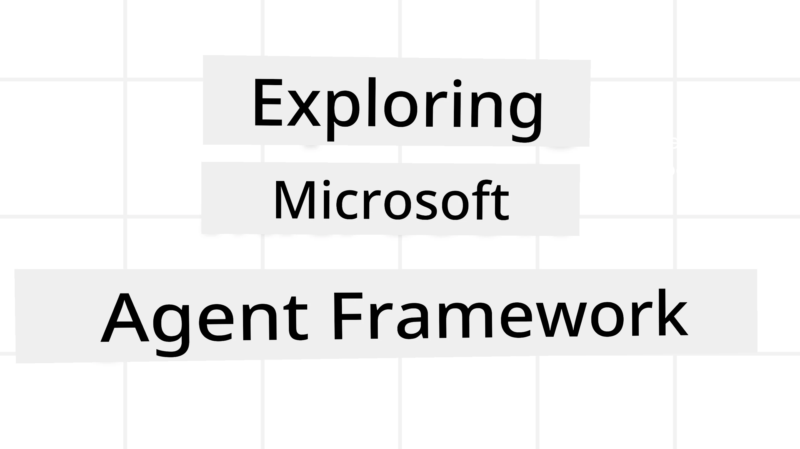
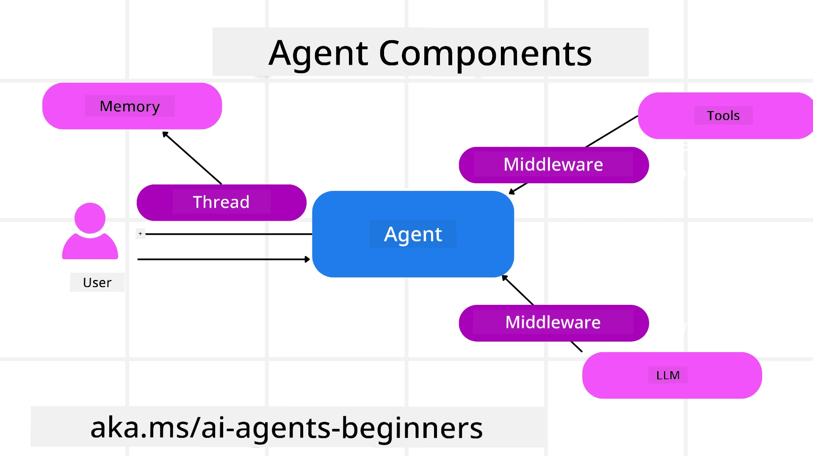

<!--
CO_OP_TRANSLATOR_METADATA:
{
  "original_hash": "19c4dab375acbc733855cc7f2f04edbc",
  "translation_date": "2025-10-02T19:27:10+00:00",
  "source_file": "14-microsoft-agent-framework/README.md",
  "language_code": "en"
}
-->
# Exploring Microsoft Agent Framework



### Introduction

This lesson will cover:

- Understanding Microsoft Agent Framework: Key Features and Benefits  
- Exploring the Core Concepts of Microsoft Agent Framework
- Comparing MAF to Semantic Kernel and AutoGen: Migration Guide

## Learning Goals

After completing this lesson, you will be able to:

- Build production-ready AI agents using Microsoft Agent Framework
- Apply the core features of Microsoft Agent Framework to your agent-based use cases
- Migrate and integrate existing agent frameworks and tools  

## Code Samples 

Code samples for [Microsoft Agent Framework (MAF)](https://aka.ms/ai-agents-beginners/agent-framewrok) can be found in this repository under `xx-python-agent-framework` and `xx-dotnet-agent-framework` files.

## Understanding Microsoft Agent Framework


[Microsoft Agent Framework (MAF)](https://aka.ms/ai-agents-beginners/agent-framewrok) builds on the experience and insights gained from Semantic Kernel and AutoGen. It provides the flexibility to address a wide range of agent-based use cases in both production and research environments, including:

- **Sequential Agent Orchestration** for scenarios requiring step-by-step workflows.
- **Concurrent Orchestration** for scenarios where agents need to perform tasks simultaneously.
- **Group Chat Orchestration** for scenarios where agents collaborate on a single task.
- **Handoff Orchestration** for scenarios where agents pass tasks to one another as subtasks are completed.
- **Magnetic Orchestration** for scenarios where a manager agent creates and modifies task lists and coordinates subagents to complete tasks.

To deliver AI agents in production, MAF includes features for:

- **Observability** using OpenTelemetry, which tracks every action of the AI agent, including tool usage, orchestration steps, reasoning flows, and performance monitoring via Azure AI Foundry dashboards.
- **Security** by hosting agents natively on Azure AI Foundry, which includes security controls like role-based access, private data handling, and built-in content safety.
- **Durability** allowing agent threads and workflows to pause, resume, and recover from errors, enabling long-running processes.
- **Control** supporting human-in-the-loop workflows where tasks require human approval.

Microsoft Agent Framework is also designed to be interoperable by:

- **Being Cloud-Agnostic** - Agents can run in containers, on-premises, and across multiple clouds.
- **Being Provider-Agnostic** - Agents can be created using your preferred SDK, including Azure OpenAI and OpenAI.
- **Integrating Open Standards** - Agents can use protocols like Agent-to-Agent (A2A) and Model Context Protocol (MCP) to discover and utilize other agents and tools.
- **Plugins and Connectors** - Connections can be made to data and memory services like Microsoft Fabric, SharePoint, Pinecone, and Qdrant.

Let’s explore how these features apply to the core concepts of Microsoft Agent Framework.

## Key Concepts of Microsoft Agent Framework

### Agents



**Creating Agents**

Agents are created by defining the inference service (LLM provider), a set of instructions for the AI agent to follow, and an assigned `name`:

```python
agent = AzureOpenAIChatClient(credential=AzureCliCredential()).create_agent( instructions="You are good at recommending trips to customers based on their preferences.", name="TripRecommender" )
```

The example above uses `Azure OpenAI`, but agents can also be created using services like `Azure AI Foundry Agent Service`:

```python
AzureAIAgentClient(async_credential=credential).create_agent( name="HelperAgent", instructions="You are a helpful assistant." ) as agent
```

OpenAI `Responses`, `ChatCompletion` APIs

```python
agent = OpenAIResponsesClient().create_agent( name="WeatherBot", instructions="You are a helpful weather assistant.", )
```

```python
agent = OpenAIChatClient().create_agent( name="HelpfulAssistant", instructions="You are a helpful assistant.", )
```

or remote agents using the A2A protocol:

```python
agent = A2AAgent( name=agent_card.name, description=agent_card.description, agent_card=agent_card, url="https://your-a2a-agent-host" )
```

**Running Agents**

Agents are executed using the `.run` or `.run_stream` methods for non-streaming or streaming responses.

```python
result = await agent.run("What are good places to visit in Amsterdam?")
print(result.text)
```

```python
async for update in agent.run_stream("What are the good places to visit in Amsterdam?"):
    if update.text:
        print(update.text, end="", flush=True)

```

Each agent run can be customized with options like `max_tokens` used by the agent, `tools` the agent can call, and even the `model` itself. 

This is useful for scenarios requiring specific models or tools to complete a user’s task.

**Tools**

Tools can be defined both during agent creation:

```python
def get_attractions( location: Annotated[str, Field(description="The location to get the top tourist attractions for")], ) -> str: """Get the top tourist attractions for a given location.""" return f"The top attractions for {location} are." 


# When creating a ChatAgent directly 

agent = ChatAgent( chat_client=OpenAIChatClient(), instructions="You are a helpful assistant", tools=[get_attractions]

```

and while running the agent:

```python

result1 = await agent.run( "What's the best place to visit in Seattle?", tools=[get_attractions] # Tool provided for this run only )
```

**Agent Threads**

Agent threads handle multi-turn conversations. Threads can be created by:

- Using `get_new_thread()`, which allows the thread to be saved over time.
- Automatically creating a thread during agent execution, with the thread lasting only for the current run.

To create a thread, the code looks like this:

```python
# Create a new thread. 
thread = agent.get_new_thread() # Run the agent with the thread. 
response = await agent.run("Hello, I am here to help you book travel. Where would you like to go?", thread=thread)

```

Threads can then be serialized for later use:

```python
# Create a new thread. 
thread = agent.get_new_thread() 

# Run the agent with the thread. 

response = await agent.run("Hello, how are you?", thread=thread) 

# Serialize the thread for storage. 

serialized_thread = await thread.serialize() 

# Deserialize the thread state after loading from storage. 

resumed_thread = await agent.deserialize_thread(serialized_thread)
```

**Agent Middleware**

Agents interact with tools and LLMs to complete user tasks. In certain scenarios, actions or tracking are needed between these interactions. Agent middleware enables this through:

*Function Middleware*

This middleware executes actions between the agent and a function/tool it calls. For example, it can log function calls.

In the code below, `next` determines whether the next middleware or the actual function should be called.

```python
async def logging_function_middleware(
    context: FunctionInvocationContext,
    next: Callable[[FunctionInvocationContext], Awaitable[None]],
) -> None:
    """Function middleware that logs function execution."""
    # Pre-processing: Log before function execution
    print(f"[Function] Calling {context.function.name}")

    # Continue to next middleware or function execution
    await next(context)

    # Post-processing: Log after function execution
    print(f"[Function] {context.function.name} completed")
```

*Chat Middleware*

This middleware executes or logs actions between the agent and requests sent to the LLM.

It includes important information like the `messages` sent to the AI service.

```python
async def logging_chat_middleware(
    context: ChatContext,
    next: Callable[[ChatContext], Awaitable[None]],
) -> None:
    """Chat middleware that logs AI interactions."""
    # Pre-processing: Log before AI call
    print(f"[Chat] Sending {len(context.messages)} messages to AI")

    # Continue to next middleware or AI service
    await next(context)

    # Post-processing: Log after AI response
    print("[Chat] AI response received")

```

**Agent Memory**

As covered in the `Agentic Memory` lesson, memory is crucial for enabling agents to operate across different contexts. MAF offers several types of memory:

*In-Memory Storage*

Memory stored in threads during application runtime.

```python
# Create a new thread. 
thread = agent.get_new_thread() # Run the agent with the thread. 
response = await agent.run("Hello, I am here to help you book travel. Where would you like to go?", thread=thread)
```

*Persistent Messages*

Memory used to store conversation history across sessions, defined using the `chat_message_store_factory`:

```python
from agent_framework import ChatMessageStore

# Create a custom message store
def create_message_store():
    return ChatMessageStore()

agent = ChatAgent(
    chat_client=OpenAIChatClient(),
    instructions="You are a Travel assistant.",
    chat_message_store_factory=create_message_store
)

```

*Dynamic Memory*

Memory added to the context before agents are run. These memories can be stored in external services like mem0:

```python
from agent_framework.mem0 import Mem0Provider

# Using Mem0 for advanced memory capabilities
memory_provider = Mem0Provider(
    api_key="your-mem0-api-key",
    user_id="user_123",
    application_id="my_app"
)

agent = ChatAgent(
    chat_client=OpenAIChatClient(),
    instructions="You are a helpful assistant with memory.",
    context_providers=memory_provider
)

```

**Agent Observability**

Observability is key to building reliable and maintainable agent systems. MAF integrates with OpenTelemetry to provide tracing and metrics for better observability.

```python
from agent_framework.observability import get_tracer, get_meter

tracer = get_tracer()
meter = get_meter()
with tracer.start_as_current_span("my_custom_span"):
    # do something
    pass
counter = meter.create_counter("my_custom_counter")
counter.add(1, {"key": "value"})
```

### Workflows

MAF provides workflows with pre-defined steps to complete tasks, incorporating AI agents as components in those steps.

Workflows consist of components that allow better control flow. They also enable **multi-agent orchestration** and **checkpointing** to save workflow states.

The core components of a workflow are:

**Executors**

Executors receive input messages, perform their assigned tasks, and produce output messages, advancing the workflow toward completing the larger task. Executors can be AI agents or custom logic.

**Edges**

Edges define the flow of messages in a workflow. Types include:

*Direct Edges* - Simple one-to-one connections between executors:

```python
from agent_framework import WorkflowBuilder

builder = WorkflowBuilder()
builder.add_edge(source_executor, target_executor)
builder.set_start_executor(source_executor)
workflow = builder.build()
```

*Conditional Edges* - Activated when certain conditions are met. For example, suggesting alternatives when hotel rooms are unavailable.

*Switch-case Edges* - Route messages to different executors based on defined conditions. For example, handling priority customers through a separate workflow.

*Fan-out Edges* - Send one message to multiple targets.

*Fan-in Edges* - Collect multiple messages from different executors and send them to one target.

**Events**

To enhance workflow observability, MAF provides built-in events for execution, including:

- `WorkflowStartedEvent` - Workflow execution begins
- `WorkflowOutputEvent` - Workflow produces an output
- `WorkflowErrorEvent` - Workflow encounters an error
- `ExecutorInvokeEvent` - Executor starts processing
- `ExecutorCompleteEvent` - Executor finishes processing
- `RequestInfoEvent` - A request is issued

## Migrating From Other Frameworks (Semantic Kernel and AutoGen)

### Differences between MAF and Semantic Kernel

**Simplified Agent Creation**

Semantic Kernel requires creating a Kernel instance for every agent. MAF simplifies this by using extensions for main providers.

```python
agent = AzureOpenAIChatClient(credential=AzureCliCredential()).create_agent( instructions="You are good at reccomending trips to customers based on their preferences.", name="TripRecommender" )
```

**Agent Thread Creation**

Semantic Kernel requires manual thread creation. In MAF, threads are directly assigned to agents.

```python
thread = agent.get_new_thread() # Run the agent with the thread. 
```

**Tool Registration**

In Semantic Kernel, tools are registered to the Kernel, which is then passed to the agent. In MAF, tools are registered directly during agent creation.

```python
agent = ChatAgent( chat_client=OpenAIChatClient(), instructions="You are a helpful assistant", tools=[get_attractions]
```

### Differences between MAF and AutoGen

**Teams vs Workflows**

AutoGen uses `Teams` for event-driven activity with agents. MAF uses `Workflows`, which route data to executors through a graph-based architecture.

**Tool Creation**

AutoGen uses `FunctionTool` to wrap functions for agents to call. MAF uses @ai_function, which operates similarly but also automatically infers schemas for each function.

**Agent Behavior**

Agents in AutoGen are single-turn by default unless `max_tool_iterations` is set higher. In MAF, the `ChatAgent` is multi-turn by default, meaning it continues calling tools until the user’s task is complete.

## Code Samples 

Code samples for Microsoft Agent Framework can be found in this repository under `xx-python-agent-framework` and `xx-dotnet-agent-framework` files.

## Got More Questions About Microsoft Agent Framework?

Join the [Azure AI Foundry Discord](https://aka.ms/ai-agents/discord) to connect with other learners, attend office hours, and get your AI agent questions answered.

---

**Disclaimer**:  
This document has been translated using the AI translation service [Co-op Translator](https://github.com/Azure/co-op-translator). While we aim for accuracy, please note that automated translations may contain errors or inaccuracies. The original document in its native language should be regarded as the authoritative source. For critical information, professional human translation is recommended. We are not responsible for any misunderstandings or misinterpretations resulting from the use of this translation.