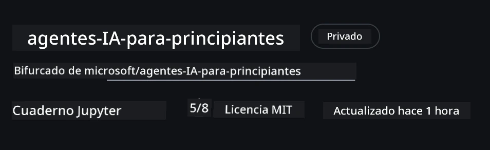
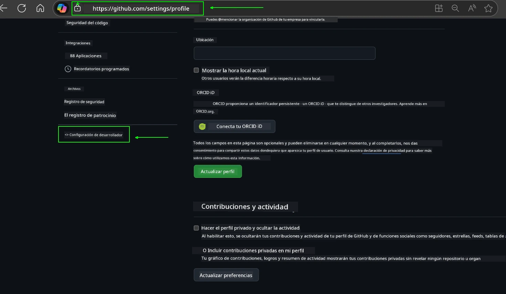
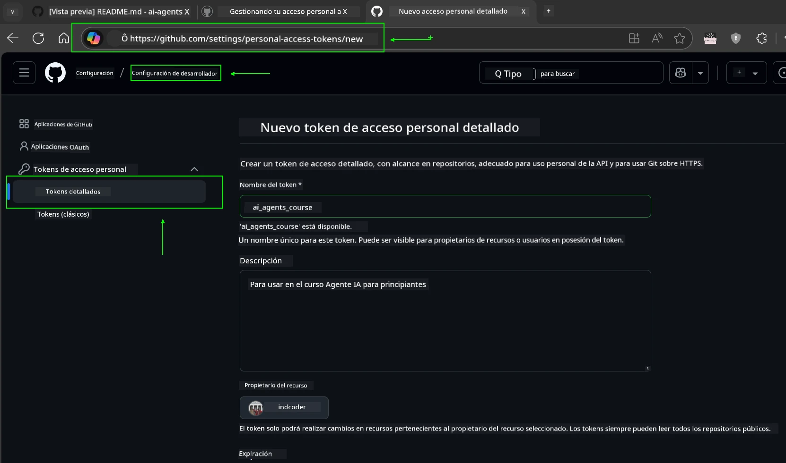
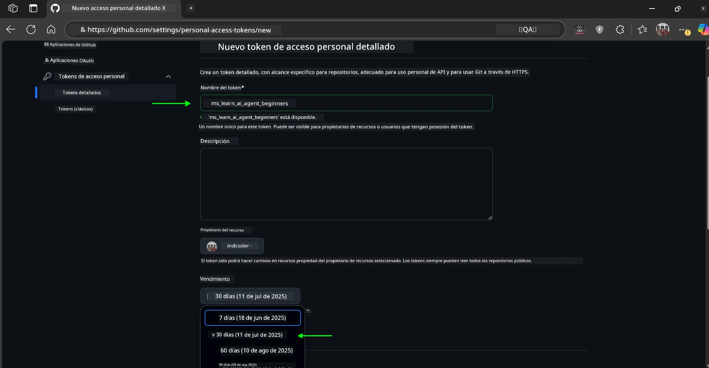
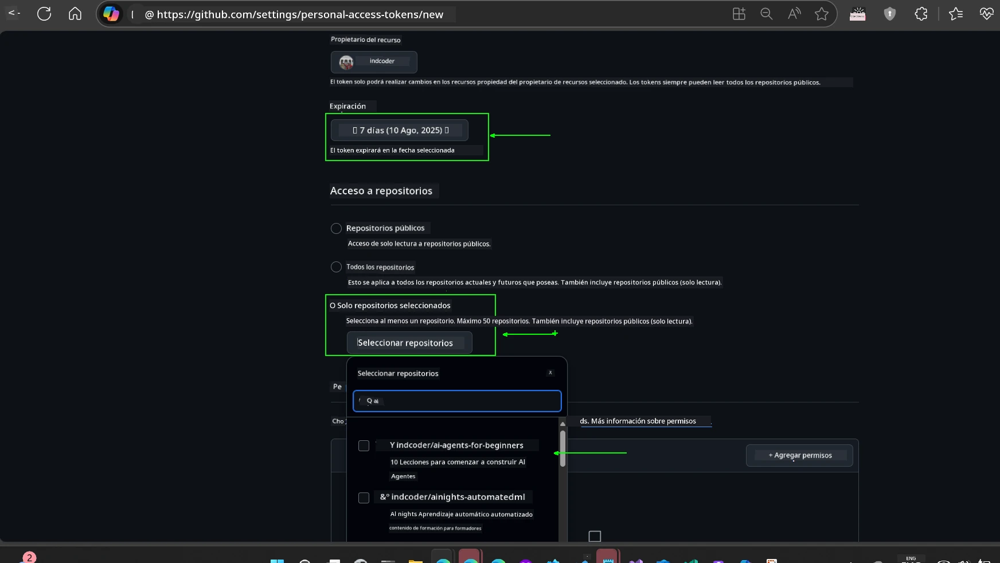
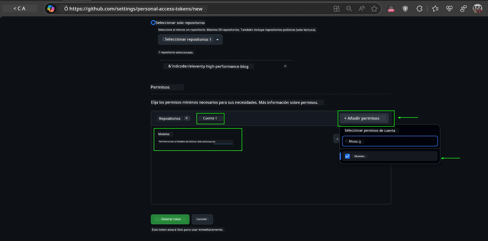
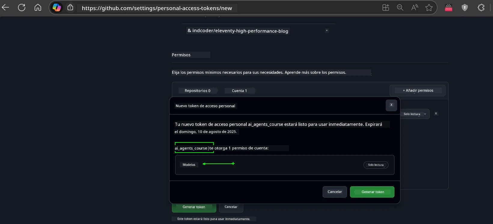
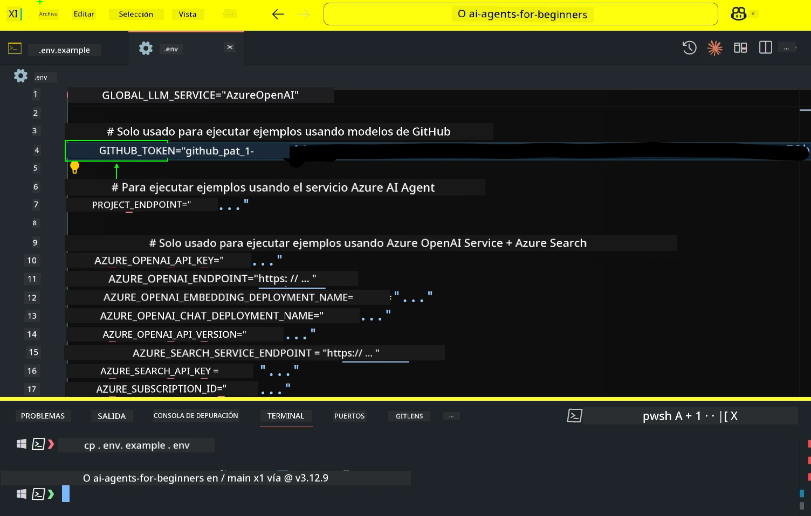
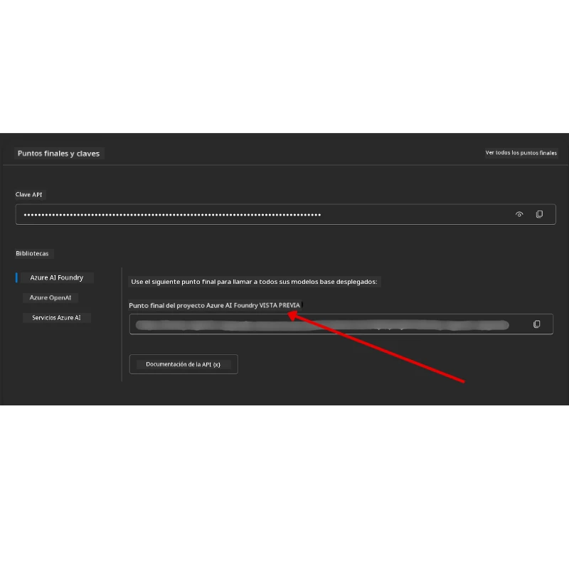

<!--
CO_OP_TRANSLATOR_METADATA:
{
  "original_hash": "63b1a8f6e840df15934935b728e569f0",
  "translation_date": "2025-12-03T13:42:54+00:00",
  "source_file": "00-course-setup/README.md",
  "language_code": "es"
}
-->
# Configuración del Curso

## Introducción

Esta lección cubrirá cómo ejecutar los ejemplos de código de este curso.

## Únete a Otros Estudiantes y Obtén Ayuda

Antes de comenzar a clonar tu repositorio, únete al [canal de Discord AI Agents For Beginners](https://aka.ms/ai-agents/discord) para obtener ayuda con la configuración, resolver cualquier duda sobre el curso o conectarte con otros estudiantes.

## Clona o Haz un Fork de este Repositorio

Para comenzar, por favor clona o haz un fork del repositorio de GitHub. Esto creará tu propia versión del material del curso para que puedas ejecutar, probar y modificar el código.

Esto se puede hacer haciendo clic en el enlace para <a href="https://github.com/microsoft/ai-agents-for-beginners/fork" target="_blank">hacer un fork del repositorio</a>

Ahora deberías tener tu propia versión del curso en el siguiente enlace:



### Clonación Superficial (recomendada para talleres / Codespaces)

  >El repositorio completo puede ser grande (~3 GB) cuando descargas todo el historial y todos los archivos. Si solo estás asistiendo al taller o necesitas solo algunas carpetas de lecciones, una clonación superficial (o clonación parcial) evita la mayor parte de esa descarga truncando el historial y/o omitiendo blobs.

#### Clonación superficial rápida — historial mínimo, todos los archivos

Reemplaza `<your-username>` en los comandos a continuación con la URL de tu fork (o la URL original si lo prefieres).

Para clonar solo el historial del último commit (descarga pequeña):

```bash|powershell
git clone --depth 1 https://github.com/<your-username>/ai-agents-for-beginners.git
```

Para clonar una rama específica:

```bash|powershell
git clone --depth 1 --branch <branch-name> https://github.com/<your-username>/ai-agents-for-beginners.git
```

#### Clonación parcial (sparse) — blobs mínimos + solo carpetas seleccionadas

Esto utiliza clonación parcial y sparse-checkout (requiere Git 2.25+ y se recomienda una versión moderna de Git con soporte para clonación parcial):

```bash|powershell
git clone --depth 1 --filter=blob:none --sparse https://github.com/<your-username>/ai-agents-for-beginners.git
```

Accede a la carpeta del repositorio:

```bash|powershell
cd ai-agents-for-beginners
```

Luego especifica qué carpetas deseas (el ejemplo a continuación muestra dos carpetas):

```bash|powershell
git sparse-checkout set 00-course-setup 01-intro-to-ai-agents
```

Después de clonar y verificar los archivos, si solo necesitas los archivos y quieres liberar espacio (sin historial de git), por favor elimina los metadatos del repositorio (💀irreversible — perderás toda la funcionalidad de Git: no commits, pulls, pushes ni acceso al historial).

```bash
# zsh/bash
rm -rf .git
```

```powershell
# PowerShell
Remove-Item -Recurse -Force .git
```

#### Usando GitHub Codespaces (recomendado para evitar descargas locales grandes)

- Crea un nuevo Codespace para este repositorio a través de la [interfaz de GitHub](https://github.com/codespaces).  

- En el terminal del Codespace recién creado, ejecuta uno de los comandos de clonación superficial/parcial mencionados anteriormente para traer solo las carpetas de lecciones que necesitas al espacio de trabajo de Codespaces.
- Opcional: después de clonar dentro de Codespaces, elimina .git para recuperar espacio adicional (consulta los comandos de eliminación anteriores).
- Nota: Si prefieres abrir el repositorio directamente en Codespaces (sin una clonación adicional), ten en cuenta que Codespaces construirá el entorno devcontainer y aún puede provisionar más de lo que necesitas. Clonar una copia superficial dentro de un Codespace nuevo te da más control sobre el uso del disco.

#### Consejos

- Siempre reemplaza la URL de clonación con tu fork si deseas editar/realizar commits.
- Si más adelante necesitas más historial o archivos, puedes obtenerlos o ajustar sparse-checkout para incluir carpetas adicionales.

## Ejecutando el Código

Este curso ofrece una serie de Jupyter Notebooks que puedes ejecutar para obtener experiencia práctica construyendo Agentes de IA.

Los ejemplos de código utilizan:

**Requiere Cuenta de GitHub - Gratis**:

1) Marco de Agente Semantic Kernel + Marketplace de Modelos de GitHub. Etiquetado como (semantic-kernel.ipynb)
2) Marco AutoGen + Marketplace de Modelos de GitHub. Etiquetado como (autogen.ipynb)

**Requiere Suscripción a Azure**:

3) Azure AI Foundry + Servicio de Agente de Azure AI. Etiquetado como (azureaiagent.ipynb)

Te animamos a probar los tres tipos de ejemplos para ver cuál funciona mejor para ti.

La opción que elijas determinará qué pasos de configuración necesitas seguir a continuación:

## Requisitos

- Python 3.12+
  - **NOTA**: Si no tienes Python 3.12 instalado, asegúrate de instalarlo. Luego crea tu entorno virtual usando python3.12 para garantizar que las versiones correctas se instalen desde el archivo requirements.txt.
  
    >Ejemplo

    Crea un directorio de entorno virtual de Python:

    ```bash|powershell
    python -m venv venv
    ```

    Luego activa el entorno virtual para:

    ```bash
    # zsh/bash
    source venv/bin/activate
    ```
  
    ```dos
    # Command Prompt for Windows
    venv\Scripts\activate
    ```

- .NET 10+: Para los ejemplos de código que usan .NET, asegúrate de instalar el [.NET 10 SDK](https://dotnet.microsoft.com/download/dotnet/10.0) o una versión posterior. Luego, verifica la versión instalada del SDK de .NET:

    ```bash|powershell
    dotnet --list-sdks
    ```

- Una Cuenta de GitHub - Para Acceso al Marketplace de Modelos de GitHub
- Suscripción a Azure - Para Acceso a Azure AI Foundry
- Cuenta de Azure AI Foundry - Para Acceso al Servicio de Agente de Azure AI

Hemos incluido un archivo `requirements.txt` en la raíz de este repositorio que contiene todos los paquetes de Python necesarios para ejecutar los ejemplos de código.

Puedes instalarlos ejecutando el siguiente comando en tu terminal en la raíz del repositorio:

```bash|powershell
pip install -r requirements.txt
```

Recomendamos crear un entorno virtual de Python para evitar conflictos y problemas.

## Configuración de VSCode

Asegúrate de estar utilizando la versión correcta de Python en VSCode.


## Configuración para Ejemplos usando Modelos de GitHub 

### Paso 1: Obtén tu Token de Acceso Personal (PAT) de GitHub

Este curso utiliza el Marketplace de Modelos de GitHub, que proporciona acceso gratuito a Modelos de Lenguaje Extenso (LLMs) que usarás para construir Agentes de IA.

Para usar los Modelos de GitHub, necesitarás crear un [Token de Acceso Personal de GitHub](https://docs.github.com/en/authentication/keeping-your-account-and-data-secure/managing-your-personal-access-tokens).

Esto se puede hacer yendo a tu <a href="https://github.com/settings/personal-access-tokens" target="_blank">configuración de Tokens de Acceso Personal</a> en tu cuenta de GitHub.

Por favor, sigue el [Principio de Menor Privilegio](https://docs.github.com/en/get-started/learning-to-code/storing-your-secrets-safely) al crear tu token. Esto significa que solo debes otorgar al token los permisos necesarios para ejecutar los ejemplos de código de este curso.

1. Selecciona la opción `Fine-grained tokens` en el lado izquierdo de tu pantalla navegando a la **Configuración de Desarrollador**

   

   Luego selecciona `Generate new token`.

   

2. Ingresa un nombre descriptivo para tu token que refleje su propósito, facilitando su identificación más adelante.

    🔐 Recomendación de Duración del Token

    Duración recomendada: 30 días
    Para una postura más segura, puedes optar por un período más corto, como 7 días 🛡️
    Es una excelente manera de establecer un objetivo personal y completar el curso mientras tu impulso de aprendizaje está alto 🚀.

    

3. Limita el alcance del token a tu fork de este repositorio.

    

4. Restringe los permisos del token: En **Permissions**, haz clic en la pestaña **Account** y luego en el botón "+ Add permissions". Aparecerá un menú desplegable. Busca **Models** y marca la casilla correspondiente.

    

5. Verifica los permisos requeridos antes de generar el token. 

6. Antes de generar el token, asegúrate de estar listo para almacenarlo en un lugar seguro como un gestor de contraseñas, ya que no se mostrará nuevamente después de crearlo. 

Copia tu nuevo token que acabas de crear. Ahora lo agregarás a tu archivo `.env` incluido en este curso.

### Paso 2: Crea tu Archivo `.env`

Para crear tu archivo `.env`, ejecuta el siguiente comando en tu terminal.

```bash
# zsh/bash
cp .env.example .env
```

```powershell
# PowerShell
Copy-Item .env.example .env
```

Esto copiará el archivo de ejemplo y creará un `.env` en tu directorio donde llenarás los valores de las variables de entorno.

Con tu token copiado, abre el archivo `.env` en tu editor de texto favorito y pega tu token en el campo `GITHUB_TOKEN`.



Ahora deberías poder ejecutar los ejemplos de código de este curso.

## Configuración para Ejemplos usando Azure AI Foundry y el Servicio de Agente de Azure AI

### Paso 1: Obtén tu Endpoint de Proyecto de Azure

Sigue los pasos para crear un hub y proyecto en Azure AI Foundry que se encuentran aquí: [Descripción general de recursos del hub](https://learn.microsoft.com/azure/ai-foundry/concepts/ai-resources)

Una vez que hayas creado tu proyecto, necesitarás obtener la cadena de conexión para tu proyecto.

Esto se puede hacer yendo a la página **Overview** de tu proyecto en el portal de Azure AI Foundry.



### Paso 2: Crea tu Archivo `.env`

Para crear tu archivo `.env`, ejecuta el siguiente comando en tu terminal.

```bash
# zsh/bash
cp .env.example .env
```

```powershell
# PowerShell
Copy-Item .env.example .env
```

Esto copiará el archivo de ejemplo y creará un `.env` en tu directorio donde llenarás los valores de las variables de entorno.

Con tu token copiado, abre el archivo `.env` en tu editor de texto favorito y pega tu token en el campo `PROJECT_ENDPOINT`.

### Paso 3: Inicia sesión en Azure

Como práctica de seguridad, utilizaremos [autenticación sin claves](https://learn.microsoft.com/azure/developer/ai/keyless-connections?tabs=csharp%2Cazure-cli?WT.mc_id=academic-105485-koreyst) para autenticarte en Azure OpenAI con Microsoft Entra ID. 

A continuación, abre un terminal y ejecuta `az login --use-device-code` para iniciar sesión en tu cuenta de Azure.

Una vez que hayas iniciado sesión, selecciona tu suscripción en el terminal.

## Variables de Entorno Adicionales - Azure Search y Azure OpenAI 

Para la lección Agentic RAG - Lección 5 - hay ejemplos que utilizan Azure Search y Azure OpenAI.

Si deseas ejecutar estos ejemplos, necesitarás agregar las siguientes variables de entorno a tu archivo `.env`:

### Página de Descripción General (Proyecto)

- `AZURE_SUBSCRIPTION_ID` - Consulta **Detalles del Proyecto** en la página **Overview** de tu proyecto.

- `AZURE_AI_PROJECT_NAME` - Mira la parte superior de la página **Overview** de tu proyecto.

- `AZURE_OPENAI_SERVICE` - Encuentra esto en la pestaña **Included capabilities** para **Azure OpenAI Service** en la página **Overview**.

### Centro de Gestión

- `AZURE_OPENAI_RESOURCE_GROUP` - Ve a **Propiedades del Proyecto** en la página **Overview** del **Centro de Gestión**.

- `GLOBAL_LLM_SERVICE` - En **Recursos Conectados**, encuentra el nombre de conexión de **Azure AI Services**. Si no está listado, consulta el **portal de Azure** en tu grupo de recursos para el nombre del recurso de AI Services.

### Página de Modelos + Endpoints

- `AZURE_OPENAI_EMBEDDING_DEPLOYMENT_NAME` - Selecciona tu modelo de embedding (por ejemplo, `text-embedding-ada-002`) y toma nota del **Nombre de Despliegue** de los detalles del modelo.

- `AZURE_OPENAI_CHAT_DEPLOYMENT_NAME` - Selecciona tu modelo de chat (por ejemplo, `gpt-4o-mini`) y toma nota del **Nombre de Despliegue** de los detalles del modelo.

### Portal de Azure

- `AZURE_OPENAI_ENDPOINT` - Busca **Azure AI services**, haz clic en él, luego ve a **Gestión de Recursos**, **Claves y Endpoint**, desplázate hacia abajo hasta los "Endpoints de Azure OpenAI" y copia el que dice "Language APIs".

- `AZURE_OPENAI_API_KEY` - Desde la misma pantalla, copia la CLAVE 1 o CLAVE 2.

- `AZURE_SEARCH_SERVICE_ENDPOINT` - Encuentra tu recurso de **Azure AI Search**, haz clic en él y consulta **Overview**.

- `AZURE_SEARCH_API_KEY` - Luego ve a **Configuración** y luego a **Claves** para copiar la clave de administrador primaria o secundaria.

### Página Externa

- `AZURE_OPENAI_API_VERSION` - Visita la página [Ciclo de vida de la versión API](https://learn.microsoft.com/azure/ai-services/openai/api-version-deprecation#latest-ga-api-release) bajo **Última versión GA de la API**.

### Configuración de autenticación sin claves

En lugar de codificar tus credenciales, utilizaremos una conexión sin claves con Azure OpenAI. Para hacerlo, importaremos `DefaultAzureCredential` y luego llamaremos a la función `DefaultAzureCredential` para obtener la credencial.

```python
# Python
from azure.identity import DefaultAzureCredential, InteractiveBrowserCredential
```

## ¿Atascado en algún lugar?
Si tienes algún problema al ejecutar esta configuración, únete a nuestro <a href="https://discord.gg/kzRShWzttr" target="_blank">Discord de la Comunidad de Azure AI</a> o <a href="https://github.com/microsoft/ai-agents-for-beginners/issues?WT.mc_id=academic-105485-koreyst" target="_blank">crea un problema</a>.

## Próxima Lección

Ahora estás listo para ejecutar el código de este curso. ¡Disfruta aprendiendo más sobre el mundo de los Agentes de IA!

[Introducción a los Agentes de IA y Casos de Uso de Agentes](../01-intro-to-ai-agents/README.md)

---

<!-- CO-OP TRANSLATOR DISCLAIMER START -->
**Descargo de responsabilidad**:  
Este documento ha sido traducido utilizando el servicio de traducción automática [Co-op Translator](https://github.com/Azure/co-op-translator). Si bien nos esforzamos por lograr precisión, tenga en cuenta que las traducciones automáticas pueden contener errores o imprecisiones. El documento original en su idioma nativo debe considerarse la fuente autorizada. Para información crítica, se recomienda una traducción profesional realizada por humanos. No nos hacemos responsables de malentendidos o interpretaciones erróneas que surjan del uso de esta traducción.
<!-- CO-OP TRANSLATOR DISCLAIMER END -->