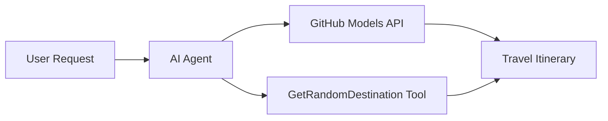

<!--
CO_OP_TRANSLATOR_METADATA:
{
  "original_hash": "5f351412e934f0833c8c821a0a60efaf",
  "translation_date": "2025-11-13T10:52:13+00:00",
  "source_file": "01-intro-to-ai-agents/code_samples/01-dotnet-agent-framework.md",
  "language_code": "es"
}
-->
# 🌍 Agente de Viajes con Microsoft Agent Framework (.NET)

## 📋 Resumen del Escenario

Este ejemplo muestra cómo construir un agente inteligente para la planificación de viajes utilizando el Microsoft Agent Framework para .NET. El agente puede generar automáticamente itinerarios personalizados de excursiones de un día para destinos aleatorios alrededor del mundo.

### Capacidades Clave:

- 🎲 **Selección Aleatoria de Destinos**: Utiliza una herramienta personalizada para elegir lugares de vacaciones
- 🗺️ **Planificación Inteligente de Viajes**: Crea itinerarios detallados día a día
- 🔄 **Transmisión en Tiempo Real**: Admite respuestas inmediatas y en streaming
- 🛠️ **Integración de Herramientas Personalizadas**: Demuestra cómo extender las capacidades del agente

## 🔧 Arquitectura Técnica

### Tecnologías Principales

- **Microsoft Agent Framework**: Implementación más reciente de .NET para el desarrollo de agentes de IA
- **Integración con Modelos de GitHub**: Utiliza el servicio de inferencia de modelos de IA de GitHub
- **Compatibilidad con la API de OpenAI**: Aprovecha las bibliotecas cliente de OpenAI con endpoints personalizados
- **Configuración Segura**: Gestión de claves API basada en el entorno

### Componentes Clave

1. **AIAgent**: El orquestador principal del agente que maneja el flujo de conversación
2. **Herramientas Personalizadas**: Función `GetRandomDestination()` disponible para el agente
3. **Cliente de Chat**: Interfaz de conversación respaldada por Modelos de GitHub
4. **Soporte de Streaming**: Capacidades de generación de respuestas en tiempo real

### Patrón de Integración



## 🚀 Primeros Pasos

### Requisitos Previos

- [.NET 10 SDK](https://dotnet.microsoft.com/download/dotnet/10.0) o superior
- [Token de acceso a la API de Modelos de GitHub](https://docs.github.com/github-models/github-models-at-scale/using-your-own-api-keys-in-github-models)

### Variables de Entorno Requeridas

```bash
# zsh/bash
export GH_TOKEN=<your_github_token>
export GH_ENDPOINT=https://models.github.ai/inference
export GH_MODEL_ID=openai/gpt-5-mini
```

```powershell
# PowerShell
$env:GH_TOKEN = "<your_github_token>"
$env:GH_ENDPOINT = "https://models.github.ai/inference"
$env:GH_MODEL_ID = "openai/gpt-5-mini"
```

### Código de Ejemplo

Para ejecutar el ejemplo de código,

```bash
# zsh/bash
chmod +x ./01-dotnet-agent-framework.cs
./01-dotnet-agent-framework.cs
```

O utilizando la CLI de dotnet:

```bash
dotnet run ./01-dotnet-agent-framework.cs
```

Consulta [`01-dotnet-agent-framework.cs`](../../../../01-intro-to-ai-agents/code_samples/01-dotnet-agent-framework.cs) para el código completo.

```csharp
#!/usr/bin/dotnet run

#:package Microsoft.Extensions.AI@9.*
#:package Microsoft.Agents.AI.OpenAI@1.*-*

using System.ClientModel;
using System.ComponentModel;

using Microsoft.Agents.AI;
using Microsoft.Extensions.AI;

using OpenAI;

// Tool Function: Random Destination Generator
// This static method will be available to the agent as a callable tool
// The [Description] attribute helps the AI understand when to use this function
// This demonstrates how to create custom tools for AI agents
[Description("Provides a random vacation destination.")]
static string GetRandomDestination()
{
    // List of popular vacation destinations around the world
    // The agent will randomly select from these options
    var destinations = new List<string>
    {
        "Paris, France",
        "Tokyo, Japan",
        "New York City, USA",
        "Sydney, Australia",
        "Rome, Italy",
        "Barcelona, Spain",
        "Cape Town, South Africa",
        "Rio de Janeiro, Brazil",
        "Bangkok, Thailand",
        "Vancouver, Canada"
    };

    // Generate random index and return selected destination
    // Uses System.Random for simple random selection
    var random = new Random();
    int index = random.Next(destinations.Count);
    return destinations[index];
}

// Extract configuration from environment variables
// Retrieve the GitHub Models API endpoint, defaults to https://models.github.ai/inference if not specified
// Retrieve the model ID, defaults to openai/gpt-5-mini if not specified
// Retrieve the GitHub token for authentication, throws exception if not specified
var github_endpoint = Environment.GetEnvironmentVariable("GH_ENDPOINT") ?? "https://models.github.ai/inference";
var github_model_id = Environment.GetEnvironmentVariable("GH_MODEL_ID") ?? "openai/gpt-5-mini";
var github_token = Environment.GetEnvironmentVariable("GH_TOKEN") ?? throw new InvalidOperationException("GH_TOKEN is not set.");

// Configure OpenAI Client Options
// Create configuration options to point to GitHub Models endpoint
// This redirects OpenAI client calls to GitHub's model inference service
var openAIOptions = new OpenAIClientOptions()
{
    Endpoint = new Uri(github_endpoint)
};

// Initialize OpenAI Client with GitHub Models Configuration
// Create OpenAI client using GitHub token for authentication
// Configure it to use GitHub Models endpoint instead of OpenAI directly
var openAIClient = new OpenAIClient(new ApiKeyCredential(github_token), openAIOptions);

// Create AI Agent with Travel Planning Capabilities
// Initialize OpenAI client, get chat client for specified model, and create AI agent
// Configure agent with travel planning instructions and random destination tool
// The agent can now plan trips using the GetRandomDestination function
AIAgent agent = openAIClient
    .GetChatClient(github_model_id)
    .CreateAIAgent(
        instructions: "You are a helpful AI Agent that can help plan vacations for customers at random destinations",
        tools: [AIFunctionFactory.Create(GetRandomDestination)]
    );

// Execute Agent: Plan a Day Trip
// Run the agent with streaming enabled for real-time response display
// Shows the agent's thinking and response as it generates the content
// Provides better user experience with immediate feedback
await foreach (var update in agent.RunStreamingAsync("Plan me a day trip"))
{
    await Task.Delay(10);
    Console.Write(update);
}
```

## 🎓 Puntos Clave

1. **Arquitectura del Agente**: El Microsoft Agent Framework proporciona un enfoque limpio y seguro para construir agentes de IA en .NET
2. **Integración de Herramientas**: Las funciones decoradas con atributos `[Description]` se convierten en herramientas disponibles para el agente
3. **Gestión de Configuración**: Las variables de entorno y el manejo seguro de credenciales siguen las mejores prácticas de .NET
4. **Compatibilidad con OpenAI**: La integración con Modelos de GitHub funciona perfectamente a través de APIs compatibles con OpenAI

## 🔗 Recursos Adicionales

- [Documentación de Microsoft Agent Framework](https://learn.microsoft.com/agent-framework)
- [Marketplace de Modelos de GitHub](https://github.com/marketplace?type=models)
- [Microsoft.Extensions.AI](https://learn.microsoft.com/dotnet/ai/microsoft-extensions-ai)
- [.NET Single File Apps](https://devblogs.microsoft.com/dotnet/announcing-dotnet-run-app)

---

<!-- CO-OP TRANSLATOR DISCLAIMER START -->
**Descargo de responsabilidad**:  
Este documento ha sido traducido utilizando el servicio de traducción automática [Co-op Translator](https://github.com/Azure/co-op-translator). Si bien nos esforzamos por lograr precisión, tenga en cuenta que las traducciones automáticas pueden contener errores o imprecisiones. El documento original en su idioma nativo debe considerarse la fuente autorizada. Para información crítica, se recomienda una traducción profesional realizada por humanos. No nos hacemos responsables de malentendidos o interpretaciones erróneas que surjan del uso de esta traducción.
<!-- CO-OP TRANSLATOR DISCLAIMER END -->