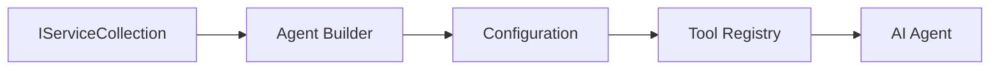

<!--
CO_OP_TRANSLATOR_METADATA:
{
  "original_hash": "bcc874e190347bd6a095aed56dc16de8",
  "translation_date": "2025-11-13T10:54:21+00:00",
  "source_file": "03-agentic-design-patterns/code_samples/03-dotnet-agent-framework.md",
  "language_code": "es"
}
-->
# 🎨 Patrones de Diseño Agentes con Modelos de GitHub (.NET)

## 📋 Objetivos de Aprendizaje

Este ejemplo demuestra patrones de diseño de nivel empresarial para construir agentes inteligentes utilizando el Microsoft Agent Framework en .NET con integración de Modelos de GitHub. Aprenderás patrones profesionales y enfoques arquitectónicos que hacen que los agentes sean listos para producción, mantenibles y escalables.

### Patrones de Diseño Empresariales

- 🏭 **Patrón Factory**: Creación estandarizada de agentes con inyección de dependencias
- 🔧 **Patrón Builder**: Configuración y configuración fluida de agentes
- 🧵 **Patrones Seguros para Hilos**: Gestión concurrente de conversaciones
- 📋 **Patrón Repository**: Gestión organizada de herramientas y capacidades

## 🎯 Beneficios Arquitectónicos Específicos de .NET

### Características Empresariales

- **Tipado Fuerte**: Validación en tiempo de compilación y soporte IntelliSense
- **Inyección de Dependencias**: Integración con contenedor DI incorporado
- **Gestión de Configuración**: Patrones de IConfiguration y Options
- **Async/Await**: Soporte de programación asincrónica de primera clase

### Patrones Listos para Producción

- **Integración de Registro**: Soporte para ILogger y registro estructurado
- **Verificaciones de Salud**: Monitoreo y diagnóstico incorporados
- **Validación de Configuración**: Tipado fuerte con anotaciones de datos
- **Gestión de Errores**: Manejo estructurado de excepciones

## 🔧 Arquitectura Técnica

### Componentes Centrales de .NET

- **Microsoft.Extensions.AI**: Abstracciones unificadas de servicios de IA
- **Microsoft.Agents.AI**: Marco de orquestación de agentes empresariales
- **Integración de Modelos de GitHub**: Patrones de cliente API de alto rendimiento
- **Sistema de Configuración**: Integración de appsettings.json y entorno

### Implementación de Patrones de Diseño



## 🏗️ Patrones Empresariales Demostrados

### 1. **Patrones Creacionales**

- **Factory de Agentes**: Creación centralizada de agentes con configuración consistente
- **Patrón Builder**: API fluida para configuración compleja de agentes
- **Patrón Singleton**: Gestión de recursos compartidos y configuración
- **Inyección de Dependencias**: Acoplamiento flexible y capacidad de prueba

### 2. **Patrones de Comportamiento**

- **Patrón Strategy**: Estrategias intercambiables de ejecución de herramientas
- **Patrón Command**: Operaciones encapsuladas de agentes con deshacer/rehacer
- **Patrón Observer**: Gestión del ciclo de vida de agentes impulsada por eventos
- **Método Template**: Flujos de trabajo de ejecución de agentes estandarizados

### 3. **Patrones Estructurales**

- **Patrón Adapter**: Capa de integración de API de Modelos de GitHub
- **Patrón Decorator**: Mejora de capacidades de agentes
- **Patrón Facade**: Interfaces simplificadas de interacción con agentes
- **Patrón Proxy**: Carga diferida y almacenamiento en caché para rendimiento

## 📚 Principios de Diseño en .NET

### Principios SOLID

- **Responsabilidad Única**: Cada componente tiene un propósito claro
- **Abierto/Cerrado**: Extensible sin modificación
- **Sustitución de Liskov**: Implementaciones de herramientas basadas en interfaces
- **Segregación de Interfaces**: Interfaces enfocadas y cohesivas
- **Inversión de Dependencias**: Dependencia de abstracciones, no concreciones

### Arquitectura Limpia

- **Capa de Dominio**: Abstracciones principales de agentes y herramientas
- **Capa de Aplicación**: Orquestación de agentes y flujos de trabajo
- **Capa de Infraestructura**: Integración de Modelos de GitHub y servicios externos
- **Capa de Presentación**: Interacción con el usuario y formato de respuestas

## 🔒 Consideraciones Empresariales

### Seguridad

- **Gestión de Credenciales**: Manejo seguro de claves API con IConfiguration
- **Validación de Entrada**: Tipado fuerte y validación con anotaciones de datos
- **Sanitización de Salida**: Procesamiento y filtrado seguro de respuestas
- **Registro de Auditoría**: Seguimiento completo de operaciones

### Rendimiento

- **Patrones Asíncronos**: Operaciones de E/S no bloqueantes
- **Agrupación de Conexiones**: Gestión eficiente de clientes HTTP
- **Caché**: Almacenamiento en caché de respuestas para mejorar el rendimiento
- **Gestión de Recursos**: Patrones adecuados de eliminación y limpieza

### Escalabilidad

- **Seguridad en Hilos**: Soporte para ejecución concurrente de agentes
- **Agrupación de Recursos**: Utilización eficiente de recursos
- **Gestión de Carga**: Limitación de tasa y manejo de presión
- **Monitoreo**: Métricas de rendimiento y verificaciones de salud

## 🚀 Despliegue en Producción

- **Gestión de Configuración**: Configuraciones específicas del entorno
- **Estrategia de Registro**: Registro estructurado con IDs de correlación
- **Gestión de Errores**: Manejo global de excepciones con recuperación adecuada
- **Monitoreo**: Insights de aplicaciones y contadores de rendimiento
- **Pruebas**: Patrones de pruebas unitarias, de integración y de carga

¿Listo para construir agentes inteligentes de nivel empresarial con .NET? ¡Vamos a diseñar algo robusto! 🏢✨

## 🚀 Comenzando

### Requisitos Previos

- [.NET 10 SDK](https://dotnet.microsoft.com/download/dotnet/10.0) o superior
- [Token de acceso API de Modelos de GitHub](https://docs.github.com/github-models/github-models-at-scale/using-your-own-api-keys-in-github-models)

### Variables de Entorno Requeridas

```bash
# zsh/bash
export GH_TOKEN=<your_github_token>
export GH_ENDPOINT=https://models.github.ai/inference
export GH_MODEL_ID=openai/gpt-5-mini
```

```powershell
# PowerShell
$env:GH_TOKEN = "<your_github_token>"
$env:GH_ENDPOINT = "https://models.github.ai/inference"
$env:GH_MODEL_ID = "openai/gpt-5-mini"
```

### Código de Ejemplo

Para ejecutar el ejemplo de código,

```bash
# zsh/bash
chmod +x ./03-dotnet-agent-framework.cs
./03-dotnet-agent-framework.cs
```

O usando la CLI de dotnet:

```bash
dotnet run ./03-dotnet-agent-framework.cs
```

Consulta [`03-dotnet-agent-framework.cs`](../../../../03-agentic-design-patterns/code_samples/03-dotnet-agent-framework.cs) para el código completo.

```csharp
#!/usr/bin/dotnet run

#:package Microsoft.Extensions.AI@10.*
#:package Microsoft.Agents.AI.OpenAI@1.*-*

using System.ClientModel;
using System.ComponentModel;

using Microsoft.Agents.AI;
using Microsoft.Extensions.AI;

using OpenAI;

// Tool Function: Random Destination Generator
// This static method will be available to the agent as a callable tool
// The [Description] attribute helps the AI understand when to use this function
// This demonstrates how to create custom tools for AI agents
[Description("Provides a random vacation destination.")]
static string GetRandomDestination()
{
    // List of popular vacation destinations around the world
    // The agent will randomly select from these options
    var destinations = new List<string>
    {
        "Paris, France",
        "Tokyo, Japan",
        "New York City, USA",
        "Sydney, Australia",
        "Rome, Italy",
        "Barcelona, Spain",
        "Cape Town, South Africa",
        "Rio de Janeiro, Brazil",
        "Bangkok, Thailand",
        "Vancouver, Canada"
    };

    // Generate random index and return selected destination
    // Uses System.Random for simple random selection
    var random = new Random();
    int index = random.Next(destinations.Count);
    return destinations[index];
}

// Extract configuration from environment variables
// Retrieve the GitHub Models API endpoint, defaults to https://models.github.ai/inference if not specified
// Retrieve the model ID, defaults to openai/gpt-5-mini if not specified
// Retrieve the GitHub token for authentication, throws exception if not specified
var github_endpoint = Environment.GetEnvironmentVariable("GH_ENDPOINT") ?? "https://models.github.ai/inference";
var github_model_id = Environment.GetEnvironmentVariable("GH_MODEL_ID") ?? "openai/gpt-5-mini";
var github_token = Environment.GetEnvironmentVariable("GH_TOKEN") ?? throw new InvalidOperationException("GH_TOKEN is not set.");

// Configure OpenAI Client Options
// Create configuration options to point to GitHub Models endpoint
// This redirects OpenAI client calls to GitHub's model inference service
var openAIOptions = new OpenAIClientOptions()
{
    Endpoint = new Uri(github_endpoint)
};

// Initialize OpenAI Client with GitHub Models Configuration
// Create OpenAI client using GitHub token for authentication
// Configure it to use GitHub Models endpoint instead of OpenAI directly
var openAIClient = new OpenAIClient(new ApiKeyCredential(github_token), openAIOptions);

// Define Agent Identity and Comprehensive Instructions
// Agent name for identification and logging purposes
var AGENT_NAME = "TravelAgent";

// Detailed instructions that define the agent's personality, capabilities, and behavior
// This system prompt shapes how the agent responds and interacts with users
var AGENT_INSTRUCTIONS = """
You are a helpful AI Agent that can help plan vacations for customers.

Important: When users specify a destination, always plan for that location. Only suggest random destinations when the user hasn't specified a preference.

When the conversation begins, introduce yourself with this message:
"Hello! I'm your TravelAgent assistant. I can help plan vacations and suggest interesting destinations for you. Here are some things you can ask me:
1. Plan a day trip to a specific location
2. Suggest a random vacation destination
3. Find destinations with specific features (beaches, mountains, historical sites, etc.)
4. Plan an alternative trip if you don't like my first suggestion

What kind of trip would you like me to help you plan today?"

Always prioritize user preferences. If they mention a specific destination like "Bali" or "Paris," focus your planning on that location rather than suggesting alternatives.
""";

// Create AI Agent with Advanced Travel Planning Capabilities
// Initialize complete agent pipeline: OpenAI client → Chat client → AI agent
// Configure agent with name, detailed instructions, and available tools
// This demonstrates the .NET agent creation pattern with full configuration
AIAgent agent = openAIClient
    .GetChatClient(github_model_id)
    .CreateAIAgent(
        name: AGENT_NAME,
        instructions: AGENT_INSTRUCTIONS,
        tools: [AIFunctionFactory.Create(GetRandomDestination)]
    );

// Create New Conversation Thread for Context Management
// Initialize a new conversation thread to maintain context across multiple interactions
// Threads enable the agent to remember previous exchanges and maintain conversational state
// This is essential for multi-turn conversations and contextual understanding
AgentThread thread = agent.GetNewThread();

// Execute Agent: First Travel Planning Request
// Run the agent with an initial request that will likely trigger the random destination tool
// The agent will analyze the request, use the GetRandomDestination tool, and create an itinerary
// Using the thread parameter maintains conversation context for subsequent interactions
await foreach (var update in agent.RunStreamingAsync("Plan me a day trip", thread))
{
    await Task.Delay(10);
    Console.Write(update);
}

Console.WriteLine();

// Execute Agent: Follow-up Request with Context Awareness
// Demonstrate contextual conversation by referencing the previous response
// The agent remembers the previous destination suggestion and will provide an alternative
// This showcases the power of conversation threads and contextual understanding in .NET agents
await foreach (var update in agent.RunStreamingAsync("I don't like that destination. Plan me another vacation.", thread))
{
    await Task.Delay(10);
    Console.Write(update);
}
```

---

<!-- CO-OP TRANSLATOR DISCLAIMER START -->
**Descargo de responsabilidad**:  
Este documento ha sido traducido utilizando el servicio de traducción automática [Co-op Translator](https://github.com/Azure/co-op-translator). Si bien nos esforzamos por lograr precisión, tenga en cuenta que las traducciones automáticas pueden contener errores o imprecisiones. El documento original en su idioma nativo debe considerarse la fuente autorizada. Para información crítica, se recomienda una traducción profesional realizada por humanos. No nos hacemos responsables de malentendidos o interpretaciones erróneas que surjan del uso de esta traducción.
<!-- CO-OP TRANSLATOR DISCLAIMER END -->