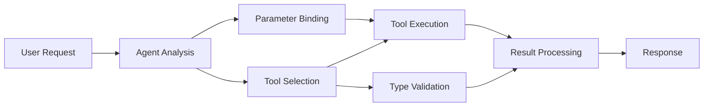

<!--
CO_OP_TRANSLATOR_METADATA:
{
  "original_hash": "91d6061e402489603f2ec8b528cae59b",
  "translation_date": "2025-11-18T16:31:07+00:00",
  "source_file": "04-tool-use/code_samples/04-dotnet-agent-framework.md",
  "language_code": "es"
}
-->
# 🛠️ Uso Avanzado de Herramientas con Modelos de GitHub (.NET)

## 📋 Objetivos de Aprendizaje

Este cuaderno demuestra patrones de integración de herramientas de nivel empresarial utilizando el Microsoft Agent Framework en .NET con Modelos de GitHub. Aprenderás a construir agentes sofisticados con múltiples herramientas especializadas, aprovechando la tipificación fuerte de C# y las características empresariales de .NET.

### Capacidades Avanzadas de Herramientas que Dominarás

- 🔧 **Arquitectura Multi-Herramienta**: Construcción de agentes con múltiples capacidades especializadas
- 🎯 **Ejecución de Herramientas con Tipos Seguros**: Aprovechando la validación en tiempo de compilación de C#
- 📊 **Patrones de Herramientas Empresariales**: Diseño de herramientas listas para producción y manejo de errores
- 🔗 **Composición de Herramientas**: Combinación de herramientas para flujos de trabajo empresariales complejos

## 🎯 Beneficios de la Arquitectura de Herramientas en .NET

### Características de Herramientas Empresariales

- **Validación en Tiempo de Compilación**: La tipificación fuerte asegura la corrección de los parámetros de las herramientas
- **Inyección de Dependencias**: Integración de contenedores IoC para la gestión de herramientas
- **Patrones Async/Await**: Ejecución de herramientas sin bloqueo con gestión adecuada de recursos
- **Registro Estructurado**: Integración de registro incorporado para monitoreo de la ejecución de herramientas

### Patrones Listos para Producción

- **Manejo de Excepciones**: Gestión integral de errores con excepciones tipadas
- **Gestión de Recursos**: Patrones adecuados de eliminación y gestión de memoria
- **Monitoreo de Rendimiento**: Métricas incorporadas y contadores de rendimiento
- **Gestión de Configuración**: Configuración con tipos seguros y validación

## 🔧 Arquitectura Técnica

### Componentes Principales de Herramientas en .NET

- **Microsoft.Extensions.AI**: Capa de abstracción unificada para herramientas
- **Microsoft.Agents.AI**: Orquestación de herramientas de nivel empresarial
- **Integración de Modelos de GitHub**: Cliente API de alto rendimiento con agrupación de conexiones

### Pipeline de Ejecución de Herramientas



## 🛠️ Categorías y Patrones de Herramientas

### 1. **Herramientas de Procesamiento de Datos**

- **Validación de Entrada**: Tipificación fuerte con anotaciones de datos
- **Operaciones de Transformación**: Conversión y formato de datos con tipos seguros
- **Lógica Empresarial**: Herramientas de cálculo y análisis específicas del dominio
- **Formato de Salida**: Generación estructurada de respuestas

### 2. **Herramientas de Integración**

- **Conectores API**: Integración de servicios RESTful con HttpClient
- **Herramientas de Base de Datos**: Integración de Entity Framework para acceso a datos
- **Operaciones de Archivos**: Operaciones seguras en el sistema de archivos con validación
- **Servicios Externos**: Patrones de integración con servicios de terceros

### 3. **Herramientas Utilitarias**

- **Procesamiento de Texto**: Utilidades de manipulación y formato de cadenas
- **Operaciones de Fecha/Hora**: Cálculos de fecha/hora sensibles a la cultura
- **Herramientas Matemáticas**: Cálculos de precisión y operaciones estadísticas
- **Herramientas de Validación**: Validación de reglas empresariales y verificación de datos

¿Listo para construir agentes de nivel empresarial con capacidades de herramientas poderosas y seguras en .NET? ¡Vamos a diseñar soluciones de nivel profesional! 🏢⚡

## 🚀 Comenzando

### Requisitos Previos

- [.NET 10 SDK](https://dotnet.microsoft.com/download/dotnet/10.0) o superior
- [Token de acceso a la API de Modelos de GitHub](https://docs.github.com/github-models/github-models-at-scale/using-your-own-api-keys-in-github-models)

### Variables de Entorno Requeridas

```bash
# zsh/bash
export GH_TOKEN=<your_github_token>
export GH_ENDPOINT=https://models.github.ai/inference
export GH_MODEL_ID=openai/gpt-5-mini
```

```powershell
# PowerShell
$env:GH_TOKEN = "<your_github_token>"
$env:GH_ENDPOINT = "https://models.github.ai/inference"
$env:GH_MODEL_ID = "openai/gpt-5-mini"
```

### Código de Ejemplo

Para ejecutar el ejemplo de código,

```bash
# zsh/bash
chmod +x ./04-dotnet-agent-framework.cs
./04-dotnet-agent-framework.cs
```

O usando la CLI de dotnet:

```bash
dotnet run ./04-dotnet-agent-framework.cs
```

Consulta [`04-dotnet-agent-framework.cs`](../../../../04-tool-use/code_samples/04-dotnet-agent-framework.cs) para el código completo.

```csharp
#!/usr/bin/dotnet run

#:package Microsoft.Extensions.AI@10.*
#:package Microsoft.Agents.AI.OpenAI@1.*-*

using System.ClientModel;
using System.ComponentModel;

using Microsoft.Agents.AI;
using Microsoft.Extensions.AI;

using OpenAI;

// Tool Function: Random Destination Generator
// This static method will be available to the agent as a callable tool
// The [Description] attribute helps the AI understand when to use this function
// This demonstrates how to create custom tools for AI agents
[Description("Provides a random vacation destination.")]
static string GetRandomDestination()
{
    // List of popular vacation destinations around the world
    // The agent will randomly select from these options
    var destinations = new List<string>
    {
        "Paris, France",
        "Tokyo, Japan",
        "New York City, USA",
        "Sydney, Australia",
        "Rome, Italy",
        "Barcelona, Spain",
        "Cape Town, South Africa",
        "Rio de Janeiro, Brazil",
        "Bangkok, Thailand",
        "Vancouver, Canada"
    };

    // Generate random index and return selected destination
    // Uses System.Random for simple random selection
    var random = new Random();
    int index = random.Next(destinations.Count);
    return destinations[index];
}

// Extract configuration from environment variables
// Retrieve the GitHub Models API endpoint, defaults to https://models.github.ai/inference if not specified
// Retrieve the model ID, defaults to openai/gpt-5-mini if not specified
// Retrieve the GitHub token for authentication, throws exception if not specified
var github_endpoint = Environment.GetEnvironmentVariable("GH_ENDPOINT") ?? "https://models.github.ai/inference";
var github_model_id = Environment.GetEnvironmentVariable("GH_MODEL_ID") ?? "openai/gpt-5-mini";
var github_token = Environment.GetEnvironmentVariable("GH_TOKEN") ?? throw new InvalidOperationException("GH_TOKEN is not set.");

// Configure OpenAI Client Options
// Create configuration options to point to GitHub Models endpoint
// This redirects OpenAI client calls to GitHub's model inference service
var openAIOptions = new OpenAIClientOptions()
{
    Endpoint = new Uri(github_endpoint)
};

// Initialize OpenAI Client with GitHub Models Configuration
// Create OpenAI client using GitHub token for authentication
// Configure it to use GitHub Models endpoint instead of OpenAI directly
var openAIClient = new OpenAIClient(new ApiKeyCredential(github_token), openAIOptions);

// Define Agent Identity and Comprehensive Instructions
// Agent name for identification and logging purposes
var AGENT_NAME = "TravelAgent";

// Detailed instructions that define the agent's personality, capabilities, and behavior
// This system prompt shapes how the agent responds and interacts with users
var AGENT_INSTRUCTIONS = """
You are a helpful AI Agent that can help plan vacations for customers.

Important: When users specify a destination, always plan for that location. Only suggest random destinations when the user hasn't specified a preference.

When the conversation begins, introduce yourself with this message:
"Hello! I'm your TravelAgent assistant. I can help plan vacations and suggest interesting destinations for you. Here are some things you can ask me:
1. Plan a day trip to a specific location
2. Suggest a random vacation destination
3. Find destinations with specific features (beaches, mountains, historical sites, etc.)
4. Plan an alternative trip if you don't like my first suggestion

What kind of trip would you like me to help you plan today?"

Always prioritize user preferences. If they mention a specific destination like "Bali" or "Paris," focus your planning on that location rather than suggesting alternatives.
""";

// Create AI Agent with Advanced Travel Planning Capabilities
// Initialize complete agent pipeline: OpenAI client → Chat client → AI agent
// Configure agent with name, detailed instructions, and available tools
// This demonstrates the .NET agent creation pattern with full configuration
AIAgent agent = openAIClient
    .GetChatClient(github_model_id)
    .CreateAIAgent(
        name: AGENT_NAME,
        instructions: AGENT_INSTRUCTIONS,
        tools: [AIFunctionFactory.Create(GetRandomDestination)]
    );

// Create New Conversation Thread for Context Management
// Initialize a new conversation thread to maintain context across multiple interactions
// Threads enable the agent to remember previous exchanges and maintain conversational state
// This is essential for multi-turn conversations and contextual understanding
AgentThread thread = agent.GetNewThread();

// Execute Agent: First Travel Planning Request
// Run the agent with an initial request that will likely trigger the random destination tool
// The agent will analyze the request, use the GetRandomDestination tool, and create an itinerary
// Using the thread parameter maintains conversation context for subsequent interactions
await foreach (var update in agent.RunStreamingAsync("Plan me a day trip", thread))
{
    await Task.Delay(10);
    Console.Write(update);
}

Console.WriteLine();

// Execute Agent: Follow-up Request with Context Awareness
// Demonstrate contextual conversation by referencing the previous response
// The agent remembers the previous destination suggestion and will provide an alternative
// This showcases the power of conversation threads and contextual understanding in .NET agents
await foreach (var update in agent.RunStreamingAsync("I don't like that destination. Plan me another vacation.", thread))
{
    await Task.Delay(10);
    Console.Write(update);
}
```

---

<!-- CO-OP TRANSLATOR DISCLAIMER START -->
**Descargo de responsabilidad**:  
Este documento ha sido traducido utilizando el servicio de traducción automática [Co-op Translator](https://github.com/Azure/co-op-translator). Si bien nos esforzamos por lograr precisión, tenga en cuenta que las traducciones automáticas pueden contener errores o imprecisiones. El documento original en su idioma nativo debe considerarse la fuente autorizada. Para información crítica, se recomienda una traducción profesional realizada por humanos. No nos hacemos responsables de malentendidos o interpretaciones erróneas que surjan del uso de esta traducción.
<!-- CO-OP TRANSLATOR DISCLAIMER END -->