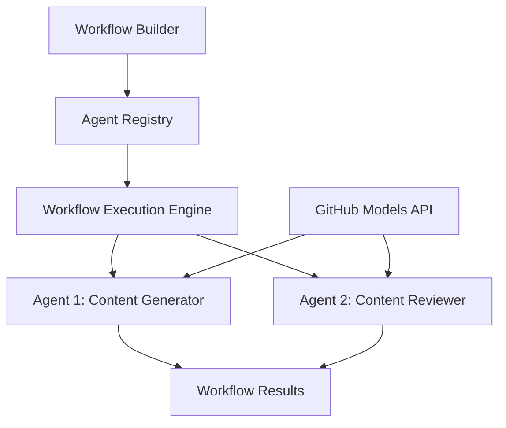

<!--
CO_OP_TRANSLATOR_METADATA:
{
  "original_hash": "034158688d0a45aae06dcbb21b0da5ae",
  "translation_date": "2025-11-11T12:39:05+00:00",
  "source_file": "08-multi-agent/code_samples/workflows-agent-framework/dotNET/01.dotnet-agent-framework-workflow-ghmodel-basic.md",
  "language_code": "es"
}
-->
# 🔄 Flujos de trabajo básicos de agentes con modelos de GitHub (.NET)

## 📋 Tutorial de orquestación de flujos de trabajo

Este cuaderno demuestra cómo construir **flujos de trabajo de agentes** sofisticados utilizando el Microsoft Agent Framework para .NET y los modelos de GitHub. Aprenderás a crear procesos empresariales de múltiples pasos donde los agentes de IA colaboran para realizar tareas complejas mediante patrones estructurados de orquestación.

## 🎯 Objetivos de aprendizaje

### 🏗️ **Fundamentos de arquitectura de flujos de trabajo**
- **Constructor de flujos de trabajo**: Diseña y orquesta procesos de IA complejos y de múltiples pasos
- **Coordinación de agentes**: Coordina múltiples agentes especializados dentro de los flujos de trabajo
- **Integración con modelos de GitHub**: Aprovecha el servicio de inferencia de modelos de GitHub en los flujos de trabajo
- **Diseño visual de flujos de trabajo**: Crea y visualiza estructuras de flujo de trabajo para una mejor comprensión

### 🔄 **Patrones de orquestación de procesos**
- **Procesamiento secuencial**: Encadena múltiples tareas de agentes en orden lógico
- **Gestión de estado**: Mantén el contexto y el flujo de datos entre las etapas del flujo de trabajo
- **Manejo de errores**: Implementa recuperación robusta de errores y resiliencia en los flujos de trabajo
- **Optimización del rendimiento**: Diseña flujos de trabajo eficientes para operaciones a escala empresarial

### 🏢 **Aplicaciones empresariales de flujos de trabajo**
- **Automatización de procesos empresariales**: Automatiza flujos de trabajo organizacionales complejos
- **Pipeline de producción de contenido**: Flujos editoriales con etapas de revisión y aprobación
- **Automatización del servicio al cliente**: Resolución de consultas de clientes en múltiples pasos
- **Flujos de trabajo de procesamiento de datos**: Flujos ETL con transformación impulsada por IA

## ⚙️ Requisitos previos y configuración

### 📦 **Paquetes NuGet requeridos**

Esta demostración de flujo de trabajo utiliza varios paquetes clave de .NET:

```xml
<!-- Core AI Framework -->
<PackageReference Include="Microsoft.Extensions.AI" Version="9.9.0" />

<!-- Agent Framework (Local Development) -->
<!-- Microsoft.Agents.AI.dll - Core agent abstractions -->
<!-- Microsoft.Agents.AI.OpenAI.dll - OpenAI/GitHub Models integration -->

<!-- Configuration and Environment -->
<PackageReference Include="DotNetEnv" Version="3.1.1" />
```

### 🔑 **Configuración de modelos de GitHub**

**Configuración del entorno (.env file):**
```env
GITHUB_TOKEN=your_github_personal_access_token
GITHUB_ENDPOINT=https://models.inference.ai.azure.com
GITHUB_MODEL_ID=gpt-4o-mini
```

**Acceso a modelos de GitHub:**
1. Regístrate en los modelos de GitHub (actualmente en vista previa)
2. Genera un token de acceso personal con permisos de acceso a modelos
3. Configura las variables de entorno como se muestra arriba

### 🏗️ **Descripción general de la arquitectura del flujo de trabajo**



**Componentes clave:**
- **WorkflowBuilder**: Motor principal de orquestación para diseñar flujos de trabajo
- **AIAgent**: Agentes especializados individuales con capacidades específicas
- **GitHub Models Client**: Integración del servicio de inferencia de modelos de IA
- **Execution Context**: Gestiona el estado y el flujo de datos entre las etapas del flujo de trabajo

## 🎨 **Patrones de diseño de flujos de trabajo empresariales**

### 📝 **Flujo de trabajo de producción de contenido**
```
User Request → Content Generation → Quality Review → Final Output
```

### 🔍 **Pipeline de procesamiento de documentos**
```
Document Input → Analysis → Extraction → Validation → Structured Output
```

### 💼 **Flujo de trabajo de inteligencia empresarial**
```
Data Collection → Processing → Analysis → Report Generation → Distribution
```

### 🤝 **Automatización del servicio al cliente**
```
Customer Inquiry → Classification → Processing → Response Generation → Follow-up
```

## 🏢 **Beneficios empresariales**

### 🎯 **Fiabilidad y escalabilidad**
- **Ejecución determinista**: Resultados consistentes y repetibles en los flujos de trabajo
- **Recuperación de errores**: Manejo elegante de fallos en cualquier etapa del flujo de trabajo
- **Monitoreo del rendimiento**: Seguimiento de métricas de ejecución y oportunidades de optimización
- **Gestión de recursos**: Asignación y utilización eficiente de recursos de modelos de IA

### 🔒 **Seguridad y cumplimiento**
- **Autenticación segura**: Autenticación basada en tokens de GitHub para acceso a la API
- **Rastros de auditoría**: Registro completo de la ejecución del flujo de trabajo y puntos de decisión
- **Control de acceso**: Permisos granulares para la ejecución y monitoreo de flujos de trabajo
- **Privacidad de datos**: Manejo seguro de información sensible a lo largo de los flujos de trabajo

### 📊 **Observabilidad y gestión**
- **Diseño visual de flujos de trabajo**: Representación clara de los flujos de procesos y dependencias
- **Monitoreo de ejecución**: Seguimiento en tiempo real del progreso y rendimiento del flujo de trabajo
- **Reporte de errores**: Análisis detallado de errores y capacidades de depuración
- **Analítica de rendimiento**: Métricas para optimización y planificación de capacidad

¡Construyamos tu primer flujo de trabajo de IA listo para la empresa! 🚀

## 💻 Ejecución del código

La implementación completa está disponible en `01.dotnet-agent-framework-workflow-ghmodel-basic.cs`. Este archivo demuestra:

1. **Configuración del entorno** - Carga de credenciales de modelos de GitHub desde el archivo `.env`
2. **Configuración del cliente OpenAI** - Configuración del cliente para usar el endpoint de modelos de GitHub
3. **Creación de agentes** - Definición de agentes especializados (Front Desk y Concierge)
4. **Constructor de flujos de trabajo** - Creación de un flujo de trabajo de múltiples agentes con procesamiento secuencial
5. **Ejecución del flujo de trabajo** - Ejecución del flujo de trabajo con resultados en streaming

### 🚀 Ejecución del ejemplo

```bash
# Make the script executable (Unix/Linux/macOS)
chmod +x 01.dotnet-agent-framework-workflow-ghmodel-basic.cs

# Run the workflow
./01.dotnet-agent-framework-workflow-ghmodel-basic.cs
```

O en Windows:
```powershell
dotnet run 01.dotnet-agent-framework-workflow-ghmodel-basic.cs
```

### 📝 Salida esperada

El flujo de trabajo:
1. Aceptará tu solicitud de destino de viaje ("Me gustaría ir a París")
2. El agente Front Desk proporcionará una recomendación inicial
3. El agente Concierge revisará y perfeccionará la recomendación
4. La salida final mostrará el flujo completo de la conversación

### 🔧 Personalización

Puedes personalizar el flujo de trabajo:
- Modificando las instrucciones de los agentes para cambiar su comportamiento
- Añadiendo más agentes para crear flujos de trabajo complejos de múltiples pasos
- Cambiando el mensaje del usuario para probar diferentes escenarios
- Ajustando los bordes del flujo de trabajo para crear diferentes patrones de ejecución

---

<!-- CO-OP TRANSLATOR DISCLAIMER START -->
**Descargo de responsabilidad**:  
Este documento ha sido traducido utilizando el servicio de traducción automática [Co-op Translator](https://github.com/Azure/co-op-translator). Aunque nos esforzamos por lograr precisión, tenga en cuenta que las traducciones automáticas pueden contener errores o imprecisiones. El documento original en su idioma nativo debe considerarse la fuente autorizada. Para información crítica, se recomienda una traducción profesional realizada por humanos. No nos hacemos responsables de malentendidos o interpretaciones erróneas que surjan del uso de esta traducción.
<!-- CO-OP TRANSLATOR DISCLAIMER END -->