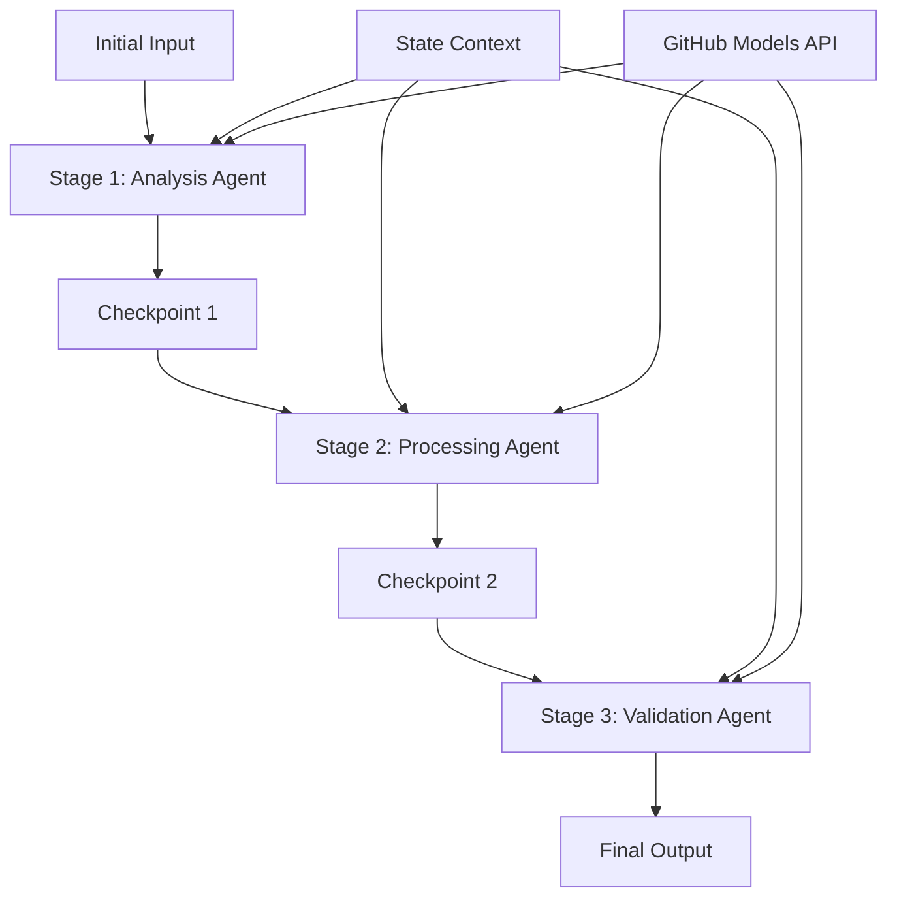

<!--
CO_OP_TRANSLATOR_METADATA:
{
  "original_hash": "1be9c8dcbd79a02d33d2c138684c1394",
  "translation_date": "2025-11-11T13:39:39+00:00",
  "source_file": "08-multi-agent/code_samples/workflows-agent-framework/dotNET/02.dotnet-agent-framework-workflow-ghmodel-sequential.md",
  "language_code": "es"
}
-->
# ⏩ Flujos de trabajo secuenciales de agentes con modelos de GitHub (.NET)

## 📋 Tutorial avanzado de procesamiento secuencial

Este cuaderno demuestra **patrones de flujo de trabajo secuenciales** utilizando el Microsoft Agent Framework para .NET y modelos de GitHub. Aprenderás a construir sofisticadas tuberías de procesamiento paso a paso donde los agentes se ejecutan en un orden específico, y cada etapa se basa en los resultados de la etapa anterior.

## 🎯 Objetivos de aprendizaje

### 🔄 **Arquitectura de procesamiento secuencial**
- **Diseño de flujo de trabajo lineal**: Crear tuberías de procesamiento paso a paso con dependencias claras
- **Gestión de estado**: Mantener el contexto y el flujo de datos a través de las etapas del flujo de trabajo secuencial
- **Integración de modelos de GitHub**: Aprovechar los modelos de IA de GitHub en flujos de trabajo .NET de múltiples etapas
- **Patrones de tuberías empresariales**: Construir sistemas de procesamiento secuencial listos para producción

### 🏗️ **Patrones secuenciales avanzados**
- **Procesamiento por etapas**: Implementar puntos de validación entre las etapas del flujo de trabajo
- **Preservación del contexto**: Mantener el estado y el conocimiento acumulado en todas las etapas
- **Propagación de errores**: Manejar fallos de manera eficiente en cadenas de procesamiento secuenciales
- **Optimización del rendimiento**: Ejecución secuencial eficiente con un mínimo de sobrecarga

### 🏢 **Aplicaciones secuenciales empresariales**
- **Tubería de procesamiento de documentos**: Análisis, transformación y validación de documentos en múltiples etapas
- **Flujos de trabajo de aseguramiento de calidad**: Revisión, validación y procesos de aprobación secuenciales
- **Tubería de producción de contenido**: Investigación → Escritura → Edición → Revisión → Publicación
- **Automatización de procesos empresariales**: Flujos de trabajo empresariales de múltiples pasos con dependencias claras entre etapas

## ⚙️ Requisitos previos y configuración

### 📦 **Paquetes NuGet requeridos**

Paquetes esenciales para flujos de trabajo secuenciales en .NET:

```xml
<!-- Core AI Framework -->
<PackageReference Include="Microsoft.Extensions.AI" Version="9.9.0" />

<!-- Client Model Abstractions -->
<PackageReference Include="System.ClientModel" Version="1.6.1.0" />

<!-- Azure Identity and Async LINQ Support -->
<PackageReference Include="Azure.Identity" Version="1.15.0" />
<PackageReference Include="System.Linq.Async" Version="6.0.3" />

<!-- Local Agent Framework References -->
<!-- Microsoft.Agents.AI.dll - Core agent abstractions -->
<!-- Microsoft.Agents.AI.OpenAI.dll - GitHub Models integration -->
```

### 🔑 **Configuración de modelos de GitHub**

**Configuración del entorno (archivo .env):**
```env
GITHUB_TOKEN=your_github_personal_access_token
GITHUB_ENDPOINT=https://models.inference.ai.azure.com
GITHUB_MODEL_ID=gpt-4o-mini
```

**Gestión de configuración:**
```csharp
// Load environment variables securely
Env.Load("../../../.env");
var githubToken = Environment.GetEnvironmentVariable("GITHUB_TOKEN");
var githubEndpoint = Environment.GetEnvironmentVariable("GITHUB_ENDPOINT");
var modelId = Environment.GetEnvironmentVariable("GITHUB_MODEL_ID");
```

### 🏗️ **Arquitectura de flujo de trabajo secuencial**



**Componentes clave:**
- **Agentes secuenciales**: Agentes especializados para cada etapa de procesamiento
- **Contexto de estado**: Mantiene datos acumulados y decisiones a través de las etapas
- **Puntos de control**: Puntos de validación entre etapas para garantizar calidad y consistencia
- **Cliente de modelos de GitHub**: Acceso consistente a modelos de IA en todas las etapas del flujo de trabajo

## 🎨 **Patrones de diseño de flujo de trabajo secuencial**

### 📝 **Tubería de procesamiento de documentos**
```
Raw Document → Content Extraction → Analysis → Validation → Structured Output
```

### 🎯 **Flujo de creación de contenido**
```
Brief/Requirements → Research → Content Creation → Review → Final Polish
```

### 🔍 **Tubería de aseguramiento de calidad**
```
Initial Review → Technical Validation → Compliance Check → Final Approval
```

### 💼 **Flujo de trabajo de inteligencia empresarial**
```
Data Collection → Processing → Analysis → Report Generation → Distribution
```

## 🏢 **Beneficios empresariales de los flujos secuenciales**

### 🎯 **Fiabilidad y calidad**
- **Procesamiento determinista**: Resultados consistentes y repetibles mediante etapas estructuradas
- **Puntos de control de calidad**: Los puntos de validación garantizan calidad en cada etapa
- **Aislamiento de errores**: Los problemas en una etapa no se propagan a las etapas posteriores
- **Rastreo de auditoría**: Seguimiento completo de decisiones y transformaciones en cada etapa

### 📈 **Escalabilidad y rendimiento**
- **Diseño modular**: Cada etapa puede optimizarse de manera independiente
- **Gestión de recursos**: Asignación eficiente de recursos de modelos de IA entre etapas
- **Optimización del estado**: Transferencia mínima de estado entre etapas para un rendimiento óptimo
- **Grupos de etapas paralelas**: Múltiples flujos de trabajo secuenciales pueden ejecutarse en paralelo

### 🔒 **Seguridad y cumplimiento**
- **Seguridad a nivel de etapa**: Políticas de seguridad diferentes para distintas etapas de procesamiento
- **Validación de datos**: Garantizar la integridad y el cumplimiento de los datos en cada punto de control
- **Control de acceso**: Permisos granulares para diferentes etapas del flujo de trabajo
- **Cumplimiento normativo**: Cumplir con los requisitos regulatorios mediante procesamiento estructurado

### 📊 **Monitoreo y análisis**
- **Métricas a nivel de etapa**: Monitoreo del rendimiento para cada etapa del flujo de trabajo
- **Identificación de cuellos de botella**: Identificar y optimizar etapas lentas
- **Métricas de calidad**: Seguimiento de la calidad y tasas de éxito en cada etapa
- **Optimización de procesos**: Mejora continua basada en análisis a nivel de etapa

¡Construyamos tuberías robustas de procesamiento de IA secuencial! 🚀

## 💻 Ejecución del código

La implementación completa está disponible en `02.dotnet-agent-framework-workflow-ghmodel-sequential.cs`. Este archivo demuestra un **flujo de análisis de muebles de tres etapas**:

1. **Etapa 1 - Agente de ventas**: Analiza imágenes de muebles y proporciona sugerencias de compra
2. **Etapa 2 - Agente de precios**: Proporciona desgloses detallados de precios y opciones de presupuesto
3. **Etapa 3 - Agente de cotización**: Genera un documento de cotización profesional en formato Markdown

### 🏗️ **Arquitectura del flujo de trabajo**

```
Image Input → Sales Analysis → Price Estimation → Quote Generation → Final Output
```

Cada agente:
- Recibe la salida de la etapa anterior como contexto
- Se basa en el análisis previo con experiencia especializada
- Mantiene la continuidad del flujo de trabajo mediante la gestión del estado

### 🚀 Ejecución del ejemplo

**Requisitos previos:**
- Coloca una imagen de muebles en `../imgs/home.png` (o actualiza la variable `imgPath`)
- Configura tu archivo `.env` con las credenciales de modelos de GitHub

```bash
# Make the script executable (Unix/Linux/macOS)
chmod +x 02.dotnet-agent-framework-workflow-ghmodel-sequential.cs

# Run the sequential workflow
./02.dotnet-agent-framework-workflow-ghmodel-sequential.cs
```

O en Windows:
```powershell
dotnet run 02.dotnet-agent-framework-workflow-ghmodel-sequential.cs
```

### 📝 Salida esperada

El flujo de trabajo realizará:
1. **Agente de ventas**: Identificar elementos de muebles en la imagen y proporcionar recomendaciones
2. **Agente de precios**: Añadir un análisis detallado de precios con niveles de presupuesto y recomendaciones de compra
3. **Agente de cotización**: Generar un documento de cotización formateado con toda la información sintetizada

La salida final será una cotización profesional y completa de muebles basada en el análisis de imágenes.

### 🔧 Opciones de personalización

**Modificar el comportamiento del agente:**
```csharp
// Adjust agent instructions to change their focus
const string SalesAgentInstructions = "Your custom instructions...";
```

**Cambiar el flujo secuencial:**
```csharp
// Add or reorder workflow stages
var workflow = new WorkflowBuilder(salesagent)
    .AddEdge(salesagent, priceagent)
    .AddEdge(priceagent, quoteagent)
    .AddEdge(quoteagent, newAgent)  // Add another stage
    .Build();
```

**Usar una entrada diferente:**
```csharp
// Process text instead of images
ChatMessage userMessage = new ChatMessage(ChatRole.User, [
    new TextContent("Analyze pricing for a modern living room set")
]);
```

### 🎯 Aplicaciones en el mundo real

Este patrón secuencial es ideal para:
- **E-commerce**: Análisis de productos → Precios → Generación de cotizaciones
- **Bienes raíces**: Análisis de propiedades → Valoración → Creación de listados
- **Seguros**: Análisis de reclamaciones → Evaluación → Generación de cotizaciones
- **Creación de contenido**: Investigación → Escritura → Edición → Publicación

### 🔍 Entendiendo el flujo de estado

Cada agente en la secuencia recibe:
- **Entrada original**: El mensaje inicial del usuario (imagen + texto)
- **Salidas de agentes anteriores**: Todas las respuestas de agentes anteriores en el historial de conversación
- **Contexto acumulado**: Estado completo mantenido a lo largo del flujo de trabajo

Esto permite un procesamiento sofisticado de múltiples etapas donde cada agente se basa en un contexto integral de todas las etapas anteriores.

---

<!-- CO-OP TRANSLATOR DISCLAIMER START -->
**Descargo de responsabilidad**:  
Este documento ha sido traducido utilizando el servicio de traducción automática [Co-op Translator](https://github.com/Azure/co-op-translator). Aunque nos esforzamos por lograr precisión, tenga en cuenta que las traducciones automáticas pueden contener errores o imprecisiones. El documento original en su idioma nativo debe considerarse la fuente autorizada. Para información crítica, se recomienda una traducción profesional realizada por humanos. No nos hacemos responsables de malentendidos o interpretaciones erróneas que surjan del uso de esta traducción.
<!-- CO-OP TRANSLATOR DISCLAIMER END -->