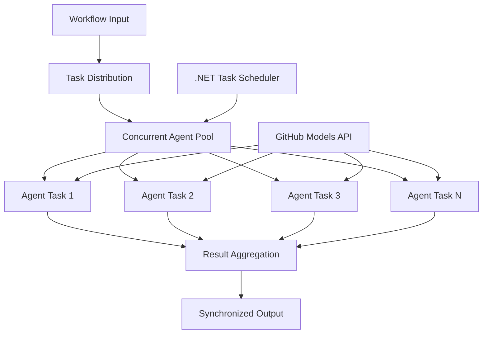

<!--
CO_OP_TRANSLATOR_METADATA:
{
  "original_hash": "b9c6e32c9b5f2fed20b6916984440d88",
  "translation_date": "2025-11-11T13:05:15+00:00",
  "source_file": "08-multi-agent/code_samples/workflows-agent-framework/dotNET/03.dotnet-agent-framework-workflow-ghmodel-concurrent.md",
  "language_code": "es"
}
-->
# ⚡ Flujos de trabajo concurrentes de agentes con modelos de GitHub (.NET)

## 📋 Tutorial de procesamiento paralelo de alto rendimiento

Este cuaderno demuestra **patrones de flujo de trabajo concurrentes** utilizando el Microsoft Agent Framework para .NET y modelos de GitHub. Aprenderás a construir flujos de trabajo de procesamiento paralelo de alto rendimiento que maximizan el rendimiento ejecutando múltiples agentes de IA simultáneamente mientras se mantiene la coordinación y la consistencia de los datos.

## 🎯 Objetivos de aprendizaje

### 🚀 **Fundamentos del procesamiento concurrente**
- **Ejecución paralela de agentes**: Ejecuta múltiples agentes de IA simultáneamente para obtener el máximo rendimiento
- **Patrones Async/Await**: Aprovecha el modelo de programación asíncrona de .NET para una concurrencia eficiente
- **Integración con modelos de GitHub**: Coordina múltiples llamadas concurrentes al servicio de inferencia de modelos de IA de GitHub
- **Gestión de recursos**: Administra eficientemente los recursos de modelos de IA en operaciones concurrentes

### 🏗️ **Arquitectura avanzada de concurrencia**
- **Paralelismo basado en tareas**: Utiliza la biblioteca de tareas paralelas de .NET para una ejecución concurrente óptima
- **Patrones de sincronización**: Coordina agentes concurrentes evitando condiciones de carrera
- **Balanceo de carga**: Distribuye el trabajo eficientemente entre la capacidad de procesamiento concurrente disponible
- **Tolerancia a fallos**: Maneja fallos individuales de agentes sin detener todo el flujo de trabajo

### 🏢 **Aplicaciones concurrentes empresariales**
- **Procesamiento de documentos de alto volumen**: Procesa múltiples documentos simultáneamente
- **Análisis de contenido en tiempo real**: Análisis concurrente de flujos de datos entrantes
- **Optimización de procesamiento por lotes**: Maximiza el rendimiento en operaciones de procesamiento de datos a gran escala
- **Análisis multimodal**: Procesamiento paralelo de diferentes tipos y formatos de contenido

## ⚙️ Requisitos previos y configuración

### 📦 **Paquetes NuGet necesarios**

Paquetes esenciales para flujos de trabajo concurrentes de alto rendimiento:

```xml
<!-- Core AI Framework with Async Support -->
<PackageReference Include="Microsoft.Extensions.AI" Version="9.9.0" />

<!-- Client Model Abstractions for API Communication -->
<PackageReference Include="System.ClientModel" Version="1.6.1.0" />

<!-- Azure Identity and Async LINQ for Advanced Operations -->
<PackageReference Include="Azure.Identity" Version="1.15.0" />
<PackageReference Include="System.Linq.Async" Version="6.0.3" />

<!-- Local Agent Framework References -->
<!-- Microsoft.Agents.AI.dll - Core agent abstractions with async support -->
<!-- Microsoft.Agents.AI.OpenAI.dll - GitHub Models integration with concurrency -->
```

### 🔑 **Configuración de modelos de GitHub**

**Configuración del entorno (archivo .env):**
```env
GITHUB_TOKEN=your_github_personal_access_token
GITHUB_ENDPOINT=https://models.inference.ai.azure.com
GITHUB_MODEL_ID=gpt-4o-mini
```

**Consideraciones sobre procesamiento concurrente:**
```csharp
// Configure for concurrent operations
var clientOptions = new OpenAIClientOptions()
{
    Endpoint = new Uri(githubEndpoint),
    // Configure connection pooling for concurrent requests
    NetworkTimeout = TimeSpan.FromMinutes(5)
};
```

### 🏗️ **Arquitectura de flujo de trabajo concurrente**



**Componentes clave:**
- **Biblioteca de tareas paralelas**: Soporte integrado de .NET para operaciones concurrentes
- **Pool de agentes**: Múltiples instancias de agentes para procesamiento paralelo
- **Agregación de resultados**: Coordinación y combinación de resultados de agentes concurrentes
- **Puntos de sincronización**: Garantiza la consistencia de datos en operaciones concurrentes

## 🎨 **Patrones de diseño de flujo de trabajo concurrente**

### 🔍 **Investigación y análisis paralelos**
```
Research Topic → Concurrent Research Agents → Result Synthesis → Final Report
```

### 📊 **Procesamiento de datos de múltiples fuentes**
```
Data Sources → Parallel Processing Agents → Data Integration → Unified Output
```

### 🎭 **Pipeline de generación de contenido**
```
Content Requirements → Concurrent Content Generators → Quality Review → Final Content
```

### 🔄 **Procesamiento Fan-Out/Fan-In**
```
Single Input → Multiple Concurrent Processors → Result Aggregation → Single Output
```

## 🏢 **Beneficios de rendimiento empresarial**

### ⚡ **Rendimiento y escalabilidad**
- **Escalado lineal de rendimiento**: Agrega más agentes concurrentes para aumentar el rendimiento
- **Utilización de recursos**: Máxima eficiencia de la capacidad de modelos de IA disponibles
- **Reducción del tiempo de procesamiento**: Reducción significativa del tiempo mediante ejecución paralela
- **Escalado elástico**: Ajusta dinámicamente la cantidad de agentes concurrentes según la carga de trabajo

### 🛡️ **Fiabilidad y resiliencia**
- **Aislamiento de fallos**: Los fallos individuales de agentes no afectan otras operaciones concurrentes
- **Degradación gradual**: El sistema sigue funcionando con capacidad reducida de agentes
- **Recuperación de errores**: Mecanismos automáticos de reintento para operaciones concurrentes fallidas
- **Distribución de carga**: Distribución uniforme del trabajo entre los agentes disponibles

### 📊 **Monitoreo de rendimiento**
- **Métricas de ejecución concurrente**: Rastrea el rendimiento de todas las operaciones paralelas
- **Análisis de uso de recursos**: Monitorea el uso de CPU, memoria y red
- **Análisis de rendimiento**: Mide las ganancias de eficiencia del procesamiento concurrente
- **Detección de cuellos de botella**: Identifica y resuelve restricciones de rendimiento

### 🔧 **Desarrollo y operaciones**
- **Modelo de programación asíncrona**: Aprovecha los patrones maduros de async/await de .NET
- **Coordinación de tareas**: Capacidades integradas de gestión y coordinación de tareas
- **Manejo de excepciones**: Manejo integral de errores en operaciones concurrentes
- **Soporte de depuración**: Herramientas de depuración de Visual Studio para flujos de trabajo concurrentes

¡Construyamos flujos de trabajo de IA concurrentes de alto rendimiento con .NET! 🚀

## 💻 Ejecución del código

La implementación completa está disponible en `03.dotnet-agent-framework-workflow-ghmodel-concurrent.cs`. Este archivo demuestra un flujo de trabajo concurrente **Fan-Out/Fan-In** para planificación de viajes:

### 🏗️ **Arquitectura del flujo de trabajo**

```
User Request → ConcurrentStartExecutor → [Researcher Agent || Planner Agent] → ConcurrentAggregationExecutor → Final Output
```

**Componentes clave:**

1. **ConcurrentStartExecutor**: Difunde la solicitud del usuario a todos los agentes simultáneamente
2. **Agente investigador**: Analiza destinos y atracciones de forma concurrente
3. **Agente planificador**: Crea planes de viaje detallados de forma concurrente
4. **ConcurrentAggregationExecutor**: Recoge y combina resultados de ambos agentes

### 🎯 **Patrón Fan-Out/Fan-In**

Este flujo de trabajo demuestra el clásico patrón **Fan-Out/Fan-In**:
- **Fan-Out**: Un mensaje de entrada se difunde a múltiples agentes simultáneamente
- **Procesamiento concurrente**: Múltiples agentes trabajan en paralelo en la misma tarea
- **Fan-In**: Los resultados de todos los agentes se recogen y se agregan en una salida única

### 🚀 Ejecución del ejemplo

```bash
# Make the script executable (Unix/Linux/macOS)
chmod +x 03.dotnet-agent-framework-workflow-ghmodel-concurrent.cs

# Run the concurrent workflow
./03.dotnet-agent-framework-workflow-ghmodel-concurrent.cs
```

O en Windows:
```powershell
dotnet run 03.dotnet-agent-framework-workflow-ghmodel-concurrent.cs
```

### 📝 Salida esperada

El flujo de trabajo:
1. **Difunde la solicitud**: Envía "Planifica un viaje a Seattle en diciembre" a ambos agentes
2. **Procesamiento concurrente**: Ambos agentes trabajan simultáneamente:
   - El investigador identifica atracciones y detalles
   - El planificador crea el itinerario y la logística
3. **Agregación**: Combina ambas respuestas en una salida integral
4. **Muestra resultados**: Presenta el plan de viaje combinado con toda la información

### 🔧 Opciones de personalización

**Agregar más agentes concurrentes:**
```csharp
// Create additional specialized agents
AIAgent budgetAgent = openAIClient.GetChatClient(github_model_id).CreateAIAgent(
    name: "Budget-Agent", instructions: "Calculate travel costs...");

// Add to fan-out
var workflow = new WorkflowBuilder(startExecutor)
    .AddFanOutEdge(startExecutor, targets: [researcherAgent, plannerAgent, budgetAgent])
    .AddFanInEdge(aggregationExecutor, sources: [researcherAgent, plannerAgent, budgetAgent])
    .WithOutputFrom(aggregationExecutor)
    .Build();

// Update aggregation count
if (this._messages.Count == 3) { ... }
```

**Modificar instrucciones de los agentes:**
```csharp
const string ResearcherAgentInstructions = "Your custom instructions for research...";
const string PlanAgentInstructions = "Your custom instructions for planning...";
```

**Cambiar la tarea:**
```csharp
StreamingRun run = await InProcessExecution.StreamAsync(
    workflow, 
    "Plan a European vacation for 2 weeks in summer"
);
```

### 🎯 Aplicaciones en el mundo real

Este patrón concurrente es ideal para:
- **Creación de contenido**: Múltiples escritores creando diferentes secciones simultáneamente
- **Revisión de código**: Múltiples revisores analizando código desde diferentes perspectivas
- **Investigación de mercado**: Análisis paralelo de diferentes segmentos de mercado
- **Procesamiento de documentos**: Extracción, análisis y validación concurrentes
- **Análisis multiperspectiva**: Obtención de puntos de vista diversos sobre la misma entrada

### 🔍 Comprendiendo los ejecutores personalizados

**ConcurrentStartExecutor:**
- Implementa `IMessageHandler<string>` para aceptar entradas de tipo string
- Difunde mensajes a todos los agentes conectados
- Envía `TurnToken` para activar el procesamiento concurrente

**ConcurrentAggregationExecutor:**
- Implementa `IMessageHandler<ChatMessage>` para recibir respuestas de agentes
- Recoge mensajes de manera segura para hilos
- Agrega cuando llegan todas las respuestas esperadas
- Produce la salida final utilizando `context.YieldOutputAsync()`

### ⚡ Beneficios de rendimiento

**Concurrente vs Secuencial:**
- Secuencial: Agente1 (30s) → Agente2 (30s) = **60 segundos en total**
- Concurrente: Agente1 (30s) || Agente2 (30s) = **30 segundos en total**

**Mejora del rendimiento**: Hasta N× más rápido para N agentes concurrentes (dependiendo de la carga de trabajo y los recursos)

### 🛡️ Manejo de errores

El flujo de trabajo maneja fallos individuales de agentes de manera eficiente:
- Si un agente falla, los demás continúan procesando
- El agregador puede implementar lógica de tiempo de espera
- Se pueden devolver resultados parciales si es necesario

### 📊 Funciones avanzadas

**Cantidad dinámica de agentes:**
Modifica la lógica de agregación para admitir cantidades variables de agentes:

```csharp
private int _expectedAgentCount;
private readonly List<ChatMessage> _messages = [];

public async ValueTask HandleAsync(ChatMessage message, IWorkflowContext context)
{
    this._messages.Add(message);
    if (this._messages.Count == _expectedAgentCount)
    {
        // Process aggregation
    }
}
```

¡Este patrón de flujo de trabajo concurrente es esencial para construir sistemas de agentes de IA escalables y de alto rendimiento!

---

<!-- CO-OP TRANSLATOR DISCLAIMER START -->
**Descargo de responsabilidad**:  
Este documento ha sido traducido utilizando el servicio de traducción automática [Co-op Translator](https://github.com/Azure/co-op-translator). Aunque nos esforzamos por lograr precisión, tenga en cuenta que las traducciones automáticas pueden contener errores o imprecisiones. El documento original en su idioma nativo debe considerarse la fuente autorizada. Para información crítica, se recomienda una traducción profesional realizada por humanos. No nos hacemos responsables de malentendidos o interpretaciones erróneas que surjan del uso de esta traducción.
<!-- CO-OP TRANSLATOR DISCLAIMER END -->