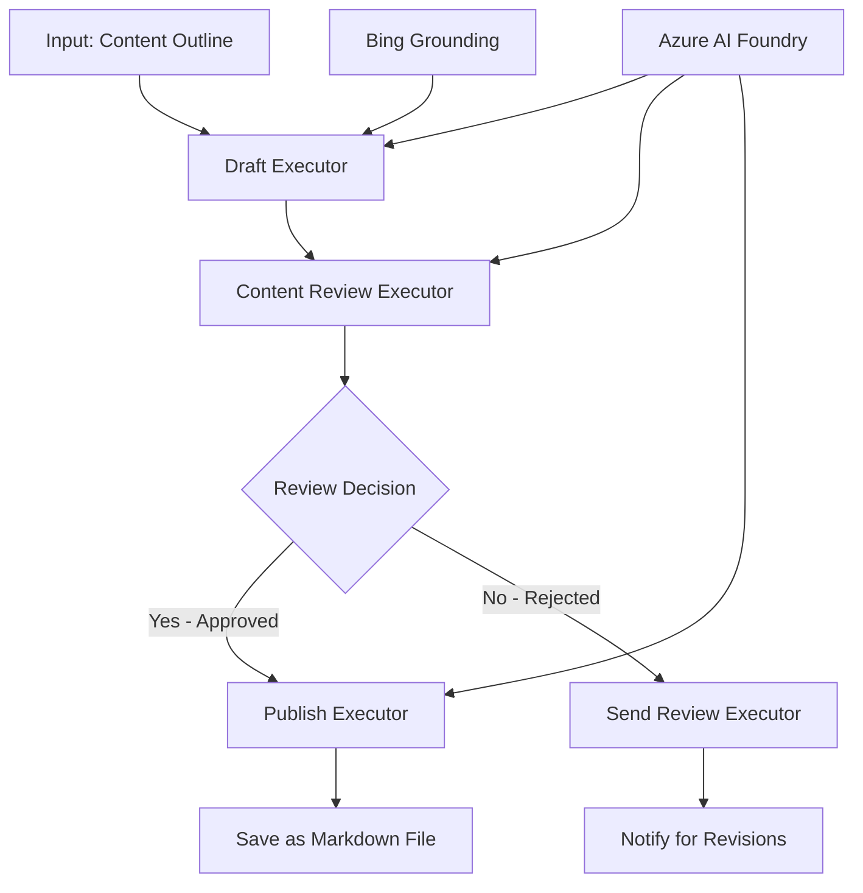

<!--
CO_OP_TRANSLATOR_METADATA:
{
  "original_hash": "8abd335151cee553293b637ee3d80d10",
  "translation_date": "2025-11-11T12:00:27+00:00",
  "source_file": "08-multi-agent/code_samples/workflows-agent-framework/dotNET/04.dotnet-agent-framework-workflow-aifoundry-condition.md",
  "language_code": "es"
}
-->
# 🔀 Flujos de trabajo condicionales con Azure AI Foundry (.NET)

## 📋 Tutorial de flujos de trabajo basados en decisiones inteligentes

Este cuaderno demuestra **patrones de flujo de trabajo condicional** utilizando Azure AI Foundry y el Microsoft Agent Framework para .NET. Aprenderás a construir flujos de trabajo sofisticados, impulsados por decisiones, que enrutan el procesamiento de manera inteligente basándose en análisis de IA, reglas empresariales y condiciones dinámicas para automatización de nivel empresarial.

## 🎯 Objetivos de aprendizaje

### 🧠 **Arquitectura de decisiones inteligentes**
- **Implementación de lógica condicional**: Construir árboles de decisión complejos con múltiples puntos de ramificación
- **Enrutamiento impulsado por IA**: Usar modelos de Azure AI Foundry para tomar decisiones de enrutamiento inteligentes
- **Adaptación dinámica del flujo de trabajo**: Modificar el comportamiento del flujo de trabajo basado en análisis y condiciones en tiempo de ejecución
- **Integración de reglas empresariales**: Incorporar lógica empresarial y requisitos de cumplimiento en los flujos de trabajo

### 🔀 **Patrones condicionales avanzados**
- **Toma de decisiones multicriterio**: Evaluar múltiples factores para decisiones de enrutamiento
- **Procesamiento consciente del contexto**: Tomar decisiones basadas en el contexto acumulado y el historial del flujo de trabajo
- **Modificación adaptativa del flujo de trabajo**: Ajustar dinámicamente las rutas de procesamiento según condiciones en tiempo real
- **Integración de motores de reglas**: Implementar motores de reglas empresariales sofisticados dentro de los flujos de trabajo

### 🏢 **Aplicaciones condicionales empresariales**
- **Clasificación y enrutamiento de documentos**: Clasificar y enrutar automáticamente documentos a los flujos de trabajo apropiados
- **Triaje de servicio al cliente**: Enrutamiento inteligente de consultas de clientes a equipos especializados
- **Procesamiento de cumplimiento y riesgos**: Aplicar diferentes procesos de validación y revisión basados en evaluaciones de riesgo
- **Flujos de trabajo de aseguramiento de calidad**: Enrutar contenido a través de procesos de revisión apropiados basados en métricas de calidad

## ⚙️ Requisitos previos y configuración

### 📦 **Paquetes NuGet requeridos**

Paquetes avanzados para procesamiento de flujos de trabajo condicional:

```xml
<!-- Core AI Framework -->
<PackageReference Include="Microsoft.Extensions.AI" Version="9.9.0" />

<!-- Azure AI Agents with Persistent State -->
<PackageReference Include="Azure.AI.Agents.Persistent" Version="1.2.0-beta.5" />

<!-- Azure Identity and Utilities -->
<PackageReference Include="Azure.Identity" Version="1.15.0" />
<PackageReference Include="System.Linq.Async" Version="6.0.3" />
<PackageReference Include="DotNetEnv" Version="3.1.1" />

<!-- Local Workflow Framework References -->
<!-- Microsoft.Agents.Workflows.dll - Advanced workflow orchestration -->
<!-- Microsoft.Agents.AI.AzureAI.dll - Azure AI Foundry integration -->
<!-- Microsoft.Agents.AI.dll - Core agent abstractions -->
```

### 🔑 **Configuración de Azure AI Foundry**

**Recursos de Azure requeridos:**
- Espacio de trabajo de Azure AI Foundry con modelos de procesamiento condicional
- Suscripción de Azure con cuotas de cómputo y permisos adecuados
- Modelos de IA implementados para toma de decisiones y análisis de contenido
- (Opcional) Conexión a Bing Search API para capacidades de grounding

**Configuración del entorno (.env file):**
```env
# Azure AI Foundry Configuration
AZURE_AI_PROJECT_ENDPOINT=https://your-project.cognitiveservices.azure.com/
BING_CONNECTION_ID=your-bing-connection-id
```

**Configuración de autenticación:**
```csharp
// Azure CLI or Managed Identity authentication
using Azure.Identity;
var credential = new AzureCliCredential();

// Load environment configuration
DotNetEnv.Env.Load("../../../.env");
```

### 🏗️ **Arquitectura de flujo de trabajo condicional**



**Componentes clave:**
- **Draft Executor**: Agente de IA que crea borradores iniciales de contenido a partir de esquemas
- **Content Review Executor**: Agente de IA que evalúa la calidad y el cumplimiento del borrador
- **Conditional Routing**: Lógica de decisión que enruta según los resultados de la revisión
- **Publish/Review Paths**: Rutas de procesamiento separadas para contenido aprobado vs rechazado
- **State Management**: Mantiene el contexto de contenido y revisión a lo largo del flujo de trabajo

## 🎨 **Patrones de diseño de flujo de trabajo condicional**

### 📋 **Producción de contenido con puertas de calidad**
```
Outline → Draft Creation → Quality Review → {Approve: Publish | Reject: Revise}
```

### 🎯 **Procesamiento de documentos basado en riesgos**
```
Document → Risk Assessment → {Low: Standard | High: Enhanced Review}
```

### 🔍 **Enrutamiento inteligente de servicio al cliente**
```
Customer Query → Analysis → {Simple: FAQ Bot | Complex: Human Agent}
```

### 💼 **Flujos de trabajo impulsados por cumplimiento**
```
Content → Compliance Check → {Pass: Publish | Fail: Legal Review}
```

## 🏢 **Beneficios condicionales empresariales**

### 🎯 **Automatización inteligente**
- **Toma de decisiones inteligente**: Decisiones de enrutamiento impulsadas por IA basadas en análisis de contenido y contexto
- **Procesamiento adaptativo**: Flujos de trabajo que se ajustan automáticamente según condiciones cambiantes
- **Aplicación de reglas empresariales**: Aplicación automática de lógica empresarial y políticas complejas
- **Enrutamiento consciente del contexto**: Decisiones basadas en el historial completo del flujo de trabajo y el contexto acumulado

### 📈 **Excelencia operativa**
- **Asignación optimizada de recursos**: Enrutar trabajo a los especialistas y procesos más apropiados
- **Reducción de intervención manual**: La toma de decisiones automatizada minimiza la necesidad de enrutamiento humano
- **Tiempos de resolución más rápidos**: Enrutamiento directo a la experiencia y capacidades de procesamiento adecuadas
- **Aplicación consistente**: Aplicación uniforme de reglas empresariales y criterios de decisión

### 🛡️ **Gestión de riesgos y cumplimiento**
- **Evaluación de riesgos automatizada**: Evaluación impulsada por IA de niveles de riesgo de contenido y situaciones
- **Aplicación de cumplimiento**: Enrutamiento automático a través de procesos regulatorios requeridos
- **Aplicación de protocolos de seguridad**: Medidas de seguridad mejoradas aplicadas según la evaluación de riesgos
- **Mantenimiento de registros de auditoría**: Documentación completa de decisiones de enrutamiento y su justificación

### 📊 **Análisis y mejora continua**
- **Análisis de decisiones**: Seguimiento de la efectividad y precisión de las decisiones de enrutamiento
- **Reconocimiento de patrones**: Identificación de tendencias y patrones en decisiones de enrutamiento a lo largo del tiempo
- **Optimización del rendimiento**: Mejora continua de los criterios de decisión y la eficiencia del enrutamiento
- **Inteligencia empresarial**: Información sobre características de contenido y requisitos de procesamiento

### 🔧 **Excelencia técnica**
- **Gestión persistente del estado**: Mantener estados complejos a lo largo de la ejecución del flujo de trabajo
- **Arquitectura escalable**: Manejar requisitos de procesamiento condicional de alto volumen
- **Capacidades de integración**: Integración fluida con sistemas y procesos empresariales existentes
- **Monitoreo y observabilidad**: Seguimiento integral del rendimiento y decisiones del flujo de trabajo

¡Construyamos flujos de trabajo empresariales inteligentes y basados en decisiones con .NET! 🚀

## 💻 Ejecución del código

La implementación completa está disponible en `04.dotnet-agent-framework-workflow-aifoundry-condition.cs`. Esto demuestra un **flujo de trabajo de producción de contenido con puertas de calidad**:

### 🏗️ **Arquitectura del flujo de trabajo**

```
Content Outline → Draft Creation → Quality Review → Conditional Routing:
                                                      ├─ Approved (>200 words) → Publish
                                                      └─ Rejected (<200 words) → Review Notification
```

**Agentes en el flujo de trabajo:**
1. **Evangelist Agent**: Crea borradores de tutoriales a partir de esquemas con grounding de Bing
2. **Content Reviewer Agent**: Evalúa la calidad del borrador (conteo de palabras, integridad)
3. **Publisher Agent**: Guarda contenido aprobado como archivos Markdown con marca de tiempo

**Ejecutores personalizados:**
1. **DraftExecutor**: Orquesta la creación de borradores
2. **ContentReviewExecutor**: Realiza la evaluación de calidad
3. **PublishExecutor**: Maneja la publicación de contenido aprobado
4. **SendReviewExecutor**: Gestiona las notificaciones de contenido rechazado

### 🚀 Ejecución del ejemplo

**Requisitos previos:**
- Espacio de trabajo de Azure AI Foundry configurado
- Autenticación de Azure CLI (`az login`)
- (Opcional) Conexión a Bing Search para grounding

```bash
# Make the script executable (Unix/Linux/macOS)
chmod +x 04.dotnet-agent-framework-workflow-aifoundry-condition.cs

# Run the conditional workflow
./04.dotnet-agent-framework-workflow-aifoundry-condition.cs
```

O en Windows:
```powershell
dotnet run 04.dotnet-agent-framework-workflow-aifoundry-condition.cs
```

### 📝 Salida esperada

El flujo de trabajo:
1. **Crea agentes**: Inicializa tres agentes especializados de Azure AI Foundry
2. **Genera borrador**: El agente Evangelist crea un borrador de tutorial a partir de un esquema
3. **Revisa contenido**: El Content Reviewer evalúa la calidad del borrador
4. **Enrutamiento condicional**:
   - **Si aprobado (>200 palabras)**: El ejecutor de publicación guarda como archivo Markdown
   - **Si rechazado (<200 palabras)**: Envía notificación de revisión
5. **Muestra resultados**: Presenta el resultado final del flujo de trabajo

### 🔧 Opciones de personalización

**Modificar criterios de revisión:**
```csharp
const string ContentReviewerInstructions = @"
You are a content reviewer...
1. Check if content is more than 500 words (instead of 200)
2. Verify technical accuracy
3. Ensure proper formatting
...";
```

**Agregar más rutas condicionales:**
```csharp
var workflow = new WorkflowBuilder(draftExecutor)
    .AddEdge(draftExecutor, contentReviewerExecutor)
    .AddEdge(contentReviewerExecutor, publishExecutor, condition: GetCondition("Excellent"))
    .AddEdge(contentReviewerExecutor, editExecutor, condition: GetCondition("Good"))
    .AddEdge(contentReviewerExecutor, sendReviewerExecutor, condition: GetCondition("Poor"))
    .Build();
```

**Cambiar requisitos de contenido:**
```csharp
string OUTLINE_Content = @"
# Your Custom Topic
## Section 1
https://your-reference-url
## Section 2
...
";
```

### 🎯 Aplicaciones en el mundo real

Este patrón de flujo de trabajo condicional es ideal para:
- **Sistemas de gestión de contenido**: Flujos editoriales automatizados con puertas de calidad
- **Procesamiento de documentos**: Enrutar documentos según clasificación y cumplimiento
- **Soporte al cliente**: Enrutamiento inteligente de tickets según complejidad y urgencia
- **Revisión legal**: Enrutar contratos según evaluación de riesgos y valor
- **Procesos de RRHH**: Enrutar aplicaciones a través de flujos de evaluación adecuados

### 🔍 Entendiendo la lógica condicional

**Función de condición:**
```csharp
public Func<object?, bool> GetCondition(string expectedResult) =>
    reviewResult => reviewResult is ReviewResult review && review.Result == expectedResult;
```

Esta función crea un predicado que:
1. Verifica si el resultado es del tipo `ReviewResult`
2. Compara la propiedad `Result` con el valor esperado
3. Devuelve verdadero/falso para determinar el enrutamiento

**Bordes del flujo de trabajo con condiciones:**
```csharp
.AddEdge(contentReviewerExecutor, publishExecutor, condition: GetCondition("Yes"))
.AddEdge(contentReviewerExecutor, sendReviewerExecutor, condition: GetCondition("No"))
```

### 📊 Características avanzadas

**Validación de esquema JSON:**
El flujo de trabajo utiliza esquemas JSON para garantizar respuestas estructuradas:

```csharp
// Define response structure
public class ReviewResult
{
    [JsonPropertyName("review_result")]
    public string Result { get; set; } = string.Empty;
    
    [JsonPropertyName("reason")]
    public string Reason { get; set; } = string.Empty;
    
    [JsonPropertyName("draft_content")]
    public string DraftContent { get; set; } = string.Empty;
}

// Apply to agent
ResponseFormat = ChatResponseFormat.ForJsonSchema(
    AIJsonUtilities.CreateJsonSchema(typeof(ReviewResult)), 
    "ReviewResult", 
    "Review Result From DraftContent"
)
```

**Integración de grounding de Bing:**
El agente Evangelist utiliza grounding de Bing para acceder a información en tiempo real:

```csharp
var bingGroundingConfig = new BingGroundingSearchConfiguration(bing_conn_id);
BingGroundingToolDefinition bingGroundingTool = new(
    new BingGroundingSearchToolParameters([bingGroundingConfig])
);
```

Esto permite al agente seguir URLs en el esquema y extraer información actual.

### 🛡️ Manejo de errores

El flujo de trabajo incluye manejo robusto de errores para contenido rechazado:
- Las fallas de revisión activan la ruta alternativa
- Las notificaciones proporcionan razones claras de rechazo
- El contenido se conserva para revisión

### 🔄 Extensión del flujo de trabajo

**Agregar un bucle de revisión:**
Crear un bucle de retroalimentación que vuelva a redactar contenido automáticamente:

```csharp
.AddEdge(contentReviewerExecutor, publishExecutor, condition: GetCondition("Yes"))
.AddEdge(contentReviewerExecutor, draftExecutor, condition: GetCondition("No")) // Loop back
```

**Implementar revisión multinivel:**
Agregar múltiples etapas de revisión con diferentes criterios:

```csharp
.AddEdge(draftExecutor, technicalReviewer)
.AddEdge(technicalReviewer, editorialReviewer, condition: GetCondition("TechPass"))
.AddEdge(editorialReviewer, publishExecutor, condition: GetCondition("EditPass"))
```

¡Este patrón de flujo de trabajo condicional proporciona la base para construir sistemas de automatización empresarial sofisticados e inteligentes! 🚀

---

<!-- CO-OP TRANSLATOR DISCLAIMER START -->
**Descargo de responsabilidad**:  
Este documento ha sido traducido utilizando el servicio de traducción automática [Co-op Translator](https://github.com/Azure/co-op-translator). Aunque nos esforzamos por lograr precisión, tenga en cuenta que las traducciones automáticas pueden contener errores o imprecisiones. El documento original en su idioma nativo debe considerarse la fuente autorizada. Para información crítica, se recomienda una traducción profesional realizada por humanos. No nos hacemos responsables de malentendidos o interpretaciones erróneas que surjan del uso de esta traducción.
<!-- CO-OP TRANSLATOR DISCLAIMER END -->