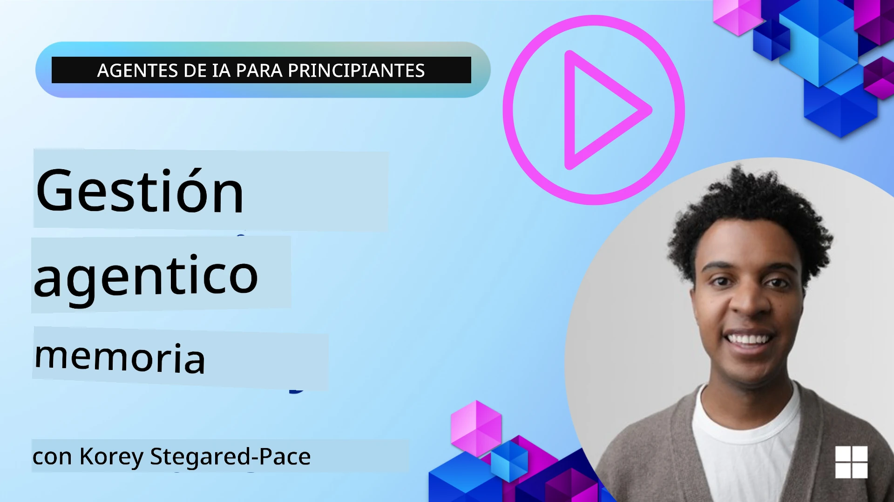

<!--
CO_OP_TRANSLATOR_METADATA:
{
  "original_hash": "a1d90991499ad697c4ad24decaf36968",
  "translation_date": "2025-12-09T11:47:00+00:00",
  "source_file": "13-agent-memory/README.md",
  "language_code": "es"
}
-->
# Memoria para Agentes de IA 

Cuando se habla de los beneficios únicos de crear Agentes de IA, se destacan principalmente dos cosas: la capacidad de utilizar herramientas para completar tareas y la capacidad de mejorar con el tiempo. La memoria es la base para crear agentes auto-mejorables que puedan ofrecer mejores experiencias a nuestros usuarios.

En esta lección, exploraremos qué es la memoria para los Agentes de IA y cómo podemos gestionarla y utilizarla en beneficio de nuestras aplicaciones.

## Introducción

Esta lección cubrirá:

• **Comprender la Memoria de los Agentes de IA**: Qué es la memoria y por qué es esencial para los agentes.

• **Implementar y Almacenar Memoria**: Métodos prácticos para añadir capacidades de memoria a tus agentes de IA, centrándonos en la memoria a corto y largo plazo.

• **Hacer que los Agentes de IA se Auto-Mejoren**: Cómo la memoria permite a los agentes aprender de interacciones pasadas y mejorar con el tiempo.

## Implementaciones Disponibles

Esta lección incluye dos tutoriales completos en cuadernos:

• **[13-agent-memory.ipynb](./13-agent-memory.ipynb)**: Implementa memoria utilizando Mem0 y Azure AI Search con el marco de trabajo Semantic Kernel.

• **[13-agent-memory-cognee.ipynb](./13-agent-memory-cognee.ipynb)**: Implementa memoria estructurada utilizando Cognee, construyendo automáticamente un grafo de conocimiento respaldado por embeddings, visualizando el grafo y realizando recuperaciones inteligentes.

## Objetivos de Aprendizaje

Después de completar esta lección, sabrás cómo:

• **Diferenciar entre varios tipos de memoria de agentes de IA**, incluyendo memoria de trabajo, a corto plazo y a largo plazo, así como formas especializadas como memoria de personalidad y episódica.

• **Implementar y gestionar memoria a corto y largo plazo para agentes de IA** utilizando el marco de trabajo Semantic Kernel, aprovechando herramientas como Mem0, Cognee, memoria de pizarra y la integración con Azure AI Search.

• **Comprender los principios detrás de los agentes de IA auto-mejorables** y cómo los sistemas robustos de gestión de memoria contribuyen al aprendizaje continuo y la adaptación.

## Comprendiendo la Memoria de los Agentes de IA

En su esencia, **la memoria para los agentes de IA se refiere a los mecanismos que les permiten retener y recordar información**. Esta información puede incluir detalles específicos de una conversación, preferencias del usuario, acciones pasadas o incluso patrones aprendidos.

Sin memoria, las aplicaciones de IA suelen ser sin estado, lo que significa que cada interacción comienza desde cero. Esto lleva a una experiencia de usuario repetitiva y frustrante, donde el agente "olvida" el contexto o las preferencias previas.

### ¿Por qué es Importante la Memoria?

La inteligencia de un agente está profundamente ligada a su capacidad para recordar y utilizar información pasada. La memoria permite que los agentes sean:

• **Reflexivos**: Aprender de acciones y resultados pasados.

• **Interactivos**: Mantener el contexto durante una conversación en curso.

• **Proactivos y Reactivos**: Anticipar necesidades o responder adecuadamente basándose en datos históricos.

• **Autónomos**: Operar de manera más independiente al recurrir a conocimientos almacenados.

El objetivo de implementar memoria es hacer que los agentes sean más **confiables y capaces**.

### Tipos de Memoria

#### Memoria de Trabajo

Piensa en esto como un papel de borrador que un agente utiliza durante una tarea o proceso de pensamiento único. Contiene información inmediata necesaria para calcular el siguiente paso.

Para los agentes de IA, la memoria de trabajo a menudo captura la información más relevante de una conversación, incluso si el historial completo del chat es largo o está truncado. Se centra en extraer elementos clave como requisitos, propuestas, decisiones y acciones.

**Ejemplo de Memoria de Trabajo**

En un agente de reservas de viajes, la memoria de trabajo podría capturar la solicitud actual del usuario, como "Quiero reservar un viaje a París". Este requisito específico se mantiene en el contexto inmediato del agente para guiar la interacción actual.

#### Memoria a Corto Plazo

Este tipo de memoria retiene información durante la duración de una sola conversación o sesión. Es el contexto del chat actual, permitiendo que el agente se refiera a turnos previos en el diálogo.

**Ejemplo de Memoria a Corto Plazo**

Si un usuario pregunta, "¿Cuánto costaría un vuelo a París?" y luego sigue con "¿Y el alojamiento allí?", la memoria a corto plazo asegura que el agente sepa que "allí" se refiere a "París" dentro de la misma conversación.

#### Memoria a Largo Plazo

Esta es información que persiste a lo largo de múltiples conversaciones o sesiones. Permite a los agentes recordar preferencias del usuario, interacciones históricas o conocimientos generales durante períodos prolongados. Esto es importante para la personalización.

**Ejemplo de Memoria a Largo Plazo**

Una memoria a largo plazo podría almacenar que "A Ben le gusta esquiar y las actividades al aire libre, disfruta del café con vistas a la montaña y quiere evitar pistas de esquí avanzadas debido a una lesión pasada". Esta información, aprendida de interacciones previas, influye en las recomendaciones en futuras sesiones de planificación de viajes, haciéndolas altamente personalizadas.

#### Memoria de Personalidad

Este tipo de memoria especializada ayuda a un agente a desarrollar una "personalidad" o "rol" consistente. Permite que el agente recuerde detalles sobre sí mismo o su rol previsto, haciendo que las interacciones sean más fluidas y enfocadas.

**Ejemplo de Memoria de Personalidad**

Si el agente de viajes está diseñado para ser un "experto en planificación de esquí", la memoria de personalidad podría reforzar este rol, influyendo en sus respuestas para alinearse con el tono y conocimiento de un experto.

#### Memoria de Flujo/Episódica

Esta memoria almacena la secuencia de pasos que un agente toma durante una tarea compleja, incluyendo éxitos y fracasos. Es como recordar "episodios" específicos o experiencias pasadas para aprender de ellos.

**Ejemplo de Memoria Episódica**

Si el agente intentó reservar un vuelo específico pero falló debido a la falta de disponibilidad, la memoria episódica podría registrar este fallo, permitiendo que el agente intente vuelos alternativos o informe al usuario sobre el problema de manera más informada en un intento posterior.

#### Memoria de Entidades

Esto implica extraer y recordar entidades específicas (como personas, lugares o cosas) y eventos de las conversaciones. Permite que el agente construya una comprensión estructurada de los elementos clave discutidos.

**Ejemplo de Memoria de Entidades**

De una conversación sobre un viaje pasado, el agente podría extraer "París", "Torre Eiffel" y "cena en el restaurante Le Chat Noir" como entidades. En una interacción futura, el agente podría recordar "Le Chat Noir" y ofrecer hacer una nueva reserva allí.

#### RAG Estructurado (Generación Aumentada por Recuperación)

Aunque RAG es una técnica más amplia, el "RAG Estructurado" se destaca como una tecnología de memoria poderosa. Extrae información densa y estructurada de diversas fuentes (conversaciones, correos electrónicos, imágenes) y la utiliza para mejorar la precisión, recuperación y velocidad en las respuestas. A diferencia del RAG clásico que se basa únicamente en la similitud semántica, el RAG Estructurado trabaja con la estructura inherente de la información.

**Ejemplo de RAG Estructurado**

En lugar de solo coincidir palabras clave, el RAG Estructurado podría analizar detalles de un vuelo (destino, fecha, hora, aerolínea) de un correo electrónico y almacenarlos de manera estructurada. Esto permite consultas precisas como "¿Qué vuelo reservé a París el martes?"

## Implementar y Almacenar Memoria

Implementar memoria para agentes de IA implica un proceso sistemático de **gestión de memoria**, que incluye generar, almacenar, recuperar, integrar, actualizar e incluso "olvidar" (o eliminar) información. La recuperación es un aspecto particularmente crucial.

### Herramientas Especializadas de Memoria

#### Mem0

Una forma de almacenar y gestionar la memoria del agente es utilizando herramientas especializadas como Mem0. Mem0 funciona como una capa de memoria persistente, permitiendo que los agentes recuerden interacciones relevantes, almacenen preferencias del usuario y contexto factual, y aprendan de éxitos y fracasos con el tiempo. La idea aquí es que los agentes sin estado se conviertan en agentes con estado.

Funciona a través de un **pipeline de memoria en dos fases: extracción y actualización**. Primero, los mensajes añadidos al hilo de un agente se envían al servicio Mem0, que utiliza un Modelo de Lenguaje Extenso (LLM) para resumir el historial de la conversación y extraer nuevos recuerdos. Posteriormente, una fase de actualización impulsada por LLM determina si añadir, modificar o eliminar estos recuerdos, almacenándolos en un almacén de datos híbrido que puede incluir bases de datos vectoriales, de grafos y de clave-valor. Este sistema también admite varios tipos de memoria y puede incorporar memoria de grafo para gestionar relaciones entre entidades.

#### Cognee

Otro enfoque poderoso es utilizar **Cognee**, una memoria semántica de código abierto para agentes de IA que transforma datos estructurados y no estructurados en grafos de conocimiento consultables respaldados por embeddings. Cognee proporciona una **arquitectura de doble almacenamiento** que combina búsqueda por similitud vectorial con relaciones de grafo, permitiendo que los agentes comprendan no solo qué información es similar, sino cómo los conceptos se relacionan entre sí.

Sobresale en la **recuperación híbrida** que combina similitud vectorial, estructura de grafo y razonamiento de LLM, desde la búsqueda de fragmentos crudos hasta la respuesta a preguntas conscientes del grafo. El sistema mantiene una **memoria viva** que evoluciona y crece mientras sigue siendo consultable como un grafo conectado, apoyando tanto el contexto de sesión a corto plazo como la memoria persistente a largo plazo.

El tutorial del cuaderno de Cognee ([13-agent-memory-cognee.ipynb](./13-agent-memory-cognee.ipynb)) demuestra cómo construir esta capa de memoria unificada, con ejemplos prácticos de cómo ingerir diversas fuentes de datos, visualizar el grafo de conocimiento y realizar consultas con diferentes estrategias de búsqueda adaptadas a las necesidades específicas del agente.

### Almacenando Memoria con RAG

Más allá de herramientas especializadas de memoria como Mem0, puedes aprovechar servicios de búsqueda robustos como **Azure AI Search como backend para almacenar y recuperar memorias**, especialmente para RAG estructurado.

Esto permite fundamentar las respuestas de tu agente con tus propios datos, asegurando respuestas más relevantes y precisas. Azure AI Search puede usarse para almacenar memorias de viajes específicas del usuario, catálogos de productos o cualquier otro conocimiento específico de dominio.

Azure AI Search admite capacidades como **RAG Estructurado**, que sobresale en extraer y recuperar información densa y estructurada de grandes conjuntos de datos como historiales de conversación, correos electrónicos o incluso imágenes. Esto proporciona "precisión y recuperación sobrehumanas" en comparación con los enfoques tradicionales de fragmentación de texto y embeddings.

## Haciendo que los Agentes de IA se Auto-Mejoren

Un patrón común para agentes auto-mejorables implica introducir un **"agente de conocimiento"**. Este agente separado observa la conversación principal entre el usuario y el agente principal. Su rol es:

1. **Identificar información valiosa**: Determinar si alguna parte de la conversación vale la pena guardar como conocimiento general o preferencia específica del usuario.

2. **Extraer y resumir**: Destilar el aprendizaje o preferencia esencial de la conversación.

3. **Almacenar en una base de conocimiento**: Persistir esta información extraída, a menudo en una base de datos vectorial, para que pueda recuperarse más tarde.

4. **Aumentar consultas futuras**: Cuando el usuario inicia una nueva consulta, el agente de conocimiento recupera información almacenada relevante y la agrega al prompt del usuario, proporcionando contexto crucial al agente principal (similar a RAG).

### Optimización para la Memoria

• **Gestión de Latencia**: Para evitar ralentizar las interacciones del usuario, se puede usar inicialmente un modelo más barato y rápido para verificar rápidamente si la información es valiosa para almacenar o recuperar, invocando solo el proceso de extracción/recuperación más complejo cuando sea necesario.

• **Mantenimiento de la Base de Conocimiento**: Para una base de conocimiento en crecimiento, la información menos utilizada con frecuencia puede moverse a un "almacenamiento frío" para gestionar costos.

## ¿Tienes Más Preguntas Sobre la Memoria de los Agentes?

Únete al [Discord de Azure AI Foundry](https://aka.ms/ai-agents/discord) para conectarte con otros estudiantes, asistir a horas de oficina y resolver tus dudas sobre Agentes de IA.

---

<!-- CO-OP TRANSLATOR DISCLAIMER START -->
**Descargo de responsabilidad**:  
Este documento ha sido traducido utilizando el servicio de traducción automática [Co-op Translator](https://github.com/Azure/co-op-translator). Aunque nos esforzamos por lograr precisión, tenga en cuenta que las traducciones automáticas pueden contener errores o imprecisiones. El documento original en su idioma nativo debe considerarse como la fuente autorizada. Para información crítica, se recomienda una traducción profesional realizada por humanos. No nos hacemos responsables de malentendidos o interpretaciones erróneas que puedan surgir del uso de esta traducción.
<!-- CO-OP TRANSLATOR DISCLAIMER END -->