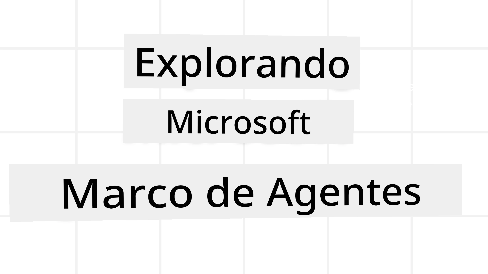
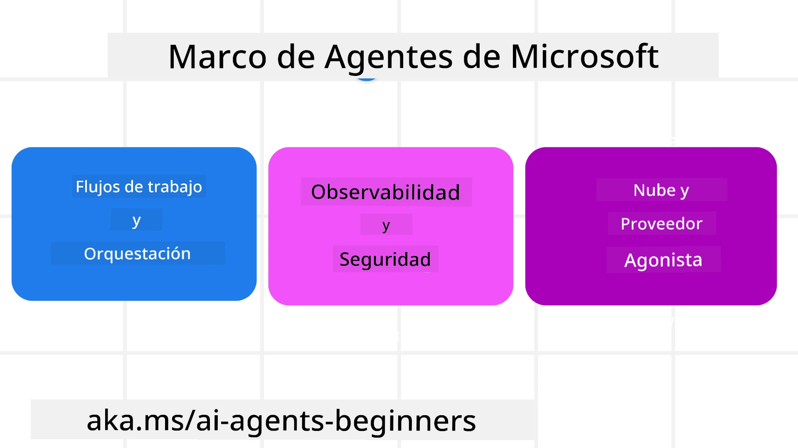
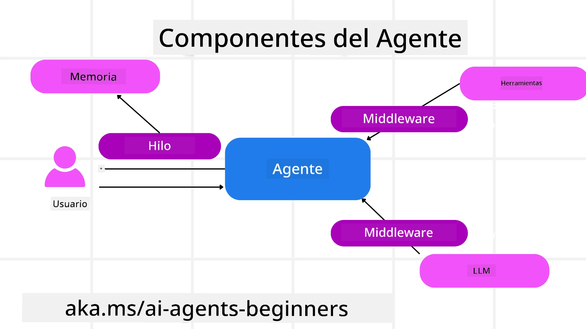

<!--
CO_OP_TRANSLATOR_METADATA:
{
  "original_hash": "19c4dab375acbc733855cc7f2f04edbc",
  "translation_date": "2025-10-01T21:42:42+00:00",
  "source_file": "14-microsoft-agent-framework/README.md",
  "language_code": "es"
}
-->
# Explorando el Marco de Agentes de Microsoft



### Introducción

Esta lección cubrirá:

- Comprender el Marco de Agentes de Microsoft: Características clave y valor  
- Explorar los conceptos clave del Marco de Agentes de Microsoft
- Comparar MAF con Semantic Kernel y AutoGen: Guía de migración

## Objetivos de aprendizaje

Después de completar esta lección, sabrás cómo:

- Construir agentes de IA listos para producción utilizando el Marco de Agentes de Microsoft
- Aplicar las características principales del Marco de Agentes de Microsoft a tus casos de uso de agentes
- Migrar e integrar marcos y herramientas de agentes existentes  

## Ejemplos de código 

Los ejemplos de código para [Microsoft Agent Framework (MAF)](https://aka.ms/ai-agents-beginners/agent-framewrok) se encuentran en este repositorio bajo los archivos `xx-python-agent-framework` y `xx-dotnet-agent-framework`.

## Comprendiendo el Marco de Agentes de Microsoft



El [Marco de Agentes de Microsoft (MAF)](https://aka.ms/ai-agents-beginners/agent-framewrok) se basa en la experiencia y los aprendizajes de Semantic Kernel y AutoGen. Ofrece la flexibilidad para abordar la amplia variedad de casos de uso de agentes que se ven tanto en entornos de producción como de investigación, incluyendo:

- **Orquestación secuencial de agentes** en escenarios donde se necesitan flujos de trabajo paso a paso.
- **Orquestación concurrente** en escenarios donde los agentes deben completar tareas al mismo tiempo.
- **Orquestación de chat grupal** en escenarios donde los agentes pueden colaborar juntos en una tarea.
- **Orquestación de transferencia** en escenarios donde los agentes transfieren la tarea entre sí a medida que se completan las subtareas.
- **Orquestación magnética** en escenarios donde un agente administrador crea y modifica una lista de tareas y maneja la coordinación de subagentes para completar la tarea.

Para entregar agentes de IA en producción, MAF también incluye características para:

- **Observabilidad** mediante el uso de OpenTelemetry, donde cada acción del agente de IA, incluida la invocación de herramientas, pasos de orquestación, flujos de razonamiento y monitoreo de rendimiento, se realiza a través de los paneles de Azure AI Foundry.
- **Seguridad** al alojar agentes de forma nativa en Azure AI Foundry, que incluye controles de seguridad como acceso basado en roles, manejo de datos privados y seguridad de contenido integrada.
- **Durabilidad** ya que los hilos y flujos de trabajo de los agentes pueden pausarse, reanudarse y recuperarse de errores, lo que permite procesos de mayor duración.
- **Control** ya que se admiten flujos de trabajo con humanos en el bucle, donde las tareas se marcan como requeridas para aprobación humana.

El Marco de Agentes de Microsoft también se centra en ser interoperable mediante:

- **Ser independiente de la nube** - Los agentes pueden ejecutarse en contenedores, en instalaciones locales y en múltiples nubes diferentes.
- **Ser independiente del proveedor** - Los agentes pueden crearse a través de tu SDK preferido, incluyendo Azure OpenAI y OpenAI.
- **Integrar estándares abiertos** - Los agentes pueden utilizar protocolos como Agent-to-Agent (A2A) y Model Context Protocol (MCP) para descubrir y usar otros agentes y herramientas.
- **Plugins y conectores** - Se pueden establecer conexiones con servicios de datos y memoria como Microsoft Fabric, SharePoint, Pinecone y Qdrant.

Veamos cómo se aplican estas características a algunos de los conceptos clave del Marco de Agentes de Microsoft.

## Conceptos clave del Marco de Agentes de Microsoft

### Agentes



**Creación de agentes**

La creación de agentes se realiza definiendo el servicio de inferencia (Proveedor de LLM), un conjunto de instrucciones para que el agente de IA siga y un `nombre` asignado:

```python
agent = AzureOpenAIChatClient(credential=AzureCliCredential()).create_agent( instructions="You are good at recommending trips to customers based on their preferences.", name="TripRecommender" )
```

El ejemplo anterior utiliza `Azure OpenAI`, pero los agentes pueden crearse utilizando una variedad de servicios, incluyendo `Azure AI Foundry Agent Service`:

```python
AzureAIAgentClient(async_credential=credential).create_agent( name="HelperAgent", instructions="You are a helpful assistant." ) as agent
```

APIs de `Responses` y `ChatCompletion` de OpenAI

```python
agent = OpenAIResponsesClient().create_agent( name="WeatherBot", instructions="You are a helpful weather assistant.", )
```

```python
agent = OpenAIChatClient().create_agent( name="HelpfulAssistant", instructions="You are a helpful assistant.", )
```

o agentes remotos utilizando el protocolo A2A:

```python
agent = A2AAgent( name=agent_card.name, description=agent_card.description, agent_card=agent_card, url="https://your-a2a-agent-host" )
```

**Ejecutar agentes**

Los agentes se ejecutan utilizando los métodos `.run` o `.run_stream` para respuestas no transmitidas o transmitidas, respectivamente.

```python
result = await agent.run("What are good places to visit in Amsterdam?")
print(result.text)
```

```python
async for update in agent.run_stream("What are the good places to visit in Amsterdam?"):
    if update.text:
        print(update.text, end="", flush=True)

```

Cada ejecución de agente también puede tener opciones para personalizar parámetros como `max_tokens` utilizados por el agente, `tools` que el agente puede llamar e incluso el propio `model` utilizado por el agente.

Esto es útil en casos donde se requieren modelos o herramientas específicas para completar la tarea de un usuario.

**Herramientas**

Las herramientas pueden definirse tanto al definir el agente:

```python
def get_attractions( location: Annotated[str, Field(description="The location to get the top tourist attractions for")], ) -> str: """Get the top tourist attractions for a given location.""" return f"The top attractions for {location} are." 


# When creating a ChatAgent directly 

agent = ChatAgent( chat_client=OpenAIChatClient(), instructions="You are a helpful assistant", tools=[get_attractions]

```

como al ejecutar el agente:

```python

result1 = await agent.run( "What's the best place to visit in Seattle?", tools=[get_attractions] # Tool provided for this run only )
```

**Hilos de agentes**

Los hilos de agentes se utilizan para manejar conversaciones de múltiples turnos. Los hilos pueden crearse de dos maneras:

- Usando `get_new_thread()`, lo que permite que el hilo se guarde con el tiempo.
- Creando un hilo automáticamente al ejecutar un agente y haciendo que el hilo dure solo durante la ejecución actual.

Para crear un hilo, el código se ve así:

```python
# Create a new thread. 
thread = agent.get_new_thread() # Run the agent with the thread. 
response = await agent.run("Hello, I am here to help you book travel. Where would you like to go?", thread=thread)

```

Luego puedes serializar el hilo para almacenarlo y usarlo más tarde:

```python
# Create a new thread. 
thread = agent.get_new_thread() 

# Run the agent with the thread. 

response = await agent.run("Hello, how are you?", thread=thread) 

# Serialize the thread for storage. 

serialized_thread = await thread.serialize() 

# Deserialize the thread state after loading from storage. 

resumed_thread = await agent.deserialize_thread(serialized_thread)
```

**Middleware de agentes**

Los agentes interactúan con herramientas y LLMs para completar las tareas de los usuarios. En ciertos escenarios, queremos ejecutar o rastrear entre estas interacciones. El middleware de agentes nos permite hacer esto a través de:

*Middleware de funciones*

Este middleware nos permite ejecutar una acción entre el agente y una función/herramienta que llamará. Un ejemplo de cuándo se usaría esto es cuando se desea registrar la llamada de la función.

En el código a continuación, `next` define si se debe llamar al siguiente middleware o a la función real.

```python
async def logging_function_middleware(
    context: FunctionInvocationContext,
    next: Callable[[FunctionInvocationContext], Awaitable[None]],
) -> None:
    """Function middleware that logs function execution."""
    # Pre-processing: Log before function execution
    print(f"[Function] Calling {context.function.name}")

    # Continue to next middleware or function execution
    await next(context)

    # Post-processing: Log after function execution
    print(f"[Function] {context.function.name} completed")
```

*Middleware de chat*

Este middleware nos permite ejecutar o registrar una acción entre el agente y las solicitudes entre el LLM.

Esto contiene información importante como los `messages` que se envían al servicio de IA.

```python
async def logging_chat_middleware(
    context: ChatContext,
    next: Callable[[ChatContext], Awaitable[None]],
) -> None:
    """Chat middleware that logs AI interactions."""
    # Pre-processing: Log before AI call
    print(f"[Chat] Sending {len(context.messages)} messages to AI")

    # Continue to next middleware or AI service
    await next(context)

    # Post-processing: Log after AI response
    print("[Chat] AI response received")

```

**Memoria de agentes**

Como se cubrió en la lección de `Memoria de agentes`, la memoria es un elemento importante para permitir que el agente opere en diferentes contextos. MAF ofrece varios tipos de memorias:

*Almacenamiento en memoria*

Esta es la memoria almacenada en hilos durante el tiempo de ejecución de la aplicación.

```python
# Create a new thread. 
thread = agent.get_new_thread() # Run the agent with the thread. 
response = await agent.run("Hello, I am here to help you book travel. Where would you like to go?", thread=thread)
```

*Mensajes persistentes*

Esta memoria se utiliza al almacenar el historial de conversaciones entre diferentes sesiones. Se define utilizando el `chat_message_store_factory`:

```python
from agent_framework import ChatMessageStore

# Create a custom message store
def create_message_store():
    return ChatMessageStore()

agent = ChatAgent(
    chat_client=OpenAIChatClient(),
    instructions="You are a Travel assistant.",
    chat_message_store_factory=create_message_store
)

```

*Memoria dinámica*

Esta memoria se agrega al contexto antes de que se ejecuten los agentes. Estas memorias pueden almacenarse en servicios externos como mem0:

```python
from agent_framework.mem0 import Mem0Provider

# Using Mem0 for advanced memory capabilities
memory_provider = Mem0Provider(
    api_key="your-mem0-api-key",
    user_id="user_123",
    application_id="my_app"
)

agent = ChatAgent(
    chat_client=OpenAIChatClient(),
    instructions="You are a helpful assistant with memory.",
    context_providers=memory_provider
)

```

**Observabilidad de agentes**

La observabilidad es importante para construir sistemas de agentes confiables y mantenibles. MAF se integra con OpenTelemetry para proporcionar trazabilidad y métricas para una mejor observabilidad.

```python
from agent_framework.observability import get_tracer, get_meter

tracer = get_tracer()
meter = get_meter()
with tracer.start_as_current_span("my_custom_span"):
    # do something
    pass
counter = meter.create_counter("my_custom_counter")
counter.add(1, {"key": "value"})
```

### Flujos de trabajo

MAF ofrece flujos de trabajo que son pasos predefinidos para completar una tarea e incluyen agentes de IA como componentes en esos pasos.

Los flujos de trabajo están compuestos por diferentes componentes que permiten un mejor control del flujo. Los flujos de trabajo también habilitan **orquestación de múltiples agentes** y **puntos de control** para guardar estados de flujo de trabajo.

Los componentes principales de un flujo de trabajo son:

**Ejecutores**

Los ejecutores reciben mensajes de entrada, realizan sus tareas asignadas y luego producen un mensaje de salida. Esto mueve el flujo de trabajo hacia la finalización de la tarea más grande. Los ejecutores pueden ser agentes de IA o lógica personalizada.

**Conexiones**

Las conexiones se utilizan para definir el flujo de mensajes en un flujo de trabajo. Estas pueden ser:

*Conexiones directas* - Conexiones simples uno a uno entre ejecutores:

```python
from agent_framework import WorkflowBuilder

builder = WorkflowBuilder()
builder.add_edge(source_executor, target_executor)
builder.set_start_executor(source_executor)
workflow = builder.build()
```

*Conexiones condicionales* - Activadas después de que se cumpla cierta condición. Por ejemplo, cuando no hay habitaciones de hotel disponibles, un ejecutor puede sugerir otras opciones.

*Conexiones tipo switch-case* - Envían mensajes a diferentes ejecutores según condiciones definidas. Por ejemplo, si un cliente de viajes tiene acceso prioritario, sus tareas se manejarán a través de otro flujo de trabajo.

*Conexiones tipo fan-out* - Envía un mensaje a múltiples destinos.

*Conexiones tipo fan-in* - Recoge múltiples mensajes de diferentes ejecutores y los envía a un destino.

**Eventos**

Para proporcionar mejor observabilidad en los flujos de trabajo, MAF ofrece eventos integrados para la ejecución, incluyendo:

- `WorkflowStartedEvent`  - Comienza la ejecución del flujo de trabajo
- `WorkflowOutputEvent` - El flujo de trabajo produce una salida
- `WorkflowErrorEvent` - El flujo de trabajo encuentra un error
- `ExecutorInvokeEvent`  - El ejecutor comienza a procesar
- `ExecutorCompleteEvent`  - El ejecutor termina de procesar
- `RequestInfoEvent` - Se emite una solicitud

## Migración desde otros marcos (Semantic Kernel y AutoGen)

### Diferencias entre MAF y Semantic Kernel

**Creación simplificada de agentes**

Semantic Kernel requiere la creación de una instancia de Kernel para cada agente. MAF utiliza un enfoque simplificado mediante extensiones para los principales proveedores.

```python
agent = AzureOpenAIChatClient(credential=AzureCliCredential()).create_agent( instructions="You are good at reccomending trips to customers based on their preferences.", name="TripRecommender" )
```

**Creación de hilos de agentes**

Semantic Kernel requiere que los hilos se creen manualmente. En MAF, el agente se asigna directamente a un hilo.

```python
thread = agent.get_new_thread() # Run the agent with the thread. 
```

**Registro de herramientas**

En Semantic Kernel, las herramientas se registran en el Kernel y luego el Kernel se pasa al agente. En MAF, las herramientas se registran directamente durante el proceso de creación del agente.

```python
agent = ChatAgent( chat_client=OpenAIChatClient(), instructions="You are a helpful assistant", tools=[get_attractions]
```

### Diferencias entre MAF y AutoGen

**Equipos vs Flujos de trabajo**

`Teams` son la estructura de eventos para actividades impulsadas por eventos con agentes en AutoGen. MAF utiliza `Workflows` que enrutan datos a ejecutores mediante una arquitectura basada en gráficos.

**Creación de herramientas**

AutoGen utiliza `FunctionTool` para envolver funciones que los agentes pueden llamar. MAF utiliza @ai_function, que opera de manera similar pero también infiere automáticamente los esquemas para cada función.

**Comportamiento de agentes**

Los agentes son agentes de un solo turno por defecto en AutoGen, a menos que `max_tool_iterations` se configure en un valor más alto. En MAF, el `ChatAgent` es de múltiples turnos por defecto, lo que significa que seguirá llamando herramientas hasta que se complete la tarea del usuario.

## Ejemplos de código 

Los ejemplos de código para el Marco de Agentes de Microsoft se encuentran en este repositorio bajo los archivos `xx-python-agent-framework` y `xx-dotnet-agent-framework`.

## ¿Tienes más preguntas sobre el Marco de Agentes de Microsoft?

Únete al [Discord de Azure AI Foundry](https://aka.ms/ai-agents/discord) para conectarte con otros estudiantes, asistir a horas de oficina y resolver tus dudas sobre agentes de IA.

---

**Descargo de responsabilidad**:  
Este documento ha sido traducido utilizando el servicio de traducción automática [Co-op Translator](https://github.com/Azure/co-op-translator). Aunque nos esforzamos por garantizar la precisión, tenga en cuenta que las traducciones automatizadas pueden contener errores o imprecisiones. El documento original en su idioma nativo debe considerarse como la fuente autorizada. Para información crítica, se recomienda una traducción profesional realizada por humanos. No nos hacemos responsables de malentendidos o interpretaciones erróneas que puedan surgir del uso de esta traducción.