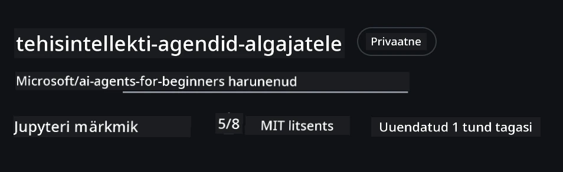
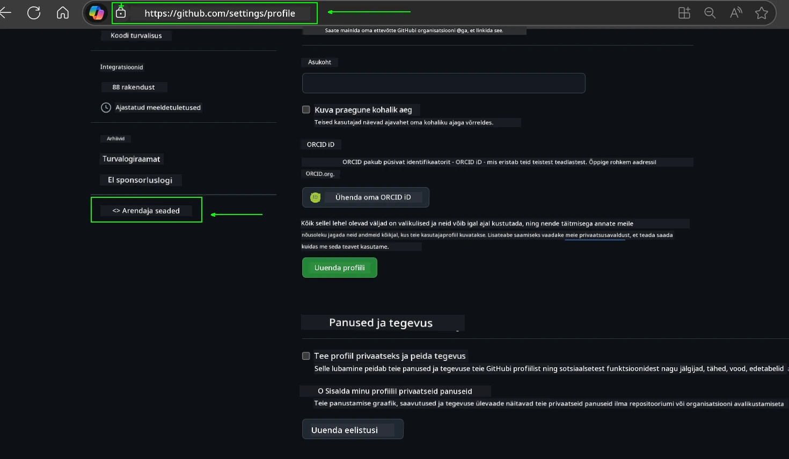
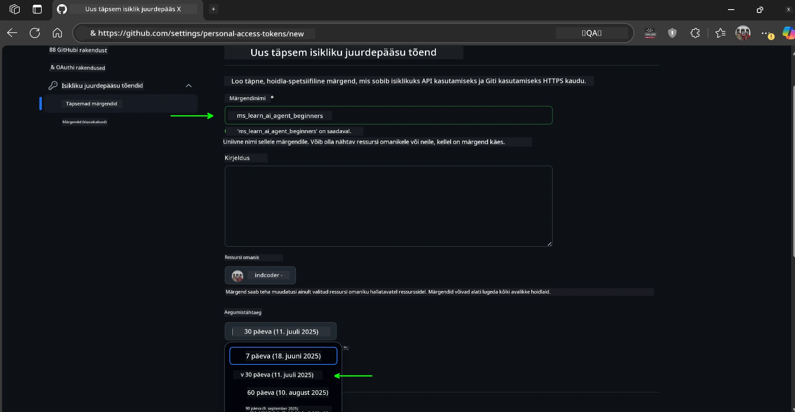
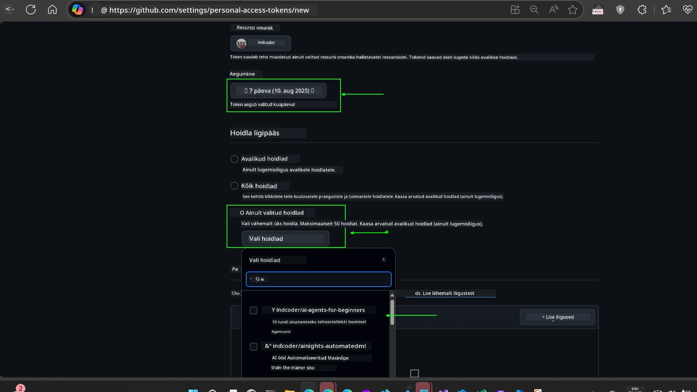
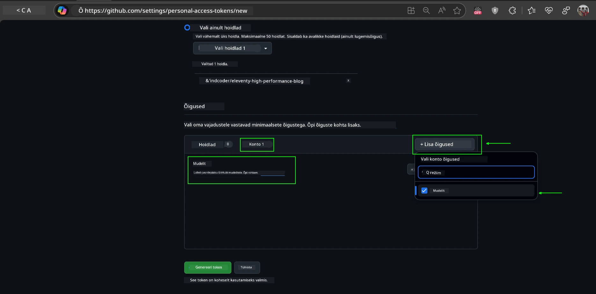
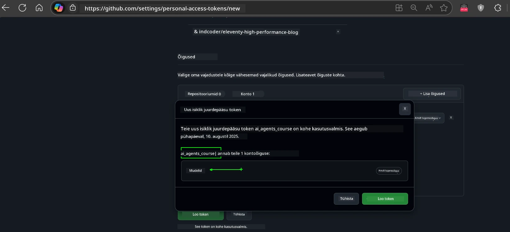
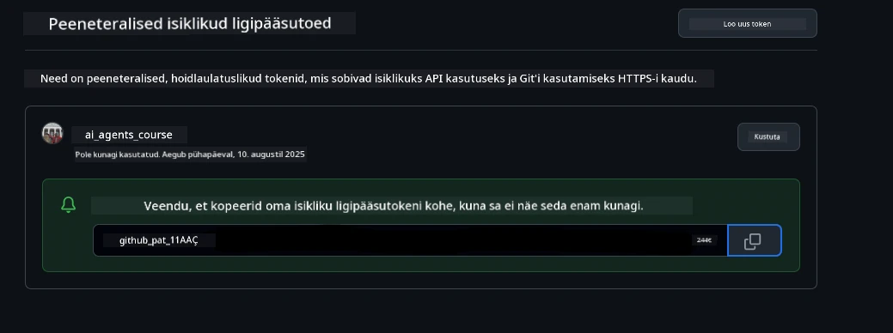
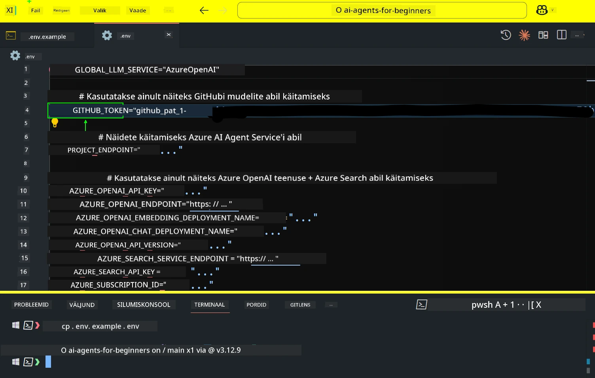
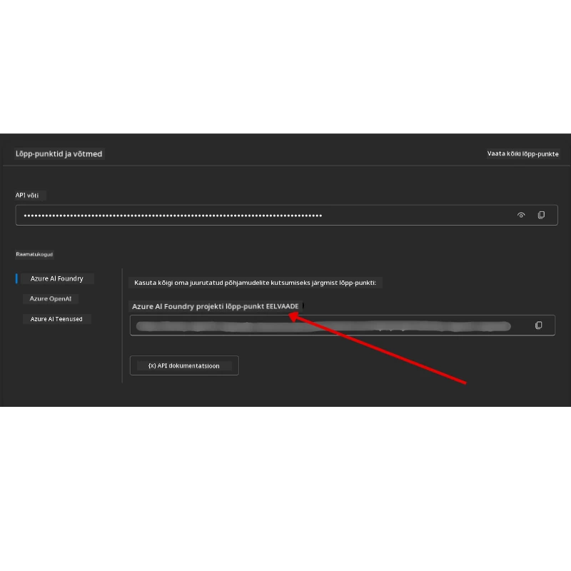

<!--
CO_OP_TRANSLATOR_METADATA:
{
  "original_hash": "63b1a8f6e840df15934935b728e569f0",
  "translation_date": "2025-12-03T15:17:10+00:00",
  "source_file": "00-course-setup/README.md",
  "language_code": "et"
}
-->
# Kursuse seadistamine

## Sissejuhatus

Selles õppetükis käsitletakse, kuidas käivitada selle kursuse koodinäiteid.

## Liitu teiste õppijatega ja saa abi

Enne kui hakkad oma repositooriumi kloonima, liitu [AI Agents For Beginners Discord kanaliga](https://aka.ms/ai-agents/discord), et saada abi seadistamisel, esitada küsimusi kursuse kohta või luua ühendust teiste õppijatega.

## Klooni või hargi see repositoorium

Alustamiseks klooni või hargi GitHubi repositoorium. See loob sinu enda versiooni kursuse materjalidest, et saaksid koodi käivitada, testida ja kohandada!

Seda saab teha, klõpsates lingil <a href="https://github.com/microsoft/ai-agents-for-beginners/fork" target="_blank">hargi repositoorium</a>.

Nüüd peaks sul olema selle kursuse enda hargitud versioon järgmisel lingil:



### Madal kloonimine (soovitatav töötubade / Codespaces jaoks)

  >Täielik repositoorium võib olla suur (~3 GB), kui alla laadida kogu ajalugu ja kõik failid. Kui osaled ainult töötoas või vajad ainult mõnda õppetüki kausta, väldib madal kloonimine (või osaline kloonimine) suurema osa sellest allalaadimisest, kärpides ajalugu ja/või vahele jättes failid.

#### Kiire madal kloonimine — minimaalne ajalugu, kõik failid

Asenda `<your-username>` allolevates käskudes oma hargi URL-iga (või algse URL-iga, kui eelistad).

Kloonimiseks ainult viimase commit'i ajalugu (väike allalaadimine):

```bash|powershell
git clone --depth 1 https://github.com/<your-username>/ai-agents-for-beginners.git
```

Kloonimiseks konkreetne haru:

```bash|powershell
git clone --depth 1 --branch <branch-name> https://github.com/<your-username>/ai-agents-for-beginners.git
```

#### Osaline (hõre) kloonimine — minimaalsed failid + ainult valitud kaustad

See kasutab osalist kloonimist ja hõredat väljaregistreerimist (vajab Git 2.25+ ja soovitatavalt kaasaegset Git'i osalise kloonimise toetusega):

```bash|powershell
git clone --depth 1 --filter=blob:none --sparse https://github.com/<your-username>/ai-agents-for-beginners.git
```

Liigu repositooriumi kausta:

```bash|powershell
cd ai-agents-for-beginners
```

Seejärel määra, milliseid kaustu soovid (näide allpool näitab kahte kausta):

```bash|powershell
git sparse-checkout set 00-course-setup 01-intro-to-ai-agents
```

Pärast kloonimist ja failide kontrollimist, kui vajad ainult faile ja soovid ruumi vabastada (ilma git'i ajaloota), kustuta repositooriumi metaandmed (💀 pöördumatu — kaotad kogu Git'i funktsionaalsuse: ei commite, pull'e, push'e ega ajaloole ligipääsu).

```bash
# zsh/bash
rm -rf .git
```

```powershell
# PowerShell
Remove-Item -Recurse -Force .git
```

#### GitHub Codespaces'i kasutamine (soovitatav vältimaks suuri kohalikke allalaadimisi)

- Loo uus Codespace selle repositooriumi jaoks [GitHubi kasutajaliidese kaudu](https://github.com/codespaces).  

- Uue Codespace'i terminalis käivita üks ülaltoodud madala/hõreda kloonimise käskudest, et tuua ainult vajalikud õppetüki kaustad Codespace'i tööruumi.
- Valikuline: pärast kloonimist Codespaces'is eemalda .git, et vabastada lisaruumi (vaata ülaltoodud eemaldamiskäske).
- Märkus: Kui eelistad avada repositooriumi otse Codespaces'is (ilma lisakloonimiseta), ole teadlik, et Codespaces konstrueerib devcontainer'i keskkonna ja võib siiski ette valmistada rohkem, kui vajad. Madala koopia kloonimine värskes Codespaces'is annab sulle rohkem kontrolli kettaruumi kasutamise üle.

#### Näpunäited

- Asenda kloonimise URL alati oma hargiga, kui soovid redigeerida/commite teha.
- Kui hiljem vajad rohkem ajalugu või faile, saad need fetch'ida või kohandada hõredat väljaregistreerimist, et lisada täiendavaid kaustu.

## Koodi käivitamine

See kursus pakub Jupyter Notebook'e, mida saad käivitada, et saada praktilist kogemust AI agentide loomisel.

Koodinäited kasutavad kas:

**Vajab GitHubi kontot - Tasuta**:

1) Semantic Kernel Agent Framework + GitHub Models Marketplace. Märgistatud kui (semantic-kernel.ipynb)
2) AutoGen Framework + GitHub Models Marketplace. Märgistatud kui (autogen.ipynb)

**Vajab Azure'i tellimust**:

3) Azure AI Foundry + Azure AI Agent Service. Märgistatud kui (azureaiagent.ipynb)

Soovitame proovida kõiki kolme tüüpi näiteid, et näha, milline neist sulle kõige paremini sobib.

Sõltuvalt valitud variandist määratakse, milliseid seadistamise samme tuleb järgida allpool:

## Nõuded

- Python 3.12+
  - **NOTE**: Kui sul pole Python3.12 paigaldatud, veendu, et paigaldad selle. Seejärel loo oma venv, kasutades python3.12, et tagada õige versioonide paigaldamine requirements.txt failist.
  
    >Näide

    Loo Python venv kataloog:

    ```bash|powershell
    python -m venv venv
    ```

    Seejärel aktiveeri venv keskkond:

    ```bash
    # zsh/bash
    source venv/bin/activate
    ```
  
    ```dos
    # Command Prompt for Windows
    venv\Scripts\activate
    ```

- .NET 10+: Näidiskoodide jaoks, mis kasutavad .NET'i, veendu, et paigaldad [.NET 10 SDK](https://dotnet.microsoft.com/download/dotnet/10.0) või uuema. Seejärel kontrolli paigaldatud .NET SDK versiooni:

    ```bash|powershell
    dotnet --list-sdks
    ```

- GitHubi konto - Juurdepääsuks GitHub Models Marketplace'ile
- Azure'i tellimus - Juurdepääsuks Azure AI Foundry'le
- Azure AI Foundry konto - Juurdepääsuks Azure AI Agent Service'ile

Oleme lisanud `requirements.txt` faili selle repositooriumi juurkausta, mis sisaldab kõiki vajalikke Python'i pakette koodinäidete käivitamiseks.

Saad need paigaldada, käivitades järgmise käsu terminalis repositooriumi juurkaustas:

```bash|powershell
pip install -r requirements.txt
```

Soovitame luua Python'i virtuaalse keskkonna, et vältida konflikte ja probleeme.

## VSCode'i seadistamine

Veendu, et kasutad VSCode'is õiget Python'i versiooni.


## Näidiste seadistamine, mis kasutavad GitHub Models'i

### Samm 1: Hangi oma GitHubi isiklik juurdepääsutoken (PAT)

See kursus kasutab GitHub Models Marketplace'i, mis pakub tasuta juurdepääsu suurtele keelemudelitele (LLM), mida kasutad AI agentide loomiseks.

GitHub Models'i kasutamiseks pead looma [GitHubi isikliku juurdepääsutokeni](https://docs.github.com/en/authentication/keeping-your-account-and-data-secure/managing-your-personal-access-tokens).

Seda saab teha, minnes oma <a href="https://github.com/settings/personal-access-tokens" target="_blank">isikliku juurdepääsutokeni seadete</a> lehele oma GitHubi kontol.

Palun järgi [väikseima privileegi põhimõtet](https://docs.github.com/en/get-started/learning-to-code/storing-your-secrets-safely) tokeni loomisel. See tähendab, et peaksid andma tokenile ainult need õigused, mis on vajalikud selle kursuse koodinäidete käivitamiseks.

1. Vali ekraani vasakul küljel **Developer settings** alt `Fine-grained tokens` valik.

   

   Seejärel vali `Generate new token`.

   

2. Sisesta tokenile kirjeldav nimi, mis kajastab selle eesmärki, et seda hiljem lihtne tuvastada oleks.

    🔐 Tokeni kestuse soovitus

    Soovitatav kestus: 30 päeva  
    Turvalisuse suurendamiseks võid valida lühema perioodi—näiteks 7 päeva 🛡️  
    See on suurepärane viis seada isiklik eesmärk ja lõpetada kursus, kui õpimoment on kõrge 🚀.

    

3. Piira tokeni ulatus oma hargitud repositooriumiga.

    

4. Piira tokeni õigused: **Permissions** all klõpsa **Account** vahekaarti ja vajuta "+ Add permissions" nuppu. Ilmub rippmenüü. Otsi **Models** ja märgi selle kast.

    

5. Kontrolli enne tokeni loomist vajalikke õigusi. 

6. Enne tokeni loomist veendu, et oled valmis tokeni turvalises kohas, näiteks paroolihalduri seifis, salvestama, kuna seda ei kuvata uuesti pärast loomist. 

Kopeeri oma äsja loodud token. Nüüd lisad selle oma `.env` faili, mis on selle kursuse osaks.

### Samm 2: Loo oma `.env` fail

`.env` faili loomiseks käivita järgmine käsk terminalis.

```bash
# zsh/bash
cp .env.example .env
```

```powershell
# PowerShell
Copy-Item .env.example .env
```

See kopeerib näidisfaili ja loob `.env` faili sinu kataloogi, kuhu täidad keskkonnamuutujate väärtused.

Kopeeritud tokeniga ava `.env` fail oma lemmikteksti redaktoris ja kleebi token `GITHUB_TOKEN` väljale.



Nüüd peaksid saama käivitada selle kursuse koodinäiteid.

## Näidiste seadistamine, mis kasutavad Azure AI Foundry't ja Azure AI Agent Service'it

### Samm 1: Hangi oma Azure'i projekti lõpp-punkt

Järgi samme, kuidas luua hub'i ja projekti Azure AI Foundry's siin: [Hub resources overview](https://learn.microsoft.com/azure/ai-foundry/concepts/ai-resources)

Kui oled oma projekti loonud, pead hankima oma projekti ühenduse stringi.

Seda saab teha, minnes **Overview** lehele oma projektis Azure AI Foundry portaalis.



### Samm 2: Loo oma `.env` fail

`.env` faili loomiseks käivita järgmine käsk terminalis.

```bash
# zsh/bash
cp .env.example .env
```

```powershell
# PowerShell
Copy-Item .env.example .env
```

See kopeerib näidisfaili ja loob `.env` faili sinu kataloogi, kuhu täidad keskkonnamuutujate väärtused.

Kopeeritud tokeniga ava `.env` fail oma lemmikteksti redaktoris ja kleebi token `PROJECT_ENDPOINT` väljale.

### Samm 3: Logi sisse Azure'i

Turvalisuse parima tava järgi kasutame [võtmeta autentimist](https://learn.microsoft.com/azure/developer/ai/keyless-connections?tabs=csharp%2Cazure-cli?WT.mc_id=academic-105485-koreyst), et autentida Azure OpenAI'sse Microsoft Entra ID abil.

Järgmisena ava terminal ja käivita `az login --use-device-code`, et logida sisse oma Azure'i kontole.

Kui oled sisse loginud, vali terminalis oma tellimus.

## Täiendavad keskkonnamuutujad - Azure Search ja Azure OpenAI

Agentic RAG õppetüki - Õppetükk 5 - jaoks on näited, mis kasutavad Azure Search'i ja Azure OpenAI'd.

Kui soovid neid näiteid käivitada, pead lisama järgmised keskkonnamuutujad oma `.env` faili:

### Ülevaate leht (Projekt)

- `AZURE_SUBSCRIPTION_ID` - Kontrolli **Project details** **Overview** lehel oma projektis.

- `AZURE_AI_PROJECT_NAME` - Vaata oma projekti **Overview** lehe ülaosas.

- `AZURE_OPENAI_SERVICE` - Leia see **Included capabilities** vahekaardilt **Azure OpenAI Service** **Overview** lehel.

### Halduse keskus

- `AZURE_OPENAI_RESOURCE_GROUP` - Mine **Project properties** **Overview** lehel **Management Center**.

- `GLOBAL_LLM_SERVICE` - **Connected resources** all leia **Azure AI Services** ühenduse nimi. Kui pole loetletud, kontrolli **Azure portal** oma ressursigrupis AI Services ressursi nime.

### Mudelid + lõpp-punktid leht

- `AZURE_OPENAI_EMBEDDING_DEPLOYMENT_NAME` - Vali oma embedding mudel (nt `text-embedding-ada-002`) ja pane tähele **Deployment name** mudeli detailidest.

- `AZURE_OPENAI_CHAT_DEPLOYMENT_NAME` - Vali oma chat mudel (nt `gpt-4o-mini`) ja pane tähele **Deployment name** mudeli detailidest.

### Azure portaal

- `AZURE_OPENAI_ENDPOINT` - Otsi **Azure AI services**, klõpsa sellel, mine **Resource Management**, **Keys and Endpoint**, kerige alla "Azure OpenAI endpoints" ja kopeeri see, mis ütleb "Language APIs".

- `AZURE_OPENAI_API_KEY` - Samalt ekraanilt kopeeri KEY 1 või KEY 2.

- `AZURE_SEARCH_SERVICE_ENDPOINT` - Leia oma **Azure AI Search** ressurss, klõpsa sellel ja vaata **Overview**.

- `AZURE_SEARCH_API_KEY` - Seejärel mine **Settings** ja **Keys**, et kopeerida esmane või sekundaarne admini võti.

### Väline veebileht

- `AZURE_OPENAI_API_VERSION` - Külastage [API versiooni elutsükli](https://learn.microsoft.com/azure/ai-services/openai/api-version-deprecation#latest-ga-api-release) lehte **Latest GA API release** all.

### Võtmeta autentimise seadistamine

Selle asemel, et oma mandaate kõvakodeerida, kasutame võtmeta ühendust Azure OpenAI'ga. Selleks impordime `DefaultAzureCredential` ja hiljem kutsume `DefaultAzureCredential` funktsiooni, et saada mandaadi.

```python
# Python
from azure.identity import DefaultAzureCredential, InteractiveBrowserCredential
```

## Jäid kuskile toppama?
Kui sul tekib selle seadistuse käivitamisel probleeme, liitu meiega <a href="https://discord.gg/kzRShWzttr" target="_blank">Azure AI kogukonna Discordis</a> või <a href="https://github.com/microsoft/ai-agents-for-beginners/issues?WT.mc_id=academic-105485-koreyst" target="_blank">loo probleem</a>.

## Järgmine õppetund

Sa oled nüüd valmis selle kursuse koodi käivitama. Head õppimist AI agentide maailma kohta!

[Sissejuhatus AI agentidesse ja agentide kasutusjuhtumid](../01-intro-to-ai-agents/README.md)

---

<!-- CO-OP TRANSLATOR DISCLAIMER START -->
**Lahtiütlus**:  
See dokument on tõlgitud AI tõlketeenuse [Co-op Translator](https://github.com/Azure/co-op-translator) abil. Kuigi püüame tagada täpsust, palun arvestage, et automaatsed tõlked võivad sisaldada vigu või ebatäpsusi. Algne dokument selle algkeeles tuleks lugeda autoriteetseks allikaks. Olulise teabe puhul on soovitatav kasutada professionaalset inimtõlget. Me ei vastuta selle tõlke kasutamisest tulenevate arusaamatuste või valede tõlgenduste eest.
<!-- CO-OP TRANSLATOR DISCLAIMER END -->