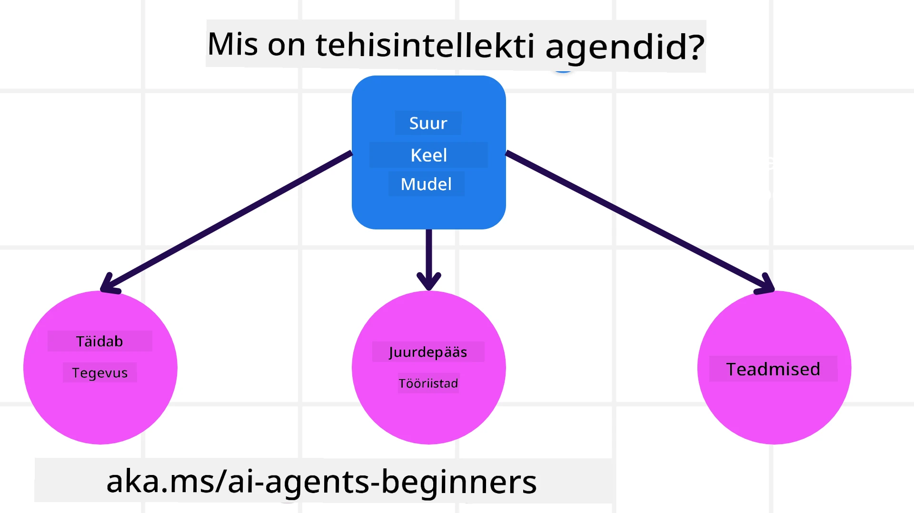
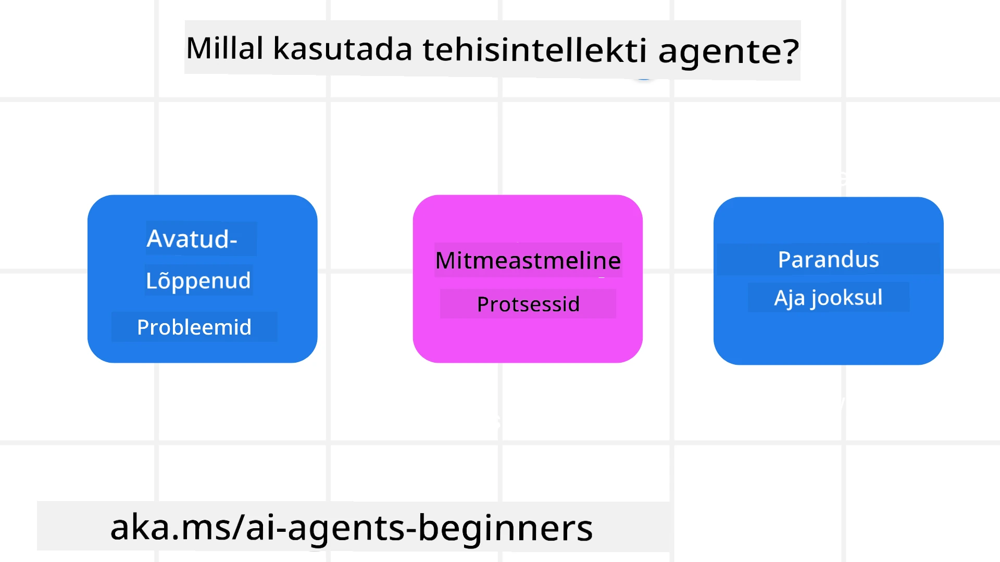

<!--
CO_OP_TRANSLATOR_METADATA:
{
  "original_hash": "cdd28bc00816d2773bb2b5968d782abc",
  "translation_date": "2025-11-11T11:51:18+00:00",
  "source_file": "01-intro-to-ai-agents/README.md",
  "language_code": "et"
}
-->

> _(Klõpsake ülaloleval pildil, et vaadata selle õppetunni videot)_

# Sissejuhatus tehisintellekti agentidesse ja nende kasutusjuhtumitesse

Tere tulemast kursusele "Tehisintellekti agendid algajatele"! See kursus pakub põhiteadmisi ja praktilisi näiteid tehisintellekti agentide loomiseks.

Liituge <a href="https://discord.gg/kzRShWzttr" target="_blank">Azure AI Discordi kogukonnaga</a>, et kohtuda teiste õppijate ja tehisintellekti agentide loojatega ning esitada küsimusi, mis teil selle kursuse kohta võivad tekkida.

Kursuse alustamiseks tutvume kõigepealt, mis on tehisintellekti agendid ja kuidas neid saab kasutada rakendustes ja töövoogudes, mida me loome.

## Sissejuhatus

Selles õppetunnis käsitletakse:

- Mis on tehisintellekti agendid ja millised on erinevad agentide tüübid?
- Millised kasutusjuhtumid sobivad kõige paremini tehisintellekti agentidele ja kuidas nad meid aidata saavad?
- Millised on mõned põhilised ehitusplokid agentlike lahenduste kujundamisel?

## Õppeesmärgid
Pärast selle õppetunni läbimist peaksite olema võimeline:

- Mõistma tehisintellekti agentide kontseptsioone ja kuidas need erinevad teistest tehisintellekti lahendustest.
- Rakendama tehisintellekti agente kõige tõhusamalt.
- Kujundama agentlikke lahendusi produktiivselt nii kasutajatele kui klientidele.

## Tehisintellekti agentide määratlemine ja tüübid

### Mis on tehisintellekti agendid?

Tehisintellekti agendid on **süsteemid**, mis võimaldavad **suurtel keelemudelitel (LLM)** **teostada tegevusi**, laiendades nende võimekust, andes LLM-idele **juurdepääsu tööriistadele** ja **teadmistele**.

Lahkame seda määratlust väiksemateks osadeks:

- **Süsteem** - Oluline on mõelda agentidest mitte kui üksikust komponendist, vaid kui paljude komponentide süsteemist. Tehisintellekti agendi põhikomponendid on:
  - **Keskkond** - Määratletud ruum, kus tehisintellekti agent tegutseb. Näiteks, kui meil oleks reisibroneerimise tehisintellekti agent, võiks keskkond olla reisibroneerimise süsteem, mida agent kasutab ülesannete täitmiseks.
  - **Sensorid** - Keskkonnad sisaldavad teavet ja annavad tagasisidet. Tehisintellekti agendid kasutavad sensoreid, et koguda ja tõlgendada teavet keskkonna praeguse seisundi kohta. Reisibroneerimise agendi näites võib reisibroneerimise süsteem anda teavet, nagu hotellide saadavus või lennupiletite hinnad.
  - **Aktuaatorid** - Kui tehisintellekti agent saab keskkonna praeguse seisundi, määrab agent praeguse ülesande jaoks, millist tegevust keskkonna muutmiseks teha. Reisibroneerimise agendi puhul võib see olla kasutajale saadaval oleva toa broneerimine.

**Suured keelemudelid** - Agentide kontseptsioon eksisteeris enne LLM-ide loomist. Tehisintellekti agentide loomise eelis LLM-idega on nende võime tõlgendada inimkeelt ja andmeid. See võime võimaldab LLM-idel tõlgendada keskkonnainfot ja määratleda plaani keskkonna muutmiseks.

**Tegevuste teostamine** - Väljaspool tehisintellekti agentide süsteeme on LLM-id piiratud olukordades, kus tegevus seisneb sisu või teabe genereerimises kasutaja päringu põhjal. Tehisintellekti agentide süsteemides suudavad LLM-id täita ülesandeid, tõlgendades kasutaja päringut ja kasutades keskkonnas saadaolevaid tööriistu.

**Juurdepääs tööriistadele** - Millistele tööriistadele LLM-il on juurdepääs, määratakse 1) keskkonna järgi, kus see tegutseb, ja 2) tehisintellekti agendi arendaja poolt. Meie reisibroneerimise agendi näites on agendi tööriistad piiratud broneerimissüsteemis saadaolevate toimingutega ja/või arendaja võib piirata agendi tööriistade juurdepääsu ainult lendudele.

**Mälu+Teadmised** - Mälu võib olla lühiajaline vestluse kontekstis kasutaja ja agendi vahel. Pikaajaliselt, väljaspool keskkonna pakutavat teavet, saavad tehisintellekti agendid hankida teadmisi teistest süsteemidest, teenustest, tööriistadest ja isegi teistelt agentidelt. Reisibroneerimise näites võivad need teadmised olla teave kasutaja reisieelistuste kohta, mis asuvad kliendibaasis.

### Erinevad agentide tüübid

Nüüd, kui meil on üldine määratlus tehisintellekti agentidest, vaatame mõningaid konkreetseid agentide tüüpe ja kuidas neid rakendataks reisibroneerimise tehisintellekti agendis.

| **Agendi tüüp**               | **Kirjeldus**                                                                                                                        | **Näide**                                                                                                                                                                                                                   |
| ----------------------------- | ------------------------------------------------------------------------------------------------------------------------------------- | ----------------------------------------------------------------------------------------------------------------------------------------------------------------------------------------------------------------------------- |
| **Lihtsad refleksagendid**    | Teostavad koheseid tegevusi eelmääratletud reeglite alusel.                                                                            | Reisibroneerimise agent tõlgendab e-kirja konteksti ja edastab reisikaebused klienditeenindusele.                                                                                                                          |
| **Mudelpõhised refleksagendid** | Teostavad tegevusi maailma mudeli ja selle mudeli muutuste alusel.                                                                    | Reisibroneerimise agent prioritiseerib marsruute, kus on märkimisväärsed hinnamuutused, tuginedes juurdepääsule ajaloolistele hinnandmetele.                                                                                                             |
| **Eesmärgipõhised agendid**   | Loovad plaanid konkreetsete eesmärkide saavutamiseks, tõlgendades eesmärki ja määrates tegevused selle saavutamiseks.                   | Reisibroneerimise agent broneerib reisi, määrates vajalikud reisikorraldused (auto, ühistransport, lennud) praegusest asukohast sihtkohta.                                                                                |
| **Kasupõhised agendid**       | Arvestavad eelistusi ja kaaluvad kompromisse numbriliselt, et määrata, kuidas eesmärke saavutada.                                      | Reisibroneerimise agent maksimeerib kasu, kaaludes mugavust vs. kulusid reisibroneerimisel.                                                                                                                                          |
| **Õppivad agendid**           | Parandavad end aja jooksul, reageerides tagasisidele ja kohandades vastavalt tegevusi.                                                 | Reisibroneerimise agent paraneb, kasutades klientide tagasisidet pärast reisi, et teha tulevaste broneeringute osas kohandusi.                                                                                                               |
| **Hierarhilised agendid**     | Koosnevad mitmest agendist kihilises süsteemis, kus kõrgema taseme agendid jagavad ülesandeid alamagentidele täitmiseks.               | Reisibroneerimise agent tühistab reisi, jagades ülesande alamülesanneteks (näiteks konkreetsete broneeringute tühistamine) ja lastes alamagentidel need täita, andes aru kõrgema taseme agendile.                                     |
| **Multi-Agent Systems (MAS)** | Agendid täidavad ülesandeid iseseisvalt, kas koostöös või konkurentsis.                                                                | Koostöö: Mitu agenti broneerivad konkreetseid reisiteenuseid, nagu hotellid, lennud ja meelelahutus. Konkurents: Mitu agenti haldavad ja konkureerivad jagatud hotellibroneeringu kalendris, et kliente hotelli broneerida. |

## Millal kasutada tehisintellekti agente

Eelmises osas kasutasime reisibroneerimise kasutusjuhtumit, et selgitada, kuidas erinevaid agentide tüüpe saab kasutada erinevates reisibroneerimise stsenaariumides. Jätkame selle rakenduse kasutamist kogu kursuse vältel.

Vaatame, millised kasutusjuhtumid sobivad tehisintellekti agentidele kõige paremini:

- **Avatud probleemid** - võimaldades LLM-il määrata vajalikud sammud ülesande täitmiseks, kuna neid ei saa alati töövoogu kõvasti kodeerida.
- **Mitmeastmelised protsessid** - ülesanded, mis nõuavad teatud keerukuse taset, kus tehisintellekti agent peab kasutama tööriistu või teavet mitme pöörde jooksul, mitte ainult ühe päringu korral.  
- **Paranemine aja jooksul** - ülesanded, kus agent saab aja jooksul paraneda, saades tagasisidet kas oma keskkonnast või kasutajatelt, et pakkuda paremat kasu.

Käsitleme tehisintellekti agentide kasutamise kaalutlusi põhjalikumalt usaldusväärsete tehisintellekti agentide loomise õppetunnis.

## Agentlike lahenduste alused

### Agendi arendamine

Esimene samm tehisintellekti agendi süsteemi kujundamisel on tööriistade, tegevuste ja käitumiste määratlemine. Selles kursuses keskendume **Azure AI Agent Service** kasutamisele oma agentide määratlemiseks. See pakub selliseid funktsioone nagu:

- Avatud mudelite valik, nagu OpenAI, Mistral ja Llama
- Litsentsitud andmete kasutamine selliste pakkujate kaudu nagu Tripadvisor
- Standardiseeritud OpenAPI 3.0 tööriistade kasutamine

### Agentlikud mustrid

Suhtlus LLM-idega toimub päringute kaudu. Arvestades tehisintellekti agentide poolautonoomset olemust, ei ole alati võimalik või vajalik LLM-i käsitsi uuesti päringuga suunata pärast keskkonna muutust. Kasutame **agentlikke mustreid**, mis võimaldavad meil LLM-i päringutega suunata mitme sammu jooksul skaleeritavamal viisil.

See kursus on jaotatud mõningate praegu populaarsete agentlike mustrite järgi.

### Agentlikud raamistikud

Agentlikud raamistikud võimaldavad arendajatel agentlikke mustreid koodis rakendada. Need raamistikud pakuvad malle, pluginaid ja tööriistu paremaks tehisintellekti agentide koostööks. Need eelised pakuvad paremaid võimalusi tehisintellekti agentide süsteemide jälgimiseks ja tõrkeotsinguks.

Selles kursuses uurime teaduspõhist AutoGen raamistikku ja tootmisvalmis Agent raamistikku Semantic Kernelist.

## Näidiskoodid

- Python: [Agent Framework](./code_samples/01-python-agent-framework.ipynb)
- .NET: [Agent Framework](./code_samples/01-dotnet-agent-framework.md)

## Kas teil on rohkem küsimusi tehisintellekti agentide kohta?

Liituge [Azure AI Foundry Discordiga](https://aka.ms/ai-agents/discord), et kohtuda teiste õppijatega, osaleda kontoritundides ja saada vastuseid oma tehisintellekti agentide küsimustele.

## Eelmine õppetund

[Kursuse seadistamine](../00-course-setup/README.md)

## Järgmine õppetund

[Agentlike raamistikute uurimine](../02-explore-agentic-frameworks/README.md)

---

<!-- CO-OP TRANSLATOR DISCLAIMER START -->
**Lahtiütlus**:  
See dokument on tõlgitud AI tõlketeenuse [Co-op Translator](https://github.com/Azure/co-op-translator) abil. Kuigi püüame tagada täpsust, palume arvestada, et automaatsed tõlked võivad sisaldada vigu või ebatäpsusi. Algne dokument selle algses keeles tuleks pidada autoriteetseks allikaks. Olulise teabe puhul soovitame kasutada professionaalset inimtõlget. Me ei vastuta selle tõlke kasutamisest tulenevate arusaamatuste või valesti tõlgenduste eest.
<!-- CO-OP TRANSLATOR DISCLAIMER END -->