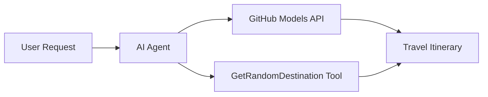

<!--
CO_OP_TRANSLATOR_METADATA:
{
  "original_hash": "5f351412e934f0833c8c821a0a60efaf",
  "translation_date": "2025-11-13T14:56:11+00:00",
  "source_file": "01-intro-to-ai-agents/code_samples/01-dotnet-agent-framework.md",
  "language_code": "et"
}
-->
# 🌍 AI Reisibüroo Microsoft Agent Frameworkiga (.NET)

## 📋 Stsenaariumi Ülevaade

See näide näitab, kuidas luua intelligentne reisiplaane koostav agent, kasutades Microsoft Agent Frameworki .NET jaoks. Agent suudab automaatselt genereerida isikupärastatud päevaplaanid juhuslikele sihtkohtadele üle maailma.

### Peamised Võimalused:

- 🎲 **Juhuslik Sihtkoha Valik**: Kasutab kohandatud tööriista puhkusekohtade valimiseks
- 🗺️ **Tark Reisiplaanide Koostamine**: Loob üksikasjalikud päevaplaanid
- 🔄 **Reaalajas Voogedastus**: Toetab nii koheseid kui ka voogedastusega vastuseid
- 🛠️ **Kohandatud Tööriistade Integreerimine**: Näitab, kuidas laiendada agendi võimalusi

## 🔧 Tehniline Arhitektuur

### Põhitehnoloogiad

- **Microsoft Agent Framework**: Viimane .NET-i teostus AI agentide arendamiseks
- **GitHub Models Integratsioon**: Kasutab GitHubi AI mudelite järeldusteenust
- **OpenAI API Ühilduvus**: Kasutab OpenAI klienditeeke koos kohandatud lõpp-punktidega
- **Turvaline Konfiguratsioon**: API võtmete haldamine keskkonnapõhiselt

### Peamised Komponendid

1. **AIAgent**: Peamine agent, mis haldab vestluse kulgu
2. **Kohandatud Tööriistad**: `GetRandomDestination()` funktsioon, mis on agendile kättesaadav
3. **Vestlusklient**: GitHub Models-põhine vestlusliides
4. **Voogedastuse Tugi**: Reaalajas vastuste genereerimise võimalused

### Integreerimismuster



## 🚀 Alustamine

### Eeltingimused

- [.NET 10 SDK](https://dotnet.microsoft.com/download/dotnet/10.0) või uuem
- [GitHub Models API juurdepääsuvõti](https://docs.github.com/github-models/github-models-at-scale/using-your-own-api-keys-in-github-models)

### Vajalikud Keskkonnamuutujad

```bash
# zsh/bash
export GH_TOKEN=<your_github_token>
export GH_ENDPOINT=https://models.github.ai/inference
export GH_MODEL_ID=openai/gpt-5-mini
```

```powershell
# PowerShell
$env:GH_TOKEN = "<your_github_token>"
$env:GH_ENDPOINT = "https://models.github.ai/inference"
$env:GH_MODEL_ID = "openai/gpt-5-mini"
```

### Näidiskood

Näite käivitamiseks,

```bash
# zsh/bash
chmod +x ./01-dotnet-agent-framework.cs
./01-dotnet-agent-framework.cs
```

Või kasutades dotnet CLI-d:

```bash
dotnet run ./01-dotnet-agent-framework.cs
```

Vaata täielikku koodi failist [`01-dotnet-agent-framework.cs`](../../../../01-intro-to-ai-agents/code_samples/01-dotnet-agent-framework.cs).

```csharp
#!/usr/bin/dotnet run

#:package Microsoft.Extensions.AI@9.*
#:package Microsoft.Agents.AI.OpenAI@1.*-*

using System.ClientModel;
using System.ComponentModel;

using Microsoft.Agents.AI;
using Microsoft.Extensions.AI;

using OpenAI;

// Tool Function: Random Destination Generator
// This static method will be available to the agent as a callable tool
// The [Description] attribute helps the AI understand when to use this function
// This demonstrates how to create custom tools for AI agents
[Description("Provides a random vacation destination.")]
static string GetRandomDestination()
{
    // List of popular vacation destinations around the world
    // The agent will randomly select from these options
    var destinations = new List<string>
    {
        "Paris, France",
        "Tokyo, Japan",
        "New York City, USA",
        "Sydney, Australia",
        "Rome, Italy",
        "Barcelona, Spain",
        "Cape Town, South Africa",
        "Rio de Janeiro, Brazil",
        "Bangkok, Thailand",
        "Vancouver, Canada"
    };

    // Generate random index and return selected destination
    // Uses System.Random for simple random selection
    var random = new Random();
    int index = random.Next(destinations.Count);
    return destinations[index];
}

// Extract configuration from environment variables
// Retrieve the GitHub Models API endpoint, defaults to https://models.github.ai/inference if not specified
// Retrieve the model ID, defaults to openai/gpt-5-mini if not specified
// Retrieve the GitHub token for authentication, throws exception if not specified
var github_endpoint = Environment.GetEnvironmentVariable("GH_ENDPOINT") ?? "https://models.github.ai/inference";
var github_model_id = Environment.GetEnvironmentVariable("GH_MODEL_ID") ?? "openai/gpt-5-mini";
var github_token = Environment.GetEnvironmentVariable("GH_TOKEN") ?? throw new InvalidOperationException("GH_TOKEN is not set.");

// Configure OpenAI Client Options
// Create configuration options to point to GitHub Models endpoint
// This redirects OpenAI client calls to GitHub's model inference service
var openAIOptions = new OpenAIClientOptions()
{
    Endpoint = new Uri(github_endpoint)
};

// Initialize OpenAI Client with GitHub Models Configuration
// Create OpenAI client using GitHub token for authentication
// Configure it to use GitHub Models endpoint instead of OpenAI directly
var openAIClient = new OpenAIClient(new ApiKeyCredential(github_token), openAIOptions);

// Create AI Agent with Travel Planning Capabilities
// Initialize OpenAI client, get chat client for specified model, and create AI agent
// Configure agent with travel planning instructions and random destination tool
// The agent can now plan trips using the GetRandomDestination function
AIAgent agent = openAIClient
    .GetChatClient(github_model_id)
    .CreateAIAgent(
        instructions: "You are a helpful AI Agent that can help plan vacations for customers at random destinations",
        tools: [AIFunctionFactory.Create(GetRandomDestination)]
    );

// Execute Agent: Plan a Day Trip
// Run the agent with streaming enabled for real-time response display
// Shows the agent's thinking and response as it generates the content
// Provides better user experience with immediate feedback
await foreach (var update in agent.RunStreamingAsync("Plan me a day trip"))
{
    await Task.Delay(10);
    Console.Write(update);
}
```

## 🎓 Olulised Õppetunnid

1. **Agendi Arhitektuur**: Microsoft Agent Framework pakub puhta ja tüübiturvalise lähenemise AI agentide loomiseks .NET-is
2. **Tööriistade Integreerimine**: `[Description]` atribuudiga tähistatud funktsioonid muutuvad agendile kättesaadavateks tööriistadeks
3. **Konfiguratsiooni Halduse Parimad Tavad**: Keskkonnamuutujad ja turvaline mandaadihaldus järgivad .NET-i parimaid tavasid
4. **OpenAI Ühilduvus**: GitHub Models integratsioon töötab sujuvalt OpenAI-ühilduvate API-de kaudu

## 🔗 Lisamaterjalid

- [Microsoft Agent Framework Dokumentatsioon](https://learn.microsoft.com/agent-framework)
- [GitHub Models Marketplace](https://github.com/marketplace?type=models)
- [Microsoft.Extensions.AI](https://learn.microsoft.com/dotnet/ai/microsoft-extensions-ai)
- [.NET Ühefaililised Rakendused](https://devblogs.microsoft.com/dotnet/announcing-dotnet-run-app)

---

<!-- CO-OP TRANSLATOR DISCLAIMER START -->
**Lahtiütlus**:  
See dokument on tõlgitud AI tõlketeenuse [Co-op Translator](https://github.com/Azure/co-op-translator) abil. Kuigi püüame tagada täpsust, palume arvestada, et automaatsed tõlked võivad sisaldada vigu või ebatäpsusi. Algne dokument selle algses keeles tuleks pidada autoriteetseks allikaks. Olulise teabe puhul soovitame kasutada professionaalset inimtõlget. Me ei vastuta selle tõlke kasutamisest tulenevate arusaamatuste või valesti tõlgenduste eest.
<!-- CO-OP TRANSLATOR DISCLAIMER END -->