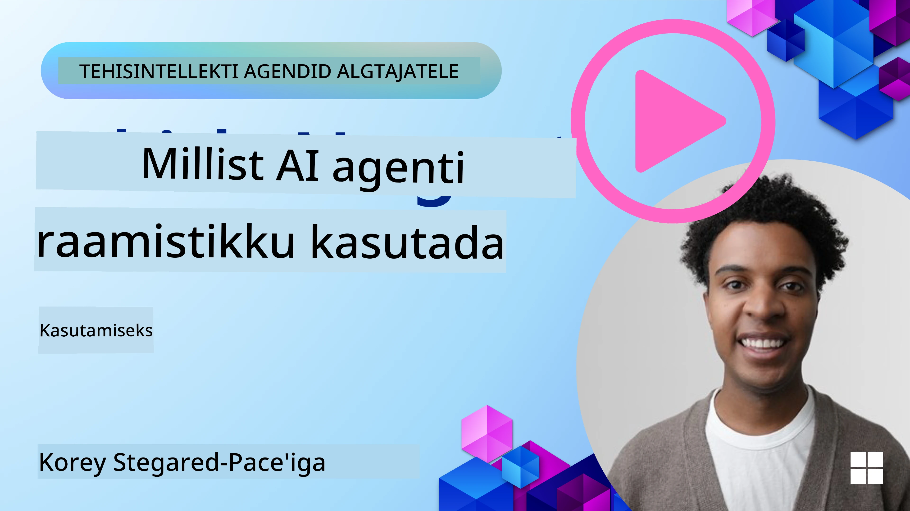

<!--
CO_OP_TRANSLATOR_METADATA:
{
  "original_hash": "7120197753abacc827b64ac2d5d6966f",
  "translation_date": "2025-11-13T14:56:29+00:00",
  "source_file": "02-explore-agentic-frameworks/README.md",
  "language_code": "et"
}
-->
[](https://youtu.be/ODwF-EZo_O8?si=1xoy_B9RNQfrYdF7)

> _(Klõpsake ülaloleval pildil, et vaadata selle õppetunni videot)_

# AI Agent Frameworkide uurimine

AI agent frameworkid on tarkvaraplatvormid, mis on loodud AI agentide loomise, juurutamise ja haldamise lihtsustamiseks. Need raamistikud pakuvad arendajatele eelvalmistatud komponente, abstraktsioone ja tööriistu, mis lihtsustavad keerukate AI süsteemide arendamist.

Need raamistikud aitavad arendajatel keskenduda oma rakenduste unikaalsetele aspektidele, pakkudes standardiseeritud lähenemisviise AI agentide arendamise ühistele väljakutsetele. Need suurendavad AI süsteemide skaleeritavust, juurdepääsetavust ja efektiivsust.

## Sissejuhatus

Selles õppetunnis käsitletakse:

- Mis on AI agent frameworkid ja mida need võimaldavad arendajatel saavutada?
- Kuidas saavad meeskonnad neid kasutada, et kiiresti prototüüpida, iteratsioonida ja parandada oma agentide võimekust?
- Millised on Microsofti loodud frameworkide ja tööriistade, nagu <a href="https://aka.ms/ai-agents/autogen" target="_blank">AutoGen</a>, <a href="https://aka.ms/ai-agents-beginners/semantic-kernel" target="_blank">Semantic Kernel</a> ja <a href="https://aka.ms/ai-agents-beginners/ai-agent-service" target="_blank">Azure AI Agent Service</a>, erinevused?
- Kas ma saan integreerida oma olemasolevaid Azure'i ökosüsteemi tööriistu otse või on vaja eraldiseisvaid lahendusi?
- Mis on Azure AI Agents teenus ja kuidas see mind aitab?

## Õppeeesmärgid

Selle õppetunni eesmärk on aidata teil mõista:

- AI agent frameworkide rolli AI arenduses.
- Kuidas kasutada AI agent frameworke intelligentsete agentide loomiseks.
- AI agent frameworkide võimalusi.
- AutoGeni, Semantic Kernel'i ja Azure AI Agent Service'i erinevusi.

## Mis on AI agent frameworkid ja mida need võimaldavad arendajatel teha?

Traditsioonilised AI raamistikud aitavad teil integreerida AI-d oma rakendustesse ja muuta need rakendused paremaks järgmistel viisidel:

- **Personaliseerimine**: AI analüüsib kasutaja käitumist ja eelistusi, et pakkuda isikupärastatud soovitusi, sisu ja kogemusi.  
Näide: Voogedastusteenused nagu Netflix kasutavad AI-d, et soovitada filme ja saateid vaatamisajaloo põhjal, suurendades kasutajate kaasatust ja rahulolu.
- **Automatiseerimine ja efektiivsus**: AI saab automatiseerida korduvaid ülesandeid, lihtsustada töövooge ja parandada operatiivset efektiivsust.  
Näide: Klienditeenindusrakendused kasutavad AI-põhiseid vestlusroboteid, et lahendada tavapäraseid päringuid, vähendades vastamisaega ja vabastades inimagentide aega keerukamate probleemide jaoks.
- **Parendatud kasutajakogemus**: AI saab parandada üldist kasutajakogemust, pakkudes intelligentseid funktsioone nagu hääletuvastus, loomuliku keele töötlemine ja ennustav tekst.  
Näide: Virtuaalsed assistendid nagu Siri ja Google Assistant kasutavad AI-d, et mõista ja vastata häälkäsklustele, muutes kasutajatel oma seadmetega suhtlemise lihtsamaks.

### Kõik see kõlab suurepäraselt, eks? Miks me siis vajame AI agent frameworki?

AI agent frameworkid esindavad midagi enamat kui lihtsalt AI raamistikud. Need on loodud intelligentsete agentide loomiseks, mis suudavad suhelda kasutajate, teiste agentide ja keskkonnaga, et saavutada konkreetseid eesmärke. Need agendid võivad näidata autonoomset käitumist, teha otsuseid ja kohaneda muutuvate tingimustega. Vaatame mõningaid AI agent frameworkide võimalusi:

- **Agentide koostöö ja koordineerimine**: Võimaldab luua mitmeid AI agente, kes suudavad koos töötada, suhelda ja koordineerida, et lahendada keerulisi ülesandeid.
- **Ülesannete automatiseerimine ja haldamine**: Pakub mehhanisme mitmeastmeliste töövoogude automatiseerimiseks, ülesannete delegeerimiseks ja dünaamiliseks haldamiseks agentide vahel.
- **Konteksti mõistmine ja kohanemine**: Varustab agente võimega mõista konteksti, kohaneda muutuvate keskkondadega ja teha otsuseid reaalajas teabe põhjal.

Kokkuvõttes võimaldavad agendid teha rohkem, viia automatiseerimine järgmisele tasemele ja luua intelligentsemaid süsteeme, mis suudavad kohaneda ja õppida oma keskkonnast.

## Kuidas kiiresti prototüüpida, iteratsioonida ja parandada agentide võimekust?

See on kiiresti arenev valdkond, kuid enamikul AI agent frameworkidel on mõned ühised omadused, mis aitavad teil kiiresti prototüüpida ja iteratsioonida, nimelt moodulkomponendid, koostöövahendid ja reaalajas õppimine. Vaatame neid lähemalt:

- **Kasuta moodulkomponente**: AI SDK-d pakuvad eelvalmistatud komponente, nagu AI ja mäluühendused, funktsioonide kutsumine loomuliku keele või koodipluginatega, mallid ja palju muud.
- **Kasuta koostöövahendeid**: Kujunda agendid konkreetsete rollide ja ülesannetega, võimaldades testida ja täiustada koostöövooge.
- **Õpi reaalajas**: Rakenda tagasiside silmuseid, kus agendid õpivad interaktsioonidest ja kohandavad oma käitumist dünaamiliselt.

### Kasuta moodulkomponente

SDK-d nagu Microsoft Semantic Kernel ja LangChain pakuvad eelvalmistatud komponente, nagu AI ühendused, mallid ja mäluhaldus.

**Kuidas meeskonnad saavad neid kasutada**: Meeskonnad saavad kiiresti kokku panna need komponendid, et luua funktsionaalne prototüüp ilma nullist alustamata, võimaldades kiiret katsetamist ja iteratsiooni.

**Kuidas see praktikas töötab**: Võite kasutada eelvalmistatud parserit, et eraldada teavet kasutaja sisendist, mälumoodulit andmete salvestamiseks ja hankimiseks ning malligeneraatorit kasutajatega suhtlemiseks, ilma et peaksite neid komponente ise looma.

**Näide koodist**. Vaatame näiteid, kuidas kasutada eelvalmistatud AI ühendust Semantic Kernel Pythonis ja .Netis, mis kasutab automaatset funktsioonikutsumist, et mudel vastaks kasutaja sisendile:

``` python
# Semantic Kernel Python Example

import asyncio
from typing import Annotated

from semantic_kernel.connectors.ai import FunctionChoiceBehavior
from semantic_kernel.connectors.ai.open_ai import AzureChatCompletion, AzureChatPromptExecutionSettings
from semantic_kernel.contents import ChatHistory
from semantic_kernel.functions import kernel_function
from semantic_kernel.kernel import Kernel

# Define a ChatHistory object to hold the conversation's context
chat_history = ChatHistory()
chat_history.add_user_message("I'd like to go to New York on January 1, 2025")


# Define a sample plugin that contains the function to book travel
class BookTravelPlugin:
    """A Sample Book Travel Plugin"""

    @kernel_function(name="book_flight", description="Book travel given location and date")
    async def book_flight(
        self, date: Annotated[str, "The date of travel"], location: Annotated[str, "The location to travel to"]
    ) -> str:
        return f"Travel was booked to {location} on {date}"

# Create the Kernel
kernel = Kernel()

# Add the sample plugin to the Kernel object
kernel.add_plugin(BookTravelPlugin(), plugin_name="book_travel")

# Define the Azure OpenAI AI Connector
chat_service = AzureChatCompletion(
    deployment_name="YOUR_DEPLOYMENT_NAME", 
    api_key="YOUR_API_KEY", 
    endpoint="https://<your-resource>.azure.openai.com/",
)

# Define the request settings to configure the model with auto-function calling
request_settings = AzureChatPromptExecutionSettings(function_choice_behavior=FunctionChoiceBehavior.Auto())


async def main():
    # Make the request to the model for the given chat history and request settings
    # The Kernel contains the sample that the model will request to invoke
    response = await chat_service.get_chat_message_content(
        chat_history=chat_history, settings=request_settings, kernel=kernel
    )
    assert response is not None

    """
    Note: In the auto function calling process, the model determines it can invoke the 
    `BookTravelPlugin` using the `book_flight` function, supplying the necessary arguments. 
    
    For example:

    "tool_calls": [
        {
            "id": "call_abc123",
            "type": "function",
            "function": {
                "name": "BookTravelPlugin-book_flight",
                "arguments": "{'location': 'New York', 'date': '2025-01-01'}"
            }
        }
    ]

    Since the location and date arguments are required (as defined by the kernel function), if the 
    model lacks either, it will prompt the user to provide them. For instance:

    User: Book me a flight to New York.
    Model: Sure, I'd love to help you book a flight. Could you please specify the date?
    User: I want to travel on January 1, 2025.
    Model: Your flight to New York on January 1, 2025, has been successfully booked. Safe travels!
    """

    print(f"`{response}`")
    # Example AI Model Response: `Your flight to New York on January 1, 2025, has been successfully booked. Safe travels! ✈️🗽`

    # Add the model's response to our chat history context
    chat_history.add_assistant_message(response.content)


if __name__ == "__main__":
    asyncio.run(main())
```
```csharp
// Semantic Kernel C# example

using Microsoft.SemanticKernel;
using Microsoft.SemanticKernel.ChatCompletion;
using System.ComponentModel;
using Microsoft.SemanticKernel.Connectors.AzureOpenAI;

ChatHistory chatHistory = [];
chatHistory.AddUserMessage("I'd like to go to New York on January 1, 2025");

var kernelBuilder = Kernel.CreateBuilder();
kernelBuilder.AddAzureOpenAIChatCompletion(
    deploymentName: "NAME_OF_YOUR_DEPLOYMENT",
    apiKey: "YOUR_API_KEY",
    endpoint: "YOUR_AZURE_ENDPOINT"
);
kernelBuilder.Plugins.AddFromType<BookTravelPlugin>("BookTravel"); 
var kernel = kernelBuilder.Build();

var settings = new AzureOpenAIPromptExecutionSettings()
{
    FunctionChoiceBehavior = FunctionChoiceBehavior.Auto()
};

var chatCompletion = kernel.GetRequiredService<IChatCompletionService>();

var response = await chatCompletion.GetChatMessageContentAsync(chatHistory, settings, kernel);

/*
Behind the scenes, the model recognizes the tool to call, what arguments it already has (location) and (date)
{

"tool_calls": [
    {
        "id": "call_abc123",
        "type": "function",
        "function": {
            "name": "BookTravelPlugin-book_flight",
            "arguments": "{'location': 'New York', 'date': '2025-01-01'}"
        }
    }
]
*/

Console.WriteLine(response.Content);
chatHistory.AddMessage(response!.Role, response!.Content!);

// Example AI Model Response: Your flight to New York on January 1, 2025, has been successfully booked. Safe travels! ✈️🗽

// Define a plugin that contains the function to book travel
public class BookTravelPlugin
{
    [KernelFunction("book_flight")]
    [Description("Book travel given location and date")]
    public async Task<string> BookFlight(DateTime date, string location)
    {
        return await Task.FromResult( $"Travel was booked to {location} on {date}");
    }
}
```
  
Sellest näitest näete, kuidas saate kasutada eelvalmistatud parserit, et eraldada võtmeteavet kasutaja sisendist, näiteks lennubroneeringu päringu päritolu, sihtkohta ja kuupäeva. See moodulipõhine lähenemine võimaldab keskenduda kõrgetasemelisele loogikale.

### Kasuta koostöövahendeid

Frameworkid nagu CrewAI, Microsoft AutoGen ja Semantic Kernel hõlbustavad mitme agendi loomist, kes suudavad koos töötada.

**Kuidas meeskonnad saavad neid kasutada**: Meeskonnad saavad kujundada agendid konkreetsete rollide ja ülesannetega, võimaldades testida ja täiustada koostöövooge ning parandada süsteemi üldist efektiivsust.

**Kuidas see praktikas töötab**: Võite luua agentide meeskonna, kus igal agendil on spetsialiseeritud funktsioon, nagu andmete hankimine, analüüs või otsuste tegemine. Need agendid saavad suhelda ja jagada teavet, et saavutada ühine eesmärk, näiteks vastata kasutaja päringule või täita ülesanne.

**Näide koodist (AutoGen)**:

```python
# creating agents, then create a round robin schedule where they can work together, in this case in order

# Data Retrieval Agent
# Data Analysis Agent
# Decision Making Agent

agent_retrieve = AssistantAgent(
    name="dataretrieval",
    model_client=model_client,
    tools=[retrieve_tool],
    system_message="Use tools to solve tasks."
)

agent_analyze = AssistantAgent(
    name="dataanalysis",
    model_client=model_client,
    tools=[analyze_tool],
    system_message="Use tools to solve tasks."
)

# conversation ends when user says "APPROVE"
termination = TextMentionTermination("APPROVE")

user_proxy = UserProxyAgent("user_proxy", input_func=input)

team = RoundRobinGroupChat([agent_retrieve, agent_analyze, user_proxy], termination_condition=termination)

stream = team.run_stream(task="Analyze data", max_turns=10)
# Use asyncio.run(...) when running in a script.
await Console(stream)
```
  
Eelmises koodis näete, kuidas saate luua ülesande, mis hõlmab mitut agenti, kes töötavad koos andmete analüüsimiseks. Iga agent täidab konkreetset funktsiooni ja ülesanne täidetakse agentide koordineerimise teel, et saavutada soovitud tulemus. Pühendatud agentide loomine spetsialiseeritud rollidega aitab parandada ülesannete efektiivsust ja jõudlust.

### Õpi reaalajas

Täpsemad frameworkid pakuvad võimalusi reaalajas konteksti mõistmiseks ja kohanemiseks.

**Kuidas meeskonnad saavad neid kasutada**: Meeskonnad saavad rakendada tagasiside silmuseid, kus agendid õpivad interaktsioonidest ja kohandavad oma käitumist dünaamiliselt, mis viib pideva täiustamise ja võimekuse täpsustamiseni.

**Kuidas see praktikas töötab**: Agendid saavad analüüsida kasutaja tagasisidet, keskkonnaandmeid ja ülesande tulemusi, et uuendada oma teadmistebaasi, kohandada otsustusalgoritme ja parandada jõudlust aja jooksul. See iteratiivne õppimisprotsess võimaldab agentidel kohaneda muutuvate tingimuste ja kasutaja eelistustega, parandades süsteemi üldist tõhusust.

## Millised on AutoGeni, Semantic Kernel'i ja Azure AI Agent Service'i frameworkide erinevused?

Frameworkide võrdlemiseks on palju viise, kuid vaatame mõningaid peamisi erinevusi nende disaini, võimaluste ja sihtkasutuse osas:

## AutoGen

AutoGen on avatud lähtekoodiga raamistik, mille on välja töötanud Microsoft Research'i AI Frontiers Lab. See keskendub sündmustepõhistele, hajutatud *agentlike* rakendustele, võimaldades mitut LLM-i ja SLM-i, tööriistu ning täiustatud multi-agent disainimustreid.

AutoGen põhineb agentide põhikontseptsioonil, mis on autonoomsed üksused, mis suudavad tajuda oma keskkonda, teha otsuseid ja võtta meetmeid konkreetsete eesmärkide saavutamiseks. Agendid suhtlevad asünkroonsete sõnumite kaudu, võimaldades neil töötada iseseisvalt ja paralleelselt, suurendades süsteemi skaleeritavust ja reageerimisvõimet.

<a href="https://en.wikipedia.org/wiki/Actor_model" target="_blank">Agendid põhinevad näitlejamudelil</a>. Wikipedia järgi on näitleja _konkurentsivõimelise arvutuse põhielement. Vastuseks saadud sõnumile võib näitleja: teha kohalikke otsuseid, luua rohkem näitlejaid, saata rohkem sõnumeid ja määrata, kuidas vastata järgmisele saadud sõnumile_.

**Kasutusjuhtumid**: Koodi genereerimise automatiseerimine, andmeanalüüsi ülesanded ja kohandatud agentide loomine planeerimis- ja uurimisfunktsioonide jaoks.

Siin on mõned AutoGeni olulised põhikontseptsioonid:

- **Agendid**. Agent on tarkvaraüksus, mis:
  - **Suhtleb sõnumite kaudu**, need sõnumid võivad olla sünkroonsed või asünkroonsed.
  - **Hoidab oma olekut**, mida saab muuta sissetulevate sõnumite abil.
  - **Teostab toiminguid** vastuseks saadud sõnumitele või oleku muutustele. Need toimingud võivad muuta agendi olekut ja tekitada väliseid efekte, nagu sõnumilogide uuendamine, uute sõnumite saatmine, koodi täitmine või API-kõnede tegemine.

  Siin on lühike koodinäide, kus loote oma agendi vestlusvõimalustega:

    ```python
    from autogen_agentchat.agents import AssistantAgent
    from autogen_agentchat.messages import TextMessage
    from autogen_ext.models.openai import OpenAIChatCompletionClient


    class MyAgent(RoutedAgent):
        def __init__(self, name: str) -> None:
            super().__init__(name)
            model_client = OpenAIChatCompletionClient(model="gpt-4o")
            self._delegate = AssistantAgent(name, model_client=model_client)
    
        @message_handler
        async def handle_my_message_type(self, message: MyMessageType, ctx: MessageContext) -> None:
            print(f"{self.id.type} received message: {message.content}")
            response = await self._delegate.on_messages(
                [TextMessage(content=message.content, source="user")], ctx.cancellation_token
            )
            print(f"{self.id.type} responded: {response.chat_message.content}")
    ```
  
Eelmises koodis on loodud `MyAgent`, mis pärib `RoutedAgent`-ist. Sellel on sõnumihaldur, mis prindib sõnumi sisu ja saadab seejärel vastuse `AssistantAgent` delegaadi abil. Eriti tähelepanuväärne on, kuidas määrame `self._delegate`-le `AssistantAgent` instantsi, mis on eelvalmistatud agent, mis suudab hallata vestluse lõpetamist.

Laseme AutoGenil sellest agenditüübist teada saada ja käivitame programmi järgmisena:

    ```python
    
    # main.py
    runtime = SingleThreadedAgentRuntime()
    await MyAgent.register(runtime, "my_agent", lambda: MyAgent())

    runtime.start()  # Start processing messages in the background.
    await runtime.send_message(MyMessageType("Hello, World!"), AgentId("my_agent", "default"))
    ```
  
Eelmises koodis registreeritakse agendid käitusajaga ja seejärel saadetakse agendile sõnum, mis annab järgmise väljundi:

    ```text
    # Output from the console:
    my_agent received message: Hello, World!
    my_assistant received message: Hello, World!
    my_assistant responded: Hello! How can I assist you today?
    ```
  
- **Multi-agendid**. AutoGen toetab mitme agendi loomist, kes suudavad koos töötada, et saavutada keerulisi ülesandeid. Agendid saavad suhelda, jagada teavet ja koordineerida oma tegevusi, et probleeme tõhusamalt lahendada. Mitmeagendilise süsteemi loomiseks saate määratleda erinevat tüüpi agente spetsialiseeritud funktsioonide ja rollidega, nagu andmete hankimine, analüüs, otsuste tegemine ja kasutajate interaktsioon. Vaatame, kuidas selline loomine välja näeb:

    ```python
    editor_description = "Editor for planning and reviewing the content."

    # Example of declaring an Agent
    editor_agent_type = await EditorAgent.register(
    runtime,
    editor_topic_type,  # Using topic type as the agent type.
    lambda: EditorAgent(
        description=editor_description,
        group_chat_topic_type=group_chat_topic_type,
        model_client=OpenAIChatCompletionClient(
            model="gpt-4o-2024-08-06",
            # api_key="YOUR_API_KEY",
        ),
        ),
    )

    # remaining declarations shortened for brevity

    # Group chat
    group_chat_manager_type = await GroupChatManager.register(
    runtime,
    "group_chat_manager",
    lambda: GroupChatManager(
        participant_topic_types=[writer_topic_type, illustrator_topic_type, editor_topic_type, user_topic_type],
        model_client=OpenAIChatCompletionClient(
            model="gpt-4o-2024-08-06",
            # api_key="YOUR_API_KEY",
        ),
        participant_descriptions=[
            writer_description, 
            illustrator_description, 
            editor_description, 
            user_description
        ],
        ),
    )
    ```
  
Eelmises koodis on `GroupChatManager`, mis on registreeritud käitusajaga. See haldur vastutab erinevat tüüpi agentide, nagu kirjanikud, illustraatorid, toimetajad ja kasutajad, interaktsioonide koordineerimise eest.

- **Agendi käitusaeg**. Raamistik pakub käitusaja keskkonda, mis võimaldab agentide vahelist suhtlust, haldab nende identiteete ja elutsükleid ning tagab turvalisuse ja privaatsuse piirid. See tähendab, et saate oma agente käitada turvalises ja kontrollitud keskkonnas, tagades, et nad saavad turvaliselt ja tõhusalt suhelda. Huvipakkuvad käitusajad on kaks:
  - **Eraldiseisev käitusaeg**. See on hea valik üheprotsessiliste rakenduste jaoks, kus kõik agendid on rakendatud samas programmeerimiskeeles ja töötavad samas protsessis. Siin on illustratsioon, kuidas see töötab:
  
    <a href="https://microsoft.github.io/autogen/stable/_images/architecture-standalone.svg" target="_blank">Eraldiseisev käitusaeg</a>  
Rakenduse virn

    *agendid suhtlevad sõnumite kaudu käitusaja kaudu ja käitusaja haldab agentide elutsüklit*

  - **Hajutatud agendi käitusaeg**, sobib mitmeprotsessiliste rakenduste jaoks, kus agendid võivad olla rakendatud erinevates programmeerimiskeeltes ja töötada erinevatel masinatel. Siin on illustratsioon, kuidas see töötab:
  
    <a href="https://microsoft.github.io/autogen/stable/_images/architecture-distributed.svg" target="_blank">Hajutatud käitusaeg</a>

## Semantic Kernel + Agent Framework

Semantic Kernel on ettevõtte tasemel AI orkestreerimise SDK. See koosneb AI ja mäluühendustest ning Agent Frameworkist.

Vaatame esmalt mõningaid põhikomponente:

- **AI ühendused**: See on liides väliste AI teenuste ja andmeallikatega kasutamiseks nii Pythonis kui C#-s.

  ```python
  # Semantic Kernel Python
  from semantic_kernel.connectors.ai.open_ai import AzureChatCompletion
  from semantic_kernel.kernel import Kernel

  kernel = Kernel()
  kernel.add_service(
    AzureChatCompletion(
        deployment_name="your-deployment-name",
        api_key="your-api-key",
        endpoint="your-endpoint",
    )
  )
  ```  
  
    ```csharp
    // Semantic Kernel C#
    using Microsoft.SemanticKernel;

    // Create kernel
    var builder = Kernel.CreateBuilder();
    
    // Add a chat completion service:
    builder.Services.AddAzureOpenAIChatCompletion(
        "your-resource-name",
        "your-endpoint",
        "your-resource-key",
        "deployment-model");
    var kernel = builder.Build();
    ```
  
Siin on lihtne näide, kuidas luua kernel ja lisada vestluse lõpetamise teenus. Semantic Kernel loob ühenduse välise AI teenusega, antud juhul Azure OpenAI Chat Completioniga.

- **Pluginad**: Need kapseldavad funktsioone, mida rakendus saab kasutada. On olemas nii valmis pluginad kui ka kohandatud pluginad, mida saate luua. Seotud kontseptsioon on "käsu funktsioonid". Selle asemel, et anda loomuliku keele vihjeid funktsiooni kutsumiseks, edastate mudelile teatud funktsioone. Praeguse vestluse konteksti põhjal võib mudel valida ühe neist funktsioonidest, et päringut või taotlust täita. Siin on näide:

  ```python
  from semantic_kernel.connectors.ai.open_ai.services.azure_chat_completion import AzureChatCompletion


  async def main():
      from semantic_kernel.functions import KernelFunctionFromPrompt
      from semantic_kernel.kernel import Kernel

      kernel = Kernel()
      kernel.add_service(AzureChatCompletion())

      user_input = input("User Input:> ")

      kernel_function = KernelFunctionFromPrompt(
          function_name="SummarizeText",
          prompt="""
          Summarize the provided unstructured text in a sentence that is easy to understand.
          Text to summarize: {{$user_input}}
          """,
      )

      response = await kernel_function.invoke(kernel=kernel, user_input=user_input)
      print(f"Model Response: {response}")

      """
      Sample Console Output:

      User Input:> I like dogs
      Model Response: The text expresses a preference for dogs.
      """


  if __name__ == "__main__":
    import asyncio
    asyncio.run(main())
  ```
  
    ```csharp
    var userInput = Console.ReadLine();

    // Define semantic function inline.
    string skPrompt = @"Summarize the provided unstructured text in a sentence that is easy to understand.
                        Text to summarize: {{$userInput}}";
    
    // create the function from the prompt
    KernelFunction summarizeFunc = kernel.CreateFunctionFromPrompt(
        promptTemplate: skPrompt,
        functionName: "SummarizeText"
    );

    //then import into the current kernel
    kernel.ImportPluginFromFunctions("SemanticFunctions", [summarizeFunc]);

    ```
  
Siin on kõigepealt mallikäsu `skPrompt`, mis jätab ruumi kasutaja sisendi jaoks, `$userInput`. Seejärel loote kerneli funktsiooni `SummarizeText` ja impordite selle kernelisse pluginanimega `SemanticFunctions`. Pange tähele funktsiooni nime, mis aitab Semantic Kernelil mõista, mida funktsioon teeb ja millal seda tuleks kutsuda.

- **Natiivne funktsioon**: On olemas ka natiivsed funktsioonid, mida raamistik saab otse ülesande täitmiseks kutsuda. Siin on näide sellisest funktsioonist, mis hangib faili sisu:

    ```csharp
    public class NativeFunctions {

        [SKFunction, Description("Retrieve content from local file")]
        public async Task<string> RetrieveLocalFile(string fileName, int maxSize = 5000)
        {
            string content = await File.ReadAllTextAsync(fileName);
            if (content.Length <= maxSize) return content;
            return content.Substring(0, maxSize);
        }
    }
    
    //Import native function
    string plugInName = "NativeFunction";
    string functionName = "RetrieveLocalFile";

   //To add the functions to a kernel use the following function
    kernel.ImportPluginFromType<NativeFunctions>();

    ```
  
- **Mälu**: Abstraheerib ja lihtsustab konteksti haldamist AI rakenduste jaoks. Mälu idee seisneb selles, et see on midagi, mida LLM peaks teadma. Selle teabe saate salvestada vektorhoidlasse, mis lõppkokkuvõttes on mälusisene andmebaas või vektorandmebaas või sarnane. Siin on näide väga lihtsustatud stsenaariumist, kus *fakte* lisatakse mällu:

    ```csharp
    var facts = new Dictionary<string,string>();
    facts.Add(
        "Azure Machine Learning; https://learn.microsoft.com/azure/machine-learning/",
        @"Azure Machine Learning is a cloud service for accelerating and
        managing the machine learning project lifecycle. Machine learning professionals,
        data scientists, and engineers can use it in their day-to-day workflows"
    );
    
    facts.Add(
        "Azure SQL Service; https://learn.microsoft.com/azure/azure-sql/",
        @"Azure SQL is a family of managed, secure, and intelligent products
        that use the SQL Server database engine in the Azure cloud."
    );
    
    string memoryCollectionName = "SummarizedAzureDocs";
    
    foreach (var fact in facts) {
        await memoryBuilder.SaveReferenceAsync(
            collection: memoryCollectionName,
            description: fact.Key.Split(";")[1].Trim(),
            text: fact.Value,
            externalId: fact.Key.Split(";")[2].Trim(),
            externalSourceName: "Azure Documentation"
        );
    }
    ```
  
Needmed faktid salvestatakse seejärel mälukogusse `SummarizedAzureDocs`. See on väga lihtsustatud näide, kuid näete, kuidas saab teavet mällu salvestada, et LLM seda kasutada saaks.

Need on Semantic Kernel raamistiku põhialused, aga kuidas on lood Agent Frameworkiga?

## Azure AI Agent Service

Azure AI Agent Service on uuem täiendus, mis tutvustati Microsoft Ignite 2024 üritusel. See võimaldab arendada ja juurutada AI agente paindlikumate mudelitega, näiteks otse avatud lähtekoodiga LLM-ide nagu Llama 3, Mistral ja Cohere kasutamisega.

Azure AI Agent Service pakub tugevamaid ettevõtte turvamehhanisme ja andmesalvestusmeetodeid, muutes selle sobivaks ettevõtte rakenduste jaoks.

See töötab kohe algusest peale koos mitmeagendi orkestreerimise raamistikuga, nagu AutoGen ja Semantic Kernel.

See teenus on praegu avalikus eelvaates ja toetab Pythonit ja C#-i agentide loomiseks.

Kasutades Semantic Kernel Pythonit, saame luua Azure AI Agendi kasutaja määratud pluginaga:

```python
import asyncio
from typing import Annotated

from azure.identity.aio import DefaultAzureCredential

from semantic_kernel.agents import AzureAIAgent, AzureAIAgentSettings, AzureAIAgentThread
from semantic_kernel.contents import ChatMessageContent
from semantic_kernel.contents import AuthorRole
from semantic_kernel.functions import kernel_function


# Define a sample plugin for the sample
class MenuPlugin:
    """A sample Menu Plugin used for the concept sample."""

    @kernel_function(description="Provides a list of specials from the menu.")
    def get_specials(self) -> Annotated[str, "Returns the specials from the menu."]:
        return """
        Special Soup: Clam Chowder
        Special Salad: Cobb Salad
        Special Drink: Chai Tea
        """

    @kernel_function(description="Provides the price of the requested menu item.")
    def get_item_price(
        self, menu_item: Annotated[str, "The name of the menu item."]
    ) -> Annotated[str, "Returns the price of the menu item."]:
        return "$9.99"


async def main() -> None:
    ai_agent_settings = AzureAIAgentSettings.create()

    async with (
        DefaultAzureCredential() as creds,
        AzureAIAgent.create_client(
            credential=creds,
            conn_str=ai_agent_settings.project_connection_string.get_secret_value(),
        ) as client,
    ):
        # Create agent definition
        agent_definition = await client.agents.create_agent(
            model=ai_agent_settings.model_deployment_name,
            name="Host",
            instructions="Answer questions about the menu.",
        )

        # Create the AzureAI Agent using the defined client and agent definition
        agent = AzureAIAgent(
            client=client,
            definition=agent_definition,
            plugins=[MenuPlugin()],
        )

        # Create a thread to hold the conversation
        # If no thread is provided, a new thread will be
        # created and returned with the initial response
        thread: AzureAIAgentThread | None = None

        user_inputs = [
            "Hello",
            "What is the special soup?",
            "How much does that cost?",
            "Thank you",
        ]

        try:
            for user_input in user_inputs:
                print(f"# User: '{user_input}'")
                # Invoke the agent for the specified thread
                response = await agent.get_response(
                    messages=user_input,
                    thread_id=thread,
                )
                print(f"# {response.name}: {response.content}")
                thread = response.thread
        finally:
            await thread.delete() if thread else None
            await client.agents.delete_agent(agent.id)


if __name__ == "__main__":
    asyncio.run(main())
```

### Põhimõisted

Azure AI Agent Service sisaldab järgmisi põhimõisteid:

- **Agent**. Azure AI Agent Service integreerub Azure AI Foundryga. AI Foundry sees toimib AI agent kui "nutikas" mikroteenus, mida saab kasutada küsimustele vastamiseks (RAG), toimingute sooritamiseks või töövoogude täielikuks automatiseerimiseks. See saavutatakse generatiivsete AI mudelite võimsuse kombineerimisega tööriistadega, mis võimaldavad juurdepääsu ja suhtlust reaalmaailma andmeallikatega. Siin on näide agendist:

    ```python
    agent = project_client.agents.create_agent(
        model="gpt-4o-mini",
        name="my-agent",
        instructions="You are helpful agent",
        tools=code_interpreter.definitions,
        tool_resources=code_interpreter.resources,
    )
    ```

    Selles näites luuakse agent mudeliga `gpt-4o-mini`, nimega `my-agent` ja juhistega `You are helpful agent`. Agendil on tööriistad ja ressursid kooditõlgendamise ülesannete täitmiseks.

- **Teema ja sõnumid**. Teema on teine oluline mõiste. See esindab vestlust või suhtlust agendi ja kasutaja vahel. Teemasid saab kasutada vestluse edenemise jälgimiseks, kontekstiteabe salvestamiseks ja suhtluse oleku haldamiseks. Siin on näide teemast:

    ```python
    thread = project_client.agents.create_thread()
    message = project_client.agents.create_message(
        thread_id=thread.id,
        role="user",
        content="Could you please create a bar chart for the operating profit using the following data and provide the file to me? Company A: $1.2 million, Company B: $2.5 million, Company C: $3.0 million, Company D: $1.8 million",
    )
    
    # Ask the agent to perform work on the thread
    run = project_client.agents.create_and_process_run(thread_id=thread.id, agent_id=agent.id)
    
    # Fetch and log all messages to see the agent's response
    messages = project_client.agents.list_messages(thread_id=thread.id)
    print(f"Messages: {messages}")
    ```

    Eelmises koodis luuakse teema. Seejärel saadetakse teemale sõnum. Kutsudes `create_and_process_run`, palutakse agendil teema kallal tööd teha. Lõpuks sõnumid tuuakse ja logitakse, et näha agendi vastust. Sõnumid näitavad vestluse edenemist kasutaja ja agendi vahel. Samuti on oluline mõista, et sõnumid võivad olla erinevat tüüpi, näiteks tekst, pilt või fail, mis tähendab, et agendi töö tulemusena on näiteks pilt või tekstivastus. Arendajana saate seda teavet kasutada vastuse edasiseks töötlemiseks või kasutajale esitamiseks.

- **Integreerub teiste AI raamistikudega**. Azure AI Agent Service saab suhelda teiste raamistikudega, nagu AutoGen ja Semantic Kernel, mis tähendab, et saate osa oma rakendusest ehitada ühes neist raamistikest ja näiteks kasutada Agent Service'i orkestreerijana või ehitada kõik Agent Service'is.

**Kasutusjuhtumid**: Azure AI Agent Service on mõeldud ettevõtte rakendustele, mis vajavad turvalist, skaleeritavat ja paindlikku AI agentide juurutamist.

## Mis vahe on nendel raamistikudel?

Tundub, et nende raamistikude vahel on palju kattuvust, kuid on mõned olulised erinevused nende disaini, võimekuse ja sihtkasutusjuhtumite osas:

- **AutoGen**: On eksperimentaalne raamistik, mis keskendub tipptasemel uurimistööle mitmeagendi süsteemide alal. See on parim koht keerukate mitmeagendi süsteemide katsetamiseks ja prototüüpimiseks.
- **Semantic Kernel**: On tootmisvalmis agentide teek ettevõtte agentlike rakenduste loomiseks. Keskendub sündmustepõhistele, hajutatud agentlikele rakendustele, võimaldades mitut LLM-i ja SLM-i, tööriistu ning üksik-/mitmeagendi disainimustreid.
- **Azure AI Agent Service**: On platvorm ja juurutusteenus Azure Foundry's agentide jaoks. Pakub ühenduvust Azure'i toetatud teenustega, nagu Azure OpenAI, Azure AI Search, Bing Search ja koodi täitmine.

Kas ikka ei tea, millist valida?

### Kasutusjuhtumid

Vaatame, kas saame teid aidata, läbides mõned levinud kasutusjuhtumid:

> K: Katsetan, õpin ja ehitan tõestus-kontseptsiooni agentide rakendusi ning tahan kiiresti ehitada ja katsetada
>

>V: AutoGen oleks hea valik selle stsenaariumi jaoks, kuna see keskendub sündmustepõhistele, hajutatud agentlikele rakendustele ja toetab täiustatud mitmeagendi disainimustreid.

> K: Mis teeb AutoGenist parema valiku kui Semantic Kernel ja Azure AI Agent Service selle kasutusjuhtumi jaoks?
>
> V: AutoGen on spetsiaalselt loodud sündmustepõhiste, hajutatud agentlike rakenduste jaoks, muutes selle hästi sobivaks koodi genereerimise ja andmeanalüüsi ülesannete automatiseerimiseks. See pakub vajalikke tööriistu ja võimalusi keerukate mitmeagendi süsteemide tõhusaks loomiseks.

> K: Tundub, et Azure AI Agent Service võiks siin ka töötada, sellel on tööriistad koodi genereerimiseks ja palju muud?
>
> V: Jah, Azure AI Agent Service on platvormiteenus agentide jaoks ja lisab sisseehitatud võimalusi mitme mudeli, Azure AI Searchi, Bing Searchi ja Azure Functions jaoks. See muudab agentide loomise Foundry Portalis ja nende skaleeritava juurutamise lihtsaks.

> K: Olen ikka segaduses, andke mulle lihtsalt üks valik
>
> V: Suurepärane valik on esmalt ehitada oma rakendus Semantic Kernelis ja seejärel kasutada Azure AI Agent Service'i oma agendi juurutamiseks. See lähenemine võimaldab teil oma agente hõlpsasti püsivaks muuta, kasutades samal ajal Semantic Kernelis mitmeagendi süsteemide loomise võimsust. Lisaks on Semantic Kernelil AutoGenis ühendus, mis muudab mõlema raamistiku koos kasutamise lihtsaks.

Võtame peamised erinevused kokku tabelis:

| Raamistik | Fookus | Põhimõisted | Kasutusjuhtumid |
| --- | --- | --- | --- |
| AutoGen | Sündmustepõhised, hajutatud agentlikud rakendused | Agendid, Isikud, Funktsioonid, Andmed | Koodi genereerimine, andmeanalüüsi ülesanded |
| Semantic Kernel | Inimesele sarnase teksti mõistmine ja genereerimine | Agendid, Modulaarosad, Koostöö | Loomuliku keele mõistmine, sisuloome |
| Azure AI Agent Service | Paindlikud mudelid, ettevõtte turvalisus, Koodi genereerimine, Tööriistade kasutamine | Modulaarne, Koostöö, Protsesside orkestreerimine | Turvaline, skaleeritav ja paindlik AI agentide juurutamine |

Mis on iga raamistiku ideaalne kasutusjuhtum?

## Kas saan oma olemasolevaid Azure'i ökosüsteemi tööriistu otse integreerida või vajan eraldiseisvaid lahendusi?

Vastus on jah, saate oma olemasolevaid Azure'i ökosüsteemi tööriistu otse integreerida, eriti Azure AI Agent Service'iga, kuna see on loodud töötama sujuvalt koos teiste Azure'i teenustega. Näiteks võite integreerida Bingi, Azure AI Searchi ja Azure Functions. Samuti on sügav integreerimine Azure AI Foundryga.

AutoGeni ja Semantic Kerneli puhul saate samuti integreerida Azure'i teenustega, kuid see võib nõuda Azure'i teenuste kutsumist teie koodist. Teine viis integreerimiseks on kasutada Azure SDK-sid, et suhelda Azure'i teenustega oma agentidest. Lisaks, nagu mainitud, saate kasutada Azure AI Agent Service'i orkestreerijana oma AutoGenis või Semantic Kernelis loodud agentide jaoks, mis annaks lihtsa juurdepääsu Azure'i ökosüsteemile.

## Näidiskoodid

- Python: [Agent Framework](./code_samples/02-python-agent-framework.ipynb)
- .NET: [Agent Framework](./code_samples/02-dotnet-agent-framework.md)

## Kas teil on rohkem küsimusi AI Agent Frameworkide kohta?

Liituge [Azure AI Foundry Discordiga](https://aka.ms/ai-agents/discord), et kohtuda teiste õppijatega, osaleda kontoritundides ja saada vastuseid oma AI agentide küsimustele.

## Viited

- <a href="https://techcommunity.microsoft.com/blog/azure-ai-services-blog/introducing-azure-ai-agent-service/4298357" target="_blank">Azure Agent Service</a>
- <a href="https://devblogs.microsoft.com/semantic-kernel/microsofts-agentic-ai-frameworks-autogen-and-semantic-kernel/" target="_blank">Semantic Kernel ja AutoGen</a>
- <a href="https://learn.microsoft.com/semantic-kernel/frameworks/agent/?pivots=programming-language-python" target="_blank">Semantic Kernel Python Agent Framework</a>
- <a href="https://learn.microsoft.com/semantic-kernel/frameworks/agent/?pivots=programming-language-csharp" target="_blank">Semantic Kernel .Net Agent Framework</a>
- <a href="https://learn.microsoft.com/azure/ai-services/agents/overview" target="_blank">Azure AI Agent Service</a>
- <a href="https://techcommunity.microsoft.com/blog/educatordeveloperblog/using-azure-ai-agent-service-with-autogen--semantic-kernel-to-build-a-multi-agen/4363121" target="_blank">Azure AI Agent Service'i kasutamine AutoGen / Semantic Kerneliga mitmeagendi lahenduse loomiseks</a>

## Eelmine õppetund

[AI agentide ja kasutusjuhtumite sissejuhatus](../01-intro-to-ai-agents/README.md)

## Järgmine õppetund

[Agentlike disainimustrite mõistmine](../03-agentic-design-patterns/README.md)

---

<!-- CO-OP TRANSLATOR DISCLAIMER START -->
**Lahtiütlus**:  
See dokument on tõlgitud AI tõlketeenuse [Co-op Translator](https://github.com/Azure/co-op-translator) abil. Kuigi püüame tagada täpsust, palume arvestada, et automaatsed tõlked võivad sisaldada vigu või ebatäpsusi. Algne dokument selle algses keeles tuleks pidada autoriteetseks allikaks. Olulise teabe puhul soovitame kasutada professionaalset inimtõlget. Me ei vastuta selle tõlke kasutamisest tulenevate arusaamatuste või valesti tõlgenduste eest.
<!-- CO-OP TRANSLATOR DISCLAIMER END -->