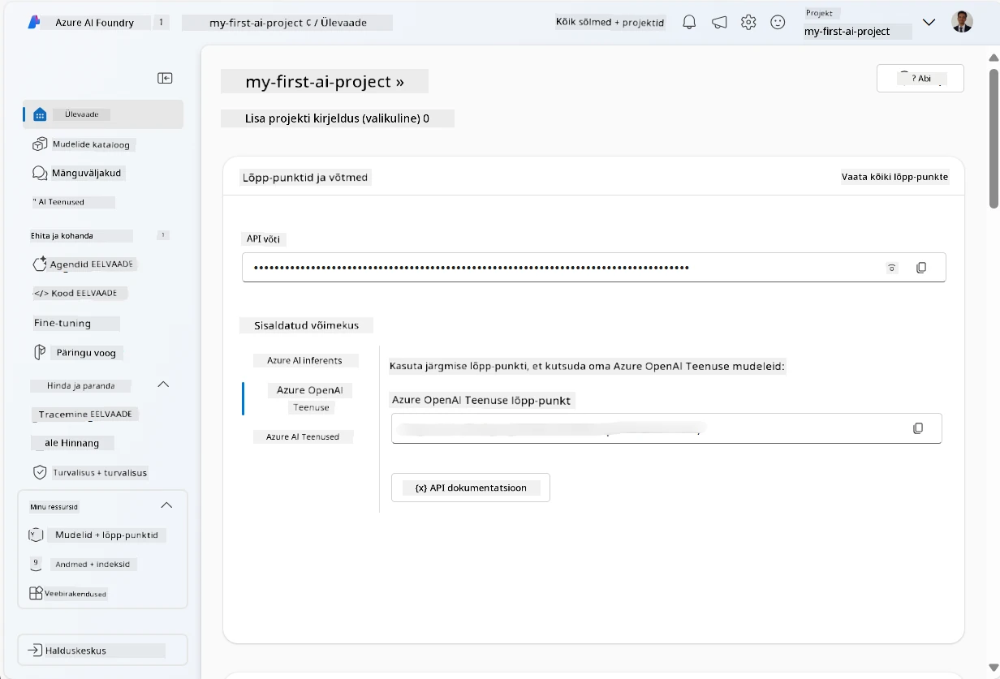
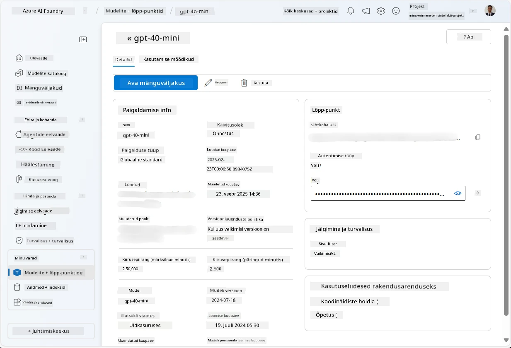
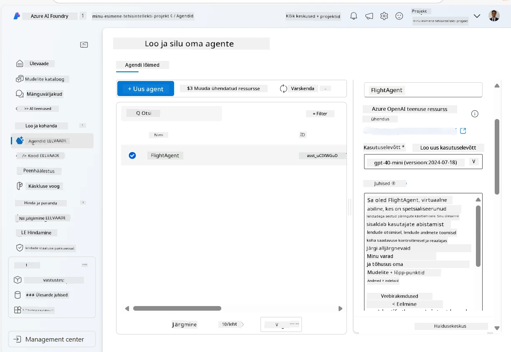
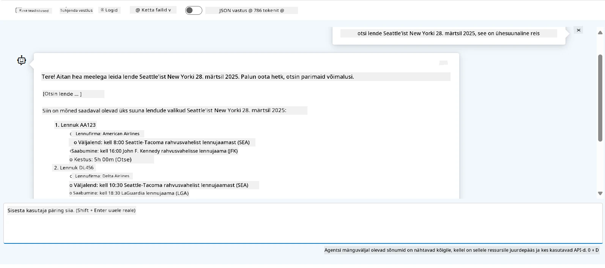

<!--
CO_OP_TRANSLATOR_METADATA:
{
  "original_hash": "7e92870dc0843e13d4dabc620c09d2d9",
  "translation_date": "2025-10-11T11:16:54+00:00",
  "source_file": "02-explore-agentic-frameworks/azure-ai-foundry-agent-creation.md",
  "language_code": "et"
}
-->
# Azure AI Agent Service Arendus

Selles harjutuses kasutad Azure AI Agent teenuse tööriistu [Azure AI Foundry portaalis](https://ai.azure.com/?WT.mc_id=academic-105485-koreyst), et luua lennupiletite broneerimise agent. Agent suudab suhelda kasutajatega ja anda teavet lendude kohta.

## Eeltingimused

Selle harjutuse läbiviimiseks vajad järgmist:
1. Azure'i konto aktiivse tellimusega. [Loo tasuta konto](https://azure.microsoft.com/free/?WT.mc_id=academic-105485-koreyst).
2. Vajad õigusi Azure AI Foundry hubi loomiseks või peab see olema sinu jaoks juba loodud.
    - Kui sinu roll on Contributor või Owner, saad järgida selle juhendi samme.

## Azure AI Foundry hubi loomine

> **Note:** Azure AI Foundry oli varem tuntud kui Azure AI Studio.

1. Järgi juhiseid [Azure AI Foundry](https://learn.microsoft.com/en-us/azure/ai-studio/?WT.mc_id=academic-105485-koreyst) blogipostitusest, et luua Azure AI Foundry hub.
2. Kui projekt on loodud, sulge kõik kuvatavad näpunäited ja vaata projekti lehte Azure AI Foundry portaalis, mis peaks välja nägema sarnane järgmisele pildile:

    

## Mudeli juurutamine

1. Projekti vasakpoolses paneelis, jaotises **My assets**, vali leht **Models + endpoints**.
2. Lehel **Models + endpoints**, vahekaardil **Model deployments**, menüüs **+ Deploy model**, vali **Deploy base model**.
3. Otsi loendist mudelit `gpt-4o-mini` ja vali ning kinnita see.

    > **Note**: TPM-i vähendamine aitab vältida tellimuse kvoodi ületarbimist.

    

## Agendi loomine

Kui mudel on juurutatud, saad luua agendi. Agent on vestlus-AI mudel, mida saab kasutada kasutajatega suhtlemiseks.

1. Projekti vasakpoolses paneelis, jaotises **Build & Customize**, vali leht **Agents**.
2. Klõpsa **+ Create agent**, et luua uus agent. **Agent Setup** dialoogiboksis:
    - Sisesta agendi nimi, näiteks `FlightAgent`.
    - Veendu, et varem loodud `gpt-4o-mini` mudeli juurutamine on valitud.
    - Määra **Instructions** vastavalt juhistele, mida soovid, et agent järgiks. Näiteks:
    ```
    You are FlightAgent, a virtual assistant specialized in handling flight-related queries. Your role includes assisting users with searching for flights, retrieving flight details, checking seat availability, and providing real-time flight status. Follow the instructions below to ensure clarity and effectiveness in your responses:

    ### Task Instructions:
    1. **Recognizing Intent**:
       - Identify the user's intent based on their request, focusing on one of the following categories:
         - Searching for flights
         - Retrieving flight details using a flight ID
         - Checking seat availability for a specified flight
         - Providing real-time flight status using a flight number
       - If the intent is unclear, politely ask users to clarify or provide more details.
        
    2. **Processing Requests**:
        - Depending on the identified intent, perform the required task:
        - For flight searches: Request details such as origin, destination, departure date, and optionally return date.
        - For flight details: Request a valid flight ID.
        - For seat availability: Request the flight ID and date and validate inputs.
        - For flight status: Request a valid flight number.
        - Perform validations on provided data (e.g., formats of dates, flight numbers, or IDs). If the information is incomplete or invalid, return a friendly request for clarification.

    3. **Generating Responses**:
    - Use a tone that is friendly, concise, and supportive.
    - Provide clear and actionable suggestions based on the output of each task.
    - If no data is found or an error occurs, explain it to the user gently and offer alternative actions (e.g., refine search, try another query).
    
    ```
> [!NOTE]
> Üksikasjaliku juhise jaoks saad vaadata [seda repositooriumi](https://github.com/ShivamGoyal03/RoamMind) lisainformatsiooni saamiseks.
    
> Lisaks saad lisada **Knowledge Base** ja **Actions**, et täiustada agendi võimekust pakkuda rohkem teavet ja täita automatiseeritud ülesandeid vastavalt kasutaja päringutele. Selle harjutuse jaoks võid need sammud vahele jätta.
    


3. Uue multi-AI agendi loomiseks klõpsa lihtsalt **New Agent**. Uus agent kuvatakse seejärel lehel Agents.

## Agendi testimine

Pärast agendi loomist saad seda testida, et näha, kuidas see reageerib kasutaja päringutele Azure AI Foundry portaali mänguväljakul.

1. Agendi **Setup** paneeli ülaosas vali **Try in playground**.
2. **Playground** paneelil saad agendiga suhelda, sisestades päringuid vestlusaknas. Näiteks võid paluda agendil otsida lende Seattle'ist New Yorki 28. kuupäeval.

    > **Note**: Agent ei pruugi anda täpseid vastuseid, kuna selles harjutuses ei kasutata reaalajas andmeid. Eesmärk on testida agendi võimet mõista ja vastata kasutaja päringutele vastavalt antud juhistele.

    

3. Pärast agendi testimist saad seda edasi kohandada, lisades rohkem intentsioone, treeningandmeid ja tegevusi, et täiustada selle võimekust.

## Ressursside kustutamine

Kui oled agendi testimise lõpetanud, saad selle kustutada, et vältida lisakulusid.
1. Ava [Azure portaal](https://portal.azure.com) ja vaata ressursside grupi sisu, kuhu sa harjutuse jaoks hubi ressursid juurutasid.
2. Tööriistaribal vali **Delete resource group**.
3. Sisesta ressursside grupi nimi ja kinnita, et soovid selle kustutada.

## Ressursid

- [Azure AI Foundry dokumentatsioon](https://learn.microsoft.com/en-us/azure/ai-studio/?WT.mc_id=academic-105485-koreyst)
- [Azure AI Foundry portaal](https://ai.azure.com/?WT.mc_id=academic-105485-koreyst)
- [Azure AI Studio alustamine](https://techcommunity.microsoft.com/blog/educatordeveloperblog/getting-started-with-azure-ai-studio/4095602?WT.mc_id=academic-105485-koreyst)
- [AI agentide põhialused Azure'is](https://learn.microsoft.com/en-us/training/modules/ai-agent-fundamentals/?WT.mc_id=academic-105485-koreyst)
- [Azure AI Discord](https://aka.ms/AzureAI/Discord)

---

**Lahtiütlus**:  
See dokument on tõlgitud AI tõlketeenuse [Co-op Translator](https://github.com/Azure/co-op-translator) abil. Kuigi püüame tagada täpsust, palume arvestada, et automaatsed tõlked võivad sisaldada vigu või ebatäpsusi. Algne dokument selle algses keeles tuleks pidada autoriteetseks allikaks. Olulise teabe puhul soovitame kasutada professionaalset inimtõlget. Me ei vastuta selle tõlke kasutamisest tulenevate arusaamatuste või valesti tõlgenduste eest.