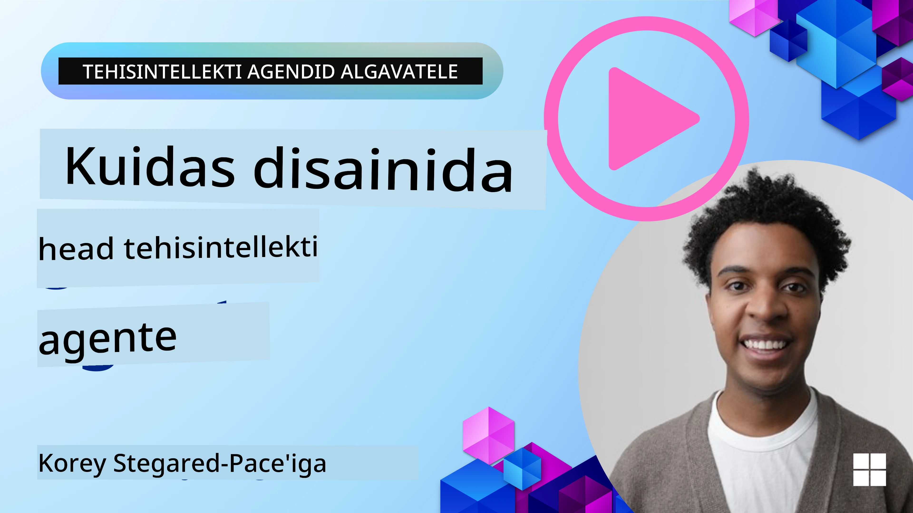
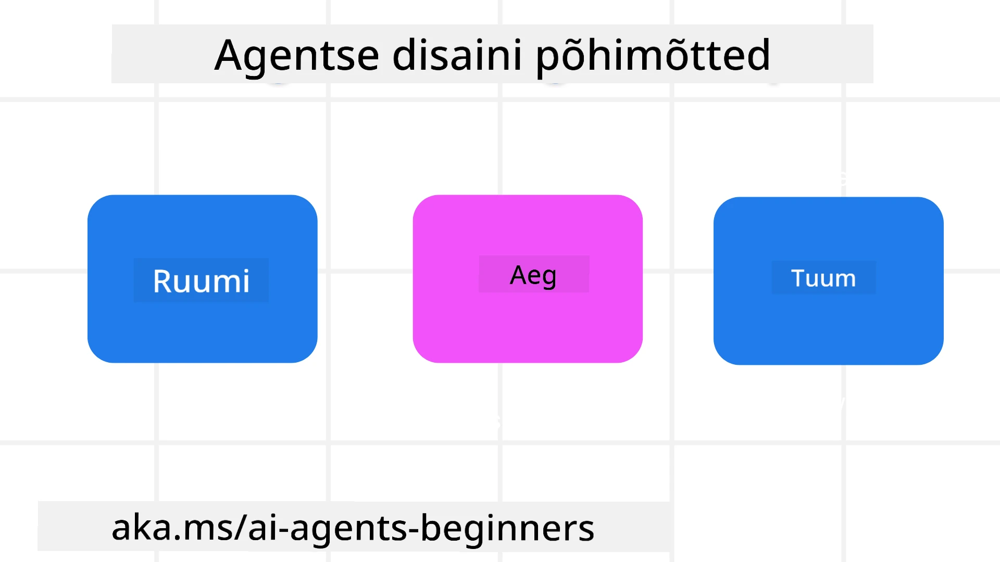

<!--
CO_OP_TRANSLATOR_METADATA:
{
  "original_hash": "d71524fe83a23829ae7a23b4031aaac8",
  "translation_date": "2025-11-13T14:58:58+00:00",
  "source_file": "03-agentic-design-patterns/README.md",
  "language_code": "et"
}
-->

> _(Klõpsa ülaloleval pildil, et vaadata selle õppetunni videot)_
# AI agentide kujundamise põhimõtted

## Sissejuhatus

AI agentide süsteemide loomisele saab läheneda mitmel viisil. Arvestades, et ebaselgus on generatiivse AI disainis pigem omadus kui viga, võib inseneridel olla keeruline otsustada, kust alustada. Oleme loonud inimesele keskendunud UX disainipõhimõtted, et aidata arendajatel luua kliendikeskseid agentide süsteeme, mis vastavad nende ärivajadustele. Need disainipõhimõtted ei ole etteantud arhitektuur, vaid pigem lähtepunkt meeskondadele, kes määratlevad ja arendavad agentide kogemusi.

Üldiselt peaksid agendid:

- Laiendama ja suurendama inimvõimeid (ajurünnakud, probleemide lahendamine, automatiseerimine jne)
- Täitma teadmiste lünki (viima mind kurssi teadmiste valdkondadega, tõlkima jne)
- Hõlbustama ja toetama koostööd viisil, mis sobib meie eelistustega teistega töötamisel
- Muutma meid paremaks versiooniks iseendast (nt elutreener/ülesannete haldaja, aidates meil õppida emotsionaalset regulatsiooni ja teadveloleku oskusi, suurendades vastupidavust jne)

## Selles õppetunnis käsitletakse

- Mis on agentide disainipõhimõtted
- Milliseid juhiseid järgida nende disainipõhimõtete rakendamisel
- Näiteid disainipõhimõtete kasutamisest

## Õppe-eesmärgid

Pärast selle õppetunni läbimist suudad:

1. Selgitada, mis on agentide disainipõhimõtted
2. Selgitada juhiseid agentide disainipõhimõtete kasutamiseks
3. Mõista, kuidas luua agenti, kasutades agentide disainipõhimõtteid

## Agentide disainipõhimõtted

### Agent (Ruum)

See on keskkond, kus agent tegutseb. Need põhimõtted juhendavad, kuidas kujundada agente, kes osalevad füüsilises ja digitaalses maailmas.

- **Ühendamine, mitte eraldamine** – aidata inimesi ühendada teiste inimestega, sündmustega ja rakendatavate teadmistega, et võimaldada koostööd ja ühendust.
- Agendid aitavad ühendada sündmusi, teadmisi ja inimesi.
- Agendid toovad inimesi lähemale. Nad ei ole loodud selleks, et asendada või alavääristada inimesi.
- **Lihtsasti ligipääsetav, kuid aeg-ajalt nähtamatu** – agent tegutseb peamiselt taustal ja annab endast märku ainult siis, kui see on asjakohane ja sobiv.
  - Agent on hõlpsasti leitav ja ligipääsetav volitatud kasutajatele igal seadmel või platvormil.
  - Agent toetab multimodaalseid sisendeid ja väljundeid (heli, hääl, tekst jne).
  - Agent suudab sujuvalt liikuda esiplaanilt taustale; proaktiivsest reaktiivseks, sõltuvalt kasutaja vajaduste tajumisest.
  - Agent võib tegutseda nähtamatul kujul, kuid selle taustaprotsess ja koostöö teiste agentidega on kasutajale läbipaistev ja kontrollitav.

### Agent (Aeg)

See on viis, kuidas agent ajas tegutseb. Need põhimõtted juhendavad, kuidas kujundada agente, kes suhtlevad mineviku, oleviku ja tulevikuga.

- **Minevik**: Ajaloo kajastamine, mis hõlmab nii seisundit kui konteksti.
  - Agent pakub asjakohasemaid tulemusi, analüüsides rikkalikumaid ajaloolisi andmeid, mitte ainult sündmusi, inimesi või seisundeid.
  - Agent loob ühendusi minevikusündmustest ja kajastab aktiivselt mälu, et tegeleda praeguste olukordadega.
- **Olevik**: Märguannete asemel suunamine.
  - Agent kehastab terviklikku lähenemist inimestega suhtlemisele. Kui sündmus toimub, läheb agent kaugemale staatilisest märguandest või muust formaalsusest. Agent võib lihtsustada voogusid või dünaamiliselt genereerida vihjeid, et suunata kasutaja tähelepanu õigel hetkel.
  - Agent edastab teavet, mis põhineb kontekstuaalsel keskkonnal, sotsiaalsetel ja kultuurilistel muutustel ning on kohandatud kasutaja kavatsustele.
  - Agentide interaktsioon võib olla järkjärguline, arenedes/kasvades keerukuses, et anda kasutajatele pikaajalist tuge.
- **Tulevik**: Kohanemine ja areng.
  - Agent kohandub erinevate seadmete, platvormide ja modaliteetidega.
  - Agent kohandub kasutaja käitumise, ligipääsetavuse vajadustega ja on vabalt kohandatav.
  - Agent kujuneb ja areneb pideva kasutajate interaktsiooni kaudu.

### Agent (Tuumik)

Need on agendi disaini põhielemendid.

- **Ebamäärasuse omaksvõtt, kuid usalduse loomine**.
  - Teatud tasemel agendi ebamäärasus on oodatav. Ebamäärasus on agendi disaini oluline element.
  - Usaldus ja läbipaistvus on agendi disaini aluskihid.
  - Inimesed kontrollivad, millal agent on sisse/välja lülitatud, ja agendi staatus on alati selgelt nähtav.

## Juhised nende põhimõtete rakendamiseks

Kui kasutad eelnevaid disainipõhimõtteid, järgi järgmisi juhiseid:

1. **Läbipaistvus**: Teavita kasutajat, et AI on kaasatud, kuidas see toimib (sh varasemad tegevused) ja kuidas anda tagasisidet ning süsteemi muuta.
2. **Kontroll**: Võimalda kasutajal kohandada, määrata eelistusi ja isikupärastada ning kontrollida süsteemi ja selle atribuute (sh unustamise võimalus).
3. **Järjepidevus**: Püüa pakkuda järjepidevaid, multimodaalseid kogemusi erinevates seadmetes ja lõpp-punktides. Kasuta võimalusel tuttavaid UI/UX elemente (nt mikrofoni ikoon häälinteraktsiooni jaoks) ja vähenda kliendi kognitiivset koormust nii palju kui võimalik (nt paku lühikesi vastuseid, visuaalseid abivahendeid ja "Loe rohkem" sisu).

## Kuidas kujundada reisibüroo agenti, kasutades neid põhimõtteid ja juhiseid

Kujutle, et kujundad reisibüroo agenti, siin on, kuidas võiksid mõelda disainipõhimõtete ja juhiste kasutamisele:

1. **Läbipaistvus** – Teavita kasutajat, et reisibüroo agent on AI-toega agent. Paku mõningaid põhilisi juhiseid alustamiseks (nt "Tere" sõnum, näidisviited). Dokumenteeri see selgelt tootelehel. Näita nimekirja viidetest, mida kasutaja on varem küsinud. Tee selgeks, kuidas anda tagasisidet (pöidlad üles ja alla, Tagasiside saatmise nupp jne). Selgita selgelt, kas agendil on kasutus- või teemapiiranguid.
2. **Kontroll** – Tee selgeks, kuidas kasutaja saab agenti pärast selle loomist muuta, näiteks süsteemi viite kaudu. Võimalda kasutajal valida, kui põhjalik agent on, selle kirjutamisstiil ja mis tahes piirangud teemadele, millest agent ei peaks rääkima. Luba kasutajal vaadata ja kustutada seotud faile või andmeid, viiteid ja varasemaid vestlusi.
3. **Järjepidevus** – Veendu, et ikoonid, nagu Viite jagamine, faili või foto lisamine ja kellegi või millegi märkimine, oleksid standardsed ja äratuntavad. Kasuta kirjaklambri ikooni, et näidata faili üleslaadimist/jagamist agendiga, ja pildiikooni, et näidata graafika üleslaadimist.

## Näidis koodid

- Python: [Agent Framework](./code_samples/03-python-agent-framework.ipynb)
- .NET: [Agent Framework](./code_samples/03-dotnet-agent-framework.md)

## Kas sul on rohkem küsimusi AI agentide disainimustrite kohta?

Liitu [Azure AI Foundry Discordiga](https://aka.ms/ai-agents/discord), et kohtuda teiste õppijatega, osaleda kontoritundides ja saada vastuseid oma AI agentide küsimustele.

## Täiendavad ressursid

- <a href="https://openai.com" target="_blank">Agentlike AI süsteemide juhtimise praktikad | OpenAI</a>
- <a href="https://microsoft.com" target="_blank">HAX Toolkit Project - Microsoft Research</a>
- <a href="https://responsibleaitoolbox.ai" target="_blank">Vastutustundliku AI tööriistakast</a>

## Eelmine õppetund

[Agentlike raamistikud uurimine](../02-explore-agentic-frameworks/README.md)

## Järgmine õppetund

[Tööriistade kasutamise disainimuster](../04-tool-use/README.md)

---

<!-- CO-OP TRANSLATOR DISCLAIMER START -->
**Lahtiütlus**:  
See dokument on tõlgitud AI tõlketeenuse [Co-op Translator](https://github.com/Azure/co-op-translator) abil. Kuigi püüame tagada täpsust, palume arvestada, et automaatsed tõlked võivad sisaldada vigu või ebatäpsusi. Algne dokument selle algses keeles tuleks pidada autoriteetseks allikaks. Olulise teabe puhul soovitame kasutada professionaalset inimtõlget. Me ei vastuta selle tõlke kasutamisest tulenevate arusaamatuste või valesti tõlgenduste eest.
<!-- CO-OP TRANSLATOR DISCLAIMER END -->