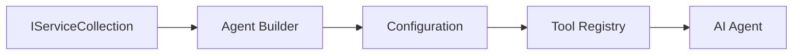

<!--
CO_OP_TRANSLATOR_METADATA:
{
  "original_hash": "bcc874e190347bd6a095aed56dc16de8",
  "translation_date": "2025-11-13T15:00:03+00:00",
  "source_file": "03-agentic-design-patterns/code_samples/03-dotnet-agent-framework.md",
  "language_code": "et"
}
-->
# 🎨 Agentlikud disainimustrid GitHubi mudelitega (.NET)

## 📋 Õpieesmärgid

See näide tutvustab ettevõtte tasemel disainimustreid intelligentsete agentide loomiseks, kasutades Microsoft Agent Frameworki .NET-is koos GitHubi mudelite integreerimisega. Õpid professionaalseid mustreid ja arhitektuurilisi lähenemisi, mis muudavad agendid tootmisvalmis, hooldatavaks ja skaleeritavaks.

### Ettevõtte disainimustrid

- 🏭 **Tehase muster**: Standardiseeritud agentide loomine sõltuvuste süstimisega
- 🔧 **Ehitusmuster**: Sujuv agentide konfigureerimine ja seadistamine
- 🧵 **Lõimeohutud mustrid**: Samaaegne vestluste haldamine
- 📋 **Repository muster**: Tööriistade ja võimekuste organiseeritud haldamine

## 🎯 .NET-i spetsiifilised arhitektuurilised eelised

### Ettevõtte funktsioonid

- **Tugev tüüpimine**: Kompileerimise ajal valideerimine ja IntelliSense tugi
- **Sõltuvuste süstimine**: Sisseehitatud DI konteineri integreerimine
- **Konfiguratsiooni haldamine**: IConfiguration ja Options mustrid
- **Async/Await**: Esmaklassiline asünkroonne programmeerimise tugi

### Tootmisvalmis mustrid

- **Logimise integreerimine**: ILogger ja struktureeritud logimise tugi
- **Tervisekontrollid**: Sisseehitatud jälgimine ja diagnostika
- **Konfiguratsiooni valideerimine**: Tugev tüüpimine andmeannotatsioonidega
- **Vigade käsitlemine**: Struktureeritud erandite haldamine

## 🔧 Tehniline arhitektuur

### Põhilised .NET komponendid

- **Microsoft.Extensions.AI**: Ühtlustatud AI teenuste abstraktsioonid
- **Microsoft.Agents.AI**: Ettevõtte agentide orkestreerimise raamistik
- **GitHubi mudelite integreerimine**: Kõrge jõudlusega API kliendi mustrid
- **Konfiguratsioonisüsteem**: appsettings.json ja keskkonna integreerimine

### Disainimustri rakendamine



## 🏗️ Näidatud ettevõtte mustrid

### 1. **Loomismustrid**

- **Agent Factory**: Keskne agentide loomine järjepideva konfiguratsiooniga
- **Ehitusmuster**: Sujuv API keerukate agentide konfigureerimiseks
- **Singleton muster**: Jagatud ressursside ja konfiguratsiooni haldamine
- **Sõltuvuste süstimine**: Lõdvalt seotud ja testitav

### 2. **Käitumismustrid**

- **Strateegia muster**: Vahetatavad tööriistade täitmise strateegiad
- **Käsu muster**: Kapseldatud agentide operatsioonid koos undo/redo funktsiooniga
- **Vaatleja muster**: Sündmustepõhine agentide elutsükli haldamine
- **Mallimeetod**: Standardiseeritud agentide täitmise töövood

### 3. **Struktuurimustrid**

- **Adapteri muster**: GitHubi mudelite API integreerimise kiht
- **Dekoraatori muster**: Agentide võimekuse täiustamine
- **Fassaadi muster**: Lihtsustatud agentide interaktsiooni liidesed
- **Proksi muster**: Laisk laadimine ja vahemälu jõudluse parandamiseks

## 📚 .NET-i disainiprintsiibid

### SOLID printsiibid

- **Üksiku vastutuse**: Igal komponendil on üks selge eesmärk
- **Avatud/Suletud**: Laiendatav ilma muutmiseta
- **Liskovi asendatavus**: Liidese põhised tööriistade rakendused
- **Liidese eraldamine**: Keskendunud ja sidusad liidesed
- **Sõltuvuste inversioon**: Tugineda abstraktsioonidele, mitte konkreetsetele rakendustele

### Puhas arhitektuur

- **Domeeni kiht**: Põhilised agentide ja tööriistade abstraktsioonid
- **Rakenduse kiht**: Agentide orkestreerimine ja töövood
- **Infrastruktuuri kiht**: GitHubi mudelite integreerimine ja välised teenused
- **Esitluse kiht**: Kasutaja interaktsioon ja vastuste vormindamine

## 🔒 Ettevõtte kaalutlused

### Turvalisus

- **Mandaatide haldamine**: Turvaline API võtmete käsitlemine IConfiguration abil
- **Sisendi valideerimine**: Tugev tüüpimine ja andmeannotatsioonide valideerimine
- **Väljundi puhastamine**: Turvaline vastuste töötlemine ja filtreerimine
- **Auditilogimine**: Põhjalik operatsioonide jälgimine

### Jõudlus

- **Asünkroonsed mustrid**: Mitteblokeerivad I/O operatsioonid
- **Ühenduste bassein**: Tõhus HTTP kliendi haldamine
- **Vahemälu**: Vastuste vahemälu jõudluse parandamiseks
- **Ressursside haldamine**: Õige ressursside vabastamine ja puhastamine

### Skaleeritavus

- **Lõimeohutus**: Samaaegne agentide täitmise tugi
- **Ressursside bassein**: Tõhus ressursside kasutamine
- **Koormuse haldamine**: Kiiruse piiramine ja tagasisurve käsitlemine
- **Jälgimine**: Jõudlusmõõdikud ja tervisekontrollid

## 🚀 Tootmisele juurutamine

- **Konfiguratsiooni haldamine**: Keskkonnaspetsiifilised seaded
- **Logimise strateegia**: Struktureeritud logimine koos korrelatsiooni ID-dega
- **Vigade käsitlemine**: Üldine erandite käsitlemine koos õige taastamisega
- **Jälgimine**: Rakenduse ülevaated ja jõudlusloendurid
- **Testimine**: Üksustestid, integratsioonitestid ja koormustestimise mustrid

Valmis looma ettevõtte tasemel intelligentseid agente .NET-is? Kujundame midagi vastupidavat! 🏢✨

## 🚀 Alustamine

### Eeltingimused

- [.NET 10 SDK](https://dotnet.microsoft.com/download/dotnet/10.0) või uuem
- [GitHub Models API juurdepääsuvõti](https://docs.github.com/github-models/github-models-at-scale/using-your-own-api-keys-in-github-models)

### Nõutavad keskkonnamuutujad

```bash
# zsh/bash
export GH_TOKEN=<your_github_token>
export GH_ENDPOINT=https://models.github.ai/inference
export GH_MODEL_ID=openai/gpt-5-mini
```

```powershell
# PowerShell
$env:GH_TOKEN = "<your_github_token>"
$env:GH_ENDPOINT = "https://models.github.ai/inference"
$env:GH_MODEL_ID = "openai/gpt-5-mini"
```

### Näidiskood

Koodi näite käivitamiseks,

```bash
# zsh/bash
chmod +x ./03-dotnet-agent-framework.cs
./03-dotnet-agent-framework.cs
```

Või kasutades dotnet CLI-d:

```bash
dotnet run ./03-dotnet-agent-framework.cs
```

Vaata [`03-dotnet-agent-framework.cs`](../../../../03-agentic-design-patterns/code_samples/03-dotnet-agent-framework.cs) täieliku koodi jaoks.

```csharp
#!/usr/bin/dotnet run

#:package Microsoft.Extensions.AI@10.*
#:package Microsoft.Agents.AI.OpenAI@1.*-*

using System.ClientModel;
using System.ComponentModel;

using Microsoft.Agents.AI;
using Microsoft.Extensions.AI;

using OpenAI;

// Tool Function: Random Destination Generator
// This static method will be available to the agent as a callable tool
// The [Description] attribute helps the AI understand when to use this function
// This demonstrates how to create custom tools for AI agents
[Description("Provides a random vacation destination.")]
static string GetRandomDestination()
{
    // List of popular vacation destinations around the world
    // The agent will randomly select from these options
    var destinations = new List<string>
    {
        "Paris, France",
        "Tokyo, Japan",
        "New York City, USA",
        "Sydney, Australia",
        "Rome, Italy",
        "Barcelona, Spain",
        "Cape Town, South Africa",
        "Rio de Janeiro, Brazil",
        "Bangkok, Thailand",
        "Vancouver, Canada"
    };

    // Generate random index and return selected destination
    // Uses System.Random for simple random selection
    var random = new Random();
    int index = random.Next(destinations.Count);
    return destinations[index];
}

// Extract configuration from environment variables
// Retrieve the GitHub Models API endpoint, defaults to https://models.github.ai/inference if not specified
// Retrieve the model ID, defaults to openai/gpt-5-mini if not specified
// Retrieve the GitHub token for authentication, throws exception if not specified
var github_endpoint = Environment.GetEnvironmentVariable("GH_ENDPOINT") ?? "https://models.github.ai/inference";
var github_model_id = Environment.GetEnvironmentVariable("GH_MODEL_ID") ?? "openai/gpt-5-mini";
var github_token = Environment.GetEnvironmentVariable("GH_TOKEN") ?? throw new InvalidOperationException("GH_TOKEN is not set.");

// Configure OpenAI Client Options
// Create configuration options to point to GitHub Models endpoint
// This redirects OpenAI client calls to GitHub's model inference service
var openAIOptions = new OpenAIClientOptions()
{
    Endpoint = new Uri(github_endpoint)
};

// Initialize OpenAI Client with GitHub Models Configuration
// Create OpenAI client using GitHub token for authentication
// Configure it to use GitHub Models endpoint instead of OpenAI directly
var openAIClient = new OpenAIClient(new ApiKeyCredential(github_token), openAIOptions);

// Define Agent Identity and Comprehensive Instructions
// Agent name for identification and logging purposes
var AGENT_NAME = "TravelAgent";

// Detailed instructions that define the agent's personality, capabilities, and behavior
// This system prompt shapes how the agent responds and interacts with users
var AGENT_INSTRUCTIONS = """
You are a helpful AI Agent that can help plan vacations for customers.

Important: When users specify a destination, always plan for that location. Only suggest random destinations when the user hasn't specified a preference.

When the conversation begins, introduce yourself with this message:
"Hello! I'm your TravelAgent assistant. I can help plan vacations and suggest interesting destinations for you. Here are some things you can ask me:
1. Plan a day trip to a specific location
2. Suggest a random vacation destination
3. Find destinations with specific features (beaches, mountains, historical sites, etc.)
4. Plan an alternative trip if you don't like my first suggestion

What kind of trip would you like me to help you plan today?"

Always prioritize user preferences. If they mention a specific destination like "Bali" or "Paris," focus your planning on that location rather than suggesting alternatives.
""";

// Create AI Agent with Advanced Travel Planning Capabilities
// Initialize complete agent pipeline: OpenAI client → Chat client → AI agent
// Configure agent with name, detailed instructions, and available tools
// This demonstrates the .NET agent creation pattern with full configuration
AIAgent agent = openAIClient
    .GetChatClient(github_model_id)
    .CreateAIAgent(
        name: AGENT_NAME,
        instructions: AGENT_INSTRUCTIONS,
        tools: [AIFunctionFactory.Create(GetRandomDestination)]
    );

// Create New Conversation Thread for Context Management
// Initialize a new conversation thread to maintain context across multiple interactions
// Threads enable the agent to remember previous exchanges and maintain conversational state
// This is essential for multi-turn conversations and contextual understanding
AgentThread thread = agent.GetNewThread();

// Execute Agent: First Travel Planning Request
// Run the agent with an initial request that will likely trigger the random destination tool
// The agent will analyze the request, use the GetRandomDestination tool, and create an itinerary
// Using the thread parameter maintains conversation context for subsequent interactions
await foreach (var update in agent.RunStreamingAsync("Plan me a day trip", thread))
{
    await Task.Delay(10);
    Console.Write(update);
}

Console.WriteLine();

// Execute Agent: Follow-up Request with Context Awareness
// Demonstrate contextual conversation by referencing the previous response
// The agent remembers the previous destination suggestion and will provide an alternative
// This showcases the power of conversation threads and contextual understanding in .NET agents
await foreach (var update in agent.RunStreamingAsync("I don't like that destination. Plan me another vacation.", thread))
{
    await Task.Delay(10);
    Console.Write(update);
}
```

---

<!-- CO-OP TRANSLATOR DISCLAIMER START -->
**Lahtiütlus**:  
See dokument on tõlgitud AI tõlketeenuse [Co-op Translator](https://github.com/Azure/co-op-translator) abil. Kuigi püüame tagada täpsust, palume arvestada, et automaatsed tõlked võivad sisaldada vigu või ebatäpsusi. Algne dokument selle algses keeles tuleks pidada autoriteetseks allikaks. Olulise teabe puhul soovitame kasutada professionaalset inimtõlget. Me ei vastuta selle tõlke kasutamisest tulenevate arusaamatuste või valesti tõlgenduste eest.
<!-- CO-OP TRANSLATOR DISCLAIMER END -->