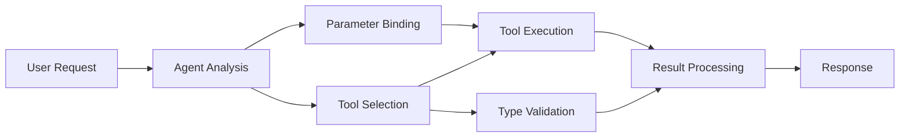

<!--
CO_OP_TRANSLATOR_METADATA:
{
  "original_hash": "91d6061e402489603f2ec8b528cae59b",
  "translation_date": "2025-11-18T18:46:27+00:00",
  "source_file": "04-tool-use/code_samples/04-dotnet-agent-framework.md",
  "language_code": "et"
}
-->
# 🛠️ Täiustatud tööriistade kasutamine GitHubi mudelitega (.NET)

## 📋 Õpieesmärgid

See märkmik tutvustab ettevõtte tasemel tööriistade integreerimise mustreid, kasutades Microsoft Agent Frameworki .NET-is koos GitHubi mudelitega. Õpid looma keerukaid agente mitme spetsialiseeritud tööriistaga, kasutades C# tugevat tüübikontrolli ja .NET-i ettevõtte funktsioone.

### Täiustatud tööriistade võimekused, mida omandad

- 🔧 **Mitme tööriista arhitektuur**: Agendid, millel on mitmed spetsialiseeritud võimed
- 🎯 **Tüübikindel tööriistade täitmine**: C# kompileerimisaja valideerimise kasutamine
- 📊 **Ettevõtte tööriistade mustrid**: Tootmiskõlblik tööriistade disain ja veahaldus
- 🔗 **Tööriistade kombineerimine**: Tööriistade ühendamine keerukate äriprotsesside jaoks

## 🎯 .NET tööriistade arhitektuuri eelised

### Ettevõtte tööriistade omadused

- **Kompileerimisaja valideerimine**: Tugev tüübikontroll tagab tööriista parameetrite õigsuse
- **Sõltuvuste süstimine**: IoC konteineri integreerimine tööriistade haldamiseks
- **Async/Await mustrid**: Mitteblokeeriv tööriistade täitmine koos ressursside korrektse haldamisega
- **Struktureeritud logimine**: Sisseehitatud logimise integreerimine tööriistade täitmise jälgimiseks

### Tootmiskõlblikud mustrid

- **Erandite käsitlemine**: Põhjalik veahaldus tüübipõhiste eranditega
- **Ressursside haldamine**: Korrektsed vabastamismustrid ja mäluhaldus
- **Jõudluse jälgimine**: Sisseehitatud mõõdikud ja jõudlusloendurid
- **Konfiguratsiooni haldamine**: Tüübikindel konfiguratsioon koos valideerimisega

## 🔧 Tehniline arhitektuur

### Põhilised .NET tööriistade komponendid

- **Microsoft.Extensions.AI**: Ühtne tööriistade abstraktsioonikiht
- **Microsoft.Agents.AI**: Ettevõtte tasemel tööriistade orkestreerimine
- **GitHubi mudelite integreerimine**: Kõrge jõudlusega API klient koos ühenduste haldamisega

### Tööriistade täitmise torujuhe



## 🛠️ Tööriistade kategooriad ja mustrid

### 1. **Andmetöötluse tööriistad**

- **Sisendi valideerimine**: Tugev tüübikontroll koos andmeannotatsioonidega
- **Transformatsioonitoimingud**: Tüübikindel andmete teisendamine ja vormindamine
- **Äriloogika**: Domeenispetsiifilised arvutused ja analüüsitööriistad
- **Väljundi vormindamine**: Struktureeritud vastuste genereerimine

### 2. **Integreerimise tööriistad**

- **API ühendused**: REST-teenuste integreerimine HttpClientiga
- **Andmebaasi tööriistad**: Entity Frameworki integreerimine andmetele juurdepääsuks
- **Failitoimingud**: Turvalised failisüsteemi toimingud koos valideerimisega
- **Välisteenused**: Kolmandate osapoolte teenuste integreerimise mustrid

### 3. **Utiliiditööriistad**

- **Tekstitöötlus**: Stringide manipuleerimise ja vormindamise utiliidid
- **Kuupäeva/kellaaja toimingud**: Kultuuriteadlikud kuupäeva/kellaaja arvutused
- **Matemaatilised tööriistad**: Täpsed arvutused ja statistilised operatsioonid
- **Valideerimise tööriistad**: Ärireeglite valideerimine ja andmete kontrollimine

Valmis looma ettevõtte tasemel agente võimsate, tüübikindlate tööriistadega .NET-is? Kujundame professionaalseid lahendusi! 🏢⚡

## 🚀 Alustamine

### Eeltingimused

- [.NET 10 SDK](https://dotnet.microsoft.com/download/dotnet/10.0) või uuem
- [GitHubi mudelite API juurdepääsuvõti](https://docs.github.com/github-models/github-models-at-scale/using-your-own-api-keys-in-github-models)

### Nõutavad keskkonnamuutujad

```bash
# zsh/bash
export GH_TOKEN=<your_github_token>
export GH_ENDPOINT=https://models.github.ai/inference
export GH_MODEL_ID=openai/gpt-5-mini
```

```powershell
# PowerShell
$env:GH_TOKEN = "<your_github_token>"
$env:GH_ENDPOINT = "https://models.github.ai/inference"
$env:GH_MODEL_ID = "openai/gpt-5-mini"
```

### Näidiskood

Näidiskoodi käivitamiseks,

```bash
# zsh/bash
chmod +x ./04-dotnet-agent-framework.cs
./04-dotnet-agent-framework.cs
```

Või kasutades dotnet CLI-d:

```bash
dotnet run ./04-dotnet-agent-framework.cs
```

Vaata täielikku koodi failist [`04-dotnet-agent-framework.cs`](../../../../04-tool-use/code_samples/04-dotnet-agent-framework.cs).

```csharp
#!/usr/bin/dotnet run

#:package Microsoft.Extensions.AI@10.*
#:package Microsoft.Agents.AI.OpenAI@1.*-*

using System.ClientModel;
using System.ComponentModel;

using Microsoft.Agents.AI;
using Microsoft.Extensions.AI;

using OpenAI;

// Tool Function: Random Destination Generator
// This static method will be available to the agent as a callable tool
// The [Description] attribute helps the AI understand when to use this function
// This demonstrates how to create custom tools for AI agents
[Description("Provides a random vacation destination.")]
static string GetRandomDestination()
{
    // List of popular vacation destinations around the world
    // The agent will randomly select from these options
    var destinations = new List<string>
    {
        "Paris, France",
        "Tokyo, Japan",
        "New York City, USA",
        "Sydney, Australia",
        "Rome, Italy",
        "Barcelona, Spain",
        "Cape Town, South Africa",
        "Rio de Janeiro, Brazil",
        "Bangkok, Thailand",
        "Vancouver, Canada"
    };

    // Generate random index and return selected destination
    // Uses System.Random for simple random selection
    var random = new Random();
    int index = random.Next(destinations.Count);
    return destinations[index];
}

// Extract configuration from environment variables
// Retrieve the GitHub Models API endpoint, defaults to https://models.github.ai/inference if not specified
// Retrieve the model ID, defaults to openai/gpt-5-mini if not specified
// Retrieve the GitHub token for authentication, throws exception if not specified
var github_endpoint = Environment.GetEnvironmentVariable("GH_ENDPOINT") ?? "https://models.github.ai/inference";
var github_model_id = Environment.GetEnvironmentVariable("GH_MODEL_ID") ?? "openai/gpt-5-mini";
var github_token = Environment.GetEnvironmentVariable("GH_TOKEN") ?? throw new InvalidOperationException("GH_TOKEN is not set.");

// Configure OpenAI Client Options
// Create configuration options to point to GitHub Models endpoint
// This redirects OpenAI client calls to GitHub's model inference service
var openAIOptions = new OpenAIClientOptions()
{
    Endpoint = new Uri(github_endpoint)
};

// Initialize OpenAI Client with GitHub Models Configuration
// Create OpenAI client using GitHub token for authentication
// Configure it to use GitHub Models endpoint instead of OpenAI directly
var openAIClient = new OpenAIClient(new ApiKeyCredential(github_token), openAIOptions);

// Define Agent Identity and Comprehensive Instructions
// Agent name for identification and logging purposes
var AGENT_NAME = "TravelAgent";

// Detailed instructions that define the agent's personality, capabilities, and behavior
// This system prompt shapes how the agent responds and interacts with users
var AGENT_INSTRUCTIONS = """
You are a helpful AI Agent that can help plan vacations for customers.

Important: When users specify a destination, always plan for that location. Only suggest random destinations when the user hasn't specified a preference.

When the conversation begins, introduce yourself with this message:
"Hello! I'm your TravelAgent assistant. I can help plan vacations and suggest interesting destinations for you. Here are some things you can ask me:
1. Plan a day trip to a specific location
2. Suggest a random vacation destination
3. Find destinations with specific features (beaches, mountains, historical sites, etc.)
4. Plan an alternative trip if you don't like my first suggestion

What kind of trip would you like me to help you plan today?"

Always prioritize user preferences. If they mention a specific destination like "Bali" or "Paris," focus your planning on that location rather than suggesting alternatives.
""";

// Create AI Agent with Advanced Travel Planning Capabilities
// Initialize complete agent pipeline: OpenAI client → Chat client → AI agent
// Configure agent with name, detailed instructions, and available tools
// This demonstrates the .NET agent creation pattern with full configuration
AIAgent agent = openAIClient
    .GetChatClient(github_model_id)
    .CreateAIAgent(
        name: AGENT_NAME,
        instructions: AGENT_INSTRUCTIONS,
        tools: [AIFunctionFactory.Create(GetRandomDestination)]
    );

// Create New Conversation Thread for Context Management
// Initialize a new conversation thread to maintain context across multiple interactions
// Threads enable the agent to remember previous exchanges and maintain conversational state
// This is essential for multi-turn conversations and contextual understanding
AgentThread thread = agent.GetNewThread();

// Execute Agent: First Travel Planning Request
// Run the agent with an initial request that will likely trigger the random destination tool
// The agent will analyze the request, use the GetRandomDestination tool, and create an itinerary
// Using the thread parameter maintains conversation context for subsequent interactions
await foreach (var update in agent.RunStreamingAsync("Plan me a day trip", thread))
{
    await Task.Delay(10);
    Console.Write(update);
}

Console.WriteLine();

// Execute Agent: Follow-up Request with Context Awareness
// Demonstrate contextual conversation by referencing the previous response
// The agent remembers the previous destination suggestion and will provide an alternative
// This showcases the power of conversation threads and contextual understanding in .NET agents
await foreach (var update in agent.RunStreamingAsync("I don't like that destination. Plan me another vacation.", thread))
{
    await Task.Delay(10);
    Console.Write(update);
}
```

---

<!-- CO-OP TRANSLATOR DISCLAIMER START -->
**Lahtiütlus**:  
See dokument on tõlgitud AI tõlketeenuse [Co-op Translator](https://github.com/Azure/co-op-translator) abil. Kuigi püüame tagada täpsust, palume arvestada, et automaatsed tõlked võivad sisaldada vigu või ebatäpsusi. Algne dokument selle algses keeles tuleks pidada autoriteetseks allikaks. Olulise teabe puhul soovitame kasutada professionaalset inimtõlget. Me ei vastuta selle tõlke kasutamisest tulenevate arusaamatuste või valesti tõlgenduste eest.
<!-- CO-OP TRANSLATOR DISCLAIMER END -->