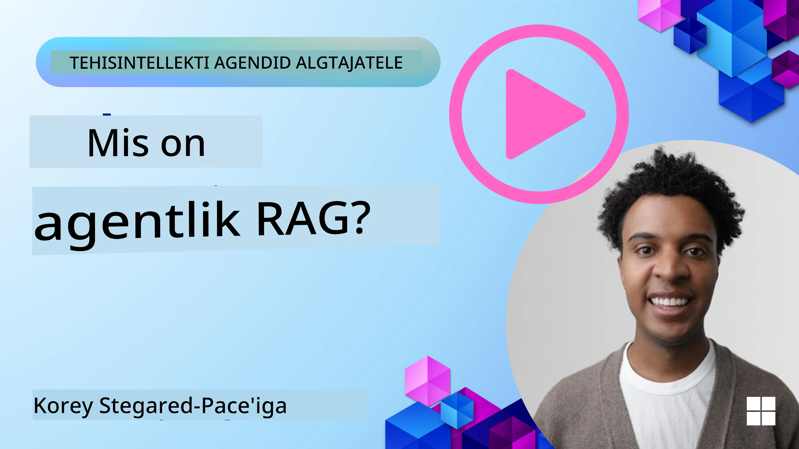
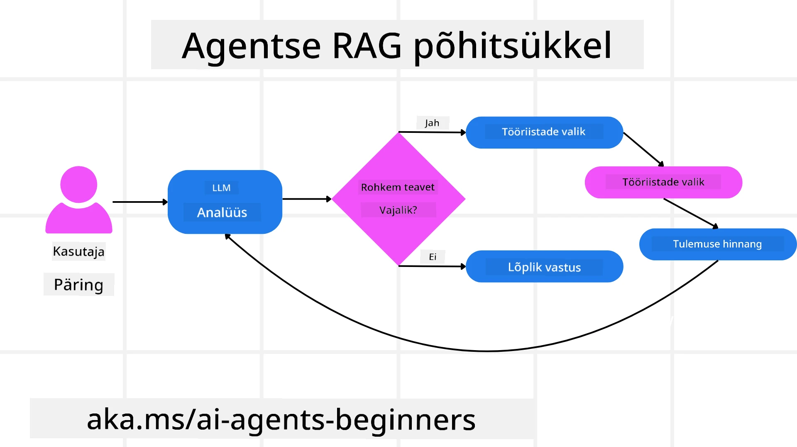
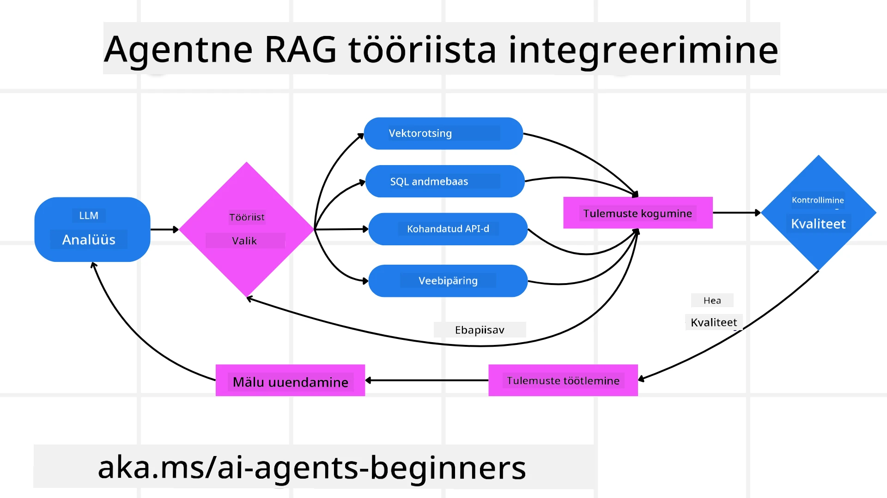
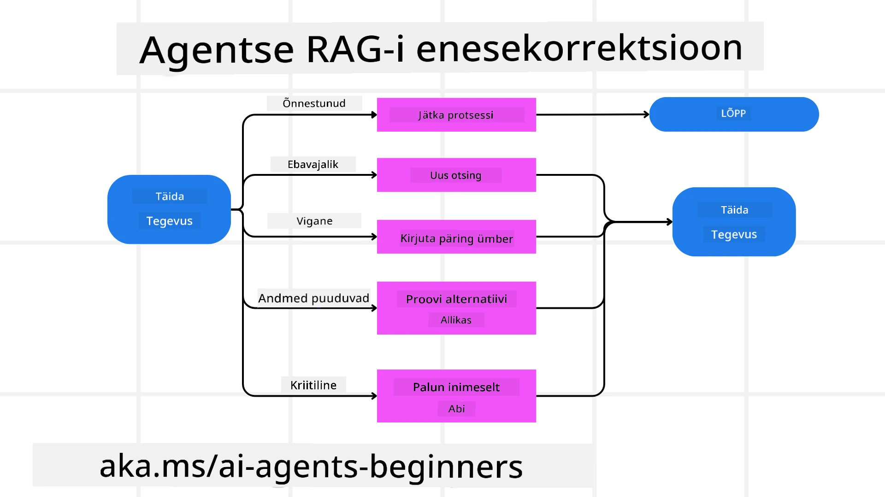
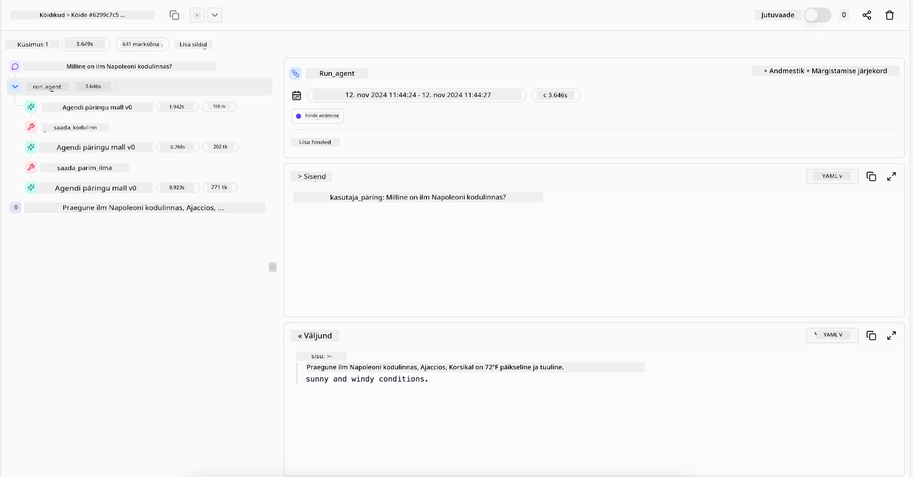

<!--
CO_OP_TRANSLATOR_METADATA:
{
  "original_hash": "0ebf6b2290db55dbf2d10cc49655523b",
  "translation_date": "2025-10-11T11:05:13+00:00",
  "source_file": "05-agentic-rag/README.md",
  "language_code": "et"
}
-->

> _(Klõpsa ülaloleval pildil, et vaadata selle õppetunni videot)_

# Agentic RAG

See õppetund annab põhjaliku ülevaate Agentic Retrieval-Augmented Generation (Agentic RAG) kontseptsioonist, mis on uus AI paradigma, kus suured keelemudelid (LLM-id) planeerivad autonoomselt oma järgmisi samme, samal ajal hankides teavet välistest allikatest. Erinevalt staatilisest "otsing-ja-lugemine" mustrist hõlmab Agentic RAG korduvaid LLM-i päringuid, mille vahele on põimitud tööriista või funktsiooni kasutamine ja struktureeritud väljundid. Süsteem hindab tulemusi, täpsustab päringuid, kutsub vajadusel esile täiendavaid tööriistu ja jätkab seda tsüklit, kuni saavutatakse rahuldav lahendus.

## Sissejuhatus

Selles õppetunnis käsitletakse:

- **Agentic RAG mõistmine:** Tutvu uue AI paradigmaga, kus suured keelemudelid (LLM-id) planeerivad autonoomselt oma järgmisi samme, hankides teavet välisandmeallikatest.
- **Iteratiivne Maker-Checker stiil:** Mõista korduvate LLM-i päringute tsüklit, mille vahele on põimitud tööriista või funktsiooni kasutamine ja struktureeritud väljundid, mis on loodud täpsuse parandamiseks ja vigaste päringute käsitlemiseks.
- **Praktilised rakendused:** Tuvasta olukorrad, kus Agentic RAG paistab silma, näiteks täpsust nõudvates keskkondades, keerulistes andmebaasi interaktsioonides ja pikemates töövoogudes.

## Õppeeesmärgid

Pärast selle õppetunni läbimist oskad/mõistad:

- **Agentic RAG mõistmine:** Tutvu uue AI paradigmaga, kus suured keelemudelid (LLM-id) planeerivad autonoomselt oma järgmisi samme, hankides teavet välisandmeallikatest.
- **Iteratiivne Maker-Checker stiil:** Mõista korduvate LLM-i päringute tsüklit, mille vahele on põimitud tööriista või funktsiooni kasutamine ja struktureeritud väljundid, mis on loodud täpsuse parandamiseks ja vigaste päringute käsitlemiseks.
- **Omandada mõtlemisprotsess:** Mõista süsteemi võimet omada oma mõtlemisprotsessi, tehes otsuseid probleemide lahendamise lähenemisviiside kohta ilma eelnevalt määratletud teekondadeta.
- **Töövoog:** Mõista, kuidas agentlik mudel otsustab iseseisvalt hankida turutrendide aruandeid, tuvastada konkurentide andmeid, korreleerida sisemisi müügimõõdikuid, sünteesida järeldusi ja hinnata strateegiat.
- **Iteratiivsed tsüklid, tööriistade integreerimine ja mälu:** Õpi tundma süsteemi sõltuvust korduvast interaktsioonimustrist, säilitades oleku ja mälu sammude vahel, et vältida korduvaid tsükleid ja teha teadlikke otsuseid.
- **Ebaõnnestumiste käsitlemine ja enesekorrektsioon:** Uuri süsteemi tugevaid enesekorrektsiooni mehhanisme, sealhulgas iteratsiooni ja uuesti päringut, diagnostiliste tööriistade kasutamist ja inimeste järelevalvele tuginemist.
- **Agentlikkuse piirid:** Mõista Agentic RAG piiranguid, keskendudes valdkonnapõhisele autonoomiale, infrastruktuuri sõltuvusele ja kaitsemeetmete järgimisele.
- **Praktilised kasutusjuhtumid ja väärtus:** Tuvasta olukorrad, kus Agentic RAG paistab silma, näiteks täpsust nõudvates keskkondades, keerulistes andmebaasi interaktsioonides ja pikemates töövoogudes.
- **Juhtimine, läbipaistvus ja usaldus:** Õpi tundma juhtimise ja läbipaistvuse olulisust, sealhulgas selgitatavat mõtlemist, eelarvamuste kontrolli ja inimeste järelevalvet.

## Mis on Agentic RAG?

Agentic Retrieval-Augmented Generation (Agentic RAG) on uus AI paradigma, kus suured keelemudelid (LLM-id) planeerivad autonoomselt oma järgmisi samme, samal ajal hankides teavet välisallikatest. Erinevalt staatilisest "otsing-ja-lugemine" mustrist hõlmab Agentic RAG korduvaid LLM-i päringuid, mille vahele on põimitud tööriista või funktsiooni kasutamine ja struktureeritud väljundid. Süsteem hindab tulemusi, täpsustab päringuid, kutsub vajadusel esile täiendavaid tööriistu ja jätkab seda tsüklit, kuni saavutatakse rahuldav lahendus. See iteratiivne "maker-checker" stiil parandab täpsust, käsitleb vigaseid päringuid ja tagab kvaliteetsed tulemused.

Süsteem omab aktiivselt oma mõtlemisprotsessi, kirjutades ümber ebaõnnestunud päringuid, valides erinevaid otsingumeetodeid ja integreerides mitmeid tööriistu—näiteks vektoriotsing Azure AI Searchis, SQL-andmebaasid või kohandatud API-d—enne lõpliku vastuse andmist. Agentliku süsteemi eristav omadus on selle võime omada oma mõtlemisprotsessi. Traditsioonilised RAG-i rakendused tuginevad eelnevalt määratletud teekondadele, kuid agentlik süsteem määrab autonoomselt sammude järjekorra, lähtudes leitud teabe kvaliteedist.

## Agentic Retrieval-Augmented Generation (Agentic RAG) määratlemine

Agentic Retrieval-Augmented Generation (Agentic RAG) on AI arenduse uus paradigma, kus LLM-id mitte ainult ei hanka teavet välisandmeallikatest, vaid planeerivad ka autonoomselt oma järgmisi samme. Erinevalt staatilisest "otsing-ja-lugemine" mustrist või hoolikalt skriptitud päringujadadest hõlmab Agentic RAG korduvaid LLM-i päringuid, mille vahele on põimitud tööriista või funktsiooni kasutamine ja struktureeritud väljundid. Iga sammu juures hindab süsteem saadud tulemusi, otsustab, kas päringuid täpsustada, kutsub vajadusel esile täiendavaid tööriistu ja jätkab seda tsüklit, kuni saavutatakse rahuldav lahendus.

See iteratiivne "maker-checker" stiil on loodud täpsuse parandamiseks, vigaste päringute käsitlemiseks struktureeritud andmebaasides (nt NL2SQL) ja tasakaalustatud, kvaliteetsete tulemuste tagamiseks. Selle asemel, et tugineda ainult hoolikalt kavandatud päringujadadele, omab süsteem aktiivselt oma mõtlemisprotsessi. See võib ümber kirjutada ebaõnnestunud päringuid, valida erinevaid otsingumeetodeid ja integreerida mitmeid tööriistu—näiteks vektoriotsing Azure AI Searchis, SQL-andmebaasid või kohandatud API-d—enne lõpliku vastuse andmist. See eemaldab vajaduse ülemäära keerukate orkestreerimisraamistike järele. Selle asemel võib suhteliselt lihtne tsükkel "LLM-i päring → tööriista kasutamine → LLM-i päring → …" anda keerukaid ja hästi põhjendatud väljundeid.

## Mõtlemisprotsessi omamine

Agentliku süsteemi eristav omadus on selle võime omada oma mõtlemisprotsessi. Traditsioonilised RAG-i rakendused sõltuvad sageli inimestest, kes määratlevad mudeli jaoks teekonna: mõttekäigu, mis määrab, mida ja millal otsida. Kuid tõeliselt agentlik süsteem otsustab sisemiselt, kuidas probleemile läheneda. See ei täida lihtsalt skripti; see määrab autonoomselt sammude järjekorra, lähtudes leitud teabe kvaliteedist. Näiteks, kui süsteemilt küsitakse tooteturundusstrateegia loomist, ei tugine see ainult päringule, mis kirjeldab kogu uurimis- ja otsustusprotsessi. Selle asemel otsustab agentlik mudel iseseisvalt:

1. Hankida praegused turutrendide aruanded Bing Web Grounding abil.
2. Tuvastada asjakohased konkurentide andmed Azure AI Searchi abil.
3. Korreleerida ajaloolised sisemised müügimõõdikud Azure SQL Database'i abil.
4. Sünteesida järeldused sidusaks strateegiaks, kasutades Azure OpenAI Service'i.
5. Hinnata strateegiat puuduste või ebakõlade osas, vajadusel algatades uue otsingutsükli.

Kõik need sammud—päringute täpsustamine, allikate valimine, iteratsioon kuni vastusega rahulolu saavutamiseni—otsustab mudel ise, mitte inimene.

## Iteratiivsed tsüklid, tööriistade integreerimine ja mälu

Agentlik süsteem tugineb korduvatele interaktsioonimustritele:

- **Esialgne päring:** Kasutaja eesmärk (st kasutaja päring) esitatakse LLM-ile.
- **Tööriista kasutamine:** Kui mudel tuvastab puuduvat teavet või ebaselgeid juhiseid, valib see tööriista või otsingumeetodi—näiteks vektorandmebaasi päringu (nt Azure AI Search hübriidotsing privaatsete andmete üle) või struktureeritud SQL-päringu—et koguda rohkem konteksti.
- **Hindamine ja täpsustamine:** Pärast tagastatud andmete ülevaatamist otsustab mudel, kas teave on piisav. Kui ei, täpsustab see päringut, proovib teist tööriista või kohandab oma lähenemist.
- **Kordamine kuni rahuloluni:** See tsükkel jätkub, kuni mudel otsustab, et tal on piisavalt selgust ja tõendeid, et anda lõplik, hästi põhjendatud vastus.
- **Mälu ja olek:** Kuna süsteem säilitab oleku ja mälu sammude vahel, suudab see meenutada varasemaid katseid ja nende tulemusi, vältides korduvaid tsükleid ja tehes edenedes teadlikumaid otsuseid.

Aja jooksul loob see areneva arusaama tunde, võimaldades mudelil navigeerida keerukates, mitmeastmelistes ülesannetes ilma, et inimene peaks pidevalt sekkuma või päringut ümber kujundama.

## Ebaõnnestumiste käsitlemine ja enesekorrektsioon

Agentic RAG-i autonoomia hõlmab ka tugevaid enesekorrektsiooni mehhanisme. Kui süsteem jõuab ummikusse—näiteks hankides ebaolulisi dokumente või kohates vigaseid päringuid—võib see:

- **Iteratsioon ja uuesti päring:** Selle asemel, et tagastada madala väärtusega vastuseid, proovib mudel uusi otsingustrateegiaid, kirjutab andmebaasi päringuid ümber või vaatab alternatiivseid andmekogumeid.
- **Diagnostiliste tööriistade kasutamine:** Süsteem võib kasutada täiendavaid funktsioone, mis aitavad tal siluda oma mõtlemisprotsessi või kinnitada hangitud andmete õigsust. Tööriistad nagu Azure AI Tracing on olulised, et võimaldada tugevat jälgitavust ja monitooringut.
- **Inimese järelevalvele tuginemine:** Kõrge panusega või korduvalt ebaõnnestuvates olukordades võib mudel märgistada ebakindluse ja paluda inimese juhendamist. Kui inimene annab parandavat tagasisidet, suudab mudel seda õppetundi edaspidi rakendada.

See iteratiivne ja dünaamiline lähenemine võimaldab mudelil pidevalt paraneda, tagades, et see pole lihtsalt ühekordne süsteem, vaid selline, mis õpib oma eksimustest antud sessiooni jooksul.

## Agentlikkuse piirid

Hoolimata autonoomiast ülesande sees, ei ole Agentic RAG samaväärne üldise tehisintellektiga. Selle "agentlikud" võimed on piiratud tööriistade, andmeallikate ja poliitikatega, mille on määranud inimarendajad. See ei saa leiutada oma tööriistu ega astuda väljapoole määratud valdkonna piire. Pigem paistab see silma olemasolevate ressursside dünaamilise orkestreerimisega.

Peamised erinevused arenenumatest AI vormidest hõlmavad:

1. **Valdkonnapõhine autonoomia:** Agentic RAG süsteemid keskenduvad kasutaja määratud eesmärkide saavutamisele tuntud valdkonnas, kasutades strateegiaid nagu päringute ümberkirjutamine või tööriistade valimine tulemuste parandamiseks.
2. **Infrastruktuuri sõltuvus:** Süsteemi võimed sõltuvad arendajate integreeritud tööriistadest ja andmetest. See ei saa ületada neid piire ilma inimsekkumiseta.
3. **Kaitsemeetmete järgimine:** Eetilised juhised, vastavusreeglid ja äripoliitikad jäävad väga oluliseks. Agendi vabadus on alati piiratud turvameetmete ja järelevalvemehhanismidega (loodetavasti?).

## Praktilised kasutusjuhtumid ja väärtus

Agentic RAG paistab silma olukordades, mis nõuavad iteratiivset täpsustamist ja täpsust:

1. **Täpsust nõudvad keskkonnad:** Vastavuskontrollides, regulatiivses analüüsis või juriidilises uurimises suudab agentlik mudel korduvalt kontrollida fakte, konsulteerida mitme allikaga ja kirjutada päringuid ümber, kuni see annab põhjalikult kontrollitud vastuse.
2. **Keerulised andmebaasi interaktsioonid:** Struktureeritud andmetega töötamisel, kus päringud võivad sageli ebaõnnestuda või vajada kohandamist, suudab süsteem autonoomselt täpsustada oma päringuid, kasutades Azure SQL-i või Microsoft Fabric OneLake'i, tagades, et lõplik otsing vastab kasutaja kavatsusele.
3. **Pikemad töövood:** Pikemad sessioonid võivad areneda, kui ilmneb uus teave. Agentic RAG suudab pidevalt integreerida uusi andmeid, muutes strateegiaid, kui see õpib probleemiruumi kohta rohkem.

## Juhtimine, läbipaistvus ja usaldus

Kuna need süsteemid muutuvad oma mõtlemises autonoomsemaks, on juhtimine ja läbipaistvus üliolulised:

- **Selgitatav mõtlemine:** Mudel suudab pakkuda auditeerimisjälge päringutest, mida see tegi, allikatest, mida see konsulteeris, ja mõtlemisprotsessidest, mida see kasutas järelduse tegemiseks. Tööriistad nagu Azure AI Content Safety ja Azure AI Tracing / GenAIOps aitavad säilitada läbipaistvust ja vähendada riske.
- **Eelarvamuste kontroll ja tasakaalustatud otsing:** Arendajad saavad häälestada otsingustrateegiaid, et tagada tasakaalustatud ja esinduslike andmeallikate arvestamine, ning regulaarselt auditeerida väljundeid, et tuvastada eelarvamusi või kallutatud mustreid, kasutades kohandatud mudeleid edasijõudnud andmeteaduse organisatsioonide jaoks Azure Machine Learningis.
- **Inimese järelevalve ja vastavus:** Tundlike ülesannete puhul jääb inimeste ülevaatus hädavajalikuks. Agentic RAG ei asenda inimeste otsustusvõimet kõrge panusega otsustes—see täiendab seda, pakkudes põhjalikumalt kontrollitud valikuid.

Tööriistad, mis pakuvad selget ülevaadet toimingutest, on hädavajalikud. Ilma nendeta võib mitmeastmelise protsessi silumine olla väga keeruline. Vaata järgmist näidet Literal AI-st (Chainlit'i taga olev ettevõte) agendi töö kohta:

## Kokkuvõte

Agentic RAG esindab loomulikku evolutsiooni selles, kuidas AI süsteemid käsitlevad keerukaid, andmemahukaid ülesandeid. Kasutades korduvat interaktsioonimustrit, valides autonoomselt tööriistu ja täpsustades päringuid, kuni saavutatakse kvaliteetne tulemus, liigub süsteem staatilisest päringujärgimisest kohanemisvõimelisema ja kontekstitundlikuma otsustaja suunas. Kuigi see on endiselt piiratud inimeste määratletud infrastruktuuride ja eetiliste juhistega, võimaldavad need agentlikud
- <a href="https://ragaboutit.com/agentic-rag-a-complete-guide-to-agent-based-retrieval-augmented-generation/" target="_blank">Agentlik RAG: Täielik juhend agentipõhisele otsinguga täiendatud generatsioonile – Uudised generatsiooni RAG kohta</a>
- <a href="https://huggingface.co/learn/cookbook/agent_rag" target="_blank">Agentlik RAG: kiirenda oma RAG-i päringute reformuleerimise ja isepäringuga! Hugging Face avatud lähtekoodiga AI kokaraamat</a>
- <a href="https://youtu.be/aQ4yQXeB1Ss?si=2HUqBzHoeB5tR04U" target="_blank">Agentlike kihtide lisamine RAG-ile</a>
- <a href="https://www.youtube.com/watch?v=zeAyuLc_f3Q&t=244s" target="_blank">Teadmiste assistentide tulevik: Jerry Liu</a>
- <a href="https://www.youtube.com/watch?v=AOSjiXP1jmQ" target="_blank">Kuidas luua agentlikke RAG-süsteeme</a>
- <a href="https://ignite.microsoft.com/sessions/BRK102?source=sessions" target="_blank">Azure AI Foundry Agent Service'i kasutamine AI-agentide skaleerimiseks</a>

### Akadeemilised artiklid

- <a href="https://arxiv.org/abs/2303.17651" target="_blank">2303.17651 Self-Refine: Iteratiivne täiustamine isetagasisidega</a>
- <a href="https://arxiv.org/abs/2303.11366" target="_blank">2303.11366 Reflexion: Keeleagendid verbaalse tugevdamise õppimisega</a>
- <a href="https://arxiv.org/abs/2305.11738" target="_blank">2305.11738 CRITIC: Suured keelemudelid suudavad end parandada tööriistadega interaktiivse kriitika abil</a>
- <a href="https://arxiv.org/abs/2501.09136" target="_blank">2501.09136 Agentlik otsinguga täiendatud generatsioon: Ülevaade agentlikust RAG-ist</a>

## Eelmine õppetund

[Tool Use Design Pattern](../04-tool-use/README.md)

## Järgmine õppetund

[Building Trustworthy AI Agents](../06-building-trustworthy-agents/README.md)

---

**Lahtiütlus**:  
See dokument on tõlgitud AI tõlketeenuse [Co-op Translator](https://github.com/Azure/co-op-translator) abil. Kuigi püüame tagada täpsust, palume arvestada, et automaatsed tõlked võivad sisaldada vigu või ebatäpsusi. Algne dokument selle algses keeles tuleks pidada autoriteetseks allikaks. Olulise teabe puhul soovitame kasutada professionaalset inimtõlget. Me ei vastuta selle tõlke kasutamisest tulenevate arusaamatuste või valesti tõlgenduste eest.