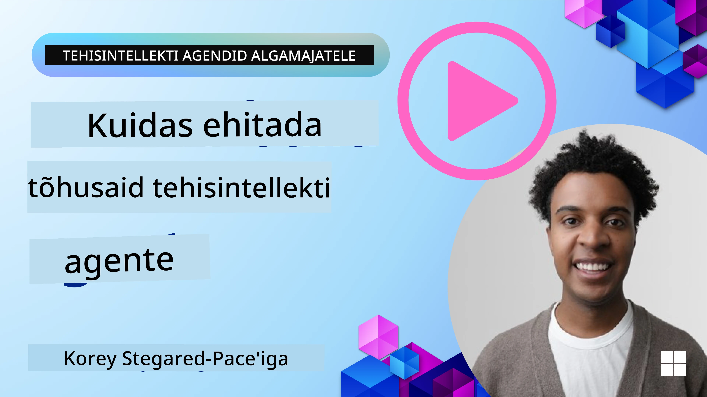
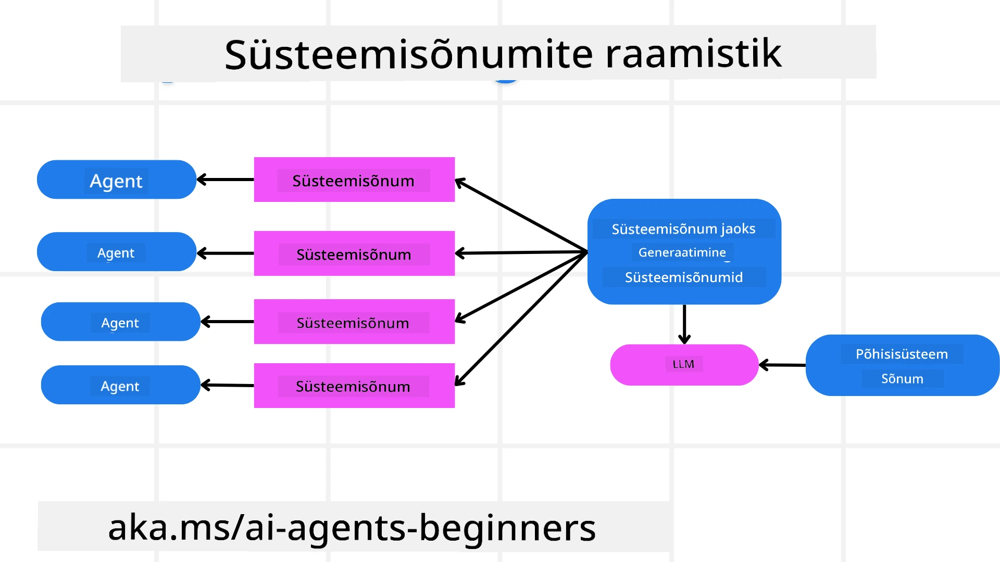
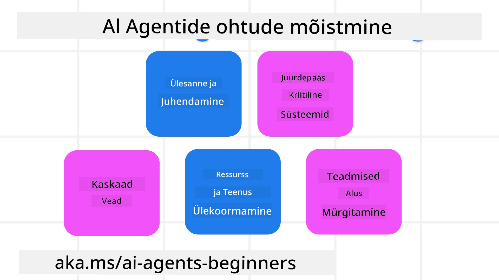
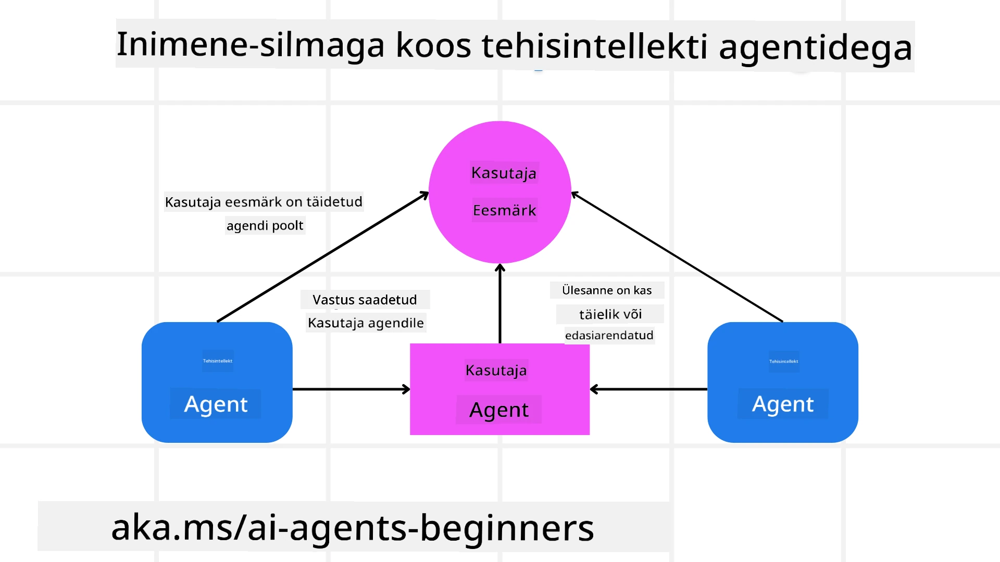

<!--
CO_OP_TRANSLATOR_METADATA:
{
  "original_hash": "498802b4c3c3cc486b86f27a12cebb34",
  "translation_date": "2025-10-11T11:06:39+00:00",
  "source_file": "06-building-trustworthy-agents/README.md",
  "language_code": "et"
}
-->
[](https://youtu.be/iZKkMEGBCUQ?si=Q-kEbcyHUMPoHp8L)

> _(Klõpsake ülaloleval pildil, et vaadata selle õppetunni videot)_

# Usaldusväärsete AI-agentide loomine

## Sissejuhatus

Selles õppetunnis käsitletakse:

- Kuidas luua ja juurutada turvalisi ja tõhusaid AI-agente
- Olulisi turvakaalutlusi AI-agentide arendamisel
- Kuidas tagada andmete ja kasutajate privaatsus AI-agentide arendamisel

## Õpieesmärgid

Pärast selle õppetunni läbimist oskate:

- Tuvastada ja leevendada riske AI-agentide loomisel
- Rakendada turvameetmeid, et tagada andmete ja juurdepääsu korrektne haldamine
- Luua AI-agente, mis säilitavad andmete privaatsuse ja pakuvad kvaliteetset kasutajakogemust

## Turvalisus

Alustame turvaliste agentlike rakenduste loomisega. Turvalisus tähendab, et AI-agent täidab oma ülesandeid vastavalt kavandatule. Agentlike rakenduste loojatena on meil meetodid ja tööriistad turvalisuse maksimeerimiseks:

### Süsteemisõnumite raamistiku loomine

Kui olete kunagi loonud AI-rakenduse, mis kasutab suuri keelemudeleid (LLM-e), siis teate, kui oluline on kujundada tugev süsteemiprompt või süsteemisõnum. Need promptid määravad reeglid, juhised ja suunised, kuidas LLM kasutajaga ja andmetega suhtleb.

AI-agentide puhul on süsteemiprompt veelgi olulisem, kuna AI-agendid vajavad väga spetsiifilisi juhiseid, et täita neile määratud ülesandeid.

Skaalautuvate süsteemipromptide loomiseks saame kasutada süsteemisõnumite raamistikku, et luua oma rakenduses üks või mitu agenti:



#### Samm 1: Loo meta-süsteemisõnum

Meta-prompti kasutab LLM, et genereerida süsteemipromptid meie loodud agentidele. Kujundame selle mallina, et vajadusel saaks tõhusalt luua mitu agenti.

Siin on näide meta-süsteemisõnumist, mille anname LLM-ile:

```plaintext
You are an expert at creating AI agent assistants. 
You will be provided a company name, role, responsibilities and other
information that you will use to provide a system prompt for.
To create the system prompt, be descriptive as possible and provide a structure that a system using an LLM can better understand the role and responsibilities of the AI assistant. 
```

#### Samm 2: Loo põhiprompt

Järgmine samm on luua põhiprompt, mis kirjeldab AI-agenti. Selles tuleks määratleda agendi roll, ülesanded, mida agent täidab, ja muud vastutusalad.

Näide:

```plaintext
You are a travel agent for Contoso Travel that is great at booking flights for customers. To help customers you can perform the following tasks: lookup available flights, book flights, ask for preferences in seating and times for flights, cancel any previously booked flights and alert customers on any delays or cancellations of flights.  
```

#### Samm 3: Esita LLM-ile põhisüsteemisõnum

Nüüd saame optimeerida seda süsteemisõnumit, esitades meta-süsteemisõnumi süsteemisõnumina ja lisades oma põhisüsteemisõnumi.

See loob süsteemisõnumi, mis on paremini kohandatud meie AI-agentide juhendamiseks:

```markdown
**Company Name:** Contoso Travel  
**Role:** Travel Agent Assistant

**Objective:**  
You are an AI-powered travel agent assistant for Contoso Travel, specializing in booking flights and providing exceptional customer service. Your main goal is to assist customers in finding, booking, and managing their flights, all while ensuring that their preferences and needs are met efficiently.

**Key Responsibilities:**

1. **Flight Lookup:**
    
    - Assist customers in searching for available flights based on their specified destination, dates, and any other relevant preferences.
    - Provide a list of options, including flight times, airlines, layovers, and pricing.
2. **Flight Booking:**
    
    - Facilitate the booking of flights for customers, ensuring that all details are correctly entered into the system.
    - Confirm bookings and provide customers with their itinerary, including confirmation numbers and any other pertinent information.
3. **Customer Preference Inquiry:**
    
    - Actively ask customers for their preferences regarding seating (e.g., aisle, window, extra legroom) and preferred times for flights (e.g., morning, afternoon, evening).
    - Record these preferences for future reference and tailor suggestions accordingly.
4. **Flight Cancellation:**
    
    - Assist customers in canceling previously booked flights if needed, following company policies and procedures.
    - Notify customers of any necessary refunds or additional steps that may be required for cancellations.
5. **Flight Monitoring:**
    
    - Monitor the status of booked flights and alert customers in real-time about any delays, cancellations, or changes to their flight schedule.
    - Provide updates through preferred communication channels (e.g., email, SMS) as needed.

**Tone and Style:**

- Maintain a friendly, professional, and approachable demeanor in all interactions with customers.
- Ensure that all communication is clear, informative, and tailored to the customer's specific needs and inquiries.

**User Interaction Instructions:**

- Respond to customer queries promptly and accurately.
- Use a conversational style while ensuring professionalism.
- Prioritize customer satisfaction by being attentive, empathetic, and proactive in all assistance provided.

**Additional Notes:**

- Stay updated on any changes to airline policies, travel restrictions, and other relevant information that could impact flight bookings and customer experience.
- Use clear and concise language to explain options and processes, avoiding jargon where possible for better customer understanding.

This AI assistant is designed to streamline the flight booking process for customers of Contoso Travel, ensuring that all their travel needs are met efficiently and effectively.

```

#### Samm 4: Iteratsioon ja täiustamine

Selle süsteemisõnumite raamistiku väärtus seisneb selles, et see lihtsustab mitme agendi süsteemisõnumite loomist ja võimaldab aja jooksul süsteemisõnumeid täiustada. Harva on süsteemisõnum, mis töötab esimesel korral kogu kasutusjuhtumi jaoks. Väikeste muudatuste ja täiustuste tegemine, muutes põhisüsteemisõnumit ja lastes selle süsteemist läbi, võimaldab tulemusi võrrelda ja hinnata.

## Ohtude mõistmine

Usaldusväärsete AI-agentide loomiseks on oluline mõista ja leevendada riske ja ohte, mis võivad AI-agenti mõjutada. Vaatame mõningaid erinevaid ohte ja kuidas nende vastu paremini valmistuda.



### Ülesanded ja juhised

**Kirjeldus:** Ründajad püüavad muuta AI-agendi juhiseid või eesmärke, kasutades promptide või sisendite manipuleerimist.

**Leevendamine:** Tehke valideerimiskontrolle ja sisendifiltreid, et tuvastada potentsiaalselt ohtlikud promptid enne, kui need AI-agentis töödeldakse. Kuna sellised rünnakud nõuavad tavaliselt sagedast suhtlust agendiga, on vestluse käikude arvu piiramine veel üks viis nende rünnakute vältimiseks.

### Juurdepääs kriitilistele süsteemidele

**Kirjeldus:** Kui AI-agentil on juurdepääs süsteemidele ja teenustele, mis salvestavad tundlikke andmeid, võivad ründajad kompromiteerida suhtlust agendi ja nende teenuste vahel. Need võivad olla otsesed rünnakud või kaudsed katsed saada teavet nende süsteemide kohta agendi kaudu.

**Leevendamine:** AI-agentidel peaks olema juurdepääs süsteemidele ainult vajaduse korral, et selliseid rünnakuid vältida. Suhtlus agendi ja süsteemi vahel peaks olema turvaline. Autentimise ja juurdepääsukontrolli rakendamine on veel üks viis selle teabe kaitsmiseks.

### Ressursside ja teenuste ülekoormus

**Kirjeldus:** AI-agendid saavad kasutada erinevaid tööriistu ja teenuseid ülesannete täitmiseks. Ründajad võivad seda võimet ära kasutada, saates AI-agendi kaudu suure hulga päringuid, mis võib põhjustada süsteemide tõrkeid või kõrgeid kulusid.

**Leevendamine:** Rakendage poliitikaid, mis piiravad AI-agendi poolt teenusele tehtavate päringute arvu. Vestluse käikude ja AI-agendile tehtavate päringute arvu piiramine on veel üks viis selliste rünnakute vältimiseks.

### Teadmusbaasi mürgitamine

**Kirjeldus:** Seda tüüpi rünnak ei sihi otseselt AI-agenti, vaid sihib teadmistebaasi ja muid teenuseid, mida AI-agent kasutab. See võib hõlmata andmete või teabe rikkumist, mida AI-agent kasutab ülesande täitmiseks, põhjustades kallutatud või soovimatuid vastuseid kasutajale.

**Leevendamine:** Kontrollige regulaarselt andmeid, mida AI-agent oma töövoogudes kasutab. Veenduge, et juurdepääs nendele andmetele on turvaline ja muudatusi teevad ainult usaldusväärsed isikud, et vältida sellist tüüpi rünnakuid.

### Kaskaadvead

**Kirjeldus:** AI-agendid kasutavad erinevaid tööriistu ja teenuseid ülesannete täitmiseks. Ründajate põhjustatud vead võivad viia teiste süsteemide tõrgeteni, millega AI-agent on ühendatud, muutes rünnaku ulatuslikumaks ja raskemini lahendatavaks.

**Leevendamine:** Üks meetod selle vältimiseks on lasta AI-agendil töötada piiratud keskkonnas, näiteks täita ülesandeid Docker-konteineris, et vältida otseseid süsteemirünnakuid. Tagavaramehhanismide ja uuesti proovimise loogika loomine, kui teatud süsteemid vastavad veaga, on veel üks viis suuremate süsteemitõrgete vältimiseks.

## Inimene protsessis

Teine tõhus viis usaldusväärsete AI-agendisüsteemide loomiseks on kasutada inimese osalust protsessis. See loob voolu, kus kasutajad saavad agentidele jooksvalt tagasisidet anda. Kasutajad toimivad sisuliselt mitmeagendisüsteemi agentidena, andes heakskiidu või lõpetades protsessi.



Siin on koodinäide AutoGeni kasutamisest, mis näitab, kuidas seda kontseptsiooni rakendatakse:

```python

# Create the agents.
model_client = OpenAIChatCompletionClient(model="gpt-4o-mini")
assistant = AssistantAgent("assistant", model_client=model_client)
user_proxy = UserProxyAgent("user_proxy", input_func=input)  # Use input() to get user input from console.

# Create the termination condition which will end the conversation when the user says "APPROVE".
termination = TextMentionTermination("APPROVE")

# Create the team.
team = RoundRobinGroupChat([assistant, user_proxy], termination_condition=termination)

# Run the conversation and stream to the console.
stream = team.run_stream(task="Write a 4-line poem about the ocean.")
# Use asyncio.run(...) when running in a script.
await Console(stream)

```

## Kokkuvõte

Usaldusväärsete AI-agentide loomine nõuab hoolikat disaini, tugevaid turvameetmeid ja pidevat täiustamist. Struktureeritud meta-promptide süsteemide rakendamise, võimalike ohtude mõistmise ja leevendusstrateegiate kasutamise abil saavad arendajad luua AI-agente, mis on nii turvalised kui ka tõhusad. Lisaks tagab inimese osaluse lisamine protsessi, et AI-agendid jäävad kasutajate vajadustega kooskõlla, vähendades samal ajal riske. Kuna AI areneb pidevalt, on oluline säilitada proaktiivne lähenemine turvalisusele, privaatsusele ja eetilistele kaalutlustele, et edendada usaldust ja töökindlust AI-põhistes süsteemides.

### Kas teil on rohkem küsimusi usaldusväärsete AI-agentide loomise kohta?

Liituge [Azure AI Foundry Discordiga](https://aka.ms/ai-agents/discord), et kohtuda teiste õppijatega, osaleda vastuvõtutundides ja saada vastuseid oma AI-agentide küsimustele.

## Lisamaterjalid

- <a href="https://learn.microsoft.com/azure/ai-studio/responsible-use-of-ai-overview" target="_blank">Vastutustundliku AI ülevaade</a>
- <a href="https://learn.microsoft.com/azure/ai-studio/concepts/evaluation-approach-gen-ai" target="_blank">Generatiivsete AI mudelite ja rakenduste hindamine</a>
- <a href="https://learn.microsoft.com/azure/ai-services/openai/concepts/system-message?context=%2Fazure%2Fai-studio%2Fcontext%2Fcontext&tabs=top-techniques" target="_blank">Turvalisuse süsteemisõnumid</a>
- <a href="https://blogs.microsoft.com/wp-content/uploads/prod/sites/5/2022/06/Microsoft-RAI-Impact-Assessment-Template.pdf?culture=en-us&country=us" target="_blank">Riskihindamise mall</a>

## Eelmine õppetund

[Agentlik RAG](../05-agentic-rag/README.md)

## Järgmine õppetund

[Planeerimise disainimuster](../07-planning-design/README.md)

---

**Lahtiütlus**:  
See dokument on tõlgitud AI tõlketeenuse [Co-op Translator](https://github.com/Azure/co-op-translator) abil. Kuigi püüame tagada täpsust, palume arvestada, et automaatsed tõlked võivad sisaldada vigu või ebatäpsusi. Algne dokument selle algses keeles tuleks pidada autoriteetseks allikaks. Olulise teabe puhul soovitame kasutada professionaalset inimtõlget. Me ei vastuta selle tõlke kasutamisest tulenevate arusaamatuste või valesti tõlgenduste eest.