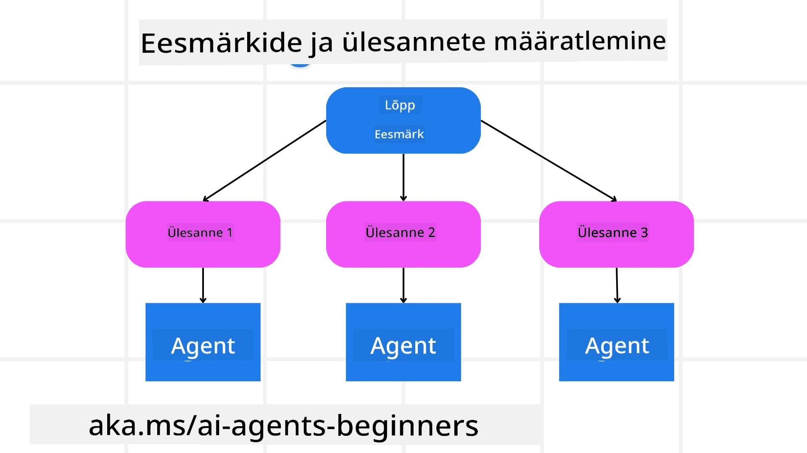

<!--
CO_OP_TRANSLATOR_METADATA:
{
  "original_hash": "43069833a0412210ad5c3cc93d9c2146",
  "translation_date": "2025-10-11T11:24:01+00:00",
  "source_file": "07-planning-design/README.md",
  "language_code": "et"
}
-->
[](https://youtu.be/kPfJ2BrBCMY?si=9pYpPXp0sSbK91Dr)

> _(Klõpsa ülaloleval pildil, et vaadata selle õppetunni videot)_

# Planeerimise disain

## Sissejuhatus

Selles õppetunnis käsitletakse:

* Selge üldeesmärgi määratlemist ja keeruka ülesande jagamist hallatavateks osadeks.
* Struktureeritud väljundi kasutamist usaldusväärsemate ja masinloetavate vastuste saamiseks.
* Sündmustepõhise lähenemise rakendamist dünaamiliste ülesannete ja ootamatute sisendite käsitlemiseks.

## Õppeesmärgid

Pärast selle õppetunni läbimist mõistad:

* Kuidas määratleda ja seada AI agendile üldeesmärk, tagades, et see teab täpselt, mida tuleb saavutada.
* Kuidas jagada keerukas ülesanne hallatavateks alamülesanneteks ja korraldada need loogilisse järjestusse.
* Kuidas varustada agente õigete tööriistadega (nt otsingutööriistad või andmeanalüüsitööriistad), otsustada, millal ja kuidas neid kasutada, ning käsitleda ootamatuid olukordi.
* Kuidas hinnata alamülesannete tulemusi, mõõta jõudlust ja korrigeerida tegevusi, et parandada lõpptulemust.

## Üldeesmärgi määratlemine ja ülesande jagamine



Enamik päriselu ülesandeid on liiga keerulised, et neid ühe sammuga lahendada. AI agent vajab konkreetset eesmärki, mis juhiks selle planeerimist ja tegevusi. Näiteks võib eesmärk olla:

    "Koosta 3-päevane reisikava."

Kuigi see on lihtne öelda, vajab see siiski täpsustamist. Mida selgem on eesmärk, seda paremini suudavad agent (ja kõik inimkaastöötajad) keskenduda õige tulemuse saavutamisele, näiteks koostada põhjalik reisikava koos lennuvalikute, hotellisoovituste ja tegevuste ettepanekutega.

### Ülesande jagamine

Suured või keerulised ülesanded muutuvad hallatavamaks, kui need jagatakse väiksemateks, eesmärgipõhisteks alamülesanneteks. Reisikava näite puhul võiks eesmärgi jagada järgmiselt:

* Lennupiletite broneerimine
* Hotelli broneerimine
* Autorendi korraldamine
* Isikupärastamine

Iga alamülesannet saab seejärel lahendada spetsialiseerunud agentide või protsesside abil. Üks agent võib spetsialiseeruda parimate lennupakkumiste otsimisele, teine keskendub hotellibroneeringutele jne. Koordineeriv või "järgmine" agent saab seejärel need tulemused koondada ühtseks reisikavaks lõppkasutajale.

See modulaarne lähenemine võimaldab ka järkjärgulisi täiustusi. Näiteks võiks lisada spetsialiseerunud agente toidusoovituste või kohalike tegevuste ettepanekute jaoks ja aja jooksul reisikava täiustada.

### Struktureeritud väljund

Suured keelemudelid (LLM-id) suudavad genereerida struktureeritud väljundeid (nt JSON), mida on lihtsam alluvatel agentidel või teenustel analüüsida ja töödelda. See on eriti kasulik mitme agendi kontekstis, kus ülesandeid saab täita pärast planeerimisväljundi saamist. Vaata seda <a href="https://microsoft.github.io/autogen/stable/user-guide/core-user-guide/cookbook/structured-output-agent.html" target="_blank">blogipostitust</a> kiireks ülevaateks.

Järgmine Python'i koodinäide demonstreerib lihtsat planeerimisagenti, mis jagab eesmärgi alamülesanneteks ja genereerib struktureeritud plaani:

```python
from pydantic import BaseModel
from enum import Enum
from typing import List, Optional, Union
import json
import os
from typing import Optional
from pprint import pprint
from autogen_core.models import UserMessage, SystemMessage, AssistantMessage
from autogen_ext.models.azure import AzureAIChatCompletionClient
from azure.core.credentials import AzureKeyCredential

class AgentEnum(str, Enum):
    FlightBooking = "flight_booking"
    HotelBooking = "hotel_booking"
    CarRental = "car_rental"
    ActivitiesBooking = "activities_booking"
    DestinationInfo = "destination_info"
    DefaultAgent = "default_agent"
    GroupChatManager = "group_chat_manager"

# Travel SubTask Model
class TravelSubTask(BaseModel):
    task_details: str
    assigned_agent: AgentEnum  # we want to assign the task to the agent

class TravelPlan(BaseModel):
    main_task: str
    subtasks: List[TravelSubTask]
    is_greeting: bool

client = AzureAIChatCompletionClient(
    model="gpt-4o-mini",
    endpoint="https://models.inference.ai.azure.com",
    # To authenticate with the model you will need to generate a personal access token (PAT) in your GitHub settings.
    # Create your PAT token by following instructions here: https://docs.github.com/en/authentication/keeping-your-account-and-data-secure/managing-your-personal-access-tokens
    credential=AzureKeyCredential(os.environ["GITHUB_TOKEN"]),
    model_info={
        "json_output": False,
        "function_calling": True,
        "vision": True,
        "family": "unknown",
    },
)

# Define the user message
messages = [
    SystemMessage(content="""You are an planner agent.
    Your job is to decide which agents to run based on the user's request.
                      Provide your response in JSON format with the following structure:
{'main_task': 'Plan a family trip from Singapore to Melbourne.',
 'subtasks': [{'assigned_agent': 'flight_booking',
               'task_details': 'Book round-trip flights from Singapore to '
                               'Melbourne.'}
    Below are the available agents specialised in different tasks:
    - FlightBooking: For booking flights and providing flight information
    - HotelBooking: For booking hotels and providing hotel information
    - CarRental: For booking cars and providing car rental information
    - ActivitiesBooking: For booking activities and providing activity information
    - DestinationInfo: For providing information about destinations
    - DefaultAgent: For handling general requests""", source="system"),
    UserMessage(
        content="Create a travel plan for a family of 2 kids from Singapore to Melboune", source="user"),
]

response = await client.create(messages=messages, extra_create_args={"response_format": 'json_object'})

response_content: Optional[str] = response.content if isinstance(
    response.content, str) else None
if response_content is None:
    raise ValueError("Response content is not a valid JSON string" )

pprint(json.loads(response_content))

# # Ensure the response content is a valid JSON string before loading it
# response_content: Optional[str] = response.content if isinstance(
#     response.content, str) else None
# if response_content is None:
#     raise ValueError("Response content is not a valid JSON string")

# # Print the response content after loading it as JSON
# pprint(json.loads(response_content))

# Validate the response content with the MathReasoning model
# TravelPlan.model_validate(json.loads(response_content))
```

### Planeerimisagent mitme agendi orkestreerimisega

Selles näites võtab Semantiline Router Agent vastu kasutaja päringu (nt "Mul on vaja hotelli plaani oma reisiks.").

Planeerija:

* Võtab vastu hotelli plaani: Planeerija võtab kasutaja sõnumi ja genereerib struktureeritud reisiplaani, tuginedes süsteemi juhistele (sealhulgas olemasolevate agentide üksikasjadele).
* Loetleb agendid ja nende tööriistad: Agentide register sisaldab nimekirja agentidest (nt lennu, hotelli, autorendi ja tegevuste jaoks) koos nende pakutavate funktsioonide või tööriistadega.
* Suunab plaani vastavatele agentidele: Sõltuvalt alamülesannete arvust saadab planeerija sõnumi kas otse spetsiaalsele agendile (ühe ülesande stsenaariumide korral) või koordineerib grupivestluse halduri kaudu mitme agendi koostööks.
* Kokkuvõte tulemusest: Lõpuks võtab planeerija kokku genereeritud plaani selguse huvides.
Järgmine Python'i koodinäide illustreerib neid samme:

```python

from pydantic import BaseModel

from enum import Enum
from typing import List, Optional, Union

class AgentEnum(str, Enum):
    FlightBooking = "flight_booking"
    HotelBooking = "hotel_booking"
    CarRental = "car_rental"
    ActivitiesBooking = "activities_booking"
    DestinationInfo = "destination_info"
    DefaultAgent = "default_agent"
    GroupChatManager = "group_chat_manager"

# Travel SubTask Model

class TravelSubTask(BaseModel):
    task_details: str
    assigned_agent: AgentEnum # we want to assign the task to the agent

class TravelPlan(BaseModel):
    main_task: str
    subtasks: List[TravelSubTask]
    is_greeting: bool
import json
import os
from typing import Optional

from autogen_core.models import UserMessage, SystemMessage, AssistantMessage
from autogen_ext.models.openai import AzureOpenAIChatCompletionClient

# Create the client with type-checked environment variables

client = AzureOpenAIChatCompletionClient(
    azure_deployment=os.getenv("AZURE_OPENAI_DEPLOYMENT_NAME"),
    model=os.getenv("AZURE_OPENAI_DEPLOYMENT_NAME"),
    api_version=os.getenv("AZURE_OPENAI_API_VERSION"),
    azure_endpoint=os.getenv("AZURE_OPENAI_ENDPOINT"),
    api_key=os.getenv("AZURE_OPENAI_API_KEY"),
)

from pprint import pprint

# Define the user message

messages = [
    SystemMessage(content="""You are an planner agent.
    Your job is to decide which agents to run based on the user's request.
    Below are the available agents specialized in different tasks:
    - FlightBooking: For booking flights and providing flight information
    - HotelBooking: For booking hotels and providing hotel information
    - CarRental: For booking cars and providing car rental information
    - ActivitiesBooking: For booking activities and providing activity information
    - DestinationInfo: For providing information about destinations
    - DefaultAgent: For handling general requests""", source="system"),
    UserMessage(content="Create a travel plan for a family of 2 kids from Singapore to Melbourne", source="user"),
]

response = await client.create(messages=messages, extra_create_args={"response_format": TravelPlan})

# Ensure the response content is a valid JSON string before loading it

response_content: Optional[str] = response.content if isinstance(response.content, str) else None
if response_content is None:
    raise ValueError("Response content is not a valid JSON string")

# Print the response content after loading it as JSON

pprint(json.loads(response_content))
```

Eelneva koodi väljundit saab kasutada struktureeritud väljundina, et suunata `assigned_agent`-ile ja kokku võtta reisiplaan lõppkasutajale.

```json
{
    "is_greeting": "False",
    "main_task": "Plan a family trip from Singapore to Melbourne.",
    "subtasks": [
        {
            "assigned_agent": "flight_booking",
            "task_details": "Book round-trip flights from Singapore to Melbourne."
        },
        {
            "assigned_agent": "hotel_booking",
            "task_details": "Find family-friendly hotels in Melbourne."
        },
        {
            "assigned_agent": "car_rental",
            "task_details": "Arrange a car rental suitable for a family of four in Melbourne."
        },
        {
            "assigned_agent": "activities_booking",
            "task_details": "List family-friendly activities in Melbourne."
        },
        {
            "assigned_agent": "destination_info",
            "task_details": "Provide information about Melbourne as a travel destination."
        }
    ]
}
```

Näidispäevik eelneva koodinäitega on saadaval [siin](07-autogen.ipynb).

### Iteratiivne planeerimine

Mõned ülesanded nõuavad edasi-tagasi suhtlust või ümberplaneerimist, kus ühe alamülesande tulemus mõjutab järgmist. Näiteks, kui agent avastab lennupiletite broneerimisel ootamatu andmeformaadi, võib see vajada strateegia kohandamist enne hotellibroneeringute juurde liikumist.

Lisaks võib kasutaja tagasiside (nt inimene otsustab, et eelistab varasemat lendu) käivitada osalise ümberplaneerimise. See dünaamiline, iteratiivne lähenemine tagab, et lõplik lahendus vastab päriselu piirangutele ja muutuvatele kasutaja eelistustele.

Näide koodist:

```python
from autogen_core.models import UserMessage, SystemMessage, AssistantMessage
#.. same as previous code and pass on the user history, current plan
messages = [
    SystemMessage(content="""You are a planner agent to optimize the
    Your job is to decide which agents to run based on the user's request.
    Below are the available agents specialized in different tasks:
    - FlightBooking: For booking flights and providing flight information
    - HotelBooking: For booking hotels and providing hotel information
    - CarRental: For booking cars and providing car rental information
    - ActivitiesBooking: For booking activities and providing activity information
    - DestinationInfo: For providing information about destinations
    - DefaultAgent: For handling general requests""", source="system"),
    UserMessage(content="Create a travel plan for a family of 2 kids from Singapore to Melbourne", source="user"),
    AssistantMessage(content=f"Previous travel plan - {TravelPlan}", source="assistant")
]
# .. re-plan and send the tasks to respective agents
```

Täpsema planeerimise jaoks vaata Magnetic One <a href="https://www.microsoft.com/research/articles/magentic-one-a-generalist-multi-agent-system-for-solving-complex-tasks" target="_blank">blogipostitust</a>, mis käsitleb keeruliste ülesannete lahendamist.

## Kokkuvõte

Selles artiklis vaatasime näidet, kuidas luua planeerijat, mis suudab dünaamiliselt valida määratletud agendid. Planeerija väljund jagab ülesanded ja määrab agendid, et need saaksid täidetud. Eeldatakse, et agentidel on juurdepääs funktsioonidele/tööriistadele, mis on vajalikud ülesande täitmiseks. Lisaks agentidele saab lisada muid mustreid, nagu refleksioon, kokkuvõtja ja ringvestlus, et veelgi kohandada.

## Täiendavad ressursid

AutoGen Magnetic One - Üldine mitme agendi süsteem keeruliste ülesannete lahendamiseks, mis on saavutanud muljetavaldavaid tulemusi mitmel keerulisel agentide võrdlusalusel. Viide: <a href="https://github.com/microsoft/autogen/tree/main/python/packages/autogen-magentic-one" target="_blank">autogen-magentic-one</a>. Selles rakenduses loob orkestreerija ülesandespetsiifilise plaani ja delegeerib need ülesanded olemasolevatele agentidele. Lisaks planeerimisele kasutab orkestreerija ka jälgimismehhanismi, et jälgida ülesande edenemist ja vajadusel ümber planeerida.

### Kas sul on rohkem küsimusi planeerimise disainimustri kohta?

Liitu [Azure AI Foundry Discordiga](https://aka.ms/ai-agents/discord), et kohtuda teiste õppijatega, osaleda vastuvõtutundides ja saada vastuseid oma AI agentide küsimustele.

## Eelmine õppetund

[Usaldusväärsete AI agentide loomine](../06-building-trustworthy-agents/README.md)

## Järgmine õppetund

[Mitme agendi disainimuster](../08-multi-agent/README.md)

---

**Lahtiütlus**:  
See dokument on tõlgitud AI tõlketeenuse [Co-op Translator](https://github.com/Azure/co-op-translator) abil. Kuigi püüame tagada täpsust, palume arvestada, et automaatsed tõlked võivad sisaldada vigu või ebatäpsusi. Algne dokument selle algses keeles tuleks pidada autoriteetseks allikaks. Olulise teabe puhul soovitame kasutada professionaalset inimtõlget. Me ei vastuta selle tõlke kasutamisest tulenevate arusaamatuste või valesti tõlgenduste eest.