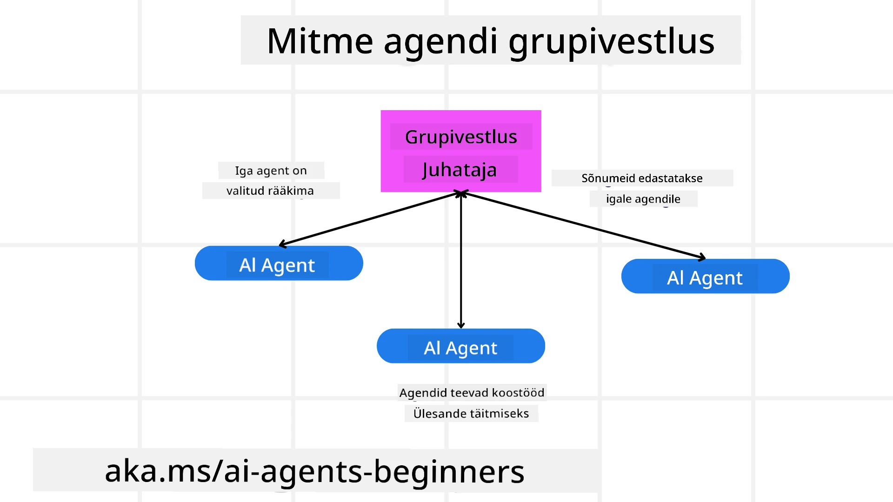
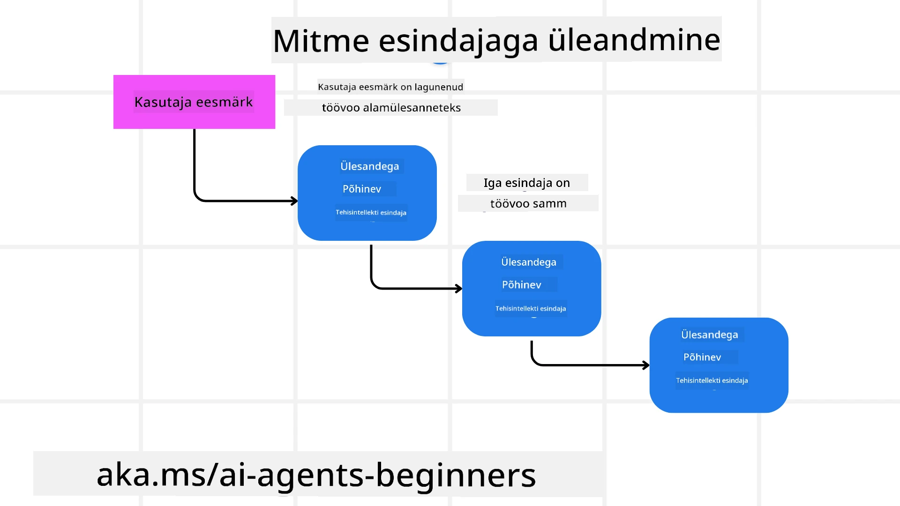
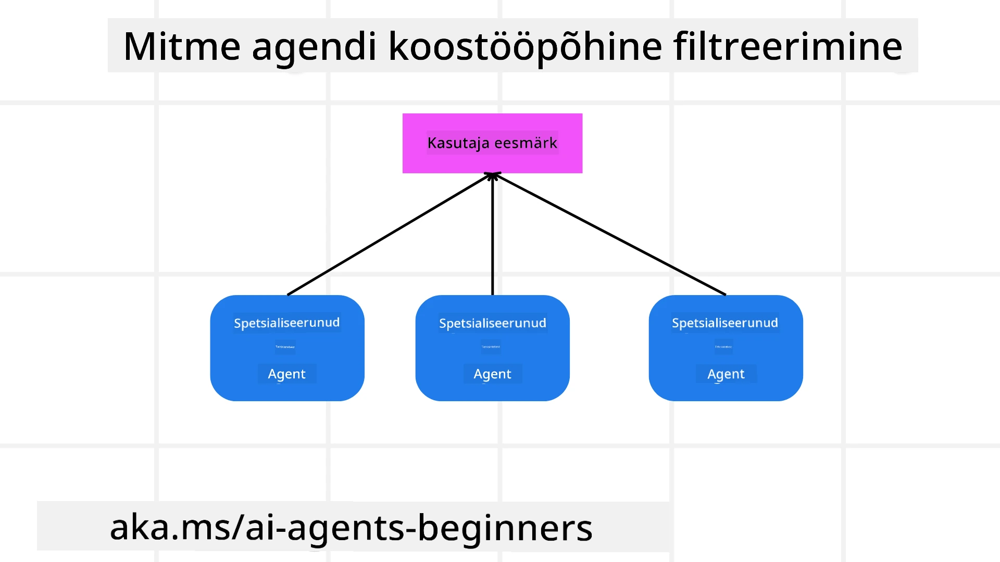

<!--
CO_OP_TRANSLATOR_METADATA:
{
  "original_hash": "1a008c204051cba8d0e253b75f261c41",
  "translation_date": "2025-10-11T11:07:57+00:00",
  "source_file": "08-multi-agent/README.md",
  "language_code": "et"
}
-->

> _(Klõpsa ülaloleval pildil, et vaadata selle õppetunni videot)_

# Mitmeagendi disainimustrid

Niipea kui hakkate töötama projektiga, mis hõlmab mitut agenti, peate kaaluma mitmeagendi disainimustrit. Kuid ei pruugi kohe olla selge, millal mitmeagendi süsteemile üle minna ja millised on selle eelised.

## Sissejuhatus

Selles õppetunnis püüame vastata järgmistele küsimustele:

- Millistes olukordades on mitmeagendi süsteem rakendatav?
- Millised on mitmeagendi kasutamise eelised võrreldes üheainsa agendiga, kes täidab mitut ülesannet?
- Millised on mitmeagendi disainimustri rakendamise põhielemendid?
- Kuidas saada ülevaadet sellest, kuidas mitmed agendid omavahel suhtlevad?

## Õppeesmärgid

Pärast seda õppetundi peaksite olema võimeline:

- Tuvastama olukordi, kus mitmeagendi süsteem on rakendatav.
- Mõistma mitmeagendi kasutamise eeliseid võrreldes üheainsa agendiga.
- Mõistma mitmeagendi disainimustri rakendamise põhielemente.

Mis on suurem pilt?

*Mitmeagendi süsteemid on disainimuster, mis võimaldab mitmel agendil koos töötada ühise eesmärgi saavutamiseks.*

See muster on laialdaselt kasutusel erinevates valdkondades, sealhulgas robootikas, autonoomsetes süsteemides ja hajutatud arvutustes.

## Olukorrad, kus mitmeagendi süsteem on rakendatav

Millised olukorrad on sobivad mitmeagendi süsteemi kasutamiseks? Vastus on, et mitmeagendi kasutamine on kasulik paljudes olukordades, eriti järgmistel juhtudel:

- **Suured töökoormused**: Suured töökoormused saab jagada väiksemateks ülesanneteks ja määrata erinevatele agentidele, võimaldades paralleelset töötlemist ja kiiremat lõpetamist. Näiteks suurte andmetöötlusülesannete puhul.
- **Komplekssed ülesanded**: Komplekssed ülesanded, nagu suured töökoormused, saab jagada väiksemateks alamülesanneteks ja määrata erinevatele agentidele, kes on spetsialiseerunud konkreetsele ülesande aspektile. Hea näide on autonoomsed sõidukid, kus erinevad agendid haldavad navigeerimist, takistuste tuvastamist ja suhtlust teiste sõidukitega.
- **Mitmekesine ekspertiis**: Erinevatel agentidel võib olla mitmekesine ekspertiis, mis võimaldab neil käsitleda ülesande erinevaid aspekte tõhusamalt kui üksainus agent. Näiteks tervishoius, kus agendid haldavad diagnostikat, raviplaane ja patsientide jälgimist.

## Mitmeagendi kasutamise eelised võrreldes üheainsa agendiga

Üheainsa agendi süsteem võib hästi toimida lihtsate ülesannete puhul, kuid keerukamate ülesannete puhul võib mitmeagendi kasutamine pakkuda mitmeid eeliseid:

- **Spetsialiseerumine**: Iga agent saab spetsialiseeruda konkreetsele ülesandele. Üheainsa agendi puhul puudub spetsialiseerumine, mis tähendab, et agent võib küll teha kõike, kuid keeruka ülesande korral võib ta segadusse sattuda ja teha midagi, milleks ta pole parim.
- **Mastaapsus**: Süsteeme on lihtsam laiendada, lisades rohkem agente, mitte koormates ühte agenti üle.
- **Tõrkekindlus**: Kui üks agent ebaõnnestub, saavad teised jätkata, tagades süsteemi töökindluse.

Võtame näiteks reisibroneeringu. Üheainsa agendi süsteem peaks haldama kõiki reisibroneeringu protsessi aspekte, alates lendude leidmisest kuni hotellide ja rendiautode broneerimiseni. Selleks peaks agentil olema tööriistad kõigi nende ülesannete täitmiseks, mis võib viia keeruka ja monoliitse süsteemini, mida on raske hooldada ja laiendada. Mitmeagendi süsteem võiks aga kasutada erinevaid agente, kes on spetsialiseerunud lendude leidmisele, hotellide broneerimisele ja rendiautodele. See muudaks süsteemi modulaarsemaks, lihtsamini hooldatavaks ja mastaapselt laiendatavaks.

Võrdleme seda reisibürooga, mida juhib väike pereettevõte, ja reisibürooga, mis on frantsiis. Pereettevõttes haldab üks agent kõiki reisibroneeringu protsessi aspekte, samas kui frantsiisis haldavad erinevad agendid erinevaid protsessi aspekte.

## Mitmeagendi disainimustri rakendamise põhielemendid

Enne mitmeagendi disainimustri rakendamist peate mõistma mustri põhielemente.

Teeme selle konkreetsemaks, vaadates taas reisibroneeringu näidet. Sel juhul oleksid põhielemendid järgmised:

- **Agendi kommunikatsioon**: Lennupiletite leidmise, hotellide broneerimise ja rendiautode agendid peavad suhtlema ja jagama teavet kasutaja eelistuste ja piirangute kohta. Peate otsustama, millised protokollid ja meetodid selleks kommunikatsiooniks sobivad. Näiteks lennupiletite leidmise agent peab suhtlema hotellide broneerimise agendiga, et tagada hotelli broneerimine samadeks kuupäevadeks kui lend. See tähendab, et agendid peavad jagama teavet kasutaja reisikuupäevade kohta, mis tähendab, et peate otsustama *millised agendid jagavad infot ja kuidas nad seda teevad*.
- **Koordineerimismehhanismid**: Agendid peavad koordineerima oma tegevusi, et tagada kasutaja eelistuste ja piirangute täitmine. Näiteks võib kasutaja eelistada hotelli, mis asub lennujaama lähedal, samas kui piiranguks võib olla, et rendiautod on saadaval ainult lennujaamas. See tähendab, et hotellide broneerimise agent peab koordineerima rendiautode broneerimise agendiga, et tagada kasutaja eelistuste ja piirangute täitmine. See tähendab, et peate otsustama *kuidas agendid oma tegevusi koordineerivad*.
- **Agendi arhitektuur**: Agendid peavad omama sisemist struktuuri, et teha otsuseid ja õppida oma interaktsioonidest kasutajaga. Näiteks lennupiletite leidmise agent peab omama sisemist struktuuri, et teha otsuseid selle kohta, milliseid lende kasutajale soovitada. See tähendab, et peate otsustama *kuidas agendid teevad otsuseid ja õpivad oma interaktsioonidest kasutajaga*. Näiteks lennupiletite leidmise agent võiks kasutada masinõppe mudelit, et soovitada lende kasutajale nende varasemate eelistuste põhjal.
- **Mitmeagendi interaktsioonide nähtavus**: Peate omama ülevaadet sellest, kuidas mitmed agendid omavahel suhtlevad. See tähendab, et peate omama tööriistu ja tehnikaid agendi tegevuste ja interaktsioonide jälgimiseks. See võib olla logimise ja jälgimise tööriistade, visualiseerimise tööriistade ja jõudlusmõõdikute kujul.
- **Mitmeagendi mustrid**: Mitmeagendi süsteemide rakendamiseks on erinevaid mustreid, nagu tsentraliseeritud, detsentraliseeritud ja hübriidarhitektuurid. Peate otsustama, milline muster sobib teie kasutusjuhtumiga kõige paremini.
- **Inimene protsessis**: Enamasti on protsessis inimene ja peate juhendama agente, millal küsida inimsekkumist. Näiteks võib kasutaja küsida konkreetset hotelli või lendu, mida agendid pole soovitanud, või küsida kinnitust enne lennu või hotelli broneerimist.

## Mitmeagendi interaktsioonide nähtavus

Oluline on omada ülevaadet sellest, kuidas mitmed agendid omavahel suhtlevad. See nähtavus on oluline süsteemi silumiseks, optimeerimiseks ja üldise tõhususe tagamiseks. Selle saavutamiseks peate omama tööriistu ja tehnikaid agendi tegevuste ja interaktsioonide jälgimiseks. See võib olla logimise ja jälgimise tööriistade, visualiseerimise tööriistade ja jõudlusmõõdikute kujul.

Näiteks reisibroneeringu puhul võiks teil olla armatuurlaud, mis näitab iga agendi staatust, kasutaja eelistusi ja piiranguid ning agentide vahelisi interaktsioone. See armatuurlaud võiks näidata kasutaja reisikuupäevi, lennupileteid, mida lennupiletite agent soovitab, hotelle, mida hotellide agent soovitab, ja rendiautosid, mida rendiautode agent soovitab. See annaks selge ülevaate sellest, kuidas agendid omavahel suhtlevad ja kas kasutaja eelistused ja piirangud on täidetud.

Vaatame iga aspekti lähemalt.

- **Logimise ja jälgimise tööriistad**: Soovite logida iga agendi tehtud tegevuse. Logikirje võiks sisaldada teavet tegevuse teinud agendi, tehtud tegevuse, tegevuse aja ja tulemuse kohta. Seda teavet saab kasutada silumiseks, optimeerimiseks ja muuks.
- **Visualiseerimise tööriistad**: Visualiseerimise tööriistad aitavad teil näha agentide vahelisi interaktsioone intuitiivsemal viisil. Näiteks võiks teil olla graafik, mis näitab teabevoogu agentide vahel. See aitaks tuvastada kitsaskohti, ebatõhususi ja muid süsteemi probleeme.
- **Jõudlusmõõdikud**: Jõudlusmõõdikud aitavad teil jälgida mitmeagendi süsteemi tõhusust. Näiteks võiks jälgida ülesande täitmiseks kuluvat aega, ajaühikus täidetud ülesannete arvu ja agentide tehtud soovituste täpsust. See teave aitab tuvastada parendamisvõimalusi ja optimeerida süsteemi.

## Mitmeagendi mustrid

Vaatame mõningaid konkreetseid mustreid, mida saame kasutada mitmeagendi rakenduste loomiseks. Siin on mõned huvitavad mustrid, mida tasub kaaluda:

### Grupivestlus

See muster on kasulik, kui soovite luua grupivestluse rakenduse, kus mitmed agendid saavad omavahel suhelda. Tüüpilised kasutusjuhtumid selle mustri jaoks hõlmavad meeskonnatööd, kliendituge ja sotsiaalvõrgustikke.

Selles mustris esindab iga agent grupivestluse kasutajat ning sõnumeid vahetatakse agentide vahel sõnumiprotokolli abil. Agendid saavad saata sõnumeid grupivestlusse, vastu võtta sõnumeid grupivestlusest ja vastata teiste agentide sõnumitele.

Seda mustrit saab rakendada tsentraliseeritud arhitektuuriga, kus kõik sõnumid suunatakse läbi keskserveri, või detsentraliseeritud arhitektuuriga, kus sõnumeid vahetatakse otse.

### Ülesande üleandmine

See muster on kasulik, kui soovite luua rakenduse, kus mitmed agendid saavad ülesandeid üksteisele üle anda.

Tüüpilised kasutusjuhtumid selle mustri jaoks hõlmavad kliendituge, ülesannete haldamist ja töövoo automatiseerimist.

Selles mustris esindab iga agent ülesannet või töövoo sammu ning agendid saavad ülesandeid üksteisele üle anda eelnevalt määratletud reeglite alusel.

### Koostööpõhine filtreerimine

See muster on kasulik, kui soovite luua rakenduse, kus mitmed agendid saavad koostööd teha, et kasutajatele soovitusi anda.

Miks sooviksite, et mitmed agendid teeksid koostööd? Sest iga agent võib omada erinevat ekspertiisi ja panustada soovitusprotsessi erineval viisil.

Võtame näiteks olukorra, kus kasutaja soovib soovitust parima aktsia ostmiseks börsil.

- **Tööstuse ekspert**: Üks agent võiks olla ekspert konkreetses tööstusharus.
- **Tehniline analüüs**: Teine agent võiks olla ekspert tehnilises analüüsis.
- **Fundamentaalne analüüs**: Ja kolmas agent võiks olla ekspert fundamentaalses analüüsis. Koostööd tehes saavad need agendid anda kasutajale põhjalikuma soovituse.

## Olukord: Tagasimakse protsess

Vaatleme olukorda, kus klient püüab saada tagasimakset toote eest. Selles protsessis võib olla kaasatud üsna palju agente, kuid jagame need protsessispetsiifilisteks agentideks ja üldisteks agentideks, mida saab kasutada muudes protsessides.

**Protsessispetsiifilised agendid**:

Järgnevalt on mõned agendid, kes võiksid olla kaasatud tagasimakse protsessi:

- **Kliendi agent**: See agent esindab klienti ja vastutab tagasimakse protsessi algatamise eest.
- **Müüja agent**: See agent esindab müüjat ja vastutab tagasimakse töötlemise eest.
- **Makse agent**: See agent esindab makseprotsessi ja vastutab kliendi makse tagastamise eest.
- **Lahenduse agent**: See agent esindab lahendusprotsessi ja vastutab tagasimakse protsessi käigus tekkivate probleemide lahendamise eest.
- **Vastavuse agent**: See agent esindab vastavusprotsessi ja vastutab tagasimakse protsessi vastavuse tagamise eest regulatsioonidele ja poliitikatele.

**Üldised agendid**:

Need agendid võivad olla kasutatavad teie ettevõtte muudes osades.

- **Saatmise agent**: See agent esindab saatmisprotsessi ja vastutab toote saatmise eest tagasi müüjale. Seda agenti saab kasutada nii tagasimakse protsessis kui ka üldises toote saatmises näiteks ostu korral.
- **Tagasiside agent**: See agent esindab tagasiside protsessi ja vastutab kliendi tagasiside kogumise eest. Tagasisidet võib koguda igal ajal, mitte ainult tagasimakse protsessi käigus.
- **Eskaleerimise agent**: See agent esindab eskaleerimise protsessi ja vastutab probleemide eskaleerimise eest kõrgemale tugitasemele. Seda tüüpi agenti saab kasutada igas protsessis, kus on vaja probleemi eskaleerida.
- **Teavitamise agent**: See agent esindab teavitamise protsessi ja vastutab teavituste saatmise eest kliendile tagasimakse protsessi erinevates etappides.
- **Analüüsi agent**: See agent esindab analüüsi protsessi ja vastutab tagasimakse protsessiga seotud andmete analüüsimise eest.
- **Auditi agent**: See agent esindab auditi protsessi ja vastutab tagasimakse protsessi auditeerimise eest, et tagada selle korrektne läbiviimine.
- **Raporteerimise agent**: See agent esindab raporteerimise protsessi ja vastutab tagasimakse protsessi aruannete koostamise eest.
- **Teadmiste agent**: See agent esindab teadmiste protsessi ja vastutab tagasimakse protsessiga seotud teadmistebaasi haldamise eest. See agent võiks olla teadlik nii tagasimaksetest kui ka teie ettevõtte muudest osadest.
- **Turvalisuse agent**: See agent esindab turvalisuse protsessi ja vastutab tagasimakse protsessi turvalisuse tagamise eest.
- **Kvaliteedi agent**: See agent esindab kvaliteedi protsessi ja vastutab tagasimakse protsessi kvaliteedi tagamise eest.

Eelnevalt loetletud agentide hulk on üsna suur, nii protsessispetsiifiliste kui ka üldiste agentide osas, mida saab kasutada teie ettevõtte muudes osades. Loodetavasti annab see teile idee, kuidas otsustada, milliseid agente kasutada oma mitmeagendi süsteemis.

## Ülesanne
Kujunda mitmeagendiline süsteem klienditoe protsessi jaoks. Määra protsessis osalevad agendid, nende rollid ja vastutusalad ning kuidas nad omavahel suhtlevad. Arvesta nii klienditoe protsessile spetsiifilisi agente kui ka üldiseid agente, mida saab kasutada teistes ärivaldkondades.

> Mõtle enne, kui loed järgmist lahendust – sul võib vaja minna rohkem agente, kui esialgu arvad.

> NÕUANNE: Mõtle klienditoe protsessi erinevatele etappidele ja ka süsteemi jaoks vajalikele agentidele.

## Lahendus

[Lahendus](./solution/solution.md)

## Teadmiste kontroll

Küsimus: Millal peaks kaaluma mitmeagendilise süsteemi kasutamist?

- [ ] A1: Kui töökoormus on väike ja ülesanne lihtne.
- [ ] A2: Kui töökoormus on suur.
- [ ] A3: Kui ülesanne on lihtne.

[Lahenduse viktoriin](./solution/solution-quiz.md)

## Kokkuvõte

Selles õppetükis vaatasime mitmeagendilist disainimustrit, sealhulgas olukordi, kus mitmeagendiline lähenemine on asjakohane, mitmeagendilise süsteemi eeliseid võrreldes üheainsa agendiga, mitmeagendilise disainimustri rakendamise põhielemente ning kuidas saada ülevaadet agentide omavahelisest suhtlusest.

### Kas sul on rohkem küsimusi mitmeagendilise disainimustri kohta?

Liitu [Azure AI Foundry Discordiga](https://aka.ms/ai-agents/discord), et kohtuda teiste õppijatega, osaleda vastuvõtutundides ja saada vastuseid oma AI agentide küsimustele.

## Täiendavad ressursid

- <a href="https://microsoft.github.io/autogen/stable/user-guide/core-user-guide/design-patterns/intro.html" target="_blank">AutoGen disainimustrid</a>
- <a href="https://www.analyticsvidhya.com/blog/2024/10/agentic-design-patterns/" target="_blank">Agentlikud disainimustrid</a>

## Eelmine õppetund

[Planeerimise disain](../07-planning-design/README.md)

## Järgmine õppetund

[Metakognitsioon AI agentides](../09-metacognition/README.md)

---

**Lahtiütlus**:  
See dokument on tõlgitud AI tõlketeenuse [Co-op Translator](https://github.com/Azure/co-op-translator) abil. Kuigi püüame tagada täpsust, palume arvestada, et automaatsed tõlked võivad sisaldada vigu või ebatäpsusi. Algne dokument selle algses keeles tuleks pidada autoriteetseks allikaks. Olulise teabe puhul soovitame kasutada professionaalset inimtõlget. Me ei vastuta selle tõlke kasutamisest tulenevate arusaamatuste või valesti tõlgenduste eest.