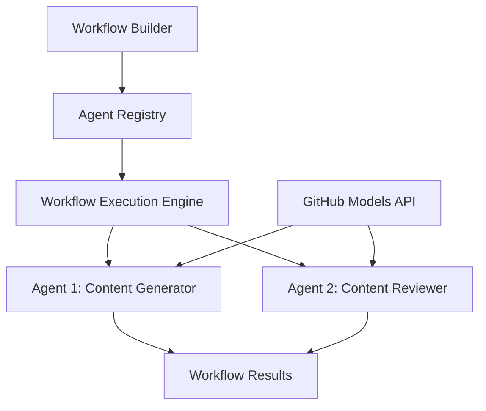

<!--
CO_OP_TRANSLATOR_METADATA:
{
  "original_hash": "034158688d0a45aae06dcbb21b0da5ae",
  "translation_date": "2025-11-11T13:03:17+00:00",
  "source_file": "08-multi-agent/code_samples/workflows-agent-framework/dotNET/01.dotnet-agent-framework-workflow-ghmodel-basic.md",
  "language_code": "et"
}
-->
# 🔄 Põhilised agentide töövood GitHubi mudelitega (.NET)

## 📋 Töövoo orkestreerimise õpetus

See märkmik näitab, kuidas luua keerukaid **agentide töövooge** Microsoft Agent Frameworki jaoks .NET-is ja GitHubi mudelite abil. Õpid looma mitmeastmelisi äriprotsesse, kus AI-agendid teevad koostööd, et saavutada keerulisi ülesandeid struktureeritud orkestreerimismustrite kaudu.

## 🎯 Õpieesmärgid

### 🏗️ **Töövoo arhitektuuri alused**
- **Töövoo ehitaja**: Kujunda ja orkestreeri keerukaid mitmeastmelisi AI-protsesse
- **Agentide koordineerimine**: Koordineeri mitut spetsialiseeritud agenti töövoogudes
- **GitHubi mudelite integreerimine**: Kasuta GitHubi AI-mudelite järeldusteenust töövoogudes
- **Visuaalne töövoo disain**: Loo ja visualiseeri töövoo struktuure paremaks arusaamiseks

### 🔄 **Protsessi orkestreerimise mustrid**
- **Järjestikune töötlemine**: Ühenda mitme agendi ülesanded loogilises järjekorras
- **Oleku haldamine**: Säilita kontekst ja andmevoog töövoo etappide vahel
- **Vigade käsitlemine**: Rakenda vastupidavat vigade taastamist ja töövoo vastupidavust
- **Jõudluse optimeerimine**: Kujunda tõhusad töövood ettevõtte ulatuses toimimiseks

### 🏢 **Ettevõtte töövoo rakendused**
- **Äriprotsesside automatiseerimine**: Automatiseeri keerukaid organisatsioonilisi töövooge
- **Sisu tootmise torujuhe**: Toimetusprotsessid koos ülevaatuse ja kinnitamise etappidega
- **Klienditeeninduse automatiseerimine**: Mitmeastmeline kliendipäringute lahendamine
- **Andmetöötluse töövood**: ETL-töövood AI-põhise transformatsiooniga

## ⚙️ Eeltingimused ja seadistamine

### 📦 **Vajalikud NuGeti paketid**

See töövoo demonstratsioon kasutab mitmeid olulisi .NET-pakette:

```xml
<!-- Core AI Framework -->
<PackageReference Include="Microsoft.Extensions.AI" Version="9.9.0" />

<!-- Agent Framework (Local Development) -->
<!-- Microsoft.Agents.AI.dll - Core agent abstractions -->
<!-- Microsoft.Agents.AI.OpenAI.dll - OpenAI/GitHub Models integration -->

<!-- Configuration and Environment -->
<PackageReference Include="DotNetEnv" Version="3.1.1" />
```

### 🔑 **GitHubi mudelite konfiguratsioon**

**Keskkonna seadistamine (.env fail):**
```env
GITHUB_TOKEN=your_github_personal_access_token
GITHUB_ENDPOINT=https://models.inference.ai.azure.com
GITHUB_MODEL_ID=gpt-4o-mini
```

**GitHubi mudelite juurdepääs:**
1. Registreeru GitHubi mudelite jaoks (praegu eelvaates)
2. Loo isiklik juurdepääsutoken mudelite juurdepääsuõigustega
3. Konfigureeri keskkonnamuutujad, nagu eespool näidatud

### 🏗️ **Töövoo arhitektuuri ülevaade**



**Peamised komponendid:**
- **WorkflowBuilder**: Peamine orkestreerimismootor töövoogude kujundamiseks
- **AIAgent**: Individuaalsed spetsialiseeritud agendid konkreetsete võimetega
- **GitHub Models Client**: AI-mudelite järeldusteenuse integreerimine
- **Execution Context**: Halda olekut ja andmevoogu töövoo etappide vahel

## 🎨 **Ettevõtte töövoo disainimustrid**

### 📝 **Sisu tootmise töövoog**
```
User Request → Content Generation → Quality Review → Final Output
```

### 🔍 **Dokumentide töötlemise torujuhe**
```
Document Input → Analysis → Extraction → Validation → Structured Output
```

### 💼 **Ärianalüüsi töövoog**
```
Data Collection → Processing → Analysis → Report Generation → Distribution
```

### 🤝 **Klienditeeninduse automatiseerimine**
```
Customer Inquiry → Classification → Processing → Response Generation → Follow-up
```

## 🏢 **Ettevõtte eelised**

### 🎯 **Usaldusväärsus ja mastaapsus**
- **Deterministlik täitmine**: Järjepidevad ja korduvad töövoo tulemused
- **Vigade taastamine**: Vigade sujuv käsitlemine igas töövoo etapis
- **Jõudluse jälgimine**: Jälgi täitmise mõõdikuid ja optimeerimisvõimalusi
- **Ressursside haldamine**: AI-mudelite ressursside tõhus jaotamine ja kasutamine

### 🔒 **Turvalisus ja vastavus**
- **Turvaline autentimine**: GitHubi tokenipõhine autentimine API-le juurdepääsuks
- **Auditijäljed**: Töövoo täitmise ja otsustuspunktide täielik logimine
- **Juurdepääsukontroll**: Granuleeritud õigused töövoo täitmiseks ja jälgimiseks
- **Andmete privaatsus**: Tundliku teabe turvaline käsitlemine kogu töövoo vältel

### 📊 **Jälgitavus ja haldamine**
- **Visuaalne töövoo disain**: Selge protsessivoogude ja sõltuvuste kujutamine
- **Täitmise jälgimine**: Töövoo edenemise ja jõudluse reaalajas jälgimine
- **Vigade aruandlus**: Üksikasjalik vigade analüüs ja silumisvõimalused
- **Jõudluse analüütika**: Mõõdikud optimeerimiseks ja võimsuse planeerimiseks

Hakkame looma sinu esimest ettevõttevalmis AI-töövoogu! 🚀

## 💻 Koodi käivitamine

Täielik teostus on saadaval failis `01.dotnet-agent-framework-workflow-ghmodel-basic.cs`. See fail demonstreerib:

1. **Keskkonna konfiguratsioon** - GitHubi mudelite volituste laadimine `.env` failist
2. **OpenAI kliendi seadistamine** - Kliendi konfigureerimine GitHubi mudelite lõpp-punkti kasutamiseks
3. **Agentide loomine** - Spetsialiseeritud agentide määratlemine (Front Desk ja Concierge)
4. **Töövoo ehitaja** - Mitme agendi töövoo loomine järjestikuse töötlemisega
5. **Töövoo täitmine** - Töövoo käivitamine voogesituse tulemustega

### 🚀 Näite käivitamine

```bash
# Make the script executable (Unix/Linux/macOS)
chmod +x 01.dotnet-agent-framework-workflow-ghmodel-basic.cs

# Run the workflow
./01.dotnet-agent-framework-workflow-ghmodel-basic.cs
```

Või Windowsis:
```powershell
dotnet run 01.dotnet-agent-framework-workflow-ghmodel-basic.cs
```

### 📝 Oodatav väljund

Töövoog:
1. Võtab vastu sinu reisisihtkoha päringu ("Ma tahaksin minna Pariisi")
2. Front Desk agent annab esialgse soovituse
3. Concierge agent vaatab soovituse üle ja täiustab seda
4. Lõplik väljund kuvab kogu vestluse voogu

### 🔧 Kohandamine

Sa saad töövoogu kohandada:
- Muutes agentide juhiseid, et muuta nende käitumist
- Lisades rohkem agente, et luua keerukaid mitmeastmelisi töövooge
- Muutes kasutaja sõnumit, et testida erinevaid stsenaariume
- Kohandades töövoo servasid, et luua erinevaid täitmismustreid

---

<!-- CO-OP TRANSLATOR DISCLAIMER START -->
**Lahtiütlus**:  
See dokument on tõlgitud AI tõlketeenuse [Co-op Translator](https://github.com/Azure/co-op-translator) abil. Kuigi püüame tagada täpsust, palume arvestada, et automaatsed tõlked võivad sisaldada vigu või ebatäpsusi. Algne dokument selle algses keeles tuleks pidada autoriteetseks allikaks. Olulise teabe puhul soovitame kasutada professionaalset inimtõlget. Me ei vastuta selle tõlke kasutamisest tulenevate arusaamatuste või valesti tõlgenduste eest.
<!-- CO-OP TRANSLATOR DISCLAIMER END -->