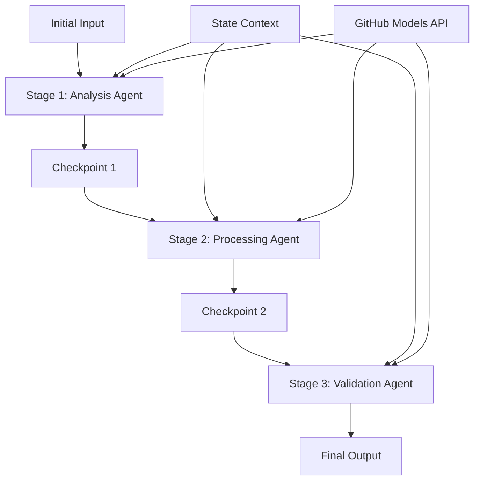

<!--
CO_OP_TRANSLATOR_METADATA:
{
  "original_hash": "1be9c8dcbd79a02d33d2c138684c1394",
  "translation_date": "2025-11-11T14:10:06+00:00",
  "source_file": "08-multi-agent/code_samples/workflows-agent-framework/dotNET/02.dotnet-agent-framework-workflow-ghmodel-sequential.md",
  "language_code": "et"
}
-->
# ⏩ Järjestikagentide töövood GitHubi mudelitega (.NET)

## 📋 Täiustatud järjestikprotsesside juhend

See märkmik tutvustab **järjestikprotsesside mustreid**, kasutades Microsoft Agent Frameworki .NET jaoks ja GitHubi mudeleid. Õpid looma keerukaid samm-sammulisi töötlemistorusid, kus agendid tegutsevad kindlas järjekorras, iga etapp tuginedes eelmise etapi tulemustele.

## 🎯 Õpieesmärgid

### 🔄 **Järjestikprotsesside arhitektuur**
- **Lineaarse töövoo disain**: Loo samm-sammulisi töötlemistorusid selgete sõltuvustega
- **Oleku haldamine**: Säilita kontekst ja andmevoog järjestikprotsesside etappide vahel
- **GitHubi mudelite integreerimine**: Kasuta GitHubi AI mudeleid mitmeastmelistes .NET töövoogudes
- **Ettevõtte torumustrid**: Loo tootmisvalmis järjestikprotsesside süsteeme

### 🏗️ **Täiustatud järjestikmustrid**
- **Etapivärava töötlemine**: Rakenda valideerimiskontrollpunkte töövoo etappide vahel
- **Konteksti säilitamine**: Säilita olek ja kogutud teadmised kõigis etappides
- **Vigade levik**: Käsitle tõrkeid sujuvalt järjestikprotsesside ahelates
- **Jõudluse optimeerimine**: Tõhus järjestikprotsesside täitmine minimaalse koormusega

### 🏢 **Ettevõtte järjestikrakendused**
- **Dokumentide töötlemise toru**: Mitmeastmeline dokumentide analüüs, teisendamine ja valideerimine
- **Kvaliteedikontrolli töövood**: Järjestikuline ülevaatus, valideerimine ja kinnitamine
- **Sisu tootmise toru**: Uurimine → Kirjutamine → Toimetamine → Ülevaatus → Avaldamine
- **Äriprotsesside automatiseerimine**: Mitmeastmelised äriprotsessid selgete etapisõltuvustega

## ⚙️ Eeltingimused ja seadistamine

### 📦 **Vajalikud NuGeti paketid**

Olulised paketid .NET järjestikprotsesside jaoks:

```xml
<!-- Core AI Framework -->
<PackageReference Include="Microsoft.Extensions.AI" Version="9.9.0" />

<!-- Client Model Abstractions -->
<PackageReference Include="System.ClientModel" Version="1.6.1.0" />

<!-- Azure Identity and Async LINQ Support -->
<PackageReference Include="Azure.Identity" Version="1.15.0" />
<PackageReference Include="System.Linq.Async" Version="6.0.3" />

<!-- Local Agent Framework References -->
<!-- Microsoft.Agents.AI.dll - Core agent abstractions -->
<!-- Microsoft.Agents.AI.OpenAI.dll - GitHub Models integration -->
```

### 🔑 **GitHubi mudelite konfiguratsioon**

**Keskkonna seadistamine (.env fail):**
```env
GITHUB_TOKEN=your_github_personal_access_token
GITHUB_ENDPOINT=https://models.inference.ai.azure.com
GITHUB_MODEL_ID=gpt-4o-mini
```

**Konfiguratsiooni haldamine:**
```csharp
// Load environment variables securely
Env.Load("../../../.env");
var githubToken = Environment.GetEnvironmentVariable("GITHUB_TOKEN");
var githubEndpoint = Environment.GetEnvironmentVariable("GITHUB_ENDPOINT");
var modelId = Environment.GetEnvironmentVariable("GITHUB_MODEL_ID");
```

### 🏗️ **Järjestikprotsesside arhitektuur**



**Peamised komponendid:**
- **Järjestikagendid**: Spetsialiseeritud agendid iga töötlemisetapi jaoks
- **Oleku kontekst**: Säilitab kogutud andmed ja otsused etappide vahel
- **Kontrollpunktid**: Valideerimispunktid etappide vahel kvaliteedi ja järjepidevuse tagamiseks
- **GitHubi mudelite klient**: Ühtne AI mudelite juurdepääs kõigis töövoo etappides

## 🎨 **Järjestikprotsesside disainimustrid**

### 📝 **Dokumentide töötlemise toru**
```
Raw Document → Content Extraction → Analysis → Validation → Structured Output
```

### 🎯 **Sisu loomise töövoog**
```
Brief/Requirements → Research → Content Creation → Review → Final Polish
```

### 🔍 **Kvaliteedikontrolli toru**
```
Initial Review → Technical Validation → Compliance Check → Final Approval
```

### 💼 **Ärianalüüsi töövoog**
```
Data Collection → Processing → Analysis → Report Generation → Distribution
```

## 🏢 **Ettevõtte järjestikprotsesside eelised**

### 🎯 **Usaldusväärsus ja kvaliteet**
- **Deterministlik töötlemine**: Järjestikuste etappide kaudu saavutatakse järjepidevad ja korduvad tulemused
- **Kvaliteediväravad**: Valideerimiskontrollpunktid tagavad kvaliteedi igas etapis
- **Vigade isoleerimine**: Probleemid ühes etapis ei levi järgmistesse etappidesse
- **Auditijäljed**: Täielik otsuste ja teisenduste jälgimine igas etapis

### 📈 **Mastaapsus ja jõudlus**
- **Modulaarne disain**: Iga etappi saab optimeerida iseseisvalt
- **Ressursside haldamine**: AI mudelite ressursside tõhus jaotamine etappide vahel
- **Oleku optimeerimine**: Minimaalne oleku edastamine etappide vahel optimaalse jõudluse tagamiseks
- **Paralleelsed etapigrupid**: Mitmed järjestikprotsessid võivad töötada paralleelselt

### 🔒 **Turvalisus ja vastavus**
- **Etapipõhine turvalisus**: Erinevad turvapoliitikad erinevate töötlemisetappide jaoks
- **Andmete valideerimine**: Tagab andmete terviklikkuse ja vastavuse igas kontrollpunktis
- **Juurdepääsukontroll**: Granuleeritud õigused erinevate töövoo etappide jaoks
- **Regulatiivne vastavus**: Struktureeritud töötlemise kaudu täidetakse regulatiivseid nõudeid

### 📊 **Jälgimine ja analüütika**
- **Etapipõhised mõõdikud**: Jõudluse jälgimine iga töövoo etapi jaoks
- **Pudelikaelade tuvastamine**: Aeglaste etappide tuvastamine ja optimeerimine
- **Kvaliteedimõõdikud**: Jälgi kvaliteeti ja edukuse määrasid igas etapis
- **Protsessi optimeerimine**: Pidev täiustamine etapipõhise analüütika põhjal

Lähme ehitama tugevaid järjestikseid AI töötlemistorusid! 🚀

## 💻 Koodi käivitamine

Täielik teostus on saadaval failis `02.dotnet-agent-framework-workflow-ghmodel-sequential.cs`. See fail demonstreerib **kolmeetapilist mööbli analüüsi töövoogu**:

1. **Etapp 1 - Müügiagent**: Analüüsib mööblipilte ja annab ostusoovitusi
2. **Etapp 2 - Hinnaagent**: Pakub üksikasjalikke hinnajaotusi ja eelarvevalikuid
3. **Etapp 3 - Pakkumiseagent**: Loob professionaalse pakkumisdokumendi Markdowni formaadis

### 🏗️ **Töövoo arhitektuur**

```
Image Input → Sales Analysis → Price Estimation → Quote Generation → Final Output
```

Iga agent:
- Saab eelmisest etapist väljundi kontekstina
- Tugineb eelnevale analüüsile spetsialiseeritud teadmistega
- Säilitab töövoo järjepidevuse oleku haldamise kaudu

### 🚀 Näite käivitamine

**Eeltingimused:**
- Paiguta mööblipilt asukohta `../imgs/home.png` (või uuenda `imgPath` muutujat)
- Konfigureeri oma `.env` fail GitHubi mudelite mandaatidega

```bash
# Make the script executable (Unix/Linux/macOS)
chmod +x 02.dotnet-agent-framework-workflow-ghmodel-sequential.cs

# Run the sequential workflow
./02.dotnet-agent-framework-workflow-ghmodel-sequential.cs
```

Või Windowsis:
```powershell
dotnet run 02.dotnet-agent-framework-workflow-ghmodel-sequential.cs
```

### 📝 Oodatav väljund

Töövoog teeb järgmist:
1. **Müügiagent**: Tuvastab mööbliesemed pildilt ja annab soovitusi
2. **Hinnaagent**: Lisab üksikasjaliku hinnanalüüsi eelarve tasemete ja ostusoovitustega
3. **Pakkumiseagent**: Loob vormindatud pakkumisdokumendi, mis sisaldab kogu sünteesitud teavet

Lõplik väljund on terviklik ja professionaalne mööblipakkumine, mis põhineb pildianalüüsil.

### 🔧 Kohandamisvõimalused

**Muuda agendi käitumist:**
```csharp
// Adjust agent instructions to change their focus
const string SalesAgentInstructions = "Your custom instructions...";
```

**Muuda järjestikvoogu:**
```csharp
// Add or reorder workflow stages
var workflow = new WorkflowBuilder(salesagent)
    .AddEdge(salesagent, priceagent)
    .AddEdge(priceagent, quoteagent)
    .AddEdge(quoteagent, newAgent)  // Add another stage
    .Build();
```

**Kasuta erinevat sisendit:**
```csharp
// Process text instead of images
ChatMessage userMessage = new ChatMessage(ChatRole.User, [
    new TextContent("Analyze pricing for a modern living room set")
]);
```

### 🎯 Reaalsed rakendused

See järjestikmuster sobib ideaalselt:
- **E-kaubandus**: Tootete analüüs → Hinnakujundus → Pakkumise loomine
- **Kinnisvara**: Kinnisvara analüüs → Hindamine → Kuulutuse loomine
- **Kindlustus**: Nõude analüüs → Hindamine → Pakkumise loomine
- **Sisu loomine**: Uurimine → Kirjutamine → Toimetamine → Avaldamine

### 🔍 Olekuvoo mõistmine

Iga agent järjestuses saab:
- **Algne sisend**: Kasutaja esialgne sõnum (pilt + tekst)
- **Eelmiste agentide väljundid**: Kõik eelmiste agentide vastused vestluse ajaloos
- **Kogutud kontekst**: Täielik olek, mis säilitatakse kogu töövoo jooksul

See võimaldab keerukat mitmeastmelist töötlemist, kus iga agent tugineb kõigi eelnevate etappide põhjalikule kontekstile.

---

<!-- CO-OP TRANSLATOR DISCLAIMER START -->
**Lahtiütlus**:  
See dokument on tõlgitud AI tõlketeenuse [Co-op Translator](https://github.com/Azure/co-op-translator) abil. Kuigi püüame tagada täpsust, palume arvestada, et automaatsed tõlked võivad sisaldada vigu või ebatäpsusi. Algne dokument selle algses keeles tuleks pidada autoriteetseks allikaks. Olulise teabe puhul soovitame kasutada professionaalset inimtõlget. Me ei vastuta arusaamatuste või valesti tõlgenduste eest, mis võivad tekkida selle tõlke kasutamise tõttu.
<!-- CO-OP TRANSLATOR DISCLAIMER END -->