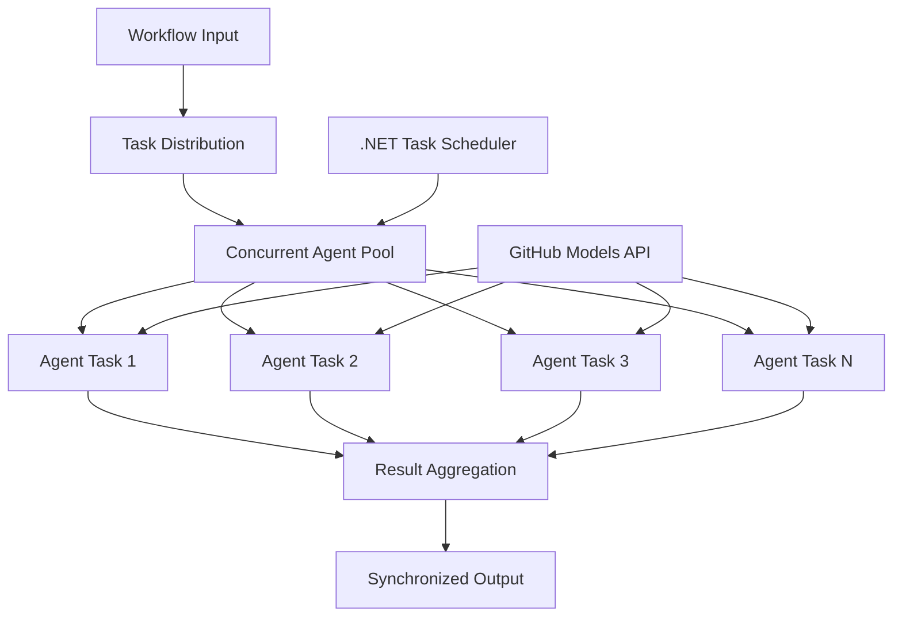

<!--
CO_OP_TRANSLATOR_METADATA:
{
  "original_hash": "b9c6e32c9b5f2fed20b6916984440d88",
  "translation_date": "2025-11-11T13:37:38+00:00",
  "source_file": "08-multi-agent/code_samples/workflows-agent-framework/dotNET/03.dotnet-agent-framework-workflow-ghmodel-concurrent.md",
  "language_code": "et"
}
-->
# ⚡ Samaaegsed agentide töövood GitHubi mudelitega (.NET)

## 📋 Kõrge jõudlusega paralleeltöötluse juhend

See märkmik tutvustab **samaaegseid töövoomustreid**, kasutades Microsoft Agent Frameworki .NET jaoks ja GitHubi mudeleid. Õpid, kuidas luua kõrge jõudlusega paralleeltöötluse töövooge, mis maksimeerivad läbilaskevõimet, käivitades mitu AI-agentti samaaegselt, säilitades samal ajal koordineerimise ja andmete järjepidevuse.

## 🎯 Õpieesmärgid

### 🚀 **Samaaegse töötlemise põhitõed**
- **Agentide paralleelne käivitamine**: Käivita mitu AI-agentti samaaegselt maksimaalse jõudluse saavutamiseks
- **Async/Await mustrid**: Kasuta .NET-i asünkroonse programmeerimise mudelit tõhusaks samaaegseks töötlemiseks
- **GitHubi mudelite integreerimine**: Koordineeri mitut samaaegset kõnet GitHubi AI mudeli järeldusteenusele
- **Ressursside haldamine**: Halda AI mudeli ressursse tõhusalt samaaegsete operatsioonide käigus

### 🏗️ **Täiustatud samaaegse arhitektuuri**
- **Ülesandepõhine paralleelsus**: Kasuta .NET Task Parallel Library't optimaalseks samaaegseks käivitamiseks
- **Sünkroniseerimismustrid**: Koordineeri samaaegseid agente, vältides võistlustingimusi
- **Koormuse tasakaalustamine**: Jaota töö tõhusalt olemasoleva samaaegse töötlemisvõimsuse vahel
- **Tõrketaluvus**: Käsitle individuaalseid agentide tõrkeid ilma kogu töövoogu peatamata

### 🏢 **Ettevõtte samaaegsed rakendused**
- **Suuremahuline dokumentide töötlemine**: Töötle mitut dokumenti samaaegselt
- **Reaalajas sisu analüüs**: Samaaegne sissetulevate andmevoogude analüüs
- **Partiitöötluse optimeerimine**: Maksimeeri läbilaskevõime suuremahuliste andmetöötlusoperatsioonide jaoks
- **Mitmeliigiline analüüs**: Töötle paralleelselt erinevaid sisutüüpe ja formaate

## ⚙️ Eeltingimused ja seadistamine

### 📦 **Vajalikud NuGet paketid**

Olulised paketid kõrge jõudlusega samaaegsete töövoogude jaoks:

```xml
<!-- Core AI Framework with Async Support -->
<PackageReference Include="Microsoft.Extensions.AI" Version="9.9.0" />

<!-- Client Model Abstractions for API Communication -->
<PackageReference Include="System.ClientModel" Version="1.6.1.0" />

<!-- Azure Identity and Async LINQ for Advanced Operations -->
<PackageReference Include="Azure.Identity" Version="1.15.0" />
<PackageReference Include="System.Linq.Async" Version="6.0.3" />

<!-- Local Agent Framework References -->
<!-- Microsoft.Agents.AI.dll - Core agent abstractions with async support -->
<!-- Microsoft.Agents.AI.OpenAI.dll - GitHub Models integration with concurrency -->
```

### 🔑 **GitHubi mudelite konfiguratsioon**

**Keskkonna seadistamine (.env fail):**
```env
GITHUB_TOKEN=your_github_personal_access_token
GITHUB_ENDPOINT=https://models.inference.ai.azure.com
GITHUB_MODEL_ID=gpt-4o-mini
```

**Samaaegse töötlemise kaalutlused:**
```csharp
// Configure for concurrent operations
var clientOptions = new OpenAIClientOptions()
{
    Endpoint = new Uri(githubEndpoint),
    // Configure connection pooling for concurrent requests
    NetworkTimeout = TimeSpan.FromMinutes(5)
};
```

### 🏗️ **Samaaegse töövoo arhitektuur**



**Peamised komponendid:**
- **Task Parallel Library**: .NET-i sisseehitatud tugi samaaegsetele operatsioonidele
- **Agentide bassein**: Mitu agenti paralleelseks töötlemiseks
- **Tulemuste koondamine**: Samaaegsete agentide tulemuste koordineerimine ja ühendamine
- **Sünkroniseerimispunktid**: Tagab andmete järjepidevuse samaaegsete operatsioonide käigus

## 🎨 **Samaaegse töövoo disainimustrid**

### 🔍 **Paralleelne uurimine ja analüüs**
```
Research Topic → Concurrent Research Agents → Result Synthesis → Final Report
```

### 📊 **Mitme allika andmetöötlus**
```
Data Sources → Parallel Processing Agents → Data Integration → Unified Output
```

### 🎭 **Sisu loomise torujuhe**
```
Content Requirements → Concurrent Content Generators → Quality Review → Final Content
```

### 🔄 **Fan-Out/Fan-In töötlemine**
```
Single Input → Multiple Concurrent Processors → Result Aggregation → Single Output
```

## 🏢 **Ettevõtte jõudluse eelised**

### ⚡ **Läbilaskevõime ja skaleeritavus**
- **Lineaarne jõudluse skaleerimine**: Lisa rohkem samaaegseid agente, et suurendada läbilaskevõimet
- **Ressursside kasutamine**: Maksimaalne efektiivsus olemasoleva AI mudeli võimsuse kasutamisel
- **Vähendatud töötlemisaeg**: Märkimisväärne ajakokkuhoid paralleelse käivitamise kaudu
- **Elastne skaleerimine**: Kohanda samaaegsete agentide arvu dünaamiliselt vastavalt töökoormusele

### 🛡️ **Usaldusväärsus ja vastupidavus**
- **Tõrke isoleerimine**: Individuaalsed agentide tõrked ei mõjuta teisi samaaegseid operatsioone
- **Sujuv degradeerumine**: Süsteem jätkab tööd vähendatud agentide võimsusega
- **Tõrke taastamine**: Automaatne uuesti proovimise mehhanism ebaõnnestunud samaaegsete operatsioonide jaoks
- **Koormuse jaotamine**: Töö ühtlane jaotamine olemasolevate agentide vahel

### 📊 **Jõudluse jälgimine**
- **Samaaegse käivitamise mõõdikud**: Jälgi kõigi paralleelsete operatsioonide jõudlust
- **Ressursside kasutamise analüütika**: Jälgi CPU, mälu ja võrgu kasutamist
- **Läbilaskevõime analüüs**: Mõõda efektiivsuse kasvu samaaegse töötlemise kaudu
- **Pudelikaela tuvastamine**: Tuvasta ja lahenda jõudluse piirangud

### 🔧 **Arendus ja operatsioonid**
- **Asünkroonne programmeerimismudel**: Kasuta .NET-i küpset async/await mustrit
- **Ülesannete koordineerimine**: Sisseehitatud ülesannete haldamise ja koordineerimise võimalused
- **Erandite käsitlemine**: Põhjalik veakäsitlus samaaegsete operatsioonide jaoks
- **Silumise tugi**: Visual Studio silumisvahendid samaaegsete töövoogude jaoks

Ehita kõrge jõudlusega samaaegseid AI töövooge .NET-iga! 🚀

## 💻 Koodi käivitamine

Täielik teostus on saadaval failis `03.dotnet-agent-framework-workflow-ghmodel-concurrent.cs`. See fail demonstreerib **Fan-Out/Fan-In samaaegset töövoogu** reisiplaani koostamiseks:

### 🏗️ **Töövoo arhitektuur**

```
User Request → ConcurrentStartExecutor → [Researcher Agent || Planner Agent] → ConcurrentAggregationExecutor → Final Output
```

**Peamised komponendid:**

1. **ConcurrentStartExecutor**: Edastab kasutaja päringu kõigile agentidele samaaegselt
2. **Researcher Agent**: Analüüsib sihtkohti ja vaatamisväärsusi samaaegselt
3. **Planner Agent**: Koostab üksikasjalikud reisiplaanid samaaegselt
4. **ConcurrentAggregationExecutor**: Kogub ja ühendab mõlema agendi tulemused

### 🎯 **Fan-Out/Fan-In muster**

See töövoog demonstreerib klassikalist **Fan-Out/Fan-In** mustrit:
- **Fan-Out**: Üks sisendteade edastatakse samaaegselt mitmele agendile
- **Samaaegne töötlemine**: Mitu agenti töötavad paralleelselt sama ülesande kallal
- **Fan-In**: Kõigi agentide tulemused kogutakse ja ühendatakse üheks väljundiks

### 🚀 Näite käivitamine

```bash
# Make the script executable (Unix/Linux/macOS)
chmod +x 03.dotnet-agent-framework-workflow-ghmodel-concurrent.cs

# Run the concurrent workflow
./03.dotnet-agent-framework-workflow-ghmodel-concurrent.cs
```

Või Windowsis:
```powershell
dotnet run 03.dotnet-agent-framework-workflow-ghmodel-concurrent.cs
```

### 📝 Oodatav väljund

Töövoog teeb järgmist:
1. **Päringu edastamine**: Saada "Planeeri reis Seattle'isse detsembris" mõlemale agendile
2. **Samaaegne töötlemine**: Mõlemad agendid töötavad samaaegselt:
   - Uurija tuvastab vaatamisväärsused ja üksikasjad
   - Planeerija koostab ajakava ja logistika
3. **Koondamine**: Ühenda mõlema vastused terviklikuks väljundiks
4. **Tulemuste kuvamine**: Näita ühendatud reisiplaani kogu teabega

### 🔧 Kohandamisvõimalused

**Lisa rohkem samaaegseid agente:**
```csharp
// Create additional specialized agents
AIAgent budgetAgent = openAIClient.GetChatClient(github_model_id).CreateAIAgent(
    name: "Budget-Agent", instructions: "Calculate travel costs...");

// Add to fan-out
var workflow = new WorkflowBuilder(startExecutor)
    .AddFanOutEdge(startExecutor, targets: [researcherAgent, plannerAgent, budgetAgent])
    .AddFanInEdge(aggregationExecutor, sources: [researcherAgent, plannerAgent, budgetAgent])
    .WithOutputFrom(aggregationExecutor)
    .Build();

// Update aggregation count
if (this._messages.Count == 3) { ... }
```

**Muuda agendi juhiseid:**
```csharp
const string ResearcherAgentInstructions = "Your custom instructions for research...";
const string PlanAgentInstructions = "Your custom instructions for planning...";
```

**Muuda ülesannet:**
```csharp
StreamingRun run = await InProcessExecution.StreamAsync(
    workflow, 
    "Plan a European vacation for 2 weeks in summer"
);
```

### 🎯 Reaalsed rakendused

See samaaegne muster sobib ideaalselt:
- **Sisu loomine**: Mitu kirjutajat loovad erinevaid sektsioone samaaegselt
- **Koodikontroll**: Mitu kontrollijat analüüsivad koodi erinevatest vaatenurkadest
- **Turu-uuringud**: Paralleelne analüüs erinevatest turusegmentidest
- **Dokumentide töötlemine**: Samaaegne ekstraheerimine, analüüs ja valideerimine
- **Mitme perspektiivi analüüs**: Erinevate vaatenurkade saamine sama sisendi kohta

### 🔍 Kohandatud täiturite mõistmine

**ConcurrentStartExecutor:**
- Rakendab `IMessageHandler<string>` stringi sisendi vastuvõtmiseks
- Edastab sõnumeid kõigile ühendatud agentidele
- Saadab `TurnToken`, et käivitada samaaegne töötlemine

**ConcurrentAggregationExecutor:**
- Rakendab `IMessageHandler<ChatMessage>` agendi vastuste vastuvõtmiseks
- Kogub sõnumeid niidikindlal viisil
- Koondab, kui kõik oodatud vastused on saabunud
- Annab lõpliku väljundi, kasutades `context.YieldOutputAsync()`

### ⚡ Jõudluse eelised

**Samaaegne vs järjestikune:**
- Järjestikune: Agent1 (30s) → Agent2 (30s) = **60 sekundit kokku**
- Samaaegne: Agent1 (30s) || Agent2 (30s) = **30 sekundit kokku**

**Läbilaskevõime paranemine**: Kuni N× kiirem N samaaegse agendi puhul (sõltuvalt töökoormusest ja ressurssidest)

### 🛡️ Veakäsitlus

Töövoog käsitleb individuaalseid agentide tõrkeid sujuvalt:
- Kui üks agent ebaõnnestub, jätkavad teised töötlemist
- Koondaja saab rakendada ajapiirangu loogikat
- Vajadusel saab tagastada osalisi tulemusi

### 📊 Täiustatud funktsioonid

**Dünaamiline agentide arv:**
Muuda koondamisloogikat, et toetada muutuva arvu agente:

```csharp
private int _expectedAgentCount;
private readonly List<ChatMessage> _messages = [];

public async ValueTask HandleAsync(ChatMessage message, IWorkflowContext context)
{
    this._messages.Add(message);
    if (this._messages.Count == _expectedAgentCount)
    {
        // Process aggregation
    }
}
```

See samaaegne töövoo muster on hädavajalik kõrge jõudlusega, skaleeritavate AI agentide süsteemide ehitamiseks!

---

<!-- CO-OP TRANSLATOR DISCLAIMER START -->
**Lahtiütlus**:  
See dokument on tõlgitud AI tõlketeenuse [Co-op Translator](https://github.com/Azure/co-op-translator) abil. Kuigi püüame tagada täpsust, palume arvestada, et automaatsed tõlked võivad sisaldada vigu või ebatäpsusi. Algne dokument selle algses keeles tuleks pidada autoriteetseks allikaks. Olulise teabe puhul soovitame kasutada professionaalset inimtõlget. Me ei vastuta arusaamatuste või valesti tõlgenduste eest, mis võivad tekkida selle tõlke kasutamise tõttu.
<!-- CO-OP TRANSLATOR DISCLAIMER END -->