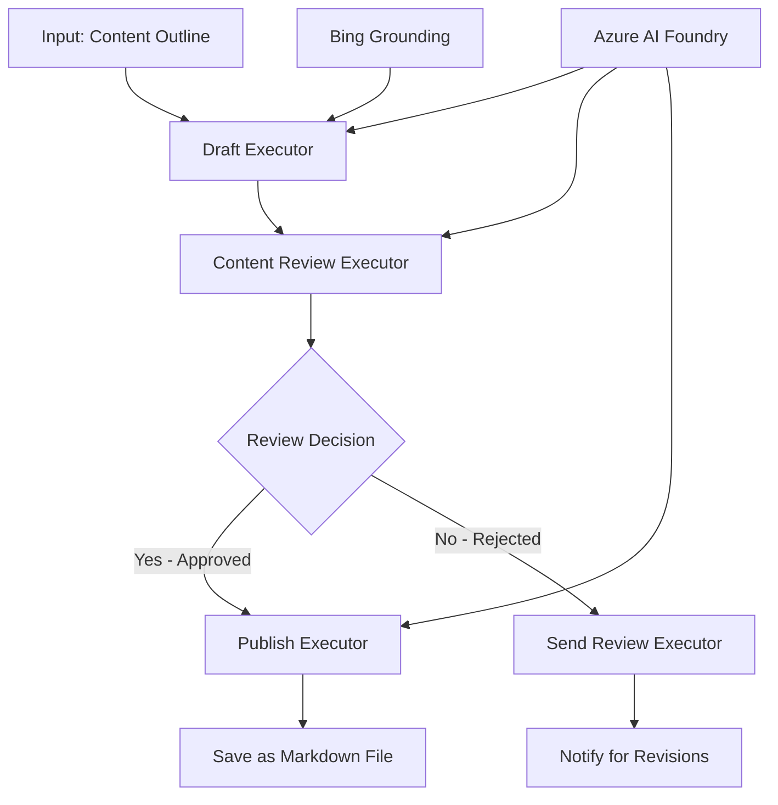

<!--
CO_OP_TRANSLATOR_METADATA:
{
  "original_hash": "8abd335151cee553293b637ee3d80d10",
  "translation_date": "2025-11-11T12:37:12+00:00",
  "source_file": "08-multi-agent/code_samples/workflows-agent-framework/dotNET/04.dotnet-agent-framework-workflow-aifoundry-condition.md",
  "language_code": "et"
}
-->
# 🔀 Tingimuslikud agentide töövood Azure AI Foundryga (.NET)

## 📋 Nutikas otsustuspõhine töövoo õpetus

See märkmik demonstreerib **tingimuslikke töövoo mustreid**, kasutades Azure AI Foundryt ja Microsoft Agent Frameworki .NET jaoks. Õpid looma keerukaid, otsustepõhiseid töövooge, mis suunavad töötlemist intelligentselt AI analüüsi, ärireeglite ja dünaamiliste tingimuste alusel, et saavutada ettevõtte tasemel automatiseerimine.

## 🎯 Õpieesmärgid

### 🧠 **Nutika otsustusarhitektuur**
- **Tingimusliku loogika rakendamine**: Loo keerukaid otsustepuid mitme harupunktiga
- **AI-põhine suunamine**: Kasuta Azure AI Foundry mudeleid intelligentsete suunamisotsuste tegemiseks
- **Dünaamiline töövoo kohandamine**: Muuda töövoo käitumist jooksva analüüsi ja tingimuste alusel
- **Ettevõtte reeglite integreerimine**: Kaasa töövoogudesse äriloogika ja vastavusnõuded

### 🔀 **Tingimuslikud mustrid**
- **Mitme kriteeriumi otsuste tegemine**: Hinda mitmeid tegureid suunamisotsuste tegemiseks
- **Kontekstiteadlik töötlemine**: Tee otsuseid, tuginedes kogunenud töövoo kontekstile ja ajaloole
- **Kohanduv töövoo muutmine**: Kohanda töötlemisteid reaalajas tingimuste alusel
- **Reeglimootori integreerimine**: Rakenda keerukaid ärireeglimootoreid töövoogudes

### 🏢 **Ettevõtte tingimuslikud rakendused**
- **Dokumentide klassifitseerimine ja suunamine**: Klassifitseeri ja suuna dokumendid automaatselt sobivatesse töövoogudesse
- **Klienditeeninduse triage**: Kliendipäringute intelligentne suunamine spetsialiseeritud meeskondadele
- **Vastavus- ja riskitöötlus**: Rakenda erinevaid valideerimis- ja ülevaatusprotsesse riskihinnangu alusel
- **Kvaliteedikontrolli töövood**: Suuna sisu sobivatesse ülevaatusprotsessidesse kvaliteedimõõdikute alusel

## ⚙️ Eeltingimused ja seadistamine

### 📦 **Nõutavad NuGet paketid**

Tingimusliku töövoo töötlemiseks vajalikud täiustatud paketid:

```xml
<!-- Core AI Framework -->
<PackageReference Include="Microsoft.Extensions.AI" Version="9.9.0" />

<!-- Azure AI Agents with Persistent State -->
<PackageReference Include="Azure.AI.Agents.Persistent" Version="1.2.0-beta.5" />

<!-- Azure Identity and Utilities -->
<PackageReference Include="Azure.Identity" Version="1.15.0" />
<PackageReference Include="System.Linq.Async" Version="6.0.3" />
<PackageReference Include="DotNetEnv" Version="3.1.1" />

<!-- Local Workflow Framework References -->
<!-- Microsoft.Agents.Workflows.dll - Advanced workflow orchestration -->
<!-- Microsoft.Agents.AI.AzureAI.dll - Azure AI Foundry integration -->
<!-- Microsoft.Agents.AI.dll - Core agent abstractions -->
```

### 🔑 **Azure AI Foundry konfiguratsioon**

**Nõutavad Azure'i ressursid:**
- Azure AI Foundry tööruum tingimusliku töötlemise mudelitega
- Azure'i tellimus sobivate arvutuslimiitide ja õigustega
- Otsustepõhiste ja sisuanalüüsi mudelite juurutamine
- (Valikuline) Bing Search API ühendus maandamisvõimekuse jaoks

**Keskkonna konfiguratsioon (.env fail):**
```env
# Azure AI Foundry Configuration
AZURE_AI_PROJECT_ENDPOINT=https://your-project.cognitiveservices.azure.com/
BING_CONNECTION_ID=your-bing-connection-id
```

**Autentimise seadistamine:**
```csharp
// Azure CLI or Managed Identity authentication
using Azure.Identity;
var credential = new AzureCliCredential();

// Load environment configuration
DotNetEnv.Env.Load("../../../.env");
```

### 🏗️ **Tingimusliku töövoo arhitektuur**



**Peamised komponendid:**
- **Draft Executor**: AI agent, mis loob esialgsed sisukavandid
- **Content Review Executor**: AI agent, mis hindab kavandi kvaliteeti ja vastavust
- **Tingimuslik suunamine**: Otsustusloogika, mis suunab ülevaatuse tulemuste alusel
- **Avaldamise/ülevaatuse teed**: Eraldi töötlemisteed heakskiidetud ja tagasi lükatud sisu jaoks
- **Oleku haldamine**: Säilitab sisu ja ülevaatuse konteksti kogu töövoo vältel

## 🎨 **Tingimusliku töövoo disainimustrid**

### 📋 **Sisuloome kvaliteedi väravatega**
```
Outline → Draft Creation → Quality Review → {Approve: Publish | Reject: Revise}
```

### 🎯 **Riskipõhine dokumentide töötlemine**
```
Document → Risk Assessment → {Low: Standard | High: Enhanced Review}
```

### 🔍 **Intelligentne klienditeeninduse suunamine**
```
Customer Query → Analysis → {Simple: FAQ Bot | Complex: Human Agent}
```

### 💼 **Vastavuspõhised töövood**
```
Content → Compliance Check → {Pass: Publish | Fail: Legal Review}
```

## 🏢 **Ettevõtte tingimuslikud eelised**

### 🎯 **Nutikas automatiseerimine**
- **Targad otsused**: AI-põhised suunamisotsused sisuanalüüsi ja konteksti alusel
- **Kohanduv töötlemine**: Töövood, mis kohanduvad automaatselt muutuvate tingimuste järgi
- **Ärireeglite rakendamine**: Keerukate äriloogikate ja poliitikate automaatne rakendamine
- **Kontekstiteadlik suunamine**: Otsused, mis põhinevad kogu töövoo ajaloole ja kogunenud kontekstile

### 📈 **Operatiivne tipptase**
- **Ressursside optimeeritud jaotamine**: Suuna töö kõige sobivamatele spetsialistidele ja protsessidele
- **Vähenenud käsitsi sekkumine**: Automaatne otsustamine vähendab inimeste vajadust suunamiseks
- **Kiirem lahendusaeg**: Otsene suunamine sobivale ekspertiisile ja töötlemisvõimekusele
- **Järjekindel rakendamine**: Ühtne ärireeglite ja otsustuskriteeriumide rakendamine

### 🛡️ **Riskijuhtimine ja vastavus**
- **Automaatne riskihinnang**: AI-põhine sisu ja olukorra riskitaseme hindamine
- **Vastavuse tagamine**: Automaatne suunamine vajalike regulatiivsete protsesside kaudu
- **Turvaprotokollide rakendamine**: Tõhustatud turvameetmed rakendatakse riskihinnangu alusel
- **Auditijälje säilitamine**: Töövoo otsuste ja põhjenduste täielik dokumentatsioon

### 📊 **Analüütika ja pidev täiustamine**
- **Otsuste analüütika**: Jälgi suunamisotsuste tõhusust ja täpsust
- **Mustrite tuvastamine**: Tuvasta suunamisotsuste suundumusi ja mustreid aja jooksul
- **Töövoo optimeerimine**: Otsustuskriteeriumide ja suunamise tõhususe pidev täiustamine
- **Äriteave**: Ülevaated sisu omadustest ja töötlemisvajadustest

### 🔧 **Tehniline tipptase**
- **Püsiv oleku haldamine**: Säilita keerukas olek kogu töövoo täitmise ajal
- **Mastaapsus**: Toeta suuremahulisi tingimusliku töötlemise nõudeid
- **Integreerimisvõimekus**: Sujuv integreerimine olemasolevate ärisüsteemide ja protsessidega
- **Jälgimine ja nähtavus**: Töövoo jõudluse ja otsuste ulatuslik jälgimine

Loome nutikaid, otsustepõhiseid ettevõtte töövooge .NET-iga! 🚀

## 💻 Koodi käivitamine

Täielik teostus on saadaval failis `04.dotnet-agent-framework-workflow-aifoundry-condition.cs`. See demonstreerib **sisuloome töövoogu kvaliteedi väravatega**:

### 🏗️ **Töövoo arhitektuur**

```
Content Outline → Draft Creation → Quality Review → Conditional Routing:
                                                      ├─ Approved (>200 words) → Publish
                                                      └─ Rejected (<200 words) → Review Notification
```

**Agendid töövoos:**
1. **Evangelist Agent**: Loob õpetuse kavandid Bing maandamisega
2. **Content Reviewer Agent**: Hindab kavandi kvaliteeti (sõnade arv, täielikkus)
3. **Publisher Agent**: Salvestab heakskiidetud sisu ajatemplitud Markdown-failidena

**Kohandatud täitjad:**
1. **DraftExecutor**: Orkestreerib kavandi loomist
2. **ContentReviewExecutor**: Viib läbi kvaliteedi hindamise
3. **PublishExecutor**: Haldab heakskiidetud sisu avaldamist
4. **SendReviewExecutor**: Haldab tagasi lükatud sisu teavitusi

### 🚀 Näite käivitamine

**Eeltingimused:**
- Azure AI Foundry tööruum konfigureeritud
- Azure CLI autentimine (`az login`)
- (Valikuline) Bing Search ühendus maandamiseks

```bash
# Make the script executable (Unix/Linux/macOS)
chmod +x 04.dotnet-agent-framework-workflow-aifoundry-condition.cs

# Run the conditional workflow
./04.dotnet-agent-framework-workflow-aifoundry-condition.cs
```

Või Windowsis:
```powershell
dotnet run 04.dotnet-agent-framework-workflow-aifoundry-condition.cs
```

### 📝 Oodatav väljund

Töövoog:
1. **Loob agendid**: Initsialiseerib kolm spetsialiseeritud Azure AI Foundry agenti
2. **Loob kavandi**: Evangelist agent loob õpetuse kavandi
3. **Hindab sisu**: Content Reviewer hindab kavandi kvaliteeti
4. **Tingimuslik suunamine**:
   - **Kui heakskiidetud (>200 sõna)**: Publish executor salvestab Markdown-failina
   - **Kui tagasi lükatud (<200 sõna)**: Send review teavitab
5. **Näitab tulemusi**: Kuvab lõpliku töövoo tulemuse

### 🔧 Kohandamisvõimalused

**Muuda ülevaatuse kriteeriume:**
```csharp
const string ContentReviewerInstructions = @"
You are a content reviewer...
1. Check if content is more than 500 words (instead of 200)
2. Verify technical accuracy
3. Ensure proper formatting
...";
```

**Lisa rohkem tingimuslikke teid:**
```csharp
var workflow = new WorkflowBuilder(draftExecutor)
    .AddEdge(draftExecutor, contentReviewerExecutor)
    .AddEdge(contentReviewerExecutor, publishExecutor, condition: GetCondition("Excellent"))
    .AddEdge(contentReviewerExecutor, editExecutor, condition: GetCondition("Good"))
    .AddEdge(contentReviewerExecutor, sendReviewerExecutor, condition: GetCondition("Poor"))
    .Build();
```

**Muuda sisunõudeid:**
```csharp
string OUTLINE_Content = @"
# Your Custom Topic
## Section 1
https://your-reference-url
## Section 2
...
";
```

### 🎯 Reaalsed rakendused

See tingimusliku töövoo muster sobib ideaalselt:
- **Sisuhaldussüsteemid**: Automaatne toimetuse töövoog kvaliteedi väravatega
- **Dokumentide töötlemine**: Suuna dokumendid klassifikatsiooni ja vastavuse alusel
- **Klienditugi**: Intelligentsed piletite suunamised keerukuse ja kiireloomulisuse alusel
- **Õiguslik ülevaatus**: Suuna lepingud riskihinnangu ja väärtuse alusel
- **HR protsessid**: Suuna taotlused sobivatesse sõelumisvoogudesse

### 🔍 Tingimusliku loogika mõistmine

**Tingimuse funktsioon:**
```csharp
public Func<object?, bool> GetCondition(string expectedResult) =>
    reviewResult => reviewResult is ReviewResult review && review.Result == expectedResult;
```

See funktsioon loob predikaadi, mis:
1. Kontrollib, kas tulemus on tüüpi `ReviewResult`
2. Võrdleb `Result` omadust oodatud väärtusega
3. Tagastab tõene/vale suunamise määramiseks

**Töövoo servad tingimustega:**
```csharp
.AddEdge(contentReviewerExecutor, publishExecutor, condition: GetCondition("Yes"))
.AddEdge(contentReviewerExecutor, sendReviewerExecutor, condition: GetCondition("No"))
```

### 📊 Täiustatud funktsioonid

**JSON skeemi valideerimine:**
Töövoog kasutab JSON skeeme struktureeritud vastuste tagamiseks:

```csharp
// Define response structure
public class ReviewResult
{
    [JsonPropertyName("review_result")]
    public string Result { get; set; } = string.Empty;
    
    [JsonPropertyName("reason")]
    public string Reason { get; set; } = string.Empty;
    
    [JsonPropertyName("draft_content")]
    public string DraftContent { get; set; } = string.Empty;
}

// Apply to agent
ResponseFormat = ChatResponseFormat.ForJsonSchema(
    AIJsonUtilities.CreateJsonSchema(typeof(ReviewResult)), 
    "ReviewResult", 
    "Review Result From DraftContent"
)
```

**Bing maandamise integreerimine:**
Evangelist agent kasutab Bing maandamist reaalajas teabe saamiseks:

```csharp
var bingGroundingConfig = new BingGroundingSearchConfiguration(bing_conn_id);
BingGroundingToolDefinition bingGroundingTool = new(
    new BingGroundingSearchToolParameters([bingGroundingConfig])
);
```

See võimaldab agendil jälgida URL-e kavandis ja ekstraktida aktuaalset teavet.

### 🛡️ Vigade käsitlemine

Töövoog sisaldab tugevat vigade käsitlemist tagasi lükatud sisu jaoks:
- Ülevaatuse ebaõnnestumised käivitavad alternatiivse tee
- Teavitused annavad selged tagasilükkamise põhjused
- Sisu säilitatakse redigeerimiseks

### 🔄 Töövoo laiendamine

**Lisa redigeerimistsükkel:**
Loo tagasiside tsükkel, mis koostab sisu automaatselt uuesti:

```csharp
.AddEdge(contentReviewerExecutor, publishExecutor, condition: GetCondition("Yes"))
.AddEdge(contentReviewerExecutor, draftExecutor, condition: GetCondition("No")) // Loop back
```

**Rakenda mitmetasandiline ülevaatus:**
Lisa mitu ülevaatuse etappi erinevate kriteeriumidega:

```csharp
.AddEdge(draftExecutor, technicalReviewer)
.AddEdge(technicalReviewer, editorialReviewer, condition: GetCondition("TechPass"))
.AddEdge(editorialReviewer, publishExecutor, condition: GetCondition("EditPass"))
```

See tingimusliku töövoo muster pakub alust keerukate, intelligentsete ettevõtte automatiseerimissüsteemide loomiseks! 🚀

---

<!-- CO-OP TRANSLATOR DISCLAIMER START -->
**Lahtiütlus**:  
See dokument on tõlgitud AI tõlketeenuse [Co-op Translator](https://github.com/Azure/co-op-translator) abil. Kuigi püüame tagada täpsust, palume arvestada, et automaatsed tõlked võivad sisaldada vigu või ebatäpsusi. Algne dokument selle algses keeles tuleks pidada autoriteetseks allikaks. Olulise teabe puhul soovitame kasutada professionaalset inimtõlget. Me ei vastuta selle tõlke kasutamisest tulenevate arusaamatuste või valesti tõlgenduste eest.
<!-- CO-OP TRANSLATOR DISCLAIMER END -->