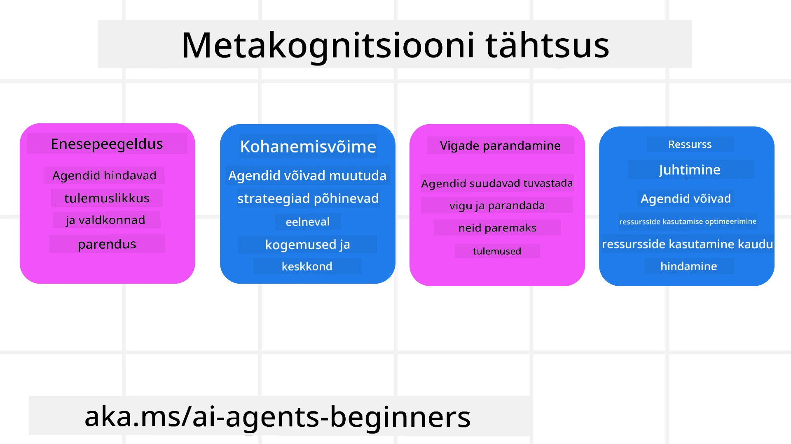
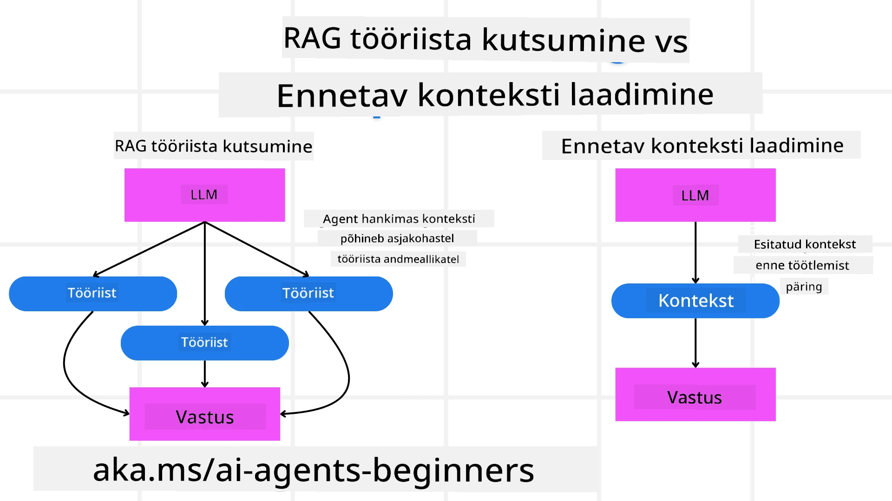

<!--
CO_OP_TRANSLATOR_METADATA:
{
  "original_hash": "5f0deef171fc3a68d5d3d770a8bfb03d",
  "translation_date": "2025-10-11T11:02:40+00:00",
  "source_file": "09-metacognition/README.md",
  "language_code": "et"
}
-->
[](https://youtu.be/His9R6gw6Ec?si=3_RMb8VprNvdLRhX)

> _(Klõpsa ülaloleval pildil, et vaadata selle õppetunni videot)_
# Metakognitsioon tehisintellekti agentides

## Sissejuhatus

Tere tulemast metakognitsiooni teemalisse õppetundi tehisintellekti agentides! See peatükk on mõeldud algajatele, kes on uudishimulikud selle kohta, kuidas tehisintellekti agendid suudavad mõelda omaenda mõtteprotsesside üle. Õppetunni lõpuks mõistate põhikontseptsioone ja saate praktilisi näiteid metakognitsiooni rakendamiseks tehisintellekti agentide disainis.

## Õppeeesmärgid

Pärast selle õppetunni läbimist suudate:

1. Mõista mõtlemistsüklite mõju agentide määratlustes.
2. Kasutada planeerimis- ja hindamistehnikaid enesekorrigeerivate agentide abistamiseks.
3. Luua oma agendid, mis suudavad manipuleerida koodiga ülesannete täitmiseks.

## Metakognitsiooni tutvustus

Metakognitsioon viitab kõrgema taseme kognitiivsetele protsessidele, mis hõlmavad omaenda mõtlemise üle mõtlemist. Tehisintellekti agentide puhul tähendab see, et nad suudavad hinnata ja kohandada oma tegevusi eneseteadlikkuse ja varasemate kogemuste põhjal. Metakognitsioon ehk "mõtlemine mõtlemise üle" on oluline kontseptsioon agentlike tehisintellekti süsteemide arendamisel. See hõlmab tehisintellekti süsteemide teadlikkust oma sisemistest protsessidest ning võimet jälgida, reguleerida ja kohandada oma käitumist vastavalt. Sarnaselt sellele, kuidas me loeme olukorda või analüüsime probleemi. See eneseteadlikkus aitab tehisintellekti süsteemidel teha paremaid otsuseid, tuvastada vigu ja parandada oma jõudlust aja jooksul – taas viidates Turingi testile ja arutelule selle üle, kas tehisintellekt võtab maailma üle.

Agentlike tehisintellekti süsteemide kontekstis aitab metakognitsioon lahendada mitmeid väljakutseid, näiteks:
- Läbipaistvus: Tagades, et tehisintellekti süsteemid suudavad selgitada oma mõttekäike ja otsuseid.
- Mõtlemine: Parandades tehisintellekti süsteemide võimet sünteesida teavet ja teha põhjendatud otsuseid.
- Kohanemine: Võimaldades tehisintellekti süsteemidel kohaneda uute keskkondade ja muutuvate tingimustega.
- Taju: Parandades tehisintellekti süsteemide täpsust keskkonnast saadud andmete tuvastamisel ja tõlgendamisel.

### Mis on metakognitsioon?

Metakognitsioon ehk "mõtlemine mõtlemise üle" on kõrgema taseme kognitiivne protsess, mis hõlmab eneseteadlikkust ja oma kognitiivsete protsesside eneseregulatsiooni. Tehisintellekti valdkonnas võimaldab metakognitsioon agentidel hinnata ja kohandada oma strateegiaid ja tegevusi, mis viib paremate probleemilahendus- ja otsustusvõimekusteni. Metakognitsiooni mõistmise abil saate disainida tehisintellekti agente, kes on mitte ainult intelligentsemad, vaid ka kohanemisvõimelisemad ja tõhusamad. Tõelises metakognitsioonis näeksite, kuidas tehisintellekt selgesõnaliselt analüüsib omaenda mõttekäike.

Näide: „Ma prioriteetselt valisin odavamad lennud, sest... Võib-olla jätsin otsesed lennud tähelepanuta, seega kontrollin uuesti.“
Jälgides, kuidas või miks ta valis teatud marsruudi.
- Märkides, et ta tegi vigu, kuna tugines liiga palju eelmiste kasutajate eelistustele, ja seetõttu muudab ta oma otsustusstrateegiat, mitte ainult lõplikku soovitust.
- Diagnostiseerides mustreid, nagu „Kui ma näen, et kasutaja mainib 'liiga rahvarohke,' peaksin mitte ainult eemaldama teatud vaatamisväärsused, vaid ka mõistma, et minu meetod 'populaarsete vaatamisväärsuste' valimiseks on vigane, kui ma alati järjestan populaarsuse järgi.“

### Metakognitsiooni tähtsus tehisintellekti agentides

Metakognitsioon mängib tehisintellekti agentide disainis olulist rolli mitmel põhjusel:



- Enesereflektsioon: Agendid suudavad hinnata oma jõudlust ja tuvastada parendamist vajavaid valdkondi.
- Kohanemisvõime: Agendid suudavad kohandada oma strateegiaid varasemate kogemuste ja muutuvate keskkondade põhjal.
- Vigade parandamine: Agendid suudavad tuvastada ja parandada vigu iseseisvalt, mis viib täpsemate tulemusteni.
- Ressursside haldamine: Agendid suudavad optimeerida ressursside, näiteks aja ja arvutusvõimsuse, kasutamist, planeerides ja hinnates oma tegevusi.

## Tehisintellekti agendi komponendid

Enne metakognitiivsete protsesside süvitsi minekut on oluline mõista tehisintellekti agendi põhikomponente. Tehisintellekti agent koosneb tavaliselt järgmistest:

- Persona: Agendi isiksus ja omadused, mis määravad, kuidas ta kasutajatega suhtleb.
- Tööriistad: Agendi võimed ja funktsioonid.
- Oskused: Agendi teadmised ja ekspertiis.

Need komponendid töötavad koos, et luua "ekspertiisiüksus," mis suudab täita konkreetseid ülesandeid.

**Näide**:
Mõelge reisibüroole, agenditeenusele, mis mitte ainult ei planeeri teie puhkust, vaid kohandab oma marsruuti reaalajas andmete ja varasemate klientide kogemuste põhjal.

### Näide: Metakognitsioon reisibürooteenuses

Kujutage ette, et disainite tehisintellekti juhitud reisibürooteenust. See agent, "Reisibüroo," aitab kasutajatel planeerida oma puhkusi. Metakognitsiooni kaasamiseks peab Reisibüroo hindama ja kohandama oma tegevusi eneseteadlikkuse ja varasemate kogemuste põhjal. Siin on, kuidas metakognitsioon võiks rolli mängida:

#### Praegune ülesanne

Praegune ülesanne on aidata kasutajal planeerida reisi Pariisi.

#### Sammud ülesande täitmiseks

1. **Koguge kasutaja eelistused**: Küsige kasutajalt tema reisikuupäevade, eelarve, huvide (nt muuseumid, köök, ostlemine) ja konkreetsete nõuete kohta.
2. **Hankige teavet**: Otsige lennuvõimalusi, majutust, vaatamisväärsusi ja restorane, mis vastavad kasutaja eelistustele.
3. **Looge soovitused**: Pakkuge isikupärastatud reisikava koos lennuandmete, hotellibroneeringute ja soovitatud tegevustega.
4. **Kohandage tagasiside põhjal**: Küsige kasutajalt soovituste kohta tagasisidet ja tehke vajalikud muudatused.

#### Vajalikud ressursid

- Juurdepääs lennu- ja hotellibroneeringute andmebaasidele.
- Teave Pariisi vaatamisväärsuste ja restoranide kohta.
- Kasutajate tagasiside andmed varasematest interaktsioonidest.

#### Kogemused ja enesereflektsioon

Reisibüroo kasutab metakognitsiooni, et hinnata oma jõudlust ja õppida varasematest kogemustest. Näiteks:

1. **Kasutajate tagasiside analüüs**: Reisibüroo vaatab üle kasutajate tagasiside, et määrata, millised soovitused olid hästi vastu võetud ja millised mitte. Ta kohandab oma tulevasi ettepanekuid vastavalt.
2. **Kohanemisvõime**: Kui kasutaja on varem maininud rahvarohkete kohtade mittearmastamist, väldib Reisibüroo tulevikus populaarsete turismikohtade soovitamist tipptundidel.
3. **Vigade parandamine**: Kui Reisibüroo tegi varasemal broneerimisel vea, näiteks soovitas hotelli, mis oli täielikult broneeritud, õpib ta tulevikus enne soovituste tegemist rangemalt kontrollima saadavust.

#### Praktiline arendaja näide

Siin on lihtsustatud näide, kuidas Reisibüroo kood võiks välja näha metakognitsiooni kaasamisel:

```python
class Travel_Agent:
    def __init__(self):
        self.user_preferences = {}
        self.experience_data = []

    def gather_preferences(self, preferences):
        self.user_preferences = preferences

    def retrieve_information(self):
        # Search for flights, hotels, and attractions based on preferences
        flights = search_flights(self.user_preferences)
        hotels = search_hotels(self.user_preferences)
        attractions = search_attractions(self.user_preferences)
        return flights, hotels, attractions

    def generate_recommendations(self):
        flights, hotels, attractions = self.retrieve_information()
        itinerary = create_itinerary(flights, hotels, attractions)
        return itinerary

    def adjust_based_on_feedback(self, feedback):
        self.experience_data.append(feedback)
        # Analyze feedback and adjust future recommendations
        self.user_preferences = adjust_preferences(self.user_preferences, feedback)

# Example usage
travel_agent = Travel_Agent()
preferences = {
    "destination": "Paris",
    "dates": "2025-04-01 to 2025-04-10",
    "budget": "moderate",
    "interests": ["museums", "cuisine"]
}
travel_agent.gather_preferences(preferences)
itinerary = travel_agent.generate_recommendations()
print("Suggested Itinerary:", itinerary)
feedback = {"liked": ["Louvre Museum"], "disliked": ["Eiffel Tower (too crowded)"]}
travel_agent.adjust_based_on_feedback(feedback)
```

#### Miks metakognitsioon on oluline

- **Enesereflektsioon**: Agendid suudavad analüüsida oma jõudlust ja tuvastada parendamist vajavaid valdkondi.
- **Kohanemisvõime**: Agendid suudavad kohandada strateegiaid tagasiside ja muutuvate tingimuste põhjal.
- **Vigade parandamine**: Agendid suudavad iseseisvalt tuvastada ja parandada vigu.
- **Ressursside haldamine**: Agendid suudavad optimeerida ressursside, näiteks aja ja arvutusvõimsuse, kasutamist.

Metakognitsiooni kaasamisega suudab Reisibüroo pakkuda isikupärasemaid ja täpsemaid reisisoovitusi, parandades üldist kasutajakogemust.

---

## 2. Agentide planeerimine

Planeerimine on tehisintellekti agentide käitumise kriitiline komponent. See hõlmab eesmärgi saavutamiseks vajalike sammude kavandamist, arvestades praegust olukorda, ressursse ja võimalikke takistusi.

### Planeerimise elemendid

- **Praegune ülesanne**: Määratlege ülesanne selgelt.
- **Sammud ülesande täitmiseks**: Jagage ülesanne hallatavateks sammudeks.
- **Vajalikud ressursid**: Määrake vajalikud ressursid.
- **Kogemused**: Kasutage varasemaid kogemusi planeerimise informeerimiseks.

**Näide**:
Siin on sammud, mida Reisibüroo peab tegema, et aidata kasutajat reisi planeerimisel tõhusalt:

### Reisibüroo sammud

1. **Koguge kasutaja eelistused**
   - Küsige kasutajalt tema reisikuupäevade, eelarve, huvide ja konkreetsete nõuete kohta.
   - Näited: "Millal te plaanite reisida?" "Mis on teie eelarvevahemik?" "Milliseid tegevusi te puhkuse ajal naudite?"

2. **Hankige teavet**
   - Otsige asjakohaseid reisivõimalusi kasutaja eelistuste põhjal.
   - **Lennud**: Otsige saadaval olevaid lende kasutaja eelarve ja eelistatud reisikuupäevade piires.
   - **Majutus**: Leidke hotellid või rendipinnad, mis vastavad kasutaja eelistustele asukoha, hinna ja mugavuste osas.
   - **Vaatamisväärsused ja restoranid**: Tuvastage populaarsed vaatamisväärsused, tegevused ja söögikohad, mis vastavad kasutaja huvidele.

3. **Looge soovitused**
   - Koostage kogutud teave isikupärastatud reisikavaks.
   - Esitage üksikasjad, nagu lennuvõimalused, hotellibroneeringud ja soovitatud tegevused, kohandades soovitusi kasutaja eelistuste järgi.

4. **Esitage reisikava kasutajale**
   - Jagage kavandatud reisikava kasutajaga ülevaatamiseks.
   - Näide: "Siin on soovitatud reisikava teie reisiks Pariisi. See sisaldab lennuandmeid, hotellibroneeringuid ja soovitatud tegevuste ja restoranide nimekirja. Andke teada, mida arvate!"

5. **Koguge tagasisidet**
   - Küsige kasutajalt kavandatud reisikava kohta tagasisidet.
   - Näited: "Kas teile meeldivad lennuvõimalused?" "Kas hotell sobib teie vajadustega?" "Kas on mingeid tegevusi, mida soovite lisada või eemaldada?"

6. **Kohandage tagasiside põhjal**
   - Muutke reisikava kasutaja tagasiside põhjal.
   - Tehke vajalikud muudatused lennu-, majutus- ja tegevussoovitustes, et paremini sobituda kasutaja eelistustega.

7. **Lõplik kinnitus**
   - Esitage uuendatud reisikava kasutajale lõplikuks kinnitamiseks.
   - Näide: "Ma tegin muudatused teie tagasiside põhjal. Siin on uuendatud reisikava. Kas kõik tundub teile sobiv?"

8. **Broneerige ja kinnitage reservatsioonid**
   - Kui kasutaja kiidab reisikava heaks, jätkake lennupiletite, majutuse ja eelplaneeritud tegevuste broneerimisega.
   - Saatke kasutajale kinnituse üksikasjad.

9. **Pakkuge pidevat tuge**
   - Olge valmis aitama kasutajat mis tahes muudatuste või täiendavate soovidega enne reisi ja reisi ajal.
   - Näide: "Kui vajate reisi ajal täiendavat abi, võtke minuga igal ajal ühendust!"

### Näide interaktsioonist

```python
class Travel_Agent:
    def __init__(self):
        self.user_preferences = {}
        self.experience_data = []

    def gather_preferences(self, preferences):
        self.user_preferences = preferences

    def retrieve_information(self):
        flights = search_flights(self.user_preferences)
        hotels = search_hotels(self.user_preferences)
        attractions = search_attractions(self.user_preferences)
        return flights, hotels, attractions

    def generate_recommendations(self):
        flights, hotels, attractions = self.retrieve_information()
        itinerary = create_itinerary(flights, hotels, attractions)
        return itinerary

    def adjust_based_on_feedback(self, feedback):
        self.experience_data.append(feedback)
        self.user_preferences = adjust_preferences(self.user_preferences, feedback)

# Example usage within a booing request
travel_agent = Travel_Agent()
preferences = {
    "destination": "Paris",
    "dates": "2025-04-01 to 2025-04-10",
    "budget": "moderate",
    "interests": ["museums", "cuisine"]
}
travel_agent.gather_preferences(preferences)
itinerary = travel_agent.generate_recommendations()
print("Suggested Itinerary:", itinerary)
feedback = {"liked": ["Louvre Museum"], "disliked": ["Eiffel Tower (too crowded)"]}
travel_agent.adjust_based_on_feedback(feedback)
```

## 3. Parandav RAG-süsteem

Kõigepealt alustame RAG-tööriista ja ennetava konteksti laadimise erinevuse mõistmisest.



### Retrieval-Augmented Generation (RAG)

RAG ühendab otsingusüsteemi generatiivse mudeliga. Kui tehakse päring, otsingusüsteem hangib asjakohased dokumendid või andmed välisest allikast ning see hangitud teave kasutatakse generatiivse mudeli sisendi täiendamiseks. See aitab mudelil genereerida täpsemaid ja kontekstuaalselt asjakohaseid vastuseid.

RAG-süsteemis hangib agent asjakohast teavet teadmistebaasist ja kasutab seda sobivate vastuste või tegevuste genereerimiseks.

### Parandav RAG-lähenemine

Parandav RAG-lähenemine keskendub RAG-tehnikate kasutamisele vigade parandamiseks ja tehisintellekti agentide täpsuse parandamiseks. See hõlmab:

1. **Päringutehnika**: Spetsiifiliste päringute kasutamine agendi juhendamiseks asjakohase teabe hankimisel.
2. **Tööriist**: Algoritmide ja mehhanismide rakendamine, mis võimaldavad agendil hinnata hangitud teabe asjakohasust ja genereerida täpseid vastuseid.
3. **Hindamine**: Agendi jõudluse pidev hindamine ja kohanduste tegemine selle täpsuse ja tõhususe parandamiseks.

#### Näide: Parandav RAG otsingusüsteemis

Mõelge otsingusüsteemile, mis hangib veebist teavet kasutaja päringutele vastamiseks. Parandav RAG-lähenemine võib hõlmata:

1. **Päringutehnika**: Otsingupäringute koostamine kasutaja sisendi põhjal.
2. **Tööriist**: Loodusliku keele töötlemise ja masinõppe algoritmide kasutamine otsingutulemuste järjestamiseks ja filtreerimiseks.
3. **Hindamine**: Kasutajate tagasiside analüüsimine, et tuvastada ja parandada hangitud teabe ebatäpsusi.

### Parandav RAG reisibüroos

Parandav RAG (Retrieval-Augmented Generation) parandab tehisintellekti võimet hankida ja genereerida teavet, parandades samal ajal ebatäpsusi. Vaatame, kuidas Reisibüroo saab kasutada Parandavat RAG-lähenemist, et pakkuda täpsemaid ja asjakohasemaid reisisoovitusi.

See hõlmab:

- **Päringutehnika:** Spetsiifiliste päringute kasutamine agendi juhendamiseks asjakohase teabe hankimisel.
- **Tööriist:** Algoritmide ja mehhanismide rakendamine, mis võimaldavad agendil hinnata hangitud teabe asjakohasust ja genereerida täpseid vastuseid.
- **Hindamine:** Agendi jõudluse pidev hindamine ja kohanduste tegemine selle täpsuse ja tõhususe parandamiseks.

#### Sammud Parandava RAG rakendamiseks Reisibüroos

1. **Esialgne kasutajainteraktsioon**
   - Reisibüroo kogub kasutajalt esialgsed eelistused, näiteks sihtkoht, reisikuupäevad, eelarve ja huvid.
   - Näide:

     ```python
     preferences = {
         "destination": "Paris",
         "dates": "2025-04-01 to 2025-04-10",
         "budget": "moderate",
         "interests": ["museums", "cuisine"]
     }
     ```

2. **Teabe
Eelneva konteksti laadimine hõlmab asjakohase taustinfo või konteksti laadimist mudelisse enne päringu töötlemist. See tähendab, et mudelil on algusest peale juurdepääs sellele teabele, mis aitab tal anda informeeritumaid vastuseid, ilma et oleks vaja protsessi käigus täiendavat teavet hankida.

Siin on lihtsustatud näide, kuidas eelneva konteksti laadimine võiks välja näha reisibüroo rakenduses Pythonis:

```python
class TravelAgent:
    def __init__(self):
        # Pre-load popular destinations and their information
        self.context = {
            "Paris": {"country": "France", "currency": "Euro", "language": "French", "attractions": ["Eiffel Tower", "Louvre Museum"]},
            "Tokyo": {"country": "Japan", "currency": "Yen", "language": "Japanese", "attractions": ["Tokyo Tower", "Shibuya Crossing"]},
            "New York": {"country": "USA", "currency": "Dollar", "language": "English", "attractions": ["Statue of Liberty", "Times Square"]},
            "Sydney": {"country": "Australia", "currency": "Dollar", "language": "English", "attractions": ["Sydney Opera House", "Bondi Beach"]}
        }

    def get_destination_info(self, destination):
        # Fetch destination information from pre-loaded context
        info = self.context.get(destination)
        if info:
            return f"{destination}:\nCountry: {info['country']}\nCurrency: {info['currency']}\nLanguage: {info['language']}\nAttractions: {', '.join(info['attractions'])}"
        else:
            return f"Sorry, we don't have information on {destination}."

# Example usage
travel_agent = TravelAgent()
print(travel_agent.get_destination_info("Paris"))
print(travel_agent.get_destination_info("Tokyo"))
```

#### Selgitus

1. **Initsialiseerimine (`__init__` meetod)**: `TravelAgent` klass laeb ette sõnastiku, mis sisaldab teavet populaarsete sihtkohtade kohta, nagu Pariis, Tokyo, New York ja Sydney. Sõnastik sisaldab üksikasju, nagu riik, valuuta, keel ja peamised vaatamisväärsused iga sihtkoha kohta.

2. **Teabe hankimine (`get_destination_info` meetod)**: Kui kasutaja pärib konkreetse sihtkoha kohta, otsib `get_destination_info` meetod vajalikku teavet eelnevalt laaditud konteksti sõnastikust.

Eelneva konteksti laadimise abil saab reisibüroo rakendus kiiresti vastata kasutaja päringutele, ilma et oleks vaja seda teavet reaalajas välisest allikast hankida. See muudab rakenduse tõhusamaks ja reageerimisvõimelisemaks.

### Plaani algatamine eesmärgiga enne iteratsiooni

Plaani algatamine eesmärgiga tähendab selge eesmärgi või sihtmärgi määratlemist juba alguses. Selle eesmärgi määratlemine aitab mudelil kasutada seda juhisena kogu iteratiivse protsessi vältel. See tagab, et iga iteratsioon viib lähemale soovitud tulemuse saavutamisele, muutes protsessi tõhusamaks ja sihipärasemaks.

Siin on näide, kuidas reisibüroo võiks algatada reisiplaani eesmärgiga enne iteratsiooni Pythonis:

### Stsenaarium

Reisibüroo soovib koostada kliendile kohandatud puhkuseplaani. Eesmärk on luua reisikava, mis maksimeerib kliendi rahulolu, lähtudes tema eelistustest ja eelarvest.

### Sammud

1. Määratle kliendi eelistused ja eelarve.
2. Algata esialgne plaan nende eelistuste põhjal.
3. Iteratsiooni abil täienda plaani, optimeerides kliendi rahulolu.

#### Python kood

```python
class TravelAgent:
    def __init__(self, destinations):
        self.destinations = destinations

    def bootstrap_plan(self, preferences, budget):
        plan = []
        total_cost = 0

        for destination in self.destinations:
            if total_cost + destination['cost'] <= budget and self.match_preferences(destination, preferences):
                plan.append(destination)
                total_cost += destination['cost']

        return plan

    def match_preferences(self, destination, preferences):
        for key, value in preferences.items():
            if destination.get(key) != value:
                return False
        return True

    def iterate_plan(self, plan, preferences, budget):
        for i in range(len(plan)):
            for destination in self.destinations:
                if destination not in plan and self.match_preferences(destination, preferences) and self.calculate_cost(plan, destination) <= budget:
                    plan[i] = destination
                    break
        return plan

    def calculate_cost(self, plan, new_destination):
        return sum(destination['cost'] for destination in plan) + new_destination['cost']

# Example usage
destinations = [
    {"name": "Paris", "cost": 1000, "activity": "sightseeing"},
    {"name": "Tokyo", "cost": 1200, "activity": "shopping"},
    {"name": "New York", "cost": 900, "activity": "sightseeing"},
    {"name": "Sydney", "cost": 1100, "activity": "beach"},
]

preferences = {"activity": "sightseeing"}
budget = 2000

travel_agent = TravelAgent(destinations)
initial_plan = travel_agent.bootstrap_plan(preferences, budget)
print("Initial Plan:", initial_plan)

refined_plan = travel_agent.iterate_plan(initial_plan, preferences, budget)
print("Refined Plan:", refined_plan)
```

#### Koodi selgitus

1. **Initsialiseerimine (`__init__` meetod)**: `TravelAgent` klass initsialiseeritakse potentsiaalsete sihtkohtade loendiga, millest igaühel on omadused, nagu nimi, maksumus ja tegevuse tüüp.

2. **Plaani algatamine (`bootstrap_plan` meetod)**: See meetod loob esialgse reisiplaani kliendi eelistuste ja eelarve põhjal. See iteratsioon käib läbi sihtkohtade loendi ja lisab plaani need, mis vastavad kliendi eelistustele ja sobivad eelarvega.

3. **Eelistuste sobitamine (`match_preferences` meetod)**: See meetod kontrollib, kas sihtkoht vastab kliendi eelistustele.

4. **Plaani iteratsioon (`iterate_plan` meetod)**: See meetod täiendab esialgset plaani, püüdes asendada iga sihtkoha plaanis parema valikuga, arvestades kliendi eelistusi ja eelarvepiiranguid.

5. **Maksumuse arvutamine (`calculate_cost` meetod)**: See meetod arvutab praeguse plaani kogumaksumuse, sealhulgas potentsiaalse uue sihtkoha.

#### Näide kasutusest

- **Esialgne plaan**: Reisibüroo koostab esialgse plaani, lähtudes kliendi eelistustest vaatamisväärsuste külastamiseks ja eelarvest $2000.
- **Täiendatud plaan**: Reisibüroo täiendab plaani, optimeerides kliendi eelistusi ja eelarvet.

Algatades plaani selge eesmärgiga (nt maksimeerida kliendi rahulolu) ja iteratsiooni abil plaani täiustades, saab reisibüroo luua kliendile kohandatud ja optimeeritud reisikava. See lähenemine tagab, et reisiplaan vastab kliendi eelistustele ja eelarvele juba algusest peale ning paraneb iga iteratsiooniga.

### LLM-i kasutamine ümberjärjestamiseks ja skoorimiseks

Suured keelemudelid (LLM-id) võivad olla kasulikud dokumentide või genereeritud vastuste asjakohasuse ja kvaliteedi hindamiseks ning ümberjärjestamiseks. Siin on, kuidas see toimib:

**Hankimine:** Esialgne hankimise samm toob päringu põhjal välja kandidaatdokumendid või -vastused.

**Ümberjärjestamine:** LLM hindab neid kandidaate ja järjestab need ümber, lähtudes nende asjakohasusest ja kvaliteedist. See samm tagab, et kõige asjakohasem ja kvaliteetsem teave esitatakse esimesena.

**Skoorimine:** LLM määrab igale kandidaadile skoori, mis kajastab nende asjakohasust ja kvaliteeti. See aitab valida parima vastuse või dokumendi kasutajale.

LLM-i kasutamisega ümberjärjestamiseks ja skoorimiseks saab süsteem pakkuda täpsemat ja konteksti arvestavat teavet, parandades üldist kasutajakogemust.

Siin on näide, kuidas reisibüroo võiks kasutada suurt keelemudelit (LLM) reisisihtkohtade ümberjärjestamiseks ja skoorimiseks, lähtudes kasutaja eelistustest Pythonis:

#### Stsenaarium - Reis eelistuste põhjal

Reisibüroo soovib soovitada kliendile parimaid reisisihtkohti, lähtudes tema eelistustest. LLM aitab sihtkohad ümber järjestada ja skoorida, et tagada kõige asjakohasemate valikute esitamine.

#### Sammud:

1. Kogu kasutaja eelistused.
2. Hangi potentsiaalsete reisisihtkohtade loend.
3. Kasuta LLM-i sihtkohtade ümberjärjestamiseks ja skoorimiseks, lähtudes kasutaja eelistustest.

Siin on, kuidas eelmise näidet uuendada, kasutades Azure OpenAI teenuseid:

#### Nõuded

1. Sul peab olema Azure'i tellimus.
2. Loo Azure OpenAI ressurss ja hanki oma API võti.

#### Näide Python koodist

```python
import requests
import json

class TravelAgent:
    def __init__(self, destinations):
        self.destinations = destinations

    def get_recommendations(self, preferences, api_key, endpoint):
        # Generate a prompt for the Azure OpenAI
        prompt = self.generate_prompt(preferences)
        
        # Define headers and payload for the request
        headers = {
            'Content-Type': 'application/json',
            'Authorization': f'Bearer {api_key}'
        }
        payload = {
            "prompt": prompt,
            "max_tokens": 150,
            "temperature": 0.7
        }
        
        # Call the Azure OpenAI API to get the re-ranked and scored destinations
        response = requests.post(endpoint, headers=headers, json=payload)
        response_data = response.json()
        
        # Extract and return the recommendations
        recommendations = response_data['choices'][0]['text'].strip().split('\n')
        return recommendations

    def generate_prompt(self, preferences):
        prompt = "Here are the travel destinations ranked and scored based on the following user preferences:\n"
        for key, value in preferences.items():
            prompt += f"{key}: {value}\n"
        prompt += "\nDestinations:\n"
        for destination in self.destinations:
            prompt += f"- {destination['name']}: {destination['description']}\n"
        return prompt

# Example usage
destinations = [
    {"name": "Paris", "description": "City of lights, known for its art, fashion, and culture."},
    {"name": "Tokyo", "description": "Vibrant city, famous for its modernity and traditional temples."},
    {"name": "New York", "description": "The city that never sleeps, with iconic landmarks and diverse culture."},
    {"name": "Sydney", "description": "Beautiful harbour city, known for its opera house and stunning beaches."},
]

preferences = {"activity": "sightseeing", "culture": "diverse"}
api_key = 'your_azure_openai_api_key'
endpoint = 'https://your-endpoint.com/openai/deployments/your-deployment-name/completions?api-version=2022-12-01'

travel_agent = TravelAgent(destinations)
recommendations = travel_agent.get_recommendations(preferences, api_key, endpoint)
print("Recommended Destinations:")
for rec in recommendations:
    print(rec)
```

#### Koodi selgitus - Eelistuste broneerija

1. **Initsialiseerimine**: `TravelAgent` klass initsialiseeritakse potentsiaalsete reisisihtkohtade loendiga, millest igaühel on omadused, nagu nimi ja kirjeldus.

2. **Soovituste hankimine (`get_recommendations` meetod)**: See meetod genereerib Azure OpenAI teenusele päringu, lähtudes kasutaja eelistustest, ja teeb HTTP POST-päringu Azure OpenAI API-le, et saada ümberjärjestatud ja skooritud sihtkohad.

3. **Päringu genereerimine (`generate_prompt` meetod)**: See meetod koostab Azure OpenAI jaoks päringu, mis sisaldab kasutaja eelistusi ja sihtkohtade loendit. Päring juhendab mudelit sihtkohad ümber järjestama ja skoorima, lähtudes antud eelistustest.

4. **API-päring**: `requests` teek kasutatakse HTTP POST-päringu tegemiseks Azure OpenAI API lõpp-punkti. Vastus sisaldab ümberjärjestatud ja skooritud sihtkohti.

5. **Näide kasutusest**: Reisibüroo kogub kasutaja eelistused (nt huvi vaatamisväärsuste ja mitmekesise kultuuri vastu) ning kasutab Azure OpenAI teenust, et saada ümberjärjestatud ja skooritud reisisoovitused.

Veendu, et asendad `your_azure_openai_api_key` oma tegeliku Azure OpenAI API võtmega ja `https://your-endpoint.com/...` tegeliku Azure OpenAI juurutuse lõpp-punkti URL-iga.

LLM-i kasutamisega ümberjärjestamiseks ja skoorimiseks saab reisibüroo pakkuda klientidele isikupärasemaid ja asjakohasemaid reisisoovitusi, parandades nende üldist kogemust.

### RAG: Päringutehnika vs tööriist

Retrieval-Augmented Generation (RAG) võib olla nii päringutehnika kui ka tööriist AI-agentide arendamisel. Nende kahe eristamine aitab RAG-i projektides tõhusamalt kasutada.

#### RAG kui päringutehnika

**Mis see on?**

- Päringutehnika puhul hõlmab RAG konkreetsete päringute või juhiste koostamist, et suunata teabe hankimist suurest korpusest või andmebaasist. Seda teavet kasutatakse seejärel vastuste või tegevuste genereerimiseks.

**Kuidas see toimib:**

1. **Päringute koostamine**: Loo hästi struktureeritud päringud või juhised, lähtudes ülesandest või kasutaja sisendist.
2. **Teabe hankimine**: Kasuta päringuid, et otsida asjakohast teavet olemasolevast teadmiste baasist või andmestikust.
3. **Vastuse genereerimine**: Kombineeri hangitud teave generatiivsete AI-mudelitega, et toota terviklik ja sidus vastus.

**Näide reisibüroos**:

- Kasutaja sisend: "Soovin külastada Pariisi muuseume."
- Päring: "Leia Pariisi parimad muuseumid."
- Hangitud teave: Üksikasjad Louvre'i muuseumi, Musée d'Orsay jne kohta.
- Genereeritud vastus: "Siin on mõned Pariisi parimad muuseumid: Louvre'i muuseum, Musée d'Orsay ja Centre Pompidou."

#### RAG kui tööriist

**Mis see on?**

- Tööriistana on RAG integreeritud süsteem, mis automatiseerib hankimise ja genereerimise protsessi, muutes arendajatele keerukate AI-funktsioonide rakendamise lihtsamaks, ilma et oleks vaja iga päringu jaoks käsitsi päringuid koostada.

**Kuidas see toimib:**

1. **Integreerimine**: RAG integreeritakse AI-agendi arhitektuuri, võimaldades tal automaatselt hallata hankimise ja genereerimise ülesandeid.
2. **Automatiseerimine**: Tööriist haldab kogu protsessi, alates kasutaja sisendi vastuvõtmisest kuni lõpliku vastuse genereerimiseni, ilma et iga sammu jaoks oleks vaja selgesõnalisi päringuid.
3. **Tõhusus**: Parandab agendi jõudlust, sujuvamaks muutes hankimise ja genereerimise protsessi, võimaldades kiiremaid ja täpsemaid vastuseid.

**Näide reisibüroos**:

- Kasutaja sisend: "Soovin külastada Pariisi muuseume."
- RAG tööriist: Hangib automaatselt teavet muuseumide kohta ja genereerib vastuse.
- Genereeritud vastus: "Siin on mõned Pariisi parimad muuseumid: Louvre'i muuseum, Musée d'Orsay ja Centre Pompidou."

### Võrdlus

| Aspekt                 | Päringutehnika                                        | Tööriist                                                  |
|------------------------|-------------------------------------------------------------|-------------------------------------------------------|
| **Manuaalne vs automaatne**| Päringute käsitsi koostamine iga päringu jaoks.               | Hankimise ja genereerimise automatiseeritud protsess.       |
| **Kontroll**            | Pakub rohkem kontrolli hankimise protsessi üle.             | Sujuvam ja automatiseeritud hankimise ja genereerimise protsess.|
| **Paindlikkus**        | Võimaldab kohandatud päringuid konkreetsete vajaduste põhjal.      | Tõhusam suurte rakenduste jaoks.       |
| **Keerukus**         | Nõuab päringute koostamist ja kohandamist.                  | Lihtsam integreerida AI-agendi arhitektuuri. |

### Praktilised näited

**Päringutehnika näide:**

```python
def search_museums_in_paris():
    prompt = "Find top museums in Paris"
    search_results = search_web(prompt)
    return search_results

museums = search_museums_in_paris()
print("Top Museums in Paris:", museums)
```

**Tööriista näide:**

```python
class Travel_Agent:
    def __init__(self):
        self.rag_tool = RAGTool()

    def get_museums_in_paris(self):
        user_input = "I want to visit museums in Paris."
        response = self.rag_tool.retrieve_and_generate(user_input)
        return response

travel_agent = Travel_Agent()
museums = travel_agent.get_museums_in_paris()
print("Top Museums in Paris:", museums)
```

### Asjakohasuse hindamine

Asjakohasuse hindamine on AI-agendi jõudluse oluline aspekt. See tagab, et agenti poolt hangitud ja genereeritud teave on kasutajale sobiv, täpne ja kasulik. Vaatame, kuidas AI-agentides asjakohasust hinnata, sealhulgas praktilisi näiteid ja tehnikaid.

#### Asjakohasuse hindamise põhikontseptsioonid

1. **Konteksti teadlikkus**:
   - Agent peab mõistma kasutaja päringu konteksti, et hankida ja genereerida asjakohast teavet.
   - Näide: Kui kasutaja küsib "Pariisi parimad restoranid", peaks agent arvestama kasutaja eelistusi, nagu köögitüüp ja eelarve.

2. **Täpsus**:
   - Agendi poolt pakutav teave peaks olema faktuaalselt korrektne ja ajakohane.
   - Näide: Soovitada praegu avatud restorane, millel on head arvustused, mitte vananenud või suletud valikuid.

3. **Kasutaja kavatsus**:
   - Agent peaks tuvastama kasutaja päringu taga oleva kavatsuse, et pakkuda kõige asjakohasemat teavet.
   - Näide: Kui kasutaja küsib "soodsad hotellid", peaks agent eelistama taskukohaseid valikuid.

4. **Tagasiside tsükkel**:
   - Kasutajate tagasiside pidev kogumine ja analüüs aitab agentil oma asjakohasuse hindamise protsessi täiustada.
   - Näide: Kasutajate hinnangute ja tagasiside integreerimine varasemate soovituste kohta, et parandada tulevasi vastuseid.

#### Praktilised tehnikad asjakohasuse hindamiseks

1. **Asjakohasuse skoorimine**:
   - Määrake igale hangitud elemendile asjakohasuse skoor, lähtudes sellest, kui hästi see vastab kasutaja päringule ja eelistustele.
   - Näide:

     ```python
     def relevance_score(item, query):
         score = 0
         if item['category'] in query['interests']:
             score += 1
         if item['price'] <= query['budget']:
             score += 1
         if item['location'] == query['destination']:
             score += 1
         return score
     ```

2. **Filtreerimine ja järjestamine**:
   - Filtreerige välja ebaolulised elemendid ja järjestage ülejäänud nende asjakohasuse skooride põhjal.
   - Näide:

     ```python
     def filter_and_rank(items, query):
         ranked_items = sorted(items, key=lambda item: relevance_score(item, query), reverse=True)
         return ranked_items[:10]  # Return top 10 relevant items
     ```

3. **Loodusliku keele töötlemine (NLP)**:
   - Kasutage NLP tehnikaid, et mõista kasutaja päringut ja hankida asjakohast teavet.
   - Näide:

     ```python
     def process_query(query):
         # Use NLP to extract key information from the user's query
         processed_query = nlp(query)
         return processed_query
     ```

4. **Kasutaja tagasiside integreerimine**:
   - Koguge kasutajate tagasisidet pakutud soovituste kohta ja kasutage seda tulevaste asjakohasuse hindamiste kohandamiseks.
   - Näide:

     ```python
     def adjust_based_on_feedback(feedback, items):
         for item in items:
             if item['name'] in feedback['liked']:
                 item['relevance'] += 1
             if item['name'] in feedback['disliked']:
                 item['relevance'] -= 1
         return items
     ```

#### Näide: Asjakohasuse hindamine reisibüroos

Siin on praktiline näide, kuidas reisibüroo saab hinnata reisisoovituste asjakohasust:

```python
class Travel_Agent:
    def __init__(self):
        self.user_preferences = {}
        self.experience_data = []

    def gather_preferences(self, preferences):
        self.user_preferences = preferences

    def retrieve_information(self):
        flights = search_flights(self.user_preferences)
        hotels = search_hotels(self.user_preferences)
        attractions = search_attractions(self.user_preferences)
        return flights, hotels, attractions

    def generate_recommendations(self):
        flights, hotels, attractions = self.retrieve_information()
        ranked_hotels = self.filter_and_rank(hotels, self.user_preferences)
        itinerary = create_itinerary(flights, ranked_hotels, attractions)
        return itinerary

    def filter_and_rank(self, items, query):
        ranked_items = sorted(items, key=lambda item: self.relevance_score(item, query), reverse=True)
        return ranked_items[:10]  # Return top 10 relevant items

    def relevance_score(self, item, query):
        score = 0
        if item['category'] in query['interests']:
            score += 1
        if item['price'] <= query['budget']:
            score += 1
        if item['location'] == query['destination']:
            score += 1
        return score

    def adjust_based_on_feedback(self, feedback, items):
        for item in items:
            if item['name'] in feedback['liked']:
                item['relevance'] += 1
            if item['name'] in feedback['disliked']:
                item['relevance'] -= 1
        return items

# Example usage
travel_agent = Travel_Agent()
preferences = {
    "destination": "Paris",
    "dates": "2025-04-01 to 2025-04-10",
    "budget": "moderate",
    "interests": ["museums", "cuisine"]
}
travel_agent.gather_preferences(preferences)
itinerary = travel_agent.generate_recommendations()
print("Suggested Itinerary:", itinerary)
feedback = {"liked": ["Louvre Museum"], "disliked": ["Eiffel Tower (too crowded)"]}
updated_items = travel_agent.adjust_based_on_feedback(feedback, itinerary['hotels'])
print("Updated Itinerary with Feedback:", updated_items)
```

### Otsing kavatsusega

Otsing kavatsusega hõlmab kasutaja päringu taga oleva eesmärgi või kavatsuse mõistmist ja tõlgendamist, et hankida ja genereerida kõige asjakohasem ja kasulikum teave. See lähenemine läheb kaugemale pelgalt märksõnade sobitamisest ja keskendub kasutaja tegelike vajaduste ja konteksti mõistmisele.

#### Otsing kavatsusega põhikontseptsioonid

1. **Kasutaja kavatsuse mõistmine**:
   - Kasutaja kavatsus võib jagada kolme peamisse kategooriasse: informatiivne, navigeeriv ja tehinguline.
     - **Informatiivne kavatsus**: Kasutaja otsib teavet teema kohta (nt "Millised on Pariisi parimad muuseumid?").
     - **Navigeeriv kavatsus**: Kasutaja soovib liikuda konkreetsele veebisaidile või lehele (nt "Louvre'i muuseumi ametlik veebisait").
     - **Tehinguline kavatsus**: Kasutaja soovib teha tehingu, nagu lennu broneerimine või ostu sooritamine (nt "Broneeri lend Pariisi").

2. **Konteksti teadlikkus**:
   - Kasutaja päringu konteksti analüüsimine aitab täpselt tuvastada tema kavatsust. See hõlmab varasemate interaktsioonide, kasutaja eelistuste ja praeguse päringu konkreetsete detailide arvestamist.

3. **Loodusliku keele töötlemine (NLP)**:
   - NLP tehnikaid kasutatakse kasutaja esitatud loodusliku keele päringute mõistmiseks ja tõlgendamiseks. See hõlmab ülesandeid, nagu entiteetide tuvastamine, sentimentide analüüs ja päringu parsimine.

4. **Isikupärastamine**:
   - Otsingutulemuste isikupärastamine, lähtudes kasutaja ajaloost, eelistustest ja tagasisidest, parandab hangitud teabe asjakohasust.

#### Praktiline näide: Otsing kavatsusega reis
1. **Kasutaja eelistuste kogumine**

   ```python
   class Travel_Agent:
       def __init__(self):
           self.user_preferences = {}

       def gather_preferences(self, preferences):
           self.user_preferences = preferences
   ```

2. **Kasutaja kavatsuste mõistmine**

   ```python
   def identify_intent(query):
       if "book" in query or "purchase" in query:
           return "transactional"
       elif "website" in query or "official" in query:
           return "navigational"
       else:
           return "informational"
   ```

3. **Konteksti teadlikkus**

   ```python
   def analyze_context(query, user_history):
       # Combine current query with user history to understand context
       context = {
           "current_query": query,
           "user_history": user_history
       }
       return context
   ```

4. **Otsing ja tulemuste isikupärastamine**

   ```python
   def search_with_intent(query, preferences, user_history):
       intent = identify_intent(query)
       context = analyze_context(query, user_history)
       if intent == "informational":
           search_results = search_information(query, preferences)
       elif intent == "navigational":
           search_results = search_navigation(query)
       elif intent == "transactional":
           search_results = search_transaction(query, preferences)
       personalized_results = personalize_results(search_results, user_history)
       return personalized_results

   def search_information(query, preferences):
       # Example search logic for informational intent
       results = search_web(f"best {preferences['interests']} in {preferences['destination']}")
       return results

   def search_navigation(query):
       # Example search logic for navigational intent
       results = search_web(query)
       return results

   def search_transaction(query, preferences):
       # Example search logic for transactional intent
       results = search_web(f"book {query} to {preferences['destination']}")
       return results

   def personalize_results(results, user_history):
       # Example personalization logic
       personalized = [result for result in results if result not in user_history]
       return personalized[:10]  # Return top 10 personalized results
   ```

5. **Näidisrakendus**

   ```python
   travel_agent = Travel_Agent()
   preferences = {
       "destination": "Paris",
       "interests": ["museums", "cuisine"]
   }
   travel_agent.gather_preferences(preferences)
   user_history = ["Louvre Museum website", "Book flight to Paris"]
   query = "best museums in Paris"
   results = search_with_intent(query, preferences, user_history)
   print("Search Results:", results)
   ```

---

## 4. Koodi genereerimine tööriistana

Koodi genereerivad agendid kasutavad tehisintellekti mudeleid koodi kirjutamiseks ja käivitamiseks, lahendades keerulisi probleeme ja automatiseerides ülesandeid.

### Koodi genereerivad agendid

Koodi genereerivad agendid kasutavad generatiivseid tehisintellekti mudeleid koodi kirjutamiseks ja käivitamiseks. Need agendid suudavad lahendada keerulisi probleeme, automatiseerida ülesandeid ja pakkuda väärtuslikke teadmisi, genereerides ja käivitades koodi erinevates programmeerimiskeeltes.

#### Praktilised rakendused

1. **Automaatne koodi genereerimine**: Genereeri koodilõike konkreetsete ülesannete jaoks, nagu andmeanalüüs, veebikraapimine või masinõpe.
2. **SQL kui RAG**: Kasuta SQL-päringuid andmebaasidest andmete hankimiseks ja manipuleerimiseks.
3. **Probleemide lahendamine**: Loo ja käivita kood konkreetsete probleemide lahendamiseks, näiteks algoritmide optimeerimiseks või andmete analüüsimiseks.

#### Näide: koodi genereeriv agent andmeanalüüsiks

Kujutame ette, et disainid koodi genereerivat agenti. Siin on, kuidas see võiks toimida:

1. **Ülesanne**: Analüüsi andmekogumit, et tuvastada trende ja mustreid.
2. **Sammud**:
   - Laadi andmekogum andmeanalüüsi tööriista.
   - Genereeri SQL-päringud andmete filtreerimiseks ja koondamiseks.
   - Käivita päringud ja hanki tulemused.
   - Kasuta tulemusi visualisatsioonide ja teadmiste loomiseks.
3. **Vajalikud ressursid**: Juurdepääs andmekogumile, andmeanalüüsi tööriistadele ja SQL-võimalustele.
4. **Kogemus**: Kasuta varasemaid analüüsitulemusi tulevaste analüüside täpsuse ja asjakohasuse parandamiseks.

### Näide: koodi genereeriv agent reisiplaneerimiseks

Selles näites disainime koodi genereeriva agendi, Reisiplaneerija, mis aitab kasutajatel reisi planeerida, genereerides ja käivitades koodi. See agent suudab täita ülesandeid, nagu reisivõimaluste otsimine, tulemuste filtreerimine ja reisiplaani koostamine generatiivse tehisintellekti abil.

#### Koodi genereeriva agendi ülevaade

1. **Kasutaja eelistuste kogumine**: Kogub kasutaja sisendi, nagu sihtkoht, reisikuupäevad, eelarve ja huvid.
2. **Koodi genereerimine andmete hankimiseks**: Genereerib koodilõike, et hankida andmeid lendude, hotellide ja vaatamisväärsuste kohta.
3. **Genereeritud koodi käivitamine**: Käivitab genereeritud koodi, et hankida reaalajas teavet.
4. **Reisiplaani koostamine**: Koostab kogutud andmete põhjal isikupärastatud reisiplaani.
5. **Tagasiside põhjal kohandamine**: Võtab vastu kasutaja tagasisidet ja genereerib vajadusel koodi uuesti, et tulemusi täpsustada.

#### Samm-sammuline rakendamine

1. **Kasutaja eelistuste kogumine**

   ```python
   class Travel_Agent:
       def __init__(self):
           self.user_preferences = {}

       def gather_preferences(self, preferences):
           self.user_preferences = preferences
   ```

2. **Koodi genereerimine andmete hankimiseks**

   ```python
   def generate_code_to_fetch_data(preferences):
       # Example: Generate code to search for flights based on user preferences
       code = f"""
       def search_flights():
           import requests
           response = requests.get('https://api.example.com/flights', params={preferences})
           return response.json()
       """
       return code

   def generate_code_to_fetch_hotels(preferences):
       # Example: Generate code to search for hotels
       code = f"""
       def search_hotels():
           import requests
           response = requests.get('https://api.example.com/hotels', params={preferences})
           return response.json()
       """
       return code
   ```

3. **Genereeritud koodi käivitamine**

   ```python
   def execute_code(code):
       # Execute the generated code using exec
       exec(code)
       result = locals()
       return result

   travel_agent = Travel_Agent()
   preferences = {
       "destination": "Paris",
       "dates": "2025-04-01 to 2025-04-10",
       "budget": "moderate",
       "interests": ["museums", "cuisine"]
   }
   travel_agent.gather_preferences(preferences)
   
   flight_code = generate_code_to_fetch_data(preferences)
   hotel_code = generate_code_to_fetch_hotels(preferences)
   
   flights = execute_code(flight_code)
   hotels = execute_code(hotel_code)

   print("Flight Options:", flights)
   print("Hotel Options:", hotels)
   ```

4. **Reisiplaani koostamine**

   ```python
   def generate_itinerary(flights, hotels, attractions):
       itinerary = {
           "flights": flights,
           "hotels": hotels,
           "attractions": attractions
       }
       return itinerary

   attractions = search_attractions(preferences)
   itinerary = generate_itinerary(flights, hotels, attractions)
   print("Suggested Itinerary:", itinerary)
   ```

5. **Tagasiside põhjal kohandamine**

   ```python
   def adjust_based_on_feedback(feedback, preferences):
       # Adjust preferences based on user feedback
       if "liked" in feedback:
           preferences["favorites"] = feedback["liked"]
       if "disliked" in feedback:
           preferences["avoid"] = feedback["disliked"]
       return preferences

   feedback = {"liked": ["Louvre Museum"], "disliked": ["Eiffel Tower (too crowded)"]}
   updated_preferences = adjust_based_on_feedback(feedback, preferences)
   
   # Regenerate and execute code with updated preferences
   updated_flight_code = generate_code_to_fetch_data(updated_preferences)
   updated_hotel_code = generate_code_to_fetch_hotels(updated_preferences)
   
   updated_flights = execute_code(updated_flight_code)
   updated_hotels = execute_code(updated_hotel_code)
   
   updated_itinerary = generate_itinerary(updated_flights, updated_hotels, attractions)
   print("Updated Itinerary:", updated_itinerary)
   ```

### Keskkonnateadlikkuse ja põhjendamise kasutamine

Tabeli skeemi põhjal päringute genereerimise protsessi täiustamine on võimalik, kasutades keskkonnateadlikkust ja põhjendamist.

Siin on näide, kuidas seda teha:

1. **Skeemi mõistmine**: Süsteem mõistab tabeli skeemi ja kasutab seda teavet päringute genereerimise aluseks.
2. **Tagasiside põhjal kohandamine**: Süsteem kohandab kasutaja eelistusi tagasiside põhjal ja analüüsib, milliseid skeemi välju tuleb uuendada.
3. **Päringute genereerimine ja käivitamine**: Süsteem genereerib ja käivitab päringud, et hankida uuendatud lennu- ja hotelliteavet uute eelistuste põhjal.

Siin on uuendatud Python-koodi näide, mis sisaldab neid kontseptsioone:

```python
def adjust_based_on_feedback(feedback, preferences, schema):
    # Adjust preferences based on user feedback
    if "liked" in feedback:
        preferences["favorites"] = feedback["liked"]
    if "disliked" in feedback:
        preferences["avoid"] = feedback["disliked"]
    # Reasoning based on schema to adjust other related preferences
    for field in schema:
        if field in preferences:
            preferences[field] = adjust_based_on_environment(feedback, field, schema)
    return preferences

def adjust_based_on_environment(feedback, field, schema):
    # Custom logic to adjust preferences based on schema and feedback
    if field in feedback["liked"]:
        return schema[field]["positive_adjustment"]
    elif field in feedback["disliked"]:
        return schema[field]["negative_adjustment"]
    return schema[field]["default"]

def generate_code_to_fetch_data(preferences):
    # Generate code to fetch flight data based on updated preferences
    return f"fetch_flights(preferences={preferences})"

def generate_code_to_fetch_hotels(preferences):
    # Generate code to fetch hotel data based on updated preferences
    return f"fetch_hotels(preferences={preferences})"

def execute_code(code):
    # Simulate execution of code and return mock data
    return {"data": f"Executed: {code}"}

def generate_itinerary(flights, hotels, attractions):
    # Generate itinerary based on flights, hotels, and attractions
    return {"flights": flights, "hotels": hotels, "attractions": attractions}

# Example schema
schema = {
    "favorites": {"positive_adjustment": "increase", "negative_adjustment": "decrease", "default": "neutral"},
    "avoid": {"positive_adjustment": "decrease", "negative_adjustment": "increase", "default": "neutral"}
}

# Example usage
preferences = {"favorites": "sightseeing", "avoid": "crowded places"}
feedback = {"liked": ["Louvre Museum"], "disliked": ["Eiffel Tower (too crowded)"]}
updated_preferences = adjust_based_on_feedback(feedback, preferences, schema)

# Regenerate and execute code with updated preferences
updated_flight_code = generate_code_to_fetch_data(updated_preferences)
updated_hotel_code = generate_code_to_fetch_hotels(updated_preferences)

updated_flights = execute_code(updated_flight_code)
updated_hotels = execute_code(updated_hotel_code)

updated_itinerary = generate_itinerary(updated_flights, updated_hotels, feedback["liked"])
print("Updated Itinerary:", updated_itinerary)
```

#### Selgitus - broneerimine tagasiside põhjal

1. **Skeemi teadlikkus**: `schema` sõnastik määratleb, kuidas eelistusi tuleks tagasiside põhjal kohandada. See sisaldab välju nagu `favorites` ja `avoid` koos vastavate kohandustega.
2. **Eelistuste kohandamine (`adjust_based_on_feedback` meetod)**: See meetod kohandab eelistusi kasutaja tagasiside ja skeemi põhjal.
3. **Keskkonnapõhised kohandused (`adjust_based_on_environment` meetod)**: See meetod kohandab eelistusi skeemi ja tagasiside põhjal.
4. **Päringute genereerimine ja käivitamine**: Süsteem genereerib koodi, et hankida uuendatud lennu- ja hotelliteavet kohandatud eelistuste põhjal, ning simuleerib nende päringute käivitamist.
5. **Reisiplaani koostamine**: Süsteem loob uuendatud reisiplaani uute lennu-, hotelli- ja vaatamisväärsuste andmete põhjal.

Muutes süsteemi keskkonnateadlikuks ja skeemi põhjal põhjendavaks, saab see genereerida täpsemaid ja asjakohasemaid päringuid, mis viivad paremate reisisoovituste ja isikupärasema kasutajakogemuseni.

### SQL kasutamine Retrieval-Augmented Generation (RAG) tehnikana

SQL (Structured Query Language) on võimas tööriist andmebaasidega suhtlemiseks. Kui seda kasutatakse Retrieval-Augmented Generation (RAG) lähenemisviisi osana, saab SQL-i abil andmebaasidest asjakohaseid andmeid hankida, et teavitada ja genereerida vastuseid või tegevusi tehisintellekti agentides. Vaatame, kuidas SQL-i saab kasutada RAG-tehnikana Reisiplaneerija kontekstis.

#### Põhimõtted

1. **Andmebaasidega suhtlemine**:
   - SQL-i kasutatakse andmebaaside päringuteks, asjakohase teabe hankimiseks ja andmete manipuleerimiseks.
   - Näide: Lennuandmete, hotelliinfo ja vaatamisväärsuste hankimine reiside andmebaasist.

2. **Integratsioon RAG-iga**:
   - SQL-päringud genereeritakse kasutaja sisendi ja eelistuste põhjal.
   - Hankitud andmeid kasutatakse isikupärastatud soovituste või tegevuste genereerimiseks.

3. **Dünaamiline päringute genereerimine**:
   - Tehisintellekti agent genereerib dünaamilisi SQL-päringuid konteksti ja kasutaja vajaduste põhjal.
   - Näide: SQL-päringute kohandamine tulemuste filtreerimiseks eelarve, kuupäevade ja huvide põhjal.

#### Rakendused

- **Automaatne koodi genereerimine**: Genereeri koodilõike konkreetsete ülesannete jaoks.
- **SQL kui RAG**: Kasuta SQL-päringuid andmete manipuleerimiseks.
- **Probleemide lahendamine**: Loo ja käivita kood probleemide lahendamiseks.

**Näide**:
Andmeanalüüsi agent:

1. **Ülesanne**: Analüüsi andmekogumit, et leida trende.
2. **Sammud**:
   - Laadi andmekogum.
   - Genereeri SQL-päringud andmete filtreerimiseks.
   - Käivita päringud ja hanki tulemused.
   - Genereeri visualisatsioonid ja teadmised.
3. **Ressursid**: Juurdepääs andmekogumile, SQL-võimalused.
4. **Kogemus**: Kasuta varasemaid tulemusi tulevaste analüüside parandamiseks.

#### Praktiline näide: SQL-i kasutamine Reisiplaneerijas

1. **Kasutaja eelistuste kogumine**

   ```python
   class Travel_Agent:
       def __init__(self):
           self.user_preferences = {}

       def gather_preferences(self, preferences):
           self.user_preferences = preferences
   ```

2. **SQL-päringute genereerimine**

   ```python
   def generate_sql_query(table, preferences):
       query = f"SELECT * FROM {table} WHERE "
       conditions = []
       for key, value in preferences.items():
           conditions.append(f"{key}='{value}'")
       query += " AND ".join(conditions)
       return query
   ```

3. **SQL-päringute käivitamine**

   ```python
   import sqlite3

   def execute_sql_query(query, database="travel.db"):
       connection = sqlite3.connect(database)
       cursor = connection.cursor()
       cursor.execute(query)
       results = cursor.fetchall()
       connection.close()
       return results
   ```

4. **Soovituste genereerimine**

   ```python
   def generate_recommendations(preferences):
       flight_query = generate_sql_query("flights", preferences)
       hotel_query = generate_sql_query("hotels", preferences)
       attraction_query = generate_sql_query("attractions", preferences)
       
       flights = execute_sql_query(flight_query)
       hotels = execute_sql_query(hotel_query)
       attractions = execute_sql_query(attraction_query)
       
       itinerary = {
           "flights": flights,
           "hotels": hotels,
           "attractions": attractions
       }
       return itinerary

   travel_agent = Travel_Agent()
   preferences = {
       "destination": "Paris",
       "dates": "2025-04-01 to 2025-04-10",
       "budget": "moderate",
       "interests": ["museums", "cuisine"]
   }
   travel_agent.gather_preferences(preferences)
   itinerary = generate_recommendations(preferences)
   print("Suggested Itinerary:", itinerary)
   ```

#### Näidis SQL-päringud

1. **Lennupäring**

   ```sql
   SELECT * FROM flights WHERE destination='Paris' AND dates='2025-04-01 to 2025-04-10' AND budget='moderate';
   ```

2. **Hotellipäring**

   ```sql
   SELECT * FROM hotels WHERE destination='Paris' AND budget='moderate';
   ```

3. **Vaatamisväärsuste päring**

   ```sql
   SELECT * FROM attractions WHERE destination='Paris' AND interests='museums, cuisine';
   ```

Kasutades SQL-i Retrieval-Augmented Generation (RAG) lähenemisviisi osana, saavad tehisintellekti agendid nagu Reisiplaneerija dünaamiliselt hankida ja kasutada asjakohaseid andmeid, et pakkuda täpseid ja isikupärastatud soovitusi.

### Metakognitsiooni näide

Metakognitsiooni rakendamise näitamiseks loome lihtsa agendi, kes *mõtiskleb oma otsustusprotsessi üle*, lahendades probleemi. Selles näites ehitame süsteemi, kus agent püüab optimeerida hotelli valikut, kuid hindab oma põhjendusi ja kohandab strateegiat, kui teeb vigu või ebaoptimaalseid valikuid.

Simuleerime seda lihtsa näitega, kus agent valib hotellid hinna ja kvaliteedi kombinatsiooni põhjal, kuid "mõtiskleb" oma otsuste üle ja kohandab vastavalt.

#### Kuidas see illustreerib metakognitsiooni:

1. **Esialgne otsus**: Agent valib kõige odavama hotelli, mõistmata kvaliteedi mõju.
2. **Mõtisklemine ja hindamine**: Pärast esialgset valikut kontrollib agent, kas hotell oli "halb" valik kasutaja tagasiside põhjal. Kui selgub, et hotelli kvaliteet oli liiga madal, mõtiskleb agent oma põhjenduste üle.
3. **Strateegia kohandamine**: Agent kohandab oma strateegiat, vahetades "odavaima" "kõrgeima kvaliteedi" vastu, parandades seeläbi oma otsustusprotsessi tulevikus.

Siin on näide:

```python
class HotelRecommendationAgent:
    def __init__(self):
        self.previous_choices = []  # Stores the hotels chosen previously
        self.corrected_choices = []  # Stores the corrected choices
        self.recommendation_strategies = ['cheapest', 'highest_quality']  # Available strategies

    def recommend_hotel(self, hotels, strategy):
        """
        Recommend a hotel based on the chosen strategy.
        The strategy can either be 'cheapest' or 'highest_quality'.
        """
        if strategy == 'cheapest':
            recommended = min(hotels, key=lambda x: x['price'])
        elif strategy == 'highest_quality':
            recommended = max(hotels, key=lambda x: x['quality'])
        else:
            recommended = None
        self.previous_choices.append((strategy, recommended))
        return recommended

    def reflect_on_choice(self):
        """
        Reflect on the last choice made and decide if the agent should adjust its strategy.
        The agent considers if the previous choice led to a poor outcome.
        """
        if not self.previous_choices:
            return "No choices made yet."

        last_choice_strategy, last_choice = self.previous_choices[-1]
        # Let's assume we have some user feedback that tells us whether the last choice was good or not
        user_feedback = self.get_user_feedback(last_choice)

        if user_feedback == "bad":
            # Adjust strategy if the previous choice was unsatisfactory
            new_strategy = 'highest_quality' if last_choice_strategy == 'cheapest' else 'cheapest'
            self.corrected_choices.append((new_strategy, last_choice))
            return f"Reflecting on choice. Adjusting strategy to {new_strategy}."
        else:
            return "The choice was good. No need to adjust."

    def get_user_feedback(self, hotel):
        """
        Simulate user feedback based on hotel attributes.
        For simplicity, assume if the hotel is too cheap, the feedback is "bad".
        If the hotel has quality less than 7, feedback is "bad".
        """
        if hotel['price'] < 100 or hotel['quality'] < 7:
            return "bad"
        return "good"

# Simulate a list of hotels (price and quality)
hotels = [
    {'name': 'Budget Inn', 'price': 80, 'quality': 6},
    {'name': 'Comfort Suites', 'price': 120, 'quality': 8},
    {'name': 'Luxury Stay', 'price': 200, 'quality': 9}
]

# Create an agent
agent = HotelRecommendationAgent()

# Step 1: The agent recommends a hotel using the "cheapest" strategy
recommended_hotel = agent.recommend_hotel(hotels, 'cheapest')
print(f"Recommended hotel (cheapest): {recommended_hotel['name']}")

# Step 2: The agent reflects on the choice and adjusts strategy if necessary
reflection_result = agent.reflect_on_choice()
print(reflection_result)

# Step 3: The agent recommends again, this time using the adjusted strategy
adjusted_recommendation = agent.recommend_hotel(hotels, 'highest_quality')
print(f"Adjusted hotel recommendation (highest_quality): {adjusted_recommendation['name']}")
```

#### Agendi metakognitiivsed võimed

Oluline on agendi võime:
- Hinnata oma varasemaid valikuid ja otsustusprotsessi.
- Kohandada oma strateegiat selle mõtisklemise põhjal, st metakognitsioon tegevuses.

See on lihtne metakognitsiooni vorm, kus süsteem suudab kohandada oma põhjendusprotsessi sisemise tagasiside põhjal.

### Kokkuvõte

Metakognitsioon on võimas tööriist, mis võib märkimisväärselt parandada tehisintellekti agentide võimekust. Metakognitiivsete protsesside kaasamisega saab disainida agente, kes on intelligentsemad, kohanemisvõimelisemad ja tõhusamad. Kasuta lisamaterjale, et uurida tehisintellekti agentide metakognitsiooni põnevat maailma.

### Kas sul on rohkem küsimusi metakognitsiooni disainimustri kohta?

Liitu [Azure AI Foundry Discordiga](https://aka.ms/ai-agents/discord), et kohtuda teiste õppijatega, osaleda vastuvõtuaegadel ja saada vastuseid oma tehisintellekti agentide küsimustele.

## Eelmine õppetund

[Multi-Agent Disainimuster](../08-multi-agent/README.md)

## Järgmine õppetund

[Tehisintellekti agendid tootmises](../10-ai-agents-production/README.md)

---

**Lahtiütlus**:  
See dokument on tõlgitud AI tõlketeenuse [Co-op Translator](https://github.com/Azure/co-op-translator) abil. Kuigi püüame tagada täpsust, palume arvestada, et automaatsed tõlked võivad sisaldada vigu või ebatäpsusi. Algne dokument selle algses keeles tuleks pidada autoriteetseks allikaks. Olulise teabe puhul soovitame kasutada professionaalset inimtõlget. Me ei vastuta selle tõlke kasutamisest tulenevate arusaamatuste või valesti tõlgenduste eest.