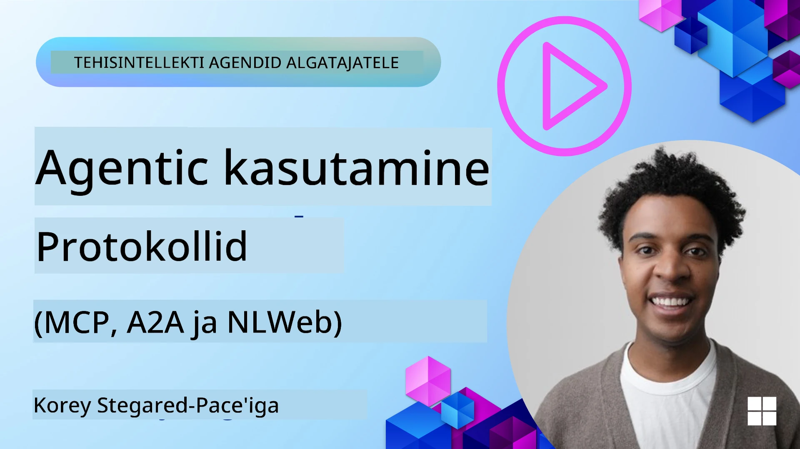
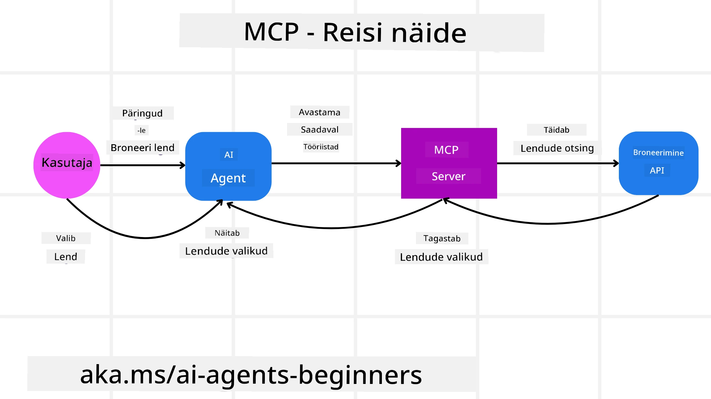
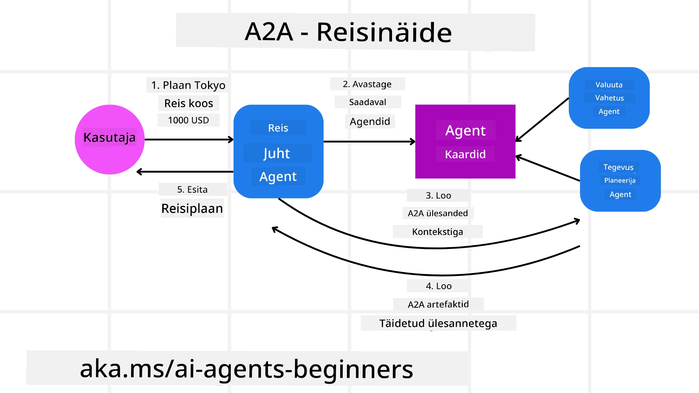
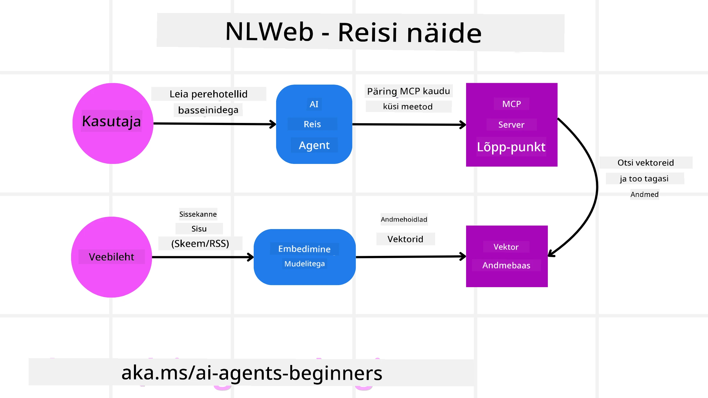

<!--
CO_OP_TRANSLATOR_METADATA:
{
  "original_hash": "aff92c6f019b4627ca9399c6e3882e17",
  "translation_date": "2025-10-11T11:26:30+00:00",
  "source_file": "11-agentic-protocols/README.md",
  "language_code": "et"
}
-->
# Agentlike protokollide kasutamine (MCP, A2A ja NLWeb)

> _(Klõpsake ülaloleval pildil, et vaadata selle õppetunni videot)_

AI-agentide kasutamise kasvuga suureneb vajadus protokollide järele, mis tagavad standardiseerimise, turvalisuse ja toetavad avatud innovatsiooni. Selles õppetunnis käsitleme kolme protokolli, mis püüavad seda vajadust täita – Model Context Protocol (MCP), Agent to Agent (A2A) ja Natural Language Web (NLWeb).

## Sissejuhatus

Selles õppetunnis käsitleme:

• Kuidas **MCP** võimaldab AI-agentidel kasutada väliseid tööriistu ja andmeid, et täita kasutaja ülesandeid.

• Kuidas **A2A** võimaldab erinevate AI-agentide vahelist suhtlust ja koostööd.

• Kuidas **NLWeb** toob loomuliku keele liidesed igale veebisaidile, võimaldades AI-agentidel avastada ja suhelda sisuga.

## Õppeeesmärgid

• **Tuvastada** MCP, A2A ja NLWebi põhieesmärgid ja eelised AI-agentide kontekstis.

• **Selgitada**, kuidas iga protokoll hõlbustab suhtlust ja interaktsiooni LLM-ide, tööriistade ja teiste agentide vahel.

• **Mõista**, millist rolli iga protokoll mängib keerukate agentlike süsteemide loomisel.

## Model Context Protocol

**Model Context Protocol (MCP)** on avatud standard, mis pakub ühtlustatud viisi rakendustele konteksti ja tööriistade pakkumiseks LLM-idele. See võimaldab AI-agentidel luua "universaalse adapteri" erinevate andmeallikate ja tööriistade jaoks, millega nad saavad järjepidevalt ühenduda.

Vaatame MCP komponente, eeliseid võrreldes otsese API kasutamisega ja näidet, kuidas AI-agendid võivad MCP serverit kasutada.

### MCP põhikomponendid

MCP töötab **klient-server arhitektuuril** ja selle põhikomponendid on:

• **Hostid** on LLM-i rakendused (näiteks koodiredaktor nagu VSCode), mis alustavad ühendusi MCP serveriga.

• **Kliendid** on hostrakenduse komponendid, mis hoiavad üks-ühele ühendusi serveritega.

• **Serverid** on kerged programmid, mis pakuvad konkreetseid võimekusi.

Protokoll sisaldab kolme põhielementi, mis on MCP serveri võimekused:

• **Tööriistad**: Need on eraldiseisvad tegevused või funktsioonid, mida AI-agent saab kasutada tegevuse sooritamiseks. Näiteks võib ilmateenistus pakkuda "ilma otsimise" tööriista või e-kaubanduse server "toote ostmise" tööriista. MCP serverid reklaamivad iga tööriista nime, kirjeldust ja sisendi/väljundi skeemi oma võimekuste loendis.

• **Ressursid**: Need on ainult lugemiseks mõeldud andmeüksused või dokumendid, mida MCP server saab pakkuda ja kliendid saavad neid vajadusel alla laadida. Näited hõlmavad failisisu, andmebaasi kirjeid või logifaile. Ressursid võivad olla tekstilised (nagu kood või JSON) või binaarsed (nagu pildid või PDF-id).

• **Küsimused**: Need on eelnevalt määratletud mallid, mis pakuvad soovitatud küsimusi, võimaldades keerukamaid töövooge.

### MCP eelised

MCP pakub AI-agentidele olulisi eeliseid:

• **Dünaamiline tööriistade avastamine**: Agendid saavad serverilt dünaamiliselt tööriistade loendi koos kirjeldustega. See erineb traditsioonilistest API-dest, mis sageli nõuavad staatilist kodeerimist integratsioonide jaoks, mis tähendab, et iga API muudatus nõuab koodi uuendamist. MCP pakub "integreeri üks kord" lähenemist, mis suurendab kohanemisvõimet.

• **Interoperatiivsus LLM-ide vahel**: MCP töötab erinevate LLM-ide vahel, pakkudes paindlikkust põhimudelite vahetamiseks parema jõudluse hindamiseks.

• **Standardiseeritud turvalisus**: MCP sisaldab standardset autentimismeetodit, mis parandab skaleeritavust täiendavate MCP serverite lisamisel. See on lihtsam kui erinevate traditsiooniliste API-de võtmete ja autentimistüüpide haldamine.

### MCP näide

Kujutage ette, et kasutaja soovib broneerida lendu AI-assistendi abil, mis kasutab MCP-d.

1. **Ühendus**: AI-assistent (MCP klient) ühendub lennufirma MCP serveriga.

2. **Tööriistade avastamine**: Klient küsib lennufirma MCP serverilt: "Millised tööriistad teil on saadaval?" Server vastab tööriistadega nagu "otsing lennud" ja "broneeri lennud".

3. **Tööriista kasutamine**: Seejärel palute AI-assistendil: "Palun otsi lendu Portlandist Honolulusse." AI-assistent, kasutades oma LLM-i, tuvastab, et ta peab kasutama "otsing lennud" tööriista ja edastab asjakohased parameetrid (päritolu, sihtkoht) MCP serverile.

4. **Teostamine ja vastus**: MCP server, toimides vahendajana, teeb tegeliku kõne lennufirma sisemisele broneerimis-API-le. Seejärel saab lennuinfo (nt JSON-andmed) ja saadab selle tagasi AI-assistendile.

5. **Edasine interaktsioon**: AI-assistent esitab lennuvalikud. Kui valite lennu, võib assistent kasutada sama MCP serveri "broneeri lend" tööriista, et broneering lõpule viia.

## Agent-to-Agent protokoll (A2A)

Kui MCP keskendub LLM-ide ühendamisele tööriistadega, siis **Agent-to-Agent (A2A) protokoll** viib selle sammu võrra edasi, võimaldades erinevate AI-agentide vahelist suhtlust ja koostööd. A2A ühendab AI-agente erinevates organisatsioonides, keskkondades ja tehnoloogiaplatvormides, et täita ühine ülesanne.

Uurime A2A komponente ja eeliseid ning näidet, kuidas seda võiks rakendada meie reisirakenduses.

### A2A põhikomponendid

A2A keskendub agentide vahelise suhtluse võimaldamisele ja nende koostööle kasutaja alamülesande täitmiseks. Iga protokolli komponent aitab sellele kaasa:

#### Agendi kaart

Sarnaselt sellele, kuidas MCP server jagab tööriistade loendit, sisaldab agendi kaart:
- Agendi nimi.
- **Üldiste ülesannete kirjeldus**, mida ta täidab.
- **Spetsiifiliste oskuste loend** koos kirjeldustega, mis aitavad teistel agentidel (või isegi inimkasutajatel) mõista, millal ja miks nad tahaksid seda agenti kasutada.
- Agendi **praegune lõpp-punkti URL**.
- Agendi **versioon** ja **võimekused**, nagu voogesituse vastused ja push-teavitused.

#### Agendi täitja

Agendi täitja vastutab **kasutaja vestluse konteksti edastamise eest kaugagendile**, et kaugagent mõistaks, millist ülesannet tuleb täita. A2A serveris kasutab agent oma LLM-i sissetulevate päringute analüüsimiseks ja ülesannete täitmiseks oma sisemiste tööriistade abil.

#### Artefakt

Kui kaugagent on taotletud ülesande täitnud, luuakse tema töö tulemusena artefakt. Artefakt **sisaldab agendi töö tulemust**, **kirjeldust tehtust** ja **tekstilist konteksti**, mis protokolli kaudu edastati. Pärast artefakti saatmist suletakse ühendus kaugagendiga, kuni seda uuesti vajatakse.

#### Sündmuste järjekord

See komponent on mõeldud **uuenduste haldamiseks ja sõnumite edastamiseks**. See on eriti oluline tootmises agentlike süsteemide jaoks, et vältida agentide vahelise ühenduse sulgemist enne ülesande täitmist, eriti kui ülesande täitmine võib võtta rohkem aega.

### A2A eelised

• **Tõhustatud koostöö**: See võimaldab erinevate müüjate ja platvormide agente suhelda, jagada konteksti ja töötada koos, hõlbustades sujuvat automatiseerimist traditsiooniliselt eraldatud süsteemide vahel.

• **Mudeli valiku paindlikkus**: Iga A2A agent saab otsustada, millist LLM-i ta kasutab oma päringute teenindamiseks, võimaldades iga agendi jaoks optimeeritud või peenhäälestatud mudeleid, erinevalt MCP mõnes stsenaariumis kasutatavast ühest LLM-ühendusest.

• **Sisseehitatud autentimine**: Autentimine on integreeritud otse A2A protokolli, pakkudes tugevat turvaraamistikku agentide vaheliseks suhtluseks.

### A2A näide

Laiendame oma reisibroneerimise stsenaariumi, kuid seekord kasutades A2A-d.

1. **Kasutaja päring mitme agendi poole**: Kasutaja suhtleb "Reisiagendi" A2A kliendi/agendiga, öeldes näiteks: "Palun broneeri kogu reis Honolulusse järgmiseks nädalaks, sealhulgas lennud, hotell ja rendiauto."

2. **Reisiagendi orkestreerimine**: Reisiagent saab selle keeruka päringu. Ta kasutab oma LLM-i ülesande üle mõtlemiseks ja otsustamiseks, et ta peab suhtlema teiste spetsialiseeritud agentidega.

3. **Agentidevaheline suhtlus**: Reisiagent kasutab A2A protokolli, et ühenduda allavoolu agentidega, nagu "Lennufirma agent", "Hotelli agent" ja "Autorendi agent", mis on loodud erinevate ettevõtete poolt.

4. **Delegeeritud ülesannete täitmine**: Reisiagent saadab konkreetseid ülesandeid nendele spetsialiseeritud agentidele (nt "Leia lennud Honolulusse", "Broneeri hotell", "Rendi auto"). Igaüks neist spetsialiseeritud agentidest, kasutades oma LLM-e ja tööriistu (mis võivad ise olla MCP serverid), täidab oma konkreetse osa broneerimisest.

5. **Konsolideeritud vastus**: Kui kõik allavoolu agendid on oma ülesanded täitnud, koostab reisiagent tulemused (lennuandmed, hotelli kinnitus, autorendi broneering) ja saadab kasutajale tervikliku vestlusstiilis vastuse.

## Natural Language Web (NLWeb)

Veebisaidid on pikka aega olnud peamine viis, kuidas kasutajad pääsevad ligi teabele ja andmetele internetis.

Vaatame NLWebi erinevaid komponente, NLWebi eeliseid ja näidet, kuidas meie reisirakendus NLWebi abil töötab.

### NLWebi komponendid

- **NLWebi rakendus (põhiteenuse kood)**: Süsteem, mis töötleb loomuliku keele küsimusi. See ühendab platvormi erinevad osad, et luua vastuseid. Võite mõelda sellele kui **mootorile, mis käitab veebisaidi loomuliku keele funktsioone**.

- **NLWebi protokoll**: See on **põhiline reeglite kogum loomuliku keele interaktsiooniks** veebisaidiga. See saadab vastuseid JSON-formaadis (sageli kasutades Schema.org-i). Selle eesmärk on luua lihtne alus "AI-veebile", samamoodi nagu HTML võimaldas dokumentide jagamist veebis.

- **MCP server (Model Context Protocol lõpp-punkt)**: Iga NLWebi seadistus töötab ka **MCP serverina**. See tähendab, et see saab **jagada tööriistu (nagu "küsi" meetod) ja andmeid** teiste AI-süsteemidega. Praktikas muudab see veebisaidi sisu ja võimekused kasutatavaks AI-agentide poolt, võimaldades saidil saada osaks laiemast "agentide ökosüsteemist".

- **Embeding mudelid**: Neid mudeleid kasutatakse **veebisaidi sisu teisendamiseks numbrilisteks esindusteks, mida nimetatakse vektoriteks** (embedings). Need vektorid haaravad tähenduse viisil, mida arvutid saavad võrrelda ja otsida. Need salvestatakse spetsiaalsesse andmebaasi ning kasutajad saavad valida, millist embedings-mudelit nad soovivad kasutada.

- **Vektori andmebaas (otsingumehhanism)**: See andmebaas **salvestab veebisaidi sisu embedingsid**. Kui keegi esitab küsimuse, kontrollib NLWeb vektori andmebaasi, et kiiresti leida kõige asjakohasem teave. See annab kiire loendi võimalikest vastustest, järjestatud sarnasuse järgi. NLWeb töötab erinevate vektori salvestussüsteemidega, nagu Qdrant, Snowflake, Milvus, Azure AI Search ja Elasticsearch.

### NLWebi näide

Vaatame taas meie reisibroneerimise veebisaiti, kuid seekord on see NLWebi abil käitatav.

1. **Andmete sisestamine**: Reisiveebisaidi olemasolevad tootekataloogid (nt lennuloendid, hotellikirjeldused, reisipakettid) vormindatakse Schema.org-i abil või laaditakse RSS-voogude kaudu. NLWebi tööriistad sisestavad selle struktureeritud andme, loovad embedingsid ja salvestavad need kohalikku või kaugvektori andmebaasi.

2. **Loomuliku keele päring (inimene)**: Kasutaja külastab veebisaiti ja selle asemel, et menüüs navigeerida, sisestab vestlusliidesesse: "Leia mulle pere-sõbralik hotell Honolulus, kus on bassein järgmiseks nädalaks."

3. **NLWebi töötlemine**: NLWebi rakendus saab selle päringu. See saadab päringu LLM-ile mõistmiseks ja otsib samal ajal oma vektori andmebaasist asjakohaseid hotellikirjeid.

4. **Täpsed tulemused**: LLM aitab otsingutulemusi andmebaasist tõlgendada, tuvastada parimad vasted "pere-sõbralik", "bassein" ja "Honolulu" kriteeriumide alusel ning vormindada loomuliku keele vastuse. Oluline on, et vastus viitab tegelikele hotellidele veebisaidi kataloogist, vältides väljamõeldud teavet.

5. **AI-agendi interaktsioon**: Kuna NLWeb toimib MCP serverina, võib väline AI-reisiagent samuti ühenduda selle veebisaidi NLWebi instantsiga. AI-agent võiks seejärel kasutada `küsi` MCP meetodit, et veebisaidilt otse pärida: `küsi("Kas Honolulus on vegan-sõbralikke restorane, mida hotell soovitab?")`. NLWebi instants töötleb seda, kasutades oma andmebaasi restoraniteavet (kui see on laaditud), ja tagastab struktureeritud JSON-vastuse.

### Kas teil on MCP/A2A/NLWebi kohta rohkem küsimusi?

Liituge [Azure AI Foundry Discordiga](https://aka.ms/ai-agents/discord), et kohtuda teiste õppijatega, osaleda vastuvõtutundides ja saada vastuseid oma AI-agentide küsimustele.

## Ressursid

- [MCP algajatele](https://aka.ms/mcp-for-beginners)  
- [MCP dokumentatsioon](https://github.com/microsoft/semantic-kernel/tree/main/python/semantic-kernel/semantic_kernel/connectors/mcp)
- [NLWebi repo](https://github.com/nlweb-ai/NLWeb)
- [Semantic Kernel juhendid](https://learn.microsoft.com/semantic-kernel/)

---

**Lahtiütlus**:  
See dokument on tõlgitud AI tõlketeenuse [Co-op Translator](https://github.com/Azure/co-op-translator) abil. Kuigi püüame tagada täpsust, palume arvestada, et automaatsed tõlked võivad sisaldada vigu või ebatäpsusi. Algne dokument selle algses keeles tuleks pidada autoriteetseks allikaks. Olulise teabe puhul soovitame kasutada professionaalset inimtõlget. Me ei vastuta selle tõlke kasutamisest tulenevate arusaamatuste või valesti tõlgenduste eest.