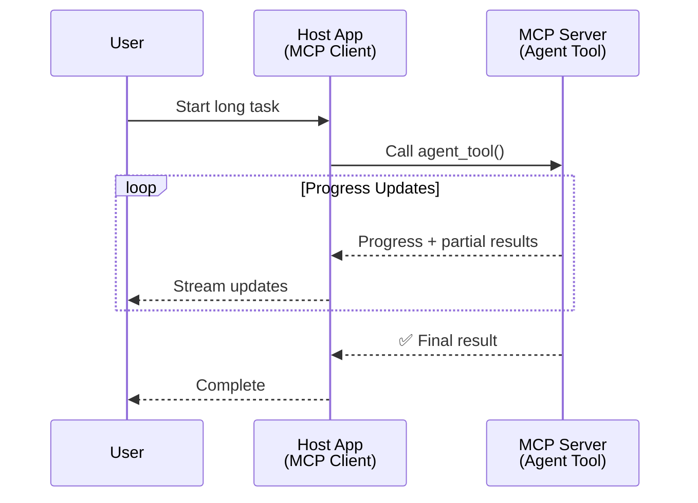
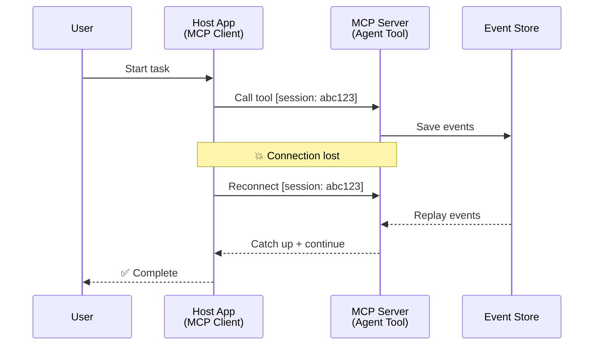
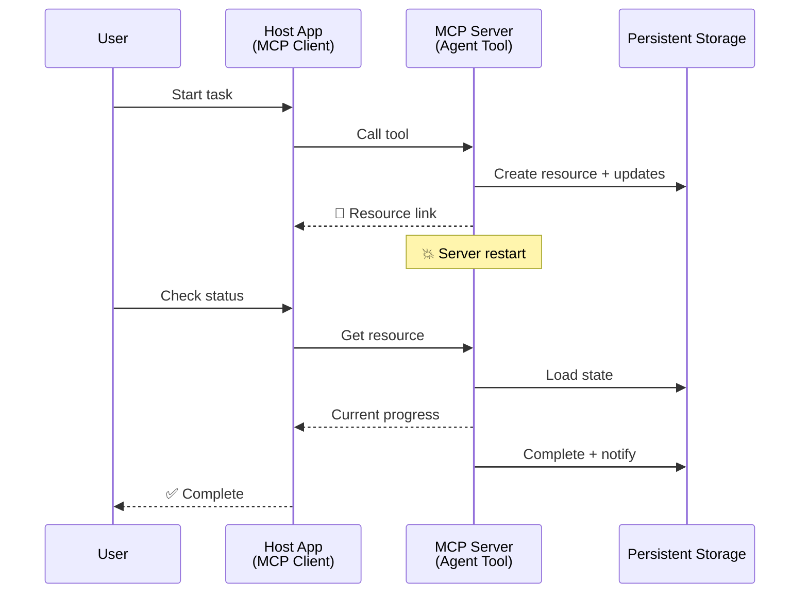
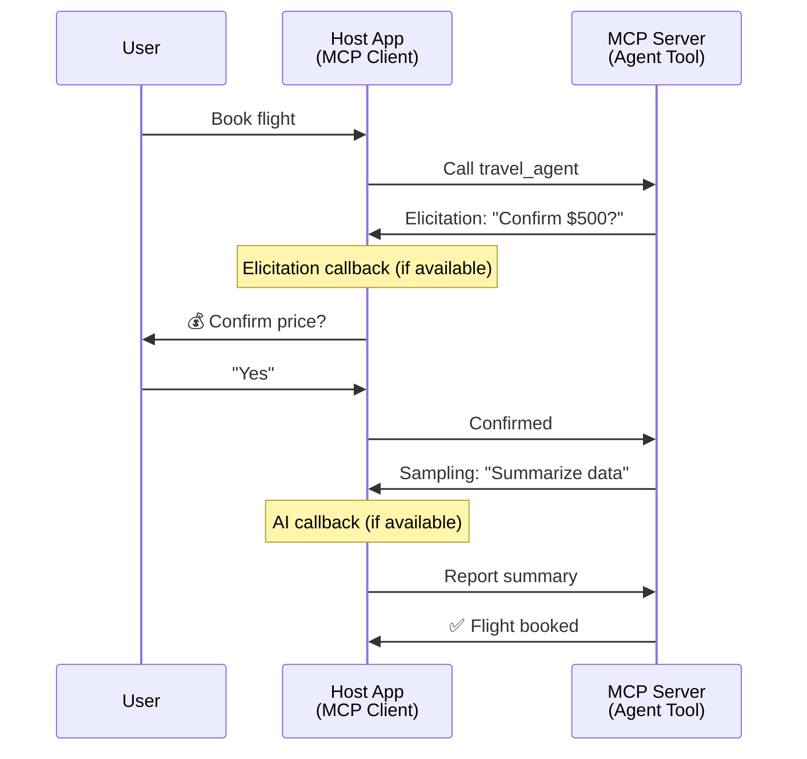
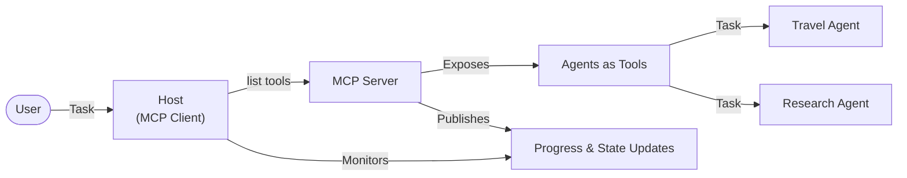

<!--
CO_OP_TRANSLATOR_METADATA:
{
  "original_hash": "5cc6836626047aa055e8960c8484a7d0",
  "translation_date": "2025-10-11T11:30:34+00:00",
  "source_file": "11-agentic-protocols/code_samples/mcp-agents/README.md",
  "language_code": "et"
}
-->
# Agentidevaheline kommunikatsioonisüsteemide loomine MCP-ga

> TL;DR - Kas MCP-ga saab luua agentidevahelist kommunikatsiooni? Jah!

MCP on oluliselt arenenud oma algsest eesmärgist "pakkuda konteksti LLM-idele". Viimaste täiustuste, nagu [jätkatavad vood](https://modelcontextprotocol.io/docs/concepts/transports#resumability-and-redelivery), [küsitlus](https://modelcontextprotocol.io/specification/2025-06-18/client/elicitation), [proovivõtmine](https://modelcontextprotocol.io/specification/2025-06-18/client/sampling) ja teavitused ([progress](https://modelcontextprotocol.io/specification/2025-06-18/basic/utilities/progress) ja [ressursid](https://modelcontextprotocol.io/specification/2025-06-18/schema#resourceupdatednotification)), MCP pakub nüüd tugevat alust keerukate agentidevaheliste kommunikatsioonisüsteemide loomiseks.

## Agent/tööriista eksiarvamus

Kui üha rohkem arendajaid uurib agentlikke käitumisi omavaid tööriistu (pikad töötsüklid, vajadus täiendava sisendi järele täitmise ajal jne), on levinud eksiarvamus, et MCP ei sobi, peamiselt seetõttu, et selle tööriistade primitiiv keskendus varajastes näidetes lihtsatele päring-vastus mustritele.

See arusaam on aegunud. MCP spetsifikatsiooni on viimastel kuudel oluliselt täiustatud, et täita lünki pikaajalise agentliku käitumise loomisel:

- **Voogedastus ja osalised tulemused**: Reaalajas edenemise uuendused täitmise ajal
- **Jätkatavus**: Kliendid saavad pärast ühenduse katkemist uuesti ühenduda ja jätkata
- **Püsivus**: Tulemused säilivad serveri taaskäivitamisel (nt ressursilinkide kaudu)
- **Mitme pöördega**: Interaktiivne sisend täitmise ajal küsitluse ja proovivõtmise kaudu

Neid funktsioone saab kombineerida, et võimaldada keerukaid agentlikke ja mitme agendi rakendusi, mis kõik on MCP protokollil põhinevad.

Viidates, nimetame agenti "tööriistaks", mis on saadaval MCP serveris. See eeldab hostrakenduse olemasolu, mis rakendab MCP klienti, loob sessiooni MCP serveriga ja saab agenti kutsuda.

## Mis teeb MCP tööriista "agentlikuks"?

Enne rakendusse süvenemist määratleme, milliseid infrastruktuuri võimalusi on vaja pikaajaliste agentide toetamiseks.

> Määratleme agendi kui üksuse, mis suudab autonoomselt tegutseda pikema aja jooksul, olles võimeline käsitlema keerukaid ülesandeid, mis võivad vajada mitut interaktsiooni või kohandusi reaalajas tagasiside põhjal.

### 1. Voogedastus ja osalised tulemused

Traditsioonilised päring-vastus mustrid ei tööta pikaajaliste ülesannete puhul. Agendid peavad pakkuma:

- Reaalajas edenemise uuendusi
- Vahetulemusi

**MCP tugi**: Ressursi uuenduste teavitused võimaldavad voogedastada osalisi tulemusi, kuigi see nõuab hoolikat disaini, et vältida konflikte JSON-RPC 1:1 päring/vastus mudeliga.

| Funktsioon                 | Kasutusjuht                                                                                                                                                                       | MCP tugi                                                                                   |
| -------------------------- | -------------------------------------------------------------------------------------------------------------------------------------------------------------------------------- | ------------------------------------------------------------------------------------------ |
| Reaalajas edenemise uuendused | Kasutaja taotleb koodibaasi migratsiooni ülesannet. Agent voogedastab edenemist: "10% - Analüüsib sõltuvusi... 25% - Konverteerib TypeScripti faile... 50% - Uuendab impordid..." | ✅ Edenemise teavitused                                                                    |
| Osalised tulemused         | "Raamatu loomise" ülesanne voogedastab osalisi tulemusi, nt 1) Loo kaare ülevaade, 2) Peatükkide loetelu, 3) Iga peatükk, kui see valmib. Host saab igal etapil kontrollida, tühistada või suunata. | ✅ Teavitusi saab "laiendada", et lisada osalisi tulemusi, vt PR 383, 776 ettepanekuid      |

<div align="center" style="font-style: italic; font-size: 0.95em; margin-bottom: 0.5em;">
<strong>Joonis 1:</strong> Diagramm illustreerib, kuidas MCP agent voogedastab reaalajas edenemise uuendusi ja osalisi tulemusi hostrakendusele pikaajalise ülesande täitmise ajal, võimaldades kasutajal jälgida täitmist reaalajas.
</div>



### 2. Jätkatavus

Agendid peavad võrgukatkestusi sujuvalt käsitlema:

- Ühenduse taastamine pärast (kliendi) katkestust
- Jätkamine sealt, kus pooleli jäi (sõnumite uuesti edastamine)

**MCP tugi**: MCP StreamableHTTP transport toetab täna sessiooni jätkamist ja sõnumite uuesti edastamist sessiooni ID-de ja viimaste sündmuste ID-dega. Oluline on märkida, et server peab rakendama EventStore'i, mis võimaldab sündmuste taasesitust kliendi uuesti ühendamisel.  
Märkus: kogukonna ettepanek (PR #975) uurib transpordist sõltumatute jätkatavate voogude võimalust.

| Funktsioon      | Kasutusjuht                                                                                                                                                   | MCP tugi                                                                 |
| --------------- | ------------------------------------------------------------------------------------------------------------------------------------------------------------- | ----------------------------------------------------------------------- |
| Jätkatavus      | Klient katkestab pikaajalise ülesande täitmise ajal. Ühenduse taastamisel jätkub sessioon vahelejäänud sündmuste taasesitusega, jätkates sujuvalt sealt, kus pooleli jäi. | ✅ StreamableHTTP transport sessiooni ID-de, sündmuste taasesituse ja EventStore'iga |

<div align="center" style="font-style: italic; font-size: 0.95em; margin-bottom: 0.5em;">
<strong>Joonis 2:</strong> Diagramm näitab, kuidas MCP StreamableHTTP transport ja sündmuste salvestus võimaldavad sujuvat sessiooni jätkamist: kui klient katkestab, saab ta uuesti ühenduda ja taasesitada vahelejäänud sündmused, jätkates ülesannet ilma edenemist kaotamata.
</div>



### 3. Püsivus

Pikaajalised agendid vajavad püsivat olekut:

- Tulemused säilivad serveri taaskäivitamisel
- Staatust saab hankida väljaspool sessiooni
- Edenemise jälgimine sessioonide vahel

**MCP tugi**: MCP toetab nüüd tööriistakõnede jaoks ressursilinkide tagastamise tüüpi. Tänapäeval on võimalik muster kujundada tööriist, mis loob ressursi ja tagastab kohe ressursilinki. Tööriist saab taustal jätkata ülesande täitmist ja ressursi uuendamist. Klient saab omakorda valida ressursi oleku küsitlemise, et saada osalisi või täielikke tulemusi (sõltuvalt sellest, milliseid ressursi uuendusi server pakub) või tellida ressursi uuenduste teavitusi.

Siin on üks piirang, et ressursside küsitlemine või uuenduste tellimine võib ressursse tarbida, millel on mõju mastaapsuse korral. Kogukonna ettepanek (sh #992) uurib võimalust lisada veebikonksud või päästikud, mida server saab kasutada kliendi/hostrakenduse teavitamiseks uuendustest.

| Funktsioon    | Kasutusjuht                                                                                                                                        | MCP tugi                                                        |
| ------------- | ------------------------------------------------------------------------------------------------------------------------------------------------- | ---------------------------------------------------------------- |
| Püsivus       | Server jookseb kokku andmete migratsiooni ülesande ajal. Tulemused ja edenemine säilivad taaskäivitamisel, klient saab staatust kontrollida ja jätkata püsivast ressursist. | ✅ Ressursilingid püsiva salvestuse ja staatuse teavitustega     |

Tänapäeval on levinud muster kujundada tööriist, mis loob ressursi ja tagastab kohe ressursilinki. Tööriist saab taustal ülesannet täita, väljastada ressursi teavitusi, mis toimivad edenemise uuendustena või sisaldavad osalisi tulemusi, ja vajadusel ressursi sisu uuendada.

<div align="center" style="font-style: italic; font-size: 0.95em; margin-bottom: 0.5em;">
<strong>Joonis 3:</strong> Diagramm näitab, kuidas MCP agendid kasutavad püsivaid ressursse ja staatuse teavitusi, et tagada pikaajaliste ülesannete säilimine serveri taaskäivitamisel, võimaldades klientidel edenemist kontrollida ja tulemusi hankida isegi pärast tõrkeid.
</div>



### 4. Mitme pöördega interaktsioonid

Agendid vajavad sageli täiendavat sisendit täitmise ajal:

- Inimese selgitus või kinnitus
- AI abi keerukate otsuste jaoks
- Dünaamiline parameetrite kohandamine

**MCP tugi**: Täielikult toetatud proovivõtmise (AI sisendi jaoks) ja küsitluse (inimese sisendi jaoks) kaudu.

| Funktsioon                 | Kasutusjuht                                                                                                                                     | MCP tugi                                           |
| -------------------------- | ----------------------------------------------------------------------------------------------------------------------------------------------- | ------------------------------------------------- |
| Mitme pöördega interaktsioonid | Reisibroneerimise agent küsib kasutajalt hinnakinnitust, seejärel palub AI-l reisiteavet kokku võtta enne broneerimistehingu lõpetamist. | ✅ Küsitlus inimese sisendi jaoks, proovivõtmine AI sisendi jaoks |

<div align="center" style="font-style: italic; font-size: 0.95em; margin-bottom: 0.5em;">
<strong>Joonis 4:</strong> Diagramm näitab, kuidas MCP agendid saavad interaktiivselt küsida inimese sisendit või paluda AI abi täitmise ajal, toetades keerukaid mitme pöördega töövooge, nagu kinnitused ja dünaamiline otsuste tegemine.
</div>



## Pikaajaliste agentide rakendamine MCP-s - koodi ülevaade

Selle artikli osana pakume [koodirepositooriumi](https://github.com/victordibia/ai-tutorials/tree/main/MCP%20Agents), mis sisaldab täielikku rakendust pikaajaliste agentide jaoks, kasutades MCP Python SDK-d StreamableHTTP transporti sessiooni jätkamise ja sõnumite uuesti edastamise jaoks. Rakendus demonstreerib, kuidas MCP võimalusi saab kombineerida, et võimaldada keerukaid agentlikke käitumisi.

Eelkõige rakendame serverit kahe peamise agenditööriistaga:

- **Reisiagent** - Simuleerib reisibroneerimisteenust hinnakinnitusega küsitluse kaudu
- **Uurimisagent** - Teostab uurimisülesandeid AI-abiga kokkuvõtete kaudu proovivõtmise teel

Mõlemad agendid demonstreerivad reaalajas edenemise uuendusi, interaktiivseid kinnitusi ja täielikku sessiooni jätkamise võimekust.

### Olulised rakenduskontseptsioonid

Järgmised jaotised näitavad serveripoolset agendi rakendust ja kliendipoolset hosti käsitlemist iga funktsiooni jaoks:

#### Voogedastus ja edenemise uuendused - reaalajas ülesande staatus

Voogedastus võimaldab agentidel pakkuda reaalajas edenemise uuendusi pikaajaliste ülesannete täitmise ajal, hoides kasutajaid kursis ülesande staatuse ja vahetulemustega.

**Serveri rakendus (agent saadab edenemise teavitusi):**

```python
# From server/server.py - Travel agent sending progress updates
for i, step in enumerate(steps):
    await ctx.session.send_progress_notification(
        progress_token=ctx.request_id,
        progress=i * 25,
        total=100,
        message=step,
        related_request_id=str(ctx.request_id)
    )
    await anyio.sleep(2)  # Simulate work

# Alternative: Log messages for detailed step-by-step updates
await ctx.session.send_log_message(
    level="info",
    data=f"Processing step {current_step}/{steps} ({progress_percent}%)",
    logger="long_running_agent",
    related_request_id=ctx.request_id,
)
```

**Kliendi rakendus (host võtab edenemise uuendusi vastu):**

```python
# From client/client.py - Client handling real-time notifications
async def message_handler(message) -> None:
    if isinstance(message, types.ServerNotification):
        if isinstance(message.root, types.LoggingMessageNotification):
            console.print(f"📡 [dim]{message.root.params.data}[/dim]")
        elif isinstance(message.root, types.ProgressNotification):
            progress = message.root.params
            console.print(f"🔄 [yellow]{progress.message} ({progress.progress}/{progress.total})[/yellow]")

# Register message handler when creating session
async with ClientSession(
    read_stream, write_stream,
    message_handler=message_handler
) as session:
```

#### Küsitlus - Kasutaja sisendi küsimine

Küsitlus võimaldab agentidel küsida kasutaja sisendit täitmise ajal. See on oluline kinnituste, selgituste või heakskiitude jaoks pikaajaliste ülesannete ajal.

**Serveri rakendus (agent küsib kinnitust):**

```python
# From server/server.py - Travel agent requesting price confirmation
elicit_result = await ctx.session.elicit(
    message=f"Please confirm the estimated price of $1200 for your trip to {destination}",
    requestedSchema=PriceConfirmationSchema.model_json_schema(),
    related_request_id=ctx.request_id,
)

if elicit_result and elicit_result.action == "accept":
    # Continue with booking
    logger.info(f"User confirmed price: {elicit_result.content}")
elif elicit_result and elicit_result.action == "decline":
    # Cancel the booking
    booking_cancelled = True
```

**Kliendi rakendus (host pakub küsitluse tagasiside funktsiooni):**

```python
# From client/client.py - Client handling elicitation requests
async def elicitation_callback(context, params):
    console.print(f"💬 Server is asking for confirmation:")
    console.print(f"   {params.message}")

    response = console.input("Do you accept? (y/n): ").strip().lower()

    if response in ['y', 'yes']:
        return types.ElicitResult(
            action="accept",
            content={"confirm": True, "notes": "Confirmed by user"}
        )
    else:
        return types.ElicitResult(
            action="decline",
            content={"confirm": False, "notes": "Declined by user"}
        )

# Register the callback when creating the session
async with ClientSession(
    read_stream, write_stream,
    elicitation_callback=elicitation_callback
) as session:
```

#### Proovivõtmine - AI abi küsimine

Proovivõtmine võimaldab agentidel küsida LLM abi keerukate otsuste või sisu loomise jaoks täitmise ajal. See võimaldab hübriidseid inimese-AI töövooge.

**Serveri rakendus (agent küsib AI abi):**

```python
# From server/server.py - Research agent requesting AI summary
sampling_result = await ctx.session.create_message(
    messages=[
        SamplingMessage(
            role="user",
            content=TextContent(type="text", text=f"Please summarize the key findings for research on: {topic}")
        )
    ],
    max_tokens=100,
    related_request_id=ctx.request_id,
)

if sampling_result and sampling_result.content:
    if sampling_result.content.type == "text":
        sampling_summary = sampling_result.content.text
        logger.info(f"Received sampling summary: {sampling_summary}")
```

**Kliendi rakendus (host pakub proovivõtmise tagasiside funktsiooni):**

```python
# From client/client.py - Client handling sampling requests
async def sampling_callback(context, params):
    message_text = params.messages[0].content.text if params.messages else 'No message'
    console.print(f"🧠 Server requested sampling: {message_text}")

    # In a real application, this could call an LLM API
    # For demo purposes, we provide a mock response
    mock_response = "Based on current research, MCP has evolved significantly..."

    return types.CreateMessageResult(
        role="assistant",
        content=types.TextContent(type="text", text=mock_response),
        model="interactive-client",
        stopReason="endTurn"
    )

# Register the callback when creating the session
async with ClientSession(
    read_stream, write_stream,
    sampling_callback=sampling_callback,
    elicitation_callback=elicitation_callback
) as session:
```

#### Jätkatavus - Sessiooni järjepidevus katkestuste korral

Jätkatavus tagab, et pikaajalised agendi ülesanded suudavad üle elada kliendi katkestused ja jätkata sujuvalt uuesti ühendamisel. See rakendatakse sündmuste salvestuse ja jätkamistokenite kaudu.

**Sündmuste salvestuse rakendus (server hoiab sessiooni olekut):**

```python
# From server/event_store.py - Simple in-memory event store
class SimpleEventStore(EventStore):
    def __init__(self):
        self._events: list[tuple[StreamId, EventId, JSONRPCMessage]] = []
        self._event_id_counter = 0

    async def store_event(self, stream_id: StreamId, message: JSONRPCMessage) -> EventId:
        """Store an event and return its ID."""
        self._event_id_counter += 1
        event_id = str(self._event_id_counter)
        self._events.append((stream_id, event_id, message))
        return event_id

    async def replay_events_after(self, last_event_id: EventId, send_callback: EventCallback) -> StreamId | None:
        """Replay events after the specified ID for resumption."""
        # Find events after the last known event and replay them
        for _, event_id, message in self._events[start_index:]:
            await send_callback(EventMessage(message, event_id))

# From server/server.py - Passing event store to session manager
def create_server_app(event_store: Optional[EventStore] = None) -> Starlette:
    server = ResumableServer()

    # Create session manager with event store for resumption
    session_manager = StreamableHTTPSessionManager(
        app=server,
        event_store=event_store,  # Event store enables session resumption
        json_response=False,
        security_settings=security_settings,
    )

    return Starlette(routes=[Mount("/mcp", app=session_manager.handle_request)])

# Usage: Initialize with event store
event_store = SimpleEventStore()
app = create_server_app(event_store)
```

**Kliendi metaandmed jätkamistokeniga (klient ühendub uuesti salvestatud oleku abil):**

```python
# From client/client.py - Client resumption with metadata
if existing_tokens and existing_tokens.get("resumption_token"):
    # Use existing resumption token to continue where we left off
    metadata = ClientMessageMetadata(
        resumption_token=existing_tokens["resumption_token"],
    )
else:
    # Create callback to save resumption token when received
    def enhanced_callback(token: str):
        protocol_version = getattr(session, 'protocol_version', None)
        token_manager.save_tokens(session_id, token, protocol_version, command, args)

    metadata = ClientMessageMetadata(
        on_resumption_token_update=enhanced_callback,
    )

# Send request with resumption metadata
result = await session.send_request(
    types.ClientRequest(
        types.CallToolRequest(
            method="tools/call",
            params=types.CallToolRequestParams(name=command, arguments=args)
        )
    ),
    types.CallToolResult,
    metadata=metadata,
)
```

Hostrakendus hoiab sessiooni ID-d ja jätkamistokenid lokaalselt, võimaldades tal uuesti ühenduda olemasolevate sessioonidega ilma edenemist või olekut kaotamata.

### Koodi organiseerimine

<div align="center" style="font-style: italic; font-size: 0.95em; margin-bottom: 0.5em;">
<strong>Joonis 5:</strong> MCP-põhise agendisüsteemi arhitektuur
</div>



**Olulised failid:**

- **`server/server.py`** - Jätkatav MCP server reisi- ja uurimisagentidega, mis demonstreerivad küsitlust, proovivõtmist ja edenemise uuendusi
- **`client/client.py`** - Interaktiivne hostrakendus jätkamise toega, tagasiside funktsioonidega ja tokenite haldusega
- **`server/event_store.py`** - Sündmuste salvestuse rakendus, mis võimaldab sessiooni jätkamist ja sõnumite uuesti edastamist

## MCP mitme agendi kommunikatsiooni laiendamine

Ülaltoodud rakendust saab laiendada mitme agendi süsteemideks, suurendades hostrakenduse intelligentsust ja ulatust:

- **Intelligentne ülesannete jaotamine**: Host analüüsib keerukaid kasutajapäringuid ja jagab need alamülesanneteks erinevatele spetsialiseeritud agentidele
- **Mitme serveri koordineerimine**: Host hoiab ühendusi mitme MCP serveriga, millest igaüks pakub erinevaid agendivõimekusi
- **Ülesande oleku haldamine**: Host jälgib edenemist mitme samaaegse agendi ülesande vahel, käsitledes sõltuvusi ja järjestust
- **Tõrketaluvus ja korduskatsed**: Host haldab tõrkeid, rakendab kordusloogikat ja suunab ülesandeid ümber, kui agendid muutuvad kättesaamatuks
- **Tulemuste süntees**: Host ühendab mitme agendi väljundid ühtseks lõpptulemuseks

Host areneb lihtsast kliendist intelligentseks orkestreerijaks, koordineerides hajutatud agendivõimekusi, säilitades samal ajal MCP protokolli aluse.

## Kokkuvõte

MCP täiustatud võimalused - ressursi teavitused, küsitlus/proovivõtmine, jätkatavad vood ja püsivad ressursid - võimaldavad keerukaid agentidevahelisi interaktsioone, säilitades samal ajal protokolli lihtsuse.

## Alustamine

Valmis looma oma agentidevahelist süsteemi? Järgi neid samme:

### 1. Käivita demo

```bash
# Start the server with event store for resumption
python -m server.server --port 8006

# In another terminal, run the interactive client
python -m client.client --url http://127.0.0.1:8006/mcp
```

**Interaktiivses režiimis saadaval olevad käsud:**

- `travel_agent` - Broneeri reis hinnakinnitusega küsitluse kaudu
- `research_agent` - Uuri teemasid AI-abiga kokkuvõtete kaudu proovivõtmise teel
- `list` - Näita kõiki saadaolevaid tööriistu
- `clean-tokens` - Kustuta jätkamistokenid
- `help` - Näita üksikasjalikku käsuabi
- `quit` - Välju kliendist

### 2. Testi jätkamise võimekust

- Käivita pikaajaline agent (nt `travel_agent`)
- Katkesta klient täitmise ajal (Ctrl+C)
- Taaskäivita klient - see jätkab automaatselt sealt, kus pooleli jäi

### 3. Uuri ja laienda

- **Uuri näiteid**: Vaata [mcp-agents](https://github.com/victordibia/ai-tutorials/tree/main/MCP%20Agents)
- **Liitu kogukonnaga**: Osale MCP ar
Üldiselt areneb MCP protokolli spetsifikatsioon kiiresti; lugejal soovitatakse tutvuda ametliku dokumentatsiooni veebisaidiga, et saada kõige värskemaid uuendusi - https://modelcontextprotocol.io/introduction

---

**Lahtiütlus**:  
See dokument on tõlgitud AI tõlketeenuse [Co-op Translator](https://github.com/Azure/co-op-translator) abil. Kuigi püüame tagada täpsust, palume arvestada, et automaatsed tõlked võivad sisaldada vigu või ebatäpsusi. Algne dokument selle algses keeles tuleks pidada autoriteetseks allikaks. Olulise teabe puhul soovitame kasutada professionaalset inimtõlget. Me ei vastuta selle tõlke kasutamisest tulenevate arusaamatuste või valesti tõlgenduste eest.