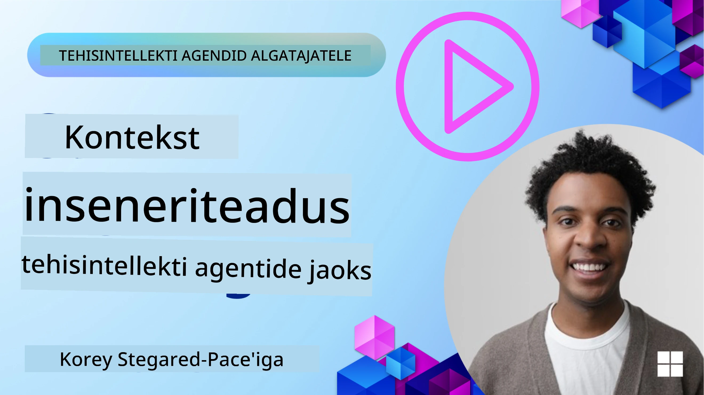
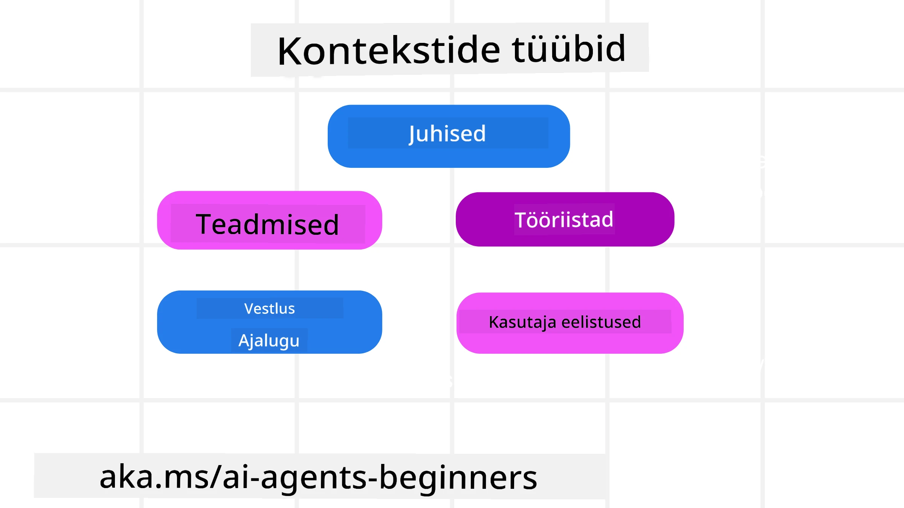
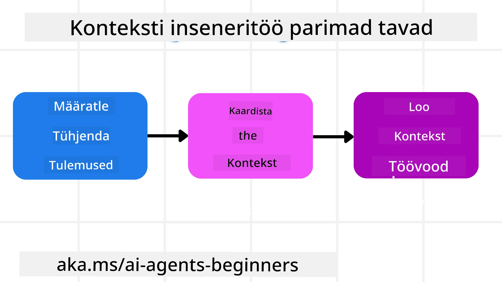

<!--
CO_OP_TRANSLATOR_METADATA:
{
  "original_hash": "cb7e50f471905ce6fdb92a30269a7a98",
  "translation_date": "2025-10-11T11:22:48+00:00",
  "source_file": "12-context-engineering/README.md",
  "language_code": "et"
}
-->
# Konteksti inseneriteadus AI-agentide jaoks

> _(Klõpsake ülaloleval pildil, et vaadata selle õppetunni videot)_

Oluline on mõista rakenduse keerukust, mille jaoks te AI-agenti loote, et tagada selle usaldusväärsus. Peame looma AI-agente, kes suudavad tõhusalt hallata teavet, et vastata keerukatele vajadustele, mis ulatuvad kaugemale lihtsast juhiste inseneriteadusest.

Selles õppetunnis vaatame, mis on konteksti inseneriteadus ja milline on selle roll AI-agentide loomisel.

## Sissejuhatus

Selles õppetunnis käsitletakse:

• **Mis on konteksti inseneriteadus** ja miks see erineb juhiste inseneriteadusest.

• **Tõhusad konteksti inseneriteaduse strateegiad**, sealhulgas teabe kirjutamine, valimine, tihendamine ja eraldamine.

• **Levinud konteksti vead**, mis võivad teie AI-agenti tööd takistada, ja kuidas neid parandada.

## Õppeeesmärgid

Pärast selle õppetunni läbimist oskate:

• **Määratleda konteksti inseneriteaduse** ja eristada seda juhiste inseneriteadusest.

• **Tuvastada konteksti põhikomponendid** suurte keelemudelite (LLM) rakendustes.

• **Rakendada strateegiaid konteksti kirjutamiseks, valimiseks, tihendamiseks ja eraldamiseks**, et parandada agentide jõudlust.

• **Tuvastada levinud konteksti vead**, nagu mürgitamine, segadus, tähelepanu hajumine ja konfliktid, ning rakendada nende leevendamise tehnikaid.

## Mis on konteksti inseneriteadus?

AI-agentide puhul on kontekst see, mis suunab agenti teatud tegevusi planeerima. Konteksti inseneriteadus seisneb selles, et tagada AI-agendile õige teave, et ta saaks täita järgmise ülesande sammu. Kontekstiaken on piiratud suurusega, seega peame agentide loojatena looma süsteeme ja protsesse, et hallata teabe lisamist, eemaldamist ja tihendamist kontekstiaknas.

### Juhiste inseneriteadus vs konteksti inseneriteadus

Juhiste inseneriteadus keskendub ühele staatiliste juhiste komplektile, et tõhusalt suunata AI-agente reeglite kogumiga. Konteksti inseneriteadus aga tegeleb dünaamilise teabe komplekti haldamisega, sealhulgas algse juhisega, et tagada AI-agendile vajaliku teabe olemasolu aja jooksul. Konteksti inseneriteaduse peamine idee on muuta see protsess korduvaks ja usaldusväärseks.

### Konteksti tüübid

Oluline on meeles pidada, et kontekst ei ole ainult üks asi. Teave, mida AI-agent vajab, võib pärineda mitmesugustest allikatest, ja meie ülesanne on tagada, et agent pääseb nendele allikatele ligi:

AI-agendi hallatavad konteksti tüübid hõlmavad:

• **Juhised:** Need on nagu agendi "reeglid" – juhised, süsteemisõnumid, näited (näidates AI-le, kuidas midagi teha) ja tööriistade kirjeldused, mida ta saab kasutada. Siin kombineeruvad juhiste inseneriteadus ja konteksti inseneriteadus.

• **Teadmised:** See hõlmab fakte, andmebaasidest saadud teavet või pikaajalisi mälestusi, mida agent on kogunud. See hõlmab ka RAG-süsteemi integreerimist, kui agent vajab juurdepääsu erinevatele teadmiste hoidlatele ja andmebaasidele.

• **Tööriistad:** Need on väliste funktsioonide, API-de ja MCP-serverite definitsioonid, mida agent saab kasutada, koos tagasisidega (tulemused), mida ta nende kasutamisest saab.

• **Vestluse ajalugu:** Käimasolev dialoog kasutajaga. Aja jooksul muutuvad need vestlused pikemaks ja keerukamaks, mis tähendab, et need võtavad kontekstiaknas rohkem ruumi.

• **Kasutaja eelistused:** Aja jooksul õpitud teave kasutaja meeldimiste ja mittemeeldimiste kohta. Seda saab salvestada ja kasutada oluliste otsuste tegemisel, et kasutajat aidata.

## Tõhusad konteksti inseneriteaduse strateegiad

### Planeerimisstrateegiad

Hea konteksti inseneriteadus algab heast planeerimisest. Siin on lähenemine, mis aitab teil hakata mõtlema, kuidas konteksti inseneriteadust rakendada:

1. **Määratlege selged tulemused** - AI-agentidele määratud ülesannete tulemused peaksid olema selgelt määratletud. Vastake küsimusele: "Milline näeb maailm välja, kui AI-agent on oma ülesande lõpetanud?" Teisisõnu, millist muutust, teavet või vastust peaks kasutaja pärast AI-agendiga suhtlemist saama.

2. **Kaardistage kontekst** - Kui olete määratlenud AI-agendi tulemused, peate vastama küsimusele: "Millist teavet vajab AI-agent selle ülesande täitmiseks?" Nii saate hakata kaardistama, kust see teave pärineb.

3. **Looge konteksti torustikud** - Kui teate, kus teave asub, peate vastama küsimusele: "Kuidas agent selle teabe kätte saab?" Seda saab teha mitmel viisil, sealhulgas RAG, MCP-serverite ja muude tööriistade kasutamine.

### Praktilised strateegiad

Planeerimine on oluline, kuid kui teave hakkab voolama meie agendi kontekstiaknasse, peame rakendama praktilisi strateegiaid selle haldamiseks:

#### Konteksti haldamine

Kuigi osa teabest lisatakse kontekstiaknasse automaatselt, seisneb konteksti inseneriteadus teabe aktiivses haldamises, mida saab teha mitmel viisil:

1. **Agendi märkmik**
See võimaldab AI-agendil teha märkmeid olulise teabe kohta praeguste ülesannete ja kasutajate interaktsioonide kohta ühe seansi ajal. See peaks eksisteerima väljaspool kontekstiakent failis või käitusaja objektis, mida agent saab vajadusel hiljem seansi ajal kätte saada.

2. **Mälestused**
Märkmikud sobivad teabe haldamiseks ühe seansi kontekstiakna väliselt. Mälestused võimaldavad agentidel salvestada ja kätte saada olulist teavet mitme seansi jooksul. See võib hõlmata kokkuvõtteid, kasutaja eelistusi ja tagasisidet tulevasteks parandusteks.

3. **Konteksti tihendamine**
Kui kontekstiaken kasvab ja läheneb oma piirile, saab kasutada selliseid tehnikaid nagu kokkuvõtete tegemine ja kärpimine. See hõlmab kas ainult kõige olulisema teabe säilitamist või vanemate sõnumite eemaldamist.

4. **Mitme agendi süsteemid**
Mitme agendi süsteemi arendamine on konteksti inseneriteaduse vorm, kuna igal agendil on oma kontekstiaken. Kuidas seda konteksti jagatakse ja edastatakse erinevatele agentidele, on veel üks asi, mida nende süsteemide loomisel planeerida.

5. **Liivakasti keskkonnad**
Kui agent peab käivitama koodi või töötlema suures koguses teavet dokumendis, võib see nõuda palju märke tulemuste töötlemiseks. Selle asemel, et seda kõike kontekstiaknas salvestada, saab agent kasutada liivakasti keskkonda, mis suudab seda koodi käivitada ja lugeda ainult tulemusi ja muud olulist teavet.

6. **Käitusaja oleku objektid**
See tehakse, luues teabe konteinerid, et hallata olukordi, kus agent vajab juurdepääsu teatud teabele. Keeruka ülesande puhul võimaldaks see agentil salvestada iga alamülesande tulemused samm-sammult, võimaldades kontekstil jääda seotud ainult konkreetse alamülesandega.

### Konteksti inseneriteaduse näide

Oletame, et soovime, et AI-agent **"Broneeriks mulle reisi Pariisi."**

• Lihtne agent, kes kasutab ainult juhiste inseneriteadust, võib lihtsalt vastata: **"Olgu, millal soovite Pariisi minna?"**. See töötleb ainult teie otsest küsimust hetkel, kui kasutaja selle esitas.

• Agent, kes kasutab konteksti inseneriteaduse strateegiaid, teeks palju rohkem. Enne vastamist võib tema süsteem:

  ◦ **Kontrollida teie kalendrit** saadaval olevate kuupäevade jaoks (reaalajas andmete hankimine).

 ◦ **Meenutada varasemaid reisieelistusi** (pikaajalisest mälust), nagu eelistatud lennufirma, eelarve või kas eelistate otselende.

 ◦ **Tuvastada saadaval olevad tööriistad** lennu- ja hotellibroneeringute jaoks.

- Seejärel võiks näidisvastus olla: "Tere, [Teie nimi]! Näen, et olete vaba oktoobri esimesel nädalal. Kas otsin otselende Pariisi [Eelistatud lennufirmaga] teie tavapärase eelarve piires [Eelarve]?" See rikkam, konteksti arvestav vastus näitab konteksti inseneriteaduse jõudu.

## Levinud konteksti vead

### Konteksti mürgitamine

**Mis see on:** Kui hallutsinatsioon (LLM-i genereeritud vale teave) või viga jõuab konteksti ja seda viidatakse korduvalt, põhjustades agendi võimatute eesmärkide poole püüdlemist või mõttetute strateegiate väljatöötamist.

**Mida teha:** Rakendage **konteksti valideerimist** ja **karantiini**. Valideerige teave enne, kui see lisatakse pikaajalisse mällu. Kui tuvastatakse võimalik mürgitamine, alustage uusi konteksti lõime, et takistada halva teabe levikut.

**Reisibroneeringu näide:** Teie agent hallutsineerib **otselendu väikesest kohalikust lennujaamast kaugesse rahvusvahelisse linna**, mis tegelikult rahvusvahelisi lende ei paku. See olematu lennu detail salvestatakse konteksti. Hiljem, kui palute agenti broneerida, üritab ta pidevalt leida pileteid sellele võimatule marsruudile, põhjustades korduvaid vigu.

**Lahendus:** Rakendage samm, mis **valideerib lennu olemasolu ja marsruute reaalajas API-ga** _enne_, kui lennu detail lisatakse agendi töökonteksti. Kui valideerimine ebaõnnestub, "karantiinitakse" vale teave ja seda ei kasutata edasi.

### Konteksti tähelepanu hajumine

**Mis see on:** Kui kontekst muutub nii suureks, et mudel keskendub liiga palju kogunenud ajaloole, selle asemel et kasutada treeningu käigus õpitud teavet, põhjustades korduvaid või ebaotstarbekaid tegevusi. Mudelid võivad hakata vigu tegema juba enne, kui kontekstiaken täitub.

**Mida teha:** Kasutage **konteksti kokkuvõtteid**. Kogunenud teavet tuleks perioodiliselt tihendada lühemateks kokkuvõteteks, säilitades olulised detailid ja eemaldades üleliigse ajaloo. See aitab "taaskäivitada" fookuse.

**Reisibroneeringu näide:** Olete pikalt arutanud erinevaid unistuste reisisihtkohti, sealhulgas üksikasjalikku ülevaadet oma seljakotireisist kaks aastat tagasi. Kui lõpuks palute **"leida mulle odav lend järgmiseks kuuks"**, jääb agent kinni vanadesse, ebaolulistesse detailidesse ja küsib pidevalt teie seljakotivarustuse või varasemate reisiplaanide kohta, unustades teie praeguse taotluse.

**Lahendus:** Pärast teatud arvu pöördeid või kui kontekst muutub liiga suureks, peaks agent **kokku võtma vestluse kõige hiljutisemad ja asjakohasemad osad** – keskendudes teie praegustele reisikuupäevadele ja sihtkohale – ning kasutama seda tihendatud kokkuvõtet järgmise LLM-i kõne jaoks, jättes vähem olulise ajaloolise vestluse kõrvale.

### Konteksti segadus

**Mis see on:** Kui liiga palju konteksti, sageli liiga paljude saadaval olevate tööriistade kujul, põhjustab mudeli halbu vastuseid või ebaoluliste tööriistade kasutamist. Väiksemad mudelid on sellele eriti vastuvõtlikud.

**Mida teha:** Rakendage **tööriistade valiku haldamist** RAG-tehnikate abil. Salvestage tööriistade kirjeldused vektorandmebaasi ja valige _ainult_ kõige asjakohasemad tööriistad iga konkreetse ülesande jaoks. Uuringud näitavad, et tööriistade valik tuleks piirata vähem kui 30-ni.

**Reisibroneeringu näide:** Teie agentil on juurdepääs kümnetele tööriistadele: `book_flight`, `book_hotel`, `rent_car`, `find_tours`, `currency_converter`, `weather_forecast`, `restaurant_reservations` jne. Kui küsite, **"Mis on parim viis Pariisis ringi liikuda?"**, segaduses agent üritab kasutada `book_flight` _Pariisi sees_ või `rent_car`, kuigi eelistate ühistransporti, sest tööriistade kirjeldused võivad kattuda või agent lihtsalt ei suuda parimat valida.

**Lahendus:** Kasutage **RAG-i tööriistade kirjelduste üle**. Kui küsite Pariisis liikumise kohta, hangib süsteem dünaamiliselt _ainult_ kõige asjakohasemad tööriistad, nagu `rent_car` või `public_transport_info`, lähtudes teie päringust, esitades LLM-ile keskendunud "valiku" tööriistadest.

### Konteksti konflikt

**Mis see on:** Kui kontekstis on vastuolulist teavet, mis põhjustab ebajärjekindlat arutlemist või halbu lõplikke vastuseid. See juhtub sageli siis, kui teave saabub etappide kaupa ja varased, valed eeldused jäävad konteksti.

**Mida teha:** Kasutage **konteksti kärpimist** ja **väljalülitamist**. Kärpimine tähendab vananenud või vastuolulise teabe eemaldamist, kui uued detailid saabuvad. Väljalülitamine annab mudelile eraldi "märkmiku" tööruumi teabe töötlemiseks, ilma et see segaks peamist konteksti.

**Reisibroneeringu näide:** Alguses ütlete oma agendile, **"Ma tahan lennata turistiklassis."** Hiljem vestluse käigus muudate meelt ja ütlete, **"Tegelikult, selle reisi jaoks, lähme äriklassis."** Kui mõlemad juhised jäävad konteksti, võib agent saada vastuolulisi otsingutulemusi või segadusse, millist eelistust prioriteediks seada.

**Lahendus:** Rakendage **konteksti kärpimist**. Kui uus juhis on vastuolus vana juhisega, eemaldatakse vana juhis või kirjutatakse see kontekstis selgelt üle. Alternatiivselt võib agent kasutada **märkmikku**, et lepitada vastuolulised eelistused enne otsuse tegemist, tagades, et ainult lõplik, järjekindel juhis juhib tema tegevusi.

## Kas teil on rohkem küsimusi konteksti inseneriteaduse kohta?

Liituge [Azure AI Foundry Discordiga](https://aka.ms/ai-agents/discord), et kohtuda teiste õppijatega, osaleda vastuvõtuaegadel ja saada vastuseid oma AI-agentide küsimustele.

---

**Lahtiütlus**:  
See dokument on tõlgitud AI tõlketeenuse [Co-op Translator](https://github.com/Azure/co-op-translator) abil. Kuigi püüame tagada täpsust, palume arvestada, et automaatsed tõlked võivad sisaldada vigu või ebatäpsusi. Algne dokument selle algses keeles tuleks pidada autoriteetseks allikaks. Olulise teabe puhul soovitame kasutada professionaalset inimtõlget. Me ei vastuta selle tõlke kasutamisest tulenevate arusaamatuste või valesti tõlgenduste eest.