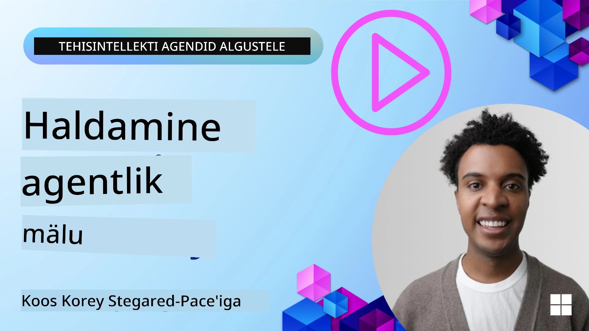

<!--
CO_OP_TRANSLATOR_METADATA:
{
  "original_hash": "a1d90991499ad697c4ad24decaf36968",
  "translation_date": "2025-12-09T13:03:48+00:00",
  "source_file": "13-agent-memory/README.md",
  "language_code": "et"
}
-->
# Mälu tehisintellekti agentide jaoks 

Kui räägitakse tehisintellekti agentide loomise unikaalsetest eelistest, keskendutakse peamiselt kahele asjale: võimele kasutada tööriistu ülesannete täitmiseks ja võimele aja jooksul paremaks muutuda. Mälu on enesetäiendavate agentide loomise alus, mis suudavad pakkuda meie kasutajatele paremaid kogemusi.

Selles õppetükis vaatleme, mis on mälu tehisintellekti agentide jaoks, kuidas seda hallata ja kuidas seda oma rakenduste kasuks kasutada.

## Sissejuhatus

Selles õppetükis käsitletakse:

• **Tehisintellekti agendi mälu mõistmine**: Mis on mälu ja miks see agentide jaoks oluline on.

• **Mälu rakendamine ja salvestamine**: Praktilised meetodid, kuidas lisada oma tehisintellekti agentidele mälufunktsioone, keskendudes lühi- ja pikaajalisele mälule.

• **Tehisintellekti agentide enesetäiendamine**: Kuidas mälu võimaldab agentidel õppida varasematest interaktsioonidest ja aja jooksul paremaks muutuda.

## Saadaval olevad rakendused

See õppetund sisaldab kahte põhjalikku märkmikujuhendit:

• **[13-agent-memory.ipynb](./13-agent-memory.ipynb)**: Rakendab mälu kasutades Mem0 ja Azure AI Search'i koos Semantic Kernel raamistikuga.

• **[13-agent-memory-cognee.ipynb](./13-agent-memory-cognee.ipynb)**: Rakendab struktureeritud mälu kasutades Cognee't, luues automaatselt teadmiste graafiku, mida toetavad embeddingud, visualiseerides graafikut ja pakkudes intelligentset otsingut.

## Õppimise eesmärgid

Pärast selle õppetüki läbimist oskate:

• **Eristada erinevaid tehisintellekti agendi mälutüüpe**, sealhulgas töömälu, lühiajalist ja pikaajalist mälu, samuti spetsialiseeritud vorme nagu persona- ja episoodiline mälu.

• **Rakendada ja hallata lühi- ja pikaajalist mälu tehisintellekti agentide jaoks**, kasutades Semantic Kernel raamistikku ja tööriistu nagu Mem0, Cognee, Whiteboard memory ning integreerides Azure AI Search'iga.

• **Mõista enesetäiendavate tehisintellekti agentide põhimõtteid** ja kuidas tugevad mäluhaldussüsteemid aitavad kaasa pidevale õppimisele ja kohanemisele.

## Tehisintellekti agendi mälu mõistmine

Põhimõtteliselt tähendab **mälu tehisintellekti agentide jaoks mehhanisme, mis võimaldavad neil teavet säilitada ja meenutada**. See teave võib hõlmata konkreetseid detaile vestlusest, kasutaja eelistusi, varasemaid tegevusi või isegi õpitud mustreid.

Ilma mäluta on tehisintellekti rakendused sageli olekuta, mis tähendab, et iga interaktsioon algab nullist. See viib korduva ja frustreeriva kasutajakogemuseni, kus agent "unustab" varasema konteksti või eelistused.

### Miks on mälu oluline?

Agendi intelligentsus on tihedalt seotud tema võimega meenutada ja kasutada varasemat teavet. Mälu võimaldab agentidel olla:

• **Reflektiivsed**: Õppida varasematest tegevustest ja tulemustest.

• **Interaktiivsed**: Säilitada konteksti käimasoleva vestluse ajal.

• **Proaktiivsed ja reaktiivsed**: Ennustada vajadusi või reageerida sobivalt ajalooliste andmete põhjal.

• **Autonoomsed**: Tegutseda iseseisvamalt, tuginedes salvestatud teadmistele.

Mälu rakendamise eesmärk on muuta agendid **usaldusväärsemaks ja võimekamaks**.

### Mälutüübid

#### Töömälu

Mõelge sellele kui paberilehele, mida agent kasutab ühe käimasoleva ülesande või mõtteprotsessi ajal. See hoiab vahetut teavet, mis on vajalik järgmise sammu arvutamiseks.

Tehisintellekti agentide puhul salvestab töömälu sageli vestluse kõige olulisema teabe, isegi kui kogu vestluse ajalugu on pikk või kärbitud. See keskendub võtmeelementide, nagu nõuded, ettepanekud, otsused ja tegevused, väljavõtmisele.

**Töömälu näide**

Reisi broneerimise agendi puhul võib töömälu salvestada kasutaja praeguse soovi, näiteks "Ma tahan broneerida reisi Pariisi". See konkreetne nõue hoitakse agendi vahetus kontekstis, et suunata praegust interaktsiooni.

#### Lühiajaline mälu

See mälutüüp säilitab teavet ühe vestluse või seansi jooksul. See on praeguse vestluse kontekst, mis võimaldab agendil viidata varasematele dialoogikäikudele.

**Lühiajalise mälu näide**

Kui kasutaja küsib: "Kui palju maksab lend Pariisi?" ja seejärel jätkab: "Aga majutus seal?", tagab lühiajaline mälu, et agent teab, et "seal" viitab "Pariisile" sama vestluse raames.

#### Pikaajaline mälu

See on teave, mis püsib mitme vestluse või seansi jooksul. See võimaldab agentidel meeles pidada kasutaja eelistusi, ajaloolisi interaktsioone või üldteadmisi pikema aja jooksul. See on oluline personaliseerimise jaoks.

**Pikaajalise mälu näide**

Pikaajaline mälu võib salvestada, et "Ben naudib suusatamist ja välitegevusi, eelistab kohvi mäevaatega ning soovib vältida keerulisi suusaradu varasema vigastuse tõttu". See teave, mis on õpitud varasematest interaktsioonidest, mõjutab tulevasi reisiplaanide soovitusi, muutes need väga isikupäraseks.

#### Persona mälu

See spetsiaalne mälutüüp aitab agendil arendada järjepidevat "isiksust" või "persoona". See võimaldab agendil meeles pidada üksikasju enda või oma kavandatud rolli kohta, muutes interaktsioonid sujuvamaks ja keskendunumaks.

**Persona mälu näide**

Kui reisiplaneerimise agent on loodud olema "ekspert suusaplaneerija", võib persona mälu seda rolli tugevdada, mõjutades vastuseid nii, et need vastaksid eksperdi toonile ja teadmistele.

#### Töövoo/episoodiline mälu

See mälu salvestab järjestikused sammud, mida agent teeb keeruka ülesande täitmisel, sealhulgas õnnestumised ja ebaõnnestumised. See on nagu konkreetsete "episoodide" või varasemate kogemuste meelespidamine, et neist õppida.

**Episoodilise mälu näide**

Kui agent üritas broneerida konkreetset lendu, kuid see ebaõnnestus saadavuse puudumise tõttu, võiks episoodiline mälu selle ebaõnnestumise salvestada, võimaldades agendil proovida alternatiivseid lende või teavitada kasutajat probleemist järgmisel katsel informeeritumalt.

#### Entiteedi mälu

See hõlmab konkreetsete entiteetide (nagu inimesed, kohad või asjad) ja sündmuste väljavõtmist ja meeldejätmist vestlustest. See võimaldab agendil luua struktureeritud arusaama arutatud võtmeelementidest.

**Entiteedi mälu näide**

Vestlusest varasema reisi kohta võib agent välja võtta "Pariis", "Eiffeli torn" ja "õhtusöök restoranis Le Chat Noir". Tulevases interaktsioonis võiks agent meenutada "Le Chat Noir'i" ja pakkuda seal uut broneeringut.

#### Struktureeritud RAG (Retrieval Augmented Generation)

Kuigi RAG on laiem tehnika, rõhutatakse "struktureeritud RAG-i" kui võimsat mälutehnoloogiat. See eraldab tihedat, struktureeritud teavet erinevatest allikatest (vestlused, e-kirjad, pildid) ja kasutab seda vastuste täpsuse, meenutamise ja kiiruse parandamiseks. Erinevalt klassikalisest RAG-ist, mis tugineb ainult semantilisele sarnasusele, töötab struktureeritud RAG teabe sisemise struktuuriga.

**Struktureeritud RAG näide**

Selle asemel, et lihtsalt märksõnu sobitada, võiks struktureeritud RAG analüüsida lennu üksikasju (sihtkoht, kuupäev, kellaaeg, lennufirma) e-kirjast ja salvestada need struktureeritud viisil. See võimaldab täpseid päringuid, näiteks "Millise lennu ma Pariisi teisipäeval broneerisin?"

## Mälu rakendamine ja salvestamine

Mälu rakendamine tehisintellekti agentide jaoks hõlmab **mäluhalduse** süstemaatilist protsessi, mis sisaldab teabe genereerimist, salvestamist, meenutamist, integreerimist, uuendamist ja isegi "unustamist" (või kustutamist). Meenutamine on eriti oluline aspekt.

### Spetsialiseeritud mälutööriistad

#### Mem0

Üks viis agendi mälu salvestamiseks ja haldamiseks on kasutada spetsiaalseid tööriistu nagu Mem0. Mem0 toimib püsiva mälukihina, võimaldades agentidel meenutada asjakohaseid interaktsioone, salvestada kasutaja eelistusi ja faktilist konteksti ning õppida aja jooksul õnnestumistest ja ebaõnnestumistest. Idee on muuta olekuta agendid olekuga agentideks.

See töötab läbi **kahefaasilise mälutoru: väljavõtmine ja uuendamine**. Esiteks saadetakse agendi lõime lisatud sõnumid Mem0 teenusesse, mis kasutab suurt keelemudelit (LLM), et kokku võtta vestluse ajalugu ja eraldada uusi mälestusi. Seejärel määrab LLM-põhine uuendusfaas, kas need mälestused lisada, muuta või kustutada, salvestades need hübriidandmebaasi, mis võib sisaldada vektorit, graafikut ja võtme-väärtuse andmebaase. See süsteem toetab ka erinevaid mälutüüpe ja võib hõlmata graafimälu, et hallata entiteetide vahelisi seoseid.

#### Cognee

Teine võimas lähenemine on kasutada **Cognee't**, avatud lähtekoodiga semantilist mälu tehisintellekti agentide jaoks, mis muudab struktureeritud ja struktureerimata andmed päringuteks sobivateks teadmiste graafikuteks, mida toetavad embeddingud. Cognee pakub **kahekihilist arhitektuuri**, mis ühendab vektori sarnasuse otsingu graafiku suhetega, võimaldades agentidel mõista mitte ainult seda, milline teave on sarnane, vaid ka seda, kuidas mõisted omavahel seotud on.

See paistab silma **hübriidotsinguga**, mis ühendab vektori sarnasuse, graafiku struktuuri ja LLM-i põhjendamise - alates toorandmete otsingust kuni graafikuteadliku küsimustele vastamiseni. Süsteem säilitab **elava mälu**, mis areneb ja kasvab, jäädes samal ajal ühe ühendatud graafikuna päringuteks kättesaadavaks, toetades nii lühiajalist seansi konteksti kui ka pikaajalist püsivat mälu.

Cognee märkmikujuhend ([13-agent-memory-cognee.ipynb](./13-agent-memory-cognee.ipynb)) demonstreerib selle ühtse mälukihi loomist, praktiliste näidetega mitmesuguste andmeallikate sisestamisest, teadmiste graafiku visualiseerimisest ja erinevate otsingustrateegiate kasutamisest, mis on kohandatud konkreetsete agendi vajaduste jaoks.

### Mälu salvestamine RAG-iga

Lisaks spetsialiseeritud mälutööriistadele nagu Mem0, saate kasutada tugevaid otsinguteenuseid, näiteks **Azure AI Search'i, mälestuste salvestamiseks ja meenutamiseks**, eriti struktureeritud RAG-i jaoks.

See võimaldab teie agendi vastuseid siduda teie enda andmetega, tagades asjakohasemad ja täpsemad vastused. Azure AI Search'i saab kasutada kasutajaspetsiifiliste reiside mälestuste, tootekataloogide või mis tahes muu valdkonnapõhise teadmise salvestamiseks.

Azure AI Search toetab funktsioone nagu **struktureeritud RAG**, mis paistab silma tiheda, struktureeritud teabe eraldamise ja meenutamisega suurtest andmekogumitest, nagu vestluste ajalugu, e-kirjad või isegi pildid. See pakub "üliinimlikku täpsust ja meenutamist" võrreldes traditsiooniliste tekstilõikude ja embeddingute lähenemisviisidega.

## Tehisintellekti agentide enesetäiendamine

Levinud muster enesetäiendavate agentide jaoks hõlmab **"teadmiste agendi"** kasutuselevõttu. See eraldi agent jälgib peamist vestlust kasutaja ja põhivahendi vahel. Selle roll on:

1. **Tuvastada väärtuslik teave**: Määrata, kas mõni osa vestlusest on väärt salvestamist üldteadmiste või konkreetse kasutaja eelistusena.

2. **Eraldada ja kokku võtta**: Destilleerida vestlusest oluline õppetund või eelistus.

3. **Salvestada teadmiste baasi**: Püsivalt salvestada see eraldatud teave, sageli vektorandmebaasi, et seda hiljem meenutada.

4. **Täiendada tulevasi päringuid**: Kui kasutaja algatab uue päringu, toob teadmiste agent asjakohase salvestatud teabe ja lisab selle kasutaja päringule, pakkudes põhivahendile olulist konteksti (sarnaselt RAG-ile).

### Mälu optimeerimine

• **Latentsuse haldamine**: Kasutajainteraktsioonide aeglustumise vältimiseks saab algselt kasutada odavamat ja kiiremat mudelit, et kiiresti kontrollida, kas teave on väärt salvestamist või meenutamist, kutsudes keerukama väljavõtmise/meenutamise protsessi ainult vajadusel.

• **Teadmiste baasi hooldus**: Kasvava teadmiste baasi jaoks saab harvemini kasutatava teabe viia "külmsäilitusse", et hallata kulusid.

## Kas teil on rohkem küsimusi agendi mälu kohta?

Liituge [Azure AI Foundry Discordiga](https://aka.ms/ai-agents/discord), et kohtuda teiste õppijatega, osaleda vastuvõtutundides ja saada vastuseid oma tehisintellekti agentide küsimustele.

---

<!-- CO-OP TRANSLATOR DISCLAIMER START -->
**Lahtiütlus**:  
See dokument on tõlgitud AI tõlketeenuse [Co-op Translator](https://github.com/Azure/co-op-translator) abil. Kuigi püüame tagada täpsust, palume arvestada, et automaatsed tõlked võivad sisaldada vigu või ebatäpsusi. Algne dokument selle algses keeles tuleks pidada autoriteetseks allikaks. Olulise teabe puhul soovitame kasutada professionaalset inimtõlget. Me ei vastuta selle tõlke kasutamisest tulenevate arusaamatuste või valesti tõlgenduste eest.
<!-- CO-OP TRANSLATOR DISCLAIMER END -->