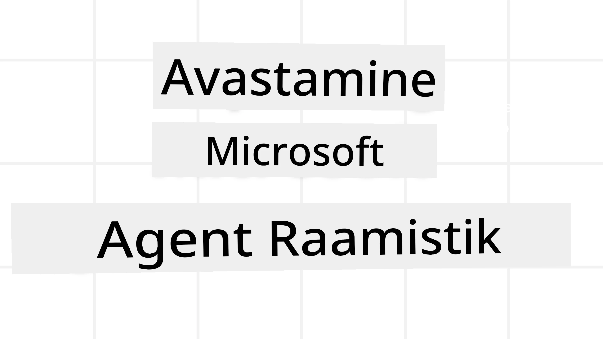
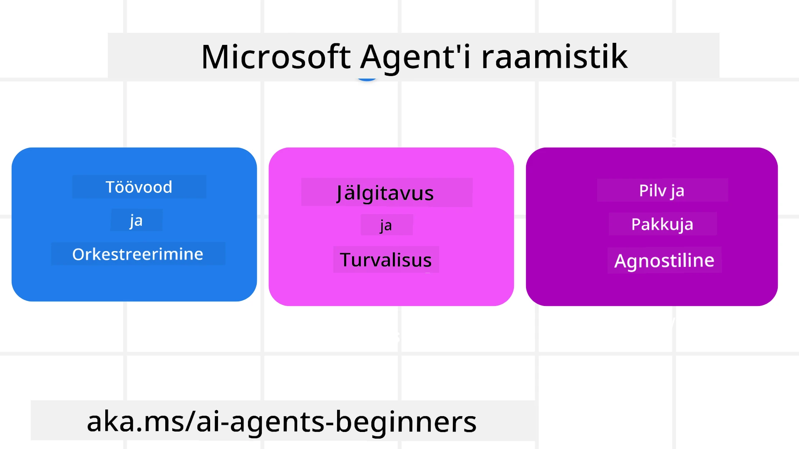
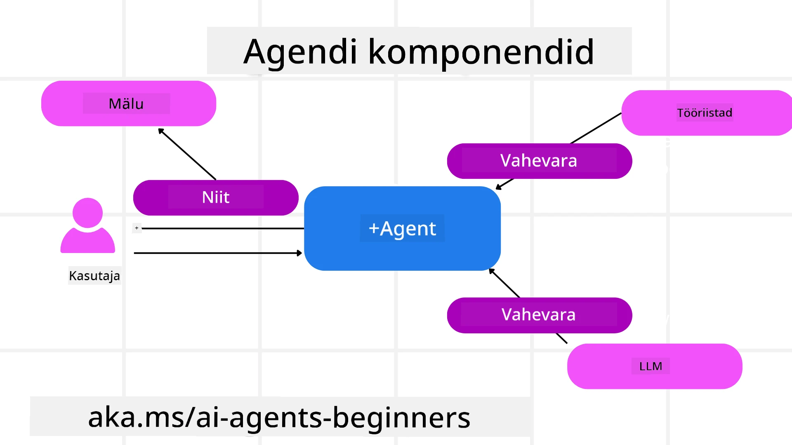

<!--
CO_OP_TRANSLATOR_METADATA:
{
  "original_hash": "19c4dab375acbc733855cc7f2f04edbc",
  "translation_date": "2025-10-11T11:10:42+00:00",
  "source_file": "14-microsoft-agent-framework/README.md",
  "language_code": "et"
}
-->
# Microsoft Agent Frameworki uurimine



### Sissejuhatus

Selles õppetükis käsitletakse:

- Microsoft Agent Frameworki mõistmine: põhifunktsioonid ja väärtus  
- Microsoft Agent Frameworki põhikontseptsioonide uurimine
- MAF-i võrdlemine Semantic Kernel ja AutoGeniga: migreerimisjuhend

## Õpieesmärgid

Pärast selle õppetüki läbimist oskad:

- Luua tootmisvalmis AI agente, kasutades Microsoft Agent Frameworki
- Rakendada Microsoft Agent Frameworki põhifunktsioone oma agentlike kasutusjuhtude jaoks
- Migreerida ja integreerida olemasolevaid agentlikke raamistikke ja tööriistu  

## Koodinäited 

Koodinäited [Microsoft Agent Frameworki (MAF)](https://aka.ms/ai-agents-beginners/agent-framewrok) kohta leiad sellest repositooriumist failides `xx-python-agent-framework` ja `xx-dotnet-agent-framework`.

## Microsoft Agent Frameworki mõistmine



[Microsoft Agent Framework (MAF)](https://aka.ms/ai-agents-beginners/agent-framewrok) põhineb Semantic Kernel ja AutoGen kogemustel ja õppetundidel. See pakub paindlikkust, et lahendada mitmesuguseid agentlikke kasutusjuhtumeid nii tootmis- kui ka uurimiskeskkondades, sealhulgas:

- **Järjestikune agentide orkestreerimine** olukordades, kus on vaja samm-sammulisi töövooge.
- **Samaaegne orkestreerimine** olukordades, kus agendid peavad ülesandeid samaaegselt täitma.
- **Grupivestluse orkestreerimine** olukordades, kus agendid saavad koostööd teha ühe ülesande kallal.
- **Ülesande üleandmise orkestreerimine** olukordades, kus agendid annavad ülesande üksteisele edasi, kui alamülesanded on täidetud.
- **Magnetiline orkestreerimine** olukordades, kus juhtiv agent loob ja muudab ülesannete loendit ning koordineerib alamagente ülesande täitmiseks.

Tootmiskeskkonnas AI agentide pakkumiseks sisaldab MAF ka järgmisi funktsioone:

- **Jälgitavus** OpenTelemetry abil, kus iga AI agendi tegevus, sealhulgas tööriistade kasutamine, orkestreerimissammud, põhjendusvood ja jõudluse jälgimine Azure AI Foundry armatuurlaudade kaudu.
- **Turvalisus** agentide majutamine natiivses Azure AI Foundry keskkonnas, mis sisaldab turvakontrolle nagu rollipõhine juurdepääs, privaatsete andmete käsitlemine ja sisseehitatud sisuturvalisus.
- **Vastupidavus** agentide lõimed ja töövood võivad peatuda, jätkuda ja vigadest taastuda, mis võimaldab pikemaajalisi protsesse.
- **Kontroll** inimeste sekkumisega töövood, kus ülesanded märgitakse inimeste heakskiitu vajavateks.

Microsoft Agent Framework keskendub ka koostalitlusvõimele:

- **Pilveagnostilisus** - Agendid saavad töötada konteinerites, kohapeal ja mitmes erinevas pilves.
- **Teenusepakkuja agnostilisus** - Agente saab luua eelistatud SDK kaudu, sealhulgas Azure OpenAI ja OpenAI.
- **Avatud standardite integreerimine** - Agendid saavad kasutada protokolle nagu Agent-to-Agent (A2A) ja Model Context Protocol (MCP), et avastada ja kasutada teisi agente ja tööriistu.
- **Pluginad ja ühendused** - Ühendusi saab luua andme- ja mäluteenustega nagu Microsoft Fabric, SharePoint, Pinecone ja Qdrant.

Vaatame, kuidas neid funktsioone rakendatakse Microsoft Agent Frameworki põhikontseptsioonides.

## Microsoft Agent Frameworki põhikontseptsioonid

### Agendid



**Agentide loomine**

Agentide loomine toimub määratledes järeldusteenuse (LLM Provider), juhiste komplekti, mida AI agent peab järgima, ja määratud `name`:

```python
agent = AzureOpenAIChatClient(credential=AzureCliCredential()).create_agent( instructions="You are good at recommending trips to customers based on their preferences.", name="TripRecommender" )
```

Ülaltoodud näites kasutatakse `Azure OpenAI`, kuid agente saab luua mitmesuguste teenuste abil, sealhulgas `Azure AI Foundry Agent Service`:

```python
AzureAIAgentClient(async_credential=credential).create_agent( name="HelperAgent", instructions="You are a helpful assistant." ) as agent
```

OpenAI `Responses`, `ChatCompletion` API-d

```python
agent = OpenAIResponsesClient().create_agent( name="WeatherBot", instructions="You are a helpful weather assistant.", )
```

```python
agent = OpenAIChatClient().create_agent( name="HelpfulAssistant", instructions="You are a helpful assistant.", )
```

või kaugagente, kasutades A2A protokolli:

```python
agent = A2AAgent( name=agent_card.name, description=agent_card.description, agent_card=agent_card, url="https://your-a2a-agent-host" )
```

**Agentide käivitamine**

Agente käivitatakse `.run` või `.run_stream` meetodite abil, et saada kas mittevoogesituse või voogesituse vastuseid.

```python
result = await agent.run("What are good places to visit in Amsterdam?")
print(result.text)
```

```python
async for update in agent.run_stream("What are the good places to visit in Amsterdam?"):
    if update.text:
        print(update.text, end="", flush=True)

```

Iga agendi käivitamisel saab kohandada parameetreid, nagu agendi kasutatavate `max_tokens` arv, `tools`, mida agent saab kasutada, ja isegi agendi kasutatavat `model`.

See on kasulik olukordades, kus konkreetseid mudeleid või tööriistu on vaja kasutaja ülesande täitmiseks.

**Tööriistad**

Tööriistu saab määratleda nii agendi loomisel:

```python
def get_attractions( location: Annotated[str, Field(description="The location to get the top tourist attractions for")], ) -> str: """Get the top tourist attractions for a given location.""" return f"The top attractions for {location} are." 


# When creating a ChatAgent directly 

agent = ChatAgent( chat_client=OpenAIChatClient(), instructions="You are a helpful assistant", tools=[get_attractions]

```

kui ka agendi käivitamisel:

```python

result1 = await agent.run( "What's the best place to visit in Seattle?", tools=[get_attractions] # Tool provided for this run only )
```

**Agendi lõimed**

Agendi lõimed võimaldavad mitme pöördega vestlusi. Lõime saab luua kas:

- Kasutades `get_new_thread()`, mis võimaldab lõime aja jooksul salvestada.
- Lõime automaatne loomine agendi käivitamisel, kus lõim kestab ainult praeguse käivitamise ajal.

Lõime loomiseks näeb kood välja selline:

```python
# Create a new thread. 
thread = agent.get_new_thread() # Run the agent with the thread. 
response = await agent.run("Hello, I am here to help you book travel. Where would you like to go?", thread=thread)

```

Seejärel saab lõime serialiseerida, et seda hiljem kasutada:

```python
# Create a new thread. 
thread = agent.get_new_thread() 

# Run the agent with the thread. 

response = await agent.run("Hello, how are you?", thread=thread) 

# Serialize the thread for storage. 

serialized_thread = await thread.serialize() 

# Deserialize the thread state after loading from storage. 

resumed_thread = await agent.deserialize_thread(serialized_thread)
```

**Agendi vahevara**

Agendid suhtlevad tööriistade ja LLM-idega, et täita kasutaja ülesandeid. Teatud olukordades soovime nende interaktsioonide vahel midagi täita või jälgida. Agendi vahevara võimaldab meil seda teha:

*Funktsiooni vahevara*

See vahevara võimaldab meil täita toimingut agendi ja funktsiooni/tööriista vahel, mida ta kutsub. Näiteks võib seda kasutada funktsiooni kutse logimiseks.

Allolevas koodis määratleb `next`, kas tuleks kutsuda järgmine vahevara või tegelik funktsioon.

```python
async def logging_function_middleware(
    context: FunctionInvocationContext,
    next: Callable[[FunctionInvocationContext], Awaitable[None]],
) -> None:
    """Function middleware that logs function execution."""
    # Pre-processing: Log before function execution
    print(f"[Function] Calling {context.function.name}")

    # Continue to next middleware or function execution
    await next(context)

    # Post-processing: Log after function execution
    print(f"[Function] {context.function.name} completed")
```

*Vestluse vahevara*

See vahevara võimaldab meil täita või logida toimingut agendi ja LLM-i vaheliste päringute vahel.

See sisaldab olulist teavet, nagu `messages`, mis saadetakse AI teenusele.

```python
async def logging_chat_middleware(
    context: ChatContext,
    next: Callable[[ChatContext], Awaitable[None]],
) -> None:
    """Chat middleware that logs AI interactions."""
    # Pre-processing: Log before AI call
    print(f"[Chat] Sending {len(context.messages)} messages to AI")

    # Continue to next middleware or AI service
    await next(context)

    # Post-processing: Log after AI response
    print("[Chat] AI response received")

```

**Agendi mälu**

Nagu käsitletud `Agentic Memory` õppetükis, on mälu oluline element, mis võimaldab agendil töötada erinevates kontekstides. MAF pakub mitut tüüpi mälusid:

*Mälu rakenduse sees*

See on mälu, mis salvestatakse lõimedes rakenduse tööaja jooksul.

```python
# Create a new thread. 
thread = agent.get_new_thread() # Run the agent with the thread. 
response = await agent.run("Hello, I am here to help you book travel. Where would you like to go?", thread=thread)
```

*Püsivad sõnumid*

See mälu kasutatakse vestluste ajaloo salvestamiseks erinevate sessioonide vahel. See määratletakse `chat_message_store_factory` abil:

```python
from agent_framework import ChatMessageStore

# Create a custom message store
def create_message_store():
    return ChatMessageStore()

agent = ChatAgent(
    chat_client=OpenAIChatClient(),
    instructions="You are a Travel assistant.",
    chat_message_store_factory=create_message_store
)

```

*Dünaamiline mälu*

See mälu lisatakse konteksti enne agentide käivitamist. Need mälud saab salvestada välisteenustesse, nagu mem0:

```python
from agent_framework.mem0 import Mem0Provider

# Using Mem0 for advanced memory capabilities
memory_provider = Mem0Provider(
    api_key="your-mem0-api-key",
    user_id="user_123",
    application_id="my_app"
)

agent = ChatAgent(
    chat_client=OpenAIChatClient(),
    instructions="You are a helpful assistant with memory.",
    context_providers=memory_provider
)

```

**Agendi jälgitavus**

Jälgitavus on oluline usaldusväärsete ja hooldatavate agentlike süsteemide ehitamiseks. MAF integreerub OpenTelemetryga, et pakkuda jälgimist ja mõõdikuid parema jälgitavuse jaoks.

```python
from agent_framework.observability import get_tracer, get_meter

tracer = get_tracer()
meter = get_meter()
with tracer.start_as_current_span("my_custom_span"):
    # do something
    pass
counter = meter.create_counter("my_custom_counter")
counter.add(1, {"key": "value"})
```

### Töövood

MAF pakub töövooge, mis on eelnevalt määratletud sammud ülesande täitmiseks ja sisaldavad AI agente komponentidena nendes sammudes.

Töövood koosnevad erinevatest komponentidest, mis võimaldavad paremat juhtimisvoogu. Töövood võimaldavad ka **mitme agendi orkestreerimist** ja **kontrollpunktide loomist**, et salvestada töövoo olekuid.

Töövoo põhikomponendid on:

**Täitjad**

Täitjad võtavad vastu sisendteateid, täidavad neile määratud ülesandeid ja toodavad seejärel väljundteateid. See viib töövoo edasi suurema ülesande täitmise suunas. Täitjad võivad olla kas AI agent või kohandatud loogika.

**Servad**

Servad määratlevad töövoo teabevoo. Need võivad olla:

*Otsesed servad* - Lihtsad üks-ühele ühendused täitjate vahel:

```python
from agent_framework import WorkflowBuilder

builder = WorkflowBuilder()
builder.add_edge(source_executor, target_executor)
builder.set_start_executor(source_executor)
workflow = builder.build()
```

*Tingimuslikud servad* - Aktiveeritakse pärast teatud tingimuse täitmist. Näiteks kui hotellitoad pole saadaval, võib täitja soovitada muid võimalusi.

*Switch-case servad* - Suunavad teateid erinevatele täitjatele vastavalt määratletud tingimustele. Näiteks kui reisiklientidel on prioriteetne juurdepääs, käsitletakse nende ülesandeid teises töövoos.

*Fan-out servad* - Saadavad ühe teate mitmele sihtkohale.

*Fan-in servad* - Koguvad mitmeid teateid erinevatelt täitjatelt ja saadavad ühe sihtkohale.

**Sündmused**

Töövoogude parema jälgitavuse tagamiseks pakub MAF sisseehitatud sündmusi, mis hõlmavad:

- `WorkflowStartedEvent`  - Töövoo täitmine algab
- `WorkflowOutputEvent` - Töövoog toodab väljundi
- `WorkflowErrorEvent` - Töövoog kohtab viga
- `ExecutorInvokeEvent`  - Täitja alustab töötlemist
- `ExecutorCompleteEvent`  - Täitja lõpetab töötlemise
- `RequestInfoEvent` - Esitatakse päring

## Migreerimine teistest raamistikest (Semantic Kernel ja AutoGen)

### Erinevused MAF-i ja Semantic Kernel vahel

**Lihtsustatud agentide loomine**

Semantic Kernel nõuab iga agendi jaoks Kernel instantsi loomist. MAF kasutab lihtsustatud lähenemist, kasutades laiendusi peamiste teenusepakkujate jaoks.

```python
agent = AzureOpenAIChatClient(credential=AzureCliCredential()).create_agent( instructions="You are good at reccomending trips to customers based on their preferences.", name="TripRecommender" )
```

**Agendi lõime loomine**

Semantic Kernel nõuab lõimede käsitsi loomist. MAF-is määratakse agentile otse lõim.

```python
thread = agent.get_new_thread() # Run the agent with the thread. 
```

**Tööriistade registreerimine**

Semantic Kernelis registreeritakse tööriistad Kernelile ja Kernel edastatakse seejärel agendile. MAF-is registreeritakse tööriistad otse agendi loomise käigus.

```python
agent = ChatAgent( chat_client=OpenAIChatClient(), instructions="You are a helpful assistant", tools=[get_attractions]
```

### Erinevused MAF-i ja AutoGeni vahel

**Meeskonnad vs töövood**

`Teams` on sündmuste struktuur sündmustepõhise tegevuse jaoks agentidega AutoGenis. MAF kasutab `Workflows`, mis suunavad andmeid täitjatele graafipõhise arhitektuuri kaudu.

**Tööriistade loomine**

AutoGen kasutab `FunctionTool`, et pakkida funktsioone agentide jaoks. MAF kasutab @ai_function, mis toimib sarnaselt, kuid tuvastab automaatselt iga funktsiooni skeemid.

**Agendi käitumine**

Agendid on AutoGenis vaikimisi ühe pöördega agendid, kui `max_tool_iterations` pole määratud kõrgemaks. MAF-is on `ChatAgent` vaikimisi mitme pöördega, mis tähendab, et see jätkab tööriistade kutsumist, kuni kasutaja ülesanne on täidetud.

## Koodinäited 

Koodinäited Microsoft Agent Frameworki kohta leiad sellest repositooriumist failides `xx-python-agent-framework` ja `xx-dotnet-agent-framework`.

## Kas sul on rohkem küsimusi Microsoft Agent Frameworki kohta?

Liitu [Azure AI Foundry Discordiga](https://aka.ms/ai-agents/discord), et kohtuda teiste õppijatega, osaleda vastuvõtuaegadel ja saada vastuseid oma AI agentide küsimustele.

---

**Lahtiütlus**:  
See dokument on tõlgitud AI tõlketeenuse [Co-op Translator](https://github.com/Azure/co-op-translator) abil. Kuigi püüame tagada täpsust, palume arvestada, et automaatsed tõlked võivad sisaldada vigu või ebatäpsusi. Algne dokument selle algses keeles tuleks pidada autoriteetseks allikaks. Olulise teabe puhul soovitame kasutada professionaalset inimtõlget. Me ei vastuta selle tõlke kasutamisest tulenevate arusaamatuste või valesti tõlgenduste eest.