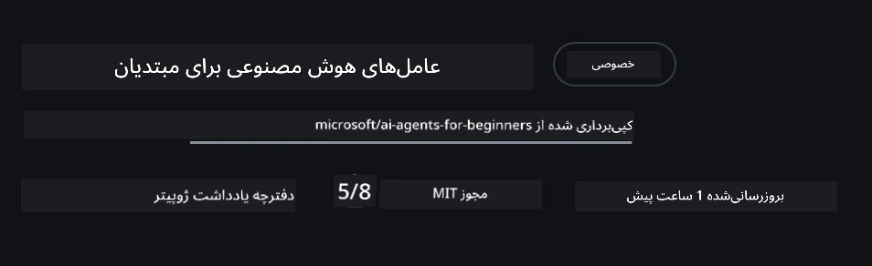
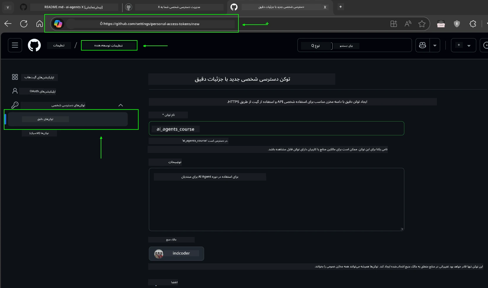
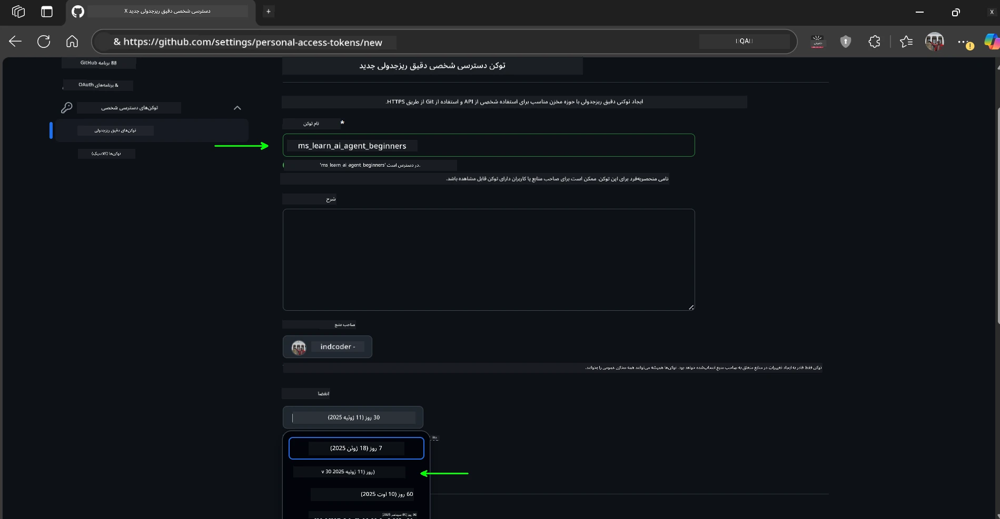
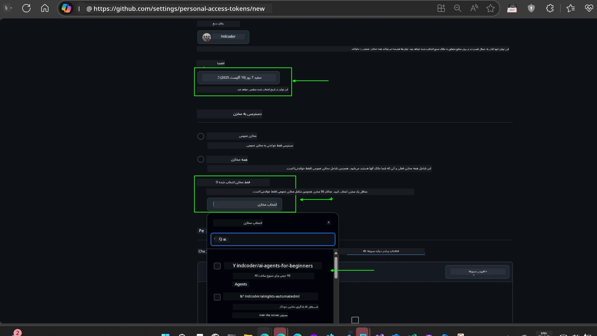
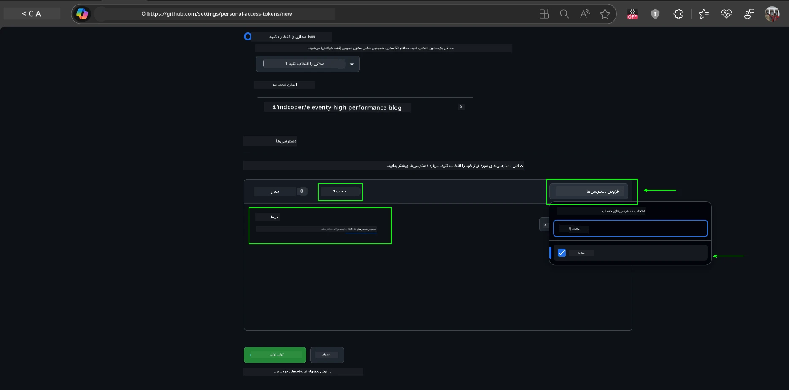
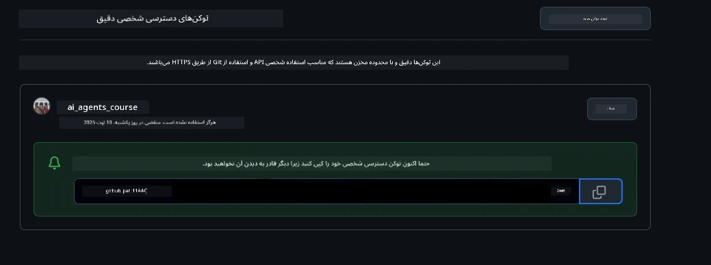
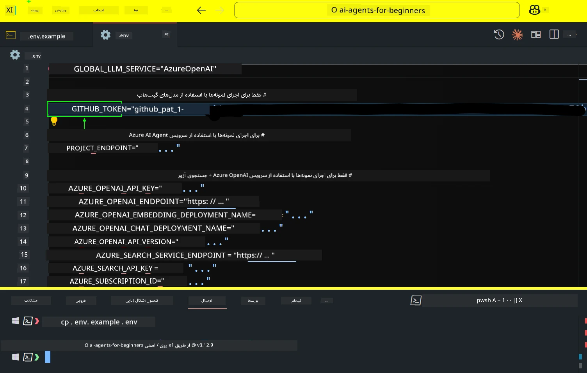
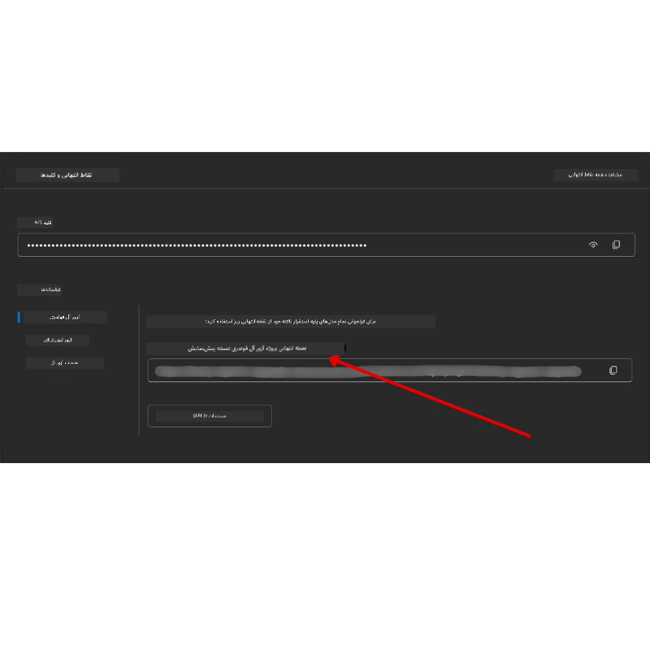

<!--
CO_OP_TRANSLATOR_METADATA:
{
  "original_hash": "63b1a8f6e840df15934935b728e569f0",
  "translation_date": "2025-12-03T13:49:55+00:00",
  "source_file": "00-course-setup/README.md",
  "language_code": "fa"
}
-->
# تنظیم دوره

## مقدمه

این درس نحوه اجرای نمونه کدهای این دوره را پوشش می‌دهد.

## پیوستن به سایر یادگیرندگان و دریافت کمک

قبل از اینکه مخزن خود را کلون کنید، به [کانال دیسکورد AI Agents For Beginners](https://aka.ms/ai-agents/discord) بپیوندید تا در مورد تنظیمات، سوالات مربوط به دوره یا ارتباط با سایر یادگیرندگان کمک بگیرید.

## کلون یا فورک کردن این مخزن

برای شروع، لطفاً مخزن GitHub را کلون یا فورک کنید. این کار نسخه‌ای از مواد دوره را برای شما ایجاد می‌کند تا بتوانید کد را اجرا، آزمایش و تغییر دهید!

این کار را می‌توانید با کلیک بر روی لینک <a href="https://github.com/microsoft/ai-agents-for-beginners/fork" target="_blank">فورک کردن مخزن</a> انجام دهید.

اکنون باید نسخه فورک شده خود از این دوره را در لینک زیر داشته باشید:



### کلون سطحی (توصیه شده برای کارگاه / Codespaces)

  >مخزن کامل ممکن است بزرگ باشد (~3 گیگابایت) وقتی که تاریخچه کامل و همه فایل‌ها را دانلود می‌کنید. اگر فقط در کارگاه شرکت می‌کنید یا فقط به چند پوشه درس نیاز دارید، کلون سطحی (یا کلون پراکنده) بیشتر این دانلود را با کوتاه کردن تاریخچه و/یا رد کردن بلوک‌ها اجتناب می‌کند.

#### کلون سطحی سریع — تاریخچه حداقلی، همه فایل‌ها

در دستورات زیر `<your-username>` را با URL فورک خود (یا URL بالادستی اگر ترجیح می‌دهید) جایگزین کنید.

برای کلون کردن فقط تاریخچه آخرین کامیت (دانلود کوچک):

```bash|powershell
git clone --depth 1 https://github.com/<your-username>/ai-agents-for-beginners.git
```

برای کلون کردن یک شاخه خاص:

```bash|powershell
git clone --depth 1 --branch <branch-name> https://github.com/<your-username>/ai-agents-for-beginners.git
```

#### کلون جزئی (پراکنده) — بلوک‌های حداقلی + فقط پوشه‌های انتخاب شده

این روش از کلون جزئی و بررسی پراکنده استفاده می‌کند (نیاز به Git 2.25+ دارد و Git مدرن با پشتیبانی از کلون جزئی توصیه می‌شود):

```bash|powershell
git clone --depth 1 --filter=blob:none --sparse https://github.com/<your-username>/ai-agents-for-beginners.git
```

وارد پوشه مخزن شوید:

```bash|powershell
cd ai-agents-for-beginners
```

سپس مشخص کنید که کدام پوشه‌ها را می‌خواهید (مثال زیر دو پوشه را نشان می‌دهد):

```bash|powershell
git sparse-checkout set 00-course-setup 01-intro-to-ai-agents
```

پس از کلون کردن و بررسی فایل‌ها، اگر فقط به فایل‌ها نیاز دارید و می‌خواهید فضای آزاد کنید (بدون تاریخچه گیت)، لطفاً متادیتای مخزن را حذف کنید (💀غیرقابل بازگشت — تمام قابلیت‌های Git را از دست خواهید داد: بدون کامیت‌ها، کشیدن‌ها، فشار دادن‌ها یا دسترسی به تاریخچه).

```bash
# زش/بش
rm -rf .git
```

```powershell
# پاورشل
Remove-Item -Recurse -Force .git
```

#### استفاده از GitHub Codespaces (توصیه شده برای اجتناب از دانلودهای بزرگ محلی)

- یک Codespace جدید برای این مخزن از طریق [رابط کاربری GitHub](https://github.com/codespaces) ایجاد کنید.  

- در ترمینال Codespace تازه ایجاد شده، یکی از دستورات کلون سطحی/پراکنده بالا را اجرا کنید تا فقط پوشه‌های درس مورد نیاز را به فضای کاری Codespace بیاورید.
- اختیاری: پس از کلون کردن داخل Codespaces، .git را حذف کنید تا فضای اضافی آزاد شود (دستورات حذف بالا را ببینید).
- توجه: اگر ترجیح می‌دهید مخزن را مستقیماً در Codespaces باز کنید (بدون کلون اضافی)، توجه داشته باشید که Codespaces محیط devcontainer را ایجاد می‌کند و ممکن است همچنان بیش از نیاز شما فراهم کند. کلون کردن یک نسخه سطحی داخل یک Codespace تازه به شما کنترل بیشتری بر استفاده از دیسک می‌دهد.

#### نکات

- همیشه URL کلون را با فورک خود جایگزین کنید اگر می‌خواهید ویرایش/کامیت کنید.
- اگر بعداً به تاریخچه یا فایل‌های بیشتری نیاز داشتید، می‌توانید آنها را دریافت کنید یا بررسی پراکنده را تنظیم کنید تا پوشه‌های اضافی را شامل شود.

## اجرای کد

این دوره مجموعه‌ای از نوت‌بوک‌های Jupyter ارائه می‌دهد که می‌توانید با آنها تجربه عملی ساخت عوامل هوش مصنوعی را کسب کنید.

نمونه‌های کد از موارد زیر استفاده می‌کنند:

**نیاز به حساب GitHub - رایگان**:

1) چارچوب Semantic Kernel Agent + بازار مدل‌های GitHub. با برچسب (semantic-kernel.ipynb)
2) چارچوب AutoGen + بازار مدل‌های GitHub. با برچسب (autogen.ipynb)

**نیاز به اشتراک Azure**:

3) Azure AI Foundry + سرویس عامل هوش مصنوعی Azure. با برچسب (azureaiagent.ipynb)

ما شما را تشویق می‌کنیم که هر سه نوع مثال را امتحان کنید تا ببینید کدام یک برای شما بهتر کار می‌کند.

هر گزینه‌ای که انتخاب کنید، تعیین می‌کند که کدام مراحل تنظیم را باید در زیر دنبال کنید:

## الزامات

- Python 3.12+
  - **NOTE**: اگر Python3.12 نصب نشده است، مطمئن شوید که آن را نصب کنید. سپس با استفاده از python3.12 دایرکتوری venv خود را ایجاد کنید تا نسخه‌های صحیح از فایل requirements.txt نصب شوند.
  
    >مثال

    ایجاد دایرکتوری Python venv:

    ```bash|powershell
    python -m venv venv
    ```

    سپس محیط venv را فعال کنید برای:

    ```bash
    # زش/بش
    source venv/bin/activate
    ```
  
    ```dos
    # Command Prompt for Windows
    venv\Scripts\activate
    ```

- .NET 10+: برای نمونه کدهایی که از .NET استفاده می‌کنند، مطمئن شوید که [.NET 10 SDK](https://dotnet.microsoft.com/download/dotnet/10.0) یا نسخه‌های بعدی را نصب کنید. سپس نسخه SDK نصب شده .NET خود را بررسی کنید:

    ```bash|powershell
    dotnet --list-sdks
    ```

- حساب GitHub - برای دسترسی به بازار مدل‌های GitHub
- اشتراک Azure - برای دسترسی به Azure AI Foundry
- حساب Azure AI Foundry - برای دسترسی به سرویس عامل هوش مصنوعی Azure

ما یک فایل `requirements.txt` در ریشه این مخزن قرار داده‌ایم که شامل تمام بسته‌های Python مورد نیاز برای اجرای نمونه‌های کد است.

می‌توانید آنها را با اجرای دستور زیر در ترمینال در ریشه مخزن نصب کنید:

```bash|powershell
pip install -r requirements.txt
```

ما توصیه می‌کنیم یک محیط مجازی Python ایجاد کنید تا از هرگونه تضاد و مشکل جلوگیری کنید.

## تنظیم VSCode

مطمئن شوید که از نسخه صحیح Python در VSCode استفاده می‌کنید.


## تنظیم برای نمونه‌ها با استفاده از مدل‌های GitHub 

### مرحله 1: دریافت توکن دسترسی شخصی GitHub (PAT)

این دوره از بازار مدل‌های GitHub استفاده می‌کند که دسترسی رایگان به مدل‌های زبان بزرگ (LLMs) را فراهم می‌کند که شما برای ساخت عوامل هوش مصنوعی استفاده خواهید کرد.

برای استفاده از مدل‌های GitHub، باید یک [توکن دسترسی شخصی GitHub](https://docs.github.com/en/authentication/keeping-your-account-and-data-secure/managing-your-personal-access-tokens) ایجاد کنید.

این کار را می‌توانید با رفتن به <a href="https://github.com/settings/personal-access-tokens" target="_blank">تنظیمات توکن دسترسی شخصی</a> در حساب GitHub خود انجام دهید.

لطفاً هنگام ایجاد توکن، [اصل حداقل امتیاز](https://docs.github.com/en/get-started/learning-to-code/storing-your-secrets-safely) را دنبال کنید. این بدان معناست که باید فقط مجوزهایی را که برای اجرای نمونه‌های کد در این دوره نیاز دارید به توکن بدهید.

1. گزینه `توکن‌های دقیق` را در سمت چپ صفحه خود انتخاب کنید با رفتن به **تنظیمات توسعه‌دهنده**

   

   سپس گزینه `ایجاد توکن جدید` را انتخاب کنید.

   

2. یک نام توصیفی برای توکن خود وارد کنید که هدف آن را منعکس کند و شناسایی آن را در آینده آسان کند.

    🔐 توصیه مدت زمان توکن

    مدت زمان توصیه شده: 30 روز
    برای امنیت بیشتر، می‌توانید مدت زمان کوتاه‌تری انتخاب کنید—مانند 7 روز 🛡️
    این یک راه عالی برای تعیین هدف شخصی و تکمیل دوره در حالی است که انگیزه یادگیری شما بالا است 🚀.

    

3. دامنه توکن را به فورک این مخزن محدود کنید.

    

4. مجوزهای توکن را محدود کنید: در زیر **Permissions**، بر روی تب **Account** کلیک کنید و دکمه "+ Add permissions" را فشار دهید. یک منوی کشویی ظاهر خواهد شد. لطفاً **Models** را جستجو کنید و کادر آن را علامت بزنید.

    

5. قبل از ایجاد توکن، مجوزهای مورد نیاز را بررسی کنید. 

6. قبل از ایجاد توکن، مطمئن شوید که آماده ذخیره توکن در مکانی امن مانند یک گاوصندوق مدیریت رمز عبور هستید، زیرا پس از ایجاد آن دیگر نمایش داده نمی‌شود. 

توکن جدیدی که ایجاد کرده‌اید را کپی کنید. اکنون این توکن را به فایل `.env` که در این دوره گنجانده شده است اضافه خواهید کرد.

### مرحله 2: ایجاد فایل `.env` خود

برای ایجاد فایل `.env` خود دستور زیر را در ترمینال اجرا کنید.

```bash
# زش/بش
cp .env.example .env
```

```powershell
# پاورشل
Copy-Item .env.example .env
```

این دستور فایل نمونه را کپی کرده و یک `.env` در دایرکتوری شما ایجاد می‌کند که در آن مقادیر متغیرهای محیطی را پر می‌کنید.

با کپی کردن توکن خود، فایل `.env` را در ویرایشگر متن مورد علاقه خود باز کنید و توکن خود را در فیلد `GITHUB_TOKEN` قرار دهید.



اکنون باید بتوانید نمونه‌های کد این دوره را اجرا کنید.

## تنظیم برای نمونه‌ها با استفاده از Azure AI Foundry و سرویس عامل هوش مصنوعی Azure

### مرحله 1: دریافت نقطه پایانی پروژه Azure خود

مراحل ایجاد یک هاب و پروژه در Azure AI Foundry را دنبال کنید که در اینجا آمده است: [بررسی اجمالی منابع هاب](https://learn.microsoft.com/azure/ai-foundry/concepts/ai-resources)

پس از ایجاد پروژه خود، باید رشته اتصال پروژه خود را دریافت کنید.

این کار را می‌توانید با رفتن به صفحه **بررسی اجمالی** پروژه خود در پورتال Azure AI Foundry انجام دهید.



### مرحله 2: ایجاد فایل `.env` خود

برای ایجاد فایل `.env` خود دستور زیر را در ترمینال اجرا کنید.

```bash
# زش/بش
cp .env.example .env
```

```powershell
# پاورشل
Copy-Item .env.example .env
```

این دستور فایل نمونه را کپی کرده و یک `.env` در دایرکتوری شما ایجاد می‌کند که در آن مقادیر متغیرهای محیطی را پر می‌کنید.

با کپی کردن توکن خود، فایل `.env` را در ویرایشگر متن مورد علاقه خود باز کنید و توکن خود را در فیلد `PROJECT_ENDPOINT` قرار دهید.

### مرحله 3: ورود به Azure

به عنوان یک بهترین روش امنیتی، از [احراز هویت بدون کلید](https://learn.microsoft.com/azure/developer/ai/keyless-connections?tabs=csharp%2Cazure-cli?WT.mc_id=academic-105485-koreyst) برای احراز هویت به Azure OpenAI با Microsoft Entra ID استفاده خواهیم کرد. 

سپس، یک ترمینال باز کنید و دستور `az login --use-device-code` را اجرا کنید تا به حساب Azure خود وارد شوید.

پس از ورود، اشتراک خود را در ترمینال انتخاب کنید.

## متغیرهای محیطی اضافی - Azure Search و Azure OpenAI 

برای درس Agentic RAG - درس 5 - نمونه‌هایی وجود دارد که از Azure Search و Azure OpenAI استفاده می‌کنند.

اگر می‌خواهید این نمونه‌ها را اجرا کنید، باید متغیرهای محیطی زیر را به فایل `.env` خود اضافه کنید:

### صفحه بررسی اجمالی (پروژه)

- `AZURE_SUBSCRIPTION_ID` - جزئیات پروژه را در صفحه **بررسی اجمالی** پروژه خود بررسی کنید.

- `AZURE_AI_PROJECT_NAME` - در بالای صفحه **بررسی اجمالی** پروژه خود نگاه کنید.

- `AZURE_OPENAI_SERVICE` - این را در تب **قابلیت‌های گنجانده شده** برای **سرویس Azure OpenAI** در صفحه **بررسی اجمالی** پیدا کنید.

### مرکز مدیریت

- `AZURE_OPENAI_RESOURCE_GROUP` - به **ویژگی‌های پروژه** در صفحه **بررسی اجمالی** مرکز مدیریت بروید.

- `GLOBAL_LLM_SERVICE` - در زیر **منابع متصل**، نام اتصال **خدمات هوش مصنوعی Azure** را پیدا کنید. اگر لیست نشده است، در **پورتال Azure** زیر گروه منابع خود برای نام منبع خدمات هوش مصنوعی بررسی کنید.

### صفحه مدل‌ها + نقاط پایانی

- `AZURE_OPENAI_EMBEDDING_DEPLOYMENT_NAME` - مدل جاسازی خود را انتخاب کنید (مثلاً `text-embedding-ada-002`) و نام **استقرار** را از جزئیات مدل یادداشت کنید.

- `AZURE_OPENAI_CHAT_DEPLOYMENT_NAME` - مدل چت خود را انتخاب کنید (مثلاً `gpt-4o-mini`) و نام **استقرار** را از جزئیات مدل یادداشت کنید.

### پورتال Azure

- `AZURE_OPENAI_ENDPOINT` - به دنبال **خدمات هوش مصنوعی Azure** باشید، روی آن کلیک کنید، سپس به **مدیریت منابع**، **کلیدها و نقطه پایانی** بروید، به پایین به "نقاط پایانی Azure OpenAI" بروید، و یکی را که می‌گوید "API‌های زبان" کپی کنید.

- `AZURE_OPENAI_API_KEY` - از همان صفحه، کلید 1 یا کلید 2 را کپی کنید.

- `AZURE_SEARCH_SERVICE_ENDPOINT` - منبع **Azure AI Search** خود را پیدا کنید، روی آن کلیک کنید، و صفحه **بررسی اجمالی** را ببینید.

- `AZURE_SEARCH_API_KEY` - سپس به **تنظیمات** و سپس **کلیدها** بروید تا کلید اصلی یا ثانویه مدیر را کپی کنید.

### صفحه خارجی

- `AZURE_OPENAI_API_VERSION` - به صفحه [چرخه عمر نسخه API](https://learn.microsoft.com/azure/ai-services/openai/api-version-deprecation#latest-ga-api-release) در زیر **آخرین نسخه GA API** مراجعه کنید.

### تنظیم احراز هویت بدون کلید

به جای سخت‌کد کردن اعتبارنامه‌های خود، از اتصال بدون کلید با Azure OpenAI استفاده خواهیم کرد. برای این کار، `DefaultAzureCredential` را وارد می‌کنیم و بعداً تابع `DefaultAzureCredential` را برای دریافت اعتبارنامه فراخوانی می‌کنیم.

```python
# پایتون
from azure.identity import DefaultAzureCredential, InteractiveBrowserCredential
```

## جایی گیر کرده‌اید؟
اگر در اجرای این تنظیمات مشکلی دارید، به <a href="https://discord.gg/kzRShWzttr" target="_blank">دیسکورد جامعه Azure AI</a> ما بپیوندید یا <a href="https://github.com/microsoft/ai-agents-for-beginners/issues?WT.mc_id=academic-105485-koreyst" target="_blank">یک مشکل ایجاد کنید</a>.

## درس بعدی

اکنون آماده اجرای کد این دوره هستید. از یادگیری بیشتر درباره دنیای عوامل هوش مصنوعی لذت ببرید!

[مقدمه‌ای بر عوامل هوش مصنوعی و موارد استفاده از عوامل](../01-intro-to-ai-agents/README.md)

---

<!-- CO-OP TRANSLATOR DISCLAIMER START -->
**سلب مسئولیت**:  
این سند با استفاده از سرویس ترجمه هوش مصنوعی [Co-op Translator](https://github.com/Azure/co-op-translator) ترجمه شده است. در حالی که ما تلاش می‌کنیم دقت را حفظ کنیم، لطفاً توجه داشته باشید که ترجمه‌های خودکار ممکن است شامل خطاها یا نادرستی‌ها باشند. سند اصلی به زبان اصلی آن باید به عنوان منبع معتبر در نظر گرفته شود. برای اطلاعات حیاتی، ترجمه حرفه‌ای انسانی توصیه می‌شود. ما مسئولیتی در قبال سوء تفاهم‌ها یا تفسیرهای نادرست ناشی از استفاده از این ترجمه نداریم.
<!-- CO-OP TRANSLATOR DISCLAIMER END -->