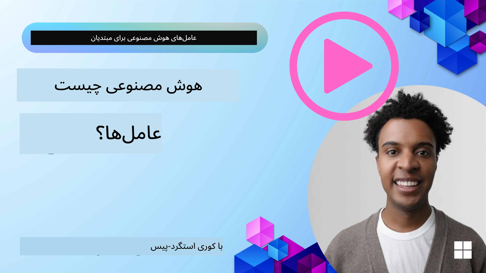
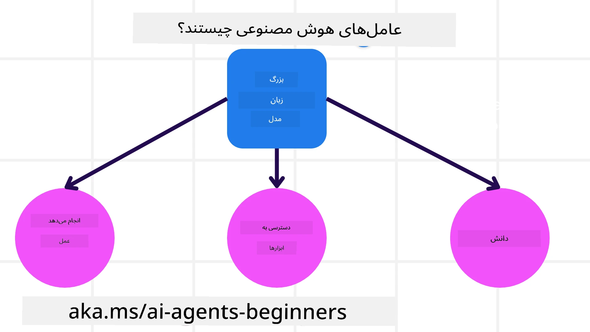
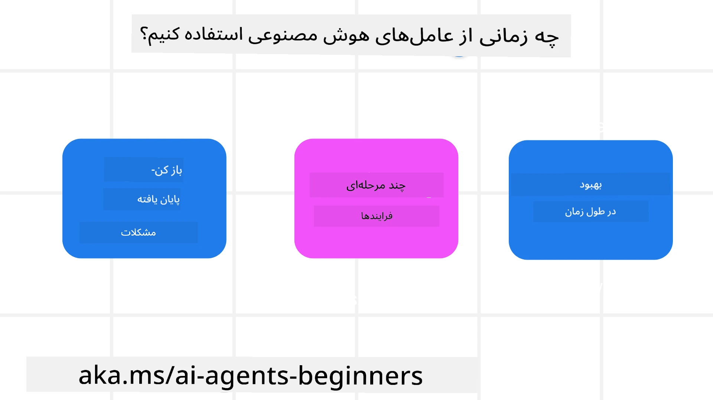

<!--
CO_OP_TRANSLATOR_METADATA:
{
  "original_hash": "cdd28bc00816d2773bb2b5968d782abc",
  "translation_date": "2025-11-11T10:52:40+00:00",
  "source_file": "01-intro-to-ai-agents/README.md",
  "language_code": "fa"
}
-->

> _(برای مشاهده ویدئوی این درس، روی تصویر بالا کلیک کنید)_

# معرفی عوامل هوش مصنوعی و موارد استفاده از آن‌ها

به دوره "عوامل هوش مصنوعی برای مبتدیان" خوش آمدید! این دوره دانش پایه و نمونه‌های کاربردی برای ساخت عوامل هوش مصنوعی را ارائه می‌دهد.

به <a href="https://discord.gg/kzRShWzttr" target="_blank">جامعه دیسکورد Azure AI</a> بپیوندید تا با دیگر یادگیرندگان و سازندگان عوامل هوش مصنوعی آشنا شوید و هر سوالی که درباره این دوره دارید بپرسید.

برای شروع این دوره، ابتدا درک بهتری از عوامل هوش مصنوعی و نحوه استفاده از آن‌ها در برنامه‌ها و جریان‌های کاری که ایجاد می‌کنیم، پیدا می‌کنیم.

## مقدمه

این درس شامل موارد زیر است:

- عوامل هوش مصنوعی چیستند و انواع مختلف آن‌ها کدامند؟
- چه موارد استفاده‌ای برای عوامل هوش مصنوعی مناسب هستند و چگونه می‌توانند به ما کمک کنند؟
- برخی از اجزای اصلی در طراحی راه‌حل‌های مبتنی بر عامل چیستند؟

## اهداف یادگیری
پس از تکمیل این درس، شما باید بتوانید:

- مفاهیم عوامل هوش مصنوعی را درک کنید و تفاوت آن‌ها با سایر راه‌حل‌های هوش مصنوعی را بدانید.
- عوامل هوش مصنوعی را به صورت کارآمد به کار ببرید.
- راه‌حل‌های مبتنی بر عامل را به صورت مؤثر برای کاربران و مشتریان طراحی کنید.

## تعریف عوامل هوش مصنوعی و انواع آن‌ها

### عوامل هوش مصنوعی چیستند؟

عوامل هوش مصنوعی **سیستم‌هایی** هستند که به **مدل‌های زبانی بزرگ (LLMs)** امکان **انجام اقدامات** را می‌دهند، با گسترش قابلیت‌های آن‌ها از طریق دسترسی به **ابزارها** و **دانش**.

بیایید این تعریف را به بخش‌های کوچکتر تقسیم کنیم:

- **سیستم** - مهم است که عوامل را نه به عنوان یک جزء واحد، بلکه به عنوان سیستمی از اجزای متعدد در نظر بگیریم. در سطح پایه، اجزای یک عامل هوش مصنوعی عبارتند از:
  - **محیط** - فضای تعریف‌شده‌ای که عامل هوش مصنوعی در آن فعالیت می‌کند. به عنوان مثال، اگر یک عامل رزرو سفر داشته باشیم، محیط می‌تواند سیستم رزرو سفر باشد که عامل هوش مصنوعی از آن برای انجام وظایف استفاده می‌کند.
  - **حسگرها** - محیط‌ها اطلاعات و بازخورد ارائه می‌دهند. عوامل هوش مصنوعی از حسگرها برای جمع‌آوری و تفسیر این اطلاعات درباره وضعیت فعلی محیط استفاده می‌کنند. در مثال عامل رزرو سفر، سیستم رزرو سفر می‌تواند اطلاعاتی مانند در دسترس بودن هتل یا قیمت پرواز ارائه دهد.
  - **عملگرها** - پس از دریافت وضعیت فعلی محیط توسط عامل هوش مصنوعی، عامل برای وظیفه فعلی تعیین می‌کند که چه اقدامی برای تغییر محیط انجام دهد. برای عامل رزرو سفر، ممکن است رزرو یک اتاق موجود برای کاربر باشد.

**مدل‌های زبانی بزرگ** - مفهوم عوامل قبل از ایجاد LLMها وجود داشت. مزیت ساخت عوامل هوش مصنوعی با LLMها توانایی آن‌ها در تفسیر زبان انسانی و داده‌ها است. این توانایی به LLMها امکان می‌دهد اطلاعات محیطی را تفسیر کنند و برنامه‌ای برای تغییر محیط تعریف کنند.

**انجام اقدامات** - خارج از سیستم‌های عامل هوش مصنوعی، LLMها محدود به موقعیت‌هایی هستند که اقدام تولید محتوا یا اطلاعات بر اساس درخواست کاربر است. در داخل سیستم‌های عامل هوش مصنوعی، LLMها می‌توانند وظایف را با تفسیر درخواست کاربر و استفاده از ابزارهای موجود در محیط خود انجام دهند.

**دسترسی به ابزارها** - ابزارهایی که LLM به آن‌ها دسترسی دارد توسط 1) محیطی که در آن فعالیت می‌کند و 2) توسعه‌دهنده عامل هوش مصنوعی تعریف می‌شود. برای مثال عامل سفر، ابزارهای عامل محدود به عملیات موجود در سیستم رزرو هستند و/یا توسعه‌دهنده می‌تواند دسترسی عامل به ابزارها را به پروازها محدود کند.

**حافظه+دانش** - حافظه می‌تواند کوتاه‌مدت باشد در زمینه مکالمه بین کاربر و عامل. در بلندمدت، خارج از اطلاعات ارائه‌شده توسط محیط، عوامل هوش مصنوعی می‌توانند دانش را از سیستم‌ها، خدمات، ابزارها و حتی عوامل دیگر بازیابی کنند. در مثال عامل سفر، این دانش می‌تواند اطلاعاتی درباره ترجیحات سفر کاربر باشد که در یک پایگاه داده مشتری قرار دارد.

### انواع مختلف عوامل

اکنون که تعریف کلی عوامل هوش مصنوعی را داریم، بیایید به برخی از انواع خاص عوامل و نحوه استفاده از آن‌ها در یک عامل رزرو سفر بپردازیم.

| **نوع عامل**                 | **توضیحات**                                                                                                                       | **مثال**                                                                                                                                                                                                                   |
| ----------------------------- | ------------------------------------------------------------------------------------------------------------------------------------- | ----------------------------------------------------------------------------------------------------------------------------------------------------------------------------------------------------------------------------- |
| **عوامل واکنش ساده**         | اقدامات فوری بر اساس قوانین از پیش تعریف‌شده انجام می‌دهند.                                                                          | عامل سفر زمینه ایمیل را تفسیر کرده و شکایات سفر را به خدمات مشتریان ارسال می‌کند.                                                                                                                          |
| **عوامل واکنش مبتنی بر مدل** | اقدامات بر اساس یک مدل از جهان و تغییرات در آن مدل انجام می‌دهند.                                                                   | عامل سفر مسیرهایی با تغییرات قابل توجه قیمت را بر اساس دسترسی به داده‌های قیمت‌گذاری تاریخی اولویت‌بندی می‌کند.                                                                                                             |
| **عوامل مبتنی بر هدف**       | برنامه‌هایی برای دستیابی به اهداف خاص ایجاد می‌کنند، با تفسیر هدف و تعیین اقدامات برای رسیدن به آن.                                  | عامل سفر با تعیین ترتیبات لازم سفر (ماشین، حمل و نقل عمومی، پروازها) از مکان فعلی به مقصد، یک سفر را رزرو می‌کند.                                                                                |
| **عوامل مبتنی بر سودمندی**   | ترجیحات را در نظر می‌گیرند و مبادلات را به صورت عددی وزن‌دهی می‌کنند تا تعیین کنند چگونه به اهداف برسند.                            | عامل سفر با وزن‌دهی راحتی در مقابل هزینه هنگام رزرو سفر، سودمندی را به حداکثر می‌رساند.                                                                                                                                          |
| **عوامل یادگیری**            | با پاسخ به بازخورد و تنظیم اقدامات به مرور زمان بهبود می‌یابند.                                                                     | عامل سفر با استفاده از بازخورد مشتری از نظرسنجی‌های پس از سفر، تنظیمات لازم را برای رزروهای آینده انجام می‌دهد.                                                                                                               |
| **عوامل سلسله‌مراتبی**       | شامل چندین عامل در یک سیستم لایه‌ای هستند، که عوامل سطح بالاتر وظایف را به زیر وظایف تقسیم می‌کنند تا عوامل سطح پایین‌تر آن‌ها را انجام دهند. | عامل سفر یک سفر را لغو می‌کند با تقسیم وظیفه به زیر وظایف (برای مثال، لغو رزروهای خاص) و داشتن عوامل سطح پایین‌تر آن‌ها را انجام داده و به عامل سطح بالاتر گزارش می‌دهند.                                     |
| **سیستم‌های چندعاملی (MAS)** | عوامل وظایف را به صورت مستقل، یا به صورت همکاری یا رقابت انجام می‌دهند.                                                             | همکاری: چندین عامل خدمات سفر خاص مانند هتل‌ها، پروازها و سرگرمی‌ها را رزرو می‌کنند. رقابت: چندین عامل یک تقویم رزرو هتل مشترک را مدیریت کرده و برای رزرو مشتریان در هتل رقابت می‌کنند. |

## زمان استفاده از عوامل هوش مصنوعی

در بخش قبلی، از مورد استفاده عامل سفر برای توضیح نحوه استفاده از انواع مختلف عوامل در سناریوهای مختلف رزرو سفر استفاده کردیم. ما در طول دوره به استفاده از این برنامه ادامه خواهیم داد.

بیایید به انواع موارد استفاده‌ای که عوامل هوش مصنوعی برای آن‌ها بهترین کاربرد را دارند، نگاه کنیم:

- **مسائل باز** - اجازه دادن به LLM برای تعیین مراحل لازم برای انجام یک وظیفه، زیرا همیشه نمی‌توان آن را به صورت سخت‌افزاری در یک جریان کاری کدنویسی کرد.
- **فرآیندهای چندمرحله‌ای** - وظایفی که نیاز به سطحی از پیچیدگی دارند که عامل هوش مصنوعی باید ابزارها یا اطلاعات را در چندین مرحله استفاده کند، نه فقط بازیابی یکباره.  
- **بهبود به مرور زمان** - وظایفی که عامل می‌تواند با دریافت بازخورد از محیط یا کاربران خود به مرور زمان بهبود یابد تا سودمندی بهتری ارائه دهد.

ما در درس ساخت عوامل هوش مصنوعی قابل اعتماد، ملاحظات بیشتری درباره استفاده از عوامل هوش مصنوعی را پوشش می‌دهیم.

## اصول اولیه راه‌حل‌های مبتنی بر عامل

### توسعه عامل

اولین قدم در طراحی یک سیستم عامل هوش مصنوعی، تعریف ابزارها، اقدامات و رفتارها است. در این دوره، ما بر استفاده از **خدمات عامل Azure AI** برای تعریف عوامل خود تمرکز می‌کنیم. این خدمات ویژگی‌هایی مانند:

- انتخاب مدل‌های باز مانند OpenAI، Mistral و Llama
- استفاده از داده‌های دارای مجوز از طریق ارائه‌دهندگانی مانند Tripadvisor
- استفاده از ابزارهای استاندارد OpenAPI 3.0

### الگوهای مبتنی بر عامل

ارتباط با LLMها از طریق درخواست‌ها انجام می‌شود. با توجه به ماهیت نیمه‌خودکار عوامل هوش مصنوعی، همیشه ممکن یا لازم نیست که پس از تغییر در محیط، به صورت دستی LLM را دوباره درخواست کنیم. ما از **الگوهای مبتنی بر عامل** استفاده می‌کنیم که به ما امکان می‌دهند LLM را در چندین مرحله به صورت مقیاس‌پذیر درخواست کنیم.

این دوره به برخی از الگوهای مبتنی بر عامل محبوب فعلی تقسیم شده است.

### چارچوب‌های مبتنی بر عامل

چارچوب‌های مبتنی بر عامل به توسعه‌دهندگان امکان می‌دهند الگوهای مبتنی بر عامل را از طریق کدنویسی پیاده‌سازی کنند. این چارچوب‌ها قالب‌ها، افزونه‌ها و ابزارهایی برای همکاری بهتر عوامل هوش مصنوعی ارائه می‌دهند. این مزایا توانایی‌هایی برای مشاهده بهتر و رفع اشکال سیستم‌های عامل هوش مصنوعی فراهم می‌کنند.

در این دوره، ما چارچوب AutoGen مبتنی بر تحقیق و چارچوب عامل آماده تولید از Semantic Kernel را بررسی خواهیم کرد.

## نمونه کدها

- پایتون: [چارچوب عامل](./code_samples/01-python-agent-framework.ipynb)
- .NET: [چارچوب عامل](./code_samples/01-dotnet-agent-framework.md)

## سوالات بیشتری درباره عوامل هوش مصنوعی دارید؟

به [دیسکورد Azure AI Foundry](https://aka.ms/ai-agents/discord) بپیوندید تا با دیگر یادگیرندگان ملاقات کنید، در ساعات اداری شرکت کنید و سوالات خود درباره عوامل هوش مصنوعی را پاسخ دهید.

## درس قبلی

[تنظیم دوره](../00-course-setup/README.md)

## درس بعدی

[بررسی چارچوب‌های مبتنی بر عامل](../02-explore-agentic-frameworks/README.md)

---

<!-- CO-OP TRANSLATOR DISCLAIMER START -->
**سلب مسئولیت**:  
این سند با استفاده از سرویس ترجمه هوش مصنوعی [Co-op Translator](https://github.com/Azure/co-op-translator) ترجمه شده است. در حالی که ما تلاش می‌کنیم دقت را حفظ کنیم، لطفاً توجه داشته باشید که ترجمه‌های خودکار ممکن است شامل خطاها یا نادرستی‌ها باشند. سند اصلی به زبان اصلی آن باید به عنوان منبع معتبر در نظر گرفته شود. برای اطلاعات حیاتی، ترجمه حرفه‌ای انسانی توصیه می‌شود. ما مسئولیتی در قبال سوء تفاهم‌ها یا تفسیرهای نادرست ناشی از استفاده از این ترجمه نداریم.
<!-- CO-OP TRANSLATOR DISCLAIMER END -->