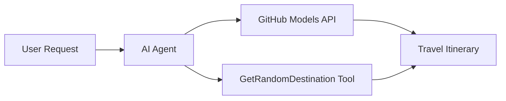

<!--
CO_OP_TRANSLATOR_METADATA:
{
  "original_hash": "5f351412e934f0833c8c821a0a60efaf",
  "translation_date": "2025-11-13T11:05:12+00:00",
  "source_file": "01-intro-to-ai-agents/code_samples/01-dotnet-agent-framework.md",
  "language_code": "fa"
}
-->
# 🌍 عامل سفر هوشمند با Microsoft Agent Framework (.NET)

## 📋 نمای کلی سناریو

این مثال نشان می‌دهد که چگونه می‌توان یک عامل برنامه‌ریزی سفر هوشمند با استفاده از Microsoft Agent Framework برای .NET ساخت. این عامل می‌تواند برنامه‌های سفر روزانه شخصی‌سازی شده برای مقاصد تصادفی در سراسر جهان ایجاد کند.

### قابلیت‌های کلیدی:

- 🎲 **انتخاب مقصد تصادفی**: از یک ابزار سفارشی برای انتخاب مکان‌های تعطیلات استفاده می‌کند
- 🗺️ **برنامه‌ریزی سفر هوشمند**: برنامه‌های دقیق روزانه ایجاد می‌کند
- 🔄 **پخش زنده در زمان واقعی**: از پاسخ‌های فوری و پخش زنده پشتیبانی می‌کند
- 🛠️ **ادغام ابزار سفارشی**: نشان می‌دهد که چگونه قابلیت‌های عامل را گسترش دهید

## 🔧 معماری فنی

### فناوری‌های اصلی

- **Microsoft Agent Framework**: آخرین پیاده‌سازی .NET برای توسعه عامل‌های هوش مصنوعی
- **ادغام مدل‌های GitHub**: از سرویس استنتاج مدل‌های هوش مصنوعی GitHub استفاده می‌کند
- **سازگاری با OpenAI API**: از کتابخانه‌های مشتری OpenAI با نقاط پایانی سفارشی بهره می‌برد
- **پیکربندی امن**: مدیریت کلیدهای API بر اساس محیط

### اجزای کلیدی

1. **AIAgent**: هماهنگ‌کننده اصلی عامل که جریان مکالمه را مدیریت می‌کند
2. **ابزارهای سفارشی**: تابع `GetRandomDestination()` که برای عامل در دسترس است
3. **کلاینت چت**: رابط مکالمه پشتیبانی شده توسط مدل‌های GitHub
4. **پشتیبانی از پخش زنده**: قابلیت‌های تولید پاسخ در زمان واقعی

### الگوی ادغام



## 🚀 شروع به کار

### پیش‌نیازها

- [.NET 10 SDK](https://dotnet.microsoft.com/download/dotnet/10.0) یا بالاتر
- [توکن دسترسی API مدل‌های GitHub](https://docs.github.com/github-models/github-models-at-scale/using-your-own-api-keys-in-github-models)

### متغیرهای محیطی مورد نیاز

```bash
# zsh/bash
export GH_TOKEN=<your_github_token>
export GH_ENDPOINT=https://models.github.ai/inference
export GH_MODEL_ID=openai/gpt-5-mini
```

```powershell
# PowerShell
$env:GH_TOKEN = "<your_github_token>"
$env:GH_ENDPOINT = "https://models.github.ai/inference"
$env:GH_MODEL_ID = "openai/gpt-5-mini"
```

### نمونه کد

برای اجرای نمونه کد،

```bash
# zsh/bash
chmod +x ./01-dotnet-agent-framework.cs
./01-dotnet-agent-framework.cs
```

یا با استفاده از CLI دات‌نت:

```bash
dotnet run ./01-dotnet-agent-framework.cs
```

فایل [`01-dotnet-agent-framework.cs`](../../../../01-intro-to-ai-agents/code_samples/01-dotnet-agent-framework.cs) را برای کد کامل مشاهده کنید.

```csharp
#!/usr/bin/dotnet run

#:package Microsoft.Extensions.AI@9.*
#:package Microsoft.Agents.AI.OpenAI@1.*-*

using System.ClientModel;
using System.ComponentModel;

using Microsoft.Agents.AI;
using Microsoft.Extensions.AI;

using OpenAI;

// Tool Function: Random Destination Generator
// This static method will be available to the agent as a callable tool
// The [Description] attribute helps the AI understand when to use this function
// This demonstrates how to create custom tools for AI agents
[Description("Provides a random vacation destination.")]
static string GetRandomDestination()
{
    // List of popular vacation destinations around the world
    // The agent will randomly select from these options
    var destinations = new List<string>
    {
        "Paris, France",
        "Tokyo, Japan",
        "New York City, USA",
        "Sydney, Australia",
        "Rome, Italy",
        "Barcelona, Spain",
        "Cape Town, South Africa",
        "Rio de Janeiro, Brazil",
        "Bangkok, Thailand",
        "Vancouver, Canada"
    };

    // Generate random index and return selected destination
    // Uses System.Random for simple random selection
    var random = new Random();
    int index = random.Next(destinations.Count);
    return destinations[index];
}

// Extract configuration from environment variables
// Retrieve the GitHub Models API endpoint, defaults to https://models.github.ai/inference if not specified
// Retrieve the model ID, defaults to openai/gpt-5-mini if not specified
// Retrieve the GitHub token for authentication, throws exception if not specified
var github_endpoint = Environment.GetEnvironmentVariable("GH_ENDPOINT") ?? "https://models.github.ai/inference";
var github_model_id = Environment.GetEnvironmentVariable("GH_MODEL_ID") ?? "openai/gpt-5-mini";
var github_token = Environment.GetEnvironmentVariable("GH_TOKEN") ?? throw new InvalidOperationException("GH_TOKEN is not set.");

// Configure OpenAI Client Options
// Create configuration options to point to GitHub Models endpoint
// This redirects OpenAI client calls to GitHub's model inference service
var openAIOptions = new OpenAIClientOptions()
{
    Endpoint = new Uri(github_endpoint)
};

// Initialize OpenAI Client with GitHub Models Configuration
// Create OpenAI client using GitHub token for authentication
// Configure it to use GitHub Models endpoint instead of OpenAI directly
var openAIClient = new OpenAIClient(new ApiKeyCredential(github_token), openAIOptions);

// Create AI Agent with Travel Planning Capabilities
// Initialize OpenAI client, get chat client for specified model, and create AI agent
// Configure agent with travel planning instructions and random destination tool
// The agent can now plan trips using the GetRandomDestination function
AIAgent agent = openAIClient
    .GetChatClient(github_model_id)
    .CreateAIAgent(
        instructions: "You are a helpful AI Agent that can help plan vacations for customers at random destinations",
        tools: [AIFunctionFactory.Create(GetRandomDestination)]
    );

// Execute Agent: Plan a Day Trip
// Run the agent with streaming enabled for real-time response display
// Shows the agent's thinking and response as it generates the content
// Provides better user experience with immediate feedback
await foreach (var update in agent.RunStreamingAsync("Plan me a day trip"))
{
    await Task.Delay(10);
    Console.Write(update);
}
```

## 🎓 نکات کلیدی

1. **معماری عامل**: Microsoft Agent Framework رویکردی تمیز و نوع-ایمن برای ساخت عامل‌های هوش مصنوعی در .NET ارائه می‌دهد
2. **ادغام ابزار**: توابعی که با ویژگی‌های `[Description]` تزئین شده‌اند به عنوان ابزارهای در دسترس عامل تبدیل می‌شوند
3. **مدیریت پیکربندی**: متغیرهای محیطی و مدیریت امن اعتبارنامه‌ها از بهترین شیوه‌های .NET پیروی می‌کنند
4. **سازگاری با OpenAI**: ادغام مدل‌های GitHub به طور یکپارچه از طریق API‌های سازگار با OpenAI کار می‌کند

## 🔗 منابع اضافی

- [مستندات Microsoft Agent Framework](https://learn.microsoft.com/agent-framework)
- [بازار مدل‌های GitHub](https://github.com/marketplace?type=models)
- [Microsoft.Extensions.AI](https://learn.microsoft.com/dotnet/ai/microsoft-extensions-ai)
- [.NET Single File Apps](https://devblogs.microsoft.com/dotnet/announcing-dotnet-run-app)

---

<!-- CO-OP TRANSLATOR DISCLAIMER START -->
**سلب مسئولیت**:  
این سند با استفاده از سرویس ترجمه هوش مصنوعی [Co-op Translator](https://github.com/Azure/co-op-translator) ترجمه شده است. در حالی که ما برای دقت تلاش می‌کنیم، لطفاً توجه داشته باشید که ترجمه‌های خودکار ممکن است شامل خطاها یا نادرستی‌هایی باشند. سند اصلی به زبان اصلی آن باید به عنوان منبع معتبر در نظر گرفته شود. برای اطلاعات حیاتی، ترجمه حرفه‌ای انسانی توصیه می‌شود. ما مسئولیتی در قبال هرگونه سوءتفاهم یا تفسیر نادرست ناشی از استفاده از این ترجمه نداریم.
<!-- CO-OP TRANSLATOR DISCLAIMER END -->